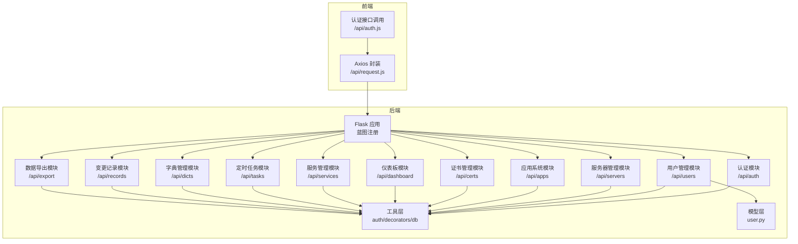
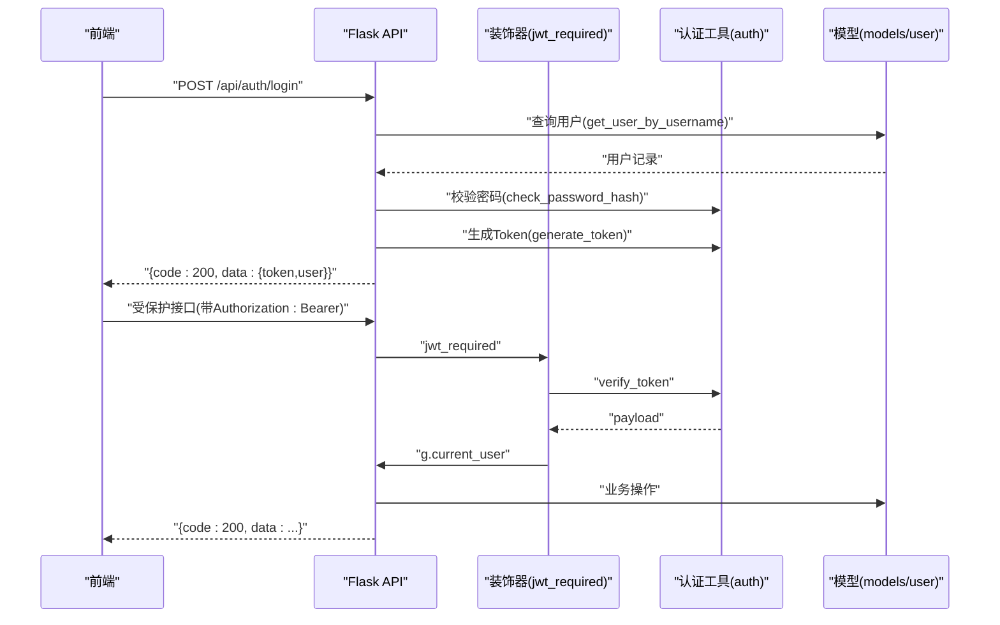
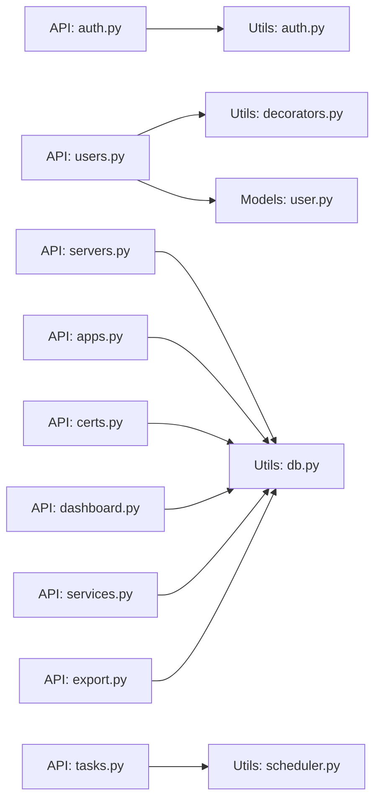

# API接口文档

<cite>
**本文档引用的文件**
- [auth.py](file://backend/app/api/auth.py)
- [users.py](file://backend/app/api/users.py)
- [servers.py](file://backend/app/api/servers.py)
- [apps.py](file://backend/app/api/apps.py)
- [certs.py](file://backend/app/api/certs.py)
- [dashboard.py](file://backend/app/api/dashboard.py)
- [services.py](file://backend/app/api/services.py)
- [tasks.py](file://backend/app/api/tasks.py)
- [dicts.py](file://backend/app/api/dicts.py)
- [records.py](file://backend/app/api/records.py)
- [export.py](file://backend/app/api/export.py)
- [auth.py](file://backend/app/utils/auth.py)
- [decorators.py](file://backend/app/utils/decorators.py)
- [user.py](file://backend/app/models/user.py)
- [auth.js](file://frontend/src/api/auth.js)
- [request.js](file://frontend/src/api/request.js)
- [config.py](file://backend/app/config.py)
</cite>

## 目录
1. [简介](#简介)
2. [项目结构](#项目结构)
3. [核心组件](#核心组件)
4. [架构总览](#架构总览)
5. [详细组件分析](#详细组件分析)
6. [依赖分析](#依赖分析)
7. [性能考虑](#性能考虑)
8. [故障排除指南](#故障排除指南)
9. [结论](#结论)
10. [附录](#附录)

## 简介
本文件为云运维平台的完整RESTful API接口文档，覆盖认证与授权、用户管理、服务器管理、应用系统管理、证书管理、仪表板统计、服务管理、定时任务、字典管理、变更记录以及数据导出等模块。文档详细描述各接口的HTTP方法、URL模式、请求参数、响应格式、错误码、认证与鉴权流程、参数校验规则、业务约束、版本管理策略、错误处理策略、性能优化建议与安全考虑，并提供每个接口的请求与响应示例及最佳实践。

## 项目结构
后端采用Flask微服务架构，按功能模块划分蓝图（Blueprint），统一通过/api前缀暴露REST接口；前端基于Axios封装请求，自动注入JWT Bearer Token并统一封装错误处理。

图表来源
- [auth.py:1-184](file://backend/app/api/auth.py#L1-L184)
- [users.py:1-268](file://backend/app/api/users.py#L1-L268)
- [servers.py:1-232](file://backend/app/api/servers.py#L1-L232)
- [apps.py:1-168](file://backend/app/api/apps.py#L1-L168)
- [certs.py:1-145](file://backend/app/api/certs.py#L1-L145)
- [dashboard.py:1-91](file://backend/app/api/dashboard.py#L1-L91)
- [services.py:1-182](file://backend/app/api/services.py#L1-L182)
- [tasks.py:1-458](file://backend/app/api/tasks.py#L1-L458)
- [dicts.py:1-267](file://backend/app/api/dicts.py#L1-L267)
- [records.py:1-114](file://backend/app/api/records.py#L1-L114)
- [export.py:1-263](file://backend/app/api/export.py#L1-L263)
- [auth.py:1-83](file://backend/app/utils/auth.py#L1-L83)
- [decorators.py:1-95](file://backend/app/utils/decorators.py#L1-L95)
- [user.py:1-183](file://backend/app/models/user.py#L1-L183)
- [request.js:1-54](file://frontend/src/api/request.js#L1-L54)
- [auth.js:1-14](file://frontend/src/api/auth.js#L1-L14)

章节来源
- [auth.py:1-184](file://backend/app/api/auth.py#L1-L184)
- [users.py:1-268](file://backend/app/api/users.py#L1-L268)
- [servers.py:1-232](file://backend/app/api/servers.py#L1-L232)
- [apps.py:1-168](file://backend/app/api/apps.py#L1-L168)
- [certs.py:1-145](file://backend/app/api/certs.py#L1-L145)
- [dashboard.py:1-91](file://backend/app/api/dashboard.py#L1-L91)
- [services.py:1-182](file://backend/app/api/services.py#L1-L182)
- [tasks.py:1-458](file://backend/app/api/tasks.py#L1-L458)
- [dicts.py:1-267](file://backend/app/api/dicts.py#L1-L267)
- [records.py:1-114](file://backend/app/api/records.py#L1-L114)
- [export.py:1-263](file://backend/app/api/export.py#L1-L263)
- [auth.py:1-83](file://backend/app/utils/auth.py#L1-L83)
- [decorators.py:1-95](file://backend/app/utils/decorators.py#L1-L95)
- [user.py:1-183](file://backend/app/models/user.py#L1-L183)
- [request.js:1-54](file://frontend/src/api/request.js#L1-L54)
- [auth.js:1-14](file://frontend/src/api/auth.js#L1-L14)

## 核心组件
- 认证与授权
  - JWT生成与校验：支持配置过期时间与密钥，提供Bearer Token认证。
  - 权限装饰器：统一处理Authorization头、Token解析、角色校验。
- 数据访问与模型
  - 用户模型：提供用户创建、查询、更新、删除与密码更新。
  - 数据库工具：统一获取连接、游标与事务控制。
- 前端请求封装
  - 自动注入Authorization头，统一对非200响应进行错误提示与路由跳转。

章节来源
- [auth.py:11-36](file://backend/app/utils/auth.py#L11-L36)
- [auth.py:38-56](file://backend/app/utils/auth.py#L38-L56)
- [decorators.py:9-57](file://backend/app/utils/decorators.py#L9-L57)
- [decorators.py:59-95](file://backend/app/utils/decorators.py#L59-L95)
- [user.py:8-37](file://backend/app/models/user.py#L8-L37)
- [user.py:39-58](file://backend/app/models/user.py#L39-L58)
- [user.py:61-80](file://backend/app/models/user.py#L61-L80)
- [user.py:83-102](file://backend/app/models/user.py#L83-L102)
- [user.py:105-136](file://backend/app/models/user.py#L105-L136)
- [user.py:138-158](file://backend/app/models/user.py#L138-L158)
- [user.py:161-182](file://backend/app/models/user.py#L161-L182)
- [request.js:14-23](file://frontend/src/api/request.js#L14-L23)
- [request.js:25-51](file://frontend/src/api/request.js#L25-L51)

## 架构总览
后端采用蓝图分层设计，接口统一返回标准JSON结构：{code, message, data}。前端通过Axios拦截器自动携带Token并处理错误。认证流程由装饰器完成，权限由角色装饰器控制。

图表来源
- [auth.py:14-82](file://backend/app/api/auth.py#L14-L82)
- [auth.py:11-36](file://backend/app/utils/auth.py#L11-L36)
- [auth.py:38-56](file://backend/app/utils/auth.py#L38-L56)
- [decorators.py:9-57](file://backend/app/utils/decorators.py#L9-L57)
- [user.py:39-58](file://backend/app/models/user.py#L39-L58)

## 详细组件分析

### 认证接口
- 登录
  - 方法与路径：POST /api/auth/login
  - 请求体：{"username": "xxx", "password": "xxx"}
  - 成功响应：{"code": 200, "message": "登录成功", "data": {"token": "xxx", "user": {...}}}
  - 错误码：400（请求体为空/缺少字段）、401（用户名或密码错误/用户未激活）
  - 参数校验：必填字段校验、密码哈希比对、用户激活状态检查
  - 安全考虑：密码使用哈希存储与校验，Token过期时间可配置
- 获取当前用户资料
  - 方法与路径：GET /api/auth/profile
  - 鉴权：需要JWT
  - 成功响应：{"code": 200, "data": {id, username, display_name, role, is_active, created_at}}
  - 错误码：401（缺少/无效Token）、404（用户不存在）
- 修改密码
  - 方法与路径：PUT /api/auth/password
  - 鉴权：需要JWT
  - 请求体：{"old_password": "xxx", "new_password": "xxx"}
  - 成功响应：{"code": 200, "message": "密码修改成功"}
  - 错误码：400（请求体为空/旧密码或新密码为空/新密码长度不足/旧密码错误）、404（用户不存在）、500（更新失败）

章节来源
- [auth.py:14-82](file://backend/app/api/auth.py#L14-L82)
- [auth.py:85-115](file://backend/app/api/auth.py#L85-L115)
- [auth.py:118-184](file://backend/app/api/auth.py#L118-L184)
- [auth.py:11-36](file://backend/app/utils/auth.py#L11-L36)
- [decorators.py:9-57](file://backend/app/utils/decorators.py#L9-L57)
- [user.py:39-58](file://backend/app/models/user.py#L39-L58)
- [user.py:61-80](file://backend/app/models/user.py#L61-L80)

### 用户管理接口
- 获取用户列表
  - 方法与路径：GET /api/users
  - 鉴权：JWT + 角色(admin)
  - 成功响应：{"code": 200, "data": [用户列表]}
- 创建用户
  - 方法与路径：POST /api/users
  - 鉴权：JWT + 角色(admin)
  - 请求体：{"username": "xxx", "password": "xxx", "display_name": "xxx", "role": "operator"}
  - 成功响应：{"code": 200, "message": "用户创建成功", "data": {"id": 用户ID}}
  - 错误码：400（缺少字段/角色非法/密码长度不足/重复用户名）、500（创建失败）
  - 参数校验：角色枚举校验、密码长度校验、用户名唯一性校验
- 更新用户信息
  - 方法与路径：PUT /api/users/{user_id}
  - 鉴权：JWT + 角色(admin)
  - 请求体：{"display_name": "xxx", "role": "xxx", "is_active": true/false}
  - 成功响应：{"code": 200, "message": "用户更新成功"}
  - 错误码：400（缺少字段/角色非法/无更新字段）、404（用户不存在）、500（更新失败）
- 删除用户
  - 方法与路径：DELETE /api/users/{user_id}
  - 鉴权：JWT + 角色(admin)
  - 业务约束：禁止删除当前登录用户
  - 成功响应：{"code": 200, "message": "用户删除成功"}
  - 错误码：400（删除自身）、404（用户不存在）、500（删除失败）
- 重置用户密码
  - 方法与路径：PUT /api/users/{user_id}/reset-password
  - 鉴权：JWT + 角色(admin)
  - 请求体：{"new_password": "xxx"}
  - 成功响应：{"code": 200, "message": "密码重置成功"}
  - 错误码：400（缺少字段/密码长度不足）、404（用户不存在）、500（重置失败）

章节来源
- [users.py:17-30](file://backend/app/api/users.py#L17-L30)
- [users.py:33-96](file://backend/app/api/users.py#L33-L96)
- [users.py:99-163](file://backend/app/api/users.py#L99-L163)
- [users.py:166-207](file://backend/app/api/users.py#L166-L207)
- [users.py:210-267](file://backend/app/api/users.py#L210-L267)
- [user.py:8-37](file://backend/app/models/user.py#L8-L37)
- [user.py:39-58](file://backend/app/models/user.py#L39-L58)
- [user.py:61-80](file://backend/app/models/user.py#L61-L80)
- [user.py:105-136](file://backend/app/models/user.py#L105-L136)
- [user.py:138-158](file://backend/app/models/user.py#L138-L158)
- [user.py:161-182](file://backend/app/models/user.py#L161-L182)

### 服务器管理接口
- 获取服务器列表
  - 方法与路径：GET /api/servers
  - 查询参数：env_type、search、page、page_size
  - 成功响应：{"code": 200, "data": {"items": 服务器列表, "total": 总数, "page": 页码, "page_size": 页大小}}
  - 业务约束：分页参数边界处理（最小1，最大100）
- 获取服务器详情
  - 方法与路径：GET /api/servers/{server_id}
  - 成功响应：{"code": 200, "data": {"server": 服务器详情, "services": 关联服务列表}}
  - 错误码：404（服务器不存在）
- 获取服务器简要列表
  - 方法与路径：GET /api/servers/list
  - 成功响应：{"code": 200, "data": [{id, env_type, hostname, inner_ip}, ...]}
- 创建服务器
  - 方法与路径：POST /api/servers
  - 鉴权：JWT + 角色(admin/operator)
  - 请求体：包含服务器字段集合
  - 成功响应：{"code": 200, "message": "创建成功", "data": {"id": 新增ID}}
  - 错误码：500（插入失败）
- 更新服务器
  - 方法与路径：PUT /api/servers/{server_id}
  - 鉴权：JWT + 角色(admin/operator)
  - 请求体：可选字段集合
  - 成功响应：{"code": 200, "message": "更新成功"}
  - 错误码：500（更新失败）
- 删除服务器
  - 方法与路径：DELETE /api/servers/{server_id}
  - 鉴权：JWT + 角色(admin/operator)
  - 成功响应：{"code": 200, "message": "删除成功"}
  - 错误码：500（删除失败）

章节来源
- [servers.py:11-72](file://backend/app/api/servers.py#L11-L72)
- [servers.py:75-107](file://backend/app/api/servers.py#L75-L107)
- [servers.py:110-127](file://backend/app/api/servers.py#L110-L127)
- [servers.py:130-165](file://backend/app/api/servers.py#L130-L165)
- [servers.py:168-204](file://backend/app/api/servers.py#L168-L204)
- [servers.py:207-231](file://backend/app/api/servers.py#L207-L231)

### 应用系统接口
- 获取应用系统列表
  - 方法与路径：GET /api/apps
  - 查询参数：search（name/company/access_url）、page、page_size
  - 成功响应：{"code": 200, "data": {"items": 列表, "total": 总数, "page": 页码, "page_size": 页大小}}
- 创建应用系统
  - 方法与路径：POST /api/apps
  - 鉴权：JWT + 角色(admin/operator)
  - 请求体：字段集合
  - 成功响应：{"code": 200, "message": "创建成功", "data": {"id": 新增ID}}
  - 错误码：500（插入失败）
- 更新应用系统
  - 方法与路径：PUT /api/apps/{app_id}
  - 鉴权：JWT + 角色(admin/operator)
  - 请求体：可选字段集合
  - 成功响应：{"code": 200, "message": "更新成功"}
  - 错误码：500（更新失败）
- 删除应用系统
  - 方法与路径：DELETE /api/apps/{app_id}
  - 鉴权：JWT + 角色(admin/operator)
  - 成功响应：{"code": 200, "message": "删除成功"}
  - 错误码：500（删除失败）

章节来源
- [apps.py:11-68](file://backend/app/api/apps.py#L11-L68)
- [apps.py:71-104](file://backend/app/api/apps.py#L71-L104)
- [apps.py:107-140](file://backend/app/api/apps.py#L107-L140)
- [apps.py:143-167](file://backend/app/api/apps.py#L143-L167)

### 证书管理接口
- 获取域名证书列表
  - 方法与路径：GET /api/certs
  - 查询参数：category、search
  - 成功响应：{"code": 200, "data": 证书列表}
- 创建域名证书记录
  - 方法与路径：POST /api/certs
  - 鉴权：JWT + 角色(admin/operator)
  - 请求体：字段集合
  - 成功响应：{"code": 200, "message": "创建成功", "data": {"id": 新增ID}}
  - 错误码：500（插入失败）
- 更新域名证书记录
  - 方法与路径：PUT /api/certs/{cert_id}
  - 鉴权：JWT + 角色(admin/operator)
  - 请求体：可选字段集合
  - 成功响应：{"code": 200, "message": "更新成功"}
  - 错误码：500（更新失败）
- 删除域名证书记录
  - 方法与路径：DELETE /api/certs/{cert_id}
  - 鉴权：JWT + 角色(admin/operator)
  - 成功响应：{"code": 200, "message": "删除成功"}
  - 错误码：500（删除失败）

章节来源
- [certs.py:11-43](file://backend/app/api/certs.py#L11-L43)
- [certs.py:46-80](file://backend/app/api/certs.py#L46-L80)
- [certs.py:83-117](file://backend/app/api/certs.py#L83-L117)
- [certs.py:120-144](file://backend/app/api/certs.py#L120-L144)

### 仪表板接口
- 获取统计数据
  - 方法与路径：GET /api/dashboard/stats
  - 鉴权：JWT
  - 成功响应：{"code": 200, "data": {"counts": {...}, "env_distribution": [...], "recent_certs": [...], "recent_records": [...]}}
  - 业务逻辑：统计各表数量、按环境类型分布、最近更新记录、证书到期提醒（动态计算剩余天数）

章节来源
- [dashboard.py:20-90](file://backend/app/api/dashboard.py#L20-L90)

### 服务管理接口
- 获取服务列表
  - 方法与路径：GET /api/services
  - 查询参数：category、search、env_type、page、page_size
  - 成功响应：{"code": 200, "data": {"items": 列表, "total": 总数, "page": 页码, "page_size": 页大小}}
- 创建服务
  - 方法与路径：POST /api/services
  - 鉴权：JWT + 角色(admin/operator)
  - 请求体：字段集合
  - 成功响应：{"code": 200, "message": "创建成功", "data": {"id": 新增ID}}
  - 错误码：500（插入失败）
- 更新服务
  - 方法与路径：PUT /api/services/{service_id}
  - 鉴权：JWT + 角色(admin/operator)
  - 请求体：可选字段集合
  - 成功响应：{"code": 200, "message": "更新成功"}
  - 错误码：500（更新失败）
- 删除服务
  - 方法与路径：DELETE /api/services/{service_id}
  - 鉴权：JWT + 角色(admin/operator)
  - 成功响应：{"code": 200, "message": "删除成功"}
  - 错误码：500（删除失败）

章节来源
- [services.py:11-83](file://backend/app/api/services.py#L11-L83)
- [services.py:86-118](file://backend/app/api/services.py#L86-L118)
- [services.py:121-154](file://backend/app/api/services.py#L121-L154)
- [services.py:157-181](file://backend/app/api/services.py#L157-L181)

### 定时任务接口
- 获取任务列表
  - 方法与路径：GET /api/tasks
  - 鉴权：JWT
  - 成功响应：{"code": 200, "data": 任务列表}
- 创建任务
  - 方法与路径：POST /api/tasks
  - 鉴权：JWT + 角色(admin/operator)
  - 表单字段：name、description、cron_expression、script（py/sh/sql）
  - 成功响应：{"code": 200, "message": "任务创建成功"}
  - 错误码：400（缺少字段/未上传脚本）、500（创建失败）
  - 业务逻辑：脚本文件保存至配置目录，加入调度器
- 更新任务
  - 方法与路径：PUT /api/tasks/{task_id}
  - 鉴权：JWT + 角色(admin/operator)
  - 表单字段：name、description、cron_expression、script（可选）
  - 成功响应：{"code": 200, "message": "任务更新成功"}
  - 错误码：404（任务不存在）、500（更新失败）
- 删除任务
  - 方法与路径：DELETE /api/tasks/{task_id}
  - 鉴权：JWT + 角色(admin/operator)
  - 成功响应：{"code": 200, "message": "任务删除成功"}
  - 错误码：404（任务不存在）、500（删除失败）
- 启用/禁用任务
  - 方法与路径：POST /api/tasks/{task_id}/toggle
  - 鉴权：JWT + 角色(admin/operator)
  - 成功响应：{"code": 200, "message": "任务已启用/已禁用", "data": {"is_active": 新状态}}
  - 错误码：404（任务不存在）、500（切换失败）
- 手动执行任务
  - 方法与路径：POST /api/tasks/{task_id}/run
  - 鉴权：JWT + 角色(admin/operator)
  - 成功响应：{"code": 200, "message": "任务已开始执行"}
  - 错误码：404（任务不存在）、400（脚本文件不存在）、500（执行失败）
  - 业务逻辑：异步执行脚本，记录任务日志与最新状态
- 获取任务日志
  - 方法与路径：GET /api/tasks/{task_id}/logs
  - 鉴权：JWT
  - 成功响应：{"code": 200, "data": 日志列表}
  - 错误码：404（任务不存在）、500（获取失败）

章节来源
- [tasks.py:33-60](file://backend/app/api/tasks.py#L33-L60)
- [tasks.py:63-136](file://backend/app/api/tasks.py#L63-L136)
- [tasks.py:139-209](file://backend/app/api/tasks.py#L139-L209)
- [tasks.py:212-254](file://backend/app/api/tasks.py#L212-L254)
- [tasks.py:257-306](file://backend/app/api/tasks.py#L257-L306)
- [tasks.py:309-420](file://backend/app/api/tasks.py#L309-L420)
- [tasks.py:423-457](file://backend/app/api/tasks.py#L423-L457)

### 字典管理接口
- 环境类型字典
  - GET /api/dicts/env-types
  - POST /api/dicts/env-types
  - PUT /api/dicts/env-types/{item_id}
  - DELETE /api/dicts/env-types/{item_id}
  - 业务约束：删除前检查是否被服务器表引用
- 平台字典
  - GET /api/dicts/platforms
  - POST /api/dicts/platforms
  - PUT /api/dicts/platforms/{item_id}
  - DELETE /api/dicts/platforms/{item_id}
  - 业务约束：删除前检查是否被服务器表引用
- 服务分类字典
  - GET /api/dicts/service-categories
  - POST /api/dicts/service-categories
  - PUT /api/dicts/service-categories/{item_id}
  - DELETE /api/dicts/service-categories/{item_id}
  - 业务约束：删除前检查是否被服务表引用

章节来源
- [dicts.py:124-168](file://backend/app/api/dicts.py#L124-L168)
- [dicts.py:173-217](file://backend/app/api/dicts.py#L173-L217)
- [dicts.py:222-266](file://backend/app/api/dicts.py#L222-L266)

### 变更记录接口
- 获取变更记录列表
  - 方法与路径：GET /api/records
  - 查询参数：search
  - 成功响应：{"code": 200, "data": 记录列表}
- 创建变更记录
  - 方法与路径：POST /api/records
  - 鉴权：JWT + 角色(admin/operator)
  - 请求体：字段集合
  - 成功响应：{"code": 200, "message": "创建成功", "data": {"id": 新增ID}}
  - 错误码：500（插入失败）
- 删除变更记录
  - 方法与路径：DELETE /api/records/{record_id}
  - 鉴权：JWT + 角色(admin/operator)
  - 成功响应：{"code": 200, "message": "删除成功"}
  - 错误码：500（删除失败）

章节来源
- [records.py:20-52](file://backend/app/api/records.py#L20-L52)
- [records.py:55-86](file://backend/app/api/records.py#L55-L86)
- [records.py:89-113](file://backend/app/api/records.py#L89-L113)

### 数据导出接口
- 导出Excel
  - 方法与路径：GET /api/export/excel
  - 鉴权：JWT
  - 成功响应：Excel文件流（多工作表：服务器管理、服务管理、应用系统、域名证书）
  - 错误码：500（导出失败）

章节来源
- [export.py:64-262](file://backend/app/api/export.py#L64-L262)

## 依赖分析
- 组件耦合
  - API层仅依赖工具层与模型层，职责清晰，便于测试与维护。
  - 装饰器统一处理认证与授权，避免在各接口重复实现。
- 外部依赖
  - Flask蓝图、Werkzeug安全工具、PyMySQL数据库驱动、openpyxl Excel导出库、APScheduler定时任务调度。
- 循环依赖
  - 未发现循环导入；认证与权限装饰器相互独立，互不依赖。

图表来源
- [auth.py:1-184](file://backend/app/api/auth.py#L1-L184)
- [users.py:1-268](file://backend/app/api/users.py#L1-L268)
- [servers.py:1-232](file://backend/app/api/servers.py#L1-L232)
- [apps.py:1-168](file://backend/app/api/apps.py#L1-L168)
- [certs.py:1-145](file://backend/app/api/certs.py#L1-L145)
- [dashboard.py:1-91](file://backend/app/api/dashboard.py#L1-L91)
- [services.py:1-182](file://backend/app/api/services.py#L1-L182)
- [tasks.py:1-458](file://backend/app/api/tasks.py#L1-L458)
- [export.py:1-263](file://backend/app/api/export.py#L1-L263)
- [auth.py:1-83](file://backend/app/utils/auth.py#L1-L83)
- [decorators.py:1-95](file://backend/app/utils/decorators.py#L1-L95)
- [user.py:1-183](file://backend/app/models/user.py#L1-L183)

## 性能考虑
- 分页与查询优化
  - 列表接口均支持分页与过滤，建议前端合理设置page_size上限（当前最大100）。
  - 复杂查询（JOIN）建议在数据库层面建立索引（如env_type、server_id、category等）。
- 缓存策略
  - 对高频读取的字典类数据（环境类型、平台、服务分类）可引入Redis缓存，降低数据库压力。
- 异步执行
  - 定时任务执行采用线程池异步化，避免阻塞主请求；建议限制并发数与超时时间。
- 连接池
  - 使用连接池减少频繁创建/销毁连接的成本（可在工具层引入连接池配置）。
- 前端优化
  - Axios统一超时与错误处理，避免重复请求；Token本地持久化，减少鉴权失败重试。

## 故障排除指南
- 认证相关
  - 401 缺少认证信息/认证格式错误：检查请求头Authorization是否为Bearer Token。
  - 401 Token无效或已过期：重新登录获取新Token；确认JWT_SECRET_KEY与过期时间配置。
  - 403 权限不足：确认用户角色是否满足接口要求。
- 用户管理
  - 409 用户名已存在：检查用户名唯一性；避免重复提交。
  - 400 密码长度不足：确保新密码至少6位。
- 服务器/应用/证书/服务管理
  - 404 资源不存在：确认ID有效性；检查软删除或级联删除影响。
  - 500 数据库异常：查看后端日志，确认事务回滚与SQL语法。
- 定时任务
  - 400 脚本文件不存在：确认脚本路径与上传目录权限。
  - 500 执行失败：检查脚本逻辑、超时与数据库连接配置。
- 导出
  - 500 导出失败：检查Excel库依赖与磁盘空间。

章节来源
- [decorators.py:22-46](file://backend/app/utils/decorators.py#L22-L46)
- [decorators.py:76-90](file://backend/app/utils/decorators.py#L76-L90)
- [users.py:78-83](file://backend/app/api/users.py#L78-L83)
- [users.py:70-75](file://backend/app/api/users.py#L70-L75)
- [servers.py:86-90](file://backend/app/api/servers.py#L86-L90)
- [tasks.py:325-326](file://backend/app/api/tasks.py#L325-L326)
- [export.py:258-260](file://backend/app/api/export.py#L258-L260)

## 结论
本API体系以Flask蓝图实现模块化设计，配合JWT认证与角色权限控制，覆盖运维平台核心业务场景。接口遵循统一响应规范与参数校验规则，具备良好的扩展性与安全性。建议在生产环境中完善密钥管理、连接池与缓存策略，并持续优化查询与导出性能。

## 附录

### 接口版本管理
- 当前版本：v1（/api/v1，若需扩展可增加前缀）
- 版本策略：向后兼容优先；破坏性变更通过新增版本与弃用策略过渡。

### 错误处理策略
- 统一响应结构：{"code": 数字, "message": "文本", "data": 可选}
- 常见错误码
  - 200：成功
  - 400：请求错误（参数缺失/格式错误/业务约束）
  - 401：未认证/Token无效
  - 403：权限不足
  - 404：资源不存在
  - 500：服务器内部错误

### 安全考虑
- 密钥管理：JWT_SECRET_KEY与数据库凭据需通过环境变量注入，避免硬编码。
- 输入校验：严格校验请求参数类型与范围，防止SQL注入与XSS。
- 传输安全：建议启用HTTPS，限制Cookie SameSite策略。
- 日志审计：敏感操作记录操作人与时间，便于追踪。

### 前端调用示例
- 登录
  - 请求：POST /api/auth/login
  - 请求体：{"username": "...", "password": "..."}
  - 成功后：localStorage保存token，后续请求自动附加Authorization头
- 获取个人资料
  - 请求：GET /api/auth/profile
  - 响应：{"code": 200, "data": {...}}

章节来源
- [auth.js:3-13](file://frontend/src/api/auth.js#L3-L13)
- [request.js:14-23](file://frontend/src/api/request.js#L14-L23)
- [request.js:25-51](file://frontend/src/api/request.js#L25-L51)