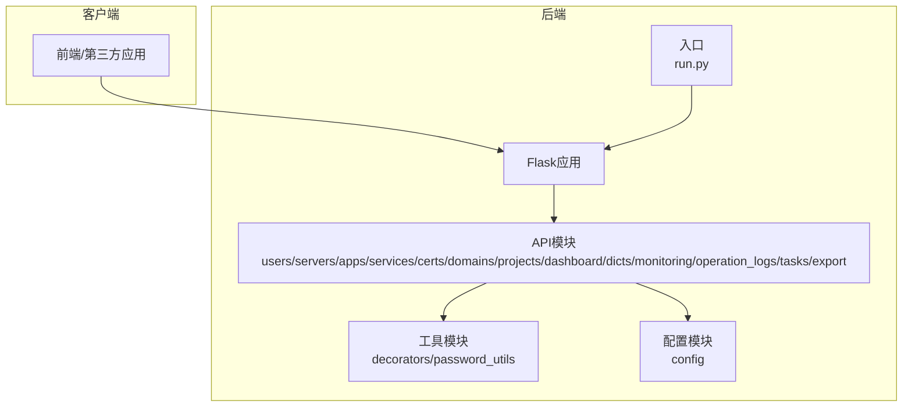
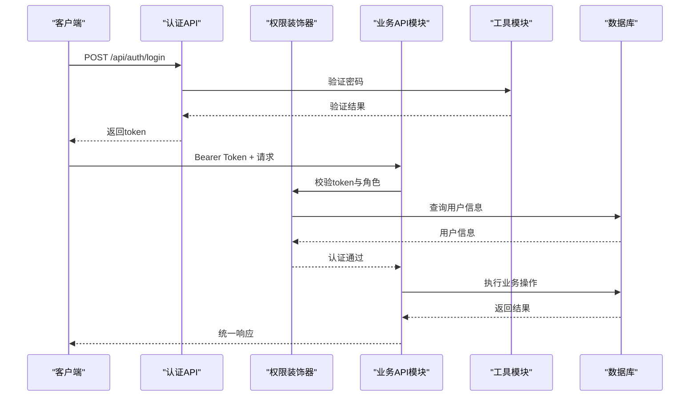
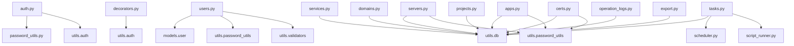

# API接口文档

<cite>
**本文档引用的文件**
- [auth.py](file://backend/app/api/auth.py)
- [users.py](file://backend/app/api/users.py)
- [servers.py](file://backend/app/api/servers.py)
- [apps.py](file://backend/app/api/apps.py)
- [services.py](file://backend/app/api/services.py)
- [certs.py](file://backend/app/api/certs.py)
- [domains.py](file://backend/app/api/domains.py)
- [projects.py](file://backend/app/api/projects.py)
- [dashboard.py](file://backend/app/api/dashboard.py)
- [dicts.py](file://backend/app/api/dicts.py)
- [monitoring.py](file://backend/app/api/monitoring.py)
- [operation_logs.py](file://backend/app/api/operation_logs.py)
- [tasks.py](file://backend/app/api/tasks.py)
- [export.py](file://backend/app/api/export.py)
- [decorators.py](file://backend/app/utils/decorators.py)
- [password_utils.py](file://backend/app/utils/password_utils.py)
- [config.py](file://backend/app/config.py)
- [run.py](file://backend/run.py)
</cite>

## 目录
1. [简介](#简介)
2. [项目结构](#项目结构)
3. [核心组件](#核心组件)
4. [架构概览](#架构概览)
5. [详细组件分析](#详细组件分析)
6. [依赖分析](#依赖分析)
7. [性能考虑](#性能考虑)
8. [故障排除指南](#故障排除指南)
9. [结论](#结论)
10. [附录](#附录)

## 简介
本文件为OPS平台的完整API接口文档，覆盖用户管理、服务器管理、应用管理、服务管理、证书管理、域名管理、项目管理、仪表盘统计、字典管理、监控配置、操作日志、定时任务、数据导出等模块。文档提供RESTful API的HTTP方法、URL模式、请求/响应模式、认证方法、参数说明、返回值定义、错误码说明及使用示例，并包含客户端集成指南、性能优化建议、版本管理与向后兼容性说明以及废弃API迁移指南。

## 项目结构
后端采用Flask微服务架构，API模块按功能划分在`backend/app/api/`目录下，工具类位于`backend/app/utils/`，配置位于`backend/app/config.py`，入口文件为`backend/run.py`。

**图表来源**
- [run.py:1-8](file://backend/run.py#L1-L8)
- [config.py:1-58](file://backend/app/config.py#L1-L58)

**章节来源**
- [run.py:1-8](file://backend/run.py#L1-L8)
- [config.py:1-58](file://backend/app/config.py#L1-L58)

## 核心组件
- 认证与授权：基于JWT的认证机制，支持角色权限控制（admin/operator/viewer）。
- 数据安全：密码使用bcrypt加密，敏感信息（服务器密码、阿里云密钥等）使用对称加密存储。
- 统一响应格式：所有接口返回统一的JSON结构，包含code、message、data等字段。
- 权限装饰器：`@jwt_required`和`@role_required`确保接口安全访问。
- 配置中心：通过环境变量集中管理数据库、JWT、CORS、监控等配置。

**章节来源**
- [auth.py:1-197](file://backend/app/api/auth.py#L1-L197)
- [decorators.py:1-163](file://backend/app/utils/decorators.py#L1-L163)
- [password_utils.py:1-130](file://backend/app/utils/password_utils.py#L1-L130)
- [config.py:1-58](file://backend/app/config.py#L1-L58)

## 架构概览
OPS平台采用前后端分离架构，后端提供RESTful API，前端通过Bearer Token进行认证调用。各API模块职责清晰，工具模块提供通用能力（认证、加密、校验），配置模块集中管理运行参数。

**图表来源**
- [auth.py:15-95](file://backend/app/api/auth.py#L15-L95)
- [decorators.py:26-123](file://backend/app/utils/decorators.py#L26-L123)
- [password_utils.py:52-91](file://backend/app/utils/password_utils.py#L52-L91)

## 详细组件分析

### 认证API
- 登录
  - 方法：POST
  - URL：/api/auth/login
  - 请求体：{"username": "xxx", "password": "xxx"}
  - 响应：{"code": 200, "message": "登录成功", "data": {"token": "xxx", "user": {...}}}
  - 错误码：400（请求体为空/参数缺失）、401（用户名或密码错误/用户禁用）、500（内部错误）
- 获取当前用户信息
  - 方法：GET
  - URL：/api/auth/profile
  - 认证：Bearer Token
  - 响应：{"code": 200, "data": {id, username, display_name, role, is_active, created_at}}
  - 错误码：401（未认证/Token无效）、404（用户不存在）
- 修改密码
  - 方法：PUT
  - URL：/api/auth/password
  - 认证：Bearer Token
  - 请求体：{"old_password": "xxx", "new_password": "xxx"}
  - 响应：{"code": 200, "message": "密码修改成功"}
  - 错误码：400（旧密码或新密码为空/新密码长度不足）、404（用户不存在）、500（修改失败）

**章节来源**
- [auth.py:15-197](file://backend/app/api/auth.py#L15-L197)

### 用户管理API
- 获取用户列表
  - 方法：GET
  - URL：/api/users
  - 认证：Bearer Token + admin
  - 响应：{"code": 200, "data": [用户列表]}
  - 错误码：401（未认证/权限不足）、403（权限不足）
- 创建用户
  - 方法：POST
  - URL：/api/users
  - 认证：Bearer Token + admin
  - 请求体：{"username": "xxx", "password": "xxx", "display_name": "xxx", "role": "operator"}
  - 响应：{"code": 200, "message": "用户创建成功", "data": {"id": 用户ID}}
  - 错误码：400（请求体为空/参数缺失/用户名格式错误/角色非法/密码长度不足/用户名已存在）、409（用户名冲突）、500（创建失败）
- 更新用户信息
  - 方法：PUT
  - URL：/api/users/{user_id}
  - 认证：Bearer Token + admin
  - 请求体：{"display_name": "xxx", "role": "xxx", "is_active": true/false}
  - 响应：{"code": 200, "message": "用户更新成功"}
  - 错误码：400（请求体为空/角色非法/无更新字段）、404（用户不存在）、500（更新失败）
- 删除用户
  - 方法：DELETE
  - URL：/api/users/{user_id}
  - 认证：Bearer Token + admin
  - 响应：{"code": 200, "message": "用户删除成功"}
  - 错误码：400（不能删除当前登录用户）、404（用户不存在）、500（删除失败）
- 重置用户密码
  - 方法：PUT
  - URL：/api/users/{user_id}/reset-password
  - 认证：Bearer Token + admin
  - 请求体：{"new_password": "xxx"}
  - 响应：{"code": 200, "message": "密码重置成功"}
  - 错误码：400（请求体为空/新密码为空/密码长度不足）、404（用户不存在）、500（重置失败）

**章节来源**
- [users.py:19-290](file://backend/app/api/users.py#L19-L290)

### 服务器管理API
- 获取服务器列表
  - 方法：GET
  - URL：/api/servers
  - 认证：Bearer Token
  - 查询参数：env_type、platform、project_id、search、page、page_size
  - 响应：{"code": 200, "data": {"items": [...], "total": N, "page": P, "page_size": S}}
  - 错误码：500（数据库异常）
- 获取服务器详情
  - 方法：GET
  - URL：/api/servers/{server_id}
  - 认证：Bearer Token
  - 响应：{"code": 200, "data": {"server": {...}, "services": [...], "projects": [...]}}
  - 错误码：404（服务器不存在）、500（数据库异常）
- 获取服务器列表（简要）
  - 方法：GET
  - URL：/api/servers/list
  - 认证：Bearer Token
  - 响应：{"code": 200, "data": [...]}
- 创建服务器
  - 方法：POST
  - URL：/api/servers
  - 认证：Bearer Token + admin/operator
  - 请求体：服务器字段（主机名、IP、CPU、内存、磁盘、用途、系统账户/密码、Docker账户/密码、证书路径等）
  - 响应：{"code": 200, "message": "创建成功", "data": {"id": 服务器ID}}
  - 错误码：400（输入验证失败/字段长度/格式错误）、500（创建失败）
- 更新服务器
  - 方法：PUT
  - URL：/api/servers/{server_id}
  - 认证：Bearer Token + admin/operator
  - 请求体：允许字段白名单（env_type、platform、hostname、inner_ip、mapped_ip、public_ip、cpu、memory、sys_disk、data_disk、purpose、os_user、os_password、docker_user、docker_password、remark、cert_path）
  - 响应：{"code": 200, "message": "更新成功"}
  - 错误码：400（输入验证失败/字段长度/格式错误）、404（服务器不存在）、500（更新失败）
- 删除服务器
  - 方法：DELETE
  - URL：/api/servers/{server_id}
  - 认证：Bearer Token + admin/operator
  - 响应：{"code": 200, "message": "删除成功"}
  - 错误码：404（服务器不存在）、500（删除失败）

**章节来源**
- [servers.py:14-578](file://backend/app/api/servers.py#L14-L578)

### 应用系统管理API
- 获取应用系统列表
  - 方法：GET
  - URL：/api/accounts
  - 认证：Bearer Token
  - 查询参数：search（名称/公司/访问URL）、project_id、page、page_size
  - 响应：{"code": 200, "data": {"items": [...], "total": N, "page": P, "page_size": S}}
- 获取应用系统详情
  - 方法：GET
  - URL：/api/accounts/{app_id}
  - 认证：Bearer Token
  - 响应：{"code": 200, "data": {...}}
  - 错误码：404（应用不存在）
- 创建应用系统
  - 方法：POST
  - URL：/api/accounts
  - 认证：Bearer Token + admin/operator
  - 请求体：seq_no、name、company、access_url、username、password、remark、project_id
  - 响应：{"code": 200, "message": "创建成功", "data": {"id": 应用ID}}
  - 错误码：400（必填字段/长度/URL格式错误）、500（创建失败）
- 更新应用系统
  - 方法：PUT
  - URL：/api/accounts/{app_id}
  - 认证：Bearer Token + admin/operator
  - 请求体：允许字段白名单（seq_no、name、company、access_url、username、password、remark、project_id）
  - 响应：{"code": 200, "message": "更新成功"}
  - 错误码：400（必填字段/长度/URL格式错误）、404（应用不存在）、500（更新失败）
- 删除应用系统
  - 方法：DELETE
  - URL：/api/accounts/{app_id}
  - 认证：Bearer Token + admin/operator
  - 响应：{"code": 200, "message": "删除成功"}
  - 错误码：404（应用不存在）、500（删除失败）

**章节来源**
- [apps.py:14-343](file://backend/app/api/apps.py#L14-L343)

### 服务管理API
- 获取服务列表
  - 方法：GET
  - URL：/api/services
  - 认证：Bearer Token
  - 查询参数：category、search、env_type、project_id、page、page_size
  - 响应：{"code": 200, "data": {"items": [...], "total": N, "page": P, "page_size": S}}
- 创建服务
  - 方法：POST
  - URL：/api/services
  - 认证：Bearer Token + admin/operator
  - 请求体：server_id、category、service_name、version、inner_port、mapped_port、remark、project_id
  - 响应：{"code": 200, "message": "创建成功", "data": {"id": 服务ID}}
  - 错误码：500（创建失败）
- 更新服务
  - 方法：PUT
  - URL：/api/services/{service_id}
  - 认证：Bearer Token + admin/operator
  - 请求体：允许字段（server_id、category、service_name、version、inner_port、mapped_port、remark、project_id）
  - 响应：{"code": 200, "message": "更新成功"}
  - 错误码：500（更新失败）
- 删除服务
  - 方法：DELETE
  - URL：/api/services/{service_id}
  - 认证：Bearer Token + admin/operator
  - 响应：{"code": 200, "message": "删除成功"}
  - 错误码：500（删除失败）

**章节来源**
- [services.py:12-206](file://backend/app/api/services.py#L12-L206)

### 证书管理API
- 获取证书列表
  - 方法：GET
  - URL：/api/certs
  - 认证：Bearer Token
  - 查询参数：search（域名/项目名）、cert_type、project_id、page、page_size
  - 响应：{"code": 200, "data": {"items": [...], "total": N}}
- 手动添加证书
  - 方法：POST
  - URL：/api/certs
  - 认证：Bearer Token + admin/operator
  - 请求体：domain、project_id、cert_type、issuer、cert_expire_time、brand、cost、status、remark
  - 响应：{"code": 200, "message": "创建成功", "data": {"id": 证书ID}}
  - 错误码：400（日期格式错误/必填字段）、500（创建失败）
- 上传证书文件并解析创建
  - 方法：POST
  - URL：/api/certs/upload
  - 认证：Bearer Token + admin/operator
  - 请求体：multipart/form-data（cert_file、key_file、project_id、brand、cost、remark）
  - 响应：{"code": 200, "message": "上传成功", "data": {解析的证书信息}}
  - 错误码：400（文件类型/大小限制/证书解析失败/域名已存在）、500（上传失败）
- 更新证书
  - 方法：PUT
  - URL：/api/certs/{cert_id}
  - 认证：Bearer Token + admin/operator
  - 请求体：动态字段（domain、project_id、cert_type、issuer、cert_generate_time、cert_valid_days、cert_expire_time、brand、cost、status、remark）
  - 响应：{"code": 200, "message": "更新成功"}
  - 错误码：400（日期格式错误）、404（证书不存在）、500（更新失败）
- 删除证书
  - 方法：DELETE
  - URL：/api/certs/{cert_id}
  - 认证：Bearer Token + admin/operator
  - 响应：{"code": 200, "message": "删除成功"}
  - 错误码：404（证书不存在）、500（删除失败）
- 批量在线检测
  - 方法：POST
  - URL：/api/certs/check
  - 认证：Bearer Token + admin/operator
  - 请求体：可选ids数组（指定证书ID），不传则检测所有自动检测类型证书
  - 响应：{"code": 200, "message": "检测完成", "data": {统计结果}}
  - 错误码：500（检测失败）
- 单个证书检测
  - 方法：POST
  - URL：/api/certs/check/{cert_id}
  - 认证：Bearer Token + admin/operator
  - 响应：{"code": 200, "message": "检测成功", "data": {证书信息}}
  - 错误码：404（证书不存在）、500（检测失败）
- 同步阿里云证书（预留）
  - 方法：POST
  - URL：/api/certs/sync-aliyun
  - 认证：Bearer Token + admin/operator
  - 响应：{"code": 200, "message": "同步完成"}

**章节来源**
- [certs.py:154-798](file://backend/app/api/certs.py#L154-L798)

### 域名管理API
- 获取域名列表
  - 方法：GET
  - URL：/api/domains
  - 认证：Bearer Token
  - 查询参数：search（域名/持有者/注册商）、project_id、page、page_size
  - 响应：{"code": 200, "data": {"items": [...], "total": N}}
- 手动添加域名
  - 方法：POST
  - URL：/api/domains
  - 认证：Bearer Token + admin/operator
  - 请求体：domain_name、registrar、registration_date、expire_date、owner、dns_servers、status、cost、remark、project_id
  - 响应：{"code": 200, "message": "域名添加成功", "data": {"id": 域名ID}}
  - 错误码：400（请求体为空/域名为空/已存在）、500（添加失败）
- 更新域名
  - 方法：PUT
  - URL：/api/domains/{domain_id}
  - 认证：Bearer Token + admin/operator
  - 请求体：允许字段（domain_name、registrar、registration_date、expire_date、owner、dns_servers、status、cost、remark、project_id）
  - 响应：{"code": 200, "message": "域名更新成功"}
  - 错误码：400（请求体为空/域名冲突/无更新字段）、404（域名不存在）、500（更新失败）
- 删除域名
  - 方法：DELETE
  - URL：/api/domains/{domain_id}
  - 认证：Bearer Token + admin/operator
  - 响应：{"code": 200, "message": "域名删除成功"}
  - 错误码：404（域名不存在）、500（删除失败）
- 从阿里云同步域名
  - 方法：POST
  - URL：/api/domains/sync-aliyun
  - 认证：Bearer Token + admin/operator
  - 请求体：{"account_id": 1}
  - 响应：{"code": 200, "message": "同步成功", "data": {"total": N, "added": M, "skipped": K}}
  - 错误码：400（account_id为空）、404（账户不存在或禁用）、500（SDK未安装/创建客户端失败/查询失败）
- 触发域名到期预警通知
  - 方法：POST
  - URL：/api/domains/notify
  - 认证：Bearer Token + admin/operator
  - 响应：{"code": 200, "message": "通知发送成功", "data": {"total": N, "expired": X, "warning": Y}}
  - 错误码：400（未配置Webhook）、500（通知发送失败）

**章节来源**
- [domains.py:34-664](file://backend/app/api/domains.py#L34-L664)

### 项目管理API
- 获取项目列表
  - 方法：GET
  - URL：/api/projects
  - 认证：Bearer Token
  - 查询参数：search（项目名/负责人）、status、page、per_page
  - 响应：{"code": 200, "data": {"items": [...], "total": N, "page": P, "per_page": S}}
- 创建项目
  - 方法：POST
  - URL：/api/projects
  - 认证：Bearer Token + admin/operator
  - 请求体：project_name、description、owner、status、remark
  - 响应：{"code": 200, "message": "创建成功", "data": {"id": 项目ID}}
  - 错误码：400（项目名称为空/已存在）、500（创建失败）
- 获取项目详情
  - 方法：GET
  - URL：/api/projects/{project_id}
  - 认证：Bearer Token
  - 响应：{"code": 200, "data": {"project": {...}, "servers": [...], "services": [...], "domains": [...], "certs": [...], "accounts": [...]}}

- 更新项目
  - 方法：PUT
  - URL：/api/projects/{project_id}
  - 认证：Bearer Token + admin/operator
  - 请求体：允许字段（project_name、description、owner、status、remark）
  - 响应：{"code": 200, "message": "更新成功"}
  - 错误码：400（项目名称为空/已存在）、404（项目不存在）、500（更新失败）
- 删除项目
  - 方法：DELETE
  - URL：/api/projects/{project_id}
  - 认证：Bearer Token + admin/operator
  - 响应：{"code": 200, "message": "删除成功"}
  - 错误码：404（项目不存在）、500（删除失败）
- 关联服务器到项目
  - 方法：POST
  - URL：/api/projects/{project_id}/servers
  - 认证：Bearer Token + admin/operator
  - 请求体：{ server_ids: [1, 2, 3] }
  - 响应：{"code": 200, "message": "成功关联 X 台服务器", "data": {"added_count": X}}
  - 错误码：400（server_ids为空/无效ID）、404（项目不存在）、500（关联失败）
- 取消关联服务器
  - 方法：DELETE
  - URL：/api/projects/{project_id}/servers/{server_id}
  - 认证：Bearer Token + admin/operator
  - 响应：{"code": 200, "message": "取消关联成功"}
  - 错误码：404（项目不存在/未关联到此项目）、500（取消失败）

**章节来源**
- [projects.py:13-521](file://backend/app/api/projects.py#L13-L521)

### 仪表盘API
- 获取统计数据
  - 方法：GET
  - URL：/api/dashboard/stats
  - 认证：Bearer Token
  - 响应：{"code": 200, "data": {counts, env_distribution, service_distribution, account_distribution, project_distribution, recent_certs}}

**章节来源**
- [dashboard.py:22-129](file://backend/app/api/dashboard.py#L22-L129)

### 字典管理API
- 环境类型字典
  - GET /api/dicts/env-types：获取环境类型列表
  - POST /api/dicts/env-types：新增环境类型（admin）
  - PUT /api/dicts/env-types/{item_id}：修改环境类型（admin）
  - DELETE /api/dicts/env-types/{item_id}：删除环境类型（admin，检查服务器env_type引用）
- 平台字典
  - GET /api/dicts/platforms：获取平台列表
  - POST /api/dicts/platforms：新增平台（admin）
  - PUT /api/dicts/platforms/{item_id}：修改平台（admin）
  - DELETE /api/dicts/platforms/{item_id}：删除平台（admin，检查服务器platform引用）
- 服务分类字典
  - GET /api/dicts/service-categories：获取服务分类列表
  - POST /api/dicts/service-categories：新增服务分类（admin）
  - PUT /api/dicts/service-categories/{item_id}：修改服务分类（admin）
  - DELETE /api/dicts/service-categories/{item_id}：删除服务分类（admin，检查服务category引用）

**章节来源**
- [dicts.py:120-263](file://backend/app/api/dicts.py#L120-L263)

### 监控配置API
- 获取Grafana配置
  - 方法：GET
  - URL：/api/monitoring/config
  - 认证：Bearer Token
  - 响应：{"code": 200, "data": {"grafana_url": "...", "dashboards": [...]}}
  - 错误码：200（未配置时返回空URL和空dashboards）

**章节来源**
- [monitoring.py:11-42](file://backend/app/api/monitoring.py#L11-L42)

### 操作日志API
- 获取操作日志列表
  - 方法：GET
  - URL：/api/operation-logs
  - 认证：Bearer Token
  - 查询参数：module、action、username、start_date、end_date、page、page_size
  - 响应：{"code": 200, "data": {"items": [...], "total": N, "page": P, "page_size": S}}
- 获取模块列表
  - 方法：GET
  - URL：/api/operation-logs/modules
  - 认证：Bearer Token
  - 响应：{"code": 200, "data": ["模块1", "模块2", ...]}
- 获取操作类型列表
  - 方法：GET
  - URL：/api/operation-logs/actions
  - 认证：Bearer Token
  - 响应：{"code": 200, "data": ["动作1", "动作2", ...]}

**章节来源**
- [operation_logs.py:20-136](file://backend/app/api/operation_logs.py#L20-L136)

### 定时任务API
- 获取任务列表
  - 方法：GET
  - URL：/api/tasks
  - 认证：Bearer Token
  - 响应：{"code": 200, "data": [...]}
- 创建任务
  - 方法：POST
  - URL：/api/tasks
  - 认证：Bearer Token + admin/operator
  - 请求体：表单字段（name、description、cron_expression、execute_command、script_files[]）
  - 响应：{"code": 200, "message": "任务创建成功", "data": {"task_id": T, "script_files": [...]}}
  - 错误码：400（名称/表达式为空/文件类型不支持/无文件）、500（创建失败）
- 更新任务
  - 方法：PUT
  - URL：/api/tasks/{task_id}
  - 认证：Bearer Token + admin/operator
  - 请求体：表单字段（name、description、cron_expression、execute_command、remove_files、script_files[]）
  - 响应：{"code": 200, "message": "任务更新成功", "data": {"script_files": [...]}}
  - 错误码：400（名称/表达式为空/文件类型不支持）、404（任务不存在）、500（更新失败）
- 删除任务
  - 方法：DELETE
  - URL：/api/tasks/{task_id}
  - 认证：Bearer Token + admin/operator
  - 响应：{"code": 200, "message": "任务删除成功"}
  - 错误码：404（任务不存在）、500（删除失败）
- 启用/禁用任务
  - 方法：POST
  - URL：/api/tasks/{task_id}/toggle
  - 认证：Bearer Token + admin/operator
  - 响应：{"code": 200, "message": "任务已启用/已禁用", "data": {"is_active": true/false}}
  - 错误码：404（任务不存在）、500（切换失败）
- 手动执行任务
  - 方法：POST
  - URL：/api/tasks/{task_id}/run
  - 认证：Bearer Token + admin/operator
  - 响应：{"code": 200, "message": "任务已开始执行"}
  - 错误码：404（任务不存在）、500（执行失败）、503（调度服务未就绪）
- 获取任务执行日志
  - 方法：GET
  - URL：/api/tasks/{task_id}/logs
  - 认证：Bearer Token
  - 响应：{"code": 200, "data": [...]}
  - 错误码：404（任务不存在）、500（获取日志失败）

**章节来源**
- [tasks.py:105-667](file://backend/app/api/tasks.py#L105-L667)

### 数据导出API
- Excel导出
  - 方法：GET
  - URL：/api/export/excel
  - 认证：Bearer Token
  - 响应：xlsx文件（服务器、服务、应用、域名、证书五个工作表）
  - 错误码：500（导出失败）

**章节来源**
- [export.py:64-341](file://backend/app/api/export.py#L64-L341)

## 依赖分析
- 认证与授权
  - auth.py依赖password_utils进行密码验证，依赖utils.auth生成token。
  - decorators.py提供jwt_required和role_required装饰器，统一校验流程。
- 数据安全
  - password_utils提供bcrypt加密与Fernet对称加密，用于用户密码与敏感信息存储。
- 配置管理
  - config.py集中管理数据库、JWT、CORS、监控、告警等配置，run.py读取配置启动应用。
- API模块耦合
  - 各API模块通过utils.db获取数据库连接，通过utils.operation_log记录操作日志，通过validators进行输入校验。

**图表来源**
- [auth.py:1-197](file://backend/app/api/auth.py#L1-L197)
- [decorators.py:1-163](file://backend/app/utils/decorators.py#L1-L163)
- [password_utils.py:1-130](file://backend/app/utils/password_utils.py#L1-L130)
- [users.py:1-290](file://backend/app/api/users.py#L1-L290)
- [servers.py:1-578](file://backend/app/api/servers.py#L1-L578)
- [apps.py:1-343](file://backend/app/api/apps.py#L1-L343)
- [services.py:1-206](file://backend/app/api/services.py#L1-L206)
- [certs.py:1-800](file://backend/app/api/certs.py#L1-L800)
- [domains.py:1-664](file://backend/app/api/domains.py#L1-L664)
- [projects.py:1-521](file://backend/app/api/projects.py#L1-L521)
- [tasks.py:1-667](file://backend/app/api/tasks.py#L1-L667)
- [operation_logs.py:1-136](file://backend/app/api/operation_logs.py#L1-L136)
- [export.py:1-341](file://backend/app/api/export.py#L1-L341)

**章节来源**
- [auth.py:1-197](file://backend/app/api/auth.py#L1-L197)
- [decorators.py:1-163](file://backend/app/utils/decorators.py#L1-L163)
- [password_utils.py:1-130](file://backend/app/utils/password_utils.py#L1-L130)
- [users.py:1-290](file://backend/app/api/users.py#L1-L290)
- [servers.py:1-578](file://backend/app/api/servers.py#L1-L578)
- [apps.py:1-343](file://backend/app/api/apps.py#L1-L343)
- [services.py:1-206](file://backend/app/api/services.py#L1-L206)
- [certs.py:1-800](file://backend/app/api/certs.py#L1-L800)
- [domains.py:1-664](file://backend/app/api/domains.py#L1-L664)
- [projects.py:1-521](file://backend/app/api/projects.py#L1-L521)
- [tasks.py:1-667](file://backend/app/api/tasks.py#L1-L667)
- [operation_logs.py:1-136](file://backend/app/api/operation_logs.py#L1-L136)
- [export.py:1-341](file://backend/app/api/export.py#L1-L341)

## 性能考虑
- 分页与查询优化
  - 服务器、应用、服务、证书、域名、项目等列表接口均支持分页参数（page/page_size），默认每页10条，最大100条，避免一次性返回大量数据。
  - 查询参数支持模糊搜索与精确过滤，减少不必要的全表扫描。
- 缓存与索引
  - 建议在数据库层面为常用查询字段建立索引（如服务器env_type、platform，证书domain，域名domain_name等）。
- 响应序列化
  - 仪表盘与导出接口对datetime字段进行序列化处理，避免大对象传输导致的性能问题。
- 并发与线程
  - run.py启用多线程（threaded=True），适合轻量并发场景；高并发建议部署在WSGI服务器（如gunicorn）上。
- 文件上传与存储
  - 证书上传限制10MB以内，脚本文件支持.py与.sh，建议控制文件数量与体积，避免影响磁盘IO。

[本节为通用指导，无需具体文件分析]

## 故障排除指南
- 认证失败
  - 缺少Authorization头或格式错误：返回401，提示“缺少认证信息”或“认证格式错误，请使用 Bearer token”。
  - Token无效或过期：返回401，提示“Token 无效或已过期”。
  - 用户不存在或被禁用：返回401，提示“用户不存在”或“用户已被禁用”。
  - 密码修改后Token失效：返回401，提示“Token 已失效，请重新登录”。
- 权限不足
  - 非admin/operator/viewer角色访问受保护接口：返回403，提示“权限不足，需要角色: ...”。
- 数据库异常
  - 服务器、应用、服务、证书、域名、项目、任务等接口在数据库操作失败时返回500，包含错误信息。
- 文件上传错误
  - 证书/脚本文件类型不支持或超出大小限制：返回400，提示具体错误原因。
- 阿里云SDK相关
  - 未安装SDK或配置错误：返回500，提示SDK未安装或创建客户端失败。
- 导出失败
  - Excel导出过程中异常：返回500，提示“导出失败”。

**章节来源**
- [decorators.py:35-114](file://backend/app/utils/decorators.py#L35-L114)
- [auth.py:47-72](file://backend/app/api/auth.py#L47-L72)
- [servers.py:347-352](file://backend/app/api/servers.py#L347-L352)
- [apps.py:207-213](file://backend/app/api/apps.py#L207-L213)
- [tasks.py:244-254](file://backend/app/api/tasks.py#L244-L254)
- [domains.py:345-349](file://backend/app/api/domains.py#L345-L349)
- [export.py:339-341](file://backend/app/api/export.py#L339-L341)

## 结论
OPS平台API设计遵循RESTful风格，统一响应格式与认证授权机制，覆盖运维管理的各个关键环节。通过字典管理、监控配置、操作日志与定时任务等辅助模块，形成完整的运维自动化体系。建议在生产环境中严格配置JWT与敏感数据加密密钥，合理设置CORS与文件上传策略，并结合数据库索引与分页查询提升性能。

[本节为总结性内容，无需具体文件分析]

## 附录

### API使用示例
- 登录获取Token
  - POST /api/auth/login
  - 请求体：{"username": "admin", "password": "your_password"}
  - 成功响应包含token，后续请求在Authorization头中使用Bearer token。
- 获取服务器列表
  - GET /api/servers?page=1&page_size=10
  - 认证：Bearer token
  - 响应：{"code": 200, "data": {"items": [...], "total": N, "page": 1, "page_size": 10}}
- 创建服务器
  - POST /api/servers
  - 认证：Bearer token + admin/operator
  - 请求体：包含服务器字段（主机名、IP、CPU、内存、磁盘、用途、系统账户/密码、Docker账户/密码、证书路径等）
  - 响应：{"code": 200, "message": "创建成功", "data": {"id": 服务器ID}}
- Excel导出
  - GET /api/export/excel
  - 认证：Bearer token
  - 响应：xlsx文件（包含服务器、服务、应用、域名、证书五个工作表）

**章节来源**
- [auth.py:15-95](file://backend/app/api/auth.py#L15-L95)
- [servers.py:14-115](file://backend/app/api/servers.py#L14-L115)
- [servers.py:189-354](file://backend/app/api/servers.py#L189-L354)
- [export.py:64-341](file://backend/app/api/export.py#L64-L341)

### 客户端集成指南
- 认证流程
  - 先调用登录接口获取token，然后在后续请求的Authorization头中使用Bearer token。
- CORS配置
  - 通过环境变量CORS_ORIGINS配置允许的源，CORS_ALLOW_ALL可设置为true允许任意源（不携带credentials）。
- 文件上传
  - 证书上传使用multipart/form-data，注意文件大小限制与类型校验。
- 错误处理
  - 根据code字段判断错误类型，401/403/404/500分别对应认证失败、权限不足、资源不存在、服务器错误。

**章节来源**
- [config.py:32-38](file://backend/app/config.py#L32-L38)
- [certs.py:342-465](file://backend/app/api/certs.py#L342-L465)

### 性能优化建议
- 合理使用分页参数，避免一次性请求过多数据。
- 在高频查询字段上建立数据库索引，减少查询时间。
- 控制文件上传大小与数量，避免磁盘IO瓶颈。
- 使用多线程或部署在WSGI服务器上提升并发处理能力。
- 对敏感数据进行缓存与压缩传输，减少网络开销。

[本节为通用指导，无需具体文件分析]

### API版本管理与向后兼容
- 版本策略
  - 当前API未显式版本号，建议在URL中加入/v1前缀（如/api/v1/users），以便未来演进。
- 向后兼容
  - 新增字段时保持默认值，避免破坏现有客户端逻辑。
  - 删除字段时保留兼容逻辑，逐步引导客户端迁移。
- 废弃API迁移
  - 对于计划废弃的接口，提前在响应中添加Deprecation头部与迁移指引，提供替代方案与截止日期。
  - 提供迁移脚本或工具，协助客户端升级。

[本节为通用指导，无需具体文件分析]