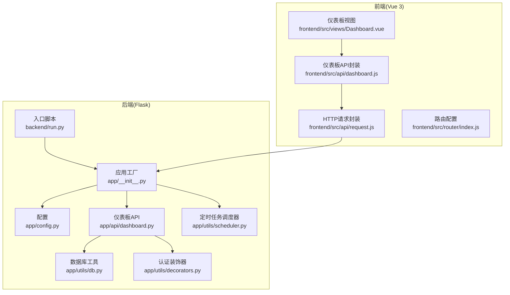
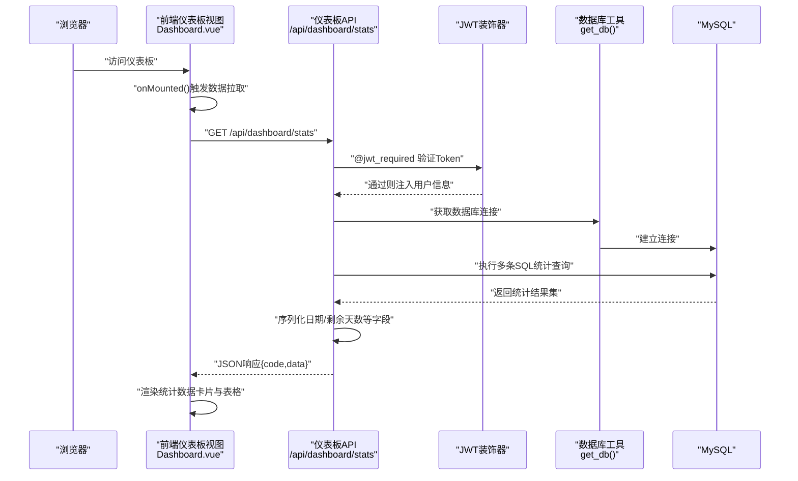
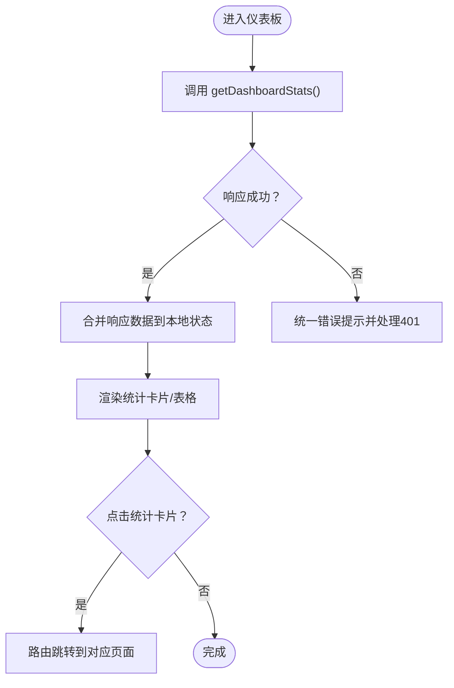
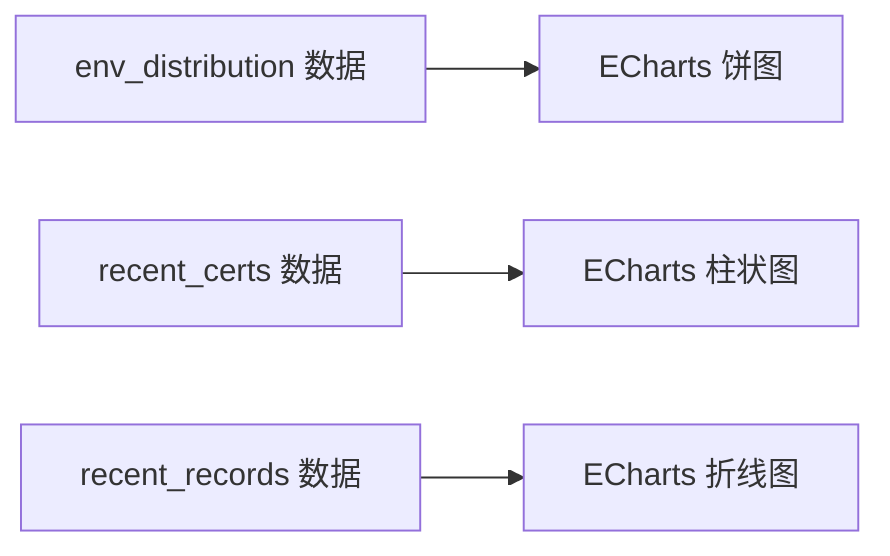
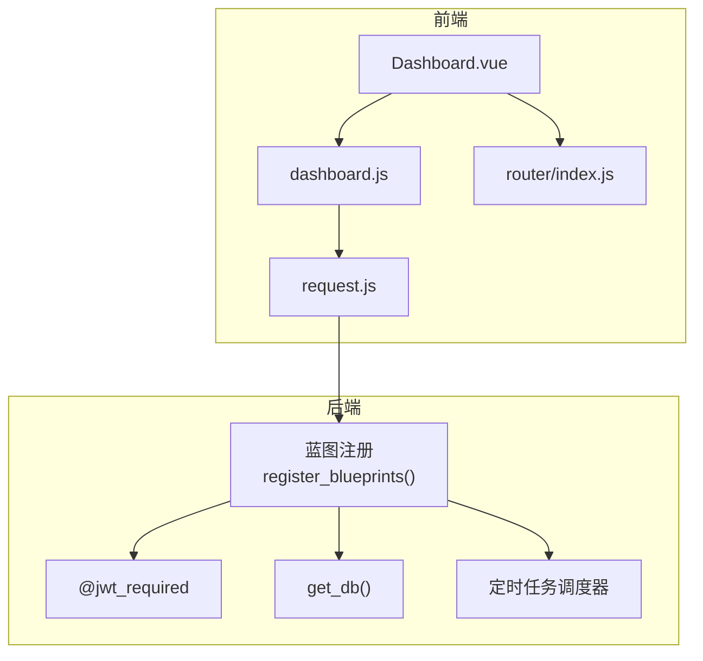

# 仪表板统计接口

<cite>
**本文档引用的文件**
- [backend/app/api/dashboard.py](file://backend/app/api/dashboard.py)
- [backend/app/utils/db.py](file://backend/app/utils/db.py)
- [backend/app/utils/decorators.py](file://backend/app/utils/decorators.py)
- [backend/app/__init__.py](file://backend/app/__init__.py)
- [backend/app/config.py](file://backend/app/config.py)
- [backend/run.py](file://backend/run.py)
- [frontend/src/views/Dashboard.vue](file://frontend/src/views/Dashboard.vue)
- [frontend/src/api/dashboard.js](file://frontend/src/api/dashboard.js)
- [frontend/src/api/request.js](file://frontend/src/api/request.js)
- [frontend/src/router/index.js](file://frontend/src/router/index.js)
</cite>

## 目录
1. [简介](#简介)
2. [项目结构](#项目结构)
3. [核心组件](#核心组件)
4. [架构总览](#架构总览)
5. [详细组件分析](#详细组件分析)
6. [依赖关系分析](#依赖关系分析)
7. [性能考虑](#性能考虑)
8. [故障排除指南](#故障排除指南)
9. [结论](#结论)
10. [附录](#附录)

## 简介
本文件为运维管理平台的仪表板统计接口提供完整API文档，覆盖以下四个核心接口：
- 获取系统概览：/api/dashboard/stats
- 获取环境分布统计：/api/dashboard/environment-stats（注：当前后端仅实现系统概览接口）
- 获取证书到期提醒：/api/dashboard/cert-expiry-reminder（注：当前后端仅实现系统概览接口）
- 获取最近更新记录：/api/dashboard/records（注：当前后端仅实现系统概览接口）

文档详细说明统计数据的计算逻辑、缓存策略与更新频率，并提供图表数据格式说明及前端集成示例（基于Element Plus与ECharts）。

## 项目结构
后端采用Flask微服务架构，通过蓝图组织API模块；前端使用Vue 3 + Element Plus构建仪表板界面。整体结构如下：

**图表来源**
- [backend/app/__init__.py:1-62](file://backend/app/__init__.py#L1-L62)
- [backend/app/config.py:1-21](file://backend/app/config.py#L1-L21)
- [backend/app/api/dashboard.py:1-91](file://backend/app/api/dashboard.py#L1-L91)
- [backend/app/utils/db.py:1-17](file://backend/app/utils/db.py#L1-L17)
- [backend/app/utils/decorators.py:1-95](file://backend/app/utils/decorators.py#L1-L95)
- [backend/run.py:1-8](file://backend/run.py#L1-L8)
- [frontend/src/views/Dashboard.vue:1-312](file://frontend/src/views/Dashboard.vue#L1-L312)
- [frontend/src/api/dashboard.js:1-6](file://frontend/src/api/dashboard.js#L1-L6)
- [frontend/src/api/request.js:1-54](file://frontend/src/api/request.js#L1-L54)
- [frontend/src/router/index.js:1-61](file://frontend/src/router/index.js#L1-L61)

**章节来源**
- [backend/app/__init__.py:1-62](file://backend/app/__init__.py#L1-L62)
- [backend/app/config.py:1-21](file://backend/app/config.py#L1-L21)
- [backend/run.py:1-8](file://backend/run.py#L1-L8)
- [frontend/src/views/Dashboard.vue:1-312](file://frontend/src/views/Dashboard.vue#L1-L312)
- [frontend/src/api/dashboard.js:1-6](file://frontend/src/api/dashboard.js#L1-L6)
- [frontend/src/api/request.js:1-54](file://frontend/src/api/request.js#L1-L54)
- [frontend/src/router/index.js:1-61](file://frontend/src/router/index.js#L1-L61)

## 核心组件
- 仪表板API蓝图：负责系统概览、环境分布、证书到期提醒、最近更新记录的数据聚合与返回。
- 数据库工具：提供统一的数据库连接获取方法，支持DictCursor以字典形式返回查询结果。
- 认证装饰器：JWT鉴权装饰器，校验Authorization头并注入用户信息。
- 前端仪表板视图：展示统计数据卡片、环境分布表格、证书到期提醒表格与最近更新记录表格。
- 前端API封装：统一封装仪表板接口调用，结合Axios拦截器自动附加JWT Token并处理响应错误。

**章节来源**
- [backend/app/api/dashboard.py:1-91](file://backend/app/api/dashboard.py#L1-L91)
- [backend/app/utils/db.py:1-17](file://backend/app/utils/db.py#L1-L17)
- [backend/app/utils/decorators.py:1-95](file://backend/app/utils/decorators.py#L1-L95)
- [frontend/src/views/Dashboard.vue:1-312](file://frontend/src/views/Dashboard.vue#L1-L312)
- [frontend/src/api/dashboard.js:1-6](file://frontend/src/api/dashboard.js#L1-L6)
- [frontend/src/api/request.js:1-54](file://frontend/src/api/request.js#L1-L54)

## 架构总览
下图展示了从浏览器到后端API再到数据库的完整调用链路，以及认证流程与数据序列化过程。

**图表来源**
- [frontend/src/views/Dashboard.vue:146-158](file://frontend/src/views/Dashboard.vue#L146-L158)
- [frontend/src/api/dashboard.js:3-5](file://frontend/src/api/dashboard.js#L3-L5)
- [backend/app/api/dashboard.py:20-91](file://backend/app/api/dashboard.py#L20-L91)
- [backend/app/utils/decorators.py:9-56](file://backend/app/utils/decorators.py#L9-L56)
- [backend/app/utils/db.py:5-16](file://backend/app/utils/db.py#L5-L16)

## 详细组件分析

### 接口：获取系统概览 /api/dashboard/stats
- 方法：GET
- 权限：需携带有效的Bearer Token
- 功能：一次性返回系统关键指标、环境分布、近期证书与更新记录
- 响应结构：
  - code: 200表示成功
  - data.counts：各业务表的数量统计
  - data.env_distribution：按环境类型分组的服务器数量分布
  - data.recent_certs：即将到期的证书列表（含剩余天数）
  - data.recent_records：最近变更记录（含格式化日期）

数据计算逻辑与字段处理：
- 数量统计：分别对servers、services、app_systems、domains_certs、change_records执行COUNT(*)。
- 环境分布：按env_type分组统计服务器数量，形成[{env_type,count}]数组。
- 证书到期提醒：查询domains_certs表，按到期日期升序排序，限制前10条；动态计算剩余天数并格式化日期。
- 最近更新记录：查询change_records中seq_no非空的记录，按变更日期倒序取前10条；序列化datetime字段为字符串。

缓存策略与更新频率：
- 当前实现未内置缓存层，每次请求均直接查询数据库。
- 建议：可在应用层引入Redis缓存或在Nginx/网关层设置短期缓存（如5-10分钟），以降低数据库压力。

错误处理：
- 认证失败返回401；Token无效或过期返回401。
- 数据库连接异常、SQL执行异常在后端抛出，前端统一通过响应拦截器提示。

**章节来源**
- [backend/app/api/dashboard.py:20-91](file://backend/app/api/dashboard.py#L20-L91)
- [backend/app/utils/decorators.py:9-56](file://backend/app/utils/decorators.py#L9-L56)
- [backend/app/utils/db.py:5-16](file://backend/app/utils/db.py#L5-L16)
- [frontend/src/views/Dashboard.vue:146-158](file://frontend/src/views/Dashboard.vue#L146-L158)
- [frontend/src/api/dashboard.js:3-5](file://frontend/src/api/dashboard.js#L3-L5)
- [frontend/src/api/request.js:25-51](file://frontend/src/api/request.js#L25-L51)

### 接口：获取环境分布统计 /api/dashboard/environment-stats
- 当前状态：后端尚未实现该接口。
- 建议实现方式：复用系统概览中的环境分布统计逻辑，返回标准化的[{env_type,count}]数据。

**章节来源**
- [backend/app/api/dashboard.py:45-48](file://backend/app/api/dashboard.py#L45-L48)

### 接口：获取证书到期提醒 /api/dashboard/cert-expiry-reminder
- 当前状态：后端尚未实现该接口。
- 建议实现方式：复用系统概览中的证书到期提醒逻辑，返回标准化的证书列表（含剩余天数、到期日期等）。

**章节来源**
- [backend/app/api/dashboard.py:58-72](file://backend/app/api/dashboard.py#L58-L72)

### 接口：获取最近更新记录 /api/dashboard/records
- 当前状态：后端尚未实现该接口。
- 建议实现方式：复用系统概览中的最近更新记录逻辑，返回标准化的变更记录列表。

**章节来源**
- [backend/app/api/dashboard.py:50-56](file://backend/app/api/dashboard.py#L50-L56)

### 前端集成示例（Element Plus）
- 仪表板视图：在组件挂载时调用API，将返回数据合并到响应式对象中，驱动UI渲染。
- 交互行为：点击统计卡片可跳转至对应管理页面；环境分布使用进度条展示占比；证书到期按剩余天数着色提示。
- 路由守卫：未登录用户重定向至登录页；管理员专属页面进行角色校验。

**图表来源**
- [frontend/src/views/Dashboard.vue:146-158](file://frontend/src/views/Dashboard.vue#L146-L158)
- [frontend/src/views/Dashboard.vue:160-189](file://frontend/src/views/Dashboard.vue#L160-L189)
- [frontend/src/router/index.js:35-58](file://frontend/src/router/index.js#L35-L58)

**章节来源**
- [frontend/src/views/Dashboard.vue:1-312](file://frontend/src/views/Dashboard.vue#L1-L312)
- [frontend/src/router/index.js:1-61](file://frontend/src/router/index.js#L1-L61)

### 前端集成示例（ECharts）
- 环境分布饼图：使用env_distribution数据生成饼图，标签显示环境类型与百分比。
- 证书到期趋势：使用recent_certs数据绘制柱状图，X轴为项目/主体，Y轴为剩余天数。
- 最近更新折线：使用recent_records数据绘制时间序列折线，X轴为变更日期，Y轴为记录条数（按日聚合）。

[此图为概念性示意，无需图表来源]

## 依赖关系分析
- 后端依赖：
  - Flask蓝图注册于应用工厂，统一CORS跨域配置。
  - 仪表板API依赖数据库工具与JWT装饰器。
  - 定时任务调度器独立于仪表板API，但共享数据库配置。
- 前端依赖：
  - 仪表板视图依赖API封装与HTTP拦截器。
  - 路由守卫确保认证与权限控制。

**图表来源**
- [backend/app/__init__.py:37-62](file://backend/app/__init__.py#L37-L62)
- [backend/app/utils/decorators.py:9-56](file://backend/app/utils/decorators.py#L9-L56)
- [backend/app/utils/db.py:5-16](file://backend/app/utils/db.py#L5-L16)
- [frontend/src/views/Dashboard.vue:129-158](file://frontend/src/views/Dashboard.vue#L129-L158)
- [frontend/src/api/dashboard.js:1-6](file://frontend/src/api/dashboard.js#L1-L6)
- [frontend/src/api/request.js:1-54](file://frontend/src/api/request.js#L1-L54)
- [frontend/src/router/index.js:1-61](file://frontend/src/router/index.js#L1-L61)

**章节来源**
- [backend/app/__init__.py:1-62](file://backend/app/__init__.py#L1-L62)
- [frontend/src/views/Dashboard.vue:1-312](file://frontend/src/views/Dashboard.vue#L1-L312)
- [frontend/src/api/dashboard.js:1-6](file://frontend/src/api/dashboard.js#L1-L6)
- [frontend/src/api/request.js:1-54](file://frontend/src/api/request.js#L1-L54)
- [frontend/src/router/index.js:1-61](file://frontend/src/router/index.js#L1-L61)

## 性能考虑
- 数据库查询：当前接口一次性执行多条COUNT与GROUP BY查询，建议在相关列上建立索引（如servers.env_type、domains_certs.expire_date、change_records.change_date）。
- 缓存策略：短期内可采用应用内缓存或Redis缓存，设置合理TTL（如5-10分钟），避免频繁全量统计。
- 分页与限制：recent_certs与recent_records已限制数量，建议在前端也做虚拟滚动或分页加载。
- 并发与连接池：数据库连接为短连接，建议在生产环境启用连接池或复用连接。

[本节为通用性能建议，不直接分析具体文件]

## 故障排除指南
- 认证失败（401）：
  - 检查前端是否正确在请求头添加Authorization: Bearer <token>。
  - 确认Token未过期且签名有效。
- 数据为空：
  - 确认目标表存在且有数据；检查数据库连接配置。
- 响应拦截器错误提示：
  - 前端统一拦截器会根据code字段提示错误消息，注意区分业务错误与网络错误。

**章节来源**
- [frontend/src/api/request.js:25-51](file://frontend/src/api/request.js#L25-L51)
- [backend/app/utils/decorators.py:22-45](file://backend/app/utils/decorators.py#L22-L45)

## 结论
仪表板统计接口目前实现了系统概览的核心能力，涵盖关键指标、环境分布、证书到期提醒与最近更新记录。建议尽快补齐environment-stats、cert-expiry-reminder与records三个接口，并引入缓存与索引优化以提升性能与用户体验。前端已提供完整的集成示例，可直接对接Element Plus或ECharts进行可视化展示。

[本节为总结性内容，不直接分析具体文件]

## 附录

### API定义与数据格式

- GET /api/dashboard/stats
  - 请求参数：无
  - 成功响应字段：
    - code: 200
    - data.counts: {servers, services, apps, certs, records}
    - data.env_distribution: [{env_type, count}]
    - data.recent_certs: [{project, entity, expire_date, remaining_days, ...}]
    - data.recent_records: [{seq_no, change_date, modifier, location, content, remark, ...}]
  - 错误响应字段：
    - code: 非200
    - message: 错误描述

**章节来源**
- [backend/app/api/dashboard.py:20-91](file://backend/app/api/dashboard.py#L20-L91)

### 前端集成步骤（Element Plus）
- 在仪表板视图中调用getDashboardStats()获取数据。
- 将返回的data合并到本地响应式对象，驱动UI渲染。
- 点击统计卡片跳转至对应管理页面。
- 使用进度条展示环境分布占比，按剩余天数着色证书到期提醒。

**章节来源**
- [frontend/src/views/Dashboard.vue:129-189](file://frontend/src/views/Dashboard.vue#L129-L189)
- [frontend/src/api/dashboard.js:1-6](file://frontend/src/api/dashboard.js#L1-L6)

### 前端集成步骤（ECharts）
- 环境分布：使用env_distribution生成饼图，标签包含环境类型与百分比。
- 证书到期：使用recent_certs生成柱状图，X轴为项目/主体，Y轴为剩余天数。
- 最近更新：使用recent_records生成折线图，X轴为变更日期，Y轴为当日记录数。

[本小节为概念性说明，无需章节来源]