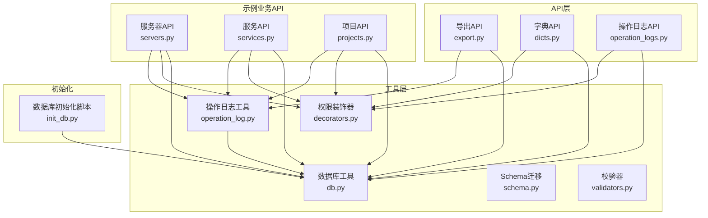
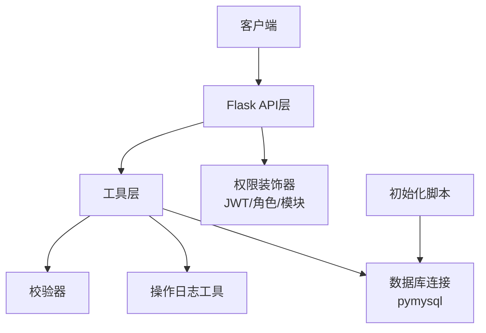
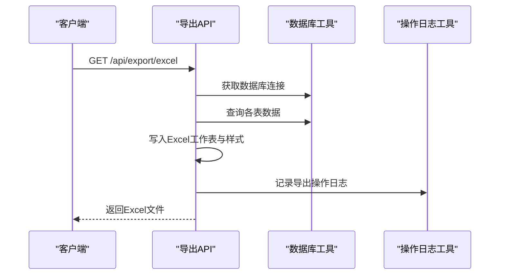
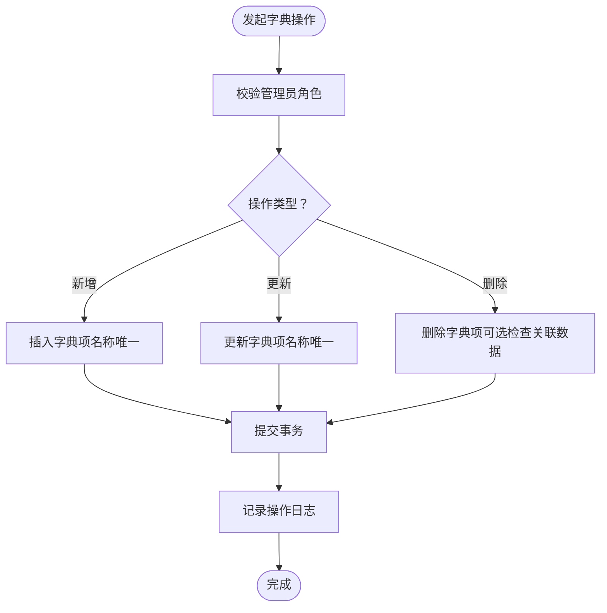
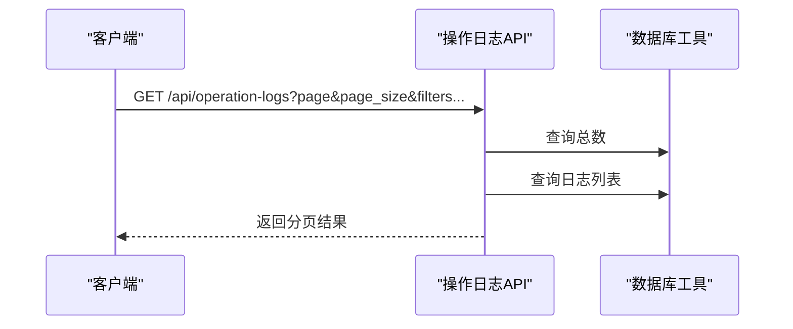
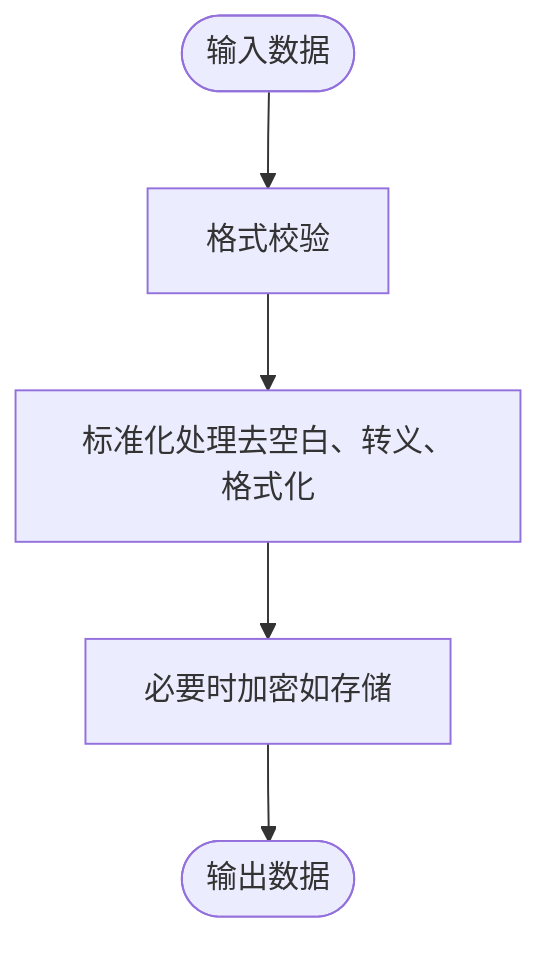
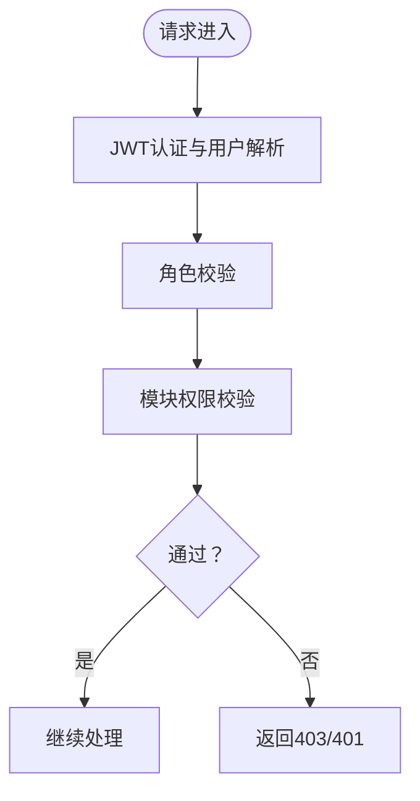
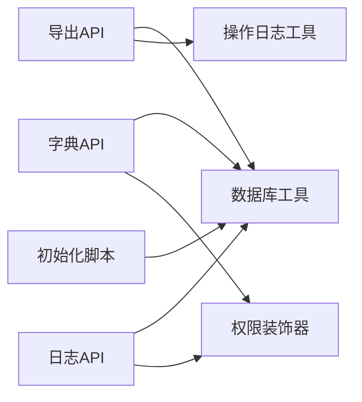

# 工具数据API

<cite>
**本文引用的文件**
- [export.py](file://backend/app/api/export.py)
- [dicts.py](file://backend/app/api/dicts.py)
- [operation_logs.py](file://backend/app/api/operation_logs.py)
- [operation_log.py](file://backend/app/utils/operation_log.py)
- [db.py](file://backend/app/utils/db.py)
- [decorators.py](file://backend/app/utils/decorators.py)
- [schema.py](file://backend/app/utils/schema.py)
- [validators.py](file://backend/app/utils/validators.py)
- [init_db.py](file://backend/init_db.py)
- [servers.py](file://backend/app/api/servers.py)
- [services.py](file://backend/app/api/services.py)
- [projects.py](file://backend/app/api/projects.py)
</cite>

## 目录
1. [简介](#简介)
2. [项目结构](#项目结构)
3. [核心组件](#核心组件)
4. [架构总览](#架构总览)
5. [详细组件分析](#详细组件分析)
6. [依赖分析](#依赖分析)
7. [性能考虑](#性能考虑)
8. [故障排查指南](#故障排查指南)
9. [结论](#结论)
10. [附录](#附录)

## 简介
本文件面向“工具数据API”模块，系统化梳理数据导出、字典数据管理、操作日志记录三大能力，并扩展到数据清洗、标准化、审计与合规、备份恢复与版本变更追踪等主题。文档基于实际代码实现，提供接口定义、数据模型、流程图与最佳实践建议，帮助开发者与运维人员快速理解与使用。

## 项目结构
后端采用Flask蓝图组织API，工具与数据管理相关模块集中在以下位置：
- API层：导出、字典、操作日志等
- 工具层：数据库连接、权限装饰器、日志记录、校验器等
- 初始化脚本：数据库建表与默认字典数据插入
- 示例业务API：服务器、服务、项目等（用于演示与集成）

图表来源
- [export.py:1-341](file://backend/app/api/export.py#L1-L341)
- [dicts.py:1-263](file://backend/app/api/dicts.py#L1-L263)
- [operation_logs.py:1-136](file://backend/app/api/operation_logs.py#L1-L136)
- [operation_log.py:1-173](file://backend/app/utils/operation_log.py#L1-L173)
- [db.py:1-80](file://backend/app/utils/db.py#L1-L80)
- [decorators.py:1-214](file://backend/app/utils/decorators.py#L1-L214)
- [schema.py:1-42](file://backend/app/utils/schema.py#L1-L42)
- [validators.py:1-151](file://backend/app/utils/validators.py#L1-L151)
- [init_db.py:1-431](file://backend/init_db.py#L1-L431)
- [servers.py:1-200](file://backend/app/api/servers.py#L1-L200)
- [services.py:1-200](file://backend/app/api/services.py#L1-L200)
- [projects.py:1-200](file://backend/app/api/projects.py#L1-L200)

章节来源
- [export.py:1-341](file://backend/app/api/export.py#L1-L341)
- [dicts.py:1-263](file://backend/app/api/dicts.py#L1-L263)
- [operation_logs.py:1-136](file://backend/app/api/operation_logs.py#L1-L136)
- [operation_log.py:1-173](file://backend/app/utils/operation_log.py#L1-L173)
- [db.py:1-80](file://backend/app/utils/db.py#L1-L80)
- [decorators.py:1-214](file://backend/app/utils/decorators.py#L1-L214)
- [schema.py:1-42](file://backend/app/utils/schema.py#L1-L42)
- [validators.py:1-151](file://backend/app/utils/validators.py#L1-L151)
- [init_db.py:1-431](file://backend/init_db.py#L1-L431)
- [servers.py:1-200](file://backend/app/api/servers.py#L1-L200)
- [services.py:1-200](file://backend/app/api/services.py#L1-L200)
- [projects.py:1-200](file://backend/app/api/projects.py#L1-L200)

## 核心组件
- 数据导出模块：支持多工作表导出，包含服务器、服务、应用、域名、证书等，统一格式化与样式，记录导出操作日志。
- 字典数据管理模块：提供环境类型、平台、服务分类等字典的增删改查，带唯一性约束与级联检查。
- 操作日志模块：提供日志查询、模块与动作枚举，支持分页与多维过滤，记录操作审计信息。
- 权限与安全：JWT认证、角色与模块权限控制、IP/User-Agent解析、密码字段加解密。
- 数据校验与标准化：IP、主机名、URL、端口、域名、用户名、邮箱等格式校验，字符串长度与正整数校验。
- Schema迁移：应用启动时对表结构进行幂等补全（如用户表新增字段）。

章节来源
- [export.py:64-341](file://backend/app/api/export.py#L64-L341)
- [dicts.py:118-263](file://backend/app/api/dicts.py#L118-L263)
- [operation_logs.py:20-136](file://backend/app/api/operation_logs.py#L20-L136)
- [operation_log.py:49-173](file://backend/app/utils/operation_log.py#L49-L173)
- [decorators.py:26-214](file://backend/app/utils/decorators.py#L26-L214)
- [validators.py:6-151](file://backend/app/utils/validators.py#L6-L151)
- [schema.py:10-42](file://backend/app/utils/schema.py#L10-L42)

## 架构总览
整体采用“API层-工具层-数据层”的分层设计，API层负责对外接口，工具层提供通用能力（认证、日志、校验、数据库连接），数据层由MySQL承载。

图表来源
- [export.py:1-341](file://backend/app/api/export.py#L1-L341)
- [dicts.py:1-263](file://backend/app/api/dicts.py#L1-L263)
- [operation_logs.py:1-136](file://backend/app/api/operation_logs.py#L1-L136)
- [operation_log.py:1-173](file://backend/app/utils/operation_log.py#L1-L173)
- [db.py:1-80](file://backend/app/utils/db.py#L1-L80)
- [decorators.py:1-214](file://backend/app/utils/decorators.py#L1-L214)
- [validators.py:1-151](file://backend/app/utils/validators.py#L1-L151)
- [init_db.py:1-431](file://backend/init_db.py#L1-L431)

## 详细组件分析

### 数据导出接口
- 接口：GET /api/export/excel
- 功能：一次性导出多个工作表（服务器、服务、应用、域名、证书），自动设置列宽、样式，统一日期格式化，异常时返回错误。
- 输出：application/vnd.openxmlformats-officedocument.spreadsheetml.sheet（.xlsx）
- 审计：调用操作日志工具记录导出行为，包含文件名等详情。
- 扩展点：可按需增加更多工作表或调整样式、列宽策略。

图表来源
- [export.py:64-341](file://backend/app/api/export.py#L64-L341)
- [operation_log.py:49-119](file://backend/app/utils/operation_log.py#L49-L119)
- [db.py:43-80](file://backend/app/utils/db.py#L43-L80)

章节来源
- [export.py:64-341](file://backend/app/api/export.py#L64-L341)
- [operation_log.py:49-119](file://backend/app/utils/operation_log.py#L49-L119)
- [db.py:43-80](file://backend/app/utils/db.py#L43-L80)

### 字典数据管理接口
- 环境类型字典：GET/POST/PUT/DELETE /api/dicts/env-types
- 平台字典：GET/POST/PUT/DELETE /api/dicts/platforms
- 服务分类字典：GET/POST/PUT/DELETE /api/dicts/service-categories
- 统一规则：
  - 新增/更新时支持排序号与名称，名称唯一。
  - 删除前可选检查关联数据（如服务器/服务/域名等），避免破坏性删除。
  - 需要管理员角色。
- 审计：所有变更均记录操作日志。

图表来源
- [dicts.py:118-263](file://backend/app/api/dicts.py#L118-L263)
- [decorators.py:126-162](file://backend/app/utils/decorators.py#L126-L162)
- [operation_log.py:49-119](file://backend/app/utils/operation_log.py#L49-L119)

章节来源
- [dicts.py:118-263](file://backend/app/api/dicts.py#L118-L263)
- [decorators.py:126-162](file://backend/app/utils/decorators.py#L126-L162)
- [operation_log.py:49-119](file://backend/app/utils/operation_log.py#L49-L119)

### 操作日志记录接口
- 日志查询：GET /api/operation-logs
  - 支持模块、动作、用户名、起止日期、分页查询。
  - 返回总数、当前页、每页大小与日志列表。
- 枚举查询：GET /api/operation-logs/modules, /api/operation-logs/actions
  - 返回可用模块与动作列表。
- 审计要点：记录用户、模块、动作、目标、详情、IP、UA、时间等。

图表来源
- [operation_logs.py:20-136](file://backend/app/api/operation_logs.py#L20-L136)
- [db.py:43-80](file://backend/app/utils/db.py#L43-L80)

章节来源
- [operation_logs.py:20-136](file://backend/app/api/operation_logs.py#L20-L136)
- [db.py:43-80](file://backend/app/utils/db.py#L43-L80)

### 数据清洗与标准化
- 校验器提供：
  - IP地址（IPv4/IPv6）、主机名、URL、端口、域名、密码、用户名、邮箱、整数、正整数、字符串长度等。
- 密码字段加解密：服务器与服务详情接口在返回前对敏感字段进行解密，避免明文泄露。
- 日期格式化：导出时将日期/时间统一格式化为字符串，避免不一致。

图表来源
- [validators.py:6-151](file://backend/app/utils/validators.py#L6-L151)
- [servers.py:92-104](file://backend/app/api/servers.py#L92-L104)
- [export.py:54-62](file://backend/app/api/export.py#L54-L62)

章节来源
- [validators.py:6-151](file://backend/app/utils/validators.py#L6-L151)
- [servers.py:92-104](file://backend/app/api/servers.py#L92-L104)
- [export.py:54-62](file://backend/app/api/export.py#L54-L62)

### 权限与安全
- JWT认证：校验令牌有效性、用户存在与启用状态、密码修改后旧令牌作废。
- 角色权限：仅允许指定角色执行敏感操作。
- 模块权限：非管理员需具备模块授权。
- 审计细节：记录IP（支持代理转发）、User-Agent、UTC时间戳。

图表来源
- [decorators.py:26-162](file://backend/app/utils/decorators.py#L26-L162)
- [operation_log.py:13-21](file://backend/app/utils/operation_log.py#L13-L21)

章节来源
- [decorators.py:26-162](file://backend/app/utils/decorators.py#L26-L162)
- [operation_log.py:13-21](file://backend/app/utils/operation_log.py#L13-L21)

### 数据备份恢复与版本管理
- 备份恢复：当前仓库未提供专用备份/恢复接口，但可通过导出接口导出全量数据作为离线备份；结合初始化脚本可重建环境。
- 版本管理：通过数据库Schema迁移工具在应用启动时对表结构进行幂等补全，避免重复执行导致错误。
- 变更追踪：操作日志记录所有关键变更，支持按模块/动作/时间范围检索，满足合规审计需求。

章节来源
- [export.py:64-341](file://backend/app/api/export.py#L64-L341)
- [schema.py:10-42](file://backend/app/utils/schema.py#L10-L42)
- [operation_logs.py:20-136](file://backend/app/api/operation_logs.py#L20-L136)

## 依赖分析
- API层依赖工具层：
  - 导出API依赖数据库连接与操作日志工具。
  - 字典API依赖数据库连接与权限装饰器。
  - 日志API依赖数据库连接与权限装饰器。
- 工具层内部耦合度低，职责清晰：
  - 数据库工具负责连接与关闭。
  - 权限装饰器负责认证与授权。
  - 操作日志工具负责记录审计。
  - 校验器提供数据质量保障。
- 初始化脚本独立于API层，负责建表与默认数据注入。

图表来源
- [export.py:1-341](file://backend/app/api/export.py#L1-L341)
- [dicts.py:1-263](file://backend/app/api/dicts.py#L1-L263)
- [operation_logs.py:1-136](file://backend/app/api/operation_logs.py#L1-L136)
- [db.py:1-80](file://backend/app/utils/db.py#L1-L80)
- [decorators.py:1-214](file://backend/app/utils/decorators.py#L1-L214)
- [operation_log.py:1-173](file://backend/app/utils/operation_log.py#L1-L173)
- [init_db.py:1-431](file://backend/init_db.py#L1-L431)

章节来源
- [export.py:1-341](file://backend/app/api/export.py#L1-L341)
- [dicts.py:1-263](file://backend/app/api/dicts.py#L1-L263)
- [operation_logs.py:1-136](file://backend/app/api/operation_logs.py#L1-L136)
- [db.py:1-80](file://backend/app/utils/db.py#L1-L80)
- [decorators.py:1-214](file://backend/app/utils/decorators.py#L1-L214)
- [operation_log.py:1-173](file://backend/app/utils/operation_log.py#L1-L173)
- [init_db.py:1-431](file://backend/init_db.py#L1-L431)

## 性能考虑
- 分页与索引：日志查询与业务列表查询均采用LIMIT/OFFSET分页，建议在高频查询字段上建立索引（如日志表的模块、动作、创建时间）。
- 连接池与超时：数据库连接设置连接超时，避免长时间占用；建议在生产环境引入连接池。
- Excel导出：多工作表写入与列宽计算可能影响性能，建议限制单次导出的数据量或拆分为多个文件。
- 审计开销：操作日志写入会带来额外I/O，建议在高并发场景评估日志落库策略（如异步队列）。

## 故障排查指南
- 认证失败：检查Authorization头格式、令牌有效性、用户状态与密码变更时间。
- 权限不足：确认角色与模块授权配置，管理员可绕过模块权限。
- 数据库连接失败：检查DB_HOST/PORT/USER/PASSWORD/NAME配置，查看日志中的脱敏提示。
- 导出异常：捕获异常并返回错误信息，检查数据库查询与Excel写入流程。
- 日志查询无结果：确认查询参数（模块/动作/日期范围）是否正确，注意分页边界。

章节来源
- [decorators.py:26-162](file://backend/app/utils/decorators.py#L26-L162)
- [db.py:28-80](file://backend/app/utils/db.py#L28-L80)
- [export.py:339-341](file://backend/app/api/export.py#L339-L341)
- [operation_logs.py:92-96](file://backend/app/api/operation_logs.py#L92-L96)

## 结论
本模块围绕“数据导出、字典管理、操作审计”构建了完整的工具数据API体系，辅以权限控制、数据校验与Schema迁移，满足日常运维与合规审计需求。建议在生产环境中进一步完善备份恢复机制、优化导出性能与日志写入策略，并持续补充更多工作表与字段以覆盖业务全貌。

## 附录

### API定义概览
- 数据导出
  - 方法：GET
  - 路径：/api/export/excel
  - 认证：JWT
  - 审计：记录模块“数据导出”、动作“export”
- 字典管理
  - 环境类型：GET/POST/PUT/DELETE /api/dicts/env-types
  - 平台：GET/POST/PUT/DELETE /api/dicts/platforms
  - 服务分类：GET/POST/PUT/DELETE /api/dicts/service-categories
  - 认证：JWT；删除需管理员角色；删除前可检查关联数据
- 操作日志
  - 查询：GET /api/operation-logs（支持模块/动作/用户名/日期/分页）
  - 枚举：GET /api/operation-logs/modules, /api/operation-logs/actions

章节来源
- [export.py:64-341](file://backend/app/api/export.py#L64-L341)
- [dicts.py:118-263](file://backend/app/api/dicts.py#L118-L263)
- [operation_logs.py:20-136](file://backend/app/api/operation_logs.py#L20-L136)