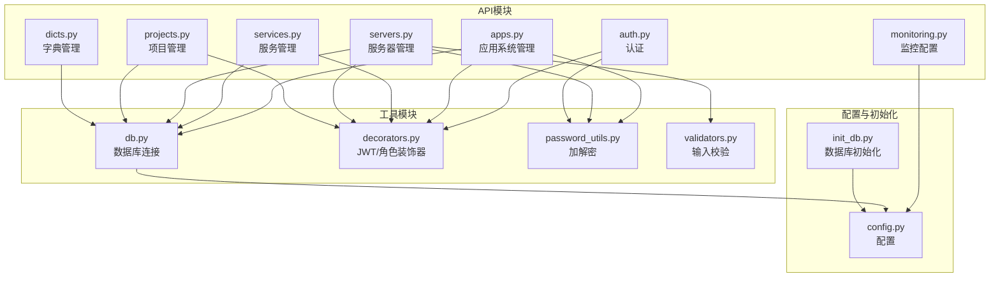
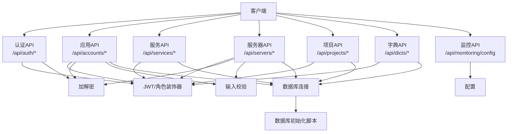
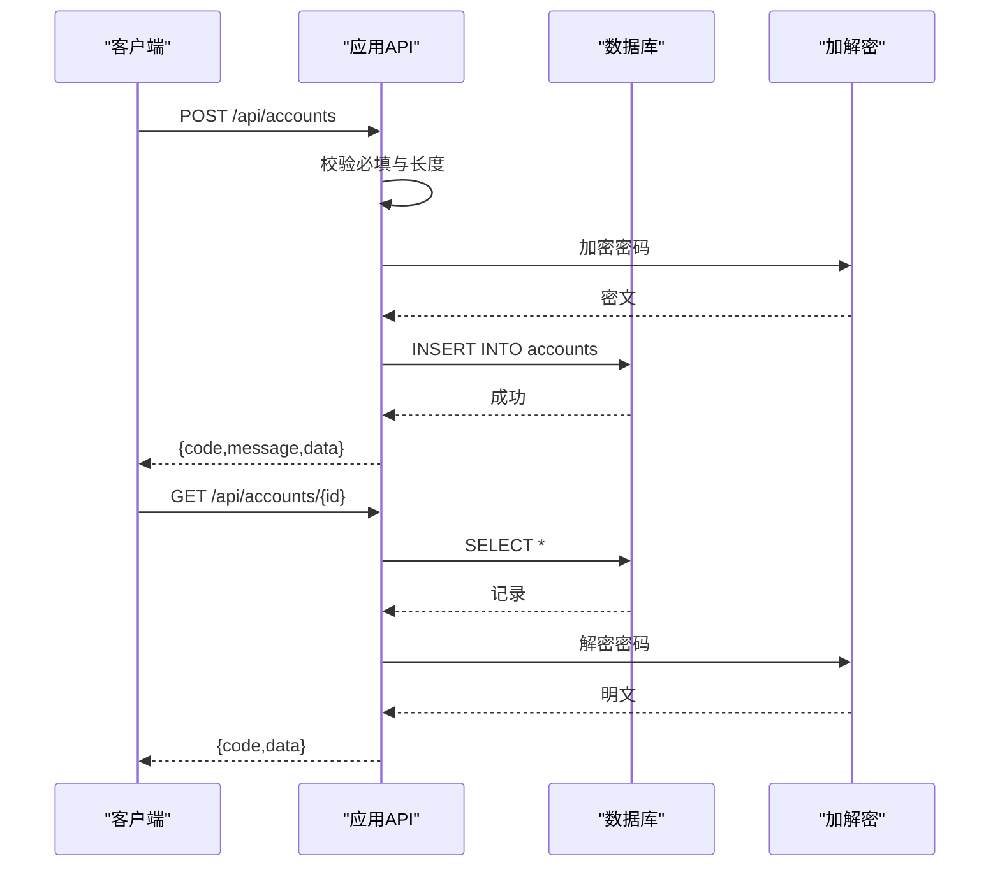
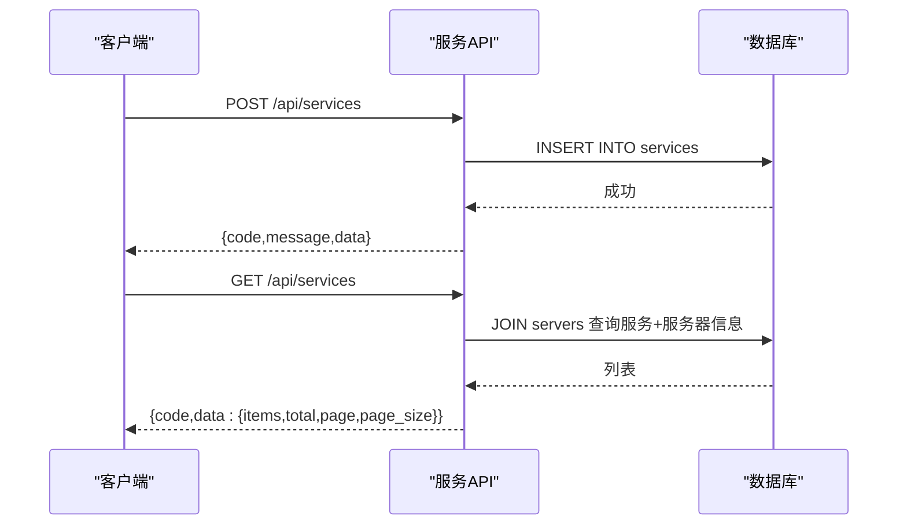
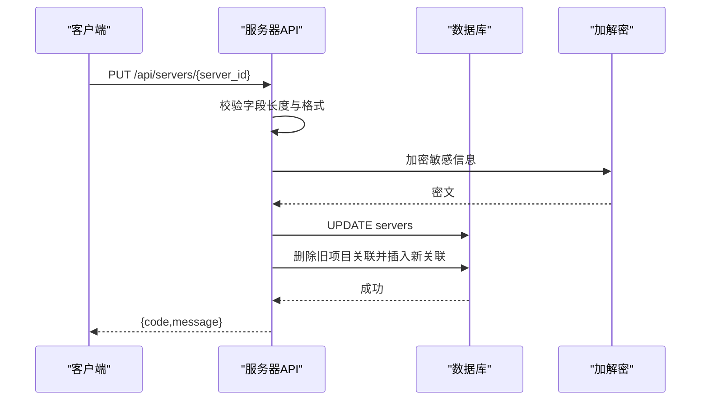
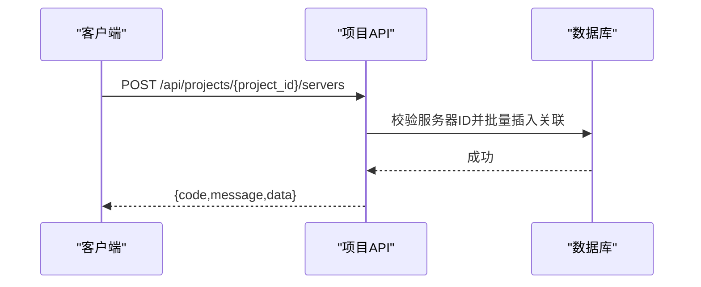
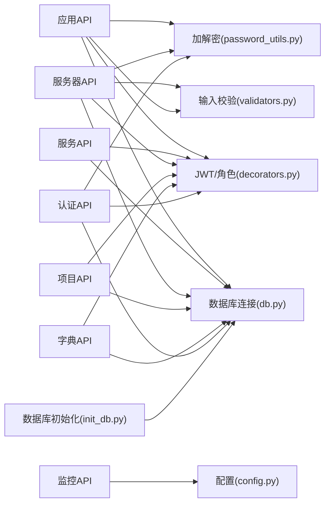
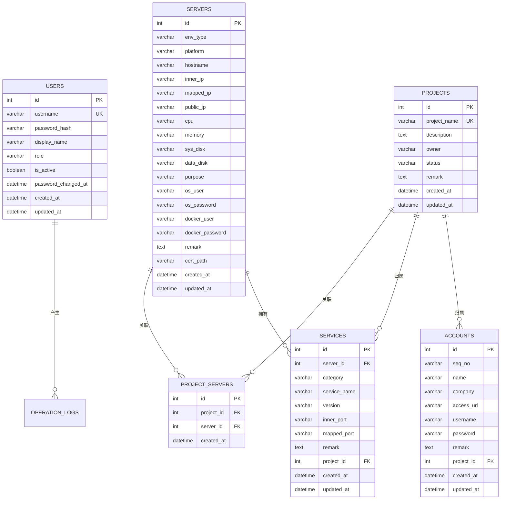

# 应用服务管理API

<cite>
**本文档引用的文件**
- [apps.py](file://backend/app/api/apps.py)
- [services.py](file://backend/app/api/services.py)
- [servers.py](file://backend/app/api/servers.py)
- [monitoring.py](file://backend/app/api/monitoring.py)
- [projects.py](file://backend/app/api/projects.py)
- [dicts.py](file://backend/app/api/dicts.py)
- [auth.py](file://backend/app/api/auth.py)
- [db.py](file://backend/app/utils/db.py)
- [decorators.py](file://backend/app/utils/decorators.py)
- [password_utils.py](file://backend/app/utils/password_utils.py)
- [validators.py](file://backend/app/utils/validators.py)
- [config.py](file://backend/app/config.py)
- [init_db.py](file://backend/init_db.py)
</cite>

## 目录
1. [简介](#简介)
2. [项目结构](#项目结构)
3. [核心组件](#核心组件)
4. [架构总览](#架构总览)
5. [详细组件分析](#详细组件分析)
6. [依赖分析](#依赖分析)
7. [性能考虑](#性能考虑)
8. [故障排查指南](#故障排查指南)
9. [结论](#结论)
10. [附录](#附录)

## 简介
本文件面向运维与开发人员，系统化梳理应用与服务管理相关API，覆盖应用系统管理、服务分类管理、服务器管理、项目管理、监控配置以及认证授权等模块。文档重点说明：
- 应用信息字段与部署配置
- 服务发现与健康检查机制
- 应用与服务器的关联关系
- 服务分类的层级结构
- 服务实例管理
- 应用部署流程、服务注册/注销、负载均衡配置建议
- 应用监控指标、日志收集、故障转移接口说明

## 项目结构
后端采用Flask微服务风格，按功能模块拆分API蓝图，统一通过装饰器实现JWT认证与角色控制，并通过工具模块实现数据库连接、密码加解密、输入校验等功能。

**图表来源**
- [apps.py:1-343](file://backend/app/api/apps.py#L1-L343)
- [services.py:1-206](file://backend/app/api/services.py#L1-L206)
- [servers.py:1-578](file://backend/app/api/servers.py#L1-L578)
- [projects.py:1-521](file://backend/app/api/projects.py#L1-L521)
- [monitoring.py:1-42](file://backend/app/api/monitoring.py#L1-L42)
- [dicts.py:1-263](file://backend/app/api/dicts.py#L1-L263)
- [auth.py:1-197](file://backend/app/api/auth.py#L1-L197)
- [db.py:1-80](file://backend/app/utils/db.py#L1-L80)
- [decorators.py:1-163](file://backend/app/utils/decorators.py#L1-L163)
- [password_utils.py:1-130](file://backend/app/utils/password_utils.py#L1-L130)
- [validators.py:1-151](file://backend/app/utils/validators.py#L1-L151)
- [config.py:1-58](file://backend/app/config.py#L1-L58)
- [init_db.py:1-395](file://backend/init_db.py#L1-L395)

**章节来源**
- [apps.py:1-343](file://backend/app/api/apps.py#L1-L343)
- [services.py:1-206](file://backend/app/api/services.py#L1-L206)
- [servers.py:1-578](file://backend/app/api/servers.py#L1-L578)
- [projects.py:1-521](file://backend/app/api/projects.py#L1-L521)
- [monitoring.py:1-42](file://backend/app/api/monitoring.py#L1-L42)
- [dicts.py:1-263](file://backend/app/api/dicts.py#L1-L263)
- [auth.py:1-197](file://backend/app/api/auth.py#L1-L197)
- [db.py:1-80](file://backend/app/utils/db.py#L1-L80)
- [decorators.py:1-163](file://backend/app/utils/decorators.py#L1-L163)
- [password_utils.py:1-130](file://backend/app/utils/password_utils.py#L1-L130)
- [validators.py:1-151](file://backend/app/utils/validators.py#L1-L151)
- [config.py:1-58](file://backend/app/config.py#L1-L58)
- [init_db.py:1-395](file://backend/init_db.py#L1-L395)

## 核心组件
- 应用系统管理：提供应用账号的增删改查、分页检索、字段校验与敏感信息加密。
- 服务管理：提供服务实例的增删改查、分页检索、与服务器的关联展示。
- 服务器管理：提供服务器台账的增删改查、分页检索、项目关联、敏感信息加密。
- 项目管理：提供项目全生命周期管理，聚合返回项目关联资源。
- 字典管理：提供环境类型、平台、服务分类等字典的维护。
- 监控配置：提供Grafana监控配置读取。
- 认证授权：提供登录、个人资料、密码修改与JWT鉴权。

**章节来源**
- [apps.py:14-343](file://backend/app/api/apps.py#L14-L343)
- [services.py:12-206](file://backend/app/api/services.py#L12-L206)
- [servers.py:14-578](file://backend/app/api/servers.py#L14-L578)
- [projects.py:13-521](file://backend/app/api/projects.py#L13-L521)
- [dicts.py:118-263](file://backend/app/api/dicts.py#L118-L263)
- [monitoring.py:11-42](file://backend/app/api/monitoring.py#L11-L42)
- [auth.py:15-197](file://backend/app/api/auth.py#L15-L197)

## 架构总览
系统采用“API层-工具层-配置层-数据库层”的分层设计，API层通过装饰器统一鉴权与角色控制，工具层负责数据库连接、加解密与输入校验，配置层集中管理运行参数，数据库层由初始化脚本创建表结构与字典数据。

**图表来源**
- [auth.py:15-197](file://backend/app/api/auth.py#L15-L197)
- [apps.py:14-343](file://backend/app/api/apps.py#L14-L343)
- [services.py:12-206](file://backend/app/api/services.py#L12-L206)
- [servers.py:14-578](file://backend/app/api/servers.py#L14-L578)
- [projects.py:13-521](file://backend/app/api/projects.py#L13-L521)
- [dicts.py:118-263](file://backend/app/api/dicts.py#L118-L263)
- [monitoring.py:11-42](file://backend/app/api/monitoring.py#L11-L42)
- [decorators.py:26-163](file://backend/app/utils/decorators.py#L26-L163)
- [password_utils.py:93-130](file://backend/app/utils/password_utils.py#L93-L130)
- [validators.py:6-151](file://backend/app/utils/validators.py#L6-L151)
- [db.py:43-80](file://backend/app/utils/db.py#L43-L80)
- [config.py:10-58](file://backend/app/config.py#L10-L58)
- [init_db.py:22-395](file://backend/init_db.py#L22-L395)

## 详细组件分析

### 应用系统管理API
- 功能概述：提供应用账号的增删改查、分页检索、字段校验与敏感信息加密。
- 关键接口
  - GET /api/accounts：分页查询应用列表，支持按名称/公司/访问URL模糊搜索、按项目过滤。
  - GET /api/accounts/{app_id}：获取应用详情，返回时对密码字段进行解密。
  - POST /api/accounts：创建应用，必填字段校验，密码加密存储。
  - PUT /api/accounts/{app_id}：更新应用，字段白名单与长度校验，密码加密更新。
  - DELETE /api/accounts/{app_id}：删除应用。
- 数据模型要点
  - 应用表字段：编号、名称、所属单位、访问地址、用户名、密码、备注、项目ID。
  - 敏感信息：密码采用对称加密存储，返回时解密。
- 权限与安全
  - 需JWT认证；创建/更新/删除需管理员或运营角色。
  - 输入严格校验，防止SQL注入与越权字段更新。

**图表来源**
- [apps.py:119-214](file://backend/app/api/apps.py#L119-L214)
- [apps.py:14-46](file://backend/app/api/apps.py#L14-L46)
- [password_utils.py:93-130](file://backend/app/utils/password_utils.py#L93-L130)

**章节来源**
- [apps.py:14-343](file://backend/app/api/apps.py#L14-L343)
- [password_utils.py:93-130](file://backend/app/utils/password_utils.py#L93-L130)
- [validators.py:41-57](file://backend/app/utils/validators.py#L41-L57)

### 服务管理API
- 功能概述：提供服务实例的增删改查、分页检索、与服务器的关联展示。
- 关键接口
  - GET /api/services：分页查询服务列表，支持按服务名/版本、分类、环境类型、项目过滤。
  - POST /api/services：创建服务，写入服务器ID、分类、服务名、版本、端口映射、备注、项目ID。
  - PUT /api/services/{service_id}：更新服务。
  - DELETE /api/services/{service_id}：删除服务。
- 数据模型要点
  - 服务表字段：服务器ID、分类、服务名、版本、内网端口、映射端口、备注、项目ID。
  - 与服务器表通过外键关联，删除服务器时级联删除服务。
- 权限与安全
  - 需JWT认证；创建/更新/删除需管理员或运营角色。

**图表来源**
- [services.py:91-128](file://backend/app/api/services.py#L91-L128)
- [services.py:12-89](file://backend/app/api/services.py#L12-L89)

**章节来源**
- [services.py:12-206](file://backend/app/api/services.py#L12-L206)

### 服务器管理API
- 功能概述：提供服务器台账的增删改查、分页检索、项目关联、敏感信息加密。
- 关键接口
  - GET /api/servers：分页查询服务器，支持按环境类型、平台、项目、主机名/IP模糊搜索。
  - GET /api/servers/list：获取服务器简要列表（供下拉选择）。
  - GET /api/servers/{server_id}：获取服务器详情，包含关联服务列表与项目列表，返回时对密码字段解密。
  - POST /api/servers：创建服务器，字段长度与格式校验，敏感信息加密存储。
  - PUT /api/servers/{server_id}：更新服务器，支持更新项目关联。
  - DELETE /api/servers/{server_id}：删除服务器（级联删除服务）。
- 数据模型要点
  - 服务器表字段：环境类型、平台、主机名、内网IP、映射IP、公网IP、CPU/内存/磁盘、用途、系统账户/密码、Docker账户/密码、证书路径、备注、项目ID。
  - 与项目通过多对多关联表维护。
- 权限与安全
  - 需JWT认证；创建/更新/删除需管理员或运营角色。

**图表来源**
- [servers.py:356-534](file://backend/app/api/servers.py#L356-L534)
- [password_utils.py:93-130](file://backend/app/utils/password_utils.py#L93-L130)

**章节来源**
- [servers.py:14-578](file://backend/app/api/servers.py#L14-L578)
- [validators.py:6-17](file://backend/app/utils/validators.py#L6-L17)
- [validators.py:20-38](file://backend/app/utils/validators.py#L20-L38)

### 项目管理API
- 功能概述：提供项目全生命周期管理，聚合返回项目关联资源（服务器、服务、域名、证书、账号）。
- 关键接口
  - GET /api/projects：分页查询项目，支持按名称/负责人模糊搜索、状态过滤。
  - GET /api/projects/{project_id}：获取项目详情，聚合返回服务器、服务、域名、证书、账号列表。
  - POST /api/projects：创建项目，名称唯一性校验。
  - PUT /api/projects/{project_id}：更新项目，名称唯一性校验。
  - DELETE /api/projects/{project_id}：删除项目（级联删除项目-服务器关联）。
  - POST /api/projects/{project_id}/servers：批量关联服务器到项目。
  - DELETE /api/projects/{project_id}/servers/{server_id}：取消关联单个服务器。
- 权限与安全
  - 需JWT认证；创建/更新/删除需管理员或运营角色。

**图表来源**
- [projects.py:385-465](file://backend/app/api/projects.py#L385-L465)

**章节来源**
- [projects.py:13-521](file://backend/app/api/projects.py#L13-L521)

### 字典管理API
- 功能概述：维护环境类型、平台、服务分类等字典，支持增删改查与唯一性约束检查。
- 关键接口
  - GET /api/dicts/env-types
  - POST /api/dicts/env-types
  - PUT /api/dicts/env-types/{item_id}
  - DELETE /api/dicts/env-types/{item_id}
  - GET /api/dicts/platforms
  - POST /api/dicts/platforms
  - PUT /api/dicts/platforms/{item_id}
  - DELETE /api/dicts/platforms/{item_id}
  - GET /api/dicts/service-categories
  - POST /api/dicts/service-categories
  - PUT /api/dicts/service-categories/{item_id}
  - DELETE /api/dicts/service-categories/{item_id}
- 权限与安全
  - 需JWT认证；仅管理员可维护字典。

**章节来源**
- [dicts.py:118-263](file://backend/app/api/dicts.py#L118-L263)

### 监控配置API
- 功能概述：读取Grafana监控配置（URL与仪表板UID列表），支持未配置时返回提示。
- 关键接口
  - GET /api/monitoring/config：返回grafana_url与dashboards数组。
- 配置来源
  - 通过配置文件中的GRAFANA_URL与GRAFANA_DASHBOARDS提供。

**章节来源**
- [monitoring.py:11-42](file://backend/app/api/monitoring.py#L11-L42)
- [config.py:52-53](file://backend/app/config.py#L52-L53)

### 认证与授权API
- 功能概述：提供登录、获取个人资料、修改密码；统一JWT认证与角色控制。
- 关键接口
  - POST /api/auth/login：用户名+密码登录，返回JWT Token。
  - GET /api/auth/profile：获取当前用户信息。
  - PUT /api/auth/password：修改密码。
- 权限与安全
  - 登录、获取资料、修改密码均需JWT认证；角色装饰器用于权限控制。

**章节来源**
- [auth.py:15-197](file://backend/app/api/auth.py#L15-L197)
- [decorators.py:26-163](file://backend/app/utils/decorators.py#L26-L163)

## 依赖分析
- 组件耦合
  - API层通过装饰器依赖认证与角色控制，通过工具模块实现数据库连接与加解密。
  - 服务器与服务、项目与服务器存在外键/多对多关联，删除操作遵循级联策略。
- 外部依赖
  - 数据库：MySQL（pymysql驱动）。
  - 配置：通过环境变量注入，避免硬编码。
  - 监控：Grafana配置通过配置文件注入。

**图表来源**
- [apps.py:14-343](file://backend/app/api/apps.py#L14-L343)
- [services.py:12-206](file://backend/app/api/services.py#L12-L206)
- [servers.py:14-578](file://backend/app/api/servers.py#L14-L578)
- [projects.py:13-521](file://backend/app/api/projects.py#L13-L521)
- [dicts.py:118-263](file://backend/app/api/dicts.py#L118-L263)
- [monitoring.py:11-42](file://backend/app/api/monitoring.py#L11-L42)
- [auth.py:15-197](file://backend/app/api/auth.py#L15-L197)
- [db.py:43-80](file://backend/app/utils/db.py#L43-L80)
- [decorators.py:26-163](file://backend/app/utils/decorators.py#L26-L163)
- [password_utils.py:93-130](file://backend/app/utils/password_utils.py#L93-L130)
- [validators.py:6-151](file://backend/app/utils/validators.py#L6-L151)
- [config.py:10-58](file://backend/app/config.py#L10-L58)
- [init_db.py:22-395](file://backend/init_db.py#L22-L395)

**章节来源**
- [db.py:43-80](file://backend/app/utils/db.py#L43-L80)
- [decorators.py:26-163](file://backend/app/utils/decorators.py#L26-L163)
- [password_utils.py:93-130](file://backend/app/utils/password_utils.py#L93-L130)
- [validators.py:6-151](file://backend/app/utils/validators.py#L6-L151)
- [config.py:10-58](file://backend/app/config.py#L10-L58)
- [init_db.py:22-395](file://backend/init_db.py#L22-L395)

## 性能考虑
- 分页与索引
  - 列表接口均支持分页参数，避免一次性加载大量数据；表上已建立常用查询索引（如环境类型、内网IP、项目名等）。
- 连接池与超时
  - 数据库连接在Flask应用上下文中缓存，连接超时设置为10秒，减少频繁连接开销。
- 加解密成本
  - 敏感信息采用对称加密，仅在必要时解密返回，避免在高频接口中重复解密。
- 建议
  - 对高频查询增加数据库层面的复合索引与查询优化。
  - 对大字段（如备注）在列表接口中避免返回，减少响应体积。

[本节为通用指导，无需特定文件引用]

## 故障排查指南
- 认证失败
  - 缺少Authorization头或格式错误：返回401。
  - Token无效/过期/用户不存在/被禁用/密码变更导致Token失效：返回401。
  - 权限不足：返回403。
- 数据库连接异常
  - 连接失败时会记录详细日志，检查DB_HOST/DB_PORT/DB_USER/DB_PASSWORD/DB_NAME配置。
- 输入校验失败
  - IP/主机名/URL/端口等格式不合法，返回400及具体提示。
- 敏密信息解密失败
  - 解密异常时保持原值，确保接口可用性。

**章节来源**
- [decorators.py:26-163](file://backend/app/utils/decorators.py#L26-L163)
- [db.py:43-80](file://backend/app/utils/db.py#L43-L80)
- [validators.py:6-151](file://backend/app/utils/validators.py#L6-L151)
- [password_utils.py:113-130](file://backend/app/utils/password_utils.py#L113-L130)

## 结论
本API体系围绕应用与服务管理构建，通过严格的认证授权、输入校验与加解密保障安全性，通过字典与项目维度提升组织与治理能力。建议在生产环境中：
- 明确配置项与密钥管理（JWT密钥、数据库凭据、数据加密密钥）。
- 建立完善的监控与告警（结合Grafana配置）。
- 规范应用部署流程与服务注册/注销流程，配合负载均衡与健康检查策略。

[本节为总结性内容，无需特定文件引用]

## 附录

### 数据模型与关系图

**图表来源**
- [init_db.py:33-187](file://backend/init_db.py#L33-L187)
- [init_db.py:109-126](file://backend/init_db.py#L109-L126)
- [init_db.py:172-187](file://backend/init_db.py#L172-L187)

### API一览与调用示例（路径参考）
- 认证
  - POST /api/auth/login：登录获取Token
  - GET /api/auth/profile：获取当前用户信息
  - PUT /api/auth/password：修改密码
- 应用系统管理
  - GET /api/accounts：分页查询应用列表
  - GET /api/accounts/{app_id}：获取应用详情
  - POST /api/accounts：创建应用
  - PUT /api/accounts/{app_id}：更新应用
  - DELETE /api/accounts/{app_id}：删除应用
- 服务管理
  - GET /api/services：分页查询服务列表
  - POST /api/services：创建服务
  - PUT /api/services/{service_id}：更新服务
  - DELETE /api/services/{service_id}：删除服务
- 服务器管理
  - GET /api/servers：分页查询服务器列表
  - GET /api/servers/list：获取服务器简要列表
  - GET /api/servers/{server_id}：获取服务器详情（含服务与项目）
  - POST /api/servers：创建服务器
  - PUT /api/servers/{server_id}：更新服务器
  - DELETE /api/servers/{server_id}：删除服务器
- 项目管理
  - GET /api/projects：分页查询项目列表
  - GET /api/projects/{project_id}：获取项目详情（聚合资源）
  - POST /api/projects：创建项目
  - PUT /api/projects/{project_id}：更新项目
  - DELETE /api/projects/{project_id}：删除项目
  - POST /api/projects/{project_id}/servers：批量关联服务器
  - DELETE /api/projects/{project_id}/servers/{server_id}：取消关联服务器
- 字典管理
  - 环境类型：GET/POST/PUT/DELETE /api/dicts/env-types/*
  - 平台：GET/POST/PUT/DELETE /api/dicts/platforms/*
  - 服务分类：GET/POST/PUT/DELETE /api/dicts/service-categories/*
- 监控配置
  - GET /api/monitoring/config：获取Grafana配置

**章节来源**
- [auth.py:15-197](file://backend/app/api/auth.py#L15-L197)
- [apps.py:14-343](file://backend/app/api/apps.py#L14-L343)
- [services.py:12-206](file://backend/app/api/services.py#L12-L206)
- [servers.py:14-578](file://backend/app/api/servers.py#L14-L578)
- [projects.py:13-521](file://backend/app/api/projects.py#L13-L521)
- [dicts.py:118-263](file://backend/app/api/dicts.py#L118-L263)
- [monitoring.py:11-42](file://backend/app/api/monitoring.py#L11-L42)