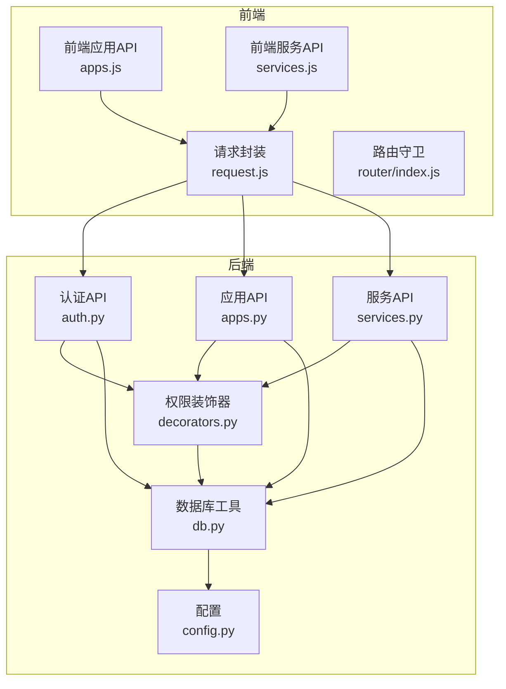
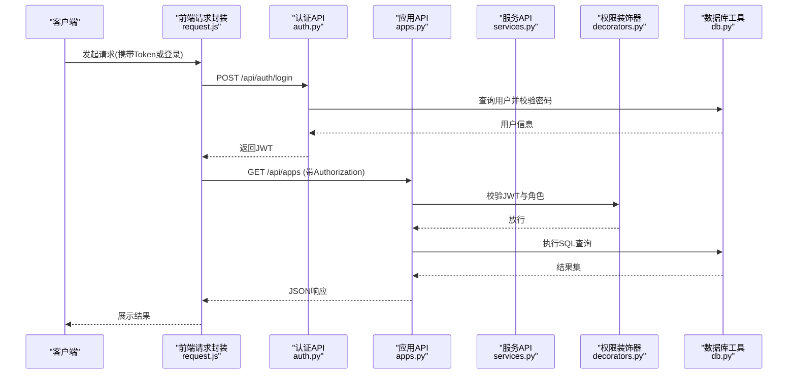
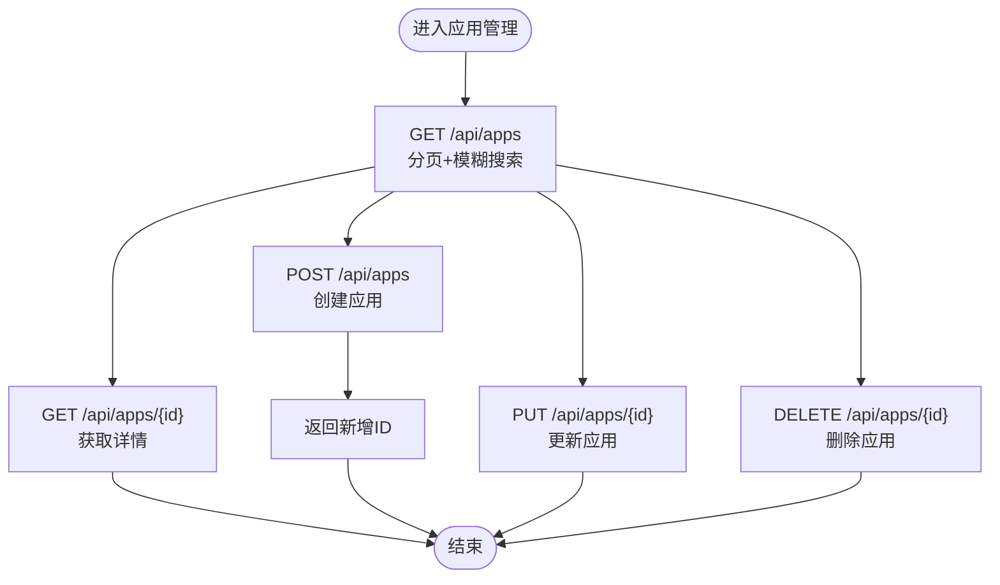
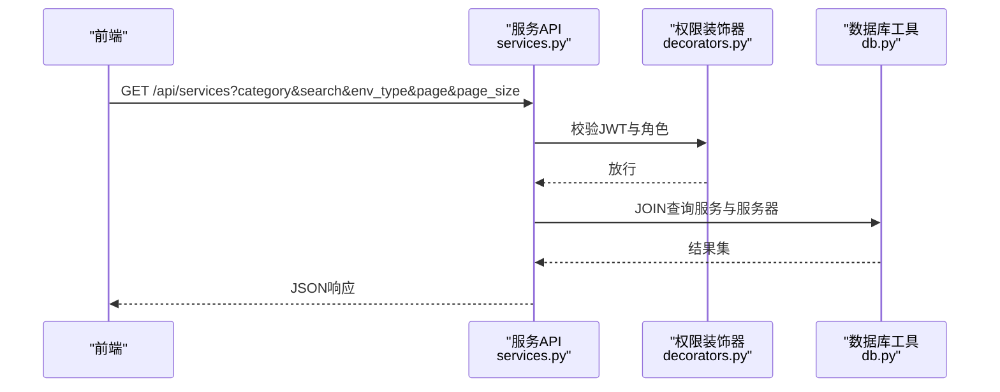
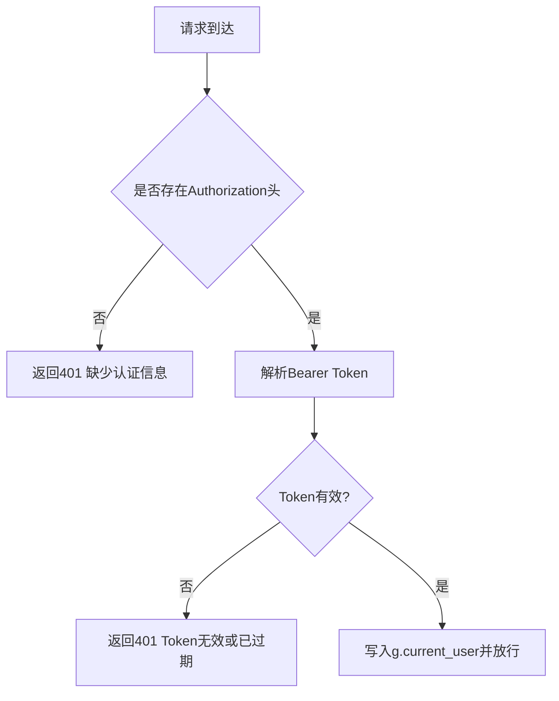
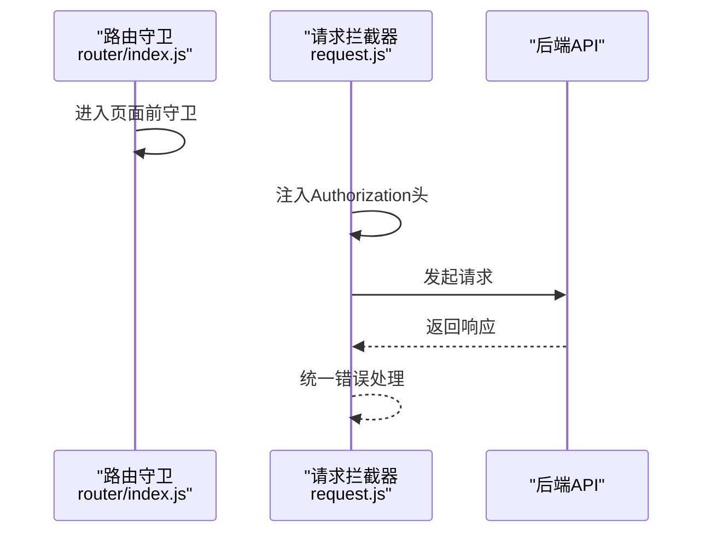
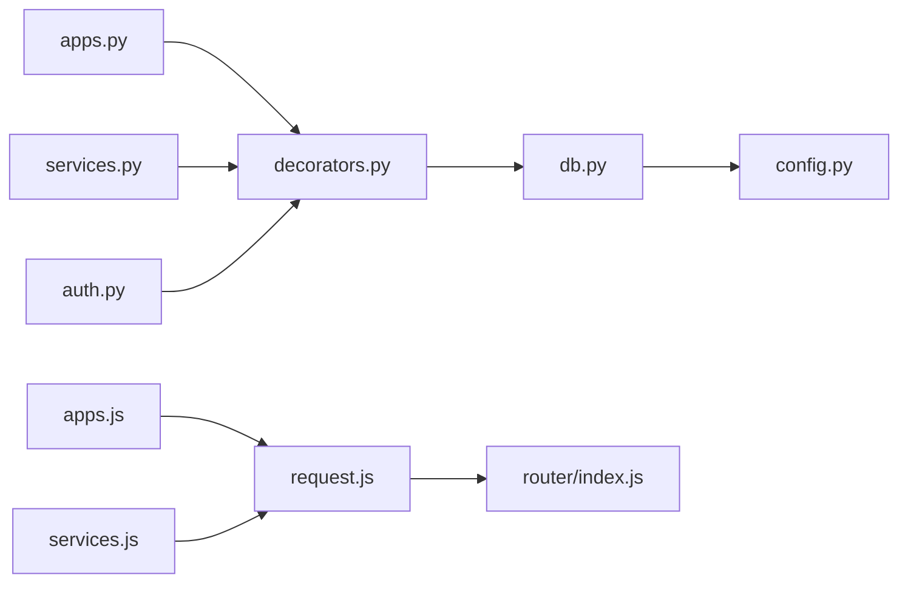

# 应用系统接口

<cite>
**本文引用的文件**
- [apps.py](file://backend/app/api/apps.py)
- [services.py](file://backend/app/api/services.py)
- [auth.py](file://backend/app/api/auth.py)
- [decorators.py](file://backend/app/utils/decorators.py)
- [db.py](file://backend/app/utils/db.py)
- [config.py](file://backend/app/config.py)
- [request.js](file://frontend/src/api/request.js)
- [apps.js](file://frontend/src/api/apps.js)
- [services.js](file://frontend/src/api/services.js)
- [router/index.js](file://frontend/src/router/index.js)
</cite>

## 目录
1. [简介](#简介)
2. [项目结构](#项目结构)
3. [核心组件](#核心组件)
4. [架构总览](#架构总览)
5. [详细组件分析](#详细组件分析)
6. [依赖分析](#依赖分析)
7. [性能考虑](#性能考虑)
8. [故障排查指南](#故障排查指南)
9. [结论](#结论)
10. [附录](#附录)

## 简介
本文件为运维平台“应用系统接口”的完整API文档，覆盖应用管理与服务管理两大模块，包含：
- 应用系统管理接口：获取应用列表、获取应用详情、创建应用、更新应用、删除应用
- 服务管理接口：获取服务列表、获取服务详情、创建服务、更新服务、删除服务
- 认证与权限控制：JWT认证、角色权限校验
- 前端请求封装与路由守卫
- 数据库连接与配置

同时提供常见业务场景下的调用流程与最佳实践建议。

## 项目结构
后端采用Flask微服务风格，按功能划分蓝图；前端基于Vue+Element Plus，通过Axios统一发起请求并携带JWT Token。

图表来源
- [apps.js:1-18](file://frontend/src/api/apps.js#L1-L18)
- [services.js:1-18](file://frontend/src/api/services.js#L1-L18)
- [request.js:1-54](file://frontend/src/api/request.js#L1-L54)
- [router/index.js:1-61](file://frontend/src/router/index.js#L1-L61)
- [auth.py:1-184](file://backend/app/api/auth.py#L1-L184)
- [apps.py:1-168](file://backend/app/api/apps.py#L1-L168)
- [services.py:1-182](file://backend/app/api/services.py#L1-L182)
- [decorators.py:1-95](file://backend/app/utils/decorators.py#L1-L95)
- [db.py:1-17](file://backend/app/utils/db.py#L1-L17)
- [config.py:1-21](file://backend/app/config.py#L1-L21)

章节来源
- [apps.py:1-168](file://backend/app/api/apps.py#L1-L168)
- [services.py:1-182](file://backend/app/api/services.py#L1-L182)
- [auth.py:1-184](file://backend/app/api/auth.py#L1-L184)
- [decorators.py:1-95](file://backend/app/utils/decorators.py#L1-L95)
- [db.py:1-17](file://backend/app/utils/db.py#L1-L17)
- [config.py:1-21](file://backend/app/config.py#L1-L21)
- [request.js:1-54](file://frontend/src/api/request.js#L1-L54)
- [apps.js:1-18](file://frontend/src/api/apps.js#L1-L18)
- [services.js:1-18](file://frontend/src/api/services.js#L1-L18)
- [router/index.js:1-61](file://frontend/src/router/index.js#L1-L61)

## 核心组件
- 应用系统管理API：提供应用的增删改查与分页检索能力，支持关键词模糊匹配。
- 服务管理API：提供服务的增删改查与分页检索，支持分类、环境类型筛选。
- 认证与权限：登录获取JWT，后续接口通过装饰器进行JWT校验与角色限制。
- 前端请求：统一封装Axios实例，自动注入Authorization头，集中处理错误与跳转。

章节来源
- [apps.py:11-168](file://backend/app/api/apps.py#L11-L168)
- [services.py:11-182](file://backend/app/api/services.py#L11-L182)
- [auth.py:14-184](file://backend/app/api/auth.py#L14-L184)
- [decorators.py:9-95](file://backend/app/utils/decorators.py#L9-L95)
- [request.js:5-54](file://frontend/src/api/request.js#L5-L54)

## 架构总览
后端以Blueprint组织路由，使用装饰器实现通用的JWT认证与角色校验；数据库连接通过工具类统一获取；前端通过Axios拦截器自动附加Token并处理响应错误。

图表来源
- [auth.py:14-83](file://backend/app/api/auth.py#L14-L83)
- [apps.py:11-68](file://backend/app/api/apps.py#L11-L68)
- [decorators.py:9-56](file://backend/app/utils/decorators.py#L9-L56)
- [db.py:5-17](file://backend/app/utils/db.py#L5-L17)
- [request.js:14-34](file://frontend/src/api/request.js#L14-L34)

## 详细组件分析

### 应用系统管理API
- 路由前缀：/api/apps
- 支持方法：GET、POST、PUT、DELETE
- 权限要求：除GET外，其余需JWT且角色为admin或operator

接口定义
- GET /api/apps
  - 查询参数：search（名称/公司/访问地址模糊匹配）、page、page_size
  - 返回：分页数据，包含items、total、page、page_size
- POST /api/apps
  - 请求体：seq_no, name, company, access_url, username, password, remark
  - 返回：创建成功及新增ID
- PUT /api/apps/{id}
  - 请求体：可选字段同上，仅传入存在的键会更新
  - 返回：更新成功
- DELETE /api/apps/{id}
  - 返回：删除成功

图表来源
- [apps.py:11-168](file://backend/app/api/apps.py#L11-L168)

章节来源
- [apps.py:11-168](file://backend/app/api/apps.py#L11-L168)

### 服务管理API
- 路由前缀：/api/services
- 支持方法：GET、POST、PUT、DELETE
- 权限要求：除GET外，其余需JWT且角色为admin或operator

接口定义
- GET /api/services
  - 查询参数：category（分类）、search（服务名/版本模糊）、env_type（环境类型）、page、page_size
  - 返回：分页数据，包含服务详情与所在服务器的主机名、内网IP、映射IP、环境类型等
- POST /api/services
  - 请求体：server_id, category, service_name, version, inner_port, mapped_port, public_ip, inner_ip, remark
  - 返回：创建成功及新增ID
- PUT /api/services/{id}
  - 请求体：可选字段同上
  - 返回：更新成功
- DELETE /api/services/{id}
  - 返回：删除成功

图表来源
- [services.py:11-83](file://backend/app/api/services.py#L11-L83)
- [decorators.py:9-95](file://backend/app/utils/decorators.py#L9-L95)
- [db.py:5-17](file://backend/app/utils/db.py#L5-L17)

章节来源
- [services.py:11-182](file://backend/app/api/services.py#L11-L182)

### 认证与权限控制
- 登录接口：POST /api/auth/login
  - 请求体：username, password
  - 成功返回：token与用户信息
  - 失败返回：401错误
- JWT认证装饰器：从Authorization头提取Bearer token，校验后写入g.current_user
- 角色权限装饰器：校验g.current_user中的role是否在允许列表中

图表来源
- [decorators.py:9-56](file://backend/app/utils/decorators.py#L9-L56)
- [auth.py:14-83](file://backend/app/api/auth.py#L14-L83)

章节来源
- [auth.py:14-184](file://backend/app/api/auth.py#L14-L184)
- [decorators.py:9-95](file://backend/app/utils/decorators.py#L9-L95)

### 前端集成与路由守卫
- Axios实例：baseURL=/api，超时15秒，默认JSON，自动注入Authorization头
- 统一错误处理：非200响应弹窗提示，401跳转登录页并清除本地存储
- 路由守卫：根据meta.requiresAuth与requiresAdmin控制访问；admin页面仅admin可见

图表来源
- [router/index.js:35-58](file://frontend/src/router/index.js#L35-L58)
- [request.js:14-51](file://frontend/src/api/request.js#L14-L51)

章节来源
- [request.js:1-54](file://frontend/src/api/request.js#L1-L54)
- [router/index.js:1-61](file://frontend/src/router/index.js#L1-L61)

## 依赖分析
- 后端依赖
  - Flask蓝图：apps、services、auth等
  - 自定义装饰器：jwt_required、role_required
  - 数据库工具：get_db统一连接
  - 配置：DB_*、JWT_SECRET_KEY、DEBUG等
- 前端依赖
  - Axios：统一HTTP客户端
  - Element Plus：消息提示
  - Vue Router：路由与守卫

图表来源
- [apps.py:1-168](file://backend/app/api/apps.py#L1-L168)
- [services.py:1-182](file://backend/app/api/services.py#L1-L182)
- [auth.py:1-184](file://backend/app/api/auth.py#L1-L184)
- [decorators.py:1-95](file://backend/app/utils/decorators.py#L1-L95)
- [db.py:1-17](file://backend/app/utils/db.py#L1-L17)
- [config.py:1-21](file://backend/app/config.py#L1-L21)
- [request.js:1-54](file://frontend/src/api/request.js#L1-L54)
- [router/index.js:1-61](file://frontend/src/router/index.js#L1-L61)
- [apps.js:1-18](file://frontend/src/api/apps.js#L1-L18)
- [services.js:1-18](file://frontend/src/api/services.js#L1-L18)

章节来源
- [apps.py:1-168](file://backend/app/api/apps.py#L1-L168)
- [services.py:1-182](file://backend/app/api/services.py#L1-L182)
- [auth.py:1-184](file://backend/app/api/auth.py#L1-L184)
- [decorators.py:1-95](file://backend/app/utils/decorators.py#L1-L95)
- [db.py:1-17](file://backend/app/utils/db.py#L1-L17)
- [config.py:1-21](file://backend/app/config.py#L1-L21)
- [request.js:1-54](file://frontend/src/api/request.js#L1-L54)
- [router/index.js:1-61](file://frontend/src/router/index.js#L1-L61)
- [apps.js:1-18](file://frontend/src/api/apps.js#L1-L18)
- [services.js:1-18](file://frontend/src/api/services.js#L1-L18)

## 性能考虑
- 分页参数范围控制：后端对page/page_size做了最小值与最大值限制，避免过大请求导致数据库压力。
- SQL拼接与参数化：使用参数化查询防止注入，避免硬编码SQL。
- 连接复用：数据库连接通过工具函数获取，减少重复初始化成本。
- 前端缓存策略：建议在前端对列表页做轻量缓存，减少重复请求。

## 故障排查指南
- 401 未授权
  - 检查请求头Authorization是否为Bearer Token格式
  - 检查Token是否过期或签名错误
  - 检查用户是否被禁用
- 403 权限不足
  - 确认当前用户角色是否满足接口所需角色（admin或operator）
- 500 服务器内部错误
  - 查看后端异常捕获与回滚逻辑，确认数据库事务是否正确提交/回滚
- 前端错误
  - Axios拦截器会统一弹窗提示；401会自动跳转登录页并清空本地存储

章节来源
- [decorators.py:22-46](file://backend/app/utils/decorators.py#L22-L46)
- [auth.py:40-61](file://backend/app/api/auth.py#L40-L61)
- [request.js:35-50](file://frontend/src/api/request.js#L35-L50)

## 结论
该系统通过清晰的蓝图划分与装饰器机制实现了统一的认证与权限控制，前后端分离设计便于扩展与维护。应用与服务管理API覆盖了日常运维的核心需求，结合分页与筛选能力，适合在生产环境中稳定运行。

## 附录

### API调用示例（概念性说明）
- 应用管理
  - 获取应用列表：GET /api/apps?search=&page=1&page_size=10
  - 创建应用：POST /api/apps（Body：字段见应用API）
  - 更新应用：PUT /api/apps/{id}（Body：部分字段）
  - 删除应用：DELETE /api/apps/{id}
- 服务管理
  - 获取服务列表：GET /api/services?category=&search=&env_type=&page=1&page_size=10
  - 创建服务：POST /api/services（Body：字段见服务API）
  - 更新服务：PUT /api/services/{id}（Body：部分字段）
  - 删除服务：DELETE /api/services/{id}
- 认证
  - 登录：POST /api/auth/login（Body：username, password）

### 生命周期管理流程（概念性说明）
- 部署
  - 步骤：创建服务器 → 创建服务 → 创建应用
  - 关键点：确保服务绑定正确的服务器ID与端口映射
- 更新
  - 步骤：更新服务版本/端口 → 更新应用访问信息
  - 关键点：先更新服务再更新应用，保证一致性
- 回滚
  - 步骤：回退到上一个服务版本 → 回退应用配置
  - 关键点：保留变更记录以便追溯
- 卸载
  - 步骤：删除应用 → 删除服务 → 删除服务器
  - 关键点：注意级联关系与依赖清理