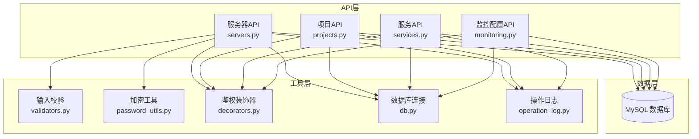
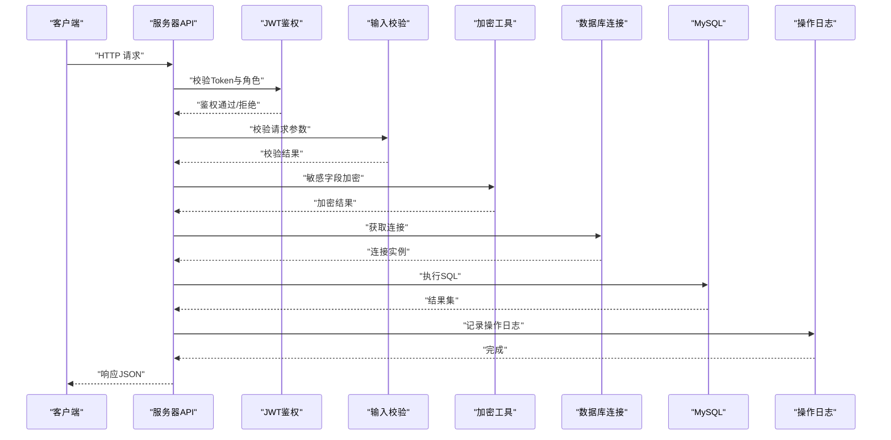
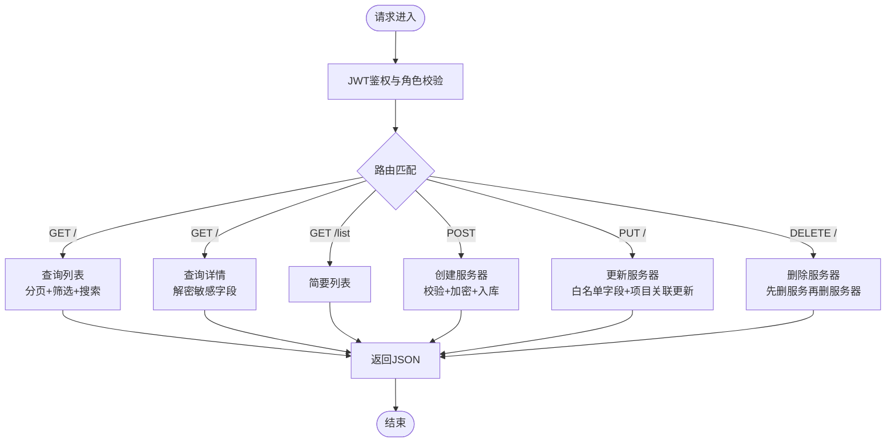
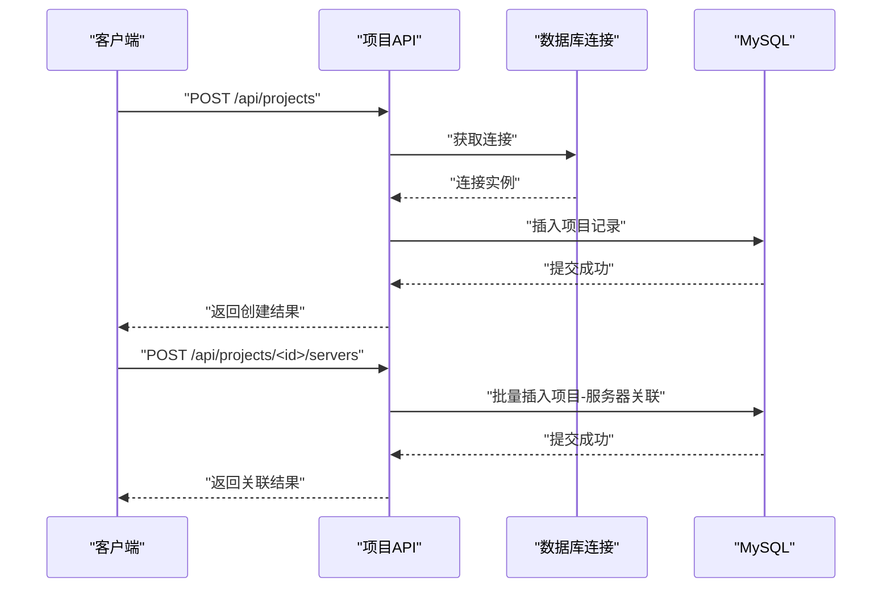
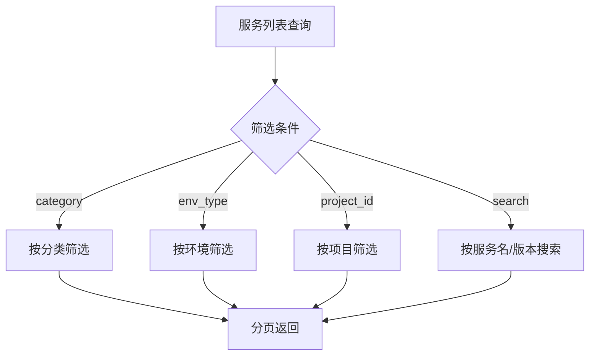
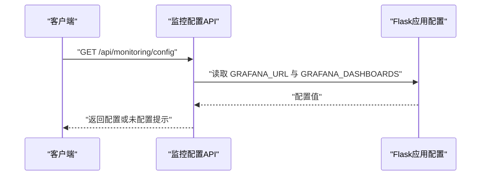
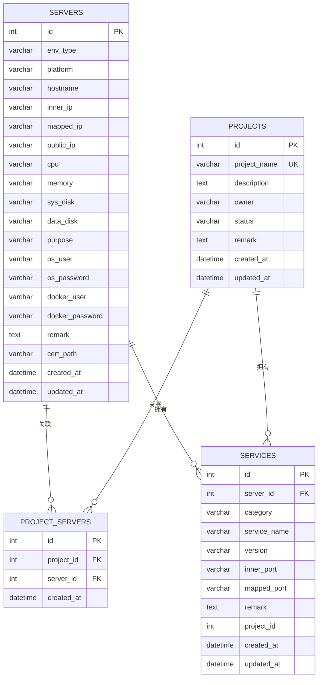
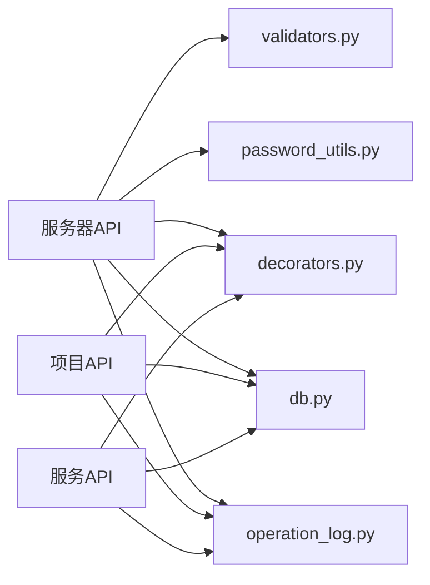

# 服务器管理API

<cite>
**本文档引用的文件**
- [servers.py](file://backend/app/api/servers.py)
- [monitoring.py](file://backend/app/api/monitoring.py)
- [projects.py](file://backend/app/api/projects.py)
- [services.py](file://backend/app/api/services.py)
- [validators.py](file://backend/app/utils/validators.py)
- [password_utils.py](file://backend/app/utils/password_utils.py)
- [decorators.py](file://backend/app/utils/decorators.py)
- [db.py](file://backend/app/utils/db.py)
- [operation_log.py](file://backend/app/utils/operation_log.py)
- [init_db.py](file://backend/init_db.py)
</cite>

## 目录
1. [简介](#简介)
2. [项目结构](#项目结构)
3. [核心组件](#核心组件)
4. [架构总览](#架构总览)
5. [详细组件分析](#详细组件分析)
6. [依赖关系分析](#依赖关系分析)
7. [性能考量](#性能考量)
8. [故障排查指南](#故障排查指南)
9. [结论](#结论)
10. [附录](#附录)

## 简介
本文件面向服务器管理模块的API使用与维护，聚焦以下能力：
- 服务器台账管理：添加、编辑、删除、查询、分页与筛选
- 服务器基本信息字段、环境类型分类、平台标识、IP地址管理
- 服务器状态监控与健康检查接口
- 批量操作与项目关联
- 服务器分组管理（项目）、标签系统（通过项目与服务维度体现）
- 资源统计与监控配置
- SSH连接测试与远程命令执行的安全考虑

本API基于Flask蓝图实现，统一鉴权与权限控制，敏感信息加密存储，并记录完整操作日志。

## 项目结构
服务器管理API位于后端应用的API层，围绕“服务器”“项目”“服务”三张核心表展开，配套工具模块负责校验、加密、鉴权与数据库连接。

图表来源
- [servers.py:1-578](file://backend/app/api/servers.py#L1-L578)
- [projects.py:1-521](file://backend/app/api/projects.py#L1-L521)
- [services.py:1-206](file://backend/app/api/services.py#L1-L206)
- [monitoring.py:1-42](file://backend/app/api/monitoring.py#L1-L42)
- [validators.py:1-151](file://backend/app/utils/validators.py#L1-L151)
- [password_utils.py:1-130](file://backend/app/utils/password_utils.py#L1-L130)
- [decorators.py:1-163](file://backend/app/utils/decorators.py#L1-L163)
- [db.py:1-80](file://backend/app/utils/db.py#L1-L80)
- [operation_log.py:1-172](file://backend/app/utils/operation_log.py#L1-L172)

章节来源
- [servers.py:1-578](file://backend/app/api/servers.py#L1-L578)
- [projects.py:1-521](file://backend/app/api/projects.py#L1-L521)
- [services.py:1-206](file://backend/app/api/services.py#L1-L206)
- [monitoring.py:1-42](file://backend/app/api/monitoring.py#L1-L42)

## 核心组件
- 服务器API（/api/servers）：提供服务器的增删改查、详情、列表、分页与筛选，支持项目过滤与模糊搜索。
- 项目API（/api/projects）：提供项目管理与服务器关联，支持批量关联/取消关联。
- 服务API（/api/services）：提供服务管理，支持按环境类型、项目、分类筛选。
- 监控配置API（/api/monitoring/config）：提供Grafana监控配置读取。
- 工具模块：输入校验（IP/主机名/长度等）、敏感信息加密（Fernet）、JWT鉴权与角色校验、数据库连接、操作日志。

章节来源
- [servers.py:14-578](file://backend/app/api/servers.py#L14-L578)
- [projects.py:13-521](file://backend/app/api/projects.py#L13-L521)
- [services.py:12-206](file://backend/app/api/services.py#L12-L206)
- [monitoring.py:11-42](file://backend/app/api/monitoring.py#L11-L42)
- [validators.py:6-151](file://backend/app/utils/validators.py#L6-L151)
- [password_utils.py:93-130](file://backend/app/utils/password_utils.py#L93-L130)
- [decorators.py:26-163](file://backend/app/utils/decorators.py#L26-L163)
- [db.py:43-80](file://backend/app/utils/db.py#L43-L80)
- [operation_log.py:49-172](file://backend/app/utils/operation_log.py#L49-L172)

## 架构总览
服务器管理API遵循“路由-业务-数据”的分层设计，统一通过JWT鉴权与角色校验，敏感字段加密存储，操作行为记录日志。

图表来源
- [servers.py:189-355](file://backend/app/api/servers.py#L189-L355)
- [decorators.py:26-163](file://backend/app/utils/decorators.py#L26-L163)
- [validators.py:6-151](file://backend/app/utils/validators.py#L6-L151)
- [password_utils.py:93-130](file://backend/app/utils/password_utils.py#L93-L130)
- [db.py:43-80](file://backend/app/utils/db.py#L43-L80)
- [operation_log.py:49-119](file://backend/app/utils/operation_log.py#L49-L119)

## 详细组件分析

### 服务器管理API
- 路由前缀：/api/servers
- 支持方法：GET（列表/详情/简要列表）、POST（创建）、PUT（更新）、DELETE（删除）
- 权限：JWT认证；部分操作需admin/operator角色
- 关键功能：
  - 列表查询：支持env_type、platform、project_id、search（主机名/内网IP/平台）与分页
  - 详情查询：返回服务器信息、关联服务列表、关联项目列表，敏感字段解密
  - 创建：校验主机名/IP/字符串长度/证书路径，敏感字段加密后入库
  - 更新：白名单字段更新，支持项目ID数组更新关联
  - 删除：先删关联服务，再删服务器，记录日志

图表来源
- [servers.py:14-578](file://backend/app/api/servers.py#L14-L578)

章节来源
- [servers.py:14-187](file://backend/app/api/servers.py#L14-L187)
- [servers.py:189-355](file://backend/app/api/servers.py#L189-L355)
- [servers.py:356-535](file://backend/app/api/servers.py#L356-L535)
- [servers.py:536-578](file://backend/app/api/servers.py#L536-L578)

### 项目管理与分组
- 路由前缀：/api/projects
- 支持方法：GET（列表/详情）、POST（创建）、PUT（更新）、DELETE（删除）
- 关键功能：
  - 列表：支持search/status与分页，返回各资源计数
  - 详情：聚合返回服务器、服务、域名、证书、账号列表
  - 批量关联/取消关联服务器到项目
  - 项目状态字典、环境类型字典、平台字典用于前端选择

图表来源
- [projects.py:89-151](file://backend/app/api/projects.py#L89-L151)
- [projects.py:385-466](file://backend/app/api/projects.py#L385-L466)

章节来源
- [projects.py:13-87](file://backend/app/api/projects.py#L13-L87)
- [projects.py:153-258](file://backend/app/api/projects.py#L153-L258)
- [projects.py:385-521](file://backend/app/api/projects.py#L385-L521)

### 服务管理与标签系统
- 路由前缀：/api/services
- 支持方法：GET（列表）、POST（创建）、PUT（更新）、DELETE（删除）
- 关键功能：
  - 列表：支持category/search/env_type/project_id与分页
  - 服务分类字典用于前端选择
  - 服务与服务器、项目建立关联，便于按项目/环境筛选

图表来源
- [services.py:12-90](file://backend/app/api/services.py#L12-L90)

章节来源
- [services.py:12-206](file://backend/app/api/services.py#L12-L206)

### 监控配置与健康检查
- 路由前缀：/api/monitoring
- GET /config：返回Grafana地址与仪表板配置（若未配置返回提示）
- 健康检查建议：结合数据库连接与关键表查询，返回服务可用性状态

图表来源
- [monitoring.py:11-42](file://backend/app/api/monitoring.py#L11-L42)

章节来源
- [monitoring.py:11-42](file://backend/app/api/monitoring.py#L11-L42)

### 数据模型与字段说明
- 服务器表（servers）：环境类型、平台、主机名、内网IP、映射IP、公网IP、CPU/内存/磁盘、用途、系统账户/密码、Docker账户/密码、证书路径、备注、创建/更新时间
- 项目表（projects）：项目名称唯一、描述、负责人、状态、备注、资源计数
- 项目-服务器关联表（project_servers）：多对多，唯一约束
- 服务表（services）：服务分类、服务名、版本、端口、备注、所属服务器与项目

图表来源
- [init_db.py:50-126](file://backend/init_db.py#L50-L126)

章节来源
- [init_db.py:50-126](file://backend/init_db.py#L50-L126)

## 依赖关系分析
- 服务器API依赖：
  - 输入校验：IP/主机名/字符串长度
  - 敏感信息加密：Fernet对称加密
  - 鉴权：JWT校验与角色校验
  - 数据库：pymysql连接池封装
  - 日志：操作日志记录
- 项目与服务API同样依赖上述工具模块，形成统一的安全与一致性保障。

图表来源
- [servers.py:1-11](file://backend/app/api/servers.py#L1-L11)
- [validators.py:1-4](file://backend/app/utils/validators.py#L1-L4)
- [password_utils.py:1-12](file://backend/app/utils/password_utils.py#L1-L12)
- [decorators.py:1-8](file://backend/app/utils/decorators.py#L1-L8)
- [db.py:1-8](file://backend/app/utils/db.py#L1-L8)
- [operation_log.py:1-9](file://backend/app/utils/operation_log.py#L1-L9)

章节来源
- [servers.py:1-11](file://backend/app/api/servers.py#L1-L11)
- [validators.py:1-151](file://backend/app/utils/validators.py#L1-L151)
- [password_utils.py:1-130](file://backend/app/utils/password_utils.py#L1-L130)
- [decorators.py:1-163](file://backend/app/utils/decorators.py#L1-L163)
- [db.py:1-80](file://backend/app/utils/db.py#L1-L80)
- [operation_log.py:1-172](file://backend/app/utils/operation_log.py#L1-L172)

## 性能考量
- 分页与索引：列表查询支持分页，服务器表对env_type与inner_ip建立索引，建议在高频查询字段上保持索引策略。
- SQL拼接与白名单：更新采用字段白名单与参数化绑定，降低SQL注入风险并提升执行效率。
- 解密与加密：敏感字段在返回前解密，入库前加密，注意I/O开销与密钥管理。
- 日志写入：异步化可选方案（当前为同步写入），高并发场景建议引入队列或批处理。

## 故障排查指南
- 认证失败
  - 缺少Authorization头或格式错误：返回401
  - Token无效/过期/用户不存在/禁用/密码变更导致Token失效：返回401
- 权限不足
  - 非admin/operator角色访问受限接口：返回403
- 参数校验失败
  - IP/主机名/字符串长度不符合规范：返回400
- 数据库异常
  - 连接失败/超时：检查DB_HOST/PORT/USER/PASSWORD/NAME与网络连通性
- 操作日志
  - 所有增删改均记录日志，便于审计与回溯

章节来源
- [decorators.py:26-163](file://backend/app/utils/decorators.py#L26-L163)
- [validators.py:6-151](file://backend/app/utils/validators.py#L6-L151)
- [db.py:43-80](file://backend/app/utils/db.py#L43-L80)
- [operation_log.py:49-172](file://backend/app/utils/operation_log.py#L49-L172)

## 结论
服务器管理API提供了完善的服务器台账管理能力，结合项目与服务维度实现分组与标签化管理，辅以严格的鉴权、输入校验、敏感信息加密与操作日志，满足企业级运维与合规需求。监控配置接口为可视化运维提供基础支撑。

## 附录

### API使用示例（路径指引）
- 获取服务器列表
  - 方法：GET
  - 路径：/api/servers
  - 查询参数：env_type、platform、project_id、search、page、page_size
  - 示例路径：[servers.py:14-115](file://backend/app/api/servers.py#L14-L115)
- 获取服务器详情
  - 方法：GET
  - 路径：/api/servers/{server_id}
  - 示例路径：[servers.py:116-169](file://backend/app/api/servers.py#L116-L169)
- 获取服务器简要列表
  - 方法：GET
  - 路径：/api/servers/list
  - 示例路径：[servers.py:171-187](file://backend/app/api/servers.py#L171-L187)
- 创建服务器
  - 方法：POST
  - 路径：/api/servers
  - 请求体字段：env_type、platform、hostname、inner_ip、mapped_ip、public_ip、cpu、memory、sys_disk、data_disk、purpose、os_user、os_password、docker_user、docker_password、remark、cert_path
  - 示例路径：[servers.py:189-355](file://backend/app/api/servers.py#L189-L355)
- 更新服务器
  - 方法：PUT
  - 路径：/api/servers/{server_id}
  - 请求体字段：允许白名单字段更新，支持project_ids批量更新关联
  - 示例路径：[servers.py:356-535](file://backend/app/api/servers.py#L356-L535)
- 删除服务器
  - 方法：DELETE
  - 路径：/api/servers/{server_id}
  - 示例路径：[servers.py:536-578](file://backend/app/api/servers.py#L536-L578)
- 获取监控配置
  - 方法：GET
  - 路径：/api/monitoring/config
  - 示例路径：[monitoring.py:11-42](file://backend/app/api/monitoring.py#L11-L42)
- 项目管理与批量关联
  - 创建项目：POST /api/projects
  - 关联服务器到项目：POST /api/projects/{project_id}/servers
  - 取消关联：DELETE /api/projects/{project_id}/servers/{server_id}
  - 示例路径：[projects.py:89-151](file://backend/app/api/projects.py#L89-L151)，[projects.py:385-521](file://backend/app/api/projects.py#L385-L521)

### 安全考虑（SSH连接测试与远程命令执行）
- 严禁在API中直接暴露SSH凭据或执行远程命令，避免敏感信息泄露与远程攻击面扩大
- 如需执行远程命令，建议：
  - 使用受控的作业调度系统（如定时任务模块）与最小权限原则
  - 将命令执行限制在受信网络与受控主机
  - 对命令与工作目录进行严格校验与超时控制
  - 记录命令执行日志并进行审计
- 当前仓库未提供SSH连接测试与远程命令执行接口，如需扩展应遵循以上原则并加强安全管控