# 服务器管理接口

<cite>
**本文档引用的文件**
- [servers.py](file://backend/app/api/servers.py)
- [db.py](file://backend/app/utils/db.py)
- [decorators.py](file://backend/app/utils/decorators.py)
- [config.py](file://backend/app/config.py)
- [request.js](file://frontend/src/api/request.js)
- [servers.js](file://frontend/src/api/servers.js)
- [Servers.vue](file://frontend/src/views/Servers.vue)
- [ServerDetail.vue](file://frontend/src/views/ServerDetail.vue)
- [init_db.py](file://backend/init_db.py)
</cite>

## 目录
1. [简介](#简介)
2. [项目结构](#项目结构)
3. [核心组件](#核心组件)
4. [架构概览](#架构概览)
5. [详细组件分析](#详细组件分析)
6. [依赖关系分析](#依赖关系分析)
7. [性能考虑](#性能考虑)
8. [故障排除指南](#故障排除指南)
9. [结论](#结论)

## 简介

本文档详细介绍了服务器管理接口的完整API规范，涵盖服务器的CRUD操作、数据模型定义、状态监控、批量操作支持以及配置验证规则。该系统采用前后端分离架构，后端基于Flask框架提供RESTful API，前端使用Vue.js构建用户界面。

## 项目结构

该项目采用模块化设计，主要分为后端API服务和前端用户界面两个部分：

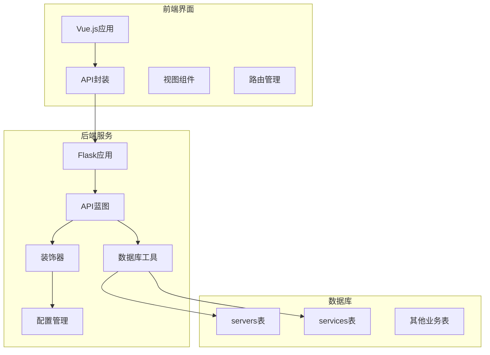

**图表来源**
- [servers.py:1-232](file://backend/app/api/servers.py#L1-L232)
- [db.py:1-17](file://backend/app/utils/db.py#L1-L17)
- [decorators.py:1-95](file://backend/app/utils/decorators.py#L1-L95)

**章节来源**
- [servers.py:1-232](file://backend/app/api/servers.py#L1-L232)
- [config.py:1-21](file://backend/app/config.py#L1-L21)

## 核心组件

### 服务器数据模型

服务器管理接口基于MySQL数据库设计，核心数据模型如下：

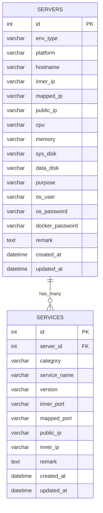

**图表来源**
- [init_db.py:49-94](file://backend/init_db.py#L49-L94)

### API端点概览

系统提供以下核心API端点：

| 方法 | 路径 | 权限 | 功能 |
|------|------|------|------|
| GET | `/api/servers` | JWT认证 | 获取服务器列表（支持分页和筛选） |
| GET | `/api/servers/{id}` | JWT认证 | 获取服务器详情 |
| GET | `/api/servers/list` | JWT认证 | 获取服务器简要列表 |
| POST | `/api/servers` | JWT认证 + admin/operator | 创建服务器 |
| PUT | `/api/servers/{id}` | JWT认证 + admin/operator | 更新服务器 |
| DELETE | `/api/servers/{id}` | JWT认证 + admin/operator | 删除服务器 |

**章节来源**
- [servers.py:11-232](file://backend/app/api/servers.py#L11-L232)

## 架构概览

系统采用分层架构设计，确保职责分离和可维护性：

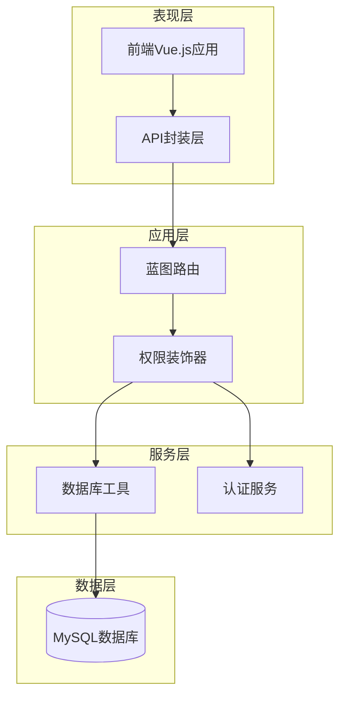

**图表来源**
- [servers.py:4-6](file://backend/app/api/servers.py#L4-L6)
- [decorators.py:9-95](file://backend/app/utils/decorators.py#L9-L95)
- [db.py:5-16](file://backend/app/utils/db.py#L5-L16)

## 详细组件分析

### 服务器列表查询组件

服务器列表查询功能支持多维度筛选和分页：

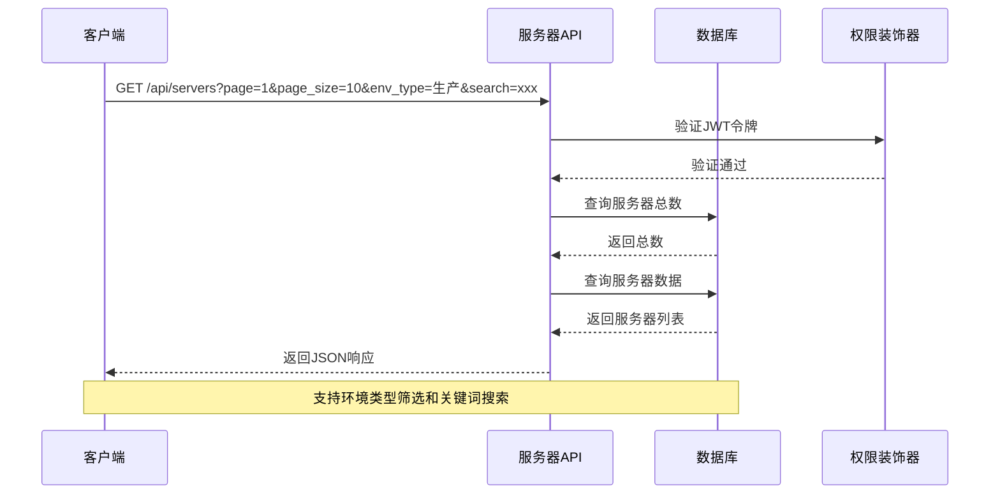

**图表来源**
- [servers.py:11-72](file://backend/app/api/servers.py#L11-L72)
- [decorators.py:9-56](file://backend/app/utils/decorators.py#L9-L56)

#### 查询参数说明

| 参数名 | 类型 | 必填 | 默认值 | 描述 |
|--------|------|------|--------|------|
| env_type | string | 否 | 空字符串 | 环境类型筛选 |
| search | string | 否 | 空字符串 | 关键词搜索（主机名、内网IP、平台） |
| page | integer | 否 | 1 | 页码（最小1） |
| page_size | integer | 否 | 10 | 每页数量（1-100） |

#### 响应数据结构

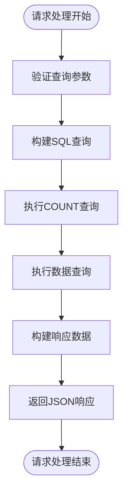

**图表来源**
- [servers.py:20-72](file://backend/app/api/servers.py#L20-L72)

**章节来源**
- [servers.py:11-72](file://backend/app/api/servers.py#L11-L72)

### 服务器详情查询组件

服务器详情查询包含主表信息和关联服务列表：

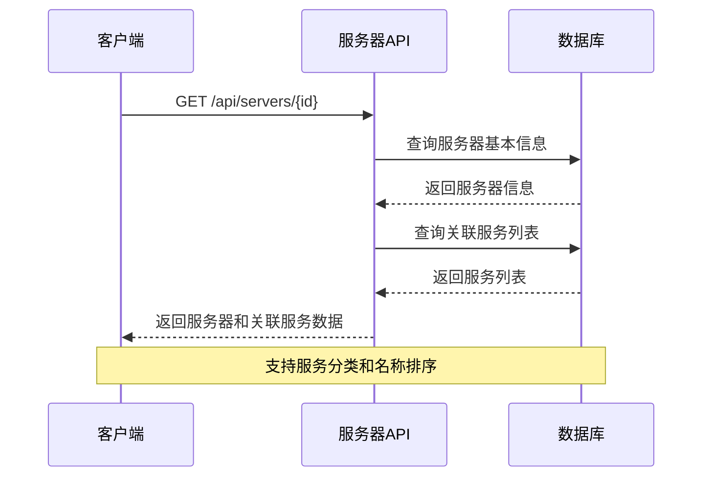

**图表来源**
- [servers.py:75-107](file://backend/app/api/servers.py#L75-L107)

#### 关联服务字段定义

| 字段名 | 类型 | 描述 |
|--------|------|------|
| category | string | 服务分类 |
| service_name | string | 服务名称 |
| version | string | 版本号 |
| inner_port | string | 内部端口 |
| mapped_port | string | 映射端口 |
| public_ip | string | 公网IP |
| inner_ip | string | 内网IP |
| remark | text | 备注 |

**章节来源**
- [servers.py:75-107](file://backend/app/api/servers.py#L75-L107)

### 服务器CRUD操作组件

#### 创建服务器组件

创建服务器操作支持完整的服务器信息录入：

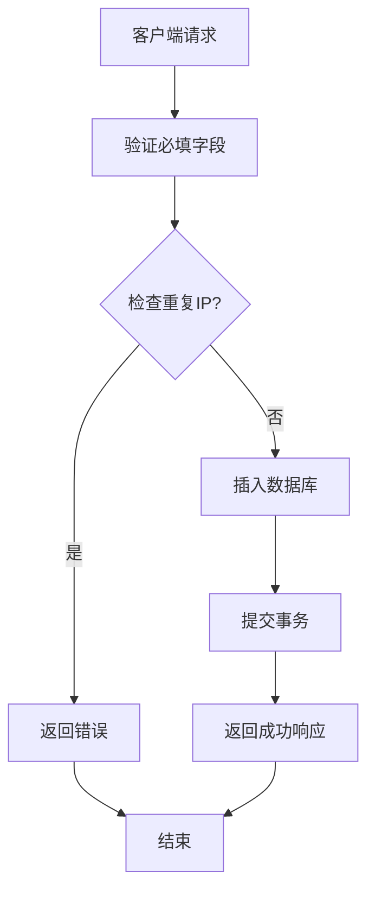

**图表来源**
- [servers.py:130-165](file://backend/app/api/servers.py#L130-L165)

#### 更新服务器组件

更新服务器支持选择性字段更新：

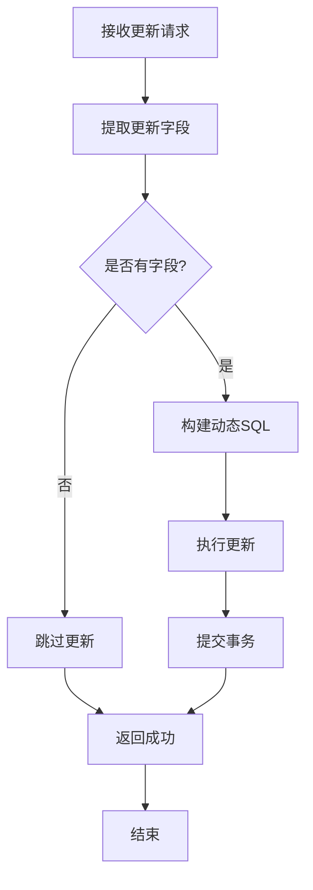

**图表来源**
- [servers.py:168-204](file://backend/app/api/servers.py#L168-L204)

**章节来源**
- [servers.py:130-204](file://backend/app/api/servers.py#L130-L204)

### 权限控制组件

系统采用JWT认证和角色权限双重控制机制：

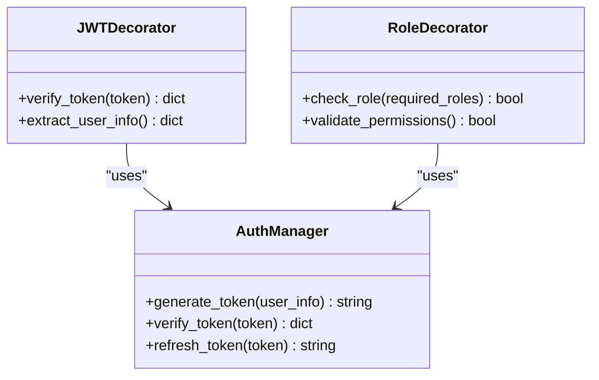

**图表来源**
- [decorators.py:9-95](file://backend/app/utils/decorators.py#L9-L95)

**章节来源**
- [decorators.py:9-95](file://backend/app/utils/decorators.py#L9-L95)

## 依赖关系分析

### 数据库依赖关系

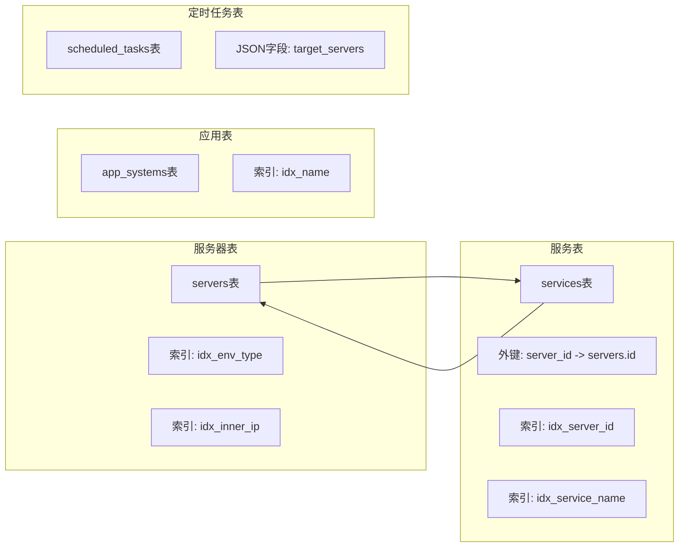

**图表来源**
- [init_db.py:49-94](file://backend/init_db.py#L49-L94)
- [init_db.py:129-144](file://backend/init_db.py#L129-L144)
- [init_db.py:185-203](file://backend/init_db.py#L185-L203)

### 前后端交互依赖

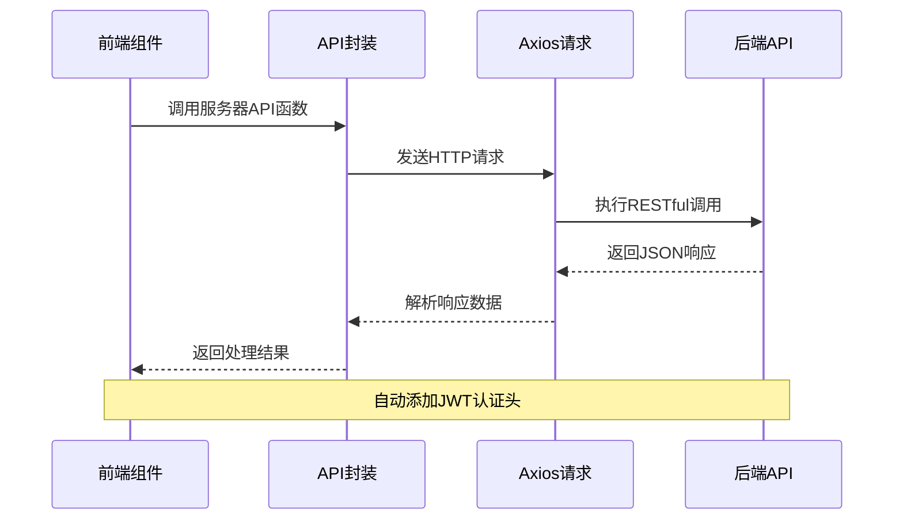

**图表来源**
- [servers.js:1-26](file://frontend/src/api/servers.js#L1-L26)
- [request.js:13-51](file://frontend/src/api/request.js#L13-L51)

**章节来源**
- [servers.js:1-26](file://frontend/src/api/servers.js#L1-L26)
- [request.js:13-51](file://frontend/src/api/request.js#L13-L51)

## 性能考虑

### 数据库优化策略

1. **索引优化**
   - 服务器表：`idx_env_type`、`idx_inner_ip` 索引支持快速查询
   - 服务表：`idx_server_id`、`idx_service_name` 索引优化关联查询

2. **查询优化**
   - 使用LIMIT和OFFSET实现分页，限制每页最大100条记录
   - 条件查询使用参数化SQL防止SQL注入

3. **连接池管理**
   - 数据库连接自动关闭，避免连接泄漏
   - 使用DictCursor简化数据访问

### 前端性能优化

1. **请求缓存**
   - 服务器列表支持本地缓存减少重复请求
   - 表单验证采用防抖机制

2. **渲染优化**
   - 大数据量表格使用虚拟滚动
   - 异步加载减少首屏等待时间

## 故障排除指南

### 常见错误处理

| 错误类型 | HTTP状态码 | 错误信息 | 处理建议 |
|----------|------------|----------|----------|
| 认证失败 | 401 | 缺少认证信息/Token无效 | 检查JWT令牌格式和有效期 |
| 权限不足 | 403 | 权限不足 | 确认用户角色具有相应权限 |
| 服务器不存在 | 404 | 服务器不存在 | 验证服务器ID有效性 |
| 数据库错误 | 500 | 操作失败 | 检查数据库连接和SQL语法 |

### 调试技巧

1. **后端调试**
   ```python
   # 在开发环境中启用调试模式
   # 设置FLASK_DEBUG=true
   ```

2. **前端调试**
   - 检查浏览器开发者工具Network标签
   - 验证JWT令牌是否正确设置
   - 查看API响应数据结构

3. **数据库调试**
   - 使用MySQL Workbench验证SQL查询
   - 检查表结构和索引状态
   - 监控慢查询日志

**章节来源**
- [servers.py:86-90](file://backend/app/api/servers.py#L86-L90)
- [request.js:25-51](file://frontend/src/api/request.js#L25-L51)

## 结论

服务器管理接口提供了完整的CRUD操作能力，支持多维度筛选、分页查询、权限控制和数据验证。系统采用现代化的技术栈，具备良好的扩展性和维护性。通过合理的数据库设计和前端优化，能够满足企业级运维平台的需求。

未来可以考虑的功能增强：
- 添加服务器状态监控和健康检查
- 实现批量操作支持
- 增加服务器连接测试功能
- 完善故障告警机制
- 提供API文档自动生成