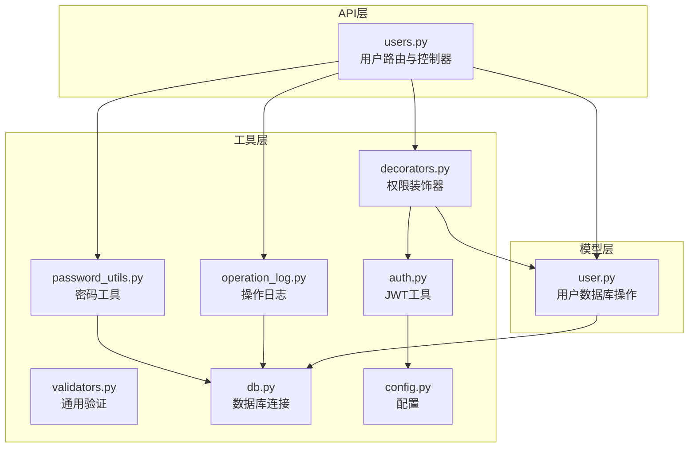
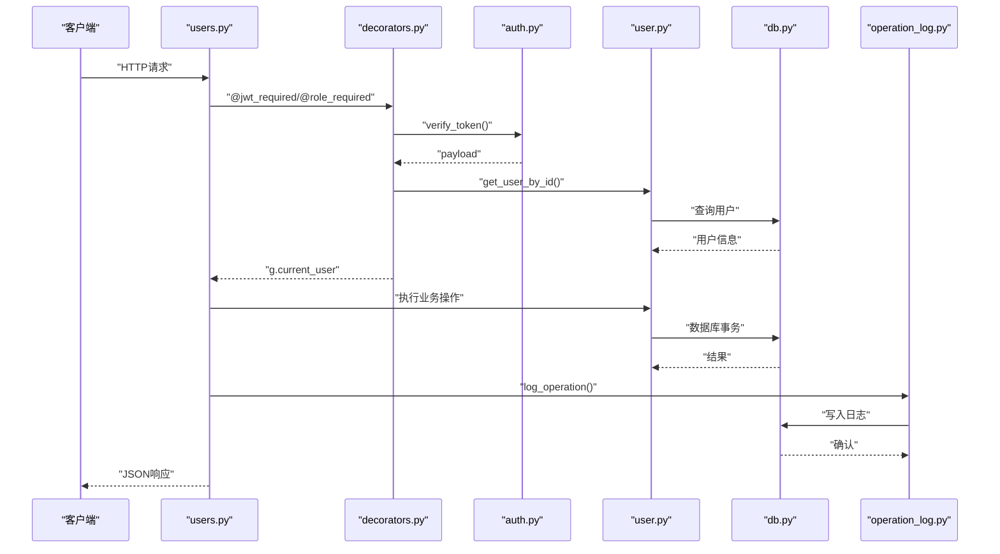
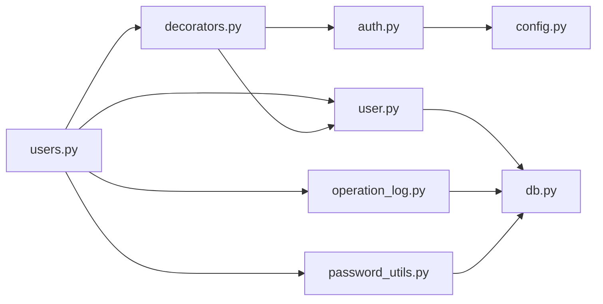

# 用户管理API

<cite>
**本文引用的文件**
- [backend/app/api/users.py](file://backend/app/api/users.py)
- [backend/app/models/user.py](file://backend/app/models/user.py)
- [backend/app/utils/validators.py](file://backend/app/utils/validators.py)
- [backend/app/utils/auth.py](file://backend/app/utils/auth.py)
- [backend/app/utils/decorators.py](file://backend/app/utils/decorators.py)
- [backend/app/utils/operation_log.py](file://backend/app/utils/operation_log.py)
- [backend/app/utils/password_utils.py](file://backend/app/utils/password_utils.py)
- [backend/app/utils/db.py](file://backend/app/utils/db.py)
- [backend/app/config.py](file://backend/app/config.py)
- [backend/init_db.py](file://backend/init_db.py)
</cite>

## 目录
1. [简介](#简介)
2. [项目结构](#项目结构)
3. [核心组件](#核心组件)
4. [架构总览](#架构总览)
5. [详细组件分析](#详细组件分析)
6. [依赖关系分析](#依赖关系分析)
7. [性能考虑](#性能考虑)
8. [故障排查指南](#故障排查指南)
9. [结论](#结论)
10. [附录](#附录)

## 简介
本文件为用户管理模块的详细API文档，涵盖用户CRUD操作接口、字段定义、权限级别、状态管理、列表查询与过滤、角色分配、批量操作建议、数据验证规则、权限控制与操作日志记录。所有接口均需管理员权限，并通过JWT认证保护。

## 项目结构
用户管理API位于后端Flask蓝图中，围绕用户模型与工具模块协作：
- API层：用户路由与业务处理
- 模型层：用户数据库操作
- 工具层：认证、权限、验证、日志、密码、数据库连接

图表来源
- [backend/app/api/users.py:1-290](file://backend/app/api/users.py#L1-L290)
- [backend/app/models/user.py:1-162](file://backend/app/models/user.py#L1-L162)
- [backend/app/utils/auth.py:1-45](file://backend/app/utils/auth.py#L1-L45)
- [backend/app/utils/decorators.py:1-163](file://backend/app/utils/decorators.py#L1-L163)
- [backend/app/utils/validators.py:1-151](file://backend/app/utils/validators.py#L1-L151)
- [backend/app/utils/password_utils.py:1-130](file://backend/app/utils/password_utils.py#L1-L130)
- [backend/app/utils/operation_log.py:1-172](file://backend/app/utils/operation_log.py#L1-L172)
- [backend/app/utils/db.py:1-80](file://backend/app/utils/db.py#L1-L80)
- [backend/app/config.py:1-58](file://backend/app/config.py#L1-L58)

章节来源
- [backend/app/api/users.py:1-290](file://backend/app/api/users.py#L1-L290)
- [backend/app/models/user.py:1-162](file://backend/app/models/user.py#L1-L162)

## 核心组件
- 用户API蓝图：提供用户列表、创建、更新、删除、重置密码等接口
- 用户模型：封装数据库操作（创建、查询、更新、删除、改密）
- 权限装饰器：JWT认证与角色校验
- 操作日志：统一记录用户管理相关操作
- 密码工具：安全加密与验证
- 数据库连接：基于Flask g上下文的连接池化管理

章节来源
- [backend/app/api/users.py:1-290](file://backend/app/api/users.py#L1-L290)
- [backend/app/models/user.py:1-162](file://backend/app/models/user.py#L1-L162)
- [backend/app/utils/decorators.py:1-163](file://backend/app/utils/decorators.py#L1-L163)
- [backend/app/utils/operation_log.py:1-172](file://backend/app/utils/operation_log.py#L1-L172)
- [backend/app/utils/password_utils.py:1-130](file://backend/app/utils/password_utils.py#L1-L130)
- [backend/app/utils/db.py:1-80](file://backend/app/utils/db.py#L1-L80)

## 架构总览
用户管理API的典型调用链路如下：

图表来源
- [backend/app/api/users.py:1-290](file://backend/app/api/users.py#L1-L290)
- [backend/app/utils/decorators.py:1-163](file://backend/app/utils/decorators.py#L1-L163)
- [backend/app/utils/auth.py:1-45](file://backend/app/utils/auth.py#L1-L45)
- [backend/app/models/user.py:1-162](file://backend/app/models/user.py#L1-L162)
- [backend/app/utils/db.py:1-80](file://backend/app/utils/db.py#L1-L80)
- [backend/app/utils/operation_log.py:1-172](file://backend/app/utils/operation_log.py#L1-L172)

## 详细组件分析

### 用户数据模型与字段定义
- 表结构概览（来自初始化脚本）
  - 字段：id、username、password_hash、display_name、role、is_active、password_changed_at、created_at、updated_at
  - 索引：username、role
  - 默认值与注释：role默认operator，is_active默认true，password_changed_at用于作废旧令牌

- 字段说明
  - id：自增主键
  - username：唯一，长度限制见验证规则
  - password_hash：密码哈希
  - display_name：显示名称
  - role：角色，取值范围见权限章节
  - is_active：用户状态，禁用后无法通过认证
  - password_changed_at：密码修改时间，用于JWT作废判定
  - created_at/updated_at：自动维护的时间戳

章节来源
- [backend/init_db.py:34-48](file://backend/init_db.py#L34-L48)
- [backend/app/models/user.py:7-33](file://backend/app/models/user.py#L7-L33)

### 权限与认证
- 认证方式：Bearer JWT
- 必需权限：管理员（admin）
- 认证流程要点
  - Authorization头必须为Bearer token
  - 校验token有效性与过期
  - 校验用户存在且启用
  - 若用户密码在token签发后发生变更，则token作废
- 角色校验：装饰器按角色白名单校验

章节来源
- [backend/app/utils/decorators.py:26-163](file://backend/app/utils/decorators.py#L26-L163)
- [backend/app/utils/auth.py:9-45](file://backend/app/utils/auth.py#L9-L45)

### 用户CRUD接口

#### 获取用户列表
- 方法与路径：GET /api/users
- 权限：管理员
- 响应：包含用户数组的JSON对象
- 字段：id、username、display_name、role、is_active、created_at、updated_at

章节来源
- [backend/app/api/users.py:19-32](file://backend/app/api/users.py#L19-L32)
- [backend/app/models/user.py:74-90](file://backend/app/models/user.py#L74-L90)

#### 创建用户
- 方法与路径：POST /api/users
- 请求体字段
  - username：必填，长度3-20，仅字母、数字、下划线
  - password：必填，至少6位
  - display_name：必填
  - role：可选，默认operator，取值admin/operator/viewer
- 成功响应：返回创建成功的提示与新用户ID
- 失败场景：请求体为空、字段缺失、格式不合法、用户名冲突、内部异常

章节来源
- [backend/app/api/users.py:35-110](file://backend/app/api/users.py#L35-L110)
- [backend/app/utils/validators.py:98-109](file://backend/app/utils/validators.py#L98-L109)
- [backend/app/utils/password_utils.py:52-62](file://backend/app/utils/password_utils.py#L52-L62)
- [backend/app/models/user.py:8-33](file://backend/app/models/user.py#L8-L33)

#### 更新用户信息
- 方法与路径：PUT /api/users/{user_id}
- 请求体字段（可选）
  - display_name：显示名称
  - role：角色，取值admin/operator/viewer
  - is_active：布尔，用户状态
- 成功响应：返回更新成功的提示
- 失败场景：请求体为空、用户不存在、角色非法、无有效字段更新、内部异常

章节来源
- [backend/app/api/users.py:112-179](file://backend/app/api/users.py#L112-L179)
- [backend/app/models/user.py:93-120](file://backend/app/models/user.py#L93-L120)

#### 删除用户
- 方法与路径：DELETE /api/users/{user_id}
- 特殊限制：不允许删除当前登录用户
- 成功响应：返回删除成功提示
- 失败场景：当前用户尝试删除自身、用户不存在、内部异常

章节来源
- [backend/app/api/users.py:182-226](file://backend/app/api/users.py#L182-L226)
- [backend/app/models/user.py:123-140](file://backend/app/models/user.py#L123-L140)

#### 重置用户密码
- 方法与路径：PUT /api/users/{user_id}/reset-password
- 请求体字段
  - new_password：必填，至少6位
- 成功响应：返回重置成功提示
- 失败场景：请求体为空、新密码非法、用户不存在、内部异常

章节来源
- [backend/app/api/users.py:229-289](file://backend/app/api/users.py#L229-L289)
- [backend/app/utils/password_utils.py:52-62](file://backend/app/utils/password_utils.py#L52-L62)
- [backend/app/models/user.py:143-161](file://backend/app/models/user.py#L143-L161)

### 用户状态管理
- is_active：用户启用/禁用状态
- 禁用用户将无法通过认证装饰器校验
- 更新用户信息时可直接设置is_active

章节来源
- [backend/app/utils/decorators.py:87-96](file://backend/app/utils/decorators.py#L87-L96)
- [backend/app/models/user.py:93-120](file://backend/app/models/user.py#L93-L120)

### 用户列表查询、分页与过滤
- 当前实现
  - GET /api/users 返回全部用户，按创建时间倒序
  - 未提供分页参数与搜索过滤条件
- 扩展建议
  - 查询参数：page、size、username_like、role、is_active
  - 接口：GET /api/users?page=1&size=20&username_like=admin&role=operator
  - 建议在模型层增加分页与过滤SQL

章节来源
- [backend/app/api/users.py:19-32](file://backend/app/api/users.py#L19-L32)
- [backend/app/models/user.py:74-90](file://backend/app/models/user.py#L74-L90)

### 角色分配与权限级别
- 角色枚举：admin（管理员）、operator（操作员）、viewer（观察者）
- 管理员可执行所有用户管理操作
- 角色更新需在允许范围内

章节来源
- [backend/app/api/users.py:72-77](file://backend/app/api/users.py#L72-L77)
- [backend/app/api/users.py:138-143](file://backend/app/api/users.py#L138-L143)

### 批量操作接口
- 当前未提供批量接口
- 建议
  - 批量创建：POST /api/users/batch-create（请求体为用户数组）
  - 批量删除：DELETE /api/users/batch-delete（请求体为用户ID数组）
  - 批量更新：PUT /api/users/batch-update（请求体为更新规则数组）

章节来源
- [backend/app/api/users.py:1-290](file://backend/app/api/users.py#L1-L290)

### 数据验证规则
- 用户名
  - 长度：3-20
  - 字符集：字母、数字、下划线
- 密码
  - 长度：至少6位
- 角色
  - 取值：admin、operator、viewer
- 其他
  - 显示名称长度限制见通用验证工具

章节来源
- [backend/app/utils/validators.py:98-109](file://backend/app/utils/validators.py#L98-L109)
- [backend/app/utils/validators.py:88-95](file://backend/app/utils/validators.py#L88-L95)
- [backend/app/api/users.py:65-84](file://backend/app/api/users.py#L65-L84)

### 权限控制
- 所有用户管理接口均需管理员权限
- 认证中间件负责校验JWT与角色
- 禁用用户无法通过认证

章节来源
- [backend/app/api/users.py:19-22](file://backend/app/api/users.py#L19-L22)
- [backend/app/api/users.py:112-115](file://backend/app/api/users.py#L112-L115)
- [backend/app/api/users.py:182-185](file://backend/app/api/users.py#L182-L185)
- [backend/app/api/users.py:229-232](file://backend/app/api/users.py#L229-L232)
- [backend/app/utils/decorators.py:126-163](file://backend/app/utils/decorators.py#L126-L163)

### 操作日志记录
- 记录内容
  - 模块：用户管理
  - 动作：create/update/delete/reset_password
  - 操作人：当前用户（从JWT解析）
  - 目标：用户ID与用户名
  - 详情：如角色变更、重置密码等
- 日志字段
  - user_id、username、module、action、target_id、target_name、detail、ip、user_agent、created_at

章节来源
- [backend/app/api/users.py:98-98](file://backend/app/api/users.py#L98-L98)
- [backend/app/api/users.py:164-164](file://backend/app/api/users.py#L164-L164)
- [backend/app/api/users.py:211-211](file://backend/app/api/users.py#L211-L211)
- [backend/app/api/users.py:274-274](file://backend/app/api/users.py#L274-L274)
- [backend/app/utils/operation_log.py:49-119](file://backend/app/utils/operation_log.py#L49-L119)

## 依赖关系分析

图表来源
- [backend/app/api/users.py:1-290](file://backend/app/api/users.py#L1-L290)
- [backend/app/utils/decorators.py:1-163](file://backend/app/utils/decorators.py#L1-L163)
- [backend/app/utils/operation_log.py:1-172](file://backend/app/utils/operation_log.py#L1-L172)
- [backend/app/utils/password_utils.py:1-130](file://backend/app/utils/password_utils.py#L1-L130)
- [backend/app/models/user.py:1-162](file://backend/app/models/user.py#L1-L162)
- [backend/app/utils/db.py:1-80](file://backend/app/utils/db.py#L1-L80)
- [backend/app/utils/auth.py:1-45](file://backend/app/utils/auth.py#L1-L45)
- [backend/app/config.py:1-58](file://backend/app/config.py#L1-L58)

章节来源
- [backend/app/api/users.py:1-290](file://backend/app/api/users.py#L1-L290)
- [backend/app/utils/decorators.py:1-163](file://backend/app/utils/decorators.py#L1-L163)
- [backend/app/utils/operation_log.py:1-172](file://backend/app/utils/operation_log.py#L1-L172)
- [backend/app/utils/password_utils.py:1-130](file://backend/app/utils/password_utils.py#L1-L130)
- [backend/app/models/user.py:1-162](file://backend/app/models/user.py#L1-L162)
- [backend/app/utils/db.py:1-80](file://backend/app/utils/db.py#L1-L80)
- [backend/app/utils/auth.py:1-45](file://backend/app/utils/auth.py#L1-L45)
- [backend/app/config.py:1-58](file://backend/app/config.py#L1-L58)

## 性能考虑
- 数据库连接
  - 使用Flask g上下文缓存连接，避免重复建立连接
  - 连接超时与字符集配置合理
- SQL执行
  - 使用参数化查询防止注入
  - 更新操作仅更新必要字段
- 日志写入
  - 异常捕获与降级记录，避免阻塞请求
- 建议
  - 列表查询增加索引与分页
  - 对频繁更新的字段使用缓存策略

章节来源
- [backend/app/utils/db.py:43-80](file://backend/app/utils/db.py#L43-L80)
- [backend/app/models/user.py:110-120](file://backend/app/models/user.py#L110-L120)
- [backend/app/utils/operation_log.py:113-119](file://backend/app/utils/operation_log.py#L113-L119)

## 故障排查指南
- 认证失败
  - 缺少Authorization头或格式错误
  - Token无效或过期
  - 用户不存在或被禁用
  - 密码在签发后已变更导致Token作废
- 权限不足
  - 非管理员用户访问用户管理接口
- 业务异常
  - 用户名冲突、字段非法、用户不存在、内部异常
- 日志定位
  - 查看operation_logs表记录，结合请求头IP与User-Agent定位问题

章节来源
- [backend/app/utils/decorators.py:35-113](file://backend/app/utils/decorators.py#L35-L113)
- [backend/app/api/users.py:47-109](file://backend/app/api/users.py#L47-L109)
- [backend/app/utils/operation_log.py:13-20](file://backend/app/utils/operation_log.py#L13-L20)

## 结论
用户管理API提供了完整的管理员权限下的用户CRUD能力，具备完善的认证、权限控制与操作日志记录机制。当前未提供分页与搜索过滤，建议后续扩展以满足大规模用户管理需求。

## 附录

### API定义汇总
- 获取用户列表
  - 方法：GET
  - 路径：/api/users
  - 权限：管理员
  - 响应：包含用户数组
- 创建用户
  - 方法：POST
  - 路径：/api/users
  - 权限：管理员
  - 请求体：username、password、display_name、role
  - 响应：创建成功与用户ID
- 更新用户
  - 方法：PUT
  - 路径：/api/users/{user_id}
  - 权限：管理员
  - 请求体：display_name、role、is_active
  - 响应：更新成功
- 删除用户
  - 方法：DELETE
  - 路径：/api/users/{user_id}
  - 权限：管理员
  - 响应：删除成功
- 重置密码
  - 方法：PUT
  - 路径：/api/users/{user_id}/reset-password
  - 权限：管理员
  - 请求体：new_password
  - 响应：重置成功

章节来源
- [backend/app/api/users.py:19-289](file://backend/app/api/users.py#L19-L289)

### 字段与验证对照
- 用户名：长度3-20，字母数字下划线
- 密码：至少6位
- 角色：admin/operator/viewer
- 状态：布尔值（启用/禁用）

章节来源
- [backend/app/utils/validators.py:98-109](file://backend/app/utils/validators.py#L98-L109)
- [backend/app/utils/validators.py:88-95](file://backend/app/utils/validators.py#L88-L95)
- [backend/app/api/users.py:72-84](file://backend/app/api/users.py#L72-L84)