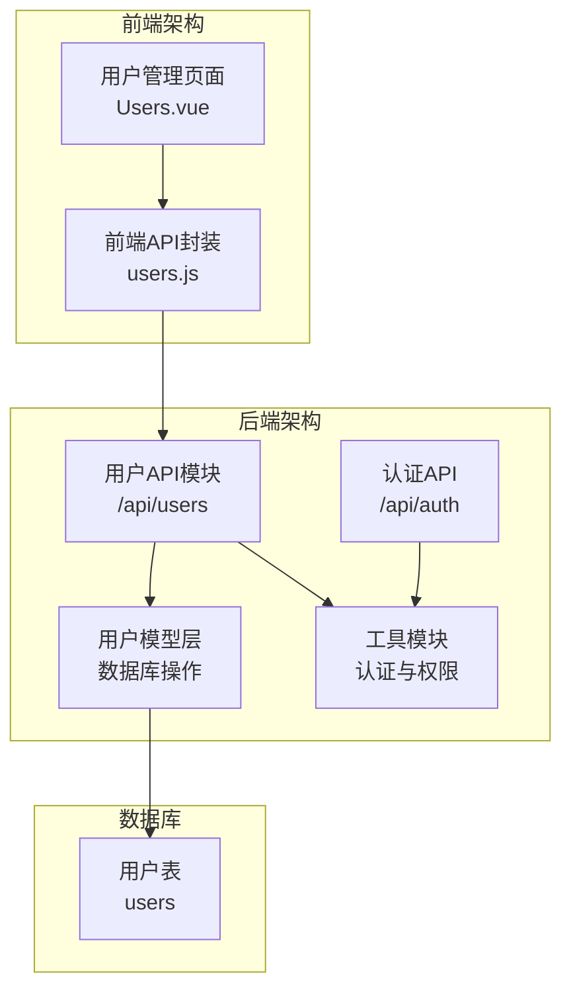
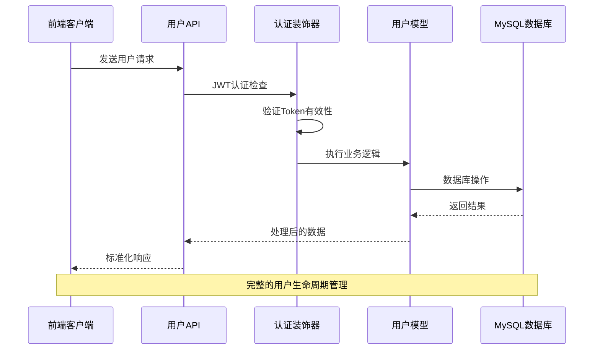
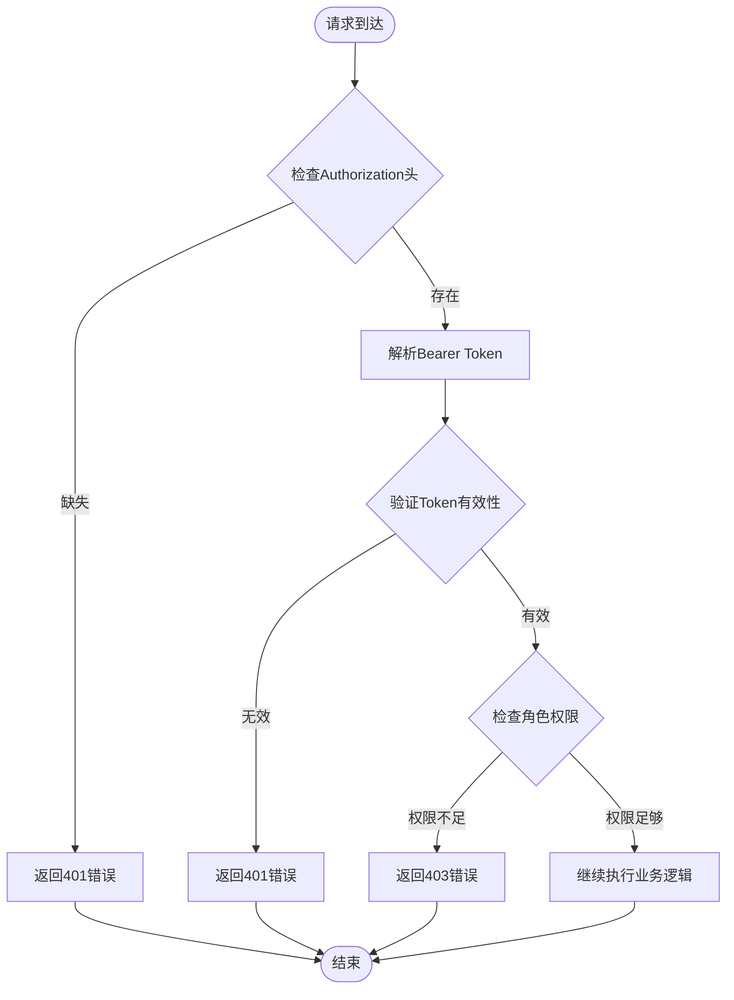
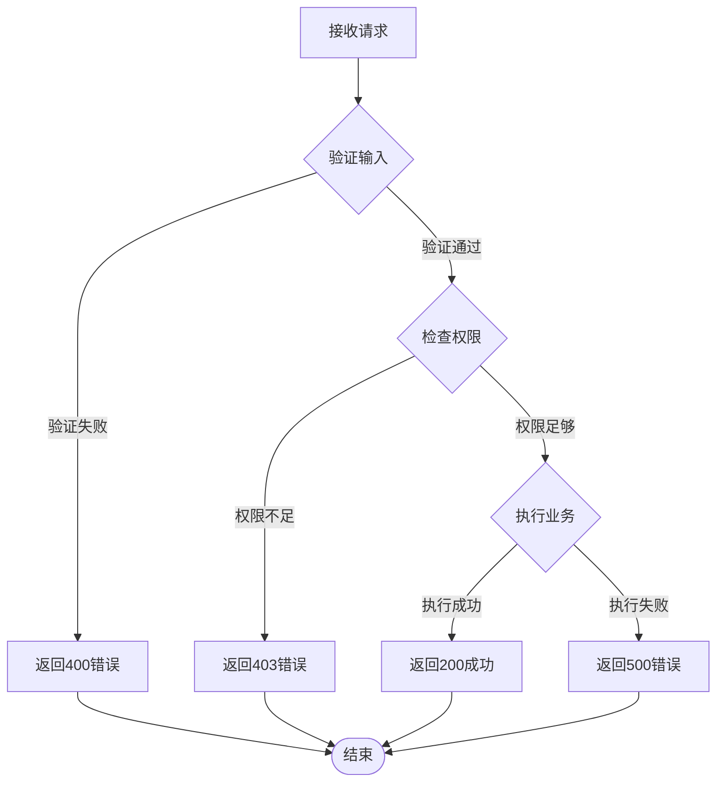
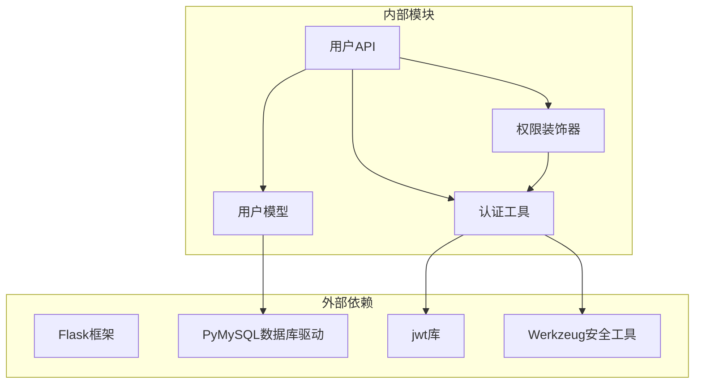

# 用户管理接口

<cite>
**本文档引用的文件**
- [backend/app/api/users.py](file://backend/app/api/users.py)
- [backend/app/models/user.py](file://backend/app/models/user.py)
- [backend/app/utils/decorators.py](file://backend/app/utils/decorators.py)
- [backend/app/utils/auth.py](file://backend/app/utils/auth.py)
- [backend/app/api/auth.py](file://backend/app/api/auth.py)
- [backend/init_db.py](file://backend/init_db.py)
- [frontend/src/api/users.js](file://frontend/src/api/users.js)
- [frontend/src/views/Users.vue](file://frontend/src/views/Users.vue)
- [backend/app/config.py](file://backend/app/config.py)
</cite>

## 目录
1. [简介](#简介)
2. [项目结构](#项目结构)
3. [核心组件](#核心组件)
4. [架构概览](#架构概览)
5. [详细组件分析](#详细组件分析)
6. [依赖关系分析](#依赖关系分析)
7. [性能考虑](#性能考虑)
8. [故障排除指南](#故障排除指南)
9. [结论](#结论)

## 简介

用户管理接口是运维平台的核心功能模块，提供完整的用户CRUD操作能力。该模块基于Flask框架构建，采用JWT令牌认证机制，支持管理员角色权限控制，实现了用户注册、登录、信息管理、密码重置等完整功能。

## 项目结构

运维平台采用前后端分离架构，用户管理模块位于后端Python Flask应用中，前端Vue.js应用负责用户界面交互。



**图表来源**
- [backend/app/api/users.py:1-268](file://backend/app/api/users.py#L1-L268)
- [backend/app/models/user.py:1-183](file://backend/app/models/user.py#L1-L183)
- [frontend/src/views/Users.vue:1-297](file://frontend/src/views/Users.vue#L1-L297)

**章节来源**
- [backend/app/api/users.py:1-268](file://backend/app/api/users.py#L1-L268)
- [backend/app/models/user.py:1-183](file://backend/app/models/user.py#L1-L183)
- [frontend/src/views/Users.vue:1-297](file://frontend/src/views/Users.vue#L1-L297)

## 核心组件

用户管理模块由以下核心组件构成：

### 1. 用户API控制器
- 蓝图路由：`/api/users`
- 权限要求：管理员角色
- 功能覆盖：用户CRUD操作、密码重置

### 2. 用户模型层
- 数据库操作：用户创建、查询、更新、删除
- 数据验证：用户名唯一性、密码强度、角色有效性
- 数据转换：密码哈希处理、时间戳管理

### 3. 认证与授权
- JWT令牌生成与验证
- 角色权限检查
- 请求头认证处理

**章节来源**
- [backend/app/api/users.py:14-268](file://backend/app/api/users.py#L14-L268)
- [backend/app/models/user.py:8-183](file://backend/app/models/user.py#L8-L183)
- [backend/app/utils/decorators.py:9-95](file://backend/app/utils/decorators.py#L9-L95)

## 架构概览

用户管理接口采用分层架构设计，确保关注点分离和代码可维护性。



**图表来源**
- [backend/app/api/users.py:17-268](file://backend/app/api/users.py#L17-L268)
- [backend/app/utils/decorators.py:9-95](file://backend/app/utils/decorators.py#L9-L95)
- [backend/app/models/user.py:83-102](file://backend/app/models/user.py#L83-L102)

## 详细组件分析

### 用户数据模型

用户数据模型定义了完整的用户信息结构和约束条件。

```mermaid
erDiagram
USERS {
INT id PK
VARCHAR username UK
VARCHAR password_hash
VARCHAR display_name
VARCHAR role
BOOLEAN is_active
DATETIME created_at
DATETIME updated_at
}
INDEX idx_username ON USERS(username)
INDEX idx_role ON USERS(role)
```

**图表来源**
- [backend/init_db.py:34-47](file://backend/init_db.py#L34-L47)

#### 字段定义

| 字段名 | 类型 | 约束 | 描述 |
|--------|------|------|------|
| id | INT | 主键, 自增 | 用户唯一标识符 |
| username | VARCHAR(100) | 唯一, 非空 | 用户登录名 |
| password_hash | VARCHAR(255) | 非空 | 密码哈希值 |
| display_name | VARCHAR(100) | 非空 | 用户显示名称 |
| role | VARCHAR(50) | 默认: operator | 用户角色(admin/operator/viewer) |
| is_active | BOOLEAN | 默认: TRUE | 用户激活状态 |
| created_at | DATETIME | 默认: 当前时间 | 创建时间戳 |
| updated_at | DATETIME | 默认: 当前时间 | 更新时间戳 |

**章节来源**
- [backend/init_db.py:34-47](file://backend/init_db.py#L34-L47)
- [backend/app/models/user.py:83-102](file://backend/app/models/user.py#L83-L102)

### 认证与授权机制

系统采用JWT令牌进行身份认证，结合角色权限控制实现细粒度的访问管理。



**图表来源**
- [backend/app/utils/decorators.py:20-56](file://backend/app/utils/decorators.py#L20-L56)
- [backend/app/utils/decorators.py:73-93](file://backend/app/utils/decorators.py#L73-L93)

#### JWT配置

| 配置项 | 默认值 | 说明 |
|--------|--------|------|
| JWT_SECRET_KEY | jwt-secret-key-change-in-prod | JWT签名密钥 |
| JWT_EXPIRATION_HOURS | 24 | Token过期时间(小时) |
| SECRET_KEY | ops-platform-secret-key-change-in-prod | 应用密钥 |

**章节来源**
- [backend/app/utils/auth.py:11-35](file://backend/app/utils/auth.py#L11-L35)
- [backend/app/config.py:4-21](file://backend/app/config.py#L4-L21)

### 用户CRUD操作API

#### 获取用户列表

**接口定义**
- 方法: GET
- URL: `/api/users`
- 权限: 管理员(admin)

**请求参数**
- 支持查询参数: search(关键词搜索)
- 分页: 无内置分页，返回所有用户

**响应数据格式**
```json
{
  "code": 200,
  "data": [
    {
      "id": 1,
      "username": "admin",
      "display_name": "系统管理员",
      "role": "admin",
      "is_active": true,
      "created_at": "2024-01-01T00:00:00",
      "updated_at": "2024-01-01T00:00:00"
    }
  ]
}
```

**章节来源**
- [backend/app/api/users.py:17-31](file://backend/app/api/users.py#L17-L31)
- [backend/app/models/user.py:83-102](file://backend/app/models/user.py#L83-L102)

#### 获取单个用户详情

**接口定义**
- 方法: GET
- URL: `/api/users/{id}`
- 权限: 管理员(admin)

**URL参数**
- id: 用户ID(整数)

**响应数据格式**
```json
{
  "code": 200,
  "data": {
    "id": 1,
    "username": "admin",
    "display_name": "系统管理员",
    "role": "admin",
    "is_active": true,
    "created_at": "2024-01-01T00:00:00",
    "updated_at": "2024-01-01T00:00:00"
  }
}
```

**章节来源**
- [backend/app/models/user.py:61-80](file://backend/app/models/user.py#L61-L80)

#### 创建用户

**接口定义**
- 方法: POST
- URL: `/api/users`
- 权限: 管理员(admin)

**请求体字段**
```json
{
  "username": "string",           // 用户名(必填)
  "password": "string",           // 密码(必填, 最少6位)
  "display_name": "string",       // 显示名称(必填)
  "role": "string"                // 角色(可选, 默认operator)
}
```

**验证规则**
- username: 非空，唯一性检查
- password: 非空，长度≥6
- display_name: 非空
- role: 必须是admin/operator/viewer之一

**响应数据格式**
```json
{
  "code": 200,
  "message": "用户创建成功",
  "data": {
    "id": 1
  }
}
```

**章节来源**
- [backend/app/api/users.py:33-96](file://backend/app/api/users.py#L33-L96)
- [backend/app/models/user.py:39-58](file://backend/app/models/user.py#L39-L58)

#### 更新用户

**接口定义**
- 方法: PUT
- URL: `/api/users/{id}`
- 权限: 管理员(admin)

**请求体字段**
```json
{
  "display_name": "string",       // 显示名称
  "role": "string",               // 角色
  "is_active": boolean            // 激活状态
}
```

**验证规则**
- 至少包含一个更新字段
- role必须是admin/operator/viewer之一
- 不能修改当前登录用户的role

**响应数据格式**
```json
{
  "code": 200,
  "message": "用户更新成功"
}
```

**章节来源**
- [backend/app/api/users.py:99-163](file://backend/app/api/users.py#L99-L163)
- [backend/app/models/user.py:105-135](file://backend/app/models/user.py#L105-L135)

#### 删除用户

**接口定义**
- 方法: DELETE
- URL: `/api/users/{id}`
- 权限: 管理员(admin)

**特殊规则**
- 不能删除当前登录的用户
- 会级联删除相关的定时任务

**响应数据格式**
```json
{
  "code": 200,
  "message": "用户删除成功"
}
```

**章节来源**
- [backend/app/api/users.py:166-207](file://backend/app/api/users.py#L166-L207)
- [backend/app/models/user.py:138-158](file://backend/app/models/user.py#L138-L158)

#### 重置用户密码

**接口定义**
- 方法: PUT
- URL: `/api/users/{id}/reset-password`
- 权限: 管理员(admin)

**请求体字段**
```json
{
  "new_password": "string"         // 新密码(必填, 最少6位)
}
```

**验证规则**
- new_password: 非空，长度≥6

**响应数据格式**
```json
{
  "code": 200,
  "message": "密码重置成功"
}
```

**章节来源**
- [backend/app/api/users.py:210-267](file://backend/app/api/users.py#L210-L267)

### 错误处理机制

系统采用统一的错误响应格式，包含标准的状态码和错误信息。



**图表来源**
- [backend/app/api/users.py:45-96](file://backend/app/api/users.py#L45-L96)
- [backend/app/utils/decorators.py:76-88](file://backend/app/utils/decorators.py#L76-L88)

**章节来源**
- [backend/app/api/users.py:45-207](file://backend/app/api/users.py#L45-L207)
- [backend/app/utils/decorators.py:24-45](file://backend/app/utils/decorators.py#L24-L45)

## 依赖关系分析

用户管理模块的依赖关系清晰明确，遵循单一职责原则。



**图表来源**
- [backend/app/api/users.py:5-12](file://backend/app/api/users.py#L5-L12)
- [backend/app/models/user.py:4](file://backend/app/models/user.py#L4)
- [backend/app/utils/auth.py:4-8](file://backend/app/utils/auth.py#L4-L8)

### 关键依赖关系

1. **API层依赖模型层**: 用户API调用用户模型进行数据库操作
2. **模型层依赖数据库**: 用户模型通过数据库连接执行SQL操作
3. **认证层依赖工具模块**: 权限装饰器使用认证工具进行Token验证
4. **前端依赖后端API**: Vue组件通过API封装调用后端接口

**章节来源**
- [backend/app/api/users.py:8-12](file://backend/app/api/users.py#L8-L12)
- [backend/app/models/user.py:23-36](file://backend/app/models/user.py#L23-L36)

## 性能考虑

### 数据库优化

1. **索引策略**
   - 用户名字段建立唯一索引，确保查询效率
   - 角色字段建立普通索引，支持角色过滤查询

2. **查询优化**
   - 用户列表按创建时间倒序排列，便于查看最新用户
   - 单用户查询使用主键索引，O(1)时间复杂度

### 缓存策略

系统目前未实现专门的用户信息缓存，建议：
- 在高频查询场景下添加Redis缓存
- 对用户权限信息进行短期缓存
- 实现缓存失效策略，确保数据一致性

### 安全考虑

1. **密码安全**
   - 使用Werkzeug的generate_password_hash进行密码哈希
   - 支持密码强度验证，最小长度6位

2. **权限控制**
   - JWT令牌过期时间24小时
   - 角色权限严格检查，防止越权操作

## 故障排除指南

### 常见问题及解决方案

#### 认证失败
**症状**: 返回401错误
**原因**: 
- 缺少Authorization头
- Token格式不正确(Bearer格式)
- Token已过期或无效

**解决方法**:
1. 确保请求头格式: `Authorization: Bearer <token>`
2. 重新登录获取新的Token
3. 检查服务器时间同步

#### 权限不足
**症状**: 返回403错误
**原因**: 当前用户不是管理员角色
**解决方法**: 使用管理员账户登录

#### 用户名冲突
**症状**: 返回409错误
**原因**: 用户名已存在
**解决方法**: 使用不同的用户名

#### 数据验证错误
**症状**: 返回400错误
**原因**: 请求数据不符合验证规则
**解决方法**: 检查必填字段和数据格式

**章节来源**
- [backend/app/utils/decorators.py:22-45](file://backend/app/utils/decorators.py#L22-L45)
- [backend/app/api/users.py:56-83](file://backend/app/api/users.py#L56-L83)

### 调试技巧

1. **启用调试模式**: 设置`FLASK_DEBUG=true`
2. **检查日志**: 查看服务器端错误日志
3. **验证Token**: 使用JWT调试工具验证Token有效性
4. **数据库连接**: 确认数据库连接参数正确

## 结论

用户管理接口提供了完整的企业级用户管理功能，具有以下特点：

1. **安全性**: 采用JWT认证和角色权限控制，确保系统安全
2. **完整性**: 支持完整的CRUD操作和密码管理
3. **易用性**: 统一的API设计和错误处理机制
4. **可扩展性**: 清晰的架构设计便于功能扩展

建议后续改进方向：
- 添加分页查询支持
- 实现用户搜索过滤功能
- 增加批量操作支持
- 添加用户操作审计日志