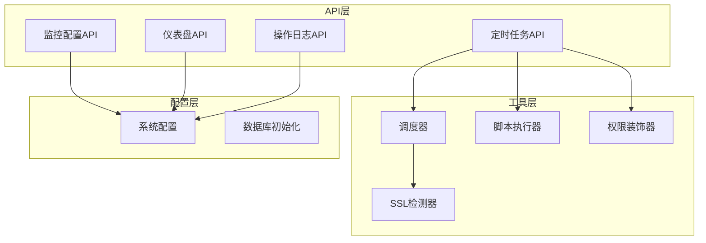
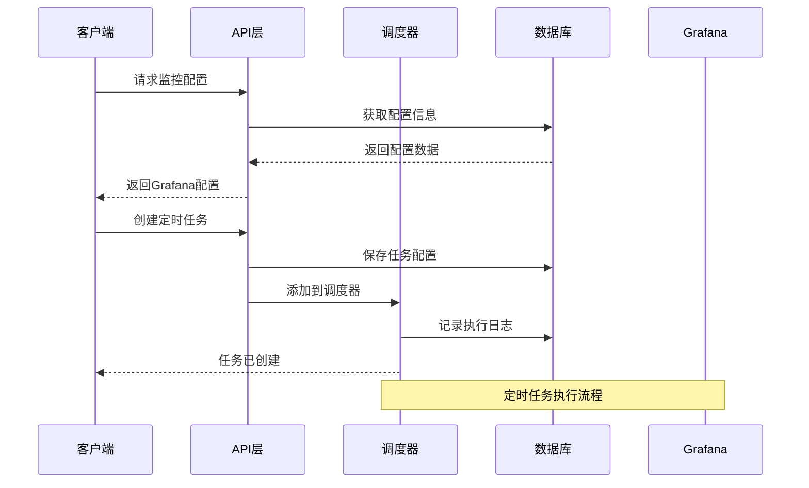
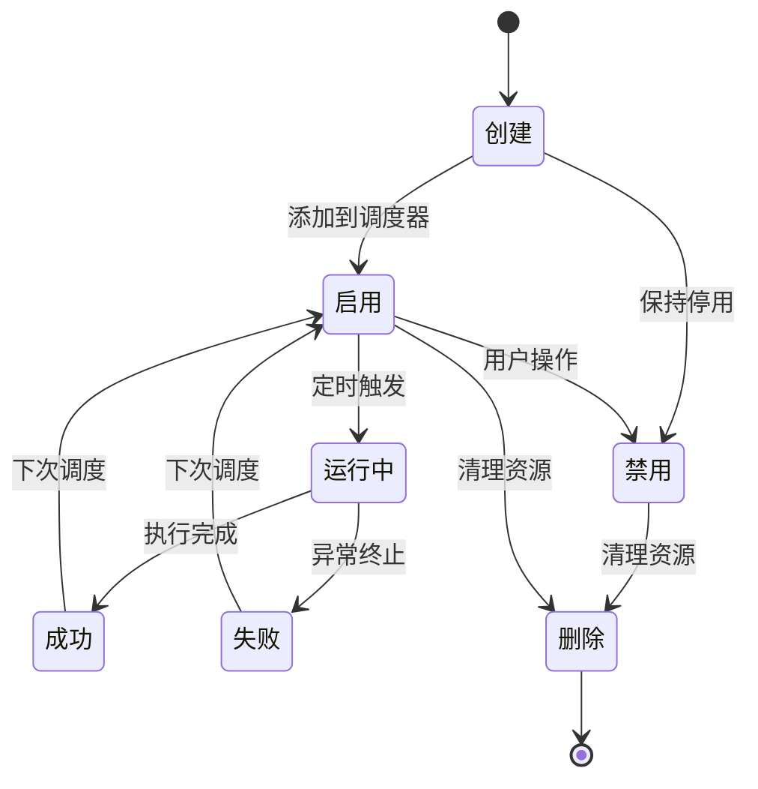
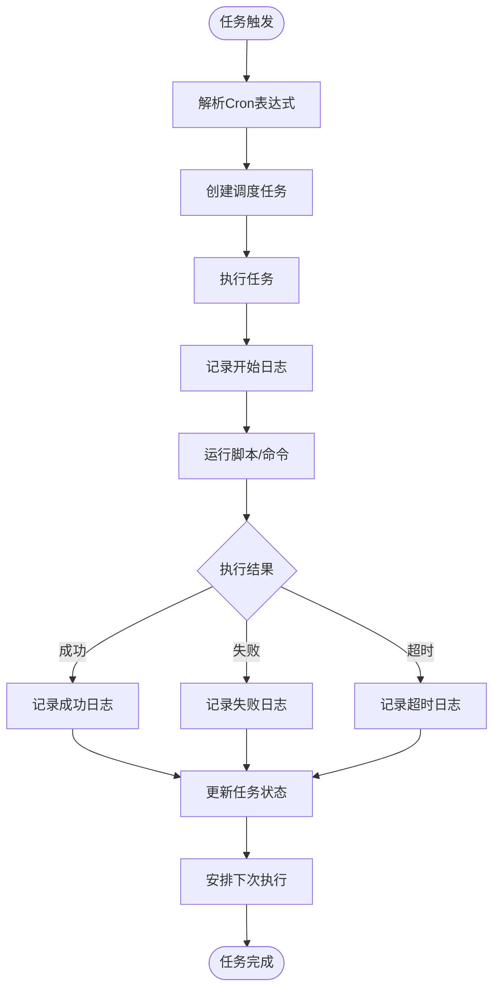
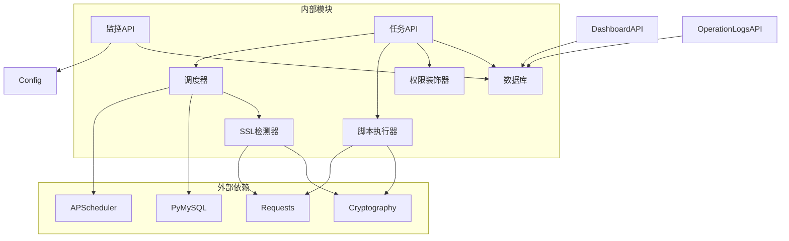

# 系统监控API

<cite>
**本文档引用的文件**
- [monitoring.py](file://backend/app/api/monitoring.py)
- [tasks.py](file://backend/app/api/tasks.py)
- [scheduler.py](file://backend/app/utils/scheduler.py)
- [config.py](file://backend/app/config.py)
- [script_runner.py](file://backend/app/utils/script_runner.py)
- [decorators.py](file://backend/app/utils/decorators.py)
- [dashboard.py](file://backend/app/api/dashboard.py)
- [operation_logs.py](file://backend/app/api/operation_logs.py)
- [init_db.py](file://backend/init_db.py)
- [ssl_checker.py](file://backend/app/utils/ssl_checker.py)
- [run.py](file://backend/run.py)
</cite>

## 目录
1. [简介](#简介)
2. [项目结构](#项目结构)
3. [核心组件](#核心组件)
4. [架构概览](#架构概览)
5. [详细组件分析](#详细组件分析)
6. [依赖关系分析](#依赖关系分析)
7. [性能考虑](#性能考虑)
8. [故障排除指南](#故障排除指南)
9. [结论](#结论)

## 简介

系统监控API模块提供了完整的系统健康监控和定时任务管理功能。该模块集成了Grafana监控配置、系统性能监控、资源使用统计、异常检测等功能，同时提供了强大的定时任务调度能力，包括任务队列管理、并发控制和失败重试机制。

## 项目结构

系统监控API模块采用Flask蓝图架构，主要包含以下核心文件：

**图表来源**
- [monitoring.py:1-43](file://backend/app/api/monitoring.py#L1-L43)
- [tasks.py:1-674](file://backend/app/api/tasks.py#L1-L674)
- [scheduler.py:1-580](file://backend/app/utils/scheduler.py#L1-L580)

**章节来源**
- [monitoring.py:1-43](file://backend/app/api/monitoring.py#L1-L43)
- [tasks.py:1-674](file://backend/app/api/tasks.py#L1-L674)
- [config.py:1-58](file://backend/app/config.py#L1-L58)

## 核心组件

### 监控配置管理

监控配置API负责管理Grafana集成配置，提供监控仪表板的URL和仪表板UID配置。

### 定时任务管理

定时任务API提供了完整的任务生命周期管理，包括任务创建、更新、删除、启用/禁用、手动执行和日志查看功能。

### 调度器系统

基于APScheduler的后台调度器，支持Cron表达式调度、任务并发控制和异常处理。

### 性能监控

仪表盘API提供系统关键指标的统计信息，包括服务器、服务、证书等资源的分布情况。

**章节来源**
- [monitoring.py:11-42](file://backend/app/api/monitoring.py#L11-L42)
- [tasks.py:105-673](file://backend/app/api/tasks.py#L105-L673)
- [scheduler.py:244-384](file://backend/app/utils/scheduler.py#L244-L384)

## 架构概览

系统采用分层架构设计，确保各组件职责清晰、耦合度低：

**图表来源**
- [monitoring.py:11-42](file://backend/app/api/monitoring.py#L11-L42)
- [tasks.py:145-256](file://backend/app/api/tasks.py#L145-L256)
- [scheduler.py:181-228](file://backend/app/utils/scheduler.py#L181-L228)

## 详细组件分析

### 监控配置API

监控配置API提供Grafana集成的完整配置管理：

#### 接口定义

| 方法 | 路径 | 权限 | 功能 |
|------|------|------|------|
| GET | `/api/monitoring/config` | monitoring模块权限 | 获取Grafana监控配置 |

#### 配置管理

系统支持以下Grafana配置项：

- **GRAFANA_URL**: Grafana服务器地址
- **GRAFANA_DASHBOARDS**: 仪表板配置数组，包含名称和UID
- **默认配置**: 主机监控、容器监控仪表板

**章节来源**
- [monitoring.py:11-42](file://backend/app/api/monitoring.py#L11-L42)
- [config.py:52-53](file://backend/app/config.py#L52-L53)

### 定时任务API

定时任务API提供完整的任务管理功能：

#### 任务生命周期

#### 核心接口

| 方法 | 路径 | 权限 | 功能 |
|------|------|------|------|
| GET | `/api/tasks` | tasks模块权限 | 获取任务列表 |
| POST | `/api/tasks` | admin/operator | 创建新任务 |
| PUT | `/api/tasks/<task_id>` | admin/operator | 更新任务配置 |
| DELETE | `/api/tasks/<task_id>` | admin/operator | 删除任务 |
| POST | `/api/tasks/<task_id>/toggle` | admin/operator | 启用/禁用任务 |
| POST | `/api/tasks/<task_id>/run` | admin/operator | 手动执行任务 |
| GET | `/api/tasks/<task_id>/logs` | tasks模块权限 | 查看执行日志 |

#### 任务类型支持

系统支持多种任务执行方式：

1. **Python脚本 (.py)**: 直接使用Python解释器执行
2. **Shell脚本 (.sh)**: 使用bash或sh执行
3. **SQL脚本 (.sql)**: 通过MySQL客户端执行

**章节来源**
- [tasks.py:105-673](file://backend/app/api/tasks.py#L105-L673)
- [script_runner.py:49-115](file://backend/app/utils/script_runner.py#L49-L115)

### 调度器系统

调度器基于APScheduler实现，提供可靠的任务调度功能：

#### 调度器特性

- **Cron表达式支持**: 标准5字段Cron表达式格式
- **并发控制**: 线程池管理，避免任务竞争
- **异常处理**: 完善的错误捕获和恢复机制
- **超时控制**: 默认300秒执行超时

#### 任务执行流程

**图表来源**
- [scheduler.py:39-178](file://backend/app/utils/scheduler.py#L39-L178)
- [scheduler.py:181-228](file://backend/app/utils/scheduler.py#L181-L228)

**章节来源**
- [scheduler.py:244-384](file://backend/app/utils/scheduler.py#L244-L384)

### 性能监控

仪表盘API提供系统关键指标的实时统计：

#### 统计指标

- **资源统计**: 服务器、服务、应用、域名、证书、项目数量
- **到期提醒**: 即将过期的证书和域名（30天内）
- **分布统计**: 环境类型、服务分类、账号分布、项目关联统计

#### 数据来源

系统从多个业务表中聚合数据，提供全面的系统视图：

- `servers`: 服务器台账统计
- `services`: 服务清单统计  
- `accounts`: 账号台账统计
- `domains`: 域名管理统计
- `ssl_certificates`: 证书管理统计
- `projects`: 项目管理统计

**章节来源**
- [dashboard.py:22-165](file://backend/app/api/dashboard.py#L22-L165)

### 操作日志管理

操作日志API提供完整的审计功能：

#### 日志记录

系统自动记录所有重要操作，包括：
- 用户认证操作（登录、登出）
- 资源管理操作（创建、更新、删除）
- 系统管理操作（配置变更）

#### 查询功能

支持按模块、操作类型、用户、时间范围等条件查询日志。

**章节来源**
- [operation_logs.py:20-135](file://backend/app/api/operation_logs.py#L20-L135)

## 依赖关系分析

系统各组件之间的依赖关系如下：

**图表来源**
- [scheduler.py:1-15](file://backend/app/utils/scheduler.py#L1-L15)
- [script_runner.py:1-126](file://backend/app/utils/script_runner.py#L1-L126)

**章节来源**
- [init_db.py:193-238](file://backend/init_db.py#L193-L238)

## 性能考虑

### 调度器性能优化

1. **线程池管理**: 使用独立线程执行任务，避免阻塞主进程
2. **连接池**: 数据库连接采用独立连接，减少连接开销
3. **超时控制**: 默认300秒执行超时，防止任务长时间占用资源
4. **异常隔离**: 每个任务在独立线程中执行，异常不影响其他任务

### 数据库优化

1. **索引优化**: 关键查询字段建立适当索引
2. **批量操作**: 日志查询支持批量处理
3. **连接复用**: 调度器使用独立数据库连接

### 缓存策略

1. **配置缓存**: 监控配置在应用启动时加载
2. **权限缓存**: 用户权限在认证时验证
3. **任务状态**: 最近执行状态缓存到任务表

## 故障排除指南

### 常见问题及解决方案

#### 监控配置问题

**问题**: Grafana配置无法获取
**原因**: 环境变量未正确设置
**解决**: 检查GRAFANA_URL和GRAFANA_DASHBOARDS配置

#### 任务执行失败

**问题**: 任务执行超时
**解决**: 
1. 检查脚本执行时间
2. 调整超时设置（默认300秒）
3. 优化脚本性能

**问题**: 任务无法找到脚本文件
**解决**: 
1. 确认脚本文件路径正确
2. 检查文件权限
3. 验证文件存在性

#### 调度器启动失败

**问题**: 调度器无法启动
**解决**:
1. 检查数据库连接配置
2. 验证Cron表达式格式
3. 确认任务文件完整性

**章节来源**
- [monitoring.py:21-29](file://backend/app/api/monitoring.py#L21-L29)
- [tasks.py:532-542](file://backend/app/api/tasks.py#L532-L542)
- [scheduler.py:376-383](file://backend/app/utils/scheduler.py#L376-L383)

## 结论

系统监控API模块提供了完整的监控和任务管理解决方案。通过Grafana集成、定时任务调度、性能监控和操作审计等功能，为企业级应用提供了可靠的运维保障。

### 主要优势

1. **完整的监控体系**: 集成Grafana配置管理和系统指标统计
2. **灵活的任务调度**: 支持多种脚本类型和执行方式
3. **完善的权限控制**: 基于JWT的细粒度权限管理
4. **可靠的异常处理**: 完善的错误捕获和恢复机制
5. **可扩展的架构**: 模块化设计，易于扩展新功能

### 未来改进方向

1. **增强告警功能**: 集成更多告警渠道和规则
2. **性能优化**: 实现任务执行进度跟踪
3. **可视化增强**: 提供更丰富的监控图表
4. **自动化运维**: 增加更多自动化运维功能