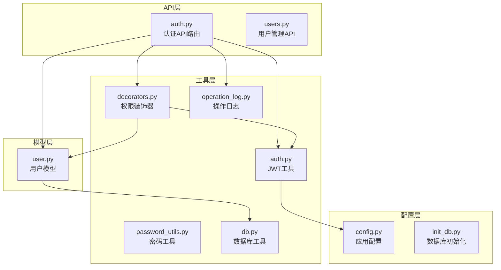
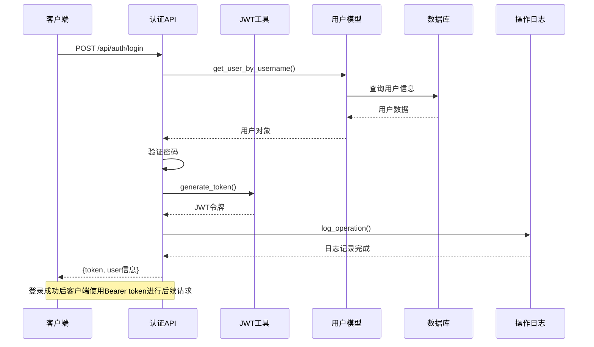
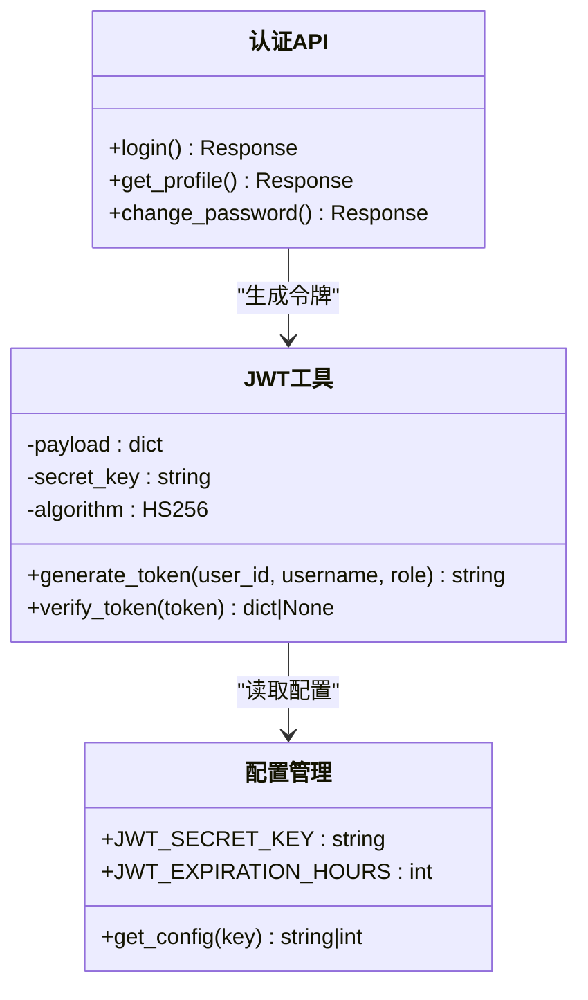
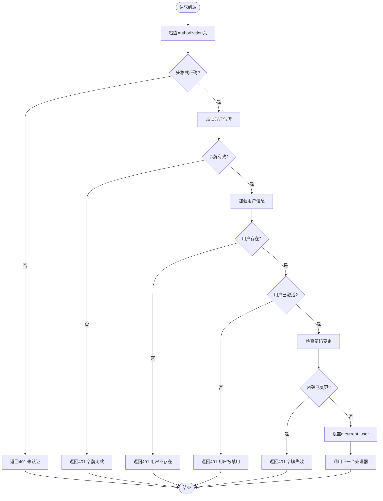
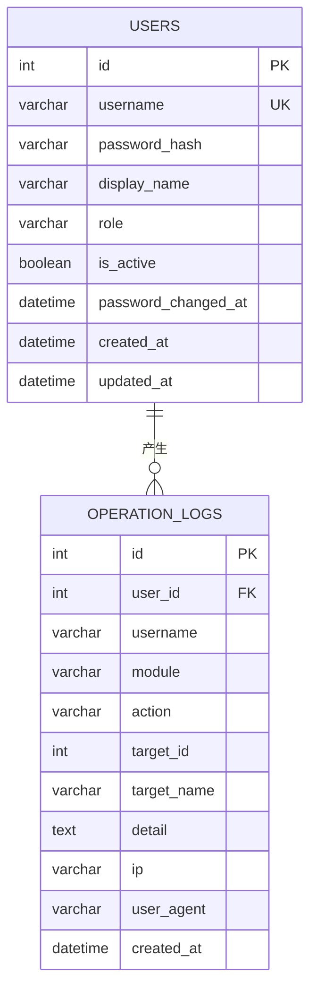
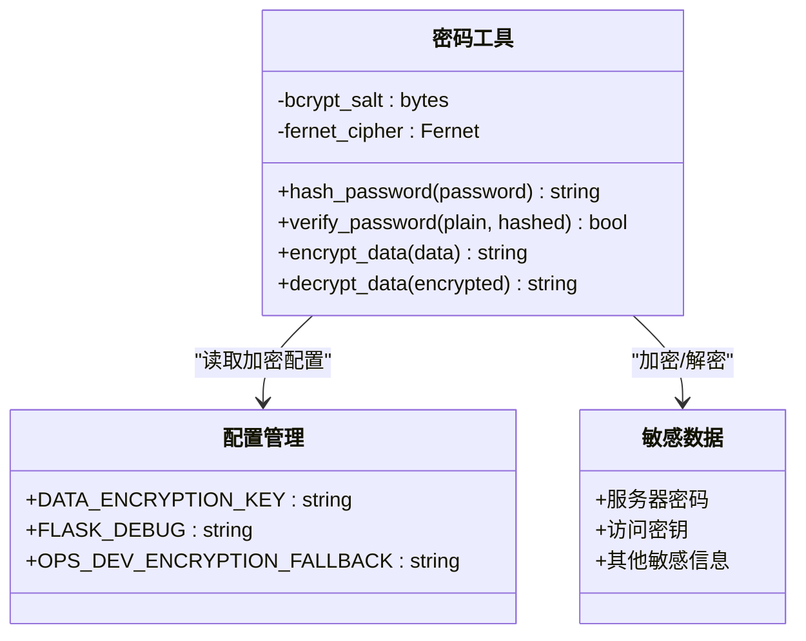
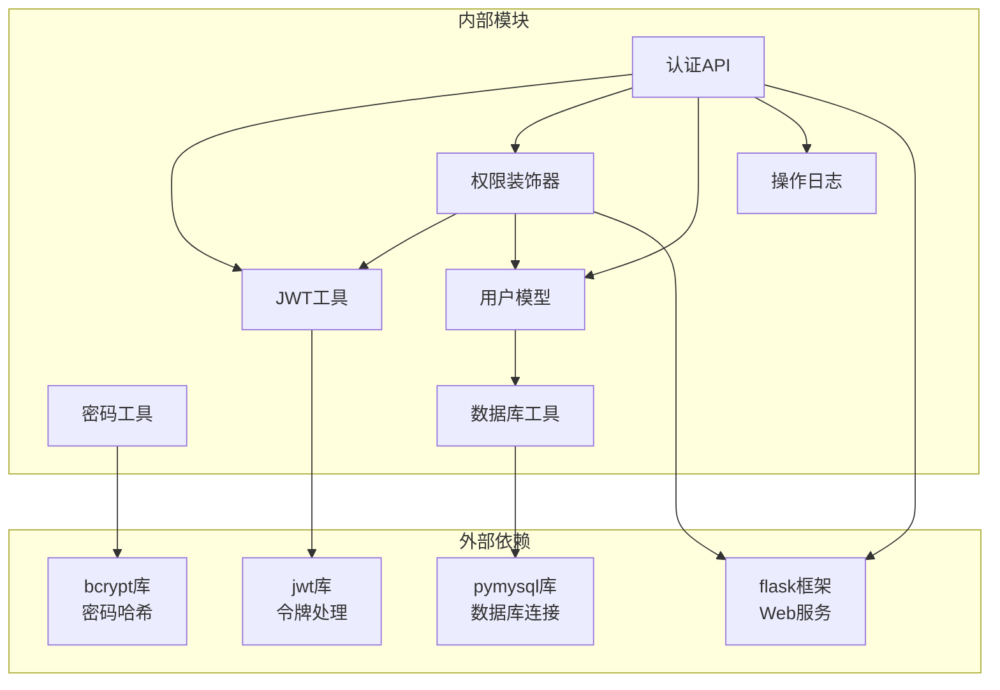

# 认证授权API

<cite>
**本文档引用的文件**
- [auth.py](file://backend/app/api/auth.py)
- [auth_utils.py](file://backend/app/utils/auth.py)
- [decorators.py](file://backend/app/utils/decorators.py)
- [password_utils.py](file://backend/app/utils/password_utils.py)
- [user_model.py](file://backend/app/models/user.py)
- [config.py](file://backend/app/config.py)
- [operation_log.py](file://backend/app/utils/operation_log.py)
- [db.py](file://backend/app/utils/db.py)
- [init_db.py](file://backend/init_db.py)
</cite>

## 目录
1. [简介](#简介)
2. [项目结构](#项目结构)
3. [核心组件](#核心组件)
4. [架构概览](#架构概览)
5. [详细组件分析](#详细组件分析)
6. [依赖关系分析](#依赖关系分析)
7. [性能考虑](#性能考虑)
8. [故障排除指南](#故障排除指南)
9. [结论](#结论)

## 简介

本文件详细记录了OPS平台的认证授权模块API文档。该模块基于JWT（JSON Web Token）实现用户身份认证和授权控制，提供完整的用户登录、密码修改、用户信息获取等核心功能。系统采用Flask框架构建，使用MySQL作为数据存储，通过bcrypt算法进行密码加密，支持多角色权限控制和操作日志记录。

## 项目结构

认证授权模块主要分布在以下目录结构中：

**图表来源**
- [auth.py:1-197](file://backend/app/api/auth.py#L1-L197)
- [auth_utils.py:1-45](file://backend/app/utils/auth.py#L1-L45)
- [decorators.py:1-163](file://backend/app/utils/decorators.py#L1-L163)

**章节来源**
- [auth.py:1-197](file://backend/app/api/auth.py#L1-L197)
- [auth_utils.py:1-45](file://backend/app/utils/auth.py#L1-L45)
- [decorators.py:1-163](file://backend/app/utils/decorators.py#L1-L163)

## 核心组件

### 认证API蓝图
- **路由前缀**: `/api/auth`
- **认证方式**: JWT Bearer Token
- **令牌有效期**: 可配置，默认2小时
- **支持的角色**: admin（管理员）、operator（操作员）、viewer（查看员）

### 主要认证接口
1. **用户登录** (`POST /api/auth/login`)
2. **获取用户信息** (`GET /api/auth/profile`)
3. **修改密码** (`PUT /api/auth/password`)

**章节来源**
- [auth.py:12-197](file://backend/app/api/auth.py#L12-L197)
- [config.py:10-15](file://backend/app/config.py#L10-L15)

## 架构概览

认证系统的整体架构采用分层设计，确保职责分离和代码可维护性：

**图表来源**
- [auth.py:15-95](file://backend/app/api/auth.py#L15-L95)
- [auth_utils.py:9-28](file://backend/app/utils/auth.py#L9-L28)
- [user_model.py:36-52](file://backend/app/models/user.py#L36-L52)

## 详细组件分析

### JWT认证工具

JWT工具负责令牌的生成、验证和解析，是整个认证系统的核心组件。

**图表来源**
- [auth_utils.py:9-44](file://backend/app/utils/auth.py#L9-L44)
- [config.py:10-15](file://backend/app/config.py#L10-L15)

#### 令牌生成流程
1. 从配置中读取JWT_SECRET_KEY和JWT_EXPIRATION_HOURS
2. 创建包含用户标识、角色和时间戳的payload
3. 使用HS256算法和密钥生成签名
4. 返回JWT字符串

#### 令牌验证流程
1. 从请求头提取Authorization Bearer token
2. 使用相同的密钥和算法验证签名
3. 检查令牌是否过期
4. 返回解码后的payload或None

**章节来源**
- [auth_utils.py:9-44](file://backend/app/utils/auth.py#L9-L44)
- [config.py:10-15](file://backend/app/config.py#L10-L15)

### 权限装饰器

权限装饰器提供了统一的认证和授权控制机制，确保API的安全访问。

**图表来源**
- [decorators.py:26-123](file://backend/app/utils/decorators.py#L26-L123)

#### 认证检查步骤
1. **请求头验证**: 检查Authorization头是否存在且格式为"Bearer token"
2. **令牌验证**: 使用verify_token验证JWT的有效性和完整性
3. **用户存在性**: 通过用户ID查询数据库确认用户存在
4. **用户状态**: 检查用户是否已激活
5. **密码变更检查**: 验证令牌签发时间是否晚于密码最后修改时间

**章节来源**
- [decorators.py:26-123](file://backend/app/utils/decorators.py#L26-L123)

### 用户模型

用户模型封装了所有用户相关的数据库操作，提供安全的数据访问接口。

**图表来源**
- [user_model.py:35-47](file://backend/app/models/user.py#L35-L47)
- [init_db.py:34-47](file://backend/init_db.py#L34-L47)

#### 核心功能
1. **用户查询**: 支持按用户名和ID查询用户信息
2. **密码管理**: 提供密码哈希和验证功能
3. **用户状态**: 管理用户的激活状态和角色
4. **数据持久化**: 通过数据库连接进行安全的数据操作

**章节来源**
- [user_model.py:36-162](file://backend/app/models/user.py#L36-L162)
- [init_db.py:34-47](file://backend/init_db.py#L34-L47)

### 密码工具

密码工具模块实现了安全的密码处理机制，支持多种密码格式的兼容。

**图表来源**
- [password_utils.py:52-129](file://backend/app/utils/password_utils.py#L52-L129)

#### 密码处理流程
1. **密码哈希**: 使用bcrypt生成不可逆的密码哈希
2. **密码验证**: 支持bcrypt和Werkzeug scrypt两种格式
3. **敏感数据加密**: 使用Fernet对需要解密的敏感信息进行对称加密

**章节来源**
- [password_utils.py:52-129](file://backend/app/utils/password_utils.py#L52-L129)

## 依赖关系分析

认证系统的依赖关系清晰明确，遵循单一职责原则：

**图表来源**
- [auth.py:4-10](file://backend/app/api/auth.py#L4-L10)
- [auth_utils.py:4-6](file://backend/app/utils/auth.py#L4-L6)
- [decorators.py:6-7](file://backend/app/utils/decorators.py#L6-L7)

### 关键依赖说明

1. **JWT库**: 负责JWT令牌的生成、验证和解析
2. **bcrypt库**: 提供安全的密码哈希算法
3. **pymysql**: MySQL数据库连接和操作
4. **Flask**: Web框架和请求处理

**章节来源**
- [auth.py:4-10](file://backend/app/api/auth.py#L4-L10)
- [auth_utils.py:4-6](file://backend/app/utils/auth.py#L4-L6)

## 性能考虑

### 令牌有效期管理
- **默认有效期**: 2小时（可通过JWT_EXPIRATION_HOURS配置）
- **令牌刷新**: 当前实现不支持自动刷新，需要重新登录获取新令牌
- **内存优化**: 使用Flask的g对象缓存当前用户信息

### 数据库连接优化
- **连接池**: 使用Flask应用上下文缓存数据库连接
- **查询优化**: 为常用查询字段建立索引
- **事务管理**: 合理使用事务确保数据一致性

### 缓存策略
- **用户信息缓存**: 在请求上下文中缓存当前用户信息
- **配置缓存**: 配置信息在应用启动时加载并缓存

## 故障排除指南

### 常见认证问题

#### 401 未认证错误
**可能原因**:
1. 缺少Authorization头
2. Authorization头格式错误（非Bearer token）
3. 令牌已过期或无效

**解决方案**:
1. 确保请求头格式为: `Authorization: Bearer YOUR_TOKEN`
2. 检查令牌是否在有效期内
3. 重新登录获取新的令牌

#### 403 权限不足
**可能原因**:
1. 用户角色不满足API权限要求
2. 未正确配置角色权限装饰器

**解决方案**:
1. 检查用户角色配置
2. 确认API装饰器的权限要求

#### 500 服务器内部错误
**可能原因**:
1. JWT_SECRET_KEY未正确配置
2. 数据库连接失败
3. 密码加密/解密异常

**解决方案**:
1. 检查JWT_SECRET_KEY环境变量
2. 验证数据库连接配置
3. 查看应用日志获取详细错误信息

### 调试建议

1. **启用调试模式**: 设置FLASK_DEBUG=true获取更详细的错误信息
2. **检查日志**: 查看operation_logs表中的认证相关记录
3. **验证配置**: 确认所有必需的环境变量已正确设置

**章节来源**
- [decorators.py:35-44](file://backend/app/utils/decorators.py#L35-L44)
- [auth_utils.py:24-28](file://backend/app/utils/auth.py#L24-L28)

## 结论

OPS平台的认证授权模块采用现代的JWT技术实现了安全可靠的身份认证系统。通过清晰的分层架构、完善的权限控制和详细的操作日志记录，该模块为整个平台提供了坚实的安全基础。

### 主要优势
1. **安全性**: 使用JWT令牌和bcrypt密码哈希确保数据安全
2. **可扩展性**: 模块化设计支持角色权限的灵活扩展
3. **可观测性**: 完整的操作日志记录便于审计和故障排查
4. **易用性**: 清晰的API设计和错误处理机制

### 改进建议
1. **令牌刷新**: 考虑实现令牌自动刷新机制
2. **多因素认证**: 可选的MFA增强安全性
3. **会话管理**: 实现令牌黑名单机制支持主动登出

该认证系统为OPS平台的稳定运行提供了重要的安全保障，建议在生产环境中严格配置相关环境变量并定期审查安全策略。