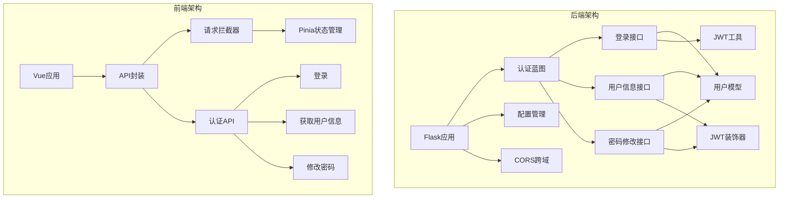
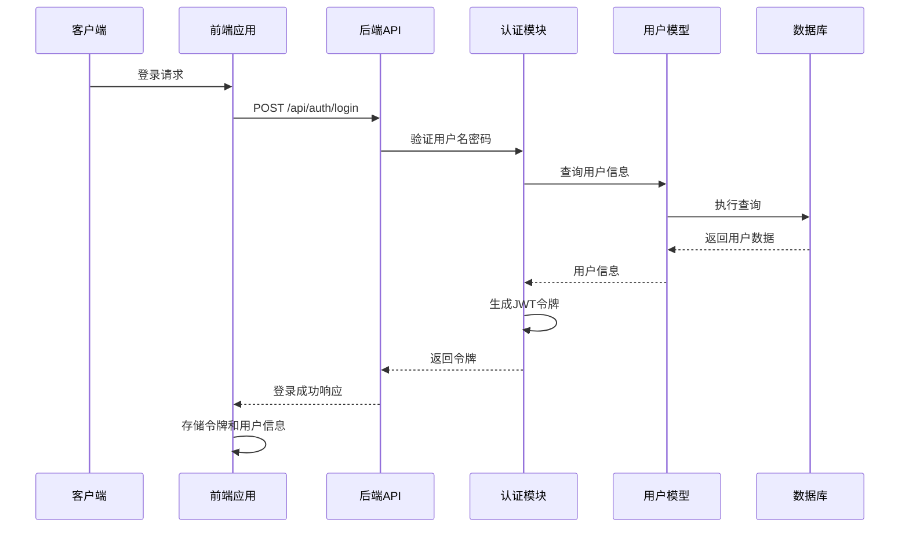
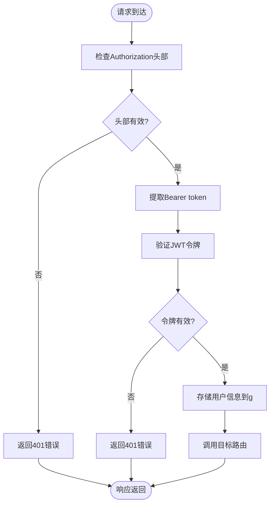
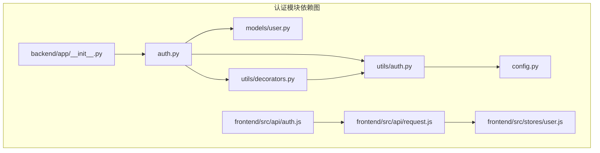

# 认证接口

<cite>
**本文档引用的文件**
- [backend/app/api/auth.py](file://backend/app/api/auth.py)
- [backend/app/utils/auth.py](file://backend/app/utils/auth.py)
- [backend/app/utils/decorators.py](file://backend/app/utils/decorators.py)
- [backend/app/models/user.py](file://backend/app/models/user.py)
- [backend/app/config.py](file://backend/app/config.py)
- [backend/app/__init__.py](file://backend/app/__init__.py)
- [frontend/src/api/auth.js](file://frontend/src/api/auth.js)
- [frontend/src/api/request.js](file://frontend/src/api/request.js)
- [frontend/src/stores/user.js](file://frontend/src/stores/user.js)
</cite>

## 目录
1. [简介](#简介)
2. [项目结构](#项目结构)
3. [核心组件](#核心组件)
4. [架构概览](#架构概览)
5. [详细组件分析](#详细组件分析)
6. [依赖分析](#依赖分析)
7. [性能考虑](#性能考虑)
8. [故障排除指南](#故障排除指南)
9. [结论](#结论)

## 简介

本文件为认证接口模块的详细API文档，涵盖以下三个核心接口：
- 用户登录接口：/api/auth/login，负责用户名密码验证与Token生成
- 当前用户信息获取接口：/api/auth/profile，基于JWT认证验证
- 密码修改接口：/api/auth/password，支持旧密码验证与新密码安全规则

文档将详细说明每个接口的请求参数格式、响应数据结构、错误码定义、认证头部设置，并提供完整的请求示例和响应示例，包括成功和失败场景。同时说明JWT Token的有效期管理和刷新机制，以及认证装饰器的使用方式。

## 项目结构

认证接口模块采用Flask蓝图设计，遵循前后端分离架构。后端使用Python Flask框架，前端使用Vue.js + Pinia状态管理。JWT认证通过自定义装饰器实现，配置项集中管理。



**图表来源**
- [backend/app/__init__.py:37-62](file://backend/app/__init__.py#L37-L62)
- [backend/app/api/auth.py:11](file://backend/app/api/auth.py#L11)

**章节来源**
- [backend/app/__init__.py:6-35](file://backend/app/__init__.py#L6-L35)
- [backend/app/config.py:4-21](file://backend/app/config.py#L4-L21)

## 核心组件

### JWT认证系统

JWT认证系统由三个核心组件构成：
- **令牌生成器**：负责生成包含用户信息的JWT令牌
- **令牌验证器**：验证JWT令牌的有效性并解码载荷
- **认证装饰器**：自动处理Authorization头部并验证令牌

### 用户模型

用户模型提供完整的用户数据访问功能，包括：
- 用户查询（按用户名和ID）
- 密码哈希生成
- 密码更新
- 用户信息管理

### 前端认证集成

前端通过Axios拦截器自动处理认证头部，Pinia状态管理持久化用户信息，提供完整的认证体验。

**章节来源**
- [backend/app/utils/auth.py:11-36](file://backend/app/utils/auth.py#L11-L36)
- [backend/app/utils/decorators.py:9-57](file://backend/app/utils/decorators.py#L9-L57)
- [backend/app/models/user.py:39-80](file://backend/app/models/user.py#L39-L80)

## 架构概览

认证系统的整体架构采用分层设计，确保职责分离和代码可维护性。



**图表来源**
- [backend/app/api/auth.py:14-82](file://backend/app/api/auth.py#L14-L82)
- [backend/app/utils/auth.py:11-36](file://backend/app/utils/auth.py#L11-L36)

## 详细组件分析

### 用户登录接口

#### 接口定义
- **URL**: `/api/auth/login`
- **方法**: POST
- **功能**: 验证用户凭据并生成JWT访问令牌

#### 请求参数
| 参数名 | 类型 | 必填 | 描述 |
|--------|------|------|------|
| username | string | 是 | 用户名 |
| password | string | 是 | 明文密码 |

#### 响应数据结构
成功响应包含令牌和用户基本信息：
```json
{
  "code": 200,
  "message": "登录成功",
  "data": {
    "token": "JWT_TOKEN_STRING",
    "user": {
      "id": 1,
      "username": "admin",
      "display_name": "管理员",
      "role": "admin"
    }
  }
}
```

#### 错误码定义
- **200**: 登录成功
- **400**: 请求体为空或参数缺失
- **401**: 用户名或密码错误，用户被禁用
- **404**: 用户不存在

#### 认证头部设置
登录成功后，客户端需要在后续请求中设置Authorization头部：
```
Authorization: Bearer YOUR_JWT_TOKEN
```

#### 请求示例
成功场景：
```
POST /api/auth/login
Content-Type: application/json

{
  "username": "admin",
  "password": "password123"
}
```

失败场景（用户名或密码错误）：
```
HTTP/1.1 401 Unauthorized
Content-Type: application/json

{
  "code": 401,
  "message": "用户名或密码错误"
}
```

**章节来源**
- [backend/app/api/auth.py:14-82](file://backend/app/api/auth.py#L14-L82)

### 当前用户信息获取接口

#### 接口定义
- **URL**: `/api/auth/profile`
- **方法**: GET
- **功能**: 获取当前登录用户的详细信息
- **认证**: 需要有效的JWT令牌

#### 请求头要求
- **Authorization**: Bearer token（必需）

#### 响应数据结构
```json
{
  "code": 200,
  "data": {
    "id": 1,
    "username": "admin",
    "display_name": "管理员",
    "role": "admin",
    "is_active": true,
    "created_at": "2024-01-01T00:00:00Z"
  }
}
```

#### 错误码定义
- **200**: 获取成功
- **401**: 缺少认证信息或Token无效
- **404**: 用户不存在

#### 请求示例
```
GET /api/auth/profile
Authorization: Bearer YOUR_JWT_TOKEN
```

响应示例：
```json
{
  "code": 200,
  "data": {
    "id": 1,
    "username": "admin",
    "display_name": "管理员",
    "role": "admin",
    "is_active": true,
    "created_at": "2024-01-01T00:00:00Z"
  }
}
```

**章节来源**
- [backend/app/api/auth.py:85-115](file://backend/app/api/auth.py#L85-L115)

### 密码修改接口

#### 接口定义
- **URL**: `/api/auth/password`
- **方法**: PUT
- **功能**: 修改用户密码
- **认证**: 需要有效的JWT令牌

#### 请求参数
| 参数名 | 类型 | 必填 | 描述 |
|--------|------|------|------|
| old_password | string | 是 | 旧密码 |
| new_password | string | 是 | 新密码（至少6位） |

#### 响应数据结构
成功响应：
```json
{
  "code": 200,
  "message": "密码修改成功"
}
```

#### 错误码定义
- **200**: 密码修改成功
- **400**: 请求体为空、参数缺失或新密码长度不足
- **401**: 旧密码错误
- **404**: 用户不存在
- **500**: 密码修改失败

#### 密码安全规则
- 新密码长度必须至少6位
- 密码将通过哈希算法存储，不保存明文

#### 请求示例
成功场景：
```
PUT /api/auth/password
Authorization: Bearer YOUR_JWT_TOKEN
Content-Type: application/json

{
  "old_password": "oldpassword123",
  "new_password": "newpassword456"
}
```

失败场景（旧密码错误）：
```
HTTP/1.1 400 Bad Request
Content-Type: application/json

{
  "code": 400,
  "message": "旧密码错误"
}
```

**章节来源**
- [backend/app/api/auth.py:118-184](file://backend/app/api/auth.py#L118-L184)

### JWT认证装饰器

#### 功能特性
- 自动从Authorization头部提取Bearer token
- 验证JWT令牌的有效性和签名
- 将用户信息注入到flask.g对象
- 支持错误处理和状态码返回

#### 使用方式
```python
from utils.decorators import jwt_required

@jwt_required
def protected_route():
    user_id = g.current_user['user_id']
    # 路由逻辑
```

#### 集成验证流程


**图表来源**
- [backend/app/utils/decorators.py:20-56](file://backend/app/utils/decorators.py#L20-L56)

**章节来源**
- [backend/app/utils/decorators.py:9-57](file://backend/app/utils/decorators.py#L9-L57)

## 依赖分析

认证模块的依赖关系清晰明确，遵循单一职责原则。



**图表来源**
- [backend/app/api/auth.py:7-9](file://backend/app/api/auth.py#L7-L9)
- [backend/app/__init__.py:39-51](file://backend/app/__init__.py#L39-L51)

### 关键依赖关系

1. **后端依赖链**：
   - auth.py → models/user.py（用户数据访问）
   - auth.py → utils/auth.py（JWT令牌生成）
   - auth.py → utils/decorators.py（认证装饰器）

2. **前端依赖链**：
   - auth.js → request.js（HTTP请求封装）
   - request.js → user.js（状态管理）

**章节来源**
- [backend/app/api/auth.py:4-9](file://backend/app/api/auth.py#L4-L9)
- [backend/app/__init__.py:39-51](file://backend/app/__init__.py#L39-L51)

## 性能考虑

### JWT令牌有效期管理

系统采用配置驱动的令牌有效期管理：
- 默认有效期：24小时
- 可通过环境变量调整
- 过期时间在令牌生成时确定

### 内存使用优化

- 用户信息仅在认证成功时存储在内存中
- 令牌验证使用无状态设计，无需服务器端存储
- 密码哈希计算在服务器端完成，客户端不处理敏感数据

### 并发处理

- Flask应用支持多线程并发处理
- JWT验证为纯计算操作，无数据库I/O
- 用户查询使用连接池管理数据库连接

## 故障排除指南

### 常见认证问题

#### 401 未授权错误
可能原因：
- 缺少Authorization头部
- Bearer token格式错误
- 令牌已过期
- 令牌签名无效

解决方法：
1. 确认Authorization头部格式正确：`Bearer YOUR_TOKEN`
2. 检查令牌是否在有效期内
3. 重新登录获取新的令牌

#### 400 参数错误
可能原因：
- 请求体为空
- 缺少必要参数
- 新密码长度不足

解决方法：
- 确保请求体包含所有必需参数
- 验证新密码符合长度要求

#### 404 用户不存在
可能原因：
- 用户已被删除
- 用户ID错误

解决方法：
- 检查用户是否存在
- 确认用户ID正确性

### 前端集成问题

#### 令牌存储
前端使用localStorage持久化令牌，确保页面刷新后仍保持登录状态。

#### 自动重定向
当收到401错误时，前端会自动清除本地存储并重定向到登录页。

**章节来源**
- [frontend/src/api/request.js:38-42](file://frontend/src/api/request.js#L38-L42)
- [frontend/src/stores/user.js:32-37](file://frontend/src/stores/user.js#L32-L37)

## 结论

认证接口模块提供了完整、安全、易用的身份验证解决方案。通过JWT令牌机制实现了无状态认证，配合装饰器模式简化了权限控制。前后端分离的设计确保了良好的用户体验和代码可维护性。

主要优势：
- **安全性**：JWT令牌包含用户身份信息，支持过期机制
- **易用性**：统一的错误处理和响应格式
- **可扩展性**：装饰器模式支持灵活的权限控制
- **可靠性**：完善的错误处理和状态管理

建议的最佳实践：
- 生产环境中务必设置安全的JWT密钥
- 定期轮换JWT密钥
- 实施适当的速率限制防止暴力破解
- 考虑实现双因子认证增强安全性