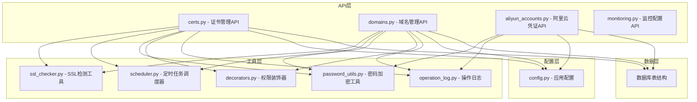
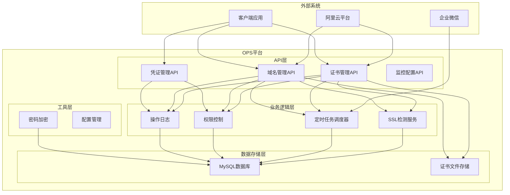
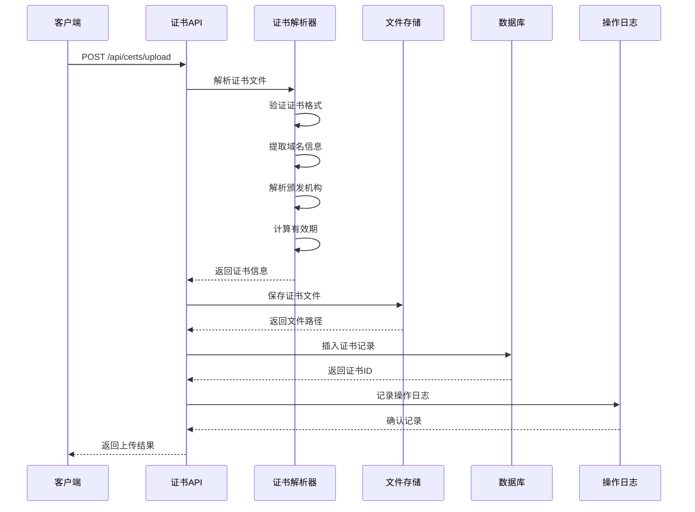
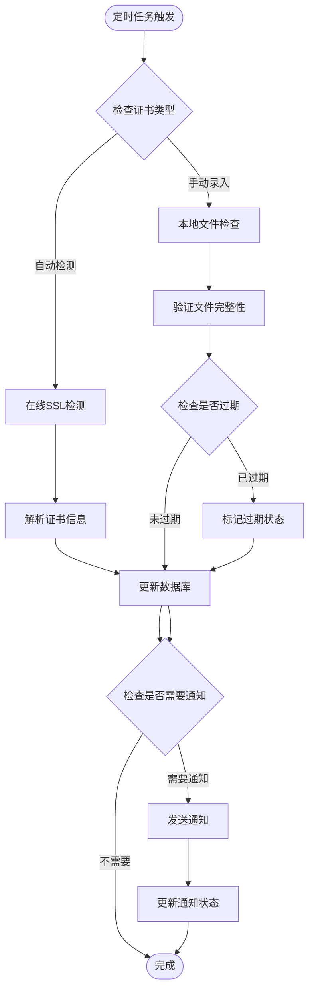
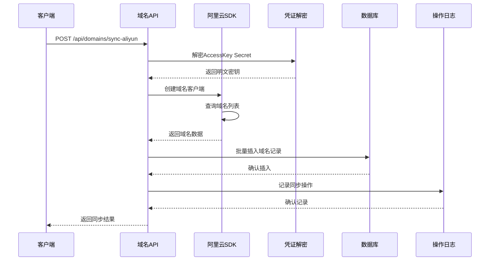
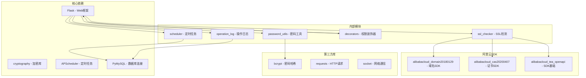
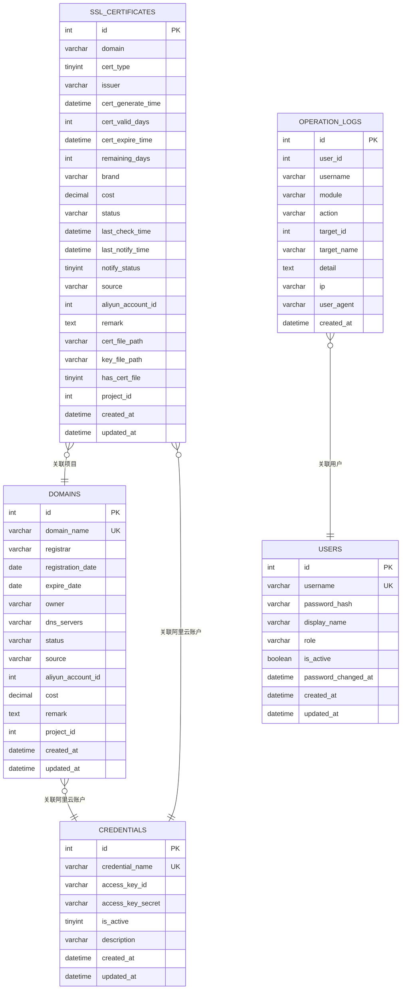

# 证书域名管理API

<cite>
**本文档引用的文件**
- [certs.py](file://backend/app/api/certs.py)
- [domains.py](file://backend/app/api/domains.py)
- [aliyun_accounts.py](file://backend/app/api/aliyun_accounts.py)
- [ssl_checker.py](file://backend/app/utils/ssl_checker.py)
- [scheduler.py](file://backend/app/utils/scheduler.py)
- [password_utils.py](file://backend/app/utils/password_utils.py)
- [decorators.py](file://backend/app/utils/decorators.py)
- [operation_log.py](file://backend/app/utils/operation_log.py)
- [config.py](file://backend/app/config.py)
- [monitoring.py](file://backend/app/api/monitoring.py)
- [init_db.py](file://backend/init_db.py)
- [Domains.vue](file://frontend/src/views/Domains.vue)
- [domains.ts](file://frontend/src/api/domains.ts)
</cite>

## 更新摘要
**变更内容**
- 修复了阿里云域名同步模块的logging初始化问题，确保异常处理中也能正确记录日志
- 增强了前端通知系统的用户反馈，提供更详细的统计信息
- 优化了域名同步的错误处理和日志记录机制

## 目录
1. [简介](#简介)
2. [项目结构](#项目结构)
3. [核心组件](#核心组件)
4. [架构概览](#架构概览)
5. [详细组件分析](#详细组件分析)
6. [依赖关系分析](#依赖关系分析)
7. [性能考虑](#性能考虑)
8. [故障排除指南](#故障排除指南)
9. [结论](#结论)

## 简介

OPS平台的证书和域名管理模块提供了全面的SSL证书生命周期管理和域名解析管理功能。该模块集成了阿里云API，支持自动证书申请、域名验证、证书续期、证书部署等核心功能，同时提供监控告警、到期提醒等运维保障机制。

该模块主要包含以下核心功能：
- SSL证书的上传、解析、存储和管理
- 域名信息的同步、查询和状态监控
- 阿里云API集成，支持证书申请和域名管理
- 自动化监控和到期提醒机制
- 证书文件的安全存储和管理
- 完整的操作日志记录和审计功能

## 项目结构

**图表来源**
- [certs.py:1-800](file://backend/app/api/certs.py#L1-L800)
- [domains.py:1-670](file://backend/app/api/domains.py#L1-L670)
- [aliyun_accounts.py:1-275](file://backend/app/api/aliyun_accounts.py#L1-L275)

**章节来源**
- [certs.py:1-800](file://backend/app/api/certs.py#L1-L800)
- [domains.py:1-670](file://backend/app/api/domains.py#L1-L670)
- [aliyun_accounts.py:1-275](file://backend/app/api/aliyun_accounts.py#L1-L275)

## 核心组件

### 证书管理组件

证书管理模块提供了完整的SSL证书生命周期管理功能，包括证书上传、解析、存储、状态监控等核心能力。

**主要特性：**
- 支持多种证书格式解析（PEM、CRT、CER）
- 自动证书链管理
- 证书状态实时监控
- 证书文件安全存储
- 手动录入和自动检测两种模式

### 域名管理组件

域名管理模块专注于域名信息的维护和监控，提供域名同步、状态跟踪和到期提醒功能。

**主要特性：**
- 阿里云域名信息同步
- 域名状态实时监控
- 到期时间跟踪
- DNS服务器管理
- 域名状态分级管理

### 阿里云集成组件

提供与阿里云平台的深度集成，支持证书申请、域名管理等云端操作。

**主要特性：**
- 阿里云凭证安全管理
- 证书自动申请和下载
- 域名信息自动同步
- API调用封装和错误处理

**章节来源**
- [certs.py:154-800](file://backend/app/api/certs.py#L154-L800)
- [domains.py:34-670](file://backend/app/api/domains.py#L34-L670)
- [aliyun_accounts.py:19-275](file://backend/app/api/aliyun_accounts.py#L19-L275)

## 架构概览

**图表来源**
- [ssl_checker.py:1-613](file://backend/app/utils/ssl_checker.py#L1-L613)
- [scheduler.py:1-580](file://backend/app/utils/scheduler.py#L1-L580)
- [password_utils.py:1-133](file://backend/app/utils/password_utils.py#L1-L133)

## 详细组件分析

### 证书管理API详解

#### 证书上传和解析流程

**图表来源**
- [certs.py:325-468](file://backend/app/api/certs.py#L325-L468)
- [ssl_checker.py:48-166](file://backend/app/utils/ssl_checker.py#L48-L166)

#### 证书状态监控流程

**图表来源**
- [scheduler.py:391-533](file://backend/app/utils/scheduler.py#L391-L533)
- [certs.py:590-714](file://backend/app/api/certs.py#L590-L714)

#### 证书文件存储管理

证书文件采用安全的存储策略，防止路径遍历攻击并确保文件组织有序：

**存储规则：**
- 证书文件存储在 `uploads/certs/{cert_id}/` 目录下
- 文件名使用域名转换为安全格式（星号替换为 `_wildcard_`）
- 支持证书文件和私钥文件的分离存储
- 自动创建必要的目录结构

**章节来源**
- [certs.py:133-151](file://backend/app/api/certs.py#L133-L151)
- [certs.py:417-441](file://backend/app/api/certs.py#L417-L441)

### 域名管理API详解

#### 阿里云域名同步流程

**图表来源**
- [domains.py:339-599](file://backend/app/api/domains.py#L339-L599)
- [password_utils.py:116-133](file://backend/app/utils/password_utils.py#L116-L133)

#### 域名到期提醒机制

域名到期提醒采用分级通知策略，根据剩余天数提供不同级别的预警：

**提醒级别：**
- `EXPIRED`: 已过期（≤0天）
- `URGENT`: 紧急（≤3天）
- `WARNING`: 严重（≤7天）
- `NORMAL`: 提醒（≤15天）
- `INFO`: 注意（>15天）

**章节来源**
- [domains.py:339-599](file://backend/app/api/domains.py#L339-L599)
- [scheduler.py:535-580](file://backend/app/utils/scheduler.py#L535-L580)

### 阿里云凭证管理

#### 凭证安全存储

阿里云凭证采用对称加密存储，确保敏感信息的安全性：

**加密流程：**
1. 使用Fernet对称加密算法
2. 支持从环境变量获取加密密钥
3. 开发环境提供默认密钥（仅用于开发）
4. 生产环境必须设置专用密钥

### 前端通知系统增强

#### 域名同步统计反馈

前端系统增强了域名同步的用户反馈机制，提供详细的统计信息：

**统计信息包括：**
- 同步的域名总数
- 新增域名数量
- 跳过的重复域名数量
- 多账户同步的聚合统计

**章节来源**
- [domains.py:366-367](file://backend/app/api/domains.py#L366-L367)
- [Domains.vue:413-438](file://frontend/src/views/Domains.vue#L413-L438)
- [domains.ts:19-21](file://frontend/src/api/domains.ts#L19-L21)

## 依赖关系分析

**图表来源**
- [ssl_checker.py:21-34](file://backend/app/utils/ssl_checker.py#L21-L34)
- [scheduler.py:1-14](file://backend/app/utils/scheduler.py#L1-L14)

### 数据模型关系

**图表来源**
- [init_db.py:341-393](file://backend/init_db.py#L341-L393)

**章节来源**
- [init_db.py:341-393](file://backend/init_db.py#L341-L393)
- [config.py:10-58](file://backend/app/config.py#L10-L58)

## 性能考虑

### SSL检测性能优化

系统实现了多TLS版本降级机制，确保在不同网络环境下都能成功获取证书信息：

**性能优化策略：**
- 支持TLS 1.3 → TLS 1.2 → TLS 1.1 → TLS 1 的降级机制
- 超时时间可配置，默认10秒
- 异步处理避免阻塞主线程
- 缓存机制减少重复检测

### 定时任务调度

采用APScheduled框架实现高效的定时任务管理：

**调度特性：**
- 支持Cron表达式精确控制执行时间
- 线程池管理避免资源耗尽
- 任务状态持久化确保系统重启后状态恢复
- 可配置的重试机制提高可靠性

### 数据库优化

**索引策略：**
- 证书表按域名、到期时间、状态建立复合索引
- 域名表按域名唯一索引确保数据完整性
- 操作日志表按时间、模块、动作建立索引

### 日志记录优化

**更新** 增强了日志记录的可靠性和完整性：

- 在`sync_aliyun_domains()`函数中修复了logging初始化问题
- 确保异常处理中也能正确记录日志
- 添加了详细的API响应调试信息
- 支持多层级的日志记录和错误追踪

**章节来源**
- [ssl_checker.py:84-166](file://backend/app/utils/ssl_checker.py#L84-L166)
- [scheduler.py:181-242](file://backend/app/utils/scheduler.py#L181-L242)
- [domains.py:366-367](file://backend/app/api/domains.py#L366-L367)
- [init_db.py:388-392](file://backend/init_db.py#L388-L392)

## 故障排除指南

### 常见问题诊断

#### 证书上传失败

**可能原因：**
1. 证书文件格式不正确（非PEM格式）
2. 文件大小超过限制（10MB）
3. 域名已存在重复记录
4. 文件权限问题导致无法写入

**解决步骤：**
1. 验证证书文件格式和完整性
2. 检查文件大小是否符合要求
3. 确认域名唯一性
4. 检查存储目录权限

#### SSL检测超时

**可能原因：**
1. 网络连接不稳定
2. 目标服务器SSL配置问题
3. 防火墙阻止连接
4. TLS版本不兼容

**解决步骤：**
1. 检查网络连通性
2. 验证目标服务器SSL配置
3. 检查防火墙规则
4. 调整超时配置参数

#### 阿里云API调用失败

**可能原因：**
1. 凭证配置错误
2. 网络连接问题
3. API权限不足
4. SDK版本不兼容

**解决步骤：**
1. 验证AccessKey配置
2. 检查网络连接状态
3. 确认API权限范围
4. 更新SDK到最新版本

#### 域名同步日志记录问题

**更新** 修复了域名同步过程中的日志记录问题：

**可能症状：**
- 同步过程中缺少详细日志信息
- 异常情况下日志记录不完整
- API响应调试信息缺失

**解决步骤：**
1. 确保在函数开头正确导入logging模块
2. 初始化logger实例
3. 在关键节点添加详细的日志记录
4. 验证异常处理中的日志输出

### 日志分析

系统提供详细的日志记录功能，便于问题诊断：

**关键日志类型：**
- 操作日志：记录所有用户操作
- 错误日志：记录系统异常
- 调试日志：记录详细执行过程
- 安全日志：记录认证和授权事件

**章节来源**
- [operation_log.py:49-119](file://backend/app/utils/operation_log.py#L49-L119)
- [ssl_checker.py:165-166](file://backend/app/utils/ssl_checker.py#L165-L166)

## 结论

OPS平台的证书和域名管理模块提供了企业级的SSL证书生命周期管理和域名解析管理解决方案。通过集成阿里云API、实现自动化监控和到期提醒、提供安全的凭证存储机制，该模块能够满足现代企业的IT运维需求。

**主要优势：**
- 完整的证书生命周期管理
- 深度的阿里云平台集成
- 智能的监控和告警机制
- 安全可靠的数据存储
- 灵活的权限控制和审计功能
- 增强的用户反馈和统计信息

**适用场景：**
- 企业级SSL证书管理
- 多域名环境下的证书监控
- 自动化的证书续期流程
- 云端基础设施的统一管理
- 多账户域名同步管理

该模块为企业数字化转型提供了坚实的基础设施支撑，能够有效提升IT运维效率和安全性。