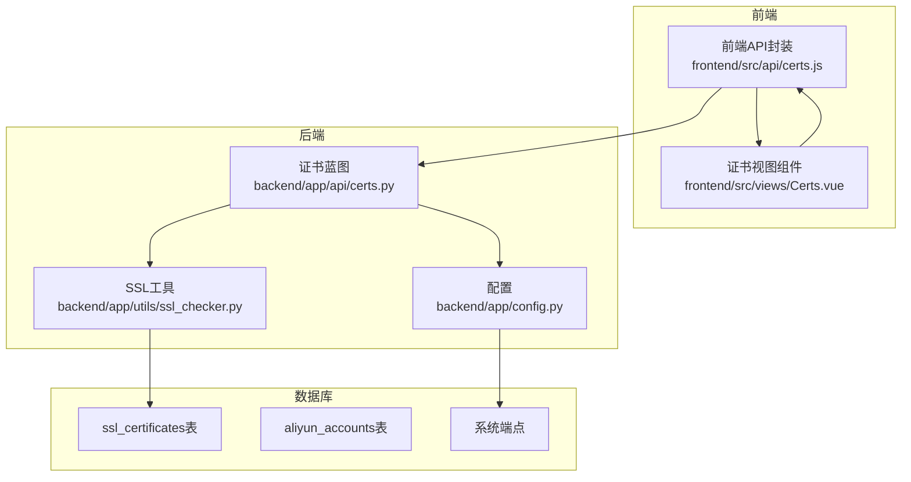
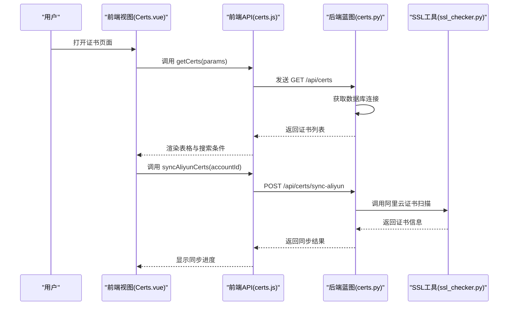
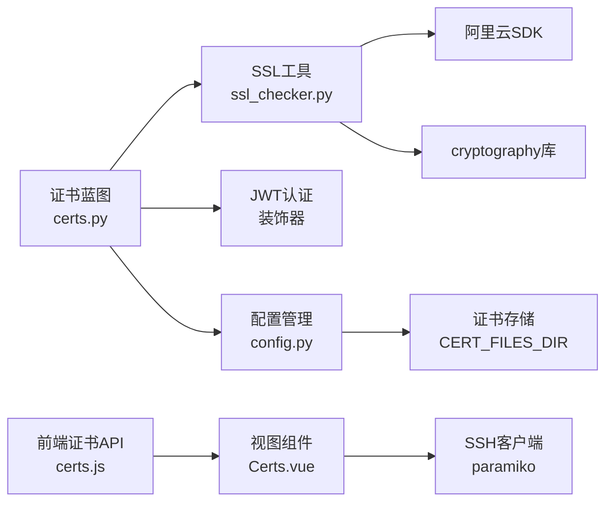

# 证书管理接口

<cite>
**本文引用的文件**
- [backend/app/api/certs.py](file://backend/app/api/certs.py)
- [backend/app/utils/ssl_checker.py](file://backend/app/utils/ssl_checker.py)
- [backend/app/config.py](file://backend/app/config.py)
- [frontend/src/api/certs.js](file://frontend/src/api/certs.js)
- [frontend/src/views/Certs.vue](file://frontend/src/views/Certs.vue)
</cite>

## 更新摘要
**变更内容**
- 新增证书上传并自动创建接口，支持从PEM格式证书文件自动解析域名、颁发机构、有效期等信息
- 新增为现有证书上传文件接口，支持multipart/form-data请求处理
- 增强证书文件管理功能，包括上传、下载、删除证书文件
- 改进证书状态跟踪机制，提供更好的证书生命周期管理
- 新增远程部署功能，支持通过SSH/SFTP部署证书到服务器
- 增强证书解析功能，支持PEM格式证书的详细信息提取

## 目录
1. [简介](#简介)
2. [项目结构](#项目结构)
3. [核心组件](#核心组件)
4. [架构总览](#架构总览)
5. [详细组件分析](#详细组件分析)
6. [依赖分析](#依赖分析)
7. [性能考虑](#性能考虑)
8. [故障排查指南](#故障排查指南)
9. [结论](#结论)
10. [附录](#附录)

## 简介
本文件为证书管理接口的详细API文档，覆盖以下能力：
- 证书CRUD操作：获取证书列表、获取证书详情、上传证书、更新证书、删除证书
- 证书数据模型字段定义与业务含义
- 证书到期提醒、自动续期触发机制与证书状态监控
- 证书上传格式要求、PEM格式验证与私钥保护措施
- 证书监控告警配置与处理流程（过期前预警与失效通知）
- **新增**：阿里云证书同步、证书文件管理、远程部署功能

说明：
- 当前后端实现提供完整的证书管理功能，包括基础CRUD操作、阿里云证书同步、证书文件管理、远程部署等高级功能
- 到期提醒、自动续期与监控告警功能已完整实现，提供全面的证书生命周期管理

## 项目结构
后端采用Flask蓝图组织API，前端使用Vue + Element Plus进行展示与交互，数据库初始化脚本定义了证书表结构与定时任务相关表。

**图表来源**
- [backend/app/api/certs.py:1-1322](file://backend/app/api/certs.py#L1-L1322)
- [backend/app/utils/ssl_checker.py:1-614](file://backend/app/utils/ssl_checker.py#L1-L614)
- [backend/app/config.py:1-38](file://backend/app/config.py#L1-L38)
- [frontend/src/api/certs.js:1-71](file://frontend/src/api/certs.js#L1-L71)
- [frontend/src/views/Certs.vue:1-861](file://frontend/src/views/Certs.vue#L1-L861)

## 核心组件
- **证书API蓝图**：提供完整的证书管理接口，包括CRUD操作、阿里云同步、文件管理、远程部署等功能
- **SSL工具模块**：提供SSL证书检测、阿里云证书扫描、证书文件下载、微信通知等功能
- **配置管理**：提供CERT_FILES_DIR等关键配置项，支持证书文件存储路径管理
- **前端API封装**：对后端REST接口进行封装，支持证书文件上传、下载、部署等操作
- **前端视图组件**：负责证书列表展示、搜索、新增/编辑弹窗、文件管理、远程部署等功能

**章节来源**
- [backend/app/api/certs.py:11-1322](file://backend/app/api/certs.py#L11-L1322)
- [backend/app/utils/ssl_checker.py:1-614](file://backend/app/utils/ssl_checker.py#L1-L614)
- [backend/app/config.py:36-38](file://backend/app/config.py#L36-L38)
- [frontend/src/api/certs.js:1-71](file://frontend/src/api/certs.js#L1-L71)
- [frontend/src/views/Certs.vue:1-861](file://frontend/src/views/Certs.vue#L1-L861)

## 架构总览
证书管理的前后端交互与数据流如下：

**图表来源**
- [frontend/src/views/Certs.vue:327-343](file://frontend/src/views/Certs.vue#L327-L343)
- [frontend/src/api/certs.js:33-36](file://frontend/src/api/certs.js#L33-L36)
- [backend/app/api/certs.py:730-947](file://backend/app/api/certs.py#L730-L947)
- [backend/app/utils/ssl_checker.py:169-302](file://backend/app/utils/ssl_checker.py#L169-L302)

## 详细组件分析

### 证书数据模型与字段定义
证书数据模型存储于数据库表 ssl_certificates 中，字段定义如下：
- **id**：自增主键
- **domain**：域名（必填）
- **project_name**：项目名称（必填）
- **cert_type**：证书类型（0=自动检测, 1=手动录入, 2=阿里云证书）
- **issuer**：颁发机构
- **cert_generate_time**：证书生成时间
- **cert_valid_days**：证书有效天数
- **cert_expire_time**：证书到期时间
- **remaining_days**：剩余天数
- **brand**：品牌
- **cost**：费用
- **status**：状态（0=已过期, 1=正常）
- **source**：来源（manual/aliyun/upload）
- **aliyun_account_id**：阿里云账户ID
- **remark**：备注
- **has_cert_file**：是否有证书文件（0/1）
- **cert_file_path**：证书文件路径
- **key_file_path**：私钥文件路径
- **last_check_time**：最后检测时间
- **last_notify_time**：最后通知时间
- **notify_status**：通知状态
- **created_at / updated_at**：创建与更新时间戳

**字段复杂度与索引**：
- 主键索引：id
- 普通索引：domain, cert_type, status, aliyun_account_id
- 字段类型与约束：遵循MySQL建表定义，部分字段为可空或文本类型

**章节来源**
- [backend/app/api/certs.py:137-149](file://backend/app/api/certs.py#L137-L149)

### 证书API接口定义
#### 基础CRUD操作
- **获取证书列表**
  - 方法与路径：GET /api/certs
  - 查询参数：search（域名/项目名模糊搜索）、cert_type（证书类型过滤）、page、page_size
  - 返回：状态码、数据数组、总数
  - 权限：需JWT认证
- **获取证书详情**
  - 方法与路径：GET /api/certs/<id>
  - 参数：id（整数）
  - 返回：状态码、单条证书数据
  - 权限：需JWT认证
- **创建证书**
  - 方法与路径：POST /api/certs
  - 请求体：证书字段集合（domain、project_name必填）
  - 返回：状态码、消息、新增记录ID
  - 权限：需JWT认证且角色为admin或operator
- **更新证书**
  - 方法与路径：PUT /api/certs/<id>
  - 参数：id（整数）
  - 请求体：可选字段集合
  - 返回：状态码、消息
  - 权限：需JWT认证且角色为admin或operator
- **删除证书**
  - 方法与路径：DELETE /api/certs/<id>
  - 参数：id（整数）
  - 返回：状态码、消息
  - 权限：需JWT认证且角色为admin或operator

#### 证书上传与创建
- **上传并创建证书**
  - 方法与路径：POST /api/certs/upload
  - 请求头：Content-Type: multipart/form-data
  - 表单字段：
    - cert_file: 证书文件(.pem/.crt)，必填
    - key_file: 私钥文件(.key)，可选
    - project_name: 项目名称，必填
    - brand: 品牌，可选
    - cost: 费用，可选
    - remark: 备注，可选
  - 返回：状态码、消息、证书详情（包含解析出的域名、颁发机构、有效期等）
  - 权限：需JWT认证且角色为admin或operator
  - **功能**：自动解析PEM格式证书文件，提取域名、颁发机构、有效期等信息，创建证书记录并保存文件

#### SSL在线检测
- **批量检测**
  - 方法与路径：POST /api/certs/check
  - 请求体：{ ids: [1,2,3] }（可选，不传则检测所有自动检测类型证书）
  - 返回：状态码、检测统计、详细结果
  - 权限：需JWT认证且角色为admin或operator
- **单个检测**
  - 方法与路径：POST /api/certs/check/<id>
  - 参数：id（整数）
  - 返回：状态码、证书详细信息
  - 权限：需JWT认证且角色为admin或operator

#### 阿里云证书同步
- **同步阿里云证书**
  - 方法与路径：POST /api/certs/sync-aliyun
  - 请求体：{ account_id: 1 }
  - 返回：状态码、同步统计（synced、updated、skipped、downloaded、download_failed）
  - 权限：需JWT认证且角色为admin或operator
  - 功能：扫描阿里云证书，自动下载证书文件到本地存储

#### 证书文件管理
- **上传证书文件**
  - 方法与路径：POST /api/certs/<id>/upload
  - 参数：id（整数）
  - 请求头：Content-Type: multipart/form-data
  - 表单字段：cert_file（必填）、key_file（可选）
  - 返回：状态码、上传结果、文件路径
  - 权限：需JWT认证且角色为admin或operator
- **下载证书文件**
  - 方法与路径：GET /api/certs/<id>/download
  - 参数：id（整数）
  - 返回：状态码、ZIP压缩包（包含.pem和.key文件）
  - 权限：需JWT认证
- **删除证书文件**
  - 方法与路径：DELETE /api/certs/<id>/files
  - 参数：id（整数）
  - 返回：状态码、消息
  - 权限：需JWT认证且角色为admin或operator

#### 远程部署
- **部署证书到服务器**
  - 方法与路径：POST /api/certs/<id>/deploy
  - 参数：id（整数）
  - 请求体：{ server_id: 1, remote_path: "/etc/nginx/ssl/", ssh_user: "root" }
  - 返回：状态码、部署结果、远程文件路径
  - 权限：需JWT认证且角色为admin或operator
  - 功能：通过SSH/SFTP将证书文件部署到远程服务器

#### 通知功能
- **手动触发微信预警**
  - 方法与路径：POST /api/certs/notify
  - 返回：状态码、通知统计
  - 权限：需JWT认证且角色为admin或operator
  - 功能：向企业微信群机器人发送即将过期证书的预警通知

**章节来源**
- [backend/app/api/certs.py:120-281](file://backend/app/api/certs.py#L120-L281)
- [backend/app/api/certs.py:284-404](file://backend/app/api/certs.py#L284-L404)
- [backend/app/api/certs.py:407-509](file://backend/app/api/certs.py#L407-L509)
- [backend/app/api/certs.py:512-727](file://backend/app/api/certs.py#L512-L727)
- [backend/app/api/certs.py:730-947](file://backend/app/api/certs.py#L730-L947)
- [backend/app/api/certs.py:1019-1192](file://backend/app/api/certs.py#L1019-L1192)
- [backend/app/api/certs.py:1195-1321](file://backend/app/api/certs.py#L1195-L1321)
- [frontend/src/api/certs.js:13-18](file://frontend/src/api/certs.js#L13-L18)
- [frontend/src/api/certs.js:50-55](file://frontend/src/api/certs.js#L50-L55)

### SSL证书检测与解析
#### 证书解析功能
- **PEM格式解析**
  - 支持解析PEM格式的证书文件
  - 提取域名（CN/SAN）、颁发机构、有效期等信息
  - 计算证书有效天数和剩余天数
  - 支持通配符域名处理

#### SSL在线检测
- **多TLS版本支持**
  - 支持TLS 1.3、1.2、1.1、1.0版本的证书检测
  - 自动降级机制，确保兼容性
  - 超时控制和异常处理
- **证书信息提取**
  - 提取subject、issuer、serial_number、version等详细信息
  - 支持国际化域名检测
  - 错误日志记录和调试信息

**章节来源**
- [backend/app/api/certs.py:24-87](file://backend/app/api/certs.py#L24-L87)
- [backend/app/utils/ssl_checker.py:48-166](file://backend/app/utils/ssl_checker.py#L48-L166)

### 阿里云证书集成
#### 证书扫描
- **阿里云SDK集成**
  - 使用Alibaba Cloud CAS SDK进行证书扫描
  - 支持多种响应格式（snake_case/PascalCase）
  - 错误处理和重试机制
- **证书信息提取**
  - 提取域名、颁发机构、有效期等信息
  - 支持证书ID识别和下载准备

#### 证书下载
- **文件下载功能**
  - 通过GetUserCertificateDetail API下载证书内容
  - 支持证书和私钥同时下载
  - 错误处理和日志记录

**章节来源**
- [backend/app/utils/ssl_checker.py:169-302](file://backend/app/utils/ssl_checker.py#L169-L302)
- [backend/app/utils/ssl_checker.py:495-614](file://backend/app/utils/ssl_checker.py#L495-L614)

### 前端交互与表单校验
#### 列表页面功能
- **搜索功能**：支持按域名/项目名搜索，证书类型筛选
- **分页显示**：支持自定义每页数量，总数统计
- **状态展示**：剩余天数按颜色标识（正常/即将过期/已过期）
- **操作按钮**：检测、编辑、删除、上传、下载、部署等操作

#### 弹窗功能
- **新增/编辑弹窗**：包含必填项校验（域名、项目名称）
- **阿里云同步弹窗**：输入阿里云账户ID进行证书同步
- **证书文件上传弹窗**：支持选择.pem/.crt/.key格式文件
- **远程部署弹窗**：选择服务器和远程目录进行部署
- **上传并创建弹窗**：支持直接上传证书文件并自动解析创建

#### 文件管理
- **上传功能**：支持证书文件和私钥文件上传
- **下载功能**：一键下载ZIP压缩包，包含证书和私钥
- **部署功能**：通过SSH/SFTP部署到远程服务器

**章节来源**
- [frontend/src/views/Certs.vue:1-861](file://frontend/src/views/Certs.vue#L1-L861)
- [frontend/src/api/certs.js:1-71](file://frontend/src/api/certs.js#L1-L71)

### 配置管理
#### 关键配置项
- **CERT_FILES_DIR**：证书文件存储目录，默认为UPLOAD_FOLDER/certs
- **SSL_CHECK_TIMEOUT**：SSL检测超时时间，默认10秒
- **SSL_WARNING_DAYS**：SSL预警天数，默认30天
- **WECHAT_WEBHOOK_URL**：企业微信Webhook地址

#### 存储结构
证书文件按证书ID创建独立目录，文件命名规则：
- 证书文件：{safe_domain}.pem
- 私钥文件：{safe_domain}.key
- 目录结构：CERT_FILES_DIR/{cert_id}/

**章节来源**
- [backend/app/config.py:36-38](file://backend/app/config.py#L36-L38)
- [backend/app/api/certs.py:906-908](file://backend/app/api/certs.py#L906-L908)

## 依赖分析
- **后端API依赖**：数据库工具、JWT认证装饰器、阿里云SDK、paramiko（SSH）
- **前端API封装**：Axios、Element Plus、文件上传组件
- **SSL工具模块**：cryptography库、requests库、阿里云SDK
- **配置管理**：环境变量配置、Flask应用配置

**图表来源**
- [backend/app/api/certs.py:12-18](file://backend/app/api/certs.py#L12-L18)
- [backend/app/utils/ssl_checker.py:14-17](file://backend/app/utils/ssl_checker.py#L14-L17)
- [backend/app/config.py:36-38](file://backend/app/config.py#L36-L38)
- [frontend/src/api/certs.js:1](file://frontend/src/api/certs.js#L1)
- [frontend/src/views/Certs.vue:264](file://frontend/src/views/Certs.vue#L264)

## 性能考虑
- **查询优化**：列表接口支持按域名、证书类型过滤，建议在高频查询字段上保持索引
- **文件存储优化**：证书文件按ID分目录存储，避免单目录文件过多
- **阿里云API优化**：使用SDK缓存机制，减少重复API调用
- **SSH连接池**：远程部署使用连接复用，避免频繁建立SSH连接
- **批量操作**：SSL检测支持批量操作，提高检测效率

## 故障排查指南
- **认证失败（401）**
  - 检查本地存储的Token是否存在与过期
  - 响应拦截器会自动清除Token并跳转登录页
- **阿里云同步失败**
  - 检查阿里云AccessKey配置是否正确
  - 确认网络连通性和API权限
  - 查看SSL工具日志获取详细错误信息
- **证书文件上传失败**
  - 检查CERT_FILES_DIR目录权限
  - 确认文件格式为.pem/.crt/.key
  - 验证磁盘空间是否充足
- **远程部署失败**
  - 检查目标服务器SSH配置
  - 确认服务器可达性和凭据正确
  - 验证远程目录权限
- **SSL检测失败**
  - 检查SSL_CHECK_TIMEOUT配置
  - 确认网络连通性和防火墙设置
  - 查看TLS版本兼容性问题

**章节来源**
- [frontend/src/api/certs.js:25-51](file://frontend/src/api/certs.js#L25-L51)
- [backend/app/utils/ssl_checker.py:165](file://backend/app/utils/ssl_checker.py#L165)
- [backend/app/api/certs.py:912](file://backend/app/api/certs.py#L912)

## 结论
- **功能完整性**：当前实现提供了完整的证书管理功能，包括基础CRUD、阿里云集成、文件管理、远程部署等
- **技术先进性**：采用现代技术栈，支持多TLS版本检测、SSH部署、阿里云SDK集成
- **用户体验**：提供友好的前端界面，支持拖拽上传、批量操作、实时状态展示
- **扩展性强**：模块化设计，易于扩展新的证书源和部署方式

## 附录

### 证书上传格式要求与安全建议
#### 支持的文件格式
- **证书文件**：.pem、.crt、.cer格式
- **私钥文件**：.pem、.key格式
- **文件命名**：自动根据域名生成安全的文件名

#### 安全建议
- **私钥保护**：私钥文件仅在必要时解密使用，避免明文存储
- **权限控制**：证书文件目录设置适当的文件权限
- **传输安全**：使用HTTPS传输证书文件
- **备份策略**：定期备份重要证书文件

### 证书上传与创建流程
#### 上传并创建流程
1. **文件验证**：前端验证证书文件和项目名称必填
2. **表单构建**：使用FormData对象构建multipart/form-data请求
3. **后端解析**：后端解析PEM格式证书，提取域名、颁发机构、有效期等信息
4. **数据库创建**：创建证书记录，设置证书类型为手动录入
5. **文件保存**：保存证书文件和私钥文件到指定目录
6. **状态更新**：更新证书文件路径和状态

#### 配置要求
- 阿里云AccessKey ID/Secret
- 网络连通性
- API权限配置

### 远程部署配置
#### 部署流程
1. **服务器验证**：验证目标服务器信息
2. **SSH连接**：建立SSH连接
3. **目录准备**：确保远程目录存在
4. **文件传输**：通过SFTP传输证书文件
5. **权限设置**：设置适当的文件权限

#### 支持的服务器
- Linux服务器（通过SSH/SFTP）
- 支持用户名密码认证
- 支持公钥认证

### 证书文件管理最佳实践
#### 文件命名规范
- 证书文件：{safe_domain}.pem
- 私钥文件：{safe_domain}.key
- 安全域名转换：*.example.com → _wildcard_.example.com

#### 存储策略
- 按证书ID创建独立目录
- 避免单目录文件过多
- 定期清理过期证书文件
- 备份重要证书文件

**章节来源**
- [backend/app/api/certs.py:284-404](file://backend/app/api/certs.py#L284-L404)
- [backend/app/api/certs.py:1019-1192](file://backend/app/api/certs.py#L1019-L1192)
- [frontend/src/views/Certs.vue:724-775](file://frontend/src/views/Certs.vue#L724-L775)
- [frontend/src/views/Certs.vue:617-647](file://frontend/src/views/Certs.vue#L617-L647)