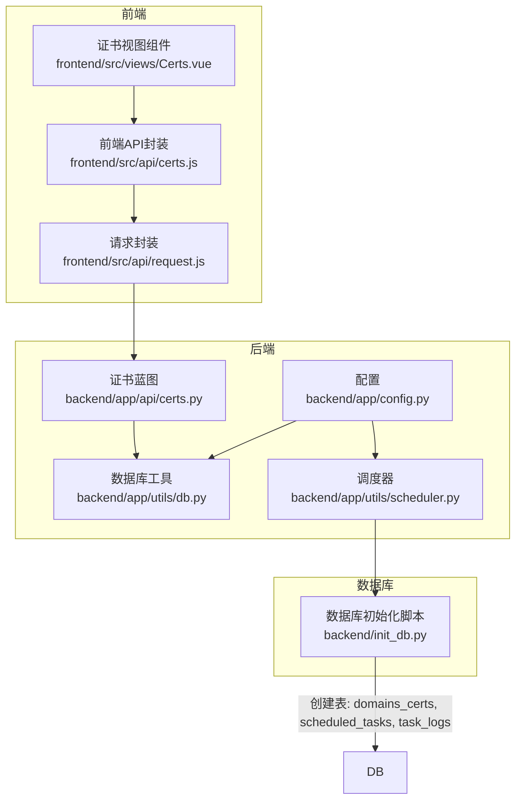
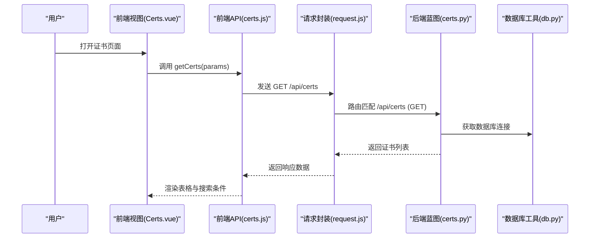
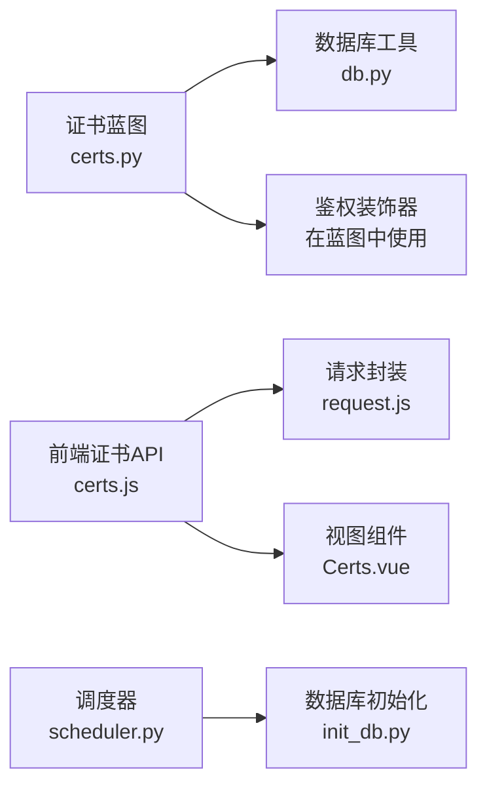

# 证书管理接口

<cite>
**本文引用的文件**
- [backend/app/api/certs.py](file://backend/app/api/certs.py)
- [backend/init_db.py](file://backend/init_db.py)
- [backend/app/utils/db.py](file://backend/app/utils/db.py)
- [backend/app/utils/scheduler.py](file://backend/app/utils/scheduler.py)
- [backend/app/config.py](file://backend/app/config.py)
- [frontend/src/api/certs.js](file://frontend/src/api/certs.js)
- [frontend/src/api/request.js](file://frontend/src/api/request.js)
- [frontend/src/views/Certs.vue](file://frontend/src/views/Certs.vue)
</cite>

## 目录
1. [简介](#简介)
2. [项目结构](#项目结构)
3. [核心组件](#核心组件)
4. [架构总览](#架构总览)
5. [详细组件分析](#详细组件分析)
6. [依赖分析](#依赖分析)
7. [性能考虑](#性能考虑)
8. [故障排查指南](#故障排查指南)
9. [结论](#结论)
10. [附录](#附录)

## 简介
本文件为证书管理接口的详细API文档，覆盖以下能力：
- 证书CRUD操作：获取证书列表、获取证书详情、上传证书、更新证书、删除证书
- 证书数据模型字段定义与业务含义
- 证书到期提醒、自动续期触发机制与证书状态监控
- 证书上传格式要求、PEM格式验证与私钥保护措施
- 证书监控告警配置与处理流程（过期前预警与失效通知）

说明：
- 当前后端实现提供证书的增删改查接口与基础数据模型；到期提醒、自动续期与监控告警在当前仓库中未发现直接实现代码，但提供了调度器框架与数据库表结构，可基于现有设施扩展实现。

## 项目结构
后端采用Flask蓝图组织API，前端使用Vue + Element Plus进行展示与交互，数据库初始化脚本定义了证书表结构与定时任务相关表。

图表来源
- [backend/app/api/certs.py:1-145](file://backend/app/api/certs.py#L1-L145)
- [backend/app/utils/db.py:1-17](file://backend/app/utils/db.py#L1-L17)
- [backend/app/utils/scheduler.py:1-249](file://backend/app/utils/scheduler.py#L1-L249)
- [backend/app/config.py:1-21](file://backend/app/config.py#L1-L21)
- [backend/init_db.py:146-166](file://backend/init_db.py#L146-L166)
- [frontend/src/api/certs.js:1-18](file://frontend/src/api/certs.js#L1-L18)
- [frontend/src/api/request.js:1-54](file://frontend/src/api/request.js#L1-L54)
- [frontend/src/views/Certs.vue:1-336](file://frontend/src/views/Certs.vue#L1-L336)

章节来源
- [backend/app/api/certs.py:1-145](file://backend/app/api/certs.py#L1-L145)
- [backend/init_db.py:146-166](file://backend/init_db.py#L146-L166)
- [frontend/src/views/Certs.vue:1-336](file://frontend/src/views/Certs.vue#L1-L336)

## 核心组件
- 证书API蓝图：提供证书列表查询、创建、更新、删除接口，并通过装饰器控制鉴权与角色权限
- 数据库工具：提供统一的数据库连接获取方法
- 前端API封装：对后端REST接口进行封装，便于组件调用
- 前端视图组件：负责证书列表展示、搜索、新增/编辑弹窗与删除确认
- 调度器：提供定时任务框架，可用于实现证书到期提醒与自动续期触发
- 数据库初始化：定义证书表与定时任务相关表结构

章节来源
- [backend/app/api/certs.py:11-145](file://backend/app/api/certs.py#L11-L145)
- [backend/app/utils/db.py:5-17](file://backend/app/utils/db.py#L5-L17)
- [frontend/src/api/certs.js:1-18](file://frontend/src/api/certs.js#L1-L18)
- [frontend/src/views/Certs.vue:170-336](file://frontend/src/views/Certs.vue#L170-L336)
- [backend/app/utils/scheduler.py:146-249](file://backend/app/utils/scheduler.py#L146-L249)
- [backend/init_db.py:146-226](file://backend/init_db.py#L146-L226)

## 架构总览
证书管理的前后端交互与数据流如下：

图表来源
- [frontend/src/views/Certs.vue:214-222](file://frontend/src/views/Certs.vue#L214-L222)
- [frontend/src/api/certs.js:3-5](file://frontend/src/api/certs.js#L3-L5)
- [frontend/src/api/request.js:5-11](file://frontend/src/api/request.js#L5-L11)
- [backend/app/api/certs.py:11-44](file://backend/app/api/certs.py#L11-L44)
- [backend/app/utils/db.py:5-17](file://backend/app/utils/db.py#L5-L17)

## 详细组件分析

### 证书数据模型与字段定义
证书数据模型存储于数据库表 domains_certs 中，字段定义如下：
- id：自增主键
- seq_no：序号
- category：类别（公众平台/域名/SSL证书）
- project：项目/子类
- entity：主体（如域名）
- purchase_date：购买时间（日期）
- expire_date：到期时间（字符串）
- cost：费用（元，数值型）
- remaining_days：剩余天数（字符串）
- brand：品牌
- status：状态（正常/即将过期/已过期/已注销）
- remark：备注
- created_at / updated_at：创建与更新时间戳

字段复杂度与索引：
- 主键索引：id
- 普通索引：category、status
- 字段类型与约束：遵循MySQL建表定义，部分字段为可空或文本类型

章节来源
- [backend/init_db.py:146-166](file://backend/init_db.py#L146-L166)

### 证书API接口定义
- 获取证书列表
  - 方法与路径：GET /api/certs
  - 查询参数：search（项目/主体/品牌模糊搜索）、category（类别过滤）
  - 返回：状态码、数据数组
  - 权限：需JWT认证
- 获取证书详情
  - 方法与路径：GET /api/certs/<id>
  - 参数：id（整数）
  - 返回：状态码、单条证书数据
  - 权限：需JWT认证
- 上传/创建证书
  - 方法与路径：POST /api/certs
  - 请求体：证书字段集合（见“字段定义”）
  - 返回：状态码、消息、新增记录ID
  - 权限：需JWT认证且角色为admin或operator
- 更新证书
  - 方法与路径：PUT /api/certs/<id>
  - 参数：id（整数）
  - 请求体：可选字段集合（仅传入会更新的字段）
  - 返回：状态码、消息
  - 权限：需JWT认证且角色为admin或operator
- 删除证书
  - 方法与路径：DELETE /api/certs/<id>
  - 参数：id（整数）
  - 返回：状态码、消息
  - 权限：需JWT认证且角色为admin或operator

章节来源
- [backend/app/api/certs.py:11-145](file://backend/app/api/certs.py#L11-L145)

### 前端交互与表单校验
- 列表页支持按分类与关键词搜索，并提供新增按钮
- 新增/编辑弹窗包含必填项校验（编号、分类、项目、主体）
- 删除采用二次确认对话框
- 表格列包含剩余天数与状态的标签样式展示

章节来源
- [frontend/src/views/Certs.vue:170-336](file://frontend/src/views/Certs.vue#L170-L336)

### 数据库连接与配置
- 数据库连接通过工具函数统一获取，使用Flask应用配置中的DB_*参数
- 配置项包括主机、端口、用户名、密码、数据库名、上传目录大小限制等

章节来源
- [backend/app/utils/db.py:5-17](file://backend/app/utils/db.py#L5-L17)
- [backend/app/config.py:4-21](file://backend/app/config.py#L4-L21)

### 调度器与定时任务
- 调度器支持从数据库加载定时任务，解析Cron表达式并启动后台任务
- 任务执行日志与状态更新写入数据库表 task_logs 与 scheduled_tasks
- 可用于扩展证书到期提醒与自动续期触发逻辑

章节来源
- [backend/app/utils/scheduler.py:146-249](file://backend/app/utils/scheduler.py#L146-L249)
- [backend/init_db.py:185-226](file://backend/init_db.py#L185-L226)

## 依赖分析
- 后端API依赖数据库工具与装饰器（鉴权与角色），蓝图注册在应用初始化阶段完成
- 前端API封装依赖Axios与Element Plus的消息提示，统一拦截401并跳转登录
- 数据库初始化脚本创建证书表与定时任务相关表，为后续扩展提供基础

图表来源
- [backend/app/api/certs.py:4-8](file://backend/app/api/certs.py#L4-L8)
- [backend/app/utils/db.py:1-17](file://backend/app/utils/db.py#L1-L17)
- [frontend/src/api/certs.js:1-18](file://frontend/src/api/certs.js#L1-L18)
- [frontend/src/api/request.js:1-54](file://frontend/src/api/request.js#L1-L54)
- [frontend/src/views/Certs.vue:170-175](file://frontend/src/views/Certs.vue#L170-L175)
- [backend/app/utils/scheduler.py:201-249](file://backend/app/utils/scheduler.py#L201-L249)
- [backend/init_db.py:146-226](file://backend/init_db.py#L146-L226)

章节来源
- [backend/app/api/certs.py:4-8](file://backend/app/api/certs.py#L4-L8)
- [frontend/src/api/certs.js:1-18](file://frontend/src/api/certs.js#L1-L18)
- [frontend/src/api/request.js:1-54](file://frontend/src/api/request.js#L1-L54)
- [frontend/src/views/Certs.vue:170-175](file://frontend/src/views/Certs.vue#L170-L175)
- [backend/app/utils/scheduler.py:201-249](file://backend/app/utils/scheduler.py#L201-L249)
- [backend/init_db.py:146-226](file://backend/init_db.py#L146-L226)

## 性能考虑
- 查询优化：列表接口支持按类别与关键词过滤，建议在高频查询字段上保持索引
- 写入事务：创建/更新/删除接口均使用事务提交，异常回滚，避免脏数据
- 前端渲染：列表页对长文本使用省略显示，减少DOM渲染压力
- 调度器并发：任务执行在独立线程中进行，避免阻塞主线程

[本节为通用性能建议，不直接分析具体文件]

## 故障排查指南
- 认证失败（401）
  - 检查本地存储的Token是否存在与过期
  - 响应拦截器会自动清除Token并跳转登录页
- 接口返回非200
  - 前端统一提示错误消息，检查后端返回的code与message
- 数据库连接问题
  - 确认DB_HOST/DB_PORT/DB_USER/DB_PASSWORD/DB_NAME配置正确
  - 检查数据库服务连通性与账号权限
- 定时任务未执行
  - 检查scheduled_tasks表中任务是否启用、Cron表达式是否正确
  - 查看task_logs表中最近一次执行状态与错误信息

章节来源
- [frontend/src/api/request.js:25-51](file://frontend/src/api/request.js#L25-L51)
- [backend/app/utils/db.py:5-17](file://backend/app/utils/db.py#L5-L17)
- [backend/app/utils/scheduler.py:201-249](file://backend/app/utils/scheduler.py#L201-L249)

## 结论
- 当前实现提供了完整的证书CRUD接口与基础数据模型
- 到期提醒、自动续期与监控告警在当前仓库中未发现直接实现，但调度器与数据库表结构已具备扩展基础
- 建议在现有基础上增加证书到期阈值配置、定时扫描与告警通知流程，并完善证书上传的PEM格式校验与私钥保护策略

[本节为总结性内容，不直接分析具体文件]

## 附录

### 证书上传格式要求与安全建议
- 上传格式
  - 建议支持PEM格式证书链文件，包含证书与中间证书
  - 私钥文件应单独上传并加密保存，避免明文存储
- PEM格式验证
  - 后端当前未实现PEM格式校验逻辑，可在创建/更新接口中增加校验步骤
  - 建议使用标准库或第三方库进行证书有效性与格式校验
- 私钥保护
  - 私钥应加密存储，仅在必要时解密使用
  - 限制访问权限，避免泄露

[本节为通用实践建议，不直接分析具体文件]

### 证书到期提醒与自动续期流程
- 到期提醒
  - 建议在数据库中增加到期阈值字段，结合调度器定期扫描
  - 对即将过期与已过期证书生成告警记录并通知相关人员
- 自动续期触发
  - 可通过调度器触发外部脚本或服务，完成证书续期
  - 续期完成后更新证书表的expire_date与remaining_days字段

[本节为概念性流程说明，不直接分析具体文件]