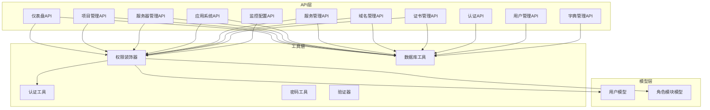
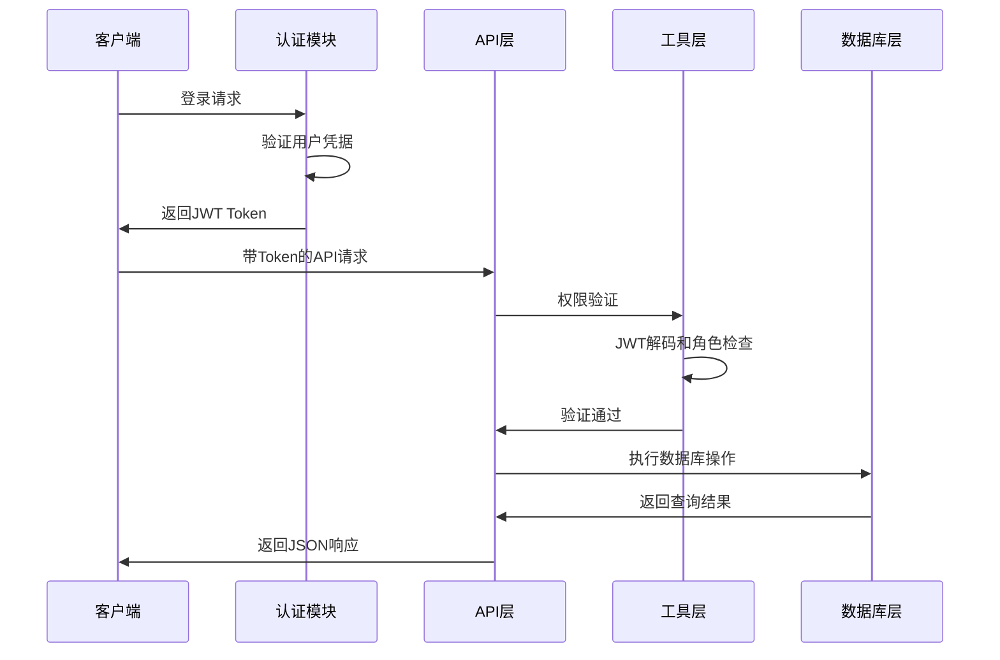
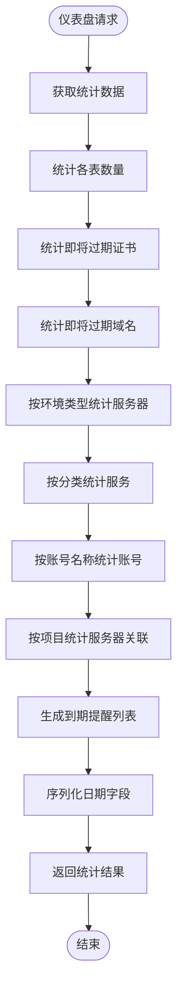
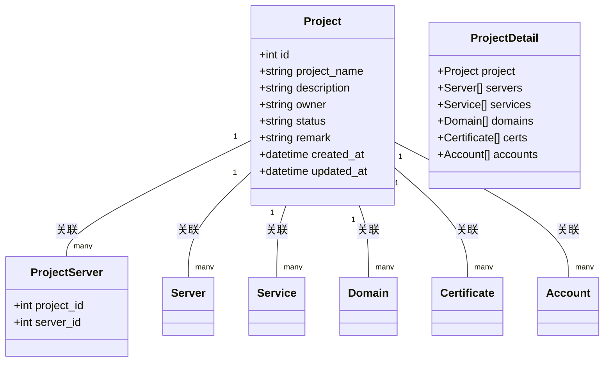
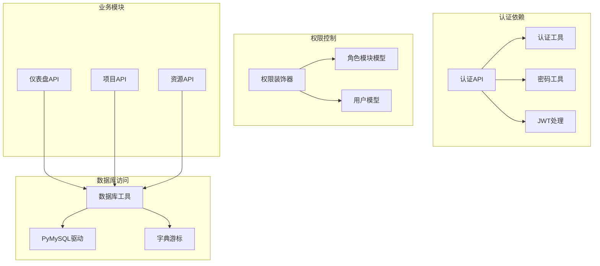

# 项目仪表盘API

<cite>
**本文档引用的文件**
- [dashboard.py](file://backend/app/api/dashboard.py)
- [projects.py](file://backend/app/api/projects.py)
- [servers.py](file://backend/app/api/servers.py)
- [apps.py](file://backend/app/api/apps.py)
- [services.py](file://backend/app/api/services.py)
- [domains.py](file://backend/app/api/domains.py)
- [certs.py](file://backend/app/api/certs.py)
- [monitoring.py](file://backend/app/api/monitoring.py)
- [decorators.py](file://backend/app/utils/decorators.py)
- [db.py](file://backend/app/utils/db.py)
- [auth.py](file://backend/app/api/auth.py)
- [users.py](file://backend/app/api/users.py)
- [dicts.py](file://backend/app/api/dicts.py)
</cite>

## 目录
1. [简介](#简介)
2. [项目结构](#项目结构)
3. [核心组件](#核心组件)
4. [架构概览](#架构概览)
5. [详细组件分析](#详细组件分析)
6. [依赖关系分析](#依赖关系分析)
7. [性能考虑](#性能考虑)
8. [故障排除指南](#故障排除指南)
9. [结论](#结论)

## 简介

本项目是一个基于Flask的运维管理平台，专注于项目管理和仪表盘功能。系统提供了完整的项目资源关联管理接口，包括服务器、应用、服务、域名、证书等资源的统一管理。仪表盘模块提供了实时的系统概览和统计分析功能，帮助管理员全面掌握系统的运行状态。

系统采用模块化的API设计，每个功能模块都有独立的蓝图定义，支持JWT认证和权限控制。通过RESTful API接口，用户可以实现项目创建、成员管理、资源配置、统计分析等功能。

## 项目结构

项目采用典型的Flask应用结构，主要分为以下几个层次：

**图表来源**
- [dashboard.py:1-166](file://backend/app/api/dashboard.py#L1-L166)
- [projects.py:1-547](file://backend/app/api/projects.py#L1-L547)
- [decorators.py:1-214](file://backend/app/utils/decorators.py#L1-L214)
- [db.py:1-80](file://backend/app/utils/db.py#L1-L80)

**章节来源**
- [dashboard.py:1-166](file://backend/app/api/dashboard.py#L1-L166)
- [projects.py:1-547](file://backend/app/api/projects.py#L1-L547)
- [decorators.py:1-214](file://backend/app/utils/decorators.py#L1-L214)
- [db.py:1-80](file://backend/app/utils/db.py#L1-L80)

## 核心组件

### 仪表盘统计模块

仪表盘模块提供系统整体的统计信息和关键指标展示，包括资源数量统计、到期提醒、分布分析等功能。

**主要功能特性：**
- 实时资源统计：服务器、服务、应用、域名、证书数量统计
- 到期提醒：证书和域名的即将过期提醒
- 分布分析：按环境类型、服务分类、账号名称的分布统计
- 项目关联统计：各项目关联的服务器数量分布

### 项目管理模块

项目管理模块是整个系统的核心，负责项目的全生命周期管理，包括创建、更新、删除以及资源关联管理。

**核心功能：**
- 项目CRUD操作：创建、查询、更新、删除项目
- 项目详情聚合：返回项目及其关联的所有资源
- 资源关联管理：服务器、服务、域名、证书、应用的关联和取消关联
- 权限控制：基于角色和模块的访问控制

### 资源管理模块

系统提供多个资源管理模块，每个模块都支持标准的CRUD操作和高级功能：

**服务器管理：**
- 服务器生命周期管理
- 密码字段加密存储和解密显示
- 项目关联管理
- 环境类型和平台字典管理

**应用系统管理：**
- 应用账号信息管理
- 密码字段安全处理
- 项目归属管理
- URL格式验证

**服务管理：**
- 服务实例管理
- 与服务器的关联关系
- 分类和版本管理

**域名管理：**
- 域名信息管理
- 阿里云域名同步
- 到期预警通知
- 项目归属管理

**证书管理：**
- SSL证书管理
- 证书文件上传和解析
- 在线SSL检测
- 证书状态跟踪

**章节来源**
- [dashboard.py:22-166](file://backend/app/api/dashboard.py#L22-L166)
- [projects.py:13-547](file://backend/app/api/projects.py#L13-L547)
- [servers.py:14-604](file://backend/app/api/servers.py#L14-L604)
- [apps.py:14-348](file://backend/app/api/apps.py#L14-L348)
- [services.py:12-210](file://backend/app/api/services.py#L12-L210)
- [domains.py:34-670](file://backend/app/api/domains.py#L34-L670)
- [certs.py:154-800](file://backend/app/api/certs.py#L154-L800)

## 架构概览

系统采用分层架构设计，确保了良好的可维护性和扩展性：

**图表来源**
- [auth.py:16-103](file://backend/app/api/auth.py#L16-L103)
- [decorators.py:26-123](file://backend/app/utils/decorators.py#L26-L123)
- [db.py:43-80](file://backend/app/utils/db.py#L43-L80)

系统架构的关键特点：

1. **认证授权分离**：认证逻辑集中在auth模块，权限控制通过装饰器实现
2. **数据库连接池**：使用Flask应用上下文缓存数据库连接
3. **模块化设计**：每个功能模块独立，通过蓝图组织
4. **统一响应格式**：所有API返回标准化的JSON格式

**章节来源**
- [auth.py:16-210](file://backend/app/api/auth.py#L16-L210)
- [decorators.py:26-214](file://backend/app/utils/decorators.py#L26-L214)
- [db.py:43-80](file://backend/app/utils/db.py#L43-L80)

## 详细组件分析

### 仪表盘API详细分析

仪表盘API提供了系统级别的统计和概览功能，是管理员决策的重要依据。

#### 核心统计接口

**图表来源**
- [dashboard.py:22-166](file://backend/app/api/dashboard.py#L22-L166)

#### 统计数据结构

仪表盘返回的数据结构包含以下关键部分：

**基础统计信息：**
- `servers`: 服务器总数
- `services`: 服务总数  
- `accounts`: 应用账号总数
- `domains`: 域名总数
- `certs`: 证书总数
- `expiring_certs`: 即将过期证书数量
- `expiring_domains`: 即将过期域名数量
- `projects`: 项目总数

**分布统计信息：**
- `env_distribution`: 环境类型分布
- `service_distribution`: 服务分类分布
- `account_distribution`: 账号名称分布
- `project_distribution`: 项目关联分布

**到期提醒信息：**
- `recent_certs`: 最近到期的证书和域名列表
- 包含剩余天数、到期日期、关联项目等信息

**章节来源**
- [dashboard.py:22-166](file://backend/app/api/dashboard.py#L22-L166)

### 项目管理API详细分析

项目管理模块是系统的核心功能，提供了完整的项目生命周期管理能力。

#### 项目CRUD操作

**图表来源**
- [projects.py:174-280](file://backend/app/api/projects.py#L174-L280)

#### 项目资源关联管理

项目管理API支持灵活的资源关联和取消关联操作：

**服务器关联：**
- 批量关联多个服务器到项目
- 验证服务器存在性
- 支持重复关联的忽略处理

**服务器取消关联：**
- 单个服务器取消关联
- 不存在时返回相应错误

**权限控制机制：**
- `@jwt_required`: JWT认证
- `@module_required('projects')`: 项目模块权限
- `@role_required(['admin', 'operator'])`: 角色权限

**章节来源**
- [projects.py:13-547](file://backend/app/api/projects.py#L13-L547)
- [decorators.py:26-214](file://backend/app/utils/decorators.py#L26-L214)

### 资源管理API详细分析

#### 服务器管理API

服务器管理提供了完整的服务器生命周期管理功能：

**核心功能：**
- 服务器列表查询：支持多条件过滤（环境类型、平台、项目）
- 服务器详情：包含关联服务和项目信息
- 服务器CRUD：创建、更新、删除服务器
- 密码字段安全处理：加密存储、解密显示

**查询参数支持：**
- `env_type`: 环境类型过滤
- `platform`: 平台过滤  
- `project_id`: 项目关联过滤
- `search`: 综合搜索关键词
- `page/page_size`: 分页参数

**章节来源**
- [servers.py:14-604](file://backend/app/api/servers.py#L14-L604)

#### 应用系统管理API

应用系统管理专注于第三方应用账号的统一管理：

**安全特性：**
- 密码字段加密存储
- 解密后按需显示
- URL格式严格验证

**管理功能：**
- 应用账号CRUD操作
- 项目归属管理
- 批量查询和分页

**章节来源**
- [apps.py:14-348](file://backend/app/api/apps.py#L14-L348)

#### 服务管理API

服务管理提供了服务实例的完整生命周期管理：

**核心字段：**
- `server_id`: 关联的服务器
- `category`: 服务分类
- `service_name`: 服务名称
- `version`: 版本信息
- `inner_port/mapped_port`: 端口映射
- `project_id`: 所属项目

**查询功能：**
- 支持按分类、环境类型、项目过滤
- 与服务器信息的关联查询

**章节来源**
- [services.py:12-210](file://backend/app/api/services.py#L12-L210)

#### 域名管理API

域名管理提供了域名的全生命周期管理，包括阿里云域名同步功能：

**核心功能：**
- 域名CRUD操作
- 阿里云域名同步
- 到期预警通知
- 项目归属管理

**阿里云集成：**
- SDK依赖检测
- AccessKey解密处理
- 域名列表同步
- 状态和过期状态解析

**章节来源**
- [domains.py:34-670](file://backend/app/api/domains.py#L34-L670)

#### 证书管理API

证书管理提供了SSL/TLS证书的完整生命周期管理：

**核心功能：**
- 证书CRUD操作
- 证书文件上传和解析
- 在线SSL检测
- 证书状态跟踪

**证书解析：**
- PEM格式证书解析
- SAN列表提取
- 有效期计算
- 剩余天数跟踪

**章节来源**
- [certs.py:154-800](file://backend/app/api/certs.py#L154-L800)

### 监控配置API

监控配置API提供了Grafana监控系统的集成配置：

**配置内容：**
- Grafana访问URL
- 预定义仪表盘列表
- JSON格式的仪表盘配置

**使用场景：**
- 为前端提供监控系统集成信息
- 支持多环境的监控配置管理

**章节来源**
- [monitoring.py:11-43](file://backend/app/api/monitoring.py#L11-L43)

## 依赖关系分析

系统采用模块化设计，各模块之间的依赖关系清晰明确：

**图表来源**
- [auth.py:16-210](file://backend/app/api/auth.py#L16-L210)
- [decorators.py:26-214](file://backend/app/utils/decorators.py#L26-L214)
- [db.py:43-80](file://backend/app/utils/db.py#L43-L80)

### 关键依赖特性

**认证链路：**
- JWT令牌验证
- 用户状态检查
- 密码变更时间验证
- 角色权限验证

**数据库连接管理：**
- Flask应用上下文缓存
- 连接超时设置
- 字符集配置
- 异常处理和日志记录

**模块化权限控制：**
- 装饰器链式调用
- 模块访问权限检查
- 角色权限矩阵
- 操作日志记录

**章节来源**
- [auth.py:16-210](file://backend/app/api/auth.py#L16-L210)
- [decorators.py:26-214](file://backend/app/utils/decorators.py#L26-L214)
- [db.py:43-80](file://backend/app/utils/db.py#L43-L80)

## 性能考虑

系统在设计时充分考虑了性能优化和可扩展性：

### 数据库优化策略

**连接池管理：**
- 使用Flask应用上下文缓存数据库连接
- 连接超时设置为10秒
- 字符集使用utf8mb4支持完整Unicode

**查询优化：**
- 分页查询限制每页最大100条记录
- 多表关联查询使用适当的索引
- 统计查询使用COUNT(*)优化

**数据序列化：**
- 自动处理datetime对象序列化
- 统一日期格式输出
- 敏感信息脱敏处理

### 缓存和性能监控

**JWT缓存：**
- 用户信息缓存在g对象中
- 避免重复的数据库查询
- 令牌验证快速通过

**操作日志：**
- 统一的操作日志格式
- 异步日志处理
- 审计追踪支持

### 扩展性考虑

**模块化设计：**
- 每个功能模块独立部署
- API接口标准化
- 配置驱动的扩展点

**监控集成：**
- Grafana配置支持
- 指标收集接口
- 性能监控集成

## 故障排除指南

### 常见问题诊断

**认证相关问题：**
- Token无效或过期：检查JWT配置和过期时间
- 权限不足：确认用户角色和模块权限
- 密码变更导致的Token失效：重新登录获取新Token

**数据库连接问题：**
- 连接超时：检查数据库服务器状态和网络连接
- 字符集问题：确认utf8mb4支持
- 连接池耗尽：检查并发连接数和查询优化

**API调用问题：**
- 参数验证失败：检查请求格式和必填字段
- 权限拒绝：确认角色权限和模块访问权限
- 数据库操作失败：查看具体错误信息和事务回滚

### 调试技巧

**日志分析：**
- 启用详细的日志记录
- 关注数据库操作日志
- 监控异常堆栈信息

**性能监控：**
- 监控API响应时间
- 数据库查询性能分析
- 内存使用情况监控

**配置检查：**
- 数据库连接配置
- JWT密钥配置
- 外部服务配置（阿里云、Grafana等）

**章节来源**
- [db.py:43-80](file://backend/app/utils/db.py#L43-L80)
- [decorators.py:26-214](file://backend/app/utils/decorators.py#L26-L214)

## 结论

本项目仪表盘API提供了一个完整的企业级运维管理解决方案，具有以下显著特点：

**功能完整性：**
- 覆盖了项目管理的全生命周期
- 提供了丰富的统计分析功能
- 支持多种资源类型的统一管理

**架构先进性：**
- 模块化设计，易于维护和扩展
- 标准化的API接口设计
- 完善的权限控制和安全机制

**实用性价值：**
- 实时的系统状态监控
- 智能的到期提醒功能
- 灵活的查询和过滤能力

系统通过合理的架构设计和完善的API接口，为企业提供了高效、可靠的运维管理工具，能够满足不同规模企业的项目管理和资源监控需求。