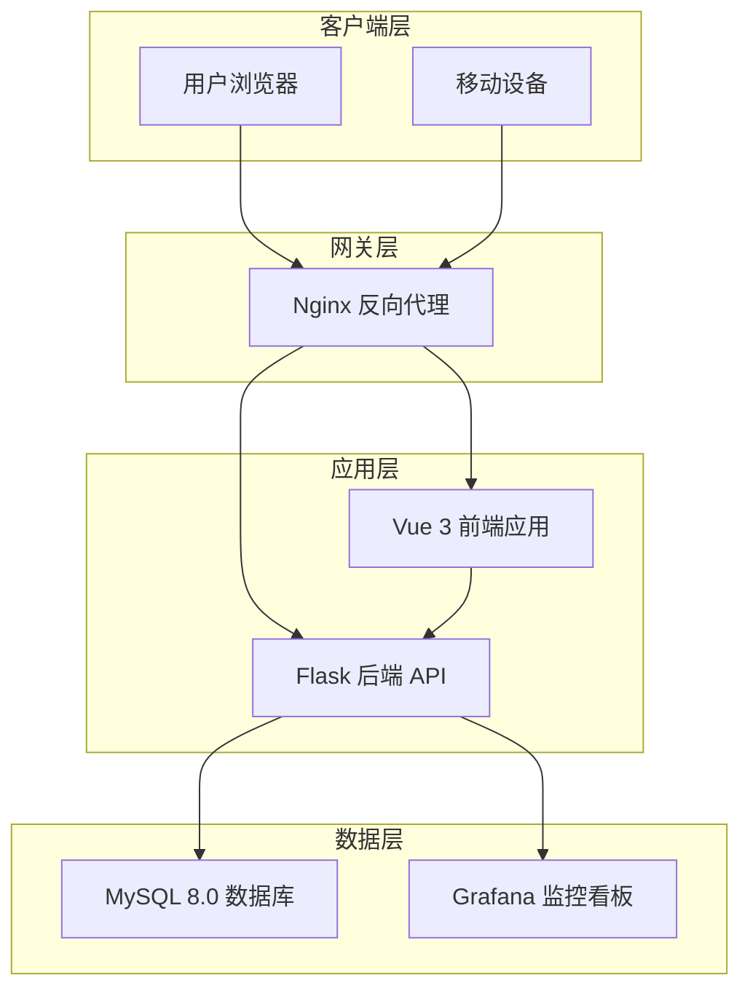
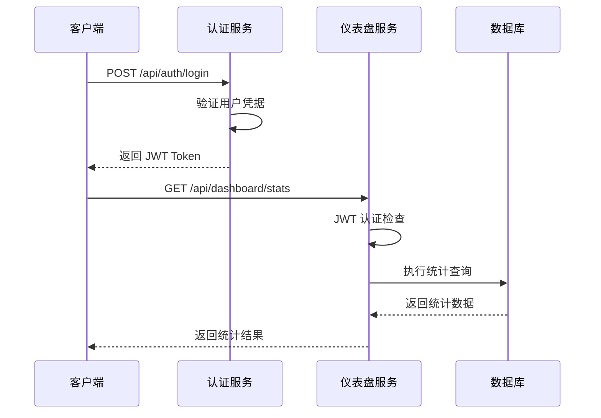
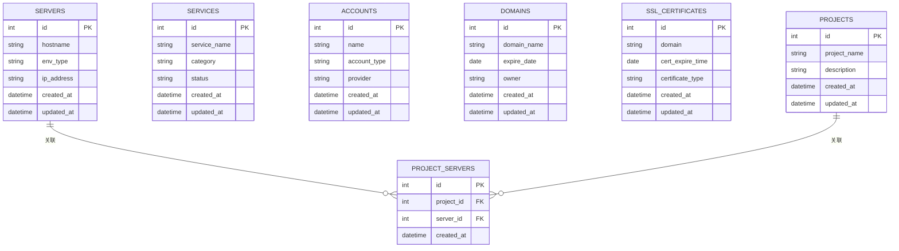
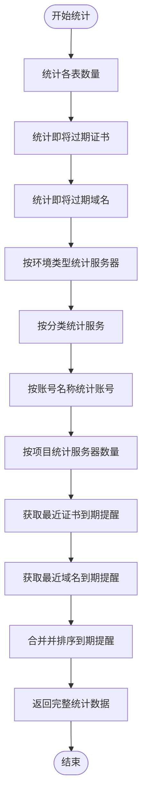
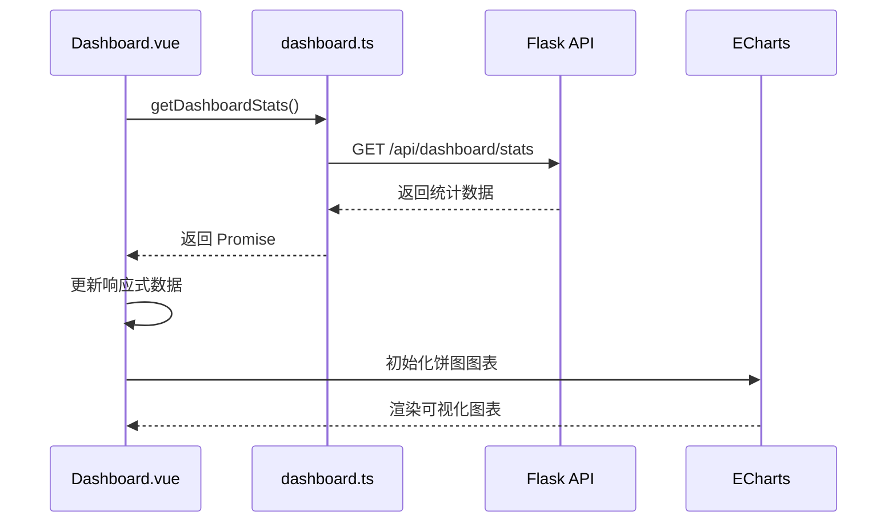
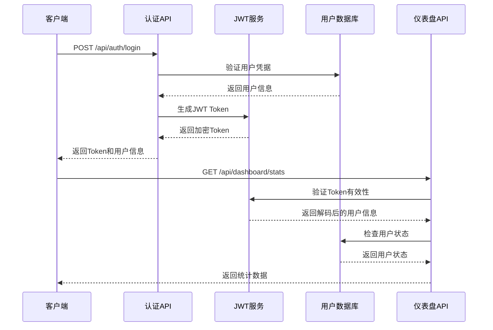

# 项目仪表盘 API 文档

<cite>
**本文档引用的文件**
- [backend/app/api/dashboard.py](file://backend/app/api/dashboard.py)
- [frontend/src/api/dashboard.ts](file://frontend/src/api/dashboard.ts)
- [backend/app/utils/db.py](file://backend/app/utils/db.py)
- [backend/app/utils/decorators.py](file://backend/app/utils/decorators.py)
- [backend/app/config.py](file://backend/app/config.py)
- [frontend/src/views/Dashboard.vue](file://frontend/src/views/Dashboard.vue)
- [backend/app/utils/auth.py](file://backend/app/utils/auth.py)
- [backend/app/models/user.py](file://backend/app/models/user.py)
- [backend/app/models/role_module.py](file://backend/app/models/role_module.py)
- [backend/app/api/auth.py](file://backend/app/api/auth.py)
- [README.md](file://README.md)
</cite>

## 目录
1. [项目概述](#项目概述)
2. [系统架构](#系统架构)
3. [仪表盘 API 核心功能](#仪表盘-api-核心功能)
4. [数据模型与统计维度](#数据模型与统计维度)
5. [前端集成与可视化](#前端集成与可视化)
6. [安全认证机制](#安全认证机制)
7. [性能优化策略](#性能优化策略)
8. [故障排除指南](#故障排除指南)
9. [总结](#总结)

## 项目概述

OPS（运维平台）是一个现代化的基础设施运维管理平台，专注于服务器、域名、SSL证书、阿里云账号等资源的集中化管理与自动化监控。该项目采用前后端分离架构，后端基于 Flask 3.0+，前端基于 Vue 3.5+，提供直观的可视化仪表盘和完整的运维管理功能。

**章节来源**
- [README.md:25-44](file://README.md#L25-L44)

## 系统架构

项目采用经典的三层架构设计，通过 Nginx 作为反向代理服务器，将前端静态资源和 API 请求分别处理。

**图表来源**
- [README.md:147-173](file://README.md#L147-L173)

**章节来源**
- [README.md:147-182](file://README.md#L147-L182)

## 仪表盘 API 核心功能

### API 接口定义

仪表盘 API 提供统一的统计数据接口，支持 JWT 认证和权限控制。

**图表来源**
- [backend/app/api/dashboard.py:22-166](file://backend/app/api/dashboard.py#L22-L166)
- [backend/app/api/auth.py:16-103](file://backend/app/api/auth.py#L16-L103)

### 统计数据结构

仪表盘 API 返回的数据结构包含多个维度的统计信息：

| 统计类别 | 字段名称 | 描述 | 示例值 |
|---------|----------|------|--------|
| 基础计数 | servers | 服务器总数 | 10 |
| 基础计数 | projects | 项目总数 | 5 |
| 基础计数 | services | 服务总数 | 20 |
| 基础计数 | accounts | 账号总数 | 8 |
| 基础计数 | domains | 域名总数 | 15 |
| 基础计数 | certs | 证书总数 | 12 |
| 到期统计 | expiring_domains | 即将过期域名数量 | 2 |
| 到期统计 | expiring_certs | 即将过期证书数量 | 3 |
| 分布统计 | env_distribution | 服务器环境分布 | [{"env_type": "生产", "count": 8}] |
| 分布统计 | service_distribution | 服务类型分布 | [{"category": "Web", "count": 12}] |
| 分布统计 | account_distribution | 账号类型分布 | [{"name": "阿里云", "count": 5}] |
| 分布统计 | project_distribution | 项目服务器分布 | [{"project_name": "项目A", "count": 3}] |
| 通知提醒 | recent_certs | 最近到期提醒 | [{"domain": "example.com", "remaining_days": 5}] |

**章节来源**
- [backend/app/api/dashboard.py:144-162](file://backend/app/api/dashboard.py#L144-L162)

## 数据模型与统计维度

### 数据库表结构

仪表盘统计涉及多个核心数据表，每个表都承载着特定的业务含义：

**图表来源**
- [backend/app/api/dashboard.py:32-98](file://backend/app/api/dashboard.py#L32-L98)

### 统计查询逻辑

仪表盘 API 实现了多种复杂的统计查询，包括基础计数、分布统计和到期提醒：

**图表来源**
- [backend/app/api/dashboard.py:30-142](file://backend/app/api/dashboard.py#L30-L142)

**章节来源**
- [backend/app/api/dashboard.py:30-142](file://backend/app/api/dashboard.py#L30-L142)

## 前端集成与可视化

### 前端 API 调用

前端通过专门的 API 模块调用仪表盘接口，实现数据的获取和展示。

**图表来源**
- [frontend/src/views/Dashboard.vue:309-320](file://frontend/src/views/Dashboard.vue#L309-L320)
- [frontend/src/api/dashboard.ts:3-5](file://frontend/src/api/dashboard.ts#L3-L5)

### 可视化组件设计

仪表盘采用响应式布局设计，包含多种类型的可视化组件：

| 组件类型 | 数量 | 特点 | 用途 |
|---------|------|------|------|
| 核心统计卡片 | 5个 | 点击跳转到对应管理页面 | 快速概览关键指标 |
| 饼图卡片 | 4个 | 可滚动图例，百分比显示 | 展示分布情况 |
| 到期提醒表格 | 1个 | 剩余天数标签，类型区分 | 监控即将过期资源 |
| 证书统计网格 | 1个 | 四象限布局，颜色区分 | 统计域名和证书数量 |

**章节来源**
- [frontend/src/views/Dashboard.vue:4-176](file://frontend/src/views/Dashboard.vue#L4-L176)

## 安全认证机制

### JWT 认证流程

项目采用 JWT（JSON Web Token）进行身份认证，确保 API 调用的安全性。

**图表来源**
- [backend/app/utils/auth.py:9-28](file://backend/app/utils/auth.py#L9-L28)
- [backend/app/utils/decorators.py:26-123](file://backend/app/utils/decorators.py#L26-L123)

### 权限控制机制

系统实现了多层次的权限控制，包括 JWT 认证、用户状态检查和密码变更验证。

| 安全检查点 | 检查内容 | 验证方法 | 异常处理 |
|-----------|----------|----------|----------|
| 认证头检查 | Authorization 头是否存在 | 验证 Bearer 格式 | 返回 401 错误 |
| Token 验证 | JWT 令牌有效性 | 使用 HS256 算法解码 | 返回 401 错误 |
| 用户存在性 | 用户是否存在于数据库 | 查询用户记录 | 返回 401 错误 |
| 用户状态 | 用户是否被启用 | 检查 is_active 字段 | 返回 401 错误 |
| 密码变更检查 | Token 是否在密码变更后失效 | 比较 password_changed_at 和 iat | 返回 401 错误 |

**章节来源**
- [backend/app/utils/decorators.py:26-123](file://backend/app/utils/decorators.py#L26-L123)

## 性能优化策略

### 数据库查询优化

仪表盘 API 采用了多种数据库查询优化策略：

1. **索引优化**: 对常用查询字段建立适当的索引
2. **查询缓存**: 使用 Flask 应用上下文缓存数据库连接
3. **批量查询**: 将多个统计查询合并为单个数据库往返
4. **结果集限制**: 对到期提醒等查询使用 LIMIT 限制结果数量

### 前端性能优化

前端实现了多项性能优化措施：

1. **懒加载**: ECharts 图表按需初始化
2. **响应式设计**: 自适应不同屏幕尺寸
3. **数据缓存**: 使用 Vue 响应式系统优化渲染
4. **事件监听**: 合理管理窗口大小变化事件

**章节来源**
- [backend/app/utils/db.py:43-80](file://backend/app/utils/db.py#L43-L80)
- [frontend/src/views/Dashboard.vue:289-307](file://frontend/src/views/Dashboard.vue#L289-L307)

## 故障排除指南

### 常见问题诊断

| 问题类型 | 症状 | 可能原因 | 解决方案 |
|---------|------|----------|----------|
| 认证失败 | 返回 401 错误 | Token 过期或格式错误 | 检查 Authorization 头格式，重新登录获取新 Token |
| 数据库连接失败 | SQL 查询异常 | 数据库配置错误 | 检查 DB_HOST、DB_PORT、DB_USER、DB_PASSWORD 配置 |
| 权限不足 | 返回 403 错误 | 用户角色权限不足 | 检查用户角色和模块权限配置 |
| API 超时 | 请求响应缓慢 | 数据库查询性能问题 | 优化查询语句，添加必要的索引 |
| 前端空白页 | 仪表盘无法显示 | 前端构建问题 | 重新构建前端应用，检查 dist 目录 |

### 调试技巧

1. **后端日志**: 启用详细日志输出，查看数据库连接和查询执行情况
2. **前端调试**: 使用浏览器开发者工具检查 API 请求和响应
3. **网络诊断**: 使用 curl 命令直接测试 API 接口
4. **数据库监控**: 监控慢查询日志，识别性能瓶颈

**章节来源**
- [README.md:661-748](file://README.md#L661-L748)

## 总结

OPS 项目的仪表盘 API 是整个运维平台的核心组件，提供了全面的资源统计和可视化功能。通过精心设计的 API 接口、安全的认证机制和高效的前端可视化，为运维团队提供了直观、实时的系统状态概览。

### 主要优势

1. **功能完整性**: 覆盖服务器、项目、服务、账号、域名、证书等多个维度的统计
2. **用户体验**: 直观的可视化界面，支持多种图表类型和交互操作
3. **安全性**: 基于 JWT 的完整认证体系，确保 API 调用安全
4. **可扩展性**: 模块化设计，易于添加新的统计维度和可视化组件
5. **性能优化**: 多层次的性能优化策略，确保系统的高效运行

### 技术亮点

- **前后端分离**: 采用现代 Web 技术栈，提供良好的开发体验
- **Docker 部署**: 支持一键部署，简化运维流程
- **自动化监控**: 集成 SSL 证书和域名到期监控功能
- **企业级特性**: 支持企业微信通知、Grafana 集成等高级功能

这个仪表盘 API 不仅满足了当前的运维管理需求，还为未来的功能扩展奠定了坚实的技术基础。