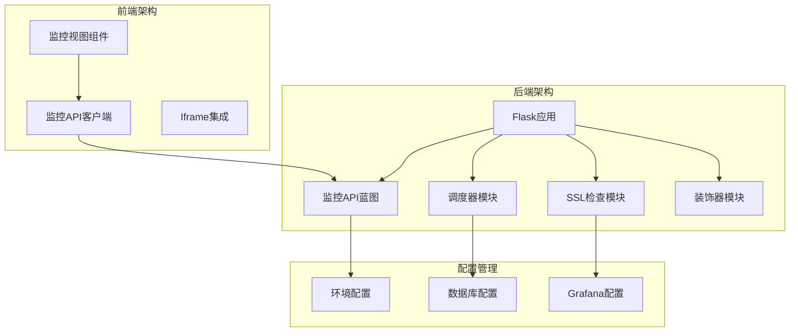
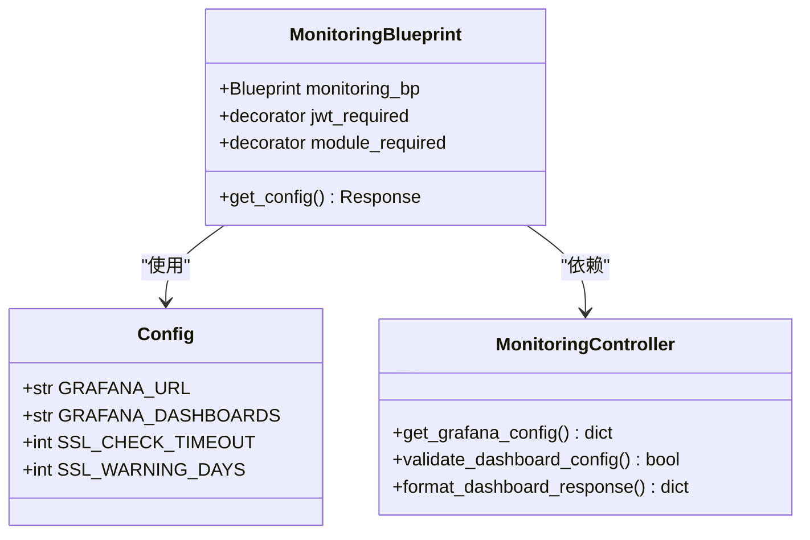
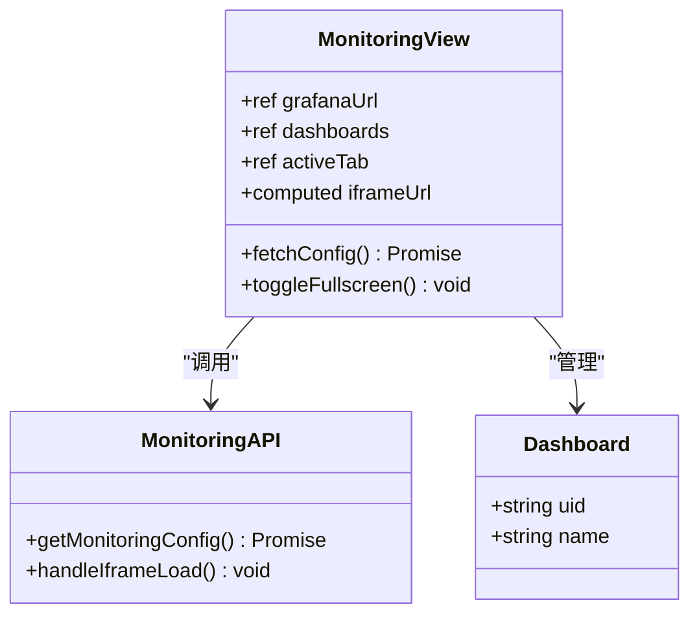
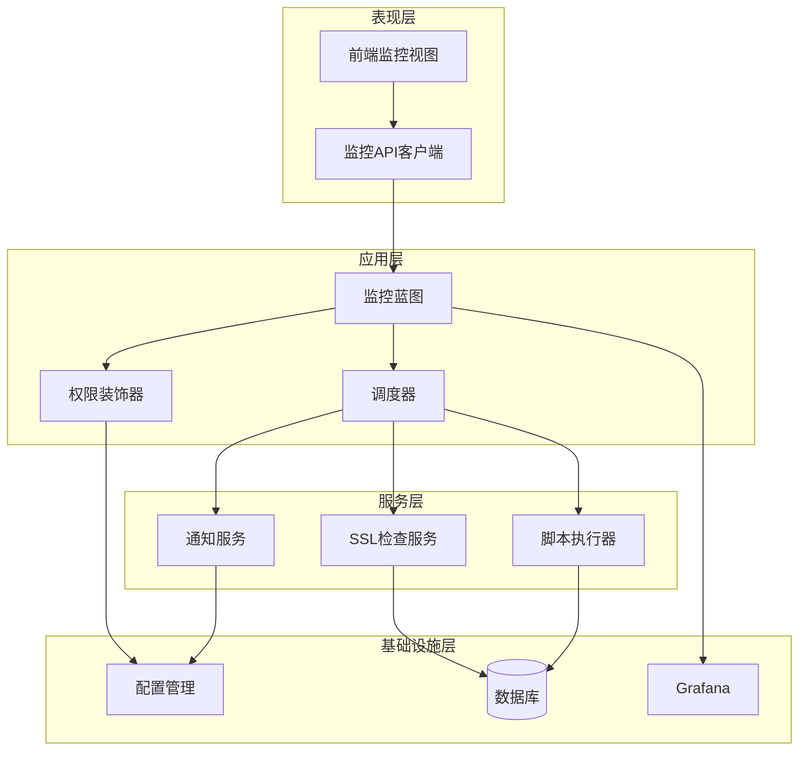
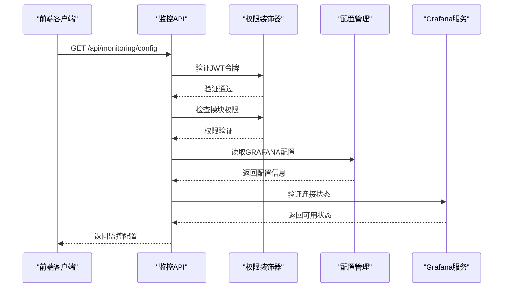
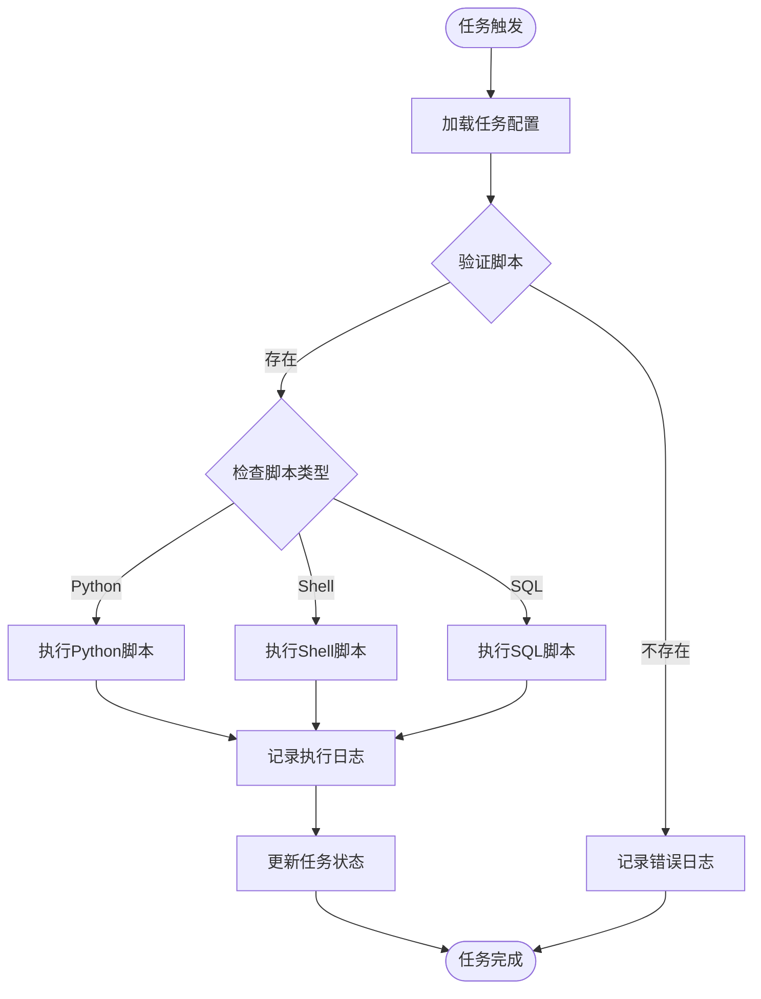
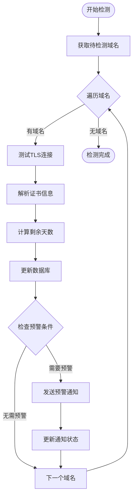
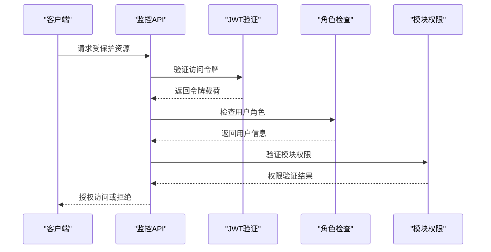
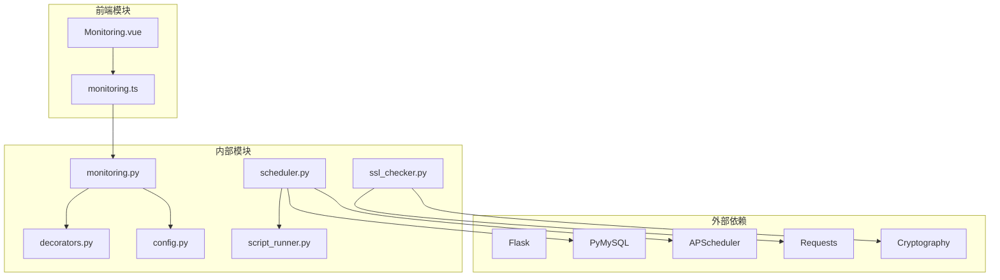

# 系统监控API文档

<cite>
**本文档引用的文件**
- [backend/app/api/monitoring.py](file://backend/app/api/monitoring.py)
- [frontend/src/api/monitoring.ts](file://frontend/src/api/monitoring.ts)
- [backend/app/utils/scheduler.py](file://backend/app/utils/scheduler.py)
- [backend/app/utils/script_runner.py](file://backend/app/utils/script_runner.py)
- [backend/app/utils/ssl_checker.py](file://backend/app/utils/ssl_checker.py)
- [backend/app/utils/decorators.py](file://backend/app/utils/decorators.py)
- [backend/app/config.py](file://backend/app/config.py)
- [backend/app/__init__.py](file://backend/app/__init__.py)
- [frontend/src/views/Monitoring.vue](file://frontend/src/views/Monitoring.vue)
- [backend/run.py](file://backend/run.py)
</cite>

## 目录
1. [简介](#简介)
2. [项目结构](#项目结构)
3. [核心组件](#核心组件)
4. [架构概览](#架构概览)
5. [详细组件分析](#详细组件分析)
6. [依赖关系分析](#依赖关系分析)
7. [性能考虑](#性能考虑)
8. [故障排除指南](#故障排除指南)
9. [结论](#结论)

## 简介

系统监控API是运维管理平台的核心功能模块，主要负责Grafana监控系统的集成和管理。该模块提供了统一的监控配置接口，支持多看板管理、实时监控数据展示以及自动化监控任务执行。

监控API的主要特性包括：
- Grafana监控配置管理
- 多看板监控仪表盘支持
- 实时SSL证书监控
- 自动化域名到期提醒
- 定时任务调度执行
- 企业微信通知集成

## 项目结构

该项目采用前后端分离的架构设计，监控功能主要分布在后端API层和前端视图层：

**图表来源**
- [backend/app/__init__.py:28-151](file://backend/app/__init__.py#L28-L151)
- [backend/app/api/monitoring.py:8-43](file://backend/app/api/monitoring.py#L8-L43)

**章节来源**
- [backend/app/__init__.py:28-151](file://backend/app/__init__.py#L28-L151)
- [backend/app/config.py:10-58](file://backend/app/config.py#L10-L58)

## 核心组件

### 监控API蓝图

监控API基于Flask Blueprint实现，提供统一的监控配置管理接口：

**图表来源**
- [backend/app/api/monitoring.py:8-43](file://backend/app/api/monitoring.py#L8-L43)
- [backend/app/config.py:52-53](file://backend/app/config.py#L52-L53)

### 前端监控视图

前端监控视图组件提供直观的监控界面：

**图表来源**
- [frontend/src/views/Monitoring.vue:47-164](file://frontend/src/views/Monitoring.vue#L47-L164)
- [frontend/src/api/monitoring.ts:1-6](file://frontend/src/api/monitoring.ts#L1-L6)

**章节来源**
- [backend/app/api/monitoring.py:11-43](file://backend/app/api/monitoring.py#L11-L43)
- [frontend/src/views/Monitoring.vue:47-164](file://frontend/src/views/Monitoring.vue#L47-L164)

## 架构概览

系统监控API采用分层架构设计，确保各组件职责清晰、耦合度低：

**图表来源**
- [backend/app/__init__.py:116-151](file://backend/app/__init__.py#L116-L151)
- [backend/app/utils/scheduler.py:244-384](file://backend/app/utils/scheduler.py#L244-L384)

## 详细组件分析

### 监控配置管理

监控配置管理是系统的核心功能，负责Grafana集成和看板管理：

#### 配置获取流程

**图表来源**
- [backend/app/api/monitoring.py:14-42](file://backend/app/api/monitoring.py#L14-L42)
- [backend/app/utils/decorators.py:26-123](file://backend/app/utils/decorators.py#L26-L123)

#### 配置数据结构

监控配置采用JSON格式存储，支持多看板管理：

| 配置项 | 类型 | 描述 | 默认值 |
|--------|------|------|--------|
| grafana_url | string | Grafana服务URL | 空字符串 |
| dashboards | array | 监控看板配置 | 空数组 |

每个看板配置包含：
- uid: 看板唯一标识符
- name: 看板显示名称

**章节来源**
- [backend/app/api/monitoring.py:18-42](file://backend/app/api/monitoring.py#L18-L42)
- [backend/app/config.py:52-53](file://backend/app/config.py#L52-L53)

### 定时任务调度系统

系统集成了强大的定时任务调度功能，支持多种脚本类型的执行：

#### 任务执行流程

**图表来源**
- [backend/app/utils/scheduler.py:39-178](file://backend/app/utils/scheduler.py#L39-L178)
- [backend/app/utils/script_runner.py:49-115](file://backend/app/utils/script_runner.py#L49-L115)

#### 支持的脚本类型

| 脚本类型 | 扩展名 | 执行方式 | 适用场景 |
|----------|--------|----------|----------|
| Python脚本 | .py | python script.py | 通用Python任务 |
| Shell脚本 | .sh | bash/sh script.sh | 系统维护任务 |
| SQL脚本 | .sql | mysql -u user db < script.sql | 数据库操作 |

**章节来源**
- [backend/app/utils/scheduler.py:39-178](file://backend/app/utils/scheduler.py#L39-L178)
- [backend/app/utils/script_runner.py:49-115](file://backend/app/utils/script_runner.py#L49-L115)

### SSL证书监控系统

系统提供完整的SSL证书监控功能，包括自动检测和预警通知：

#### 证书检测流程

**图表来源**
- [backend/app/utils/scheduler.py:391-532](file://backend/app/utils/scheduler.py#L391-L532)
- [backend/app/utils/ssl_checker.py:48-166](file://backend/app/utils/ssl_checker.py#L48-L166)

#### 预警级别定义

| 级别 | 剩余天数范围 | 状态描述 | 颜色标识 |
|------|-------------|----------|----------|
| EXPIRED | ≤ 0 | 已过期 | 红色 |
| URGENT | ≤ 3 | 紧急 | 深红色 |
| WARNING | ≤ 7 | 严重 | 红色 |
| NORMAL | ≤ 15 | 提醒 | 黄色 |
| INFO | > 15 | 注意 | 绿色 |

**章节来源**
- [backend/app/utils/scheduler.py:391-532](file://backend/app/utils/scheduler.py#L391-L532)
- [backend/app/utils/ssl_checker.py:304-395](file://backend/app/utils/ssl_checker.py#L304-L395)

### 权限控制系统

系统采用多层权限控制机制，确保监控功能的安全访问：

#### 权限验证流程

**图表来源**
- [backend/app/utils/decorators.py:26-213](file://backend/app/utils/decorators.py#L26-L213)

**章节来源**
- [backend/app/utils/decorators.py:26-213](file://backend/app/utils/decorators.py#L26-L213)

## 依赖关系分析

系统监控API的依赖关系呈现清晰的分层结构：

**图表来源**
- [backend/app/api/monitoring.py:4-6](file://backend/app/api/monitoring.py#L4-L6)
- [backend/app/utils/scheduler.py:1-15](file://backend/app/utils/scheduler.py#L1-L15)

### 核心依赖说明

| 依赖模块 | 版本要求 | 用途 | 关键功能 |
|----------|----------|------|----------|
| Flask | >= 2.0.0 | Web框架 | 路由处理、请求响应 |
| APScheduler | >= 3.8.0 | 定时任务 | Cron调度、任务执行 |
| PyMySQL | >= 1.0.0 | 数据库连接 | MySQL操作、事务管理 |
| Requests | >= 2.25.0 | HTTP请求 | 企业微信通知、API调用 |
| Cryptography | >= 3.4.0 | 加密解密 | 证书解析、安全通信 |

**章节来源**
- [backend/app/utils/scheduler.py:1-15](file://backend/app/utils/scheduler.py#L1-L15)
- [backend/app/utils/ssl_checker.py:14-17](file://backend/app/utils/ssl_checker.py#L14-L17)

## 性能考虑

系统监控API在设计时充分考虑了性能优化：

### 缓存策略
- Grafana配置信息采用内存缓存，减少重复读取
- 数据库连接使用连接池，提高并发性能
- 任务执行结果缓存，避免重复计算

### 异步处理
- 定时任务在独立线程中执行，不影响主进程
- SSL证书检测采用异步方式，提高响应速度
- 通知发送支持重试机制，保证可靠性

### 资源管理
- 数据库连接自动释放，防止连接泄漏
- 文件句柄及时关闭，避免资源占用
- 内存使用监控，防止内存溢出

## 故障排除指南

### 常见问题及解决方案

#### Grafana连接问题
**症状**: 监控页面显示"监控服务未配置"
**原因**: GRAFANA_URL配置为空或Grafana服务不可达
**解决方案**:
1. 检查环境变量配置
2. 验证Grafana服务状态
3. 确认网络连通性

#### 权限访问问题
**症状**: API返回401或403状态码
**原因**: JWT令牌无效或用户权限不足
**解决方案**:
1. 重新登录获取有效令牌
2. 检查用户角色配置
3. 验证模块权限设置

#### 任务执行失败
**症状**: 定时任务执行日志显示失败
**原因**: 脚本文件不存在或执行权限不足
**解决方案**:
1. 检查脚本文件路径
2. 验证文件执行权限
3. 查看任务日志详情

**章节来源**
- [backend/app/api/monitoring.py:21-29](file://backend/app/api/monitoring.py#L21-L29)
- [backend/app/utils/decorators.py:35-113](file://backend/app/utils/decorators.py#L35-L113)

## 结论

系统监控API是一个功能完整、架构清晰的监控解决方案。通过Grafana集成、定时任务调度、SSL证书监控等功能，为运维管理平台提供了强大的监控能力。

### 主要优势
- **模块化设计**: 清晰的分层架构，易于维护和扩展
- **安全性**: 多层权限控制，确保系统安全
- **可靠性**: 异步处理和重试机制，提高系统稳定性
- **易用性**: 简洁的API接口，降低使用门槛

### 未来改进方向
- 增加更多监控指标类型
- 优化性能监控功能
- 扩展通知渠道支持
- 增强告警规则配置

该监控API为运维管理平台提供了坚实的技术基础，能够满足各种监控场景的需求。