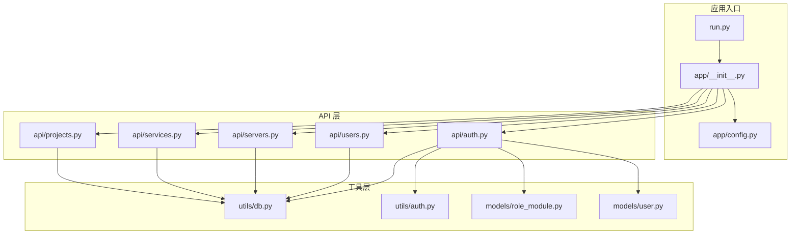
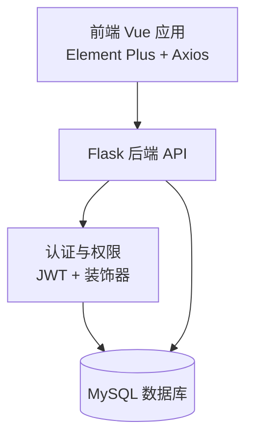
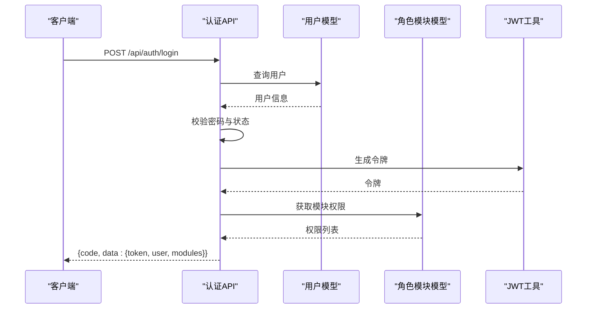
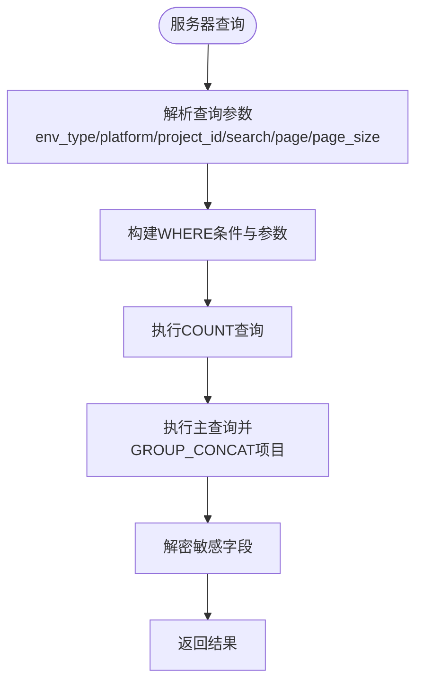
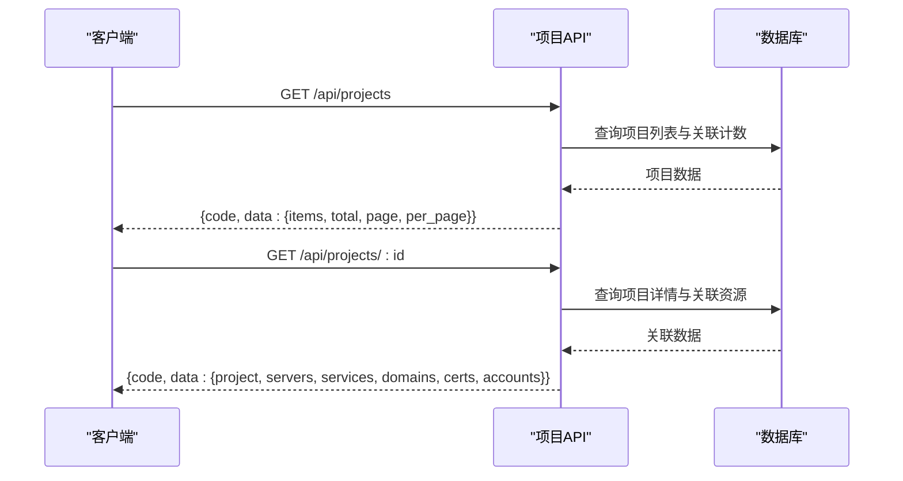
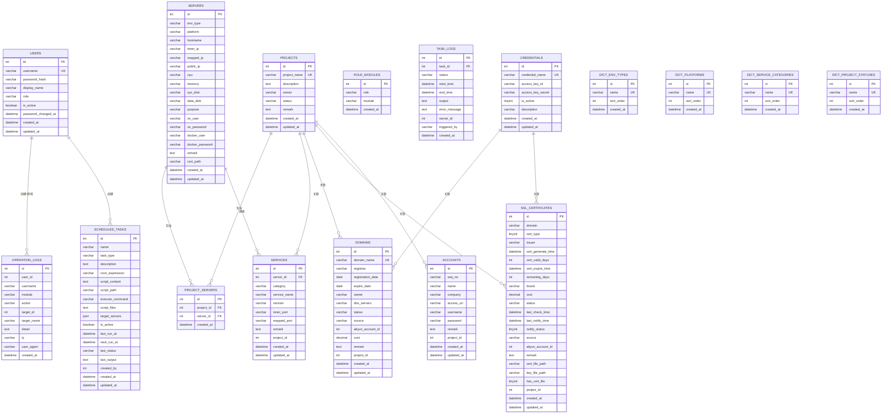
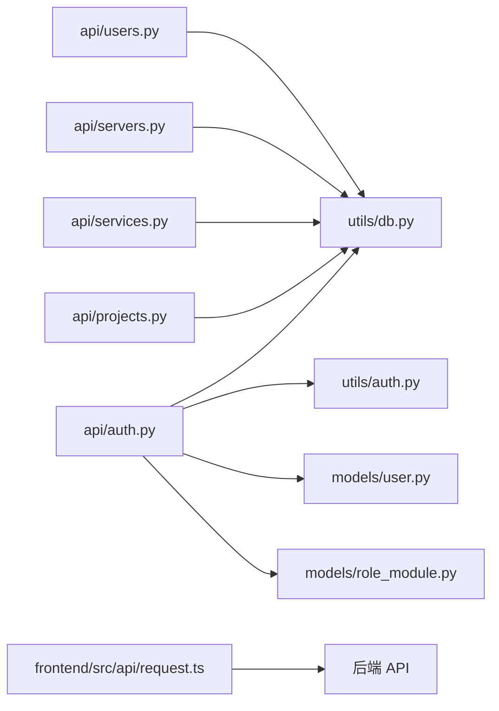

# Utility Data Api

<cite>
**本文档引用的文件**
- [backend/app/__init__.py](file://backend/app/__init__.py)
- [backend/app/config.py](file://backend/app/config.py)
- [backend/run.py](file://backend/run.py)
- [backend/init_db.py](file://backend/init_db.py)
- [backend/app/utils/db.py](file://backend/app/utils/db.py)
- [backend/app/utils/auth.py](file://backend/app/utils/auth.py)
- [backend/app/api/auth.py](file://backend/app/api/auth.py)
- [backend/app/api/users.py](file://backend/app/api/users.py)
- [backend/app/api/servers.py](file://backend/app/api/servers.py)
- [backend/app/api/services.py](file://backend/app/api/services.py)
- [backend/app/api/projects.py](file://backend/app/api/projects.py)
- [backend/app/models/user.py](file://backend/app/models/user.py)
- [backend/app/models/role_module.py](file://backend/app/models/role_module.py)
- [frontend/src/api/request.ts](file://frontend/src/api/request.ts)
</cite>

## 目录
1. [简介](#简介)
2. [项目结构](#项目结构)
3. [核心组件](#核心组件)
4. [架构总览](#架构总览)
5. [详细组件分析](#详细组件分析)
6. [依赖关系分析](#依赖关系分析)
7. [性能考虑](#性能考虑)
8. [故障排除指南](#故障排除指南)
9. [结论](#结论)

## 简介
本项目是一个基于 Flask 的运维管理平台后端 API，提供统一的数据管理与业务接口，支持用户认证、服务器与服务管理、项目管理、域名与证书管理、定时任务、监控告警等功能模块。前端通过 Element Plus 和 Axios 与后端交互，采用 JWT 进行认证，后端通过装饰器实现权限控制与模块授权。

## 项目结构
后端采用典型的分层架构：
- 应用入口与配置：`app/__init__.py`、`app/config.py`、`run.py`
- API 层：按功能模块划分蓝图，如认证、用户、服务器、服务、项目等
- 工具层：数据库连接、认证、装饰器、密码工具、调度器等
- 模型层：用户、角色模块授权等数据访问函数
- 数据库初始化：`init_db.py` 负责创建表结构与默认数据

**图表来源**
- [backend/run.py:1-8](file://backend/run.py#L1-L8)
- [backend/app/__init__.py:28-151](file://backend/app/__init__.py#L28-L151)
- [backend/app/config.py:10-58](file://backend/app/config.py#L10-L58)
- [backend/app/api/auth.py:13](file://backend/app/api/auth.py#L13)
- [backend/app/api/users.py:16](file://backend/app/api/users.py#L16)
- [backend/app/api/servers.py:11](file://backend/app/api/servers.py#L11)
- [backend/app/api/services.py:9](file://backend/app/api/services.py#L9)
- [backend/app/api/projects.py:10](file://backend/app/api/projects.py#L10)
- [backend/app/utils/db.py:43-80](file://backend/app/utils/db.py#L43-L80)
- [backend/app/utils/auth.py:9-45](file://backend/app/utils/auth.py#L9-L45)
- [backend/app/models/user.py:8-162](file://backend/app/models/user.py#L8-L162)
- [backend/app/models/role_module.py:20-108](file://backend/app/models/role_module.py#L20-L108)

**章节来源**
- [backend/app/__init__.py:28-151](file://backend/app/__init__.py#L28-L151)
- [backend/app/config.py:10-58](file://backend/app/config.py#L10-L58)
- [backend/run.py:1-8](file://backend/run.py#L1-L8)

## 核心组件
- 应用工厂与蓝图注册：`create_app()` 负责初始化日志、CORS、数据库预检、定时任务，并注册所有 API 蓝图。
- 配置管理：集中管理密钥、数据库、CORS、定时任务计划等配置项。
- 数据库工具：封装连接获取、关闭、参数掩码与超时控制。
- 认证与权限：JWT 令牌生成与校验，结合装饰器实现 JWT 必需、角色必需、模块授权控制。
- 模型层：用户、角色模块授权等数据访问函数，提供 CRUD 操作。
- API 蓝图：按模块划分，统一返回结构，集成操作日志记录。

**章节来源**
- [backend/app/__init__.py:28-151](file://backend/app/__init__.py#L28-L151)
- [backend/app/config.py:10-58](file://backend/app/config.py#L10-L58)
- [backend/app/utils/db.py:43-80](file://backend/app/utils/db.py#L43-L80)
- [backend/app/utils/auth.py:9-45](file://backend/app/utils/auth.py#L9-L45)
- [backend/app/models/user.py:8-162](file://backend/app/models/user.py#L8-L162)
- [backend/app/models/role_module.py:20-108](file://backend/app/models/role_module.py#L20-L108)

## 架构总览
系统采用前后端分离架构，后端提供 RESTful API，前端通过 Axios 发起请求并携带 JWT。认证流程由后端装饰器统一拦截，权限控制基于角色与模块授权。

**图表来源**
- [frontend/src/api/request.ts:14-72](file://frontend/src/api/request.ts#L14-L72)
- [backend/app/api/auth.py:16-103](file://backend/app/api/auth.py#L16-L103)
- [backend/app/utils/auth.py:9-45](file://backend/app/utils/auth.py#L9-L45)
- [backend/app/utils/db.py:43-80](file://backend/app/utils/db.py#L43-L80)

## 详细组件分析

### 认证与用户管理
- 登录接口：接收用户名与密码，校验用户状态与密码，生成 JWT 并返回用户模块权限列表。
- 个人资料：JWT 必需，返回用户信息与模块权限。
- 修改密码：JWT 必需，校验旧密码并更新为新密码哈希。
- 用户管理：管理员权限，支持创建、更新、删除用户与重置密码。

**图表来源**
- [backend/app/api/auth.py:16-103](file://backend/app/api/auth.py#L16-L103)
- [backend/app/models/user.py:36-71](file://backend/app/models/user.py#L36-L71)
- [backend/app/models/role_module.py:20-37](file://backend/app/models/role_module.py#L20-L37)
- [backend/app/utils/auth.py:9-28](file://backend/app/utils/auth.py#L9-L28)

**章节来源**
- [backend/app/api/auth.py:16-210](file://backend/app/api/auth.py#L16-L210)
- [backend/app/api/users.py:19-290](file://backend/app/api/users.py#L19-L290)
- [backend/app/models/user.py:8-162](file://backend/app/models/user.py#L8-L162)
- [backend/app/models/role_module.py:20-108](file://backend/app/models/role_module.py#L20-L108)
- [backend/app/utils/auth.py:9-45](file://backend/app/utils/auth.py#L9-L45)

### 服务器与服务管理
- 服务器管理：支持分页查询、过滤、密码字段解密返回、项目关联查询、批量增删改。
- 服务管理：支持按分类、环境类型、项目过滤查询，支持分页与关联服务器信息返回。

**图表来源**
- [backend/app/api/servers.py:14-116](file://backend/app/api/servers.py#L14-L116)

**章节来源**
- [backend/app/api/servers.py:14-604](file://backend/app/api/servers.py#L14-L604)
- [backend/app/api/services.py:12-210](file://backend/app/api/services.py#L12-L210)

### 项目管理
- 项目列表：支持搜索、状态过滤、分页，返回各关联资源计数。
- 项目详情：聚合返回服务器、服务、域名、证书、账号列表，并解密账号密码。
- 项目关联：支持批量关联/取消关联服务器。

**图表来源**
- [backend/app/api/projects.py:13-87](file://backend/app/api/projects.py#L13-L87)
- [backend/app/api/projects.py:174-280](file://backend/app/api/projects.py#L174-L280)

**章节来源**
- [backend/app/api/projects.py:13-547](file://backend/app/api/projects.py#L13-L547)

### 数据库初始化与表结构
- 初始化脚本负责创建数据库、表结构与默认数据，包括用户、服务器、项目、服务、字典表、定时任务、操作日志、角色模块授权、云凭证、域名、证书等。
- 为现有表动态添加 project_id 字段，确保项目关联能力。

**图表来源**
- [backend/init_db.py:36-420](file://backend/init_db.py#L36-L420)

**章节来源**
- [backend/init_db.py:24-431](file://backend/init_db.py#L24-L431)

## 依赖关系分析
- 组件耦合：API 蓝图依赖工具层（数据库、认证、装饰器），模型层提供数据访问，装饰器实现横切关注点（权限控制）。
- 外部依赖：Flask、PyMySQL、PyJWT、Axios（前端）。
- 循环依赖：未发现循环导入，模块职责清晰。

**图表来源**
- [backend/app/api/auth.py:4-12](file://backend/app/api/auth.py#L4-L12)
- [backend/app/api/users.py:5-14](file://backend/app/api/users.py#L5-L14)
- [backend/app/api/servers.py:4-9](file://backend/app/api/servers.py#L4-L9)
- [backend/app/api/services.py:4-8](file://backend/app/api/services.py#L4-L8)
- [backend/app/api/projects.py:4-8](file://backend/app/api/projects.py#L4-L8)
- [backend/app/utils/db.py:43-80](file://backend/app/utils/db.py#L43-L80)
- [backend/app/utils/auth.py:9-45](file://backend/app/utils/auth.py#L9-L45)
- [frontend/src/api/request.ts:14-72](file://frontend/src/api/request.ts#L14-L72)

**章节来源**
- [backend/app/api/auth.py:4-12](file://backend/app/api/auth.py#L4-L12)
- [backend/app/api/users.py:5-14](file://backend/app/api/users.py#L5-L14)
- [backend/app/api/servers.py:4-9](file://backend/app/api/servers.py#L4-L9)
- [backend/app/api/services.py:4-8](file://backend/app/api/services.py#L4-L8)
- [backend/app/api/projects.py:4-8](file://backend/app/api/projects.py#L4-L8)
- [frontend/src/api/request.ts:14-72](file://frontend/src/api/request.ts#L14-L72)

## 性能考虑
- 数据库连接：使用 Flask 应用上下文缓存连接，避免重复建立连接；设置连接超时与字符集，减少异常开销。
- 查询优化：分页参数边界处理，避免过大页大小；复杂查询使用索引字段（如项目关联表的联合索引）。
- 敏感数据处理：密码等敏感字段在入库前加密，在返回前解密，减少不必要的明文暴露。
- 前端请求：统一拦截器处理响应状态与错误提示，避免重复判断逻辑。

[本节为通用指导，无需具体文件分析]

## 故障排除指南
- 数据库连接失败：检查环境变量 DB_HOST、DB_PORT、DB_USER、DB_PASSWORD、DB_NAME，查看日志中脱敏后的连接参数。
- JWT 无效：确认 JWT_SECRET_KEY 配置，检查令牌过期时间；401 且非登录接口通常表示令牌过期。
- 权限不足：确认用户角色与模块授权配置，检查装饰器是否正确应用。
- 前端请求失败：查看 Axios 拦截器错误处理，401 时清除本地 token 并跳转登录页。

**章节来源**
- [backend/app/__init__.py:88-113](file://backend/app/__init__.py#L88-L113)
- [backend/app/utils/db.py:43-80](file://backend/app/utils/db.py#L43-L80)
- [frontend/src/api/request.ts:46-69](file://frontend/src/api/request.ts#L46-L69)

## 结论
本项目通过清晰的分层设计与模块化蓝图，提供了完整的运维管理 API 能力。认证与权限控制完善，数据库初始化脚本覆盖主要业务表，前端通过统一拦截器与后端协作顺畅。建议在生产环境中严格配置密钥与数据库参数，并根据业务增长持续优化查询与缓存策略。