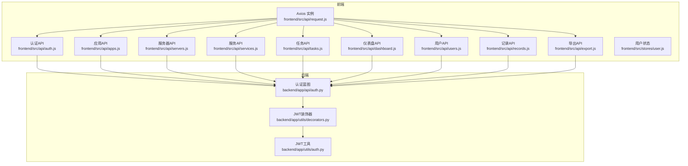
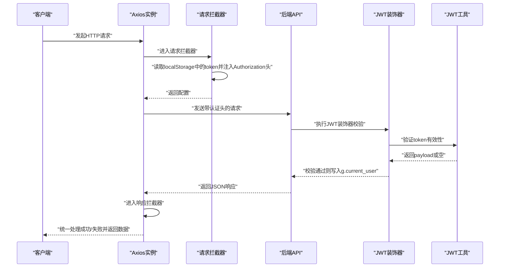
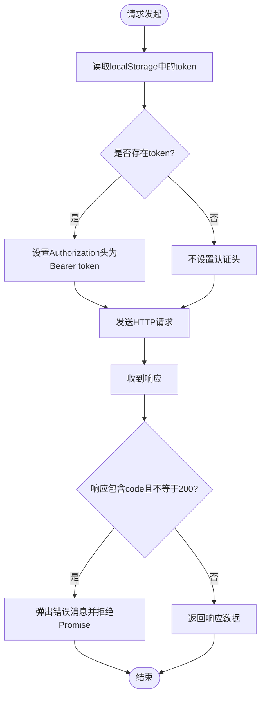
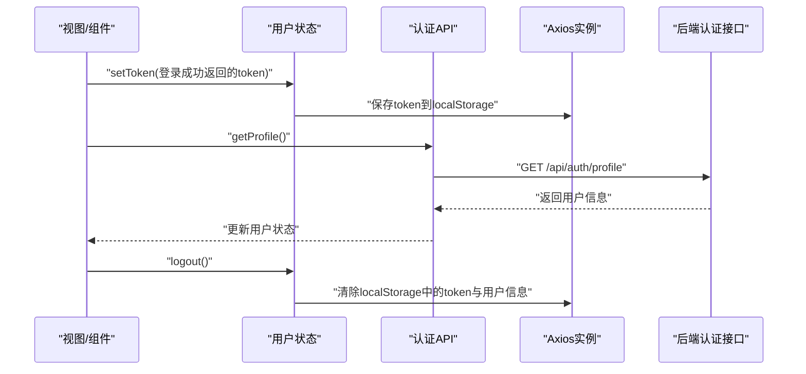
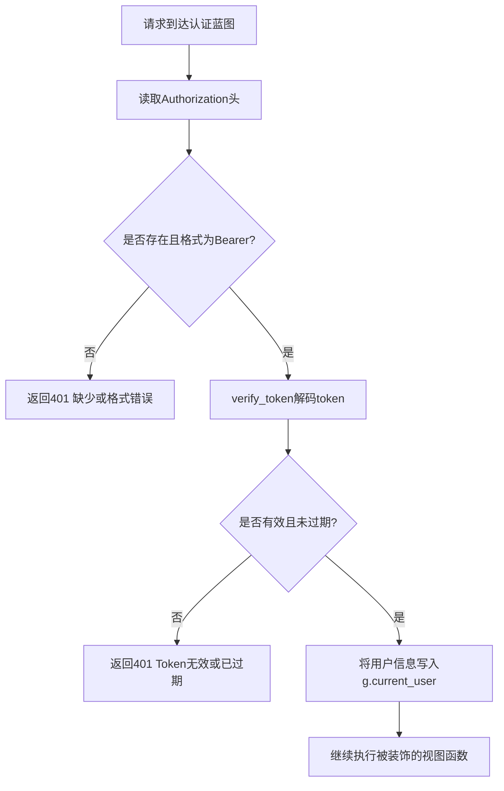
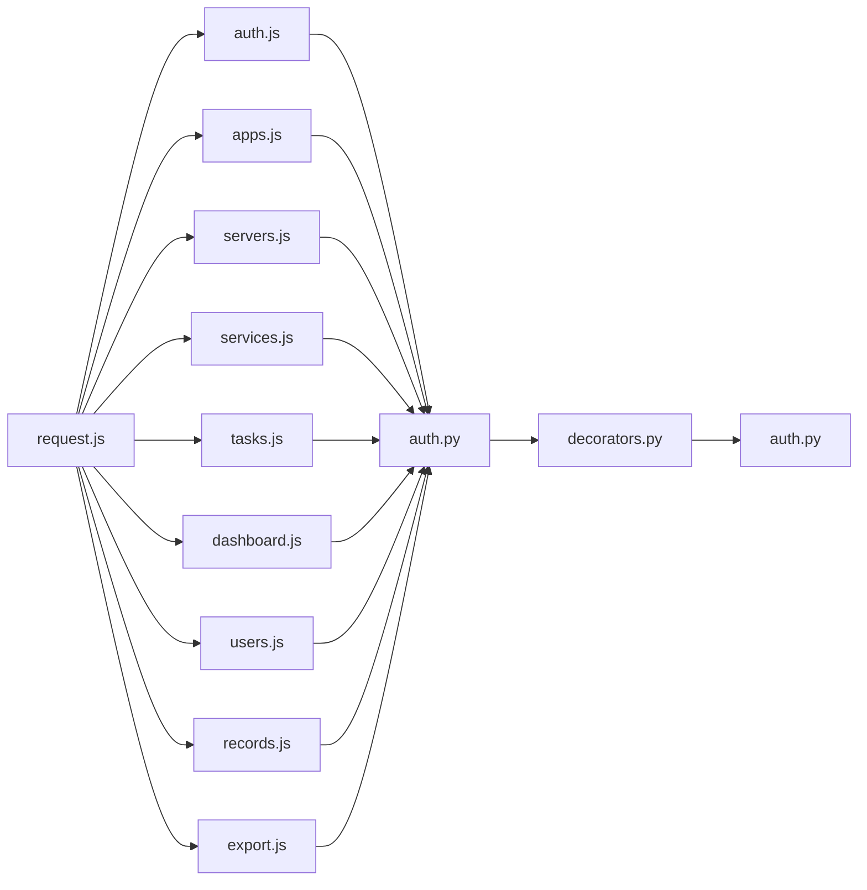

# API集成

<cite>
**本文引用的文件**
- [frontend/src/api/request.js](file://frontend/src/api/request.js)
- [frontend/src/api/auth.js](file://frontend/src/api/auth.js)
- [frontend/src/stores/user.js](file://frontend/src/stores/user.js)
- [frontend/src/api/apps.js](file://frontend/src/api/apps.js)
- [frontend/src/api/servers.js](file://frontend/src/api/servers.js)
- [frontend/src/api/services.js](file://frontend/src/api/services.js)
- [frontend/src/api/tasks.js](file://frontend/src/api/tasks.js)
- [frontend/src/api/dashboard.js](file://frontend/src/api/dashboard.js)
- [frontend/src/api/users.js](file://frontend/src/api/users.js)
- [frontend/src/api/records.js](file://frontend/src/api/records.js)
- [frontend/src/api/export.js](file://frontend/src/api/export.js)
- [backend/app/api/auth.py](file://backend/app/api/auth.py)
- [backend/app/utils/auth.py](file://backend/app/utils/auth.py)
- [backend/app/utils/decorators.py](file://backend/app/utils/decorators.py)
</cite>

## 目录
1. [简介](#简介)
2. [项目结构](#项目结构)
3. [核心组件](#核心组件)
4. [架构总览](#架构总览)
5. [详细组件分析](#详细组件分析)
6. [依赖分析](#依赖分析)
7. [性能考虑](#性能考虑)
8. [故障排查指南](#故障排查指南)
9. [结论](#结论)
10. [附录](#附录)

## 简介
本文件面向前端与后端RESTful API的集成，系统性阐述通信机制、Axios配置、请求/响应拦截器、认证token管理、API封装模式、数据转换、文件上传/下载、实时数据更新策略、最佳实践、缓存策略与网络异常处理方案。目标是帮助开发者快速理解并正确使用API层，确保前后端协作稳定高效。

## 项目结构
前端采用模块化API封装，每个业务域对应一个API文件（如应用、服务器、服务、任务、仪表盘、用户、记录、导出等），统一通过一个Axios实例对外提供HTTP能力；后端以Flask蓝图组织REST接口，并通过装饰器实现JWT认证与权限控制。

图表来源
- [frontend/src/api/request.js:1-54](file://frontend/src/api/request.js#L1-L54)
- [frontend/src/api/auth.js:1-14](file://frontend/src/api/auth.js#L1-L14)
- [frontend/src/api/apps.js:1-18](file://frontend/src/api/apps.js#L1-L18)
- [frontend/src/api/servers.js:1-26](file://frontend/src/api/servers.js#L1-L26)
- [frontend/src/api/services.js:1-18](file://frontend/src/api/services.js#L1-L18)
- [frontend/src/api/tasks.js:1-34](file://frontend/src/api/tasks.js#L1-L34)
- [frontend/src/api/dashboard.js:1-6](file://frontend/src/api/dashboard.js#L1-L6)
- [frontend/src/api/users.js:1-22](file://frontend/src/api/users.js#L1-L22)
- [frontend/src/api/records.js:1-14](file://frontend/src/api/records.js#L1-L14)
- [frontend/src/api/export.js:1-8](file://frontend/src/api/export.js#L1-L8)
- [frontend/src/stores/user.js:1-41](file://frontend/src/stores/user.js#L1-L41)
- [backend/app/api/auth.py:1-184](file://backend/app/api/auth.py#L1-L184)
- [backend/app/utils/decorators.py:1-95](file://backend/app/utils/decorators.py#L1-L95)
- [backend/app/utils/auth.py:1-83](file://backend/app/utils/auth.py#L1-L83)

章节来源
- [frontend/src/api/request.js:1-54](file://frontend/src/api/request.js#L1-L54)
- [frontend/src/stores/user.js:1-41](file://frontend/src/stores/user.js#L1-L41)
- [backend/app/api/auth.py:1-184](file://backend/app/api/auth.py#L1-L184)
- [backend/app/utils/decorators.py:1-95](file://backend/app/utils/decorators.py#L1-L95)
- [backend/app/utils/auth.py:1-83](file://backend/app/utils/auth.py#L1-L83)

## 核心组件
- Axios实例与拦截器：统一基础配置、自动注入Authorization头、集中错误处理与路由跳转。
- API封装：按领域拆分文件，每个文件暴露标准CRUD函数，便于复用与测试。
- 认证与状态：Pinia用户状态管理，持久化token与用户信息，配合后端JWT。
- 后端认证：Flask蓝图提供登录、个人资料、改密接口；装饰器完成JWT校验与角色校验。

章节来源
- [frontend/src/api/request.js:1-54](file://frontend/src/api/request.js#L1-L54)
- [frontend/src/api/auth.js:1-14](file://frontend/src/api/auth.js#L1-L14)
- [frontend/src/stores/user.js:1-41](file://frontend/src/stores/user.js#L1-L41)
- [backend/app/api/auth.py:1-184](file://backend/app/api/auth.py#L1-L184)
- [backend/app/utils/decorators.py:1-95](file://backend/app/utils/decorators.py#L1-L95)

## 架构总览
从前端到后端的典型交互流程如下：

图表来源
- [frontend/src/api/request.js:13-51](file://frontend/src/api/request.js#L13-L51)
- [backend/app/utils/decorators.py:9-56](file://backend/app/utils/decorators.py#L9-L56)
- [backend/app/utils/auth.py:38-56](file://backend/app/utils/auth.py#L38-L56)

## 详细组件分析

### Axios实例与拦截器
- 基础配置：baseURL指向“/api”，统一超时时间与Content-Type。
- 请求拦截器：从localStorage读取token，若存在则在Authorization头添加Bearer前缀。
- 响应拦截器：统一校验后端约定的code字段；对401做登出清理与路由跳转；对网络错误提示“网络连接失败”。

图表来源
- [frontend/src/api/request.js:13-51](file://frontend/src/api/request.js#L13-L51)

章节来源
- [frontend/src/api/request.js:1-54](file://frontend/src/api/request.js#L1-L54)

### 认证与用户状态
- 登录：调用后端登录接口，成功后将token与用户信息写入localStorage并更新Pinia状态。
- 个人资料：通过受保护接口获取当前用户信息，刷新本地用户状态。
- 登出：清空token与用户信息，回到登录页。

图表来源
- [frontend/src/api/auth.js:1-14](file://frontend/src/api/auth.js#L1-L14)
- [frontend/src/stores/user.js:1-41](file://frontend/src/stores/user.js#L1-L41)
- [backend/app/api/auth.py:85-115](file://backend/app/api/auth.py#L85-L115)

章节来源
- [frontend/src/api/auth.js:1-14](file://frontend/src/api/auth.js#L1-L14)
- [frontend/src/stores/user.js:1-41](file://frontend/src/stores/user.js#L1-L41)
- [backend/app/api/auth.py:14-82](file://backend/app/api/auth.py#L14-L82)

### API封装模式与数据转换
- 统一风格：每个业务API文件提供标准CRUD函数，参数与返回值一致，便于维护与测试。
- 数据转换：后端返回统一结构（含code/message/data），前端拦截器统一处理，业务层只关心data部分。
- 特殊场景：
  - 文件上传：任务相关接口显式设置Content-Type为multipart/form-data。
  - 文件下载：导出接口设置responseType为blob，便于浏览器触发下载。

章节来源
- [frontend/src/api/apps.js:1-18](file://frontend/src/api/apps.js#L1-L18)
- [frontend/src/api/servers.js:1-26](file://frontend/src/api/servers.js#L1-L26)
- [frontend/src/api/services.js:1-18](file://frontend/src/api/services.js#L1-L18)
- [frontend/src/api/tasks.js:1-34](file://frontend/src/api/tasks.js#L1-L34)
- [frontend/src/api/export.js:1-8](file://frontend/src/api/export.js#L1-L8)

### 后端认证与权限控制
- 登录接口：校验用户名、密码与账户激活状态，签发JWT。
- 个人资料与改密：均需JWT认证。
- 权限装饰器：从Authorization头解析Bearer token，验证后写入g.current_user；支持角色白名单校验。

图表来源
- [backend/app/utils/decorators.py:9-56](file://backend/app/utils/decorators.py#L9-L56)
- [backend/app/utils/auth.py:38-56](file://backend/app/utils/auth.py#L38-L56)

章节来源
- [backend/app/api/auth.py:14-184](file://backend/app/api/auth.py#L14-L184)
- [backend/app/utils/decorators.py:1-95](file://backend/app/utils/decorators.py#L1-L95)
- [backend/app/utils/auth.py:11-35](file://backend/app/utils/auth.py#L11-L35)

### 文件上传与下载处理
- 上传：任务相关接口显式声明multipart/form-data，后端接收并处理文件。
- 下载：导出接口设置responseType为blob，后端返回二进制流，前端可直接触发浏览器下载。

章节来源
- [frontend/src/api/tasks.js:7-16](file://frontend/src/api/tasks.js#L7-L16)
- [frontend/src/api/export.js:1-8](file://frontend/src/api/export.js#L1-L8)

### 实时数据更新策略
- 轮询：在需要实时性的页面（如任务日志）使用定时轮询拉取最新数据。
- 事件驱动：建议引入WebSocket或Server-Sent Events，由后端主动推送变更，减少轮询开销。
- 局部刷新：结合组件状态与API返回数据，仅更新受影响区域，避免全量重绘。

[本节为通用指导，无需代码来源]

## 依赖分析
- 前端API层依赖Axios实例与Element Plus的消息提示组件；认证API依赖用户状态存储。
- 后端认证蓝图依赖装饰器与JWT工具；装饰器依赖JWT工具进行token校验。

图表来源
- [frontend/src/api/request.js:1-54](file://frontend/src/api/request.js#L1-L54)
- [frontend/src/api/auth.js:1-14](file://frontend/src/api/auth.js#L1-L14)
- [frontend/src/api/apps.js:1-18](file://frontend/src/api/apps.js#L1-L18)
- [frontend/src/api/servers.js:1-26](file://frontend/src/api/servers.js#L1-L26)
- [frontend/src/api/services.js:1-18](file://frontend/src/api/services.js#L1-L18)
- [frontend/src/api/tasks.js:1-34](file://frontend/src/api/tasks.js#L1-L34)
- [frontend/src/api/dashboard.js:1-6](file://frontend/src/api/dashboard.js#L1-L6)
- [frontend/src/api/users.js:1-22](file://frontend/src/api/users.js#L1-L22)
- [frontend/src/api/records.js:1-14](file://frontend/src/api/records.js#L1-L14)
- [frontend/src/api/export.js:1-8](file://frontend/src/api/export.js#L1-L8)
- [backend/app/api/auth.py:1-184](file://backend/app/api/auth.py#L1-L184)
- [backend/app/utils/decorators.py:1-95](file://backend/app/utils/decorators.py#L1-L95)
- [backend/app/utils/auth.py:1-83](file://backend/app/utils/auth.py#L1-L83)

章节来源
- [frontend/src/api/request.js:1-54](file://frontend/src/api/request.js#L1-L54)
- [backend/app/api/auth.py:1-184](file://backend/app/api/auth.py#L1-L184)
- [backend/app/utils/decorators.py:1-95](file://backend/app/utils/decorators.py#L1-L95)
- [backend/app/utils/auth.py:1-83](file://backend/app/utils/auth.py#L1-L83)

## 性能考虑
- 请求合并与去抖：对高频查询（如分页列表）使用防抖或合并策略，减少不必要的请求。
- 分页与懒加载：后端提供分页接口，前端按需加载，避免一次性传输大量数据。
- 缓存策略：对静态或低频变更的数据使用内存缓存；对会话内共享的数据使用Pinia状态缓存。
- 超时与重试：合理设置超时时间；对临时网络异常启用指数退避重试，避免雪崩效应。
- 图片与大文件：采用CDN与分片上传，结合断点续传与进度反馈。

[本节为通用指导，无需代码来源]

## 故障排查指南
- 登录后401：检查请求拦截器是否正确注入Authorization头；确认后端JWT签名密钥与过期时间配置。
- 错误提示不显示：确认Element Plus消息组件可用；检查响应拦截器对非200状态的处理逻辑。
- 网络连接失败：检查baseURL与代理配置；确认跨域与CORS设置。
- 导出下载失败：确认后端返回Content-Type与前端responseType一致；检查浏览器下载行为与安全策略。

章节来源
- [frontend/src/api/request.js:35-50](file://frontend/src/api/request.js#L35-L50)
- [backend/app/utils/decorators.py:20-56](file://backend/app/utils/decorators.py#L20-L56)

## 结论
本项目通过统一的Axios实例与拦截器、清晰的API封装、完善的认证与权限控制，实现了前后端稳定的RESTful通信。建议在现有基础上进一步引入实时推送、缓存优化与更细粒度的错误处理，持续提升用户体验与系统稳定性。

## 附录
- 最佳实践清单
  - 所有受保护接口必须携带Authorization头。
  - 前端统一通过拦截器处理错误与登出逻辑。
  - 后端接口返回统一结构，便于前端一致性处理。
  - 对大文件与频繁操作采用分页、缓存与轮询策略。
  - 在生产环境替换默认JWT密钥并配置合理的过期时间。

[本节为通用指导，无需代码来源]