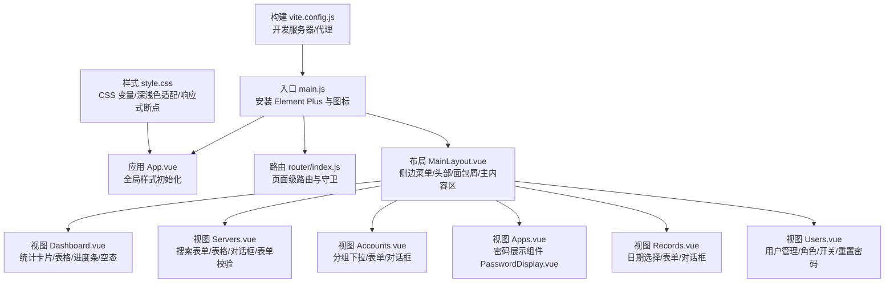
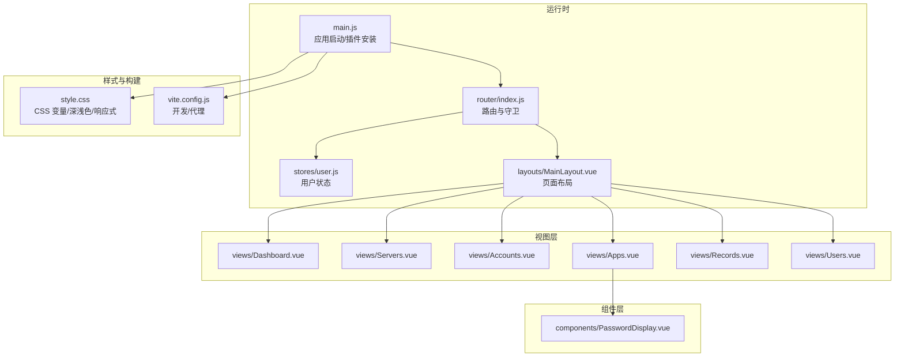
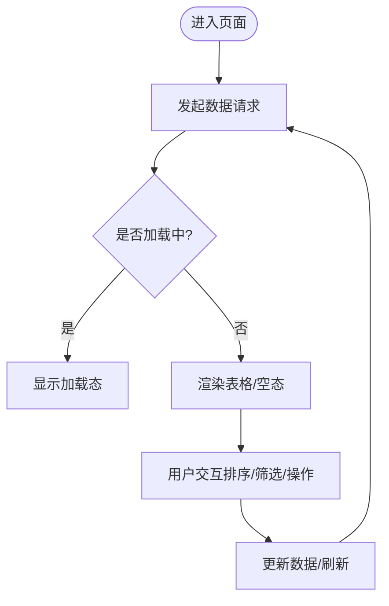
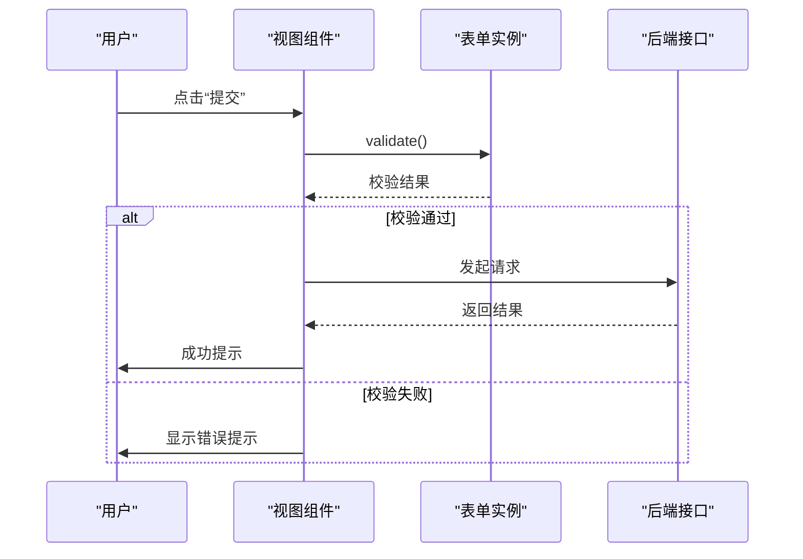
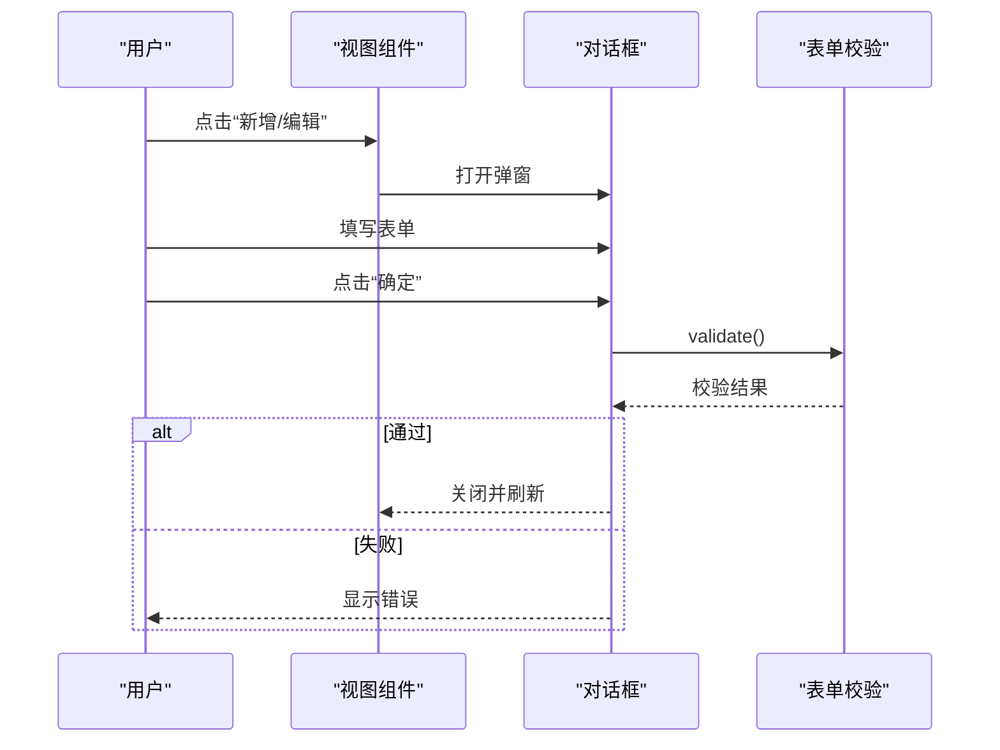
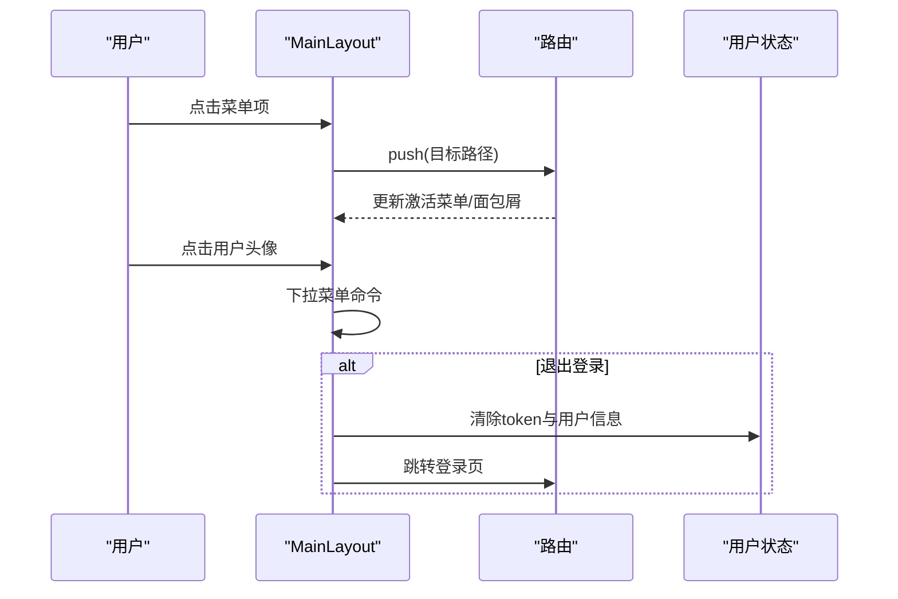
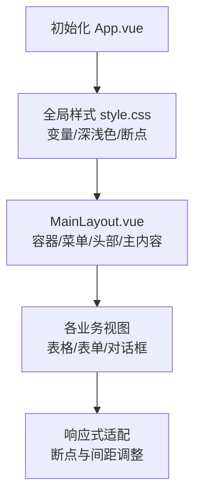
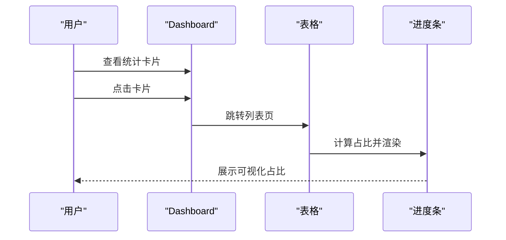
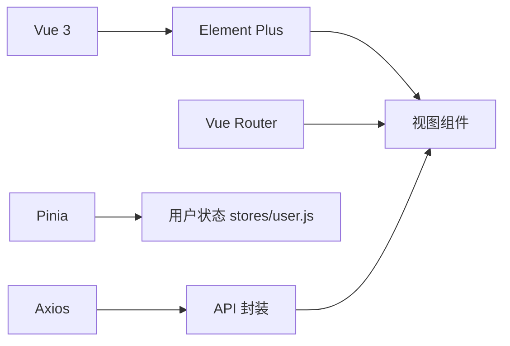

# UI组件库

<cite>
**本文引用的文件**
- [frontend/package.json](file://frontend/package.json)
- [frontend/src/main.js](file://frontend/src/main.js)
- [frontend/src/App.vue](file://frontend/src/App.vue)
- [frontend/src/style.css](file://frontend/src/style.css)
- [frontend/vite.config.js](file://frontend/vite.config.js)
- [frontend/src/components/PasswordDisplay.vue](file://frontend/src/components/PasswordDisplay.vue)
- [frontend/src/layouts/MainLayout.vue](file://frontend/src/layouts/MainLayout.vue)
- [frontend/src/router/index.js](file://frontend/src/router/index.js)
- [frontend/src/stores/user.js](file://frontend/src/stores/user.js)
- [frontend/src/api/export.js](file://frontend/src/api/export.js)
- [frontend/src/views/Dashboard.vue](file://frontend/src/views/Dashboard.vue)
- [frontend/src/views/Servers.vue](file://frontend/src/views/Servers.vue)
- [frontend/src/views/Accounts.vue](file://frontend/src/views/Accounts.vue)
- [frontend/src/views/Apps.vue](file://frontend/src/views/Apps.vue)
- [frontend/src/views/Records.vue](file://frontend/src/views/Records.vue)
- [frontend/src/views/Users.vue](file://frontend/src/views/Users.vue)
</cite>

## 目录
1. [简介](#简介)
2. [项目结构](#项目结构)
3. [核心组件](#核心组件)
4. [架构总览](#架构总览)
5. [组件详解](#组件详解)
6. [依赖关系分析](#依赖关系分析)
7. [性能与可维护性](#性能与可维护性)
8. [故障排查指南](#故障排查指南)
9. [结论](#结论)
10. [附录](#附录)

## 简介
本项目基于 Vue 3 + Element Plus 构建，提供一套运维管理平台的前端界面与交互能力。文档聚焦于如何在实际业务中使用与定制 Element Plus 组件，覆盖表格、表单、对话框、导航等核心 UI 组件，并总结页面布局、数据展示与交互设计的最佳实践；同时给出样式定制、主题配置与响应式设计的实现思路，以及通用业务组件的封装、复用策略与性能优化建议。

## 项目结构
前端采用 Vite + Vue 3 单页应用结构，Element Plus 作为主要 UI 组件库，通过全局安装引入并配置语言包与图标注册。项目以功能模块化组织，包含布局、路由、状态管理、API 封装与各业务视图。

图表来源
- [frontend/src/main.js:1-23](file://frontend/src/main.js#L1-L23)
- [frontend/src/App.vue:1-18](file://frontend/src/App.vue#L1-L18)
- [frontend/src/router/index.js:1-61](file://frontend/src/router/index.js#L1-L61)
- [frontend/src/layouts/MainLayout.vue:1-237](file://frontend/src/layouts/MainLayout.vue#L1-L237)
- [frontend/src/views/Dashboard.vue:1-307](file://frontend/src/views/Dashboard.vue#L1-L307)
- [frontend/src/views/Servers.vue:1-306](file://frontend/src/views/Servers.vue#L1-L306)
- [frontend/src/views/Accounts.vue:1-200](file://frontend/src/views/Accounts.vue#L1-L200)
- [frontend/src/views/Apps.vue:1-120](file://frontend/src/views/Apps.vue#L1-L120)
- [frontend/src/views/Records.vue:1-200](file://frontend/src/views/Records.vue#L1-L200)
- [frontend/src/views/Users.vue:1-210](file://frontend/src/views/Users.vue#L1-L210)
- [frontend/src/style.css:1-297](file://frontend/src/style.css#L1-L297)
- [frontend/vite.config.js:1-17](file://frontend/vite.config.js#L1-L17)

章节来源
- [frontend/package.json:1-24](file://frontend/package.json#L1-L24)
- [frontend/src/main.js:1-23](file://frontend/src/main.js#L1-L23)
- [frontend/src/router/index.js:1-61](file://frontend/src/router/index.js#L1-L61)
- [frontend/src/style.css:1-297](file://frontend/src/style.css#L1-L297)
- [frontend/vite.config.js:1-17](file://frontend/vite.config.js#L1-L17)

## 核心组件
- Element Plus 全局安装与本地化：在入口文件中安装 Element Plus 并设置语言为简体中文，同时批量注册图标组件，便于在模板中直接使用。
- 布局容器：使用 el-container/el-header/el-aside/el-main 组合实现侧边菜单、顶部导航、面包屑与主内容区的布局。
- 表格组件：结合 el-table、el-table-column、el-pagination、el-empty 实现数据展示、排序、筛选与空态处理。
- 表单组件：使用 el-form、el-form-item、el-input、el-select、el-date-picker、el-switch、el-row/col 等实现复杂表单与栅格布局。
- 对话框组件：通过 v-model 控制显隐，配合 el-dialog、el-form 完成新增/编辑弹窗，内置表单校验与加载态。
- 导航组件：el-menu 提供侧边菜单，el-breadcrumb 提供面包屑导航，el-dropdown 提供用户下拉菜单。
- 通知与确认：ElMessage、ElMessageBox 提供消息提示与二次确认。
- 自定义组件：PasswordDisplay 封装密码显示与复制逻辑，提升复用性与安全性。

章节来源
- [frontend/src/main.js:1-23](file://frontend/src/main.js#L1-L23)
- [frontend/src/layouts/MainLayout.vue:1-237](file://frontend/src/layouts/MainLayout.vue#L1-L237)
- [frontend/src/views/Dashboard.vue:1-307](file://frontend/src/views/Dashboard.vue#L1-L307)
- [frontend/src/views/Servers.vue:1-306](file://frontend/src/views/Servers.vue#L1-L306)
- [frontend/src/views/Accounts.vue:1-200](file://frontend/src/views/Accounts.vue#L1-L200)
- [frontend/src/views/Apps.vue:1-120](file://frontend/src/views/Apps.vue#L1-L120)
- [frontend/src/views/Records.vue:1-200](file://frontend/src/views/Records.vue#L1-L200)
- [frontend/src/views/Users.vue:1-210](file://frontend/src/views/Users.vue#L1-L210)
- [frontend/src/components/PasswordDisplay.vue:1-85](file://frontend/src/components/PasswordDisplay.vue#L1-L85)

## 架构总览
整体采用“布局 + 视图 + 组件 + 状态 + API”的分层架构。布局层负责页面骨架与导航；视图层承载具体业务；组件层提供可复用的 UI 片段；状态层通过 Pinia 管理用户信息；API 层统一请求封装。

图表来源
- [frontend/src/main.js:1-23](file://frontend/src/main.js#L1-L23)
- [frontend/src/router/index.js:1-61](file://frontend/src/router/index.js#L1-L61)
- [frontend/src/stores/user.js:1-41](file://frontend/src/stores/user.js#L1-L41)
- [frontend/src/layouts/MainLayout.vue:1-237](file://frontend/src/layouts/MainLayout.vue#L1-L237)
- [frontend/src/views/Dashboard.vue:1-307](file://frontend/src/views/Dashboard.vue#L1-L307)
- [frontend/src/views/Servers.vue:1-306](file://frontend/src/views/Servers.vue#L1-L306)
- [frontend/src/views/Accounts.vue:1-200](file://frontend/src/views/Accounts.vue#L1-L200)
- [frontend/src/views/Apps.vue:1-120](file://frontend/src/views/Apps.vue#L1-L120)
- [frontend/src/views/Records.vue:1-200](file://frontend/src/views/Records.vue#L1-L200)
- [frontend/src/views/Users.vue:1-210](file://frontend/src/views/Users.vue#L1-L210)
- [frontend/src/components/PasswordDisplay.vue:1-85](file://frontend/src/components/PasswordDisplay.vue#L1-L85)
- [frontend/src/style.css:1-297](file://frontend/src/style.css#L1-L297)
- [frontend/vite.config.js:1-17](file://frontend/vite.config.js#L1-L17)

## 组件详解

### 表格组件（el-table）
- 数据绑定与空态：通过 v-loading 控制加载态，无数据时渲染 el-empty。
- 列配置：使用 el-table-column 配置列标题、宽度、对齐方式与固定列；支持插槽自定义单元格内容（如标签、进度条、按钮）。
- 交互设计：点击统计卡片跳转到对应列表页；表格行尾部固定操作列，保证移动端可滚动体验。
- 最佳实践：合理设置最小宽度与省略策略（show-overflow-tooltip），避免列拥挤；对重要字段使用标签或颜色区分状态。

图表来源
- [frontend/src/views/Dashboard.vue:71-134](file://frontend/src/views/Dashboard.vue#L71-L134)
- [frontend/src/views/Servers.vue:35-57](file://frontend/src/views/Servers.vue#L35-L57)

章节来源
- [frontend/src/views/Dashboard.vue:1-307](file://frontend/src/views/Dashboard.vue#L1-L307)
- [frontend/src/views/Servers.vue:1-306](file://frontend/src/views/Servers.vue#L1-L306)

### 表单组件（el-form）
- 布局：使用 el-row + el-col 实现多列栅格布局，保证表单项在不同屏幕下的排布。
- 校验：通过 ref 获取表单实例，调用 validate 进行校验；规则集中定义，便于复用与维护。
- 输入控件：结合 el-input、el-select、el-date-picker、el-switch、el-textarea 等满足不同业务输入场景。
- 最佳实践：必填项明确提示；输入格式约束（如日期格式化）；提交前统一校验，避免无效请求。

图表来源
- [frontend/src/views/Servers.vue:250-268](file://frontend/src/views/Servers.vue#L250-L268)
- [frontend/src/views/Accounts.vue:104-117](file://frontend/src/views/Accounts.vue#L104-L117)
- [frontend/src/views/Records.vue:158-171](file://frontend/src/views/Records.vue#L158-L171)
- [frontend/src/views/Users.vue:193-205](file://frontend/src/views/Users.vue#L193-L205)

章节来源
- [frontend/src/views/Servers.vue:1-306](file://frontend/src/views/Servers.vue#L1-L306)
- [frontend/src/views/Accounts.vue:1-200](file://frontend/src/views/Accounts.vue#L1-L200)
- [frontend/src/views/Records.vue:1-200](file://frontend/src/views/Records.vue#L1-L200)
- [frontend/src/views/Users.vue:1-210](file://frontend/src/views/Users.vue#L1-L210)

### 对话框组件（el-dialog）
- 显隐控制：通过 v-model 控制显示/隐藏；destroy-on-close 在关闭时销毁 DOM，减少内存占用。
- 结构：头部标题、主体表单、底部操作按钮；表单引用与校验在弹窗内完成。
- 最佳实践：弹窗尺寸按业务需要设定；提交按钮增加 loading 态；异常捕获后保持弹窗打开以便修正。

图表来源
- [frontend/src/views/Servers.vue:60-153](file://frontend/src/views/Servers.vue#L60-L153)
- [frontend/src/views/Accounts.vue:72-117](file://frontend/src/views/Accounts.vue#L72-L117)
- [frontend/src/views/Apps.vue:83-97](file://frontend/src/views/Apps.vue#L83-L97)
- [frontend/src/views/Records.vue:44-97](file://frontend/src/views/Records.vue#L44-L97)
- [frontend/src/views/Users.vue:60-89](file://frontend/src/views/Users.vue#L60-L89)

章节来源
- [frontend/src/views/Servers.vue:1-306](file://frontend/src/views/Servers.vue#L1-L306)
- [frontend/src/views/Accounts.vue:1-200](file://frontend/src/views/Accounts.vue#L1-L200)
- [frontend/src/views/Apps.vue:1-120](file://frontend/src/views/Apps.vue#L1-L120)
- [frontend/src/views/Records.vue:1-200](file://frontend/src/views/Records.vue#L1-L200)
- [frontend/src/views/Users.vue:1-210](file://frontend/src/views/Users.vue#L1-L210)

### 导航组件（el-menu、el-breadcrumb、el-dropdown）
- 侧边菜单：根据当前路由高亮激活项；支持折叠与过渡动画；菜单项通过 router=true 支持编程式导航。
- 面包屑：动态从路由元信息读取标题，保持与页面一致。
- 用户下拉：提供修改密码与退出登录入口，结合 ElMessageBox 确认危险操作。

图表来源
- [frontend/src/layouts/MainLayout.vue:9-99](file://frontend/src/layouts/MainLayout.vue#L9-L99)
- [frontend/src/router/index.js:36-58](file://frontend/src/router/index.js#L36-L58)
- [frontend/src/stores/user.js:32-37](file://frontend/src/stores/user.js#L32-L37)

章节来源
- [frontend/src/layouts/MainLayout.vue:1-237](file://frontend/src/layouts/MainLayout.vue#L1-L237)
- [frontend/src/router/index.js:1-61](file://frontend/src/router/index.js#L1-L61)
- [frontend/src/stores/user.js:1-41](file://frontend/src/stores/user.js#L1-L41)

### 页面布局与响应式设计
- 布局容器：el-container 提供语义化布局，配合 aside/header/main 实现三段式结构。
- 响应式断点：在 style.css 中定义断点，针对小屏设备调整字体大小、间距与布局方向。
- 深浅色主题：通过 CSS 变量在 :root 与 @media (prefers-color-scheme: dark) 中切换颜色体系，确保夜间模式一致性。

图表来源
- [frontend/src/App.vue:1-18](file://frontend/src/App.vue#L1-L18)
- [frontend/src/style.css:1-297](file://frontend/src/style.css#L1-L297)
- [frontend/src/layouts/MainLayout.vue:158-236](file://frontend/src/layouts/MainLayout.vue#L158-L236)

章节来源
- [frontend/src/App.vue:1-18](file://frontend/src/App.vue#L1-L18)
- [frontend/src/style.css:1-297](file://frontend/src/style.css#L1-L297)
- [frontend/src/layouts/MainLayout.vue:1-237](file://frontend/src/layouts/MainLayout.vue#L1-L237)

### 数据展示与交互最佳实践
- 仪表盘：使用 el-row/col 分栏展示统计卡片，点击卡片跳转至对应列表；表格中使用标签与进度条直观呈现占比。
- 列表页：搜索表单 + 表格 + 弹窗的组合，支持新增/编辑/删除；对关键字段使用标签区分状态。
- 用户管理：角色与状态控制，避免自我修改角色；重置密码弹窗独立校验。

图表来源
- [frontend/src/views/Dashboard.vue:61-134](file://frontend/src/views/Dashboard.vue#L61-L134)

章节来源
- [frontend/src/views/Dashboard.vue:1-307](file://frontend/src/views/Dashboard.vue#L1-L307)

### 组件样式定制与主题配置
- 全局样式：在 App.vue 中重置基础样式，统一字体与盒模型；在 style.css 中定义 CSS 变量，支撑深浅色与响应式。
- Element Plus 主题：通过全局安装时传入 locale 参数设置语言；图标通过批量注册实现按需使用。
- 组件级样式：各视图内的 scoped 样式隔离组件内部样式，避免污染全局。

章节来源
- [frontend/src/main.js:1-23](file://frontend/src/main.js#L1-L23)
- [frontend/src/App.vue:1-18](file://frontend/src/App.vue#L1-L18)
- [frontend/src/style.css:1-297](file://frontend/src/style.css#L1-L297)

### 常用业务组件封装与复用
- PasswordDisplay：封装密码显示/隐藏与复制逻辑，支持降级方案与消息反馈，提高复用性与安全性。
- 复用策略：将通用交互（如确认对话框、加载态、空态）抽象为可复用的工具函数或混入，减少重复代码。

章节来源
- [frontend/src/components/PasswordDisplay.vue:1-85](file://frontend/src/components/PasswordDisplay.vue#L1-L85)

## 依赖关系分析
- Element Plus：作为 UI 组件库，提供表格、表单、对话框、导航等组件。
- Vue Router：负责页面路由与权限守卫。
- Pinia：集中管理用户状态（token、用户信息、角色）。
- Axios：封装请求方法，统一处理响应与下载（如 Excel 导出）。

图表来源
- [frontend/package.json:11-17](file://frontend/package.json#L11-L17)
- [frontend/src/router/index.js:1-61](file://frontend/src/router/index.js#L1-L61)
- [frontend/src/stores/user.js:1-41](file://frontend/src/stores/user.js#L1-L41)
- [frontend/src/api/export.js:1-8](file://frontend/src/api/export.js#L1-L8)

章节来源
- [frontend/package.json:1-24](file://frontend/package.json#L1-L24)
- [frontend/src/router/index.js:1-61](file://frontend/src/router/index.js#L1-L61)
- [frontend/src/stores/user.js:1-41](file://frontend/src/stores/user.js#L1-L41)
- [frontend/src/api/export.js:1-8](file://frontend/src/api/export.js#L1-L8)

## 性能与可维护性
- 组件拆分：将通用交互（确认、消息、空态）抽离为可复用逻辑，降低视图复杂度。
- 懒加载：路由按需加载视图组件，减少首屏体积。
- 图标与样式：批量注册图标，避免未使用图标打包；CSS 变量集中管理，便于主题切换与维护。
- 请求优化：导出 Excel 使用 Blob 流式下载，避免大对象内存驻留；表单提交前统一校验，减少无效请求。
- 响应式：在 style.css 中统一断点与间距，保证跨设备一致性。

[本节为通用指导，无需列出章节来源]

## 故障排查指南
- 登录与权限
  - 现象：访问受保护页面被重定向至登录页。
  - 排查：检查路由守卫中的 token 与 requiresAdmin 判断；确认用户状态 store 是否正确设置。
- 表单提交
  - 现象：点击提交无反应或报错。
  - 排查：确认表单 validate 返回值；检查接口返回与异常捕获；观察提交按钮 loading 状态。
- 导出功能
  - 现象：点击导出无响应或下载失败。
  - 排查：确认 responseType 为 blob；检查后端返回的 MIME 类型；浏览器下载拦截与安全策略。
- 密码复制
  - 现象：点击复制无效。
  - 排查：检查 Clipboard API 权限与降级方案；确认消息提示是否触发。

章节来源
- [frontend/src/router/index.js:36-58](file://frontend/src/router/index.js#L36-L58)
- [frontend/src/stores/user.js:32-37](file://frontend/src/stores/user.js#L32-L37)
- [frontend/src/views/Servers.vue:250-268](file://frontend/src/views/Servers.vue#L250-L268)
- [frontend/src/api/export.js:3-7](file://frontend/src/api/export.js#L3-L7)
- [frontend/src/components/PasswordDisplay.vue:29-45](file://frontend/src/components/PasswordDisplay.vue#L29-L45)

## 结论
本项目以 Element Plus 为核心，结合 Vue 3 的组合式 API 与 Pinia 状态管理，实现了运维平台的页面布局、数据展示与交互流程。通过合理的组件拆分、表单与对话框的标准化封装、以及样式与主题的统一管理，既提升了开发效率，也保障了用户体验与可维护性。后续可在组件库升级、国际化扩展与自动化测试方面持续完善。

[本节为总结性内容，无需列出章节来源]

## 附录
- 开发与构建
  - 开发服务器：host=0.0.0.0，端口 3000，代理到后端 5000 端口。
  - 依赖：Vue 3、Element Plus、Vue Router、Pinia、Axios、图标库。
- 常用命令
  - dev：启动开发服务器
  - build：构建生产包
  - preview：预览生产包

章节来源
- [frontend/vite.config.js:1-17](file://frontend/vite.config.js#L1-L17)
- [frontend/package.json:1-24](file://frontend/package.json#L1-L24)