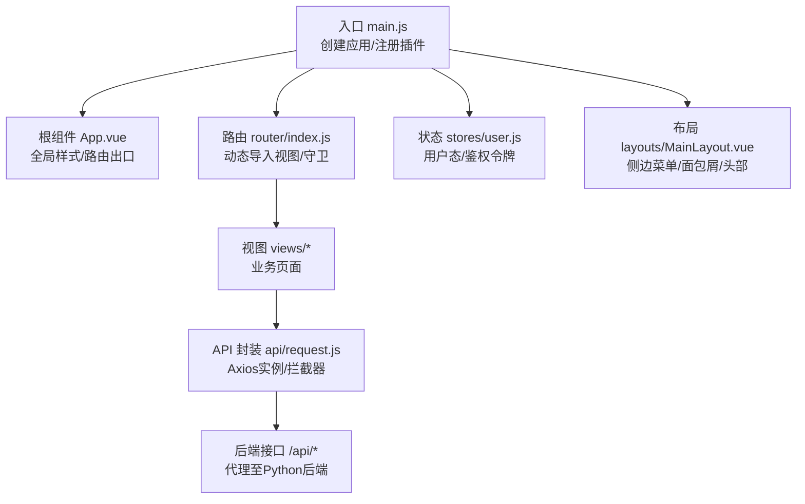
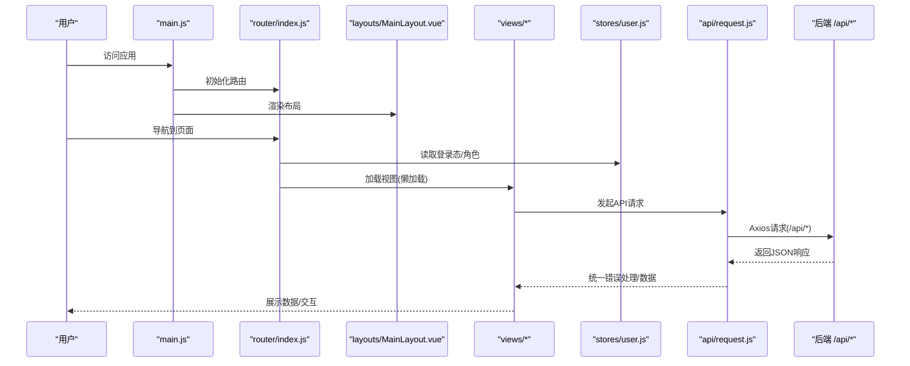
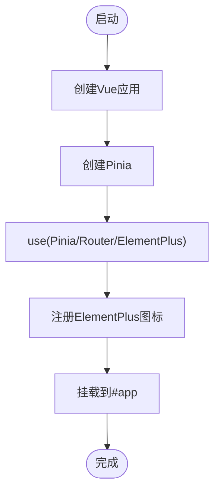
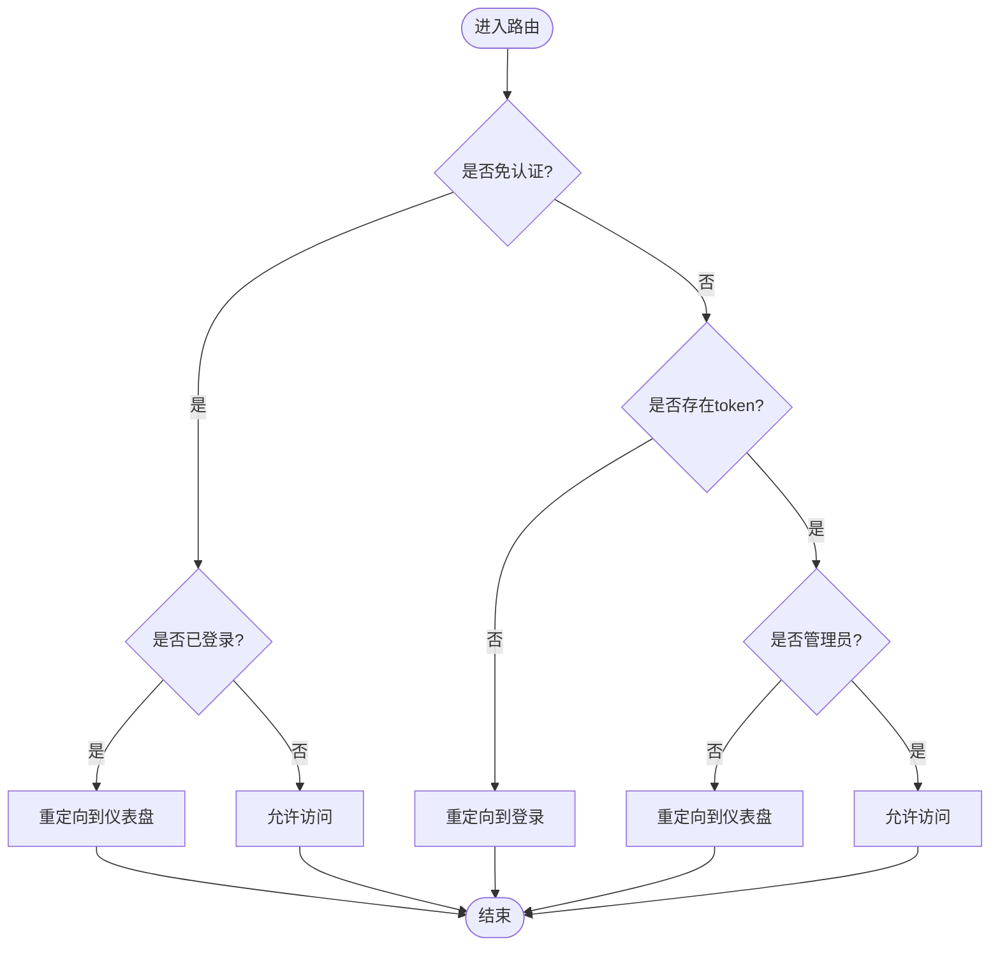
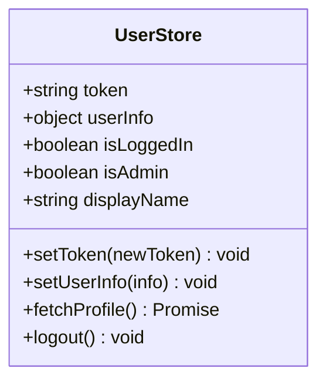
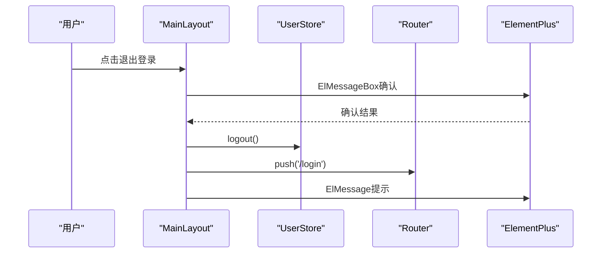
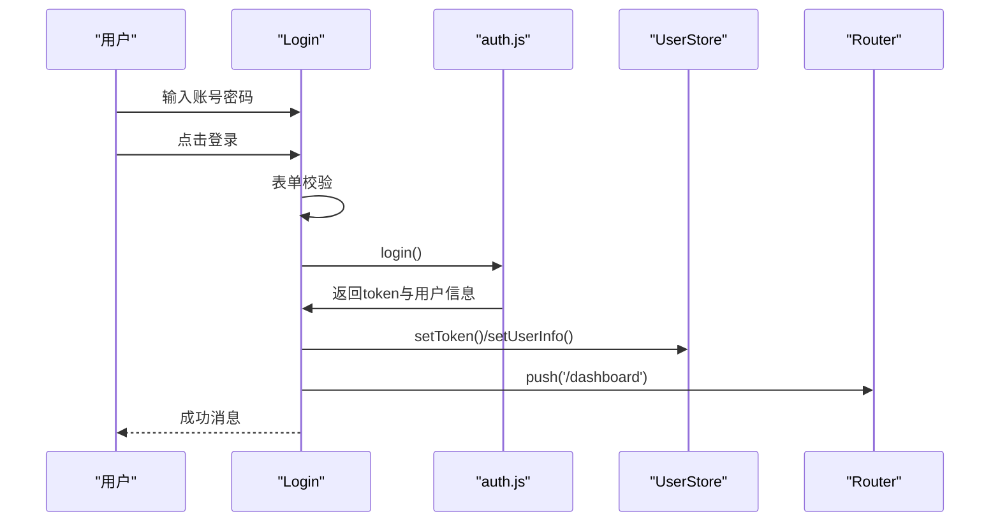
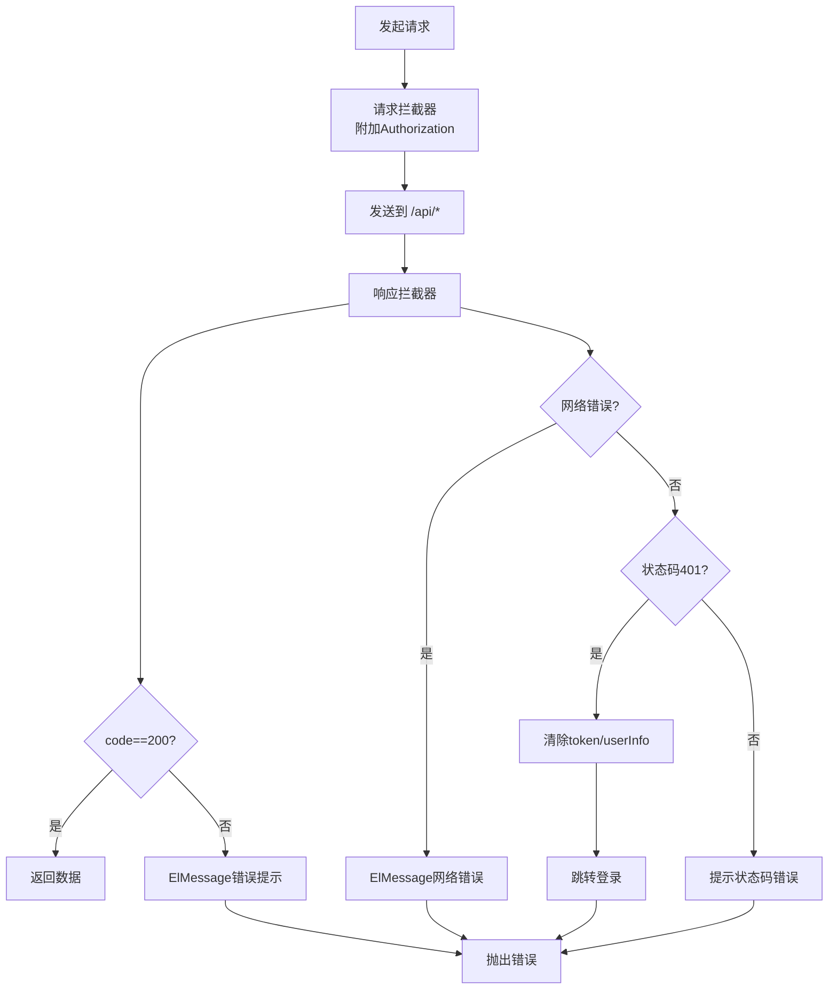
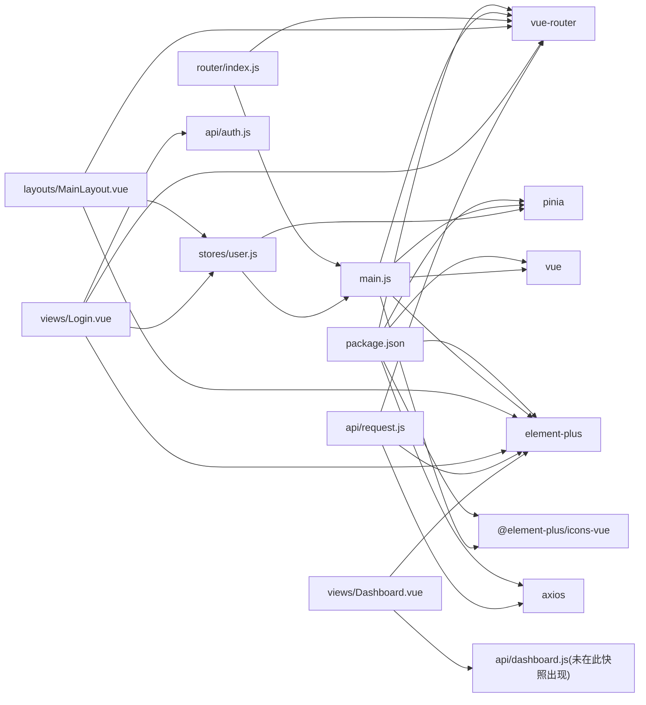

# 前端应用架构

<cite>
**本文档引用的文件**
- [frontend/src/main.js](file://frontend/src/main.js)
- [frontend/src/App.vue](file://frontend/src/App.vue)
- [frontend/src/router/index.js](file://frontend/src/router/index.js)
- [frontend/src/stores/user.js](file://frontend/src/stores/user.js)
- [frontend/src/layouts/MainLayout.vue](file://frontend/src/layouts/MainLayout.vue)
- [frontend/src/views/Login.vue](file://frontend/src/views/Login.vue)
- [frontend/src/views/Dashboard.vue](file://frontend/src/views/Dashboard.vue)
- [frontend/src/components/HelloWorld.vue](file://frontend/src/components/HelloWorld.vue)
- [frontend/src/components/PasswordDisplay.vue](file://frontend/src/components/PasswordDisplay.vue)
- [frontend/src/api/request.js](file://frontend/src/api/request.js)
- [frontend/src/api/auth.js](file://frontend/src/api/auth.js)
- [frontend/package.json](file://frontend/package.json)
- [frontend/vite.config.js](file://frontend/vite.config.js)
- [frontend/src/style.css](file://frontend/src/style.css)
- [frontend/tsconfig.json](file://frontend/tsconfig.json)
</cite>

## 目录
1. [简介](#简介)
2. [项目结构](#项目结构)
3. [核心组件](#核心组件)
4. [架构总览](#架构总览)
5. [详细组件分析](#详细组件分析)
6. [依赖关系分析](#依赖关系分析)
7. [性能考虑](#性能考虑)
8. [故障排除指南](#故障排除指南)
9. [结论](#结论)
10. [附录](#附录)

## 简介
本文件为该Vue.js单页应用（SPA）的前端架构文档，面向开发者与产品团队，系统性阐述应用的整体结构、组件层次设计、路由配置与状态管理、UI组件库（Element Plus）的使用与主题定制、响应式设计与样式管理、组件开发规范、性能优化策略、路由守卫与权限控制、页面导航、后端API集成、错误处理与用户体验优化等。

## 项目结构
前端采用Vite构建，基于Vue 3 Composition API与TypeScript配置，结合Pinia进行状态管理、Element Plus提供UI组件库，通过vue-router实现路由与权限控制，Axios封装HTTP请求与统一错误处理。

图表来源
- [frontend/src/main.js:1-23](file://frontend/src/main.js#L1-L23)
- [frontend/src/App.vue:1-18](file://frontend/src/App.vue#L1-L18)
- [frontend/src/router/index.js:1-61](file://frontend/src/router/index.js#L1-L61)
- [frontend/src/stores/user.js:1-41](file://frontend/src/stores/user.js#L1-L41)
- [frontend/src/layouts/MainLayout.vue:1-237](file://frontend/src/layouts/MainLayout.vue#L1-L237)
- [frontend/src/api/request.js:1-54](file://frontend/src/api/request.js#L1-L54)

章节来源
- [frontend/src/main.js:1-23](file://frontend/src/main.js#L1-L23)
- [frontend/src/App.vue:1-18](file://frontend/src/App.vue#L1-L18)
- [frontend/src/router/index.js:1-61](file://frontend/src/router/index.js#L1-L61)
- [frontend/src/stores/user.js:1-41](file://frontend/src/stores/user.js#L1-L41)
- [frontend/src/layouts/MainLayout.vue:1-237](file://frontend/src/layouts/MainLayout.vue#L1-L237)
- [frontend/src/api/request.js:1-54](file://frontend/src/api/request.js#L1-L54)

## 核心组件
- 应用入口与插件注册：创建Vue应用、安装Pinia、Router、Element Plus及本地化、注册全部图标组件。
- 根组件：提供全局基础样式与router-view占位。
- 路由系统：定义登录页与主布局嵌套路由，实现登录保护与管理员权限控制。
- 状态管理：用户store封装令牌、用户信息、登录态、管理员态、显示名、拉取资料、登出。
- 布局组件：侧边菜单、面包屑、顶部导航、导出Excel、用户下拉菜单。
- 视图组件：登录页、仪表盘等业务页面。
- API层：Axios实例、请求/响应拦截器、统一错误处理与401自动跳转登录。
- 样式系统：CSS变量主题、深色模式适配、通用样式与组件scoped样式。

章节来源
- [frontend/src/main.js:1-23](file://frontend/src/main.js#L1-L23)
- [frontend/src/App.vue:1-18](file://frontend/src/App.vue#L1-L18)
- [frontend/src/router/index.js:1-61](file://frontend/src/router/index.js#L1-L61)
- [frontend/src/stores/user.js:1-41](file://frontend/src/stores/user.js#L1-L41)
- [frontend/src/layouts/MainLayout.vue:1-237](file://frontend/src/layouts/MainLayout.vue#L1-L237)
- [frontend/src/api/request.js:1-54](file://frontend/src/api/request.js#L1-L54)

## 架构总览
应用采用“入口 -> 插件注册 -> 路由 -> 布局 -> 视图 -> API -> 后端”的线性数据流；状态通过Pinia集中管理；UI通过Element Plus组件库实现；样式采用CSS变量与scoped样式组合；开发与调试通过Vite代理到后端。

图表来源
- [frontend/src/main.js:1-23](file://frontend/src/main.js#L1-L23)
- [frontend/src/router/index.js:35-58](file://frontend/src/router/index.js#L35-L58)
- [frontend/src/layouts/MainLayout.vue:102-155](file://frontend/src/layouts/MainLayout.vue#L102-L155)
- [frontend/src/stores/user.js:5-40](file://frontend/src/stores/user.js#L5-L40)
- [frontend/src/api/request.js:13-51](file://frontend/src/api/request.js#L13-L51)

## 详细组件分析

### 应用入口与插件注册
- 创建Vue应用与Pinia实例，按序use插件。
- 安装Element Plus并设置中文本地化，批量注册Element Plus图标为全局组件。
- 挂载到DOM节点。

图表来源
- [frontend/src/main.js:10-22](file://frontend/src/main.js#L10-L22)

章节来源
- [frontend/src/main.js:1-23](file://frontend/src/main.js#L1-L23)

### 根组件与全局样式
- 提供基础重置与字体设置。
- 作为router-view容器承载页面切换。

章节来源
- [frontend/src/App.vue:1-18](file://frontend/src/App.vue#L1-L18)

### 路由系统与权限控制
- 定义登录页与主布局嵌套路由，子路由覆盖仪表盘、服务器、服务、账户、应用、证书、记录、任务、用户管理、修改密码等。
- 路由守卫逻辑：
  - requiresAuth=false：无需认证；若已登录访问登录页则重定向至仪表盘。
  - 需认证但无token：重定向至登录页。
  - requiresAdmin=true且非admin：重定向至仪表盘。
  - 其他情况放行。
- 使用动态导入实现路由级代码分割。

图表来源
- [frontend/src/router/index.js:35-58](file://frontend/src/router/index.js#L35-L58)

章节来源
- [frontend/src/router/index.js:1-61](file://frontend/src/router/index.js#L1-L61)

### 状态管理（Pinia）
- 用户store：
  - 状态：token、userInfo、计算属性isLoggedIn/isAdmin/displayName。
  - 方法：setToken/setUserInfo、fetchProfile、logout。
  - 数据持久化：localStorage同步。
- 与路由守卫配合实现登录态与管理员态判断。

图表来源
- [frontend/src/stores/user.js:5-40](file://frontend/src/stores/user.js#L5-L40)

章节来源
- [frontend/src/stores/user.js:1-41](file://frontend/src/stores/user.js#L1-L41)

### 布局组件（MainLayout）
- 结构：Aside菜单、Header顶部导航、Main内容区。
- 功能：
  - 侧边菜单：根据当前路由激活项，支持折叠；仅管理员可见用户管理。
  - 面包屑：根据路由meta.title展示。
  - 顶部导航：导出Excel、用户头像下拉菜单（修改密码、退出登录）。
  - 退出登录：确认弹窗、调用store.logout、跳转登录并提示成功。
  - 导出Excel：调用API返回二进制，创建下载链接触发下载。

图表来源
- [frontend/src/layouts/MainLayout.vue:124-138](file://frontend/src/layouts/MainLayout.vue#L124-L138)
- [frontend/src/stores/user.js:32-37](file://frontend/src/stores/user.js#L32-L37)

章节来源
- [frontend/src/layouts/MainLayout.vue:1-237](file://frontend/src/layouts/MainLayout.vue#L1-L237)

### 登录视图
- 表单校验：用户名/密码必填规则。
- 登录流程：表单校验 -> 调用API -> 成功写入token与用户信息 -> 跳转仪表盘 -> 成功消息提示。
- 失败处理：捕获异常并记录日志。

图表来源
- [frontend/src/views/Login.vue:50-66](file://frontend/src/views/Login.vue#L50-L66)
- [frontend/src/api/auth.js:3-5](file://frontend/src/api/auth.js#L3-L5)
- [frontend/src/stores/user.js:13-21](file://frontend/src/stores/user.js#L13-L21)

章节来源
- [frontend/src/views/Login.vue:1-114](file://frontend/src/views/Login.vue#L1-L114)
- [frontend/src/api/auth.js:1-14](file://frontend/src/api/auth.js#L1-L14)
- [frontend/src/stores/user.js:1-41](file://frontend/src/stores/user.js#L1-L41)

### 仪表盘视图
- 统计卡片：点击跳转对应列表页。
- 环境分布表格：带进度条与标签颜色映射。
- 到期提醒：按剩余天数着色。
- 最近更新记录：分页/空态。
- 数据加载：mounted时调用API，loading控制。

章节来源
- [frontend/src/views/Dashboard.vue:1-307](file://frontend/src/views/Dashboard.vue#L1-L307)

### 组件库与图标
- Element Plus：全局安装、中文本地化、图标注册为全局组件。
- 图标使用：在组件中直接引入并使用，如User、Lock、Monitor等。

章节来源
- [frontend/src/main.js:3-20](file://frontend/src/main.js#L3-L20)
- [frontend/src/views/Login.vue:30-33](file://frontend/src/views/Login.vue#L30-L33)
- [frontend/src/views/Dashboard.vue:140](file://frontend/src/views/Dashboard.vue#L140)

### API封装与错误处理
- Axios实例：baseURL=/api、超时15s、JSON头。
- 请求拦截器：自动附加Authorization: Bearer token。
- 响应拦截器：统一错误码校验、401自动清理本地存储并跳转登录、网络错误提示。
- API模块：auth.js封装登录、个人资料、修改密码。

图表来源
- [frontend/src/api/request.js:13-51](file://frontend/src/api/request.js#L13-L51)

章节来源
- [frontend/src/api/request.js:1-54](file://frontend/src/api/request.js#L1-L54)
- [frontend/src/api/auth.js:1-14](file://frontend/src/api/auth.js#L1-L14)

### 样式管理与主题定制
- 全局样式：App.vue基础样式重置与字体设置。
- CSS变量主题：style.css定义明/暗两套变量，媒体查询适配。
- 组件样式：scoped样式隔离，深色模式下的颜色映射。
- 响应式设计：媒体查询在style.css中体现，组件内也使用响应式断点。

章节来源
- [frontend/src/App.vue:8-17](file://frontend/src/App.vue#L8-L17)
- [frontend/src/style.css:1-297](file://frontend/src/style.css#L1-L297)

### 开发与构建配置
- Vite：本地开发端口3000，/api代理到后端5000端口。
- TypeScript：严格模式、未使用变量/参数检查、模块解析等配置。
- 依赖：Vue 3、Element Plus、Pinia、Vue Router、Axios等。

章节来源
- [frontend/vite.config.js:1-16](file://frontend/vite.config.js#L1-L16)
- [frontend/tsconfig.json:1-27](file://frontend/tsconfig.json#L1-L27)
- [frontend/package.json:1-24](file://frontend/package.json#L1-L24)

## 依赖关系分析

图表来源
- [frontend/package.json:11-22](file://frontend/package.json#L11-L22)
- [frontend/src/main.js:1-23](file://frontend/src/main.js#L1-L23)
- [frontend/src/router/index.js:1-3](file://frontend/src/router/index.js#L1-L3)
- [frontend/src/stores/user.js:1-4](file://frontend/src/stores/user.js#L1-L4)
- [frontend/src/layouts/MainLayout.vue:102-108](file://frontend/src/layouts/MainLayout.vue#L102-L108)
- [frontend/src/views/Login.vue:27-33](file://frontend/src/views/Login.vue#L27-L33)
- [frontend/src/api/request.js:1-11](file://frontend/src/api/request.js#L1-L11)

章节来源
- [frontend/package.json:1-24](file://frontend/package.json#L1-L24)
- [frontend/src/main.js:1-23](file://frontend/src/main.js#L1-L23)
- [frontend/src/router/index.js:1-61](file://frontend/src/router/index.js#L1-L61)
- [frontend/src/stores/user.js:1-41](file://frontend/src/stores/user.js#L1-L41)
- [frontend/src/layouts/MainLayout.vue:1-237](file://frontend/src/layouts/MainLayout.vue#L1-L237)
- [frontend/src/views/Login.vue:1-114](file://frontend/src/views/Login.vue#L1-L114)
- [frontend/src/api/request.js:1-54](file://frontend/src/api/request.js#L1-L54)

## 性能考虑
- 代码分割：路由级动态导入减少首屏体积。
- 懒加载组件：视图组件按需加载。
- 状态持久化：localStorage缓存token与用户信息，避免重复请求。
- 请求拦截：统一添加Authorization，减少重复代码。
- 响应拦截：统一错误处理，避免重复分支判断。
- 组件样式：scoped样式隔离，避免全局污染；合理使用深度选择器以降低样式复杂度。
- 图标：全局注册减少重复引入成本。

## 故障排除指南
- 登录失败或频繁跳转登录：
  - 检查本地token是否正确写入与持久化。
  - 确认后端返回的code字段与消息格式一致。
  - 查看401拦截器是否被触发（可能因token过期或无效）。
- 权限不足：
  - 管理员页面仅admin可访问；检查localStorage中的userInfo.role。
- 导出失败：
  - 检查API返回的二进制数据与Content-Type。
  - 确认浏览器下载行为与URL对象释放。
- 开发代理：
  - 确认Vite代理配置指向正确的后端地址与端口。

章节来源
- [frontend/src/stores/user.js:32-37](file://frontend/src/stores/user.js#L32-L37)
- [frontend/src/api/request.js:35-51](file://frontend/src/api/request.js#L35-L51)
- [frontend/src/layouts/MainLayout.vue:140-154](file://frontend/src/layouts/MainLayout.vue#L140-L154)
- [frontend/vite.config.js:8-14](file://frontend/vite.config.js#L8-L14)

## 结论
该前端应用以Vue 3 + Vite为基础，结合Element Plus与Pinia，实现了清晰的路由与权限体系、统一的API封装与错误处理、可维护的布局与视图结构。通过CSS变量与scoped样式实现主题与响应式设计，具备良好的扩展性与可维护性。建议后续补充单元测试、组件文档与TypeScript类型完善，持续优化首屏性能与交互体验。

## 附录
- 组件开发规范建议：
  - 使用Composition API与<script setup>语法。
  - Props显式声明类型与默认值。
  - 在组件内使用scoped样式，必要时通过深度选择器与CSS变量解耦。
  - 将可复用逻辑抽取为composables或store模块。
- 样式管理建议：
  - 优先使用CSS变量与媒体查询实现主题与响应式。
  - 组件样式遵循BEM或类似命名规范，避免冲突。
- 性能优化建议：
  - 路由与组件进一步拆分，利用动态导入。
  - 对高频组件使用虚拟滚动与分页。
  - 缓存API响应与图片资源，减少重复请求。
- 错误处理与用户体验：
  - 统一错误提示与日志上报。
  - 提供加载状态与空态占位。
  - 对敏感操作增加二次确认。