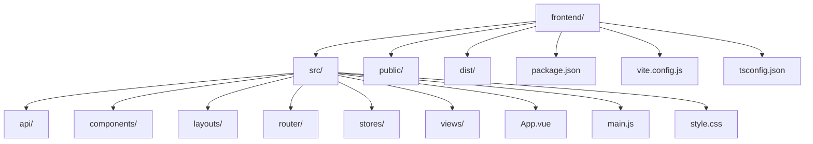
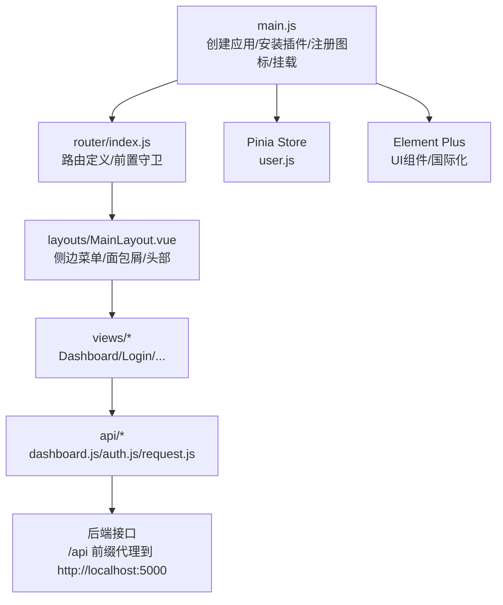
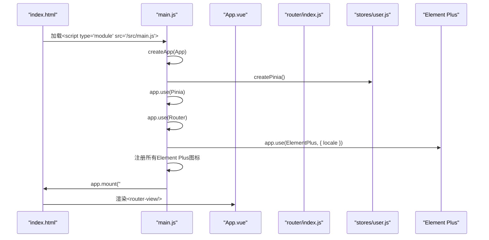
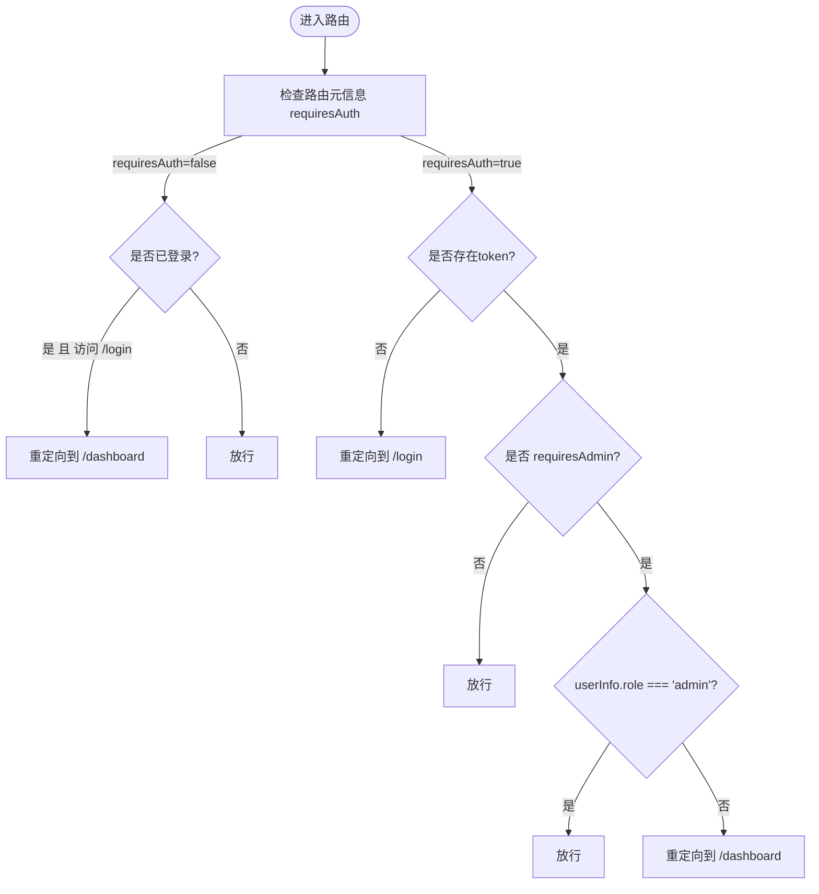
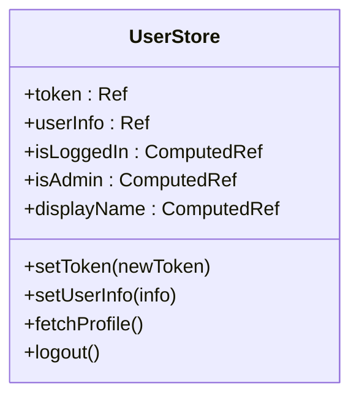
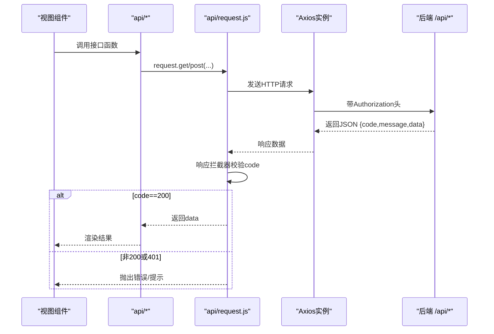
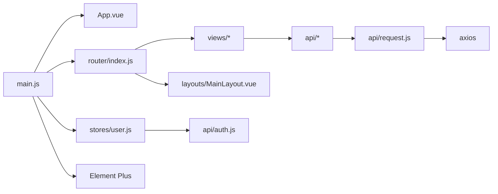

# 应用结构设计

<cite>
**本文档引用的文件**
- [frontend/src/main.js](file://frontend/src/main.js)
- [frontend/src/App.vue](file://frontend/src/App.vue)
- [frontend/package.json](file://frontend/package.json)
- [frontend/vite.config.js](file://frontend/vite.config.js)
- [frontend/tsconfig.json](file://frontend/tsconfig.json)
- [frontend/src/router/index.js](file://frontend/src/router/index.js)
- [frontend/src/stores/user.js](file://frontend/src/stores/user.js)
- [frontend/src/layouts/MainLayout.vue](file://frontend/src/layouts/MainLayout.vue)
- [frontend/src/views/Dashboard.vue](file://frontend/src/views/Dashboard.vue)
- [frontend/index.html](file://frontend/index.html)
- [frontend/src/api/dashboard.js](file://frontend/src/api/dashboard.js)
- [frontend/src/api/auth.js](file://frontend/src/api/auth.js)
- [frontend/src/views/Login.vue](file://frontend/src/views/Login.vue)
- [frontend/src/main.ts](file://frontend/src/main.ts)
- [frontend/src/api/request.js](file://frontend/src/api/request.js)
</cite>

## 目录
1. [简介](#简介)
2. [项目结构](#项目结构)
3. [核心组件](#核心组件)
4. [架构总览](#架构总览)
5. [详细组件分析](#详细组件分析)
6. [依赖关系分析](#依赖关系分析)
7. [性能考虑](#性能考虑)
8. [故障排查指南](#故障排查指南)
9. [结论](#结论)
10. [附录](#附录)

## 简介
本文件为该Vue.js单页应用的结构设计文档，聚焦于前端部分（frontend），系统性阐述应用的整体架构与初始化流程，包括：
- 根组件App.vue的作用与职责
- 入口文件main.js的配置与初始化流程
- TypeScript配置、构建工具设置与开发环境配置
- 项目目录结构、模块导入机制与依赖管理策略
- 应用启动流程、路由守卫与状态管理
- 错误边界处理与性能监控建议

## 项目结构
前端项目采用典型的Vue 3 + Vite + Pinia + Vue Router + Element Plus架构，目录组织清晰，按功能域划分：
- src/api：封装HTTP请求与拦截器
- src/components：可复用组件（示例：HelloWorld.vue、PasswordDisplay.vue）
- src/layouts：布局组件（MainLayout.vue）
- src/router：路由定义与守卫
- src/stores：状态管理（Pinia）
- src/views：页面视图（Dashboard、Login等）
- public：静态资源（index.html等）
- 构建产物dist：生产构建输出

图表来源
- [frontend/package.json:1-24](file://frontend/package.json#L1-L24)
- [frontend/vite.config.js:1-16](file://frontend/vite.config.js#L1-L16)
- [frontend/tsconfig.json:1-27](file://frontend/tsconfig.json#L1-L27)

章节来源
- [frontend/package.json:1-24](file://frontend/package.json#L1-L24)
- [frontend/vite.config.js:1-16](file://frontend/vite.config.js#L1-L16)
- [frontend/tsconfig.json:1-27](file://frontend/tsconfig.json#L1-L27)

## 核心组件
- 根组件App.vue：作为路由出口容器，承载全局样式重置与基础排版。
- 入口文件main.js：创建Vue应用实例，安装插件（Pinia、Router、Element Plus）、注册图标、挂载应用。
- 路由模块router/index.js：定义路由表与全局前置守卫，实现鉴权与权限控制。
- 状态管理stores/user.js：基于Pinia的用户会话与权限状态管理。
- 布局组件layouts/MainLayout.vue：提供侧边菜单、面包屑、头部操作区与导出功能。
- 视图组件views/Dashboard.vue：仪表盘统计与数据展示。
- API层api/request.js：统一Axios实例、请求/响应拦截器与错误处理。

章节来源
- [frontend/src/App.vue:1-18](file://frontend/src/App.vue#L1-L18)
- [frontend/src/main.js:1-23](file://frontend/src/main.js#L1-L23)
- [frontend/src/router/index.js:1-61](file://frontend/src/router/index.js#L1-L61)
- [frontend/src/stores/user.js:1-41](file://frontend/src/stores/user.js#L1-L41)
- [frontend/src/layouts/MainLayout.vue:1-237](file://frontend/src/layouts/MainLayout.vue#L1-L237)
- [frontend/src/views/Dashboard.vue:1-307](file://frontend/src/views/Dashboard.vue#L1-L307)
- [frontend/src/api/request.js:1-54](file://frontend/src/api/request.js#L1-L54)

## 架构总览
应用采用“入口初始化 → 插件安装 → 路由守卫 → 布局渲染 → 视图加载”的线性流程；API层通过Axios拦截器统一处理鉴权与错误。

图表来源
- [frontend/src/main.js:1-23](file://frontend/src/main.js#L1-L23)
- [frontend/src/router/index.js:1-61](file://frontend/src/router/index.js#L1-L61)
- [frontend/src/stores/user.js:1-41](file://frontend/src/stores/user.js#L1-L41)
- [frontend/src/layouts/MainLayout.vue:1-237](file://frontend/src/layouts/MainLayout.vue#L1-L237)
- [frontend/src/views/Dashboard.vue:1-307](file://frontend/src/views/Dashboard.vue#L1-L307)
- [frontend/src/api/dashboard.js:1-6](file://frontend/src/api/dashboard.js#L1-L6)
- [frontend/src/api/auth.js:1-14](file://frontend/src/api/auth.js#L1-L14)
- [frontend/src/api/request.js:1-54](file://frontend/src/api/request.js#L1-L54)
- [frontend/vite.config.js:1-16](file://frontend/vite.config.js#L1-L16)

## 详细组件分析

### 入口与初始化流程（main.js）
- 创建Vue应用实例并引入根组件App.vue
- 安装Pinia、Router、Element Plus（含中文语言包）
- 注册Element Plus全部图标为全局组件
- 将应用挂载至DOM节点#app

图表来源
- [frontend/index.html:1-14](file://frontend/index.html#L1-L14)
- [frontend/src/main.js:1-23](file://frontend/src/main.js#L1-L23)
- [frontend/src/App.vue:1-18](file://frontend/src/App.vue#L1-L18)
- [frontend/src/router/index.js:1-61](file://frontend/src/router/index.js#L1-L61)
- [frontend/src/stores/user.js:1-41](file://frontend/src/stores/user.js#L1-L41)

章节来源
- [frontend/src/main.js:1-23](file://frontend/src/main.js#L1-L23)
- [frontend/index.html:1-14](file://frontend/index.html#L1-L14)

### 根组件App.vue
- 作为路由出口容器，内部仅包含<router-view/>，负责将当前路由匹配的视图渲染到屏幕。
- 在模板外定义全局基础样式（重置margin/padding、设置字体族）。

章节来源
- [frontend/src/App.vue:1-18](file://frontend/src/App.vue#L1-L18)

### 路由与权限控制（router/index.js）
- 定义登录页与主布局下的多级路由，支持懒加载视图组件。
- 全局前置守卫实现：
  - 非需要认证路由（如登录页）：若已登录且访问登录页则重定向至仪表盘；否则放行。
  - 需要认证但未登录：重定向至登录页。
  - 需要管理员权限：校验localStorage中的用户角色，不满足则重定向至仪表盘。
- 使用history模式与createWebHistory。

图表来源
- [frontend/src/router/index.js:35-58](file://frontend/src/router/index.js#L35-L58)

章节来源
- [frontend/src/router/index.js:1-61](file://frontend/src/router/index.js#L1-L61)

### 状态管理（stores/user.js）
- 使用组合式store定义用户token、userInfo、计算属性（是否登录、是否管理员、显示名）。
- 提供setToken、setUserInfo、fetchProfile、logout等方法。
- 与localStorage交互持久化会话信息。

图表来源
- [frontend/src/stores/user.js:1-41](file://frontend/src/stores/user.js#L1-L41)

章节来源
- [frontend/src/stores/user.js:1-41](file://frontend/src/stores/user.js#L1-L41)

### 布局与导航（layouts/MainLayout.vue）
- 侧边菜单：根据当前路由激活对应菜单项，支持折叠与展开。
- 面包屑：根据路由元信息title动态显示。
- 头部操作区：导出Excel、用户下拉菜单（修改密码、退出登录）。
- 权限控制：仅管理员可见“用户管理”菜单项。
- 导出功能：调用export接口生成Excel并触发下载。

章节来源
- [frontend/src/layouts/MainLayout.vue:1-237](file://frontend/src/layouts/MainLayout.vue#L1-L237)

### 视图组件（views/Dashboard.vue）
- 展示统计卡片、环境分布表格、证书到期提醒与最近更新记录。
- 使用API获取统计数据，结合Element Plus的表格、标签、进度条组件进行可视化。
- 支持空态占位与加载状态。

章节来源
- [frontend/src/views/Dashboard.vue:1-307](file://frontend/src/views/Dashboard.vue#L1-L307)

### 登录流程（views/Login.vue）
- 表单校验、提交登录请求、成功后写入token与用户信息、跳转仪表盘。
- 使用Element Plus表单与消息组件提升用户体验。

章节来源
- [frontend/src/views/Login.vue:1-114](file://frontend/src/views/Login.vue#L1-L114)

### API层与拦截器（api/request.js）
- Axios实例：baseURL为'/api'，统一超时与Content-Type。
- 请求拦截器：从localStorage读取token并注入Authorization头。
- 响应拦截器：统一错误码判断、401自动清理本地存储并跳转登录、网络异常提示。
- 子模块：dashboard.js、auth.js分别封装具体接口。

图表来源
- [frontend/src/api/request.js:1-54](file://frontend/src/api/request.js#L1-L54)
- [frontend/src/api/dashboard.js:1-6](file://frontend/src/api/dashboard.js#L1-L6)
- [frontend/src/api/auth.js:1-14](file://frontend/src/api/auth.js#L1-L14)

章节来源
- [frontend/src/api/request.js:1-54](file://frontend/src/api/request.js#L1-L54)
- [frontend/src/api/dashboard.js:1-6](file://frontend/src/api/dashboard.js#L1-L6)
- [frontend/src/api/auth.js:1-14](file://frontend/src/api/auth.js#L1-L14)

### TypeScript与构建配置
- tsconfig.json：ES2023目标、ESNext模块、DOM/DOM.Iterable库、严格模式、bundler解析、Vite类型等。
- package.json：脚本dev/build/preview，依赖vue、vue-router、pinia、element-plus、@element-plus/icons-vue、axios，开发依赖vite与@vitejs/plugin-vue。
- vite.config.js：启用Vue插件、开发服务器端口3000、/api前缀代理至后端5000端口。

章节来源
- [frontend/tsconfig.json:1-27](file://frontend/tsconfig.json#L1-L27)
- [frontend/package.json:1-24](file://frontend/package.json#L1-L24)
- [frontend/vite.config.js:1-16](file://frontend/vite.config.js#L1-L16)

### 模块导入机制与依赖管理
- 按功能域分层导入：views依赖stores与api；layouts依赖stores与api；api依赖request；router依赖views与layouts。
- 依赖管理策略：生产依赖集中在package.json的dependencies中，开发依赖在devDependencies；通过Vite按需打包与Tree Shaking优化。

章节来源
- [frontend/package.json:1-24](file://frontend/package.json#L1-L24)

## 依赖关系分析
- 入口依赖：main.js依赖App.vue、router、stores、Element Plus。
- 路由依赖：router/index.js依赖各view组件与layouts。
- 状态依赖：stores/user.js依赖api/auth.js与localStorage。
- API依赖：api/*依赖api/request.js与后端接口。
- 构建依赖：vite.config.js依赖@vitejs/plugin-vue；tsconfig.json影响类型检查与模块解析。

图表来源
- [frontend/src/main.js:1-23](file://frontend/src/main.js#L1-L23)
- [frontend/src/App.vue:1-18](file://frontend/src/App.vue#L1-L18)
- [frontend/src/router/index.js:1-61](file://frontend/src/router/index.js#L1-L61)
- [frontend/src/stores/user.js:1-41](file://frontend/src/stores/user.js#L1-L41)
- [frontend/src/layouts/MainLayout.vue:1-237](file://frontend/src/layouts/MainLayout.vue#L1-L237)
- [frontend/src/views/Dashboard.vue:1-307](file://frontend/src/views/Dashboard.vue#L1-L307)
- [frontend/src/api/dashboard.js:1-6](file://frontend/src/api/dashboard.js#L1-L6)
- [frontend/src/api/auth.js:1-14](file://frontend/src/api/auth.js#L1-L14)
- [frontend/src/api/request.js:1-54](file://frontend/src/api/request.js#L1-L54)

章节来源
- [frontend/src/main.js:1-23](file://frontend/src/main.js#L1-L23)
- [frontend/src/router/index.js:1-61](file://frontend/src/router/index.js#L1-L61)
- [frontend/src/stores/user.js:1-41](file://frontend/src/stores/user.js#L1-L41)
- [frontend/src/api/request.js:1-54](file://frontend/src/api/request.js#L1-L54)

## 性能考虑
- 路由懒加载：views通过动态导入实现按需加载，减少首屏体积。
- 图标按需注册：仅注册Element Plus图标，避免全量引入。
- Axios拦截器：集中处理鉴权与错误，减少重复逻辑。
- 开发服务器代理：本地联调时避免跨域与反向代理复杂度。
- 建议优化方向：
  - 启用Vite的预构建与依赖预打包
  - 对大表格/列表使用虚拟滚动
  - 对高频接口增加缓存策略
  - 生产构建开启压缩与资源分包

## 故障排查指南
- 登录后无法进入受保护页面
  - 检查localStorage中token与userInfo是否存在
  - 确认路由守卫逻辑与requiresAuth/requireAdmin元信息
- 401未授权
  - 检查请求拦截器是否正确注入Authorization头
  - 确认后端返回的响应码与message格式
- 接口调用失败
  - 查看网络面板与控制台错误
  - 确认/vite.config.js代理配置与后端地址一致
- 导出Excel失败
  - 检查后端导出接口返回的二进制数据与Content-Type
  - 确认浏览器下载行为与Blob对象创建

章节来源
- [frontend/src/router/index.js:35-58](file://frontend/src/router/index.js#L35-L58)
- [frontend/src/api/request.js:13-51](file://frontend/src/api/request.js#L13-L51)
- [frontend/vite.config.js:6-14](file://frontend/vite.config.js#L6-L14)

## 结论
该Vue.js单页应用以清晰的目录结构、模块化的组件与状态管理、完善的路由守卫与API拦截器为基础，实现了从入口初始化到页面渲染的完整链路。通过TypeScript与Vite的现代化配置，兼顾了开发体验与运行性能。后续可在路由懒加载、接口缓存、虚拟滚动与构建优化等方面进一步增强。

## 附录
- 开发命令
  - dev：启动Vite开发服务器
  - build：构建生产包
  - preview：预览生产包
- 关键路径参考
  - 入口与挂载：[frontend/src/main.js:1-23](file://frontend/src/main.js#L1-L23)、[frontend/index.html:1-14](file://frontend/index.html#L1-L14)
  - 路由与守卫：[frontend/src/router/index.js:1-61](file://frontend/src/router/index.js#L1-L61)
  - 状态管理：[frontend/src/stores/user.js:1-41](file://frontend/src/stores/user.js#L1-L41)
  - API拦截器：[frontend/src/api/request.js:1-54](file://frontend/src/api/request.js#L1-L54)
  - TypeScript配置：[frontend/tsconfig.json:1-27](file://frontend/tsconfig.json#L1-L27)
  - 构建配置：[frontend/vite.config.js:1-16](file://frontend/vite.config.js#L1-L16)