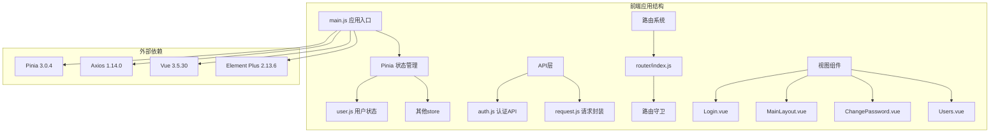
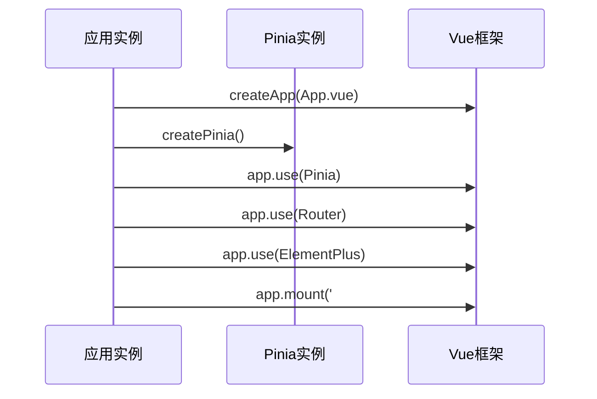
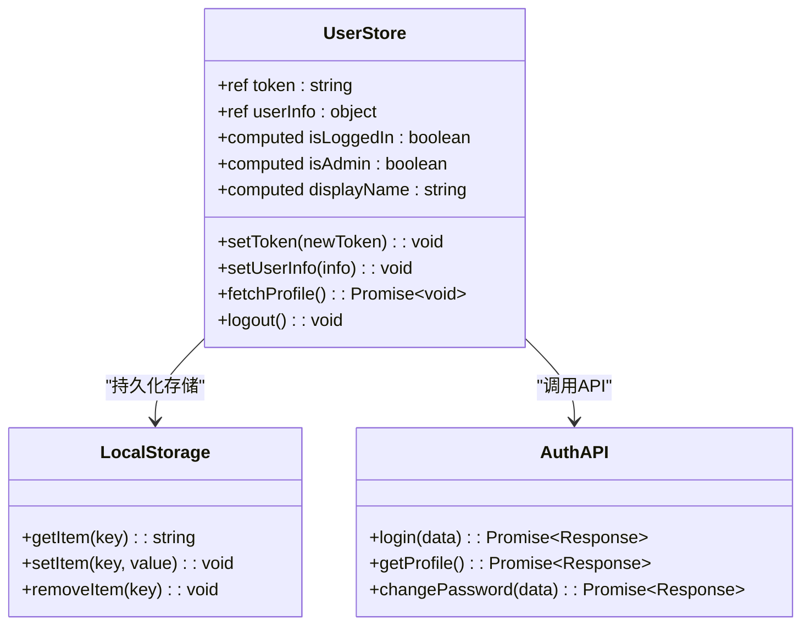
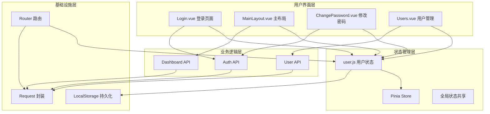
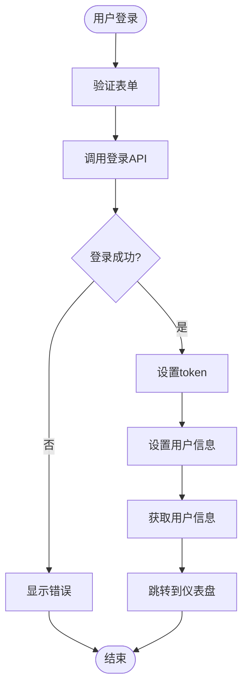
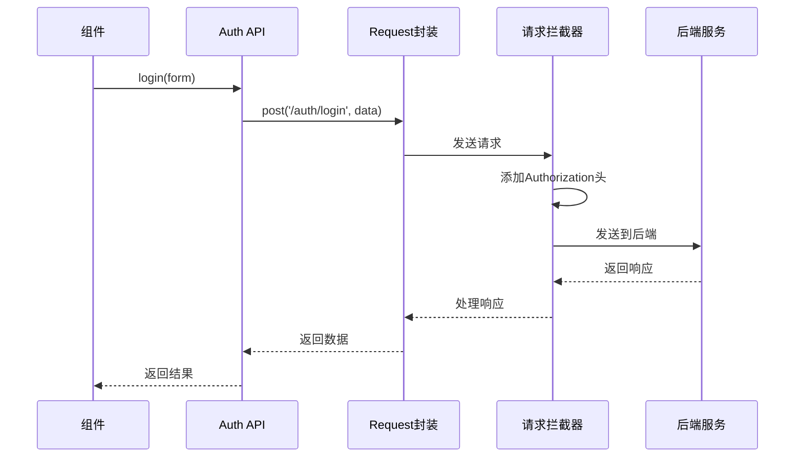
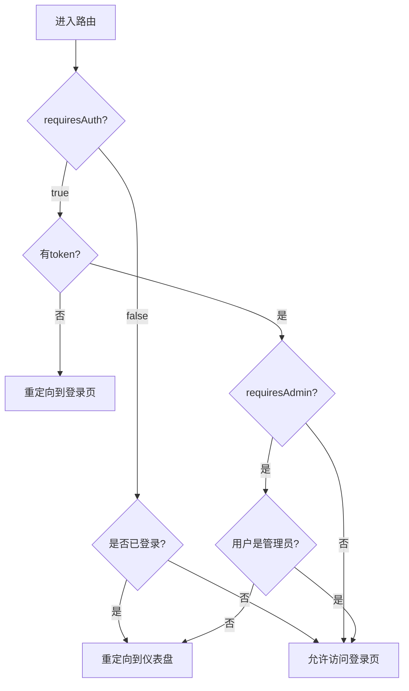
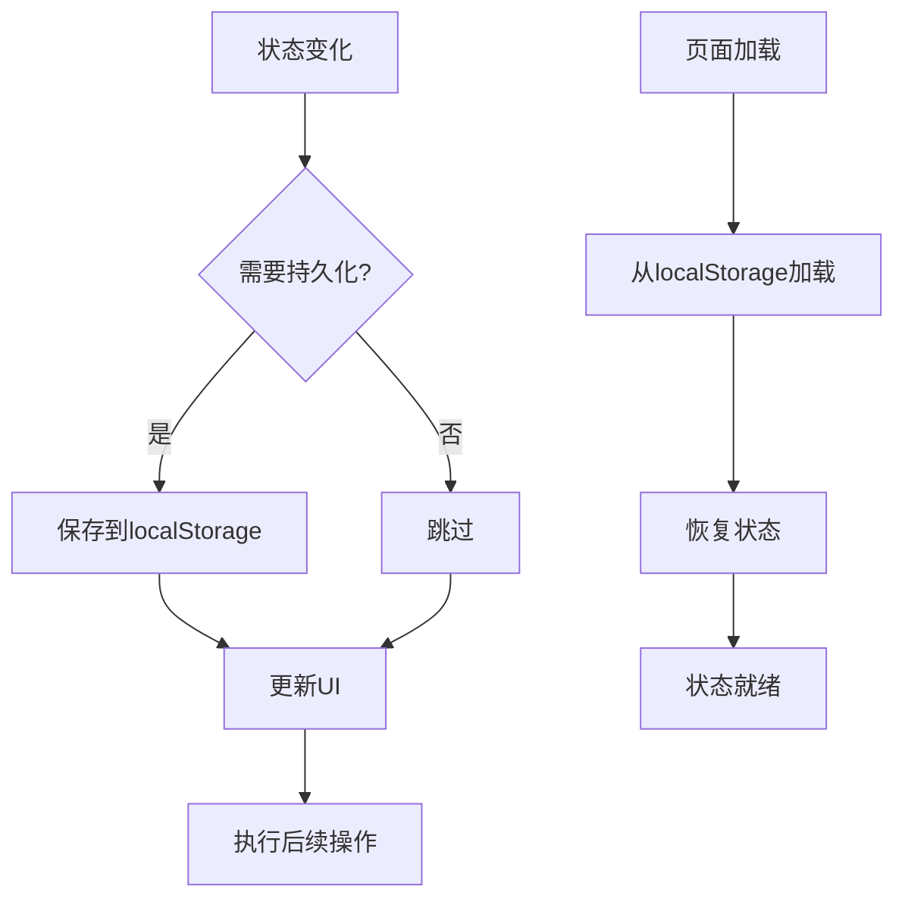
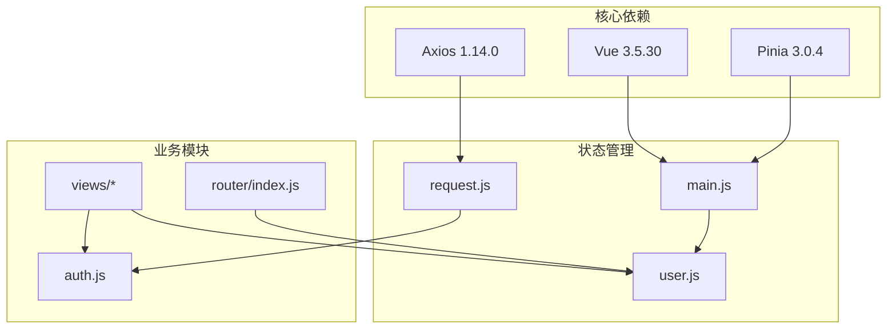

# 状态管理

<cite>
**本文档引用的文件**
- [frontend/src/stores/user.js](file://frontend/src/stores/user.js)
- [frontend/src/main.js](file://frontend/src/main.js)
- [frontend/package.json](file://frontend/package.json)
- [frontend/src/api/auth.js](file://frontend/src/api/auth.js)
- [frontend/src/api/request.js](file://frontend/src/api/request.js)
- [frontend/src/router/index.js](file://frontend/src/router/index.js)
- [frontend/src/views/Login.vue](file://frontend/src/views/Login.vue)
- [frontend/src/layouts/MainLayout.vue](file://frontend/src/layouts/MainLayout.vue)
- [frontend/src/views/ChangePassword.vue](file://frontend/src/views/ChangePassword.vue)
- [frontend/src/views/Users.vue](file://frontend/src/views/Users.vue)
</cite>

## 目录
1. [简介](#简介)
2. [项目结构](#项目结构)
3. [核心组件](#核心组件)
4. [架构概览](#架构概览)
5. [详细组件分析](#详细组件分析)
6. [依赖关系分析](#依赖关系分析)
7. [性能考虑](#性能考虑)
8. [故障排除指南](#故障排除指南)
9. [结论](#结论)

## 简介

本项目采用Pinia作为状态管理库，实现了现代化的Vue 3应用程序状态管理方案。通过组合式API风格的store定义，项目实现了用户状态管理、全局状态共享和状态持久化等功能。本文档将详细介绍Pinia状态管理库的使用和配置，包括store定义、状态定义、action方法和getter计算属性的实现方式。

## 项目结构

项目采用前后端分离架构，前端部分专门负责状态管理逻辑。状态管理相关的文件主要集中在`frontend/src/stores/`目录下，配合API层和路由守卫实现完整的状态管理流程。

**图表来源**
- [frontend/src/main.js:1-23](file://frontend/src/main.js#L1-L23)
- [frontend/src/stores/user.js:1-41](file://frontend/src/stores/user.js#L1-L41)
- [frontend/package.json:11-17](file://frontend/package.json#L11-L17)

**章节来源**
- [frontend/src/main.js:1-23](file://frontend/src/main.js#L1-L23)
- [frontend/package.json:1-24](file://frontend/package.json#L1-L24)

## 核心组件

### Pinia初始化配置

项目在应用入口处初始化Pinia，并将其注册到Vue应用实例中。这是整个状态管理系统的基础配置。

**图表来源**
- [frontend/src/main.js:10-22](file://frontend/src/main.js#L10-L22)

### 用户状态管理Store

用户状态管理是项目的核心store，实现了完整的用户生命周期管理功能。

**图表来源**
- [frontend/src/stores/user.js:5-40](file://frontend/src/stores/user.js#L5-L40)

**章节来源**
- [frontend/src/stores/user.js:1-41](file://frontend/src/stores/user.js#L1-L41)

## 架构概览

项目采用分层架构设计，状态管理贯穿整个应用的数据流。

**图表来源**
- [frontend/src/views/Login.vue:32-36](file://frontend/src/views/Login.vue#L32-L36)
- [frontend/src/layouts/MainLayout.vue:107-112](file://frontend/src/layouts/MainLayout.vue#L107-L112)
- [frontend/src/router/index.js:35-58](file://frontend/src/router/index.js#L35-L58)

## 详细组件分析

### 用户状态管理Store实现

用户状态管理Store是项目状态管理的核心组件，实现了以下关键功能：

#### 状态定义
- **token**: 存储JWT访问令牌
- **userInfo**: 存储用户基本信息

#### Getter计算属性
- **isLoggedIn**: 基于token判断用户是否已登录
- **isAdmin**: 基于用户角色判断是否为管理员
- **displayName**: 返回用户的显示名称或用户名

#### Action方法
- **setToken**: 设置并持久化token
- **setUserInfo**: 设置并持久化用户信息
- **fetchProfile**: 异步获取用户信息
- **logout**: 清除用户状态并退出登录

**图表来源**
- [frontend/src/views/Login.vue:50-66](file://frontend/src/views/Login.vue#L50-L66)
- [frontend/src/stores/user.js:13-30](file://frontend/src/stores/user.js#L13-L30)

**章节来源**
- [frontend/src/stores/user.js:5-40](file://frontend/src/stores/user.js#L5-L40)

### 认证API集成

认证相关的API封装提供了统一的接口访问方式。

#### API方法
- **login**: 用户登录接口
- **getProfile**: 获取用户信息接口  
- **changePassword**: 修改密码接口

#### 请求拦截器
项目通过Axios拦截器实现了自动的认证令牌注入和错误处理。

**图表来源**
- [frontend/src/api/auth.js:3-13](file://frontend/src/api/auth.js#L3-L13)
- [frontend/src/api/request.js:14-23](file://frontend/src/api/request.js#L14-L23)

**章节来源**
- [frontend/src/api/auth.js:1-14](file://frontend/src/api/auth.js#L1-L14)
- [frontend/src/api/request.js:1-54](file://frontend/src/api/request.js#L1-L54)

### 路由守卫与状态同步

项目通过路由守卫实现了基于状态的权限控制和页面访问限制。

#### 路由守卫逻辑
- **requiresAuth**: 控制页面是否需要认证
- **requiresAdmin**: 控制管理员专用页面访问
- **token检查**: 验证用户登录状态

**图表来源**
- [frontend/src/router/index.js:35-58](file://frontend/src/router/index.js#L35-L58)

**章节来源**
- [frontend/src/router/index.js:1-61](file://frontend/src/router/index.js#L1-L61)

### 全局状态共享机制

项目通过多种方式实现状态的全局共享：

#### 在组件中的使用
- **Login.vue**: 用户登录状态管理
- **MainLayout.vue**: 用户信息展示和登出功能
- **ChangePassword.vue**: 密码修改和状态清理
- **Users.vue**: 用户列表管理和当前用户标识

#### 状态共享模式
- **直接导入**: 通过`useUserStore()`直接获取store实例
- **响应式绑定**: 在模板中直接使用store的响应式状态
- **方法调用**: 通过store的方法进行状态更新

**章节来源**
- [frontend/src/views/Login.vue:32-36](file://frontend/src/views/Login.vue#L32-L36)
- [frontend/src/layouts/MainLayout.vue:107-112](file://frontend/src/layouts/MainLayout.vue#L107-L112)
- [frontend/src/views/ChangePassword.vue:56-60](file://frontend/src/views/ChangePassword.vue#L56-L60)
- [frontend/src/views/Users.vue:113-116](file://frontend/src/views/Users.vue#L113-L116)

### 状态持久化策略

项目实现了本地存储的状态持久化机制：

#### 持久化内容
- **token**: JWT访问令牌
- **userInfo**: 用户基本信息

#### 持久化时机
- **登录成功**: 自动保存token和用户信息
- **状态更新**: 任何状态变化时同步到localStorage
- **页面刷新**: 页面加载时从localStorage恢复状态

**图表来源**
- [frontend/src/stores/user.js:6-21](file://frontend/src/stores/user.js#L6-L21)

**章节来源**
- [frontend/src/stores/user.js:6-21](file://frontend/src/stores/user.js#L6-L21)

## 依赖关系分析

项目的状态管理依赖关系清晰明确，各组件职责分工明确。

**图表来源**
- [frontend/package.json:11-17](file://frontend/package.json#L11-L17)
- [frontend/src/main.js:1-23](file://frontend/src/main.js#L1-L23)

**章节来源**
- [frontend/package.json:1-24](file://frontend/package.json#L1-L24)

## 性能考虑

### 状态更新优化
- **响应式更新**: 使用Vue的响应式系统确保状态变化时UI自动更新
- **计算属性缓存**: 使用computed属性避免重复计算
- **异步操作处理**: 通过async/await处理异步状态更新

### 内存管理
- **状态清理**: 在用户登出时清除localStorage中的敏感信息
- **组件卸载**: 确保组件销毁时不会产生内存泄漏

### 网络优化
- **请求拦截**: 统一添加认证头，避免重复代码
- **错误处理**: 集中处理网络错误，提升用户体验

## 故障排除指南

### 常见问题及解决方案

#### 登录状态异常
**问题**: 用户已登录但页面显示未登录
**原因**: localStorage中的token过期或损坏
**解决**: 清除localStorage中的token和userInfo，重新登录

#### 权限访问受限
**问题**: 管理员页面无法访问
**原因**: 用户角色不是admin或token验证失败
**解决**: 检查用户角色信息，必要时重新登录

#### 状态不同步
**问题**: 页面刷新后状态丢失
**原因**: localStorage持久化失败
**解决**: 检查浏览器的localStorage功能，确保可用性

#### API调用失败
**问题**: 用户信息获取失败
**原因**: 网络问题或后端服务异常
**解决**: 检查网络连接，查看控制台错误信息

**章节来源**
- [frontend/src/api/request.js:25-51](file://frontend/src/api/request.js#L25-L51)
- [frontend/src/stores/user.js:23-30](file://frontend/src/stores/user.js#L23-L30)

## 结论

本项目通过Pinia实现了现代化的状态管理方案，具有以下特点：

### 技术优势
- **现代化API**: 采用Vue 3组合式API风格，代码更简洁易维护
- **类型安全**: 支持TypeScript，提供更好的开发体验
- **开发工具**: 完善的调试工具支持，便于开发和问题排查
- **性能优化**: 响应式系统和计算属性优化，提升运行效率

### 最佳实践
- **单一职责**: 每个store专注于特定领域的状态管理
- **状态持久化**: 合理使用localStorage实现状态持久化
- **错误处理**: 统一的错误处理机制，提升用户体验
- **权限控制**: 基于路由守卫的权限控制，确保安全性

### 扩展建议
- **模块化**: 可以按功能模块拆分store，提升代码组织性
- **中间件**: 可以添加状态变更日志中间件，便于调试
- **测试**: 为store添加单元测试，确保状态管理的可靠性

通过合理的状态管理设计，项目实现了用户状态的有效管理、全局状态的共享以及状态的持久化存储，为构建复杂的Vue 3应用奠定了坚实的基础。