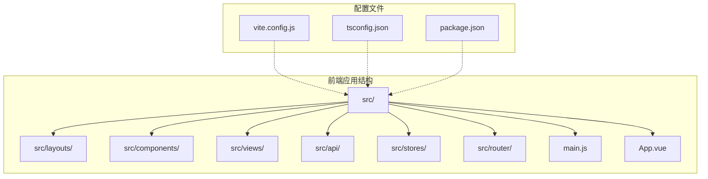
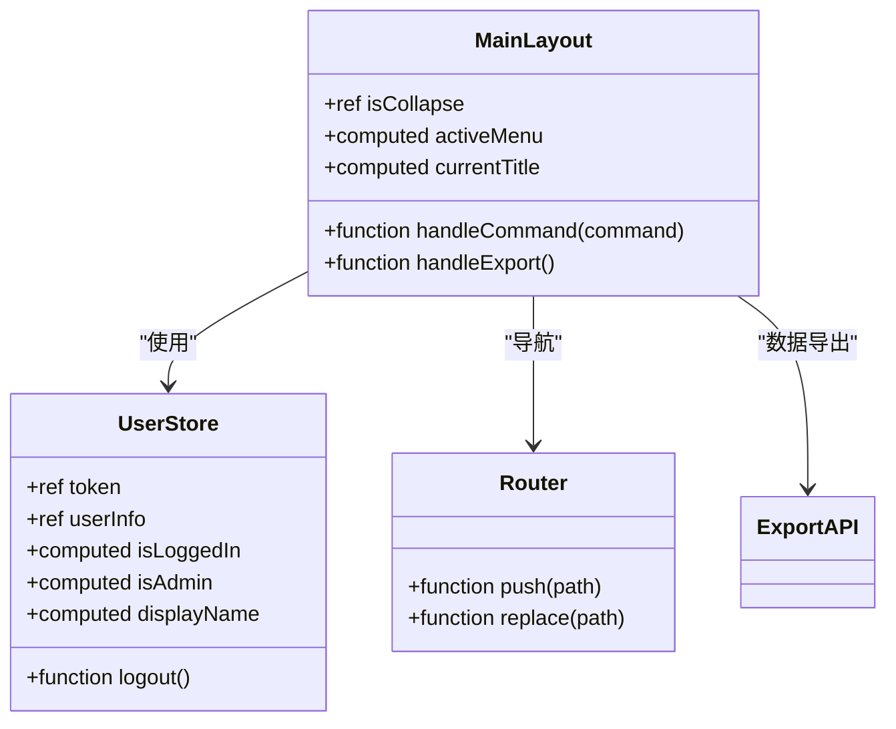
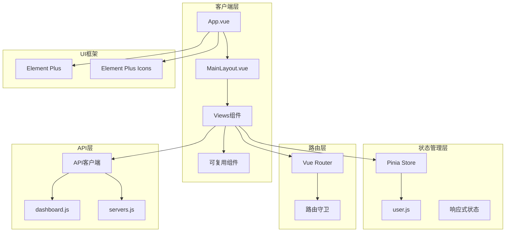
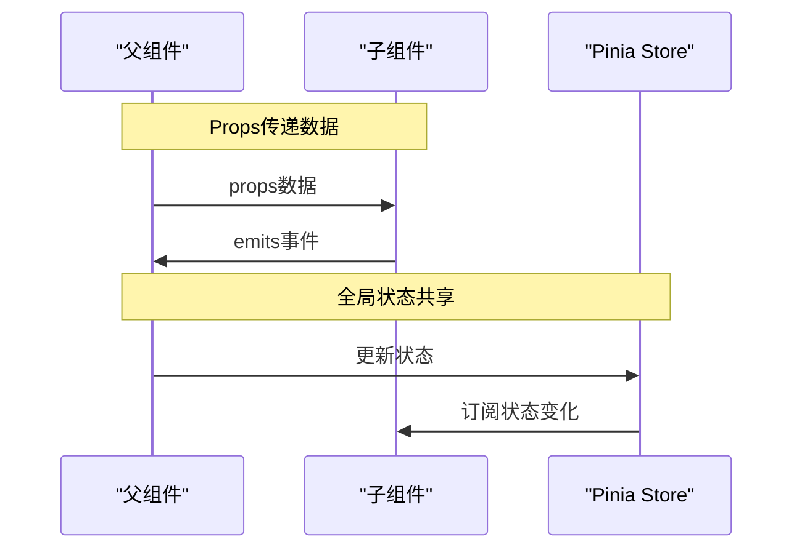
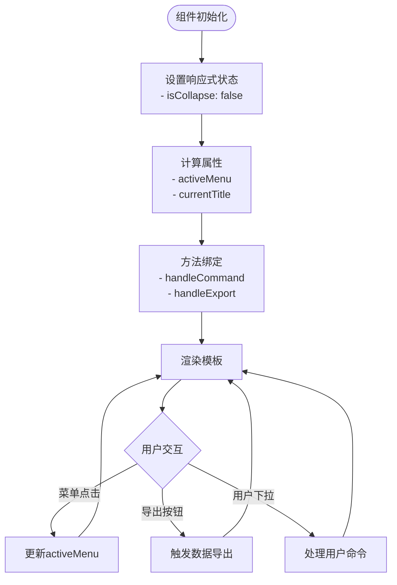
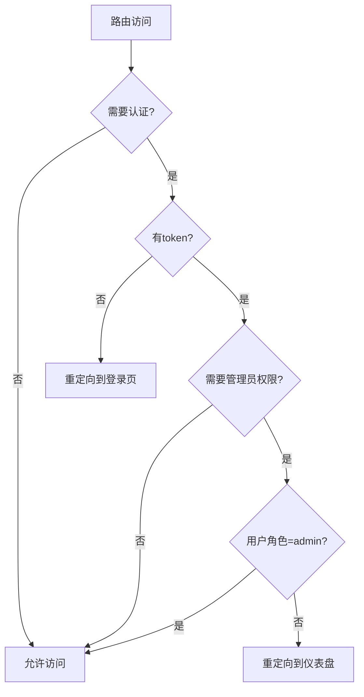
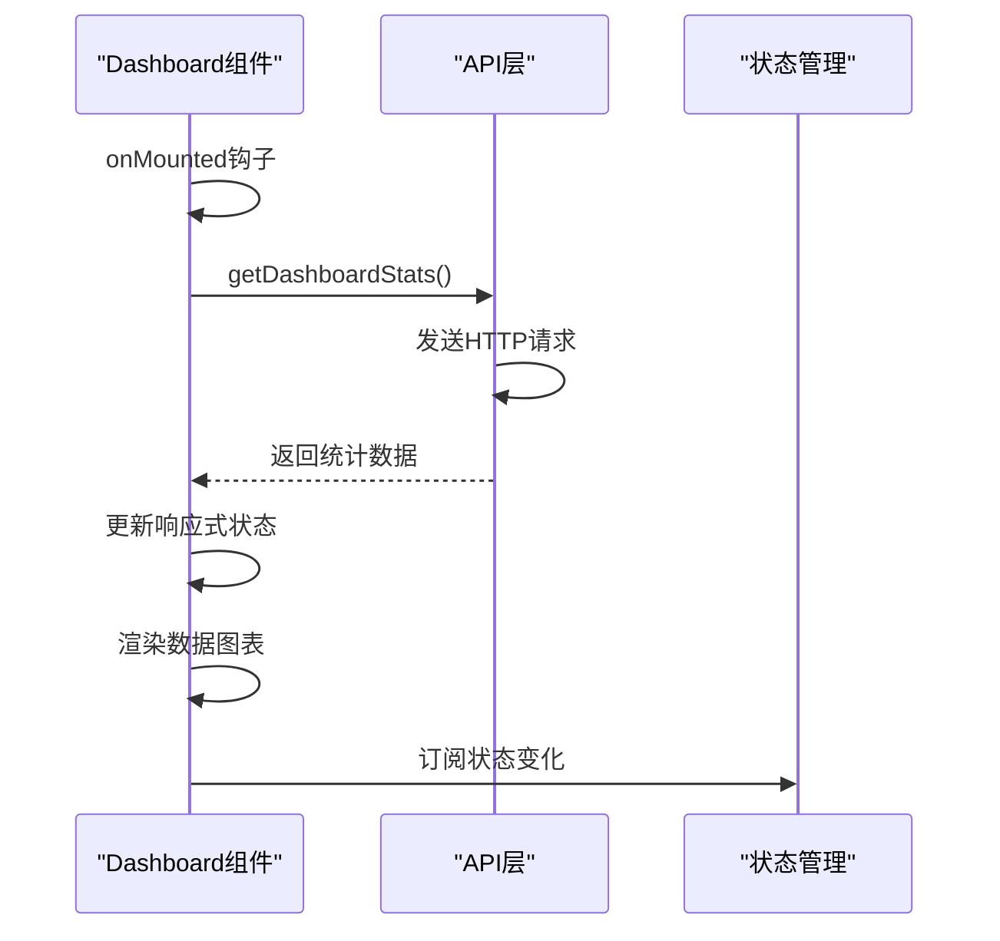
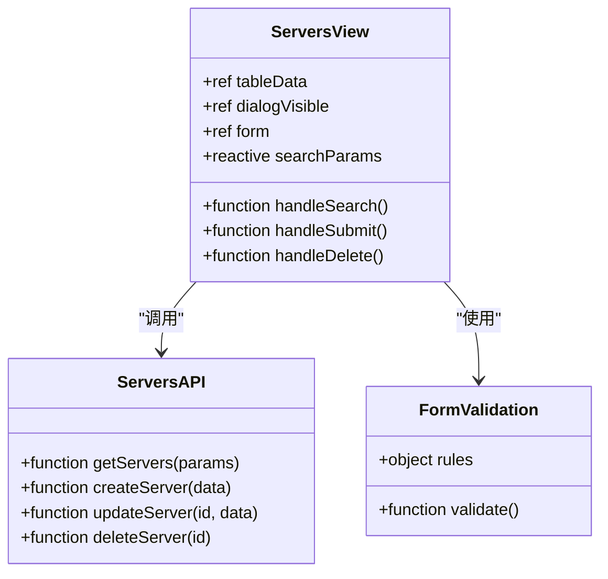
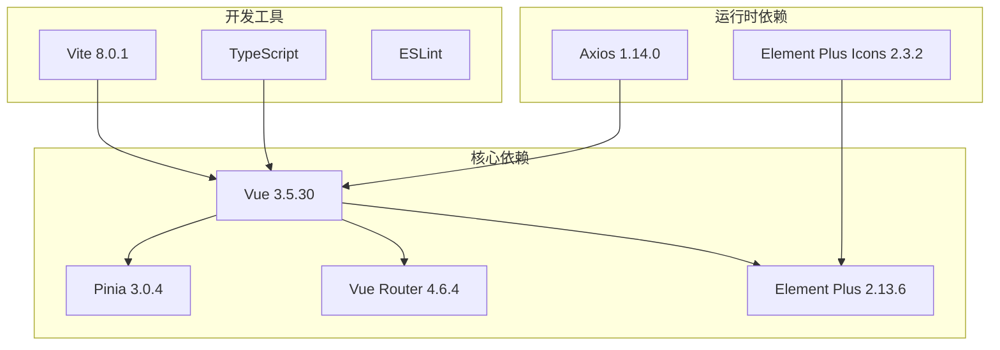
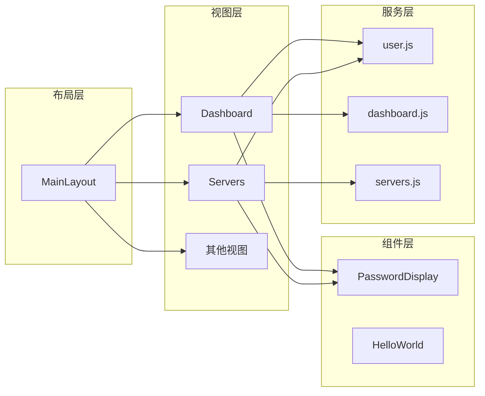

# 组件设计规范

<cite>
**本文档引用的文件**
- [MainLayout.vue](file://frontend/src/layouts/MainLayout.vue)
- [HelloWorld.vue](file://frontend/src/components/HelloWorld.vue)
- [PasswordDisplay.vue](file://frontend/src/components/PasswordDisplay.vue)
- [App.vue](file://frontend/src/App.vue)
- [main.js](file://frontend/src/main.js)
- [router/index.js](file://frontend/src/router/index.js)
- [stores/user.js](file://frontend/src/stores/user.js)
- [views/Dashboard.vue](file://frontend/src/views/Dashboard.vue)
- [views/Servers.vue](file://frontend/src/views/Servers.vue)
- [api/dashboard.js](file://frontend/src/api/dashboard.js)
- [api/servers.js](file://frontend/src/api/servers.js)
- [vite.config.js](file://frontend/vite.config.js)
- [tsconfig.json](file://frontend/tsconfig.json)
- [package.json](file://frontend/package.json)
</cite>

## 目录
1. [简介](#简介)
2. [项目结构](#项目结构)
3. [核心组件](#核心组件)
4. [架构概览](#架构概览)
5. [详细组件分析](#详细组件分析)
6. [依赖关系分析](#依赖关系分析)
7. [性能考虑](#性能考虑)
8. [故障排除指南](#故障排除指南)
9. [结论](#结论)

## 简介

本组件设计规范文档旨在为Vue.js组件开发提供统一的标准和最佳实践指导。该运维管理平台采用现代化的前端技术栈，包括Vue 3、Element Plus、Pinia状态管理等，构建了一个功能完整的运维管理系统。

本规范涵盖组件命名规范、props定义、事件处理、插槽使用、布局组件设计理念、可复用组件开发模式、组件间通信机制、组件测试策略、文档编写规范、版本管理以及性能优化技巧等内容。

## 项目结构

该项目采用基于功能模块的组织方式，主要目录结构如下：



**图表来源**
- [main.js:1-23](file://frontend/src/main.js#L1-L23)
- [router/index.js:1-61](file://frontend/src/router/index.js#L1-L61)

**章节来源**
- [main.js:1-23](file://frontend/src/main.js#L1-L23)
- [router/index.js:1-61](file://frontend/src/router/index.js#L1-L61)

## 核心组件

### 布局组件 MainLayout

MainLayout是整个应用的核心布局组件，负责提供统一的导航界面和内容区域。其设计理念体现了响应式设计和用户体验优先的原则。

#### 核心特性

1. **响应式侧边栏**：支持折叠/展开功能，根据屏幕宽度自动调整布局
2. **动态面包屑导航**：根据当前路由动态显示页面标题
3. **用户管理功能**：集成用户信息展示、密码修改和登出功能
4. **数据导出功能**：提供Excel数据导出能力

#### 组件架构



**图表来源**
- [MainLayout.vue:102-155](file://frontend/src/layouts/MainLayout.vue#L102-L155)
- [stores/user.js:1-41](file://frontend/src/stores/user.js#L1-L41)

**章节来源**
- [MainLayout.vue:1-237](file://frontend/src/layouts/MainLayout.vue#L1-L237)
- [stores/user.js:1-41](file://frontend/src/stores/user.js#L1-L41)

### 可复用组件

#### PasswordDisplay 组件

PasswordDisplay是一个专门用于安全显示密码的组件，提供了密码显示/隐藏切换和一键复制功能。

**设计特点**：
- 使用受控组件模式管理状态
- 实现了原生clipboard API的降级方案
- 提供了友好的用户交互反馈

**章节来源**
- [PasswordDisplay.vue:1-85](file://frontend/src/components/PasswordDisplay.vue#L1-L85)

#### HelloWorld 组件

HelloWorld作为示例组件，展示了基础的Vue 3 Composition API使用方式。

**章节来源**
- [HelloWorld.vue:1-94](file://frontend/src/components/HelloWorld.vue#L1-L94)

## 架构概览

### 应用架构图



**图表来源**
- [main.js:1-23](file://frontend/src/main.js#L1-L23)
- [router/index.js:1-61](file://frontend/src/router/index.js#L1-L61)
- [stores/user.js:1-41](file://frontend/src/stores/user.js#L1-L41)

### 组件通信机制

#### 父子组件通信



**图表来源**
- [PasswordDisplay.vue:16-46](file://frontend/src/components/PasswordDisplay.vue#L16-L46)
- [stores/user.js:1-41](file://frontend/src/stores/user.js#L1-L41)

## 详细组件分析

### MainLayout 组件深度分析

#### 功能模块分解

MainLayout组件包含以下主要功能模块：

1. **左侧菜单系统**：动态路由生成，支持权限控制
2. **顶部导航栏**：用户信息展示，功能按钮集合
3. **主内容区域**：通过router-view渲染子视图
4. **面包屑导航**：基于路由元信息的动态标题

#### 状态管理



**图表来源**
- [MainLayout.vue:110-155](file://frontend/src/layouts/MainLayout.vue#L110-L155)

#### 权限控制机制



**图表来源**
- [router/index.js:35-58](file://frontend/src/router/index.js#L35-L58)

**章节来源**
- [MainLayout.vue:1-237](file://frontend/src/layouts/MainLayout.vue#L1-L237)
- [router/index.js:1-61](file://frontend/src/router/index.js#L1-L61)

### 视图组件分析

#### Dashboard 视图组件

Dashboard组件展示了复杂的数据可视化和表格展示功能：

**核心功能**：
- 统计卡片展示关键指标
- 环境分布统计图表
- 证书到期提醒列表
- 最近更新记录展示

**数据流处理**：



**图表来源**
- [views/Dashboard.vue:155-167](file://frontend/src/views/Dashboard.vue#L155-L167)
- [api/dashboard.js:1-6](file://frontend/src/api/dashboard.js#L1-L6)

**章节来源**
- [views/Dashboard.vue:1-307](file://frontend/src/views/Dashboard.vue#L1-L307)
- [api/dashboard.js:1-6](file://frontend/src/api/dashboard.js#L1-L6)

#### Servers 视图组件

Servers组件实现了完整的CRUD操作功能：

**功能特性**：
- 高级搜索过滤
- 表格数据展示
- 弹窗表单编辑
- 数据验证和错误处理

**组件间通信**：



**图表来源**
- [views/Servers.vue:157-281](file://frontend/src/views/Servers.vue#L157-L281)
- [api/servers.js:1-26](file://frontend/src/api/servers.js#L1-L26)

**章节来源**
- [views/Servers.vue:1-306](file://frontend/src/views/Servers.vue#L1-L306)
- [api/servers.js:1-26](file://frontend/src/api/servers.js#L1-L26)

## 依赖关系分析

### 技术栈依赖



**图表来源**
- [package.json:11-22](file://frontend/package.json#L11-L22)

### 组件依赖关系



**图表来源**
- [MainLayout.vue:107-108](file://frontend/src/layouts/MainLayout.vue#L107-L108)
- [views/Dashboard.vue:139-141](file://frontend/src/views/Dashboard.vue#L139-L141)
- [views/Servers.vue:158-162](file://frontend/src/views/Servers.vue#L158-L162)

**章节来源**
- [package.json:1-24](file://frontend/package.json#L1-L24)

## 性能考虑

### 组件性能优化策略

#### 1. 懒加载和代码分割

项目采用动态导入实现组件懒加载：

```javascript
// 路由懒加载示例
{
  path: '/dashboard',
  name: 'Dashboard',
  component: () => import('../views/Dashboard.vue'),
  meta: { title: '仪表盘' }
}
```

#### 2. 响应式数据优化

使用`ref`和`reactive`进行细粒度状态管理，避免不必要的重渲染：

```javascript
const stats = reactive({
  counts: {},
  env_distribution: [],
  recent_certs: [],
  recent_records: []
})
```

#### 3. 计算属性缓存

利用`computed`属性的缓存机制减少重复计算：

```javascript
const totalServers = computed(() => {
  return stats.env_distribution?.reduce((sum, item) => sum + item.count, 0) || 0
})
```

#### 4. 生命周期优化

在合适的生命周期钩子中执行操作：

```javascript
onMounted(() => {
  fetchData()
})

// 在组件卸载时清理资源
onUnmounted(() => {
  // 清理定时器、事件监听器等
})
```

### 内存管理最佳实践

#### 1. 组件销毁时的资源清理

```javascript
onUnmounted(() => {
  // 清理定时器
  if (timer) {
    clearInterval(timer)
  }
  
  // 解绑事件监听器
  document.removeEventListener('click', handleClick)
})
```

#### 2. 大数据集处理

对于大量数据的表格组件，建议实现虚拟滚动或分页加载：

```javascript
// 分页参数
const pagination = reactive({
  page: 1,
  pageSize: 50,
  total: 0
})
```

#### 3. 图片和资源优化

使用适当的图片格式和尺寸，避免内存泄漏：

```html

```

## 故障排除指南

### 常见问题及解决方案

#### 1. 组件无法正常渲染

**症状**：组件空白或报错
**排查步骤**：
1. 检查组件导入路径是否正确
2. 验证组件导出语法
3. 确认模板语法正确性

**章节来源**
- [HelloWorld.vue:1-94](file://frontend/src/components/HelloWorld.vue#L1-L94)

#### 2. 路由跳转失效

**症状**：点击菜单无反应
**排查步骤**：
1. 检查路由配置中的`router`属性
2. 验证菜单项的`index`值与路由路径匹配
3. 确认`router.push`调用正确

**章节来源**
- [MainLayout.vue:18-53](file://frontend/src/layouts/MainLayout.vue#L18-L53)

#### 3. 状态不同步问题

**症状**：组件状态不一致
**排查步骤**：
1. 检查Pinia store的响应式状态
2. 验证组件中的状态订阅
3. 确认状态更新的时机

**章节来源**
- [stores/user.js:1-41](file://frontend/src/stores/user.js#L1-L41)

#### 4. API请求失败

**症状**：数据加载失败
**排查步骤**：
1. 检查网络代理配置
2. 验证API端点地址
3. 确认请求头和认证信息

**章节来源**
- [vite.config.js:8-14](file://frontend/vite.config.js#L8-L14)

## 结论

本组件设计规范文档总结了运维管理平台中Vue.js组件开发的最佳实践。通过遵循这些规范，可以确保组件的一致性、可维护性和性能表现。

### 关键要点回顾

1. **组件设计原则**：单一职责、可复用性、可测试性
2. **状态管理**：合理使用Composition API和Pinia
3. **路由设计**：清晰的路由结构和权限控制
4. **性能优化**：懒加载、响应式优化、内存管理
5. **错误处理**：完善的异常处理和用户反馈机制

### 未来改进方向

1. **单元测试覆盖**：增加组件的单元测试覆盖率
2. **TypeScript集成**：逐步迁移到TypeScript以获得更好的类型安全
3. **组件文档**：为每个组件编写详细的API文档
4. **性能监控**：集成性能监控工具跟踪组件性能指标

通过持续遵循和改进这些规范，可以构建出更加健壮、可维护和高性能的Vue.js应用程序。