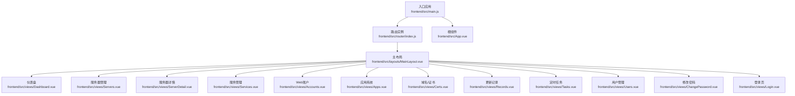
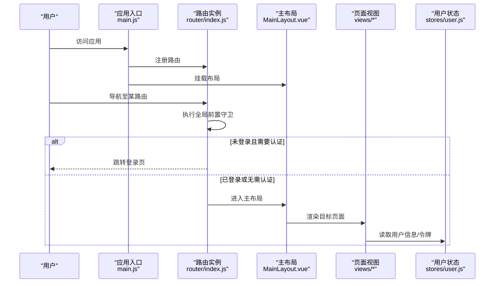
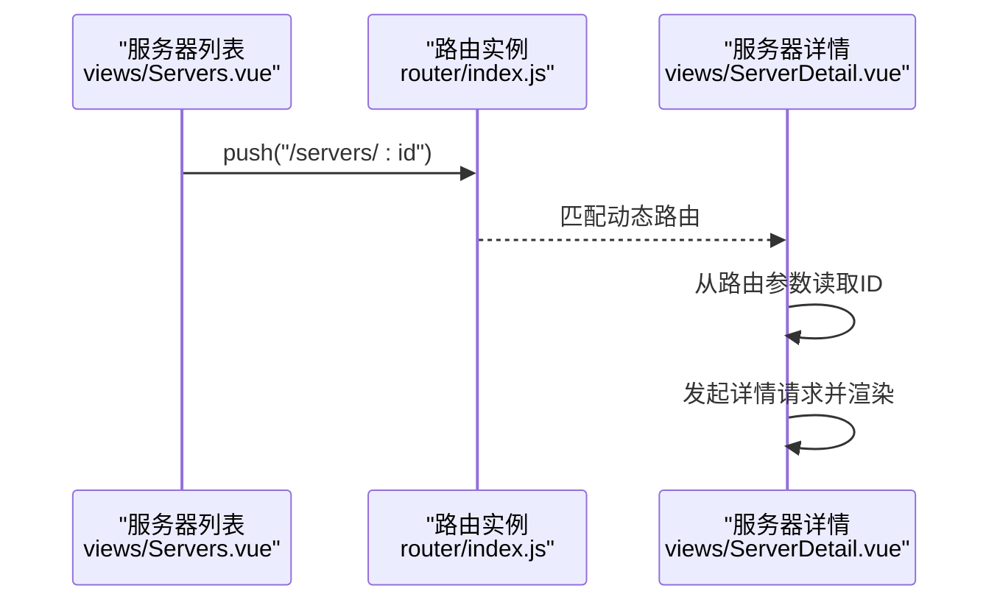
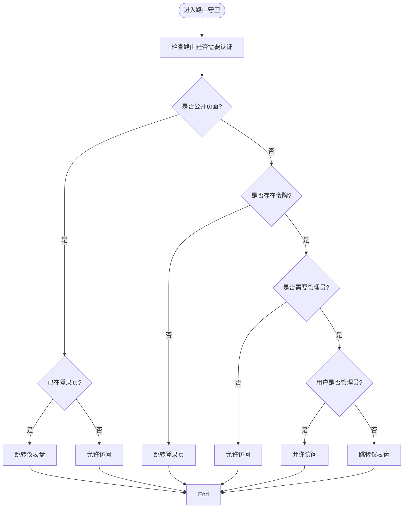
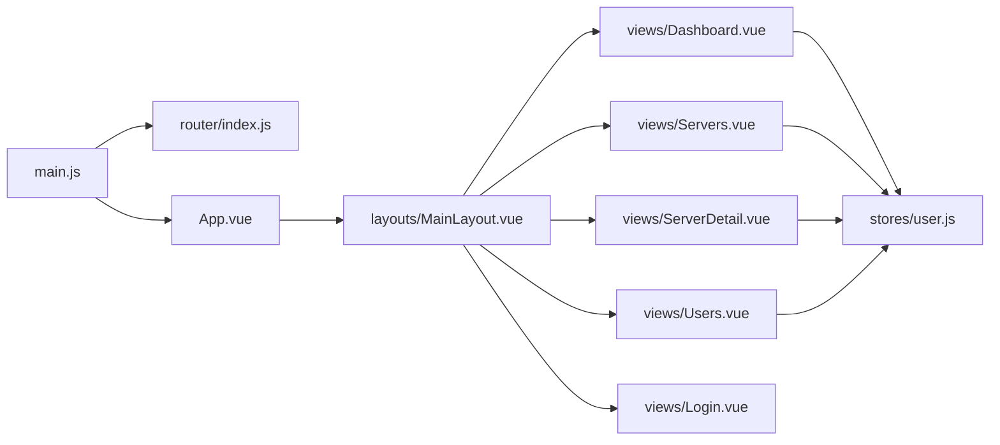

# 路由管理

<cite>
**本文引用的文件**   
- [frontend/src/router/index.js](file://frontend/src/router/index.js)
- [frontend/src/main.js](file://frontend/src/main.js)
- [frontend/src/App.vue](file://frontend/src/App.vue)
- [frontend/src/layouts/MainLayout.vue](file://frontend/src/layouts/MainLayout.vue)
- [frontend/src/views/Login.vue](file://frontend/src/views/Login.vue)
- [frontend/src/views/Servers.vue](file://frontend/src/views/Servers.vue)
- [frontend/src/views/ServerDetail.vue](file://frontend/src/views/ServerDetail.vue)
- [frontend/src/views/Users.vue](file://frontend/src/views/Users.vue)
- [frontend/src/stores/user.js](file://frontend/src/stores/user.js)
- [frontend/src/api/auth.js](file://frontend/src/api/auth.js)
- [frontend/src/api/servers.js](file://frontend/src/api/servers.js)
- [frontend/src/api/users.js](file://frontend/src/api/users.js)
- [frontend/package.json](file://frontend/package.json)
- [frontend/vite.config.js](file://frontend/vite.config.js)
</cite>

## 目录
1. [简介](#简介)
2. [项目结构](#项目结构)
3. [核心组件](#核心组件)
4. [架构总览](#架构总览)
5. [详细组件分析](#详细组件分析)
6. [依赖分析](#依赖分析)
7. [性能考虑](#性能考虑)
8. [故障排查指南](#故障排查指南)
9. [结论](#结论)
10. [附录](#附录)

## 简介
本文件系统性梳理前端路由管理的配置与实践，围绕 Vue Router 的路由定义、嵌套路由、动态路由与参数传递、路由守卫与权限控制、懒加载与导航优化、路由元信息与面包屑/标题管理等主题展开。结合项目现有代码，给出可落地的实现方案与最佳实践建议。

## 项目结构
前端采用单页应用架构，路由通过 Vue Router 定义，主布局与页面视图分离，配合 Pinia 状态管理与 Element Plus 组件库完成权限控制、面包屑与页面标题展示。

图表来源
- [frontend/src/main.js:1-23](file://frontend/src/main.js#L1-L23)
- [frontend/src/router/index.js:1-61](file://frontend/src/router/index.js#L1-L61)
- [frontend/src/App.vue:1-18](file://frontend/src/App.vue#L1-L18)
- [frontend/src/layouts/MainLayout.vue:1-237](file://frontend/src/layouts/MainLayout.vue#L1-L237)

章节来源
- [frontend/src/main.js:1-23](file://frontend/src/main.js#L1-L23)
- [frontend/src/router/index.js:1-61](file://frontend/src/router/index.js#L1-L61)
- [frontend/src/App.vue:1-18](file://frontend/src/App.vue#L1-L18)

## 核心组件
- 路由定义与懒加载：在路由表中使用函数式导入实现按需加载，减少首屏体积。
- 嵌套路由：根路径指向主布局，子路由作为布局的 children，实现统一布局下的多页面切换。
- 动态路由与参数传递：通过路径参数在详情页接收并使用，如服务器详情路由。
- 路由守卫：全局前置守卫实现登录态与权限校验，并处理登录页特殊逻辑。
- 元信息与面包屑/标题：通过路由 meta 配置页面标题；主布局中根据当前路由 meta.title 渲染面包屑。
- 权限模型：基于用户角色（管理员/操作员/只读）与 requiresAdmin 元信息进行访问控制。

章节来源
- [frontend/src/router/index.js:3-28](file://frontend/src/router/index.js#L3-L28)
- [frontend/src/router/index.js:35-58](file://frontend/src/router/index.js#L35-L58)
- [frontend/src/layouts/MainLayout.vue:115-122](file://frontend/src/layouts/MainLayout.vue#L115-L122)
- [frontend/src/views/ServerDetail.vue:81-102](file://frontend/src/views/ServerDetail.vue#L81-L102)

## 架构总览
下图展示了从应用启动到路由导航的关键流程，包括路由注册、守卫执行、页面渲染与状态管理。

图表来源
- [frontend/src/main.js:10-15](file://frontend/src/main.js#L10-L15)
- [frontend/src/router/index.js:35-58](file://frontend/src/router/index.js#L35-L58)
- [frontend/src/layouts/MainLayout.vue:102-122](file://frontend/src/layouts/MainLayout.vue#L102-L122)
- [frontend/src/stores/user.js:5-40](file://frontend/src/stores/user.js#L5-L40)

## 详细组件分析

### 路由定义与嵌套路由
- 根路径指向主布局组件，内部通过 children 定义多个子路由，形成统一布局下的多页面。
- 子路由均采用懒加载导入，提升首屏性能。
- 根路径设置 redirect，访问根路径时自动跳转到仪表盘。

章节来源
- [frontend/src/router/index.js:3-28](file://frontend/src/router/index.js#L3-L28)

### 动态路由与参数传递
- 服务器详情路由使用动态段，页面通过路由参数读取 ID 并发起详情请求。
- 列表页点击“查看”按钮，使用路由 push 导航到详情页并携带 ID。

图表来源
- [frontend/src/views/Servers.vue:240](file://frontend/src/views/Servers.vue#L240)
- [frontend/src/views/ServerDetail.vue:81-102](file://frontend/src/views/ServerDetail.vue#L81-L102)

章节来源
- [frontend/src/views/Servers.vue:240](file://frontend/src/views/Servers.vue#L240)
- [frontend/src/views/ServerDetail.vue:81-102](file://frontend/src/views/ServerDetail.vue#L81-L102)

### 路由守卫与权限控制
- 登录页元信息标记为无需认证，若已登录访问登录页则重定向到仪表盘。
- 未携带令牌时，非登录页统一跳转登录页。
- 需要管理员权限的页面通过 requiresAdmin 元信息与本地存储中的用户角色共同判断。
- 登录成功后写入令牌与用户信息，后续守卫放行。

图表来源
- [frontend/src/router/index.js:35-58](file://frontend/src/router/index.js#L35-L58)
- [frontend/src/stores/user.js:5-40](file://frontend/src/stores/user.js#L5-L40)

章节来源
- [frontend/src/router/index.js:35-58](file://frontend/src/router/index.js#L35-L58)
- [frontend/src/stores/user.js:5-40](file://frontend/src/stores/user.js#L5-L40)

### 面包屑导航与页面标题
- 页面标题：主布局通过当前路由 meta.title 动态渲染顶部标题。
- 面包屑：主布局中使用 Element Plus 面包屑组件，结合当前路由 meta.title 展示层级路径。
- 服务器详情页自定义面包屑，包含返回上一页的操作。

章节来源
- [frontend/src/layouts/MainLayout.vue:115-122](file://frontend/src/layouts/MainLayout.vue#L115-L122)
- [frontend/src/views/ServerDetail.vue:4-16](file://frontend/src/views/ServerDetail.vue#L4-L16)

### 用户管理与权限页面
- 用户管理页面仅管理员可见，菜单项根据用户状态动态显示。
- 用户列表支持新增、编辑、删除、重置密码等操作，部分操作对当前登录用户有限制。

章节来源
- [frontend/src/layouts/MainLayout.vue:50-53](file://frontend/src/layouts/MainLayout.vue#L50-L53)
- [frontend/src/views/Users.vue:128-263](file://frontend/src/views/Users.vue#L128-L263)

### 登录流程与令牌持久化
- 登录页提交凭据后调用登录接口，成功后写入令牌与用户信息，再跳转仪表盘。
- 用户状态通过 Pinia Store 管理，同时写入本地存储以保证刷新后仍可识别登录态。

章节来源
- [frontend/src/views/Login.vue:50-66](file://frontend/src/views/Login.vue#L50-L66)
- [frontend/src/stores/user.js:13-21](file://frontend/src/stores/user.js#L13-L21)

### API 交互与后端对接
- 各页面通过统一的请求封装模块与后端交互，路由层不直接处理业务逻辑。
- 服务器详情页在 mounted 生命周期中根据路由参数发起请求，确保数据与路由一致。

章节来源
- [frontend/src/api/auth.js:1-14](file://frontend/src/api/auth.js#L1-L14)
- [frontend/src/api/servers.js:1-26](file://frontend/src/api/servers.js#L1-L26)
- [frontend/src/api/users.js:1-22](file://frontend/src/api/users.js#L1-L22)
- [frontend/src/views/ServerDetail.vue:86-102](file://frontend/src/views/ServerDetail.vue#L86-L102)

## 依赖分析
- 路由依赖：应用入口注册路由插件，根组件渲染 router-view，布局组件承载子路由视图。
- 状态依赖：用户状态 Store 提供登录态与角色信息，被守卫与视图组件使用。
- 组件依赖：主布局集成菜单、面包屑、头部操作等，子路由视图独立负责具体业务。

图表来源
- [frontend/src/main.js:10-15](file://frontend/src/main.js#L10-L15)
- [frontend/src/router/index.js:30-33](file://frontend/src/router/index.js#L30-L33)
- [frontend/src/App.vue:1-3](file://frontend/src/App.vue#L1-L3)
- [frontend/src/layouts/MainLayout.vue:102-122](file://frontend/src/layouts/MainLayout.vue#L102-L122)
- [frontend/src/stores/user.js:5-40](file://frontend/src/stores/user.js#L5-L40)

章节来源
- [frontend/src/main.js:10-15](file://frontend/src/main.js#L10-L15)
- [frontend/src/router/index.js:30-33](file://frontend/src/router/index.js#L30-L33)
- [frontend/src/App.vue:1-3](file://frontend/src/App.vue#L1-L3)
- [frontend/src/layouts/MainLayout.vue:102-122](file://frontend/src/layouts/MainLayout.vue#L102-L122)
- [frontend/src/stores/user.js:5-40](file://frontend/src/stores/user.js#L5-L40)

## 性能考虑
- 路由懒加载：路由组件通过函数式导入实现按需加载，降低首屏资源压力。
- 菜单激活与面包屑：主布局根据当前路由计算激活菜单与标题，避免重复渲染。
- 导航优化：在守卫中提前判断登录态与权限，减少无效渲染与请求。
- 开发代理：Vite 代理配置便于前后端联调，减少跨域问题带来的额外开销。

章节来源
- [frontend/src/router/index.js:7, 16, 18, 20, 22, 24:7-24](file://frontend/src/router/index.js#L7-L24)
- [frontend/src/layouts/MainLayout.vue:115-122](file://frontend/src/layouts/MainLayout.vue#L115-L122)
- [frontend/vite.config.js:9-15](file://frontend/vite.config.js#L9-L15)

## 故障排查指南
- 登录后无法进入受保护页面
  - 检查令牌是否正确写入本地存储并在守卫中读取。
  - 确认用户角色信息是否正确写入本地存储，管理员页面守卫逻辑是否生效。
- 访问登录页被重定向
  - 若已登录访问登录页，守卫会将其重定向到仪表盘，属预期行为。
- 动态路由参数为空
  - 在详情页 mounted 中应读取路由参数并发起请求，确认路由参数存在后再请求数据。
- 面包屑与标题不显示
  - 确认路由 meta.title 是否配置，主布局是否正确读取当前路由 meta.title。

章节来源
- [frontend/src/router/index.js:35-58](file://frontend/src/router/index.js#L35-L58)
- [frontend/src/stores/user.js:13-21](file://frontend/src/stores/user.js#L13-L21)
- [frontend/src/views/ServerDetail.vue:81-102](file://frontend/src/views/ServerDetail.vue#L81-L102)
- [frontend/src/layouts/MainLayout.vue:115-122](file://frontend/src/layouts/MainLayout.vue#L115-L122)

## 结论
本项目基于 Vue Router 实现了清晰的路由分层与权限控制，结合 Pinia 管理用户状态、Element Plus 提供的面包屑与菜单组件，完成了从登录到业务页面的完整导航链路。通过懒加载与守卫优化，兼顾了性能与安全。后续可在以下方面持续完善：路由元信息扩展（如权限标识）、面包屑层级规则标准化、标题国际化、以及更细粒度的导航预加载策略。

## 附录
- 技术栈与版本参考
  - Vue 3、Vue Router 4、Pinia、Element Plus、Vite
- 关键实现位置索引
  - 路由定义与守卫：[frontend/src/router/index.js:1-61](file://frontend/src/router/index.js#L1-L61)
  - 应用入口与插件注册：[frontend/src/main.js:1-23](file://frontend/src/main.js#L1-L23)
  - 根组件与路由出口：[frontend/src/App.vue:1-18](file://frontend/src/App.vue#L1-L18)
  - 主布局与面包屑/标题：[frontend/src/layouts/MainLayout.vue:1-237](file://frontend/src/layouts/MainLayout.vue#L1-L237)
  - 登录页与用户状态：[frontend/src/views/Login.vue:1-114](file://frontend/src/views/Login.vue#L1-L114)、[frontend/src/stores/user.js:1-41](file://frontend/src/stores/user.js#L1-L41)
  - 服务器详情与动态路由：[frontend/src/views/ServerDetail.vue:1-156](file://frontend/src/views/ServerDetail.vue#L1-L156)
  - 用户管理与权限页面：[frontend/src/views/Users.vue:1-297](file://frontend/src/views/Users.vue#L1-L297)
  - API 封装与后端交互：[frontend/src/api/auth.js:1-14](file://frontend/src/api/auth.js#L1-L14)、[frontend/src/api/servers.js:1-26](file://frontend/src/api/servers.js#L1-L26)、[frontend/src/api/users.js:1-22](file://frontend/src/api/users.js#L1-L22)
  - 构建与开发代理：[frontend/package.json:1-24](file://frontend/package.json#L1-L24)、[frontend/vite.config.js:1-17](file://frontend/vite.config.js#L1-L17)