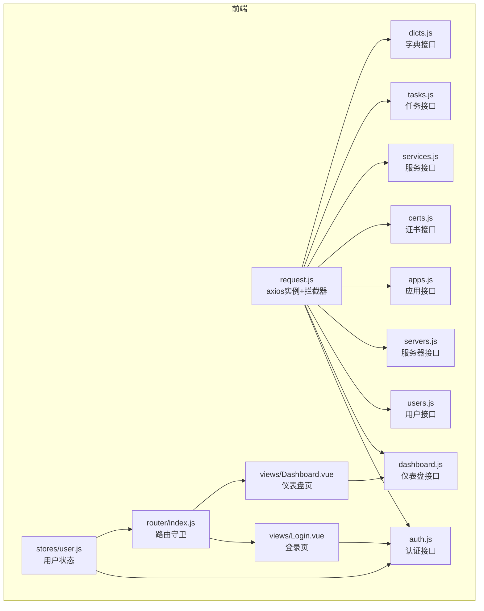
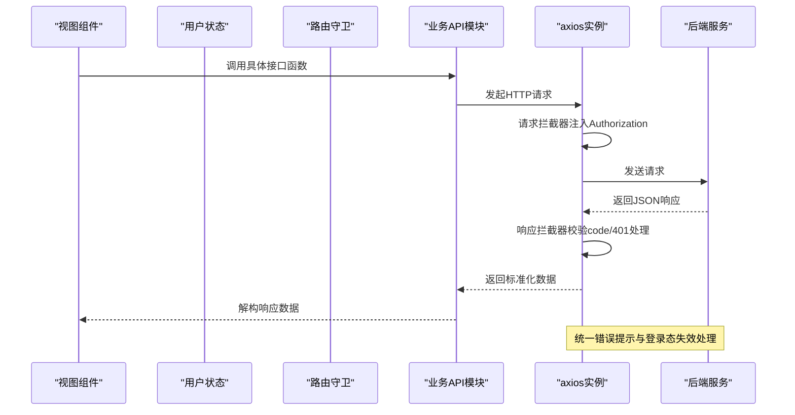
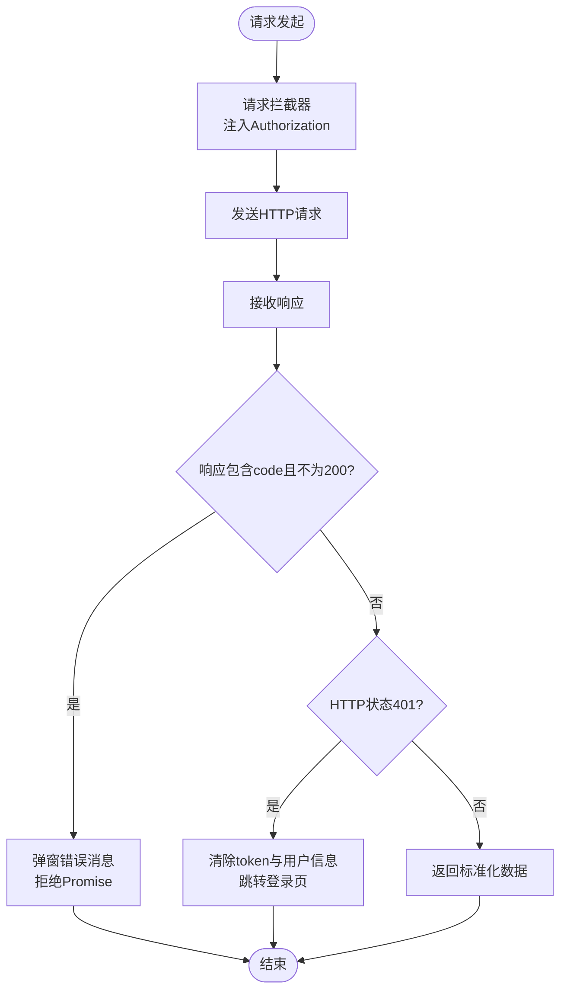
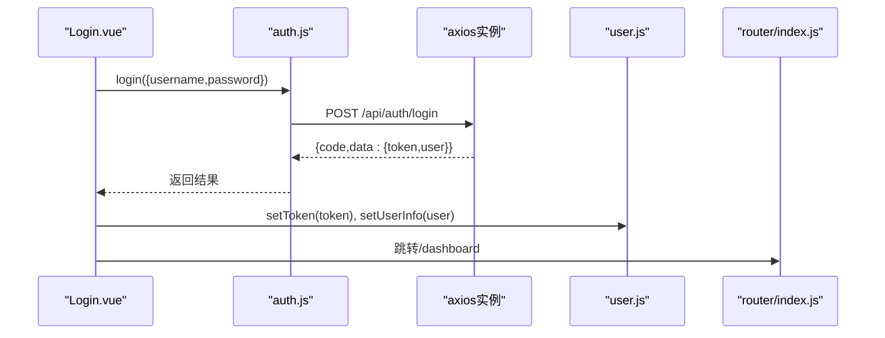
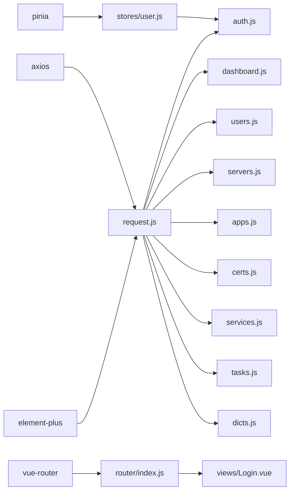

# API服务层

<cite>
**本文引用的文件**
- [frontend/src/api/request.js](file://frontend/src/api/request.js)
- [frontend/src/api/auth.js](file://frontend/src/api/auth.js)
- [frontend/src/api/dashboard.js](file://frontend/src/api/dashboard.js)
- [frontend/src/api/users.js](file://frontend/src/api/users.js)
- [frontend/src/api/servers.js](file://frontend/src/api/servers.js)
- [frontend/src/api/apps.js](file://frontend/src/api/apps.js)
- [frontend/src/api/certs.js](file://frontend/src/api/certs.js)
- [frontend/src/api/services.js](file://frontend/src/api/services.js)
- [frontend/src/api/tasks.js](file://frontend/src/api/tasks.js)
- [frontend/src/api/dicts.js](file://frontend/src/api/dicts.js)
- [frontend/src/router/index.js](file://frontend/src/router/index.js)
- [frontend/src/stores/user.js](file://frontend/src/stores/user.js)
- [frontend/src/views/Login.vue](file://frontend/src/views/Login.vue)
- [frontend/src/views/Dashboard.vue](file://frontend/src/views/Dashboard.vue)
- [frontend/package.json](file://frontend/package.json)
</cite>

## 目录
1. [简介](#简介)
2. [项目结构](#项目结构)
3. [核心组件](#核心组件)
4. [架构总览](#架构总览)
5. [详细组件分析](#详细组件分析)
6. [依赖关系分析](#依赖关系分析)
7. [性能考虑](#性能考虑)
8. [故障排查指南](#故障排查指南)
9. [结论](#结论)
10. [附录](#附录)

## 简介
本文件面向云运维平台前端API服务层，系统性阐述HTTP请求封装设计与各业务模块接口定义，覆盖认证、仪表盘、用户、服务器、应用、证书、服务、定时任务、字典等模块。文档重点说明axios配置、请求/响应拦截器、统一错误处理机制；梳理最佳实践（参数格式、响应处理、缓存策略、重试机制）；并给出GET/POST/PUT/DELETE的使用范式与异常处理策略。

## 项目结构
前端API层采用“单实例axios + 模块化API函数”的分层组织方式：
- request.js：全局axios实例与拦截器
- 各业务模块API：auth.js、dashboard.js、users.js、servers.js、apps.js、certs.js、services.js、tasks.js、dicts.js
- 路由与状态：router/index.js、stores/user.js
- 视图组件：Login.vue、Dashboard.vue等作为API调用入口示例

图表来源
- [frontend/src/api/request.js:1-54](file://frontend/src/api/request.js#L1-L54)
- [frontend/src/api/auth.js:1-14](file://frontend/src/api/auth.js#L1-L14)
- [frontend/src/api/dashboard.js:1-6](file://frontend/src/api/dashboard.js#L1-L6)
- [frontend/src/api/users.js:1-22](file://frontend/src/api/users.js#L1-L22)
- [frontend/src/api/servers.js:1-26](file://frontend/src/api/servers.js#L1-L26)
- [frontend/src/api/apps.js:1-18](file://frontend/src/api/apps.js#L1-L18)
- [frontend/src/api/certs.js:1-18](file://frontend/src/api/certs.js#L1-L18)
- [frontend/src/api/services.js:1-18](file://frontend/src/api/services.js#L1-L18)
- [frontend/src/api/tasks.js:1-34](file://frontend/src/api/tasks.js#L1-L34)
- [frontend/src/api/dicts.js:1-16](file://frontend/src/api/dicts.js#L1-L16)
- [frontend/src/router/index.js:1-61](file://frontend/src/router/index.js#L1-L61)
- [frontend/src/stores/user.js:1-41](file://frontend/src/stores/user.js#L1-L41)
- [frontend/src/views/Login.vue:1-114](file://frontend/src/views/Login.vue#L1-L114)
- [frontend/src/views/Dashboard.vue:1-312](file://frontend/src/views/Dashboard.vue#L1-L312)

章节来源
- [frontend/src/api/request.js:1-54](file://frontend/src/api/request.js#L1-L54)
- [frontend/src/router/index.js:1-61](file://frontend/src/router/index.js#L1-L61)

## 核心组件
- axios实例与拦截器
  - 基础配置：baseURL、超时、默认Content-Type
  - 请求拦截器：从本地存储读取token并注入Authorization头
  - 响应拦截器：统一校验后端返回code；401自动登出并跳转登录；网络异常提示
- 认证模块：登录、获取个人资料、修改密码
- 仪表盘模块：获取统计概览
- 用户模块：列表、创建、更新、删除、重置密码
- 服务器模块：列表、详情、简表、创建、更新、删除
- 应用模块：列表、创建、更新、删除
- 证书模块：列表、创建、更新、删除
- 服务模块：列表、创建、更新、删除
- 定时任务模块：列表、创建（multipart/form-data）、更新（multipart/form-data）、删除、启停、执行、日志
- 字典模块：环境类型、服务分类
- 路由守卫：鉴权与管理员权限控制
- 用户状态：token与用户信息持久化、拉取资料、登出

章节来源
- [frontend/src/api/request.js:1-54](file://frontend/src/api/request.js#L1-L54)
- [frontend/src/api/auth.js:1-14](file://frontend/src/api/auth.js#L1-L14)
- [frontend/src/api/dashboard.js:1-6](file://frontend/src/api/dashboard.js#L1-L6)
- [frontend/src/api/users.js:1-22](file://frontend/src/api/users.js#L1-L22)
- [frontend/src/api/servers.js:1-26](file://frontend/src/api/servers.js#L1-L26)
- [frontend/src/api/apps.js:1-18](file://frontend/src/api/apps.js#L1-L18)
- [frontend/src/api/certs.js:1-18](file://frontend/src/api/certs.js#L1-L18)
- [frontend/src/api/services.js:1-18](file://frontend/src/api/services.js#L1-L18)
- [frontend/src/api/tasks.js:1-34](file://frontend/src/api/tasks.js#L1-L34)
- [frontend/src/api/dicts.js:1-16](file://frontend/src/api/dicts.js#L1-L16)
- [frontend/src/router/index.js:35-58](file://frontend/src/router/index.js#L35-L58)
- [frontend/src/stores/user.js:1-41](file://frontend/src/stores/user.js#L1-L41)

## 架构总览
API服务层通过单一axios实例集中管理HTTP行为，业务模块仅负责拼装URL与参数，实现高内聚、低耦合的接口抽象。

图表来源
- [frontend/src/api/request.js:14-51](file://frontend/src/api/request.js#L14-L51)
- [frontend/src/api/auth.js:1-14](file://frontend/src/api/auth.js#L1-L14)
- [frontend/src/router/index.js:35-58](file://frontend/src/router/index.js#L35-L58)

## 详细组件分析

### axios实例与拦截器
- 实例配置
  - 基础路径：/api
  - 超时：15秒
  - 默认Content-Type：application/json
- 请求拦截器
  - 从localStorage读取token并在Authorization头中携带
- 响应拦截器
  - 校验后端返回的code字段，非200时统一弹窗提示并拒绝Promise
  - 对401进行强制登出（清理token与用户信息），跳转登录页
  - 其他HTTP错误或网络异常统一提示

图表来源
- [frontend/src/api/request.js:5-51](file://frontend/src/api/request.js#L5-L51)

章节来源
- [frontend/src/api/request.js:1-54](file://frontend/src/api/request.js#L1-L54)

### 认证模块（auth）
- 接口定义
  - POST /auth/login：登录
  - GET /auth/profile：获取当前用户资料
  - PUT /auth/password：修改密码
- 使用场景
  - 登录页调用登录接口，成功后写入token与用户信息，跳转仪表盘
  - 用户状态store在初始化时拉取个人资料

图表来源
- [frontend/src/views/Login.vue:50-66](file://frontend/src/views/Login.vue#L50-L66)
- [frontend/src/api/auth.js:3-5](file://frontend/src/api/auth.js#L3-L5)
- [frontend/src/stores/user.js:13-21](file://frontend/src/stores/user.js#L13-L21)
- [frontend/src/router/index.js:35-58](file://frontend/src/router/index.js#L35-L58)

章节来源
- [frontend/src/api/auth.js:1-14](file://frontend/src/api/auth.js#L1-L14)
- [frontend/src/stores/user.js:23-30](file://frontend/src/stores/user.js#L23-L30)
- [frontend/src/views/Login.vue:50-66](file://frontend/src/views/Login.vue#L50-L66)

### 仪表盘模块（dashboard）
- 接口定义
  - GET /dashboard/stats：获取统计概览
- 使用场景
  - 仪表盘组件在挂载时调用接口，填充统计数据卡片与表格

章节来源
- [frontend/src/api/dashboard.js:1-6](file://frontend/src/api/dashboard.js#L1-L6)
- [frontend/src/views/Dashboard.vue:150-158](file://frontend/src/views/Dashboard.vue#L150-L158)

### 用户管理模块（users）
- 接口定义
  - GET /users：分页/筛选列表
  - POST /users：创建用户
  - PUT /users/{id}：更新用户
  - DELETE /users/{id}：删除用户
  - PUT /users/{id}/reset-password：重置密码
- 参数与响应
  - 列表使用params对象传递查询条件
  - 更新与删除使用路径参数{id}

章节来源
- [frontend/src/api/users.js:1-22](file://frontend/src/api/users.js#L1-L22)

### 服务器管理模块（servers）
- 接口定义
  - GET /servers：列表
  - GET /servers/{id}：详情
  - GET /servers/list：简表
  - POST /servers：创建
  - PUT /servers/{id}：更新
  - DELETE /servers/{id}：删除
- 参数与响应
  - 详情、更新、删除使用路径参数{id}
  - 列表使用params对象传递查询条件
  - 简表用于快速选择

章节来源
- [frontend/src/api/servers.js:1-26](file://frontend/src/api/servers.js#L1-L26)

### 应用管理模块（apps）
- 接口定义
  - GET /apps：列表
  - POST /apps：创建
  - PUT /apps/{id}：更新
  - DELETE /apps/{id}：删除
- 参数与响应
  - 使用路径参数{id}定位资源

章节来源
- [frontend/src/api/apps.js:1-18](file://frontend/src/api/apps.js#L1-L18)

### 证书管理模块（certs）
- 接口定义
  - GET /certs：列表
  - POST /certs：创建
  - PUT /certs/{id}：更新
  - DELETE /certs/{id}：删除
- 参数与响应
  - 使用路径参数{id}定位资源

章节来源
- [frontend/src/api/certs.js:1-18](file://frontend/src/api/certs.js#L1-L18)

### 服务管理模块（services）
- 接口定义
  - GET /services：列表
  - POST /services：创建
  - PUT /services/{id}：更新
  - DELETE /services/{id}：删除
- 参数与响应
  - 使用路径参数{id}定位资源

章节来源
- [frontend/src/api/services.js:1-18](file://frontend/src/api/services.js#L1-L18)

### 定时任务模块（tasks）
- 接口定义
  - GET /tasks：列表
  - POST /tasks：创建（上传文件时使用multipart/form-data）
  - PUT /tasks/{id}：更新（上传文件时使用multipart/form-data）
  - DELETE /tasks/{id}：删除
  - POST /tasks/{id}/toggle：启停
  - POST /tasks/{id}/run：立即执行
  - GET /tasks/{id}/logs：日志
- 特殊点
  - 创建/更新时需设置Content-Type为multipart/form-data以支持文件上传
  - 日志接口使用params传参

章节来源
- [frontend/src/api/tasks.js:1-34](file://frontend/src/api/tasks.js#L1-L34)

### 字典模块（dicts）
- 接口定义
  - GET /dicts/env-types：环境类型
  - GET /dicts/service-categories：服务分类
- 使用方式
  - 通过request对象的GET方法调用

章节来源
- [frontend/src/api/dicts.js:1-16](file://frontend/src/api/dicts.js#L1-L16)

### 路由与鉴权
- 路由守卫逻辑
  - 需要认证的页面：若无token则跳转登录
  - 登录页：若已登录可直接跳转仪表盘
  - 管理员页面：要求用户角色为admin
- 与API协作
  - 登录成功后写入token与用户信息，后续请求由拦截器自动注入Authorization

章节来源
- [frontend/src/router/index.js:35-58](file://frontend/src/router/index.js#L35-L58)
- [frontend/src/stores/user.js:13-21](file://frontend/src/stores/user.js#L13-L21)

## 依赖关系分析
- 外部依赖
  - axios：HTTP客户端
  - element-plus：UI与消息提示
  - vue-router：路由与导航
  - pinia：状态管理
- 内部依赖
  - 所有业务API模块均依赖request.js提供的axios实例
  - 路由守卫依赖localStorage中的token与用户信息
  - 登录页与用户状态store共同完成登录态维护

图表来源
- [frontend/package.json:11-17](file://frontend/package.json#L11-L17)
- [frontend/src/api/request.js:1-54](file://frontend/src/api/request.js#L1-L54)
- [frontend/src/router/index.js:1-61](file://frontend/src/router/index.js#L1-L61)
- [frontend/src/stores/user.js:1-41](file://frontend/src/stores/user.js#L1-L41)

章节来源
- [frontend/package.json:11-17](file://frontend/package.json#L11-L17)

## 性能考虑
- 请求合并与批量查询：对列表类接口尽量使用params一次性传入筛选条件，减少多次往返
- 响应缓存：对于不频繁变化的数据（如字典项），可在业务层做内存缓存，避免重复请求
- 上传优化：文件上传使用multipart/form-data，建议在前端做大小与类型校验，减少无效传输
- 超时与重试：当前拦截器未内置自动重试，可在上层业务根据场景增加指数退避重试策略（例如对网络抖动敏感的读操作）
- 并发控制：对高频刷新的仪表盘数据，建议节流/防抖处理，避免短时间内大量并发请求

## 故障排查指南
- 登录后立即401
  - 检查localStorage中token是否正确写入
  - 确认请求拦截器是否注入Authorization头
  - 后端是否正确校验token
- 统一错误提示
  - 响应拦截器会根据后端返回的code与HTTP状态显示错误消息
  - 401时会自动清空token并跳转登录页
- 网络异常
  - 无response时提示“网络连接失败”，检查代理与跨域配置
- 文件上传失败
  - 确认创建/更新任务时headers设置为multipart/form-data
- 参数格式问题
  - 列表接口统一使用params对象传参
  - 资源操作使用路径参数{id}

章节来源
- [frontend/src/api/request.js:25-51](file://frontend/src/api/request.js#L25-L51)
- [frontend/src/api/tasks.js:7-16](file://frontend/src/api/tasks.js#L7-L16)

## 结论
本API服务层通过单一axios实例与拦截器实现了统一的请求/响应处理与错误治理，业务模块以清晰的函数接口暴露REST能力，配合路由守卫与用户状态管理，形成完整的前端调用闭环。建议在现有基础上补充自动重试、缓存与并发控制策略，并持续完善后端接口的错误码与消息规范，以进一步提升稳定性与可维护性。

## 附录

### API使用示例（GET/POST/PUT/DELETE）
- 获取统计
  - GET /dashboard/stats
  - 示例路径：[frontend/src/views/Dashboard.vue:150-158](file://frontend/src/views/Dashboard.vue#L150-L158)
- 用户列表
  - GET /users?name=xxx&status=active
  - 示例路径：[frontend/src/api/users.js:3-5](file://frontend/src/api/users.js#L3-L5)
- 创建服务器
  - POST /servers
  - 示例路径：[frontend/src/api/servers.js:15-17](file://frontend/src/api/servers.js#L15-L17)
- 更新应用
  - PUT /apps/{id}
  - 示例路径：[frontend/src/api/apps.js:11-13](file://frontend/src/api/apps.js#L11-L13)
- 删除证书
  - DELETE /certs/{id}
  - 示例路径：[frontend/src/api/certs.js:15-17](file://frontend/src/api/certs.js#L15-L17)
- 上传任务文件
  - POST /tasks（headers: multipart/form-data）
  - 示例路径：[frontend/src/api/tasks.js:7-11](file://frontend/src/api/tasks.js#L7-L11)

### 错误处理与异常策略
- 后端返回code非200：统一弹窗提示并拒绝Promise
- 401：清除本地token与用户信息，跳转登录页
- 网络异常：提示“网络连接失败”
- 建议扩展：对特定场景增加自动重试与降级策略

章节来源
- [frontend/src/api/request.js:25-51](file://frontend/src/api/request.js#L25-L51)