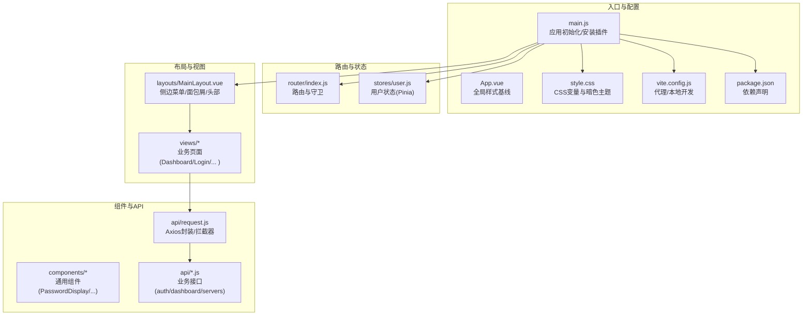
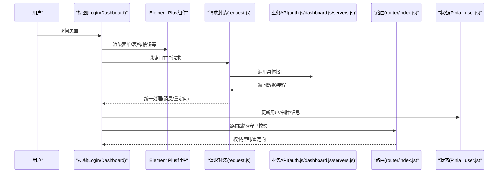
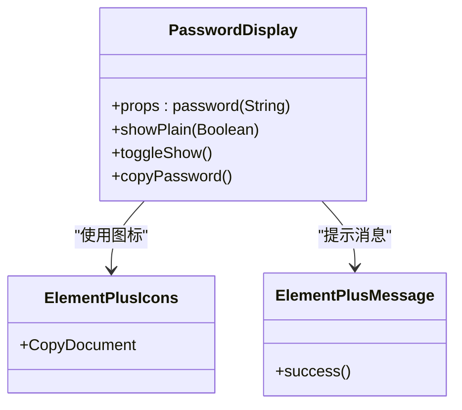
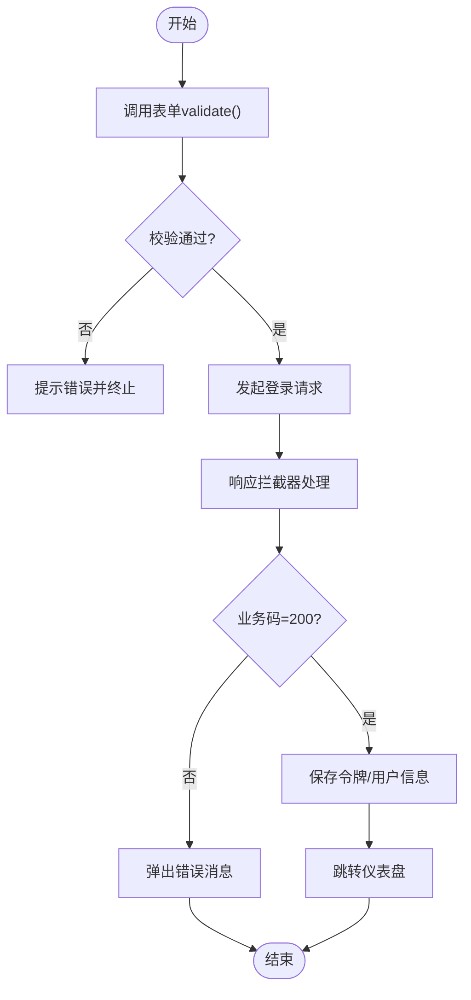
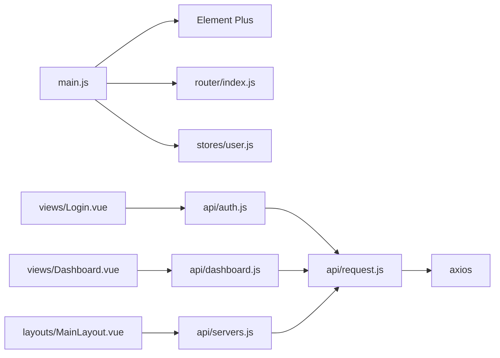

# UI组件设计

<cite>
**本文引用的文件**
- [package.json](file://frontend/package.json)
- [vite.config.js](file://frontend/vite.config.js)
- [main.js](file://frontend/src/main.js)
- [App.vue](file://frontend/src/App.vue)
- [style.css](file://frontend/src/style.css)
- [HelloWorld.vue](file://frontend/src/components/HelloWorld.vue)
- [PasswordDisplay.vue](file://frontend/src/components/PasswordDisplay.vue)
- [MainLayout.vue](file://frontend/src/layouts/MainLayout.vue)
- [index.js](file://frontend/src/router/index.js)
- [user.js](file://frontend/src/stores/user.js)
- [Login.vue](file://frontend/src/views/Login.vue)
- [Dashboard.vue](file://frontend/src/views/Dashboard.vue)
- [request.js](file://frontend/src/api/request.js)
- [auth.js](file://frontend/src/api/auth.js)
- [dashboard.js](file://frontend/src/api/dashboard.js)
- [servers.js](file://frontend/src/api/servers.js)
</cite>

## 目录
1. [引言](#引言)
2. [项目结构](#项目结构)
3. [核心组件](#核心组件)
4. [架构总览](#架构总览)
5. [组件详解](#组件详解)
6. [依赖关系分析](#依赖关系分析)
7. [性能与可维护性](#性能与可维护性)
8. [故障排查指南](#故障排查指南)
9. [结论](#结论)
10. [附录](#附录)

## 引言
本文件面向云运维平台前端UI组件设计，围绕Element Plus组件库的集成与定制化使用展开，涵盖主题与国际化、组件样式覆盖、自定义组件设计模式（props/事件/插槽/通信）、表单组件设计（验证/绑定/错误提示）、常用组件使用示例（表格/对话框/按钮/输入框）、响应式与无障碍优化、以及组件复用、性能优化与测试策略等开发最佳实践。

## 项目结构
前端采用Vue 3 + Vite + Element Plus + Pinia + Vue Router的现代技术栈，UI层以布局、视图、组件三层组织，配合统一的HTTP请求封装与路由守卫实现鉴权与导航。

**图表来源**
- [main.js:1-23](file://frontend/src/main.js#L1-L23)
- [App.vue:1-18](file://frontend/src/App.vue#L1-L18)
- [style.css:1-297](file://frontend/src/style.css#L1-L297)
- [vite.config.js:1-17](file://frontend/vite.config.js#L1-L17)
- [package.json:1-24](file://frontend/package.json#L1-L24)
- [index.js:1-61](file://frontend/src/router/index.js#L1-L61)
- [user.js:1-41](file://frontend/src/stores/user.js#L1-L41)
- [MainLayout.vue:1-233](file://frontend/src/layouts/MainLayout.vue#L1-L233)
- [Login.vue:1-114](file://frontend/src/views/Login.vue#L1-L114)
- [Dashboard.vue:1-312](file://frontend/src/views/Dashboard.vue#L1-L312)
- [request.js:1-54](file://frontend/src/api/request.js#L1-L54)
- [auth.js:1-14](file://frontend/src/api/auth.js#L1-L14)
- [dashboard.js:1-6](file://frontend/src/api/dashboard.js#L1-L6)
- [servers.js:1-26](file://frontend/src/api/servers.js#L1-L26)

**章节来源**
- [main.js:1-23](file://frontend/src/main.js#L1-L23)
- [App.vue:1-18](file://frontend/src/App.vue#L1-L18)
- [style.css:1-297](file://frontend/src/style.css#L1-L297)
- [vite.config.js:1-17](file://frontend/vite.config.js#L1-L17)
- [package.json:1-24](file://frontend/package.json#L1-L24)

## 核心组件
- Element Plus集成与国际化
  - 在应用入口中安装Element Plus并设置语言为简体中文；同时批量注册Element Plus图标组件，便于在模板中直接使用。
  - 参考路径：[main.js:1-23](file://frontend/src/main.js#L1-L23)
- 全局样式与主题
  - 使用CSS变量定义文本、背景、强调色、阴影等，支持明/暗两套主题；在媒体查询中适配不同屏幕尺寸。
  - 参考路径：[style.css:1-297](file://frontend/src/style.css#L1-L297)
- 布局容器
  - 通过容器组件组合侧边菜单、面包屑、头部操作区与主内容区，实现统一的导航与布局风格。
  - 参考路径：[MainLayout.vue:1-233](file://frontend/src/layouts/MainLayout.vue#L1-L233)
- 自定义组件
  - 密码展示组件：支持切换显示/隐藏与一键复制，内置降级方案与消息反馈。
  - 参考路径：[PasswordDisplay.vue:1-85](file://frontend/src/components/PasswordDisplay.vue#L1-L85)

**章节来源**
- [main.js:1-23](file://frontend/src/main.js#L1-L23)
- [style.css:1-297](file://frontend/src/style.css#L1-L297)
- [MainLayout.vue:1-233](file://frontend/src/layouts/MainLayout.vue#L1-L233)
- [PasswordDisplay.vue:1-85](file://frontend/src/components/PasswordDisplay.vue#L1-L85)

## 架构总览
下图展示了从入口到业务页面的数据流与交互链路，突出Element Plus组件在各页面中的使用方式与统一的请求/状态管理。

**图表来源**
- [Login.vue:1-114](file://frontend/src/views/Login.vue#L1-L114)
- [Dashboard.vue:1-312](file://frontend/src/views/Dashboard.vue#L1-L312)
- [request.js:1-54](file://frontend/src/api/request.js#L1-L54)
- [auth.js:1-14](file://frontend/src/api/auth.js#L1-L14)
- [dashboard.js:1-6](file://frontend/src/api/dashboard.js#L1-L6)
- [servers.js:1-26](file://frontend/src/api/servers.js#L1-L26)
- [index.js:1-61](file://frontend/src/router/index.js#L1-L61)
- [user.js:1-41](file://frontend/src/stores/user.js#L1-L41)

## 组件详解

### Element Plus集成与国际化
- 安装与注册
  - 在应用入口安装Element Plus并设置locale为简体中文；随后遍历注册Element Plus图标组件，使图标可在模板中直接使用。
  - 参考路径：[main.js:1-23](file://frontend/src/main.js#L1-L23)
- 主题与样式覆盖
  - 通过全局CSS变量与深色主题媒体查询实现主题切换；在布局与视图中使用Element Plus提供的容器、菜单、表单、表格、标签、进度条等组件。
  - 参考路径：[style.css:1-297](file://frontend/src/style.css#L1-L297)，[MainLayout.vue:1-233](file://frontend/src/layouts/MainLayout.vue#L1-L233)，[Dashboard.vue:1-312](file://frontend/src/views/Dashboard.vue#L1-L312)

**章节来源**
- [main.js:1-23](file://frontend/src/main.js#L1-L23)
- [style.css:1-297](file://frontend/src/style.css#L1-L297)
- [MainLayout.vue:1-233](file://frontend/src/layouts/MainLayout.vue#L1-L233)
- [Dashboard.vue:1-312](file://frontend/src/views/Dashboard.vue#L1-L312)

### 自定义组件设计模式
- PasswordDisplay组件
  - Props定义：接收密码字符串，提供默认值。
  - 事件处理：点击切换显示/隐藏；点击复制触发剪贴板写入，失败时回退到文本域选择复制。
  - 插槽与作用域：未使用具名插槽，但通过模板作用域插槽渲染密码占位符与真实内容。
  - 组件通信：内部状态切换与外部消息提示（Element Plus消息）。
  - 参考路径：[PasswordDisplay.vue:1-85](file://frontend/src/components/PasswordDisplay.vue#L1-L85)

**图表来源**
- [PasswordDisplay.vue:1-85](file://frontend/src/components/PasswordDisplay.vue#L1-L85)

**章节来源**
- [PasswordDisplay.vue:1-85](file://frontend/src/components/PasswordDisplay.vue#L1-L85)

### 表单组件设计
- 登录页表单
  - 使用表单组件进行字段绑定与规则校验；通过ref调用validate方法实现提交前校验；结合加载态与消息提示提升交互体验。
  - 参考路径：[Login.vue:1-114](file://frontend/src/views/Login.vue#L1-L114)
- 表单验证与错误提示
  - 借助请求拦截器统一处理后端返回的业务错误码与HTTP异常，自动弹出消息提示并按需重定向至登录页。
  - 参考路径：[request.js:1-54](file://frontend/src/api/request.js#L1-L54)

**图表来源**
- [Login.vue:1-114](file://frontend/src/views/Login.vue#L1-L114)
- [request.js:1-54](file://frontend/src/api/request.js#L1-L54)

**章节来源**
- [Login.vue:1-114](file://frontend/src/views/Login.vue#L1-L114)
- [request.js:1-54](file://frontend/src/api/request.js#L1-L54)

### 常用UI组件使用示例
- 表格组件
  - 在仪表盘中使用表格展示统计数据、环境分布与到期提醒；结合空状态、加载状态与进度条增强可读性。
  - 参考路径：[Dashboard.vue:1-312](file://frontend/src/views/Dashboard.vue#L1-L312)
- 对话框组件
  - 在布局中使用确认对话框进行退出登录操作，配合消息提示反馈结果。
  - 参考路径：[MainLayout.vue:1-233](file://frontend/src/layouts/MainLayout.vue#L1-L233)
- 按钮组件
  - 在头部操作区提供导出Excel按钮；在登录页提供提交按钮；均结合加载态与图标提升可用性。
  - 参考路径：[MainLayout.vue:1-233](file://frontend/src/layouts/MainLayout.vue#L1-L233)，[Login.vue:1-114](file://frontend/src/views/Login.vue#L1-L114)
- 输入框组件
  - 使用带前缀图标的输入框承载用户名与密码；支持显示/隐藏密码与自动聚焦。
  - 参考路径：[Login.vue:1-114](file://frontend/src/views/Login.vue#L1-L114)

**章节来源**
- [Dashboard.vue:1-312](file://frontend/src/views/Dashboard.vue#L1-L312)
- [MainLayout.vue:1-233](file://frontend/src/layouts/MainLayout.vue#L1-L233)
- [Login.vue:1-114](file://frontend/src/views/Login.vue#L1-L114)

### 响应式设计与无障碍
- 响应式
  - 使用Element Plus栅格系统与媒体查询适配小屏设备；在全局样式中对字体、间距与断点进行统一调整。
  - 参考路径：[Dashboard.vue:1-312](file://frontend/src/views/Dashboard.vue#L1-L312)，[style.css:1-297](file://frontend/src/style.css#L1-L297)
- 无障碍
  - 图标使用语义化角色与隐藏属性；链接与按钮具备明确的焦点样式与可点击区域。
  - 参考路径：[HelloWorld.vue:1-94](file://frontend/src/components/HelloWorld.vue#L1-L94)，[style.css:1-297](file://frontend/src/style.css#L1-L297)

**章节来源**
- [Dashboard.vue:1-312](file://frontend/src/views/Dashboard.vue#L1-L312)
- [HelloWorld.vue:1-94](file://frontend/src/components/HelloWorld.vue#L1-L94)
- [style.css:1-297](file://frontend/src/style.css#L1-L297)

## 依赖关系分析
- 外部依赖
  - Vue 3、Element Plus、Axios、Pinia、Vue Router、Vite。
  - 参考路径：[package.json:1-24](file://frontend/package.json#L1-L24)
- 运行时依赖
  - Element Plus在入口中安装并设置语言；图标组件批量注册；全局样式与主题变量。
  - 参考路径：[main.js:1-23](file://frontend/src/main.js#L1-L23)，[style.css:1-297](file://frontend/src/style.css#L1-L297)
- 数据流依赖
  - 视图组件通过API模块调用后端接口；请求封装统一处理鉴权头与错误；路由守卫与状态管理共同保障权限。
  - 参考路径：[Login.vue:1-114](file://frontend/src/views/Login.vue#L1-L114)，[request.js:1-54](file://frontend/src/api/request.js#L1-L54)，[index.js:1-61](file://frontend/src/router/index.js#L1-L61)，[user.js:1-41](file://frontend/src/stores/user.js#L1-L41)

**图表来源**
- [main.js:1-23](file://frontend/src/main.js#L1-L23)
- [index.js:1-61](file://frontend/src/router/index.js#L1-L61)
- [user.js:1-41](file://frontend/src/stores/user.js#L1-L41)
- [Login.vue:1-114](file://frontend/src/views/Login.vue#L1-L114)
- [Dashboard.vue:1-312](file://frontend/src/views/Dashboard.vue#L1-L312)
- [MainLayout.vue:1-233](file://frontend/src/layouts/MainLayout.vue#L1-L233)
- [auth.js:1-14](file://frontend/src/api/auth.js#L1-L14)
- [dashboard.js:1-6](file://frontend/src/api/dashboard.js#L1-L6)
- [servers.js:1-26](file://frontend/src/api/servers.js#L1-L26)
- [request.js:1-54](file://frontend/src/api/request.js#L1-L54)

**章节来源**
- [package.json:1-24](file://frontend/package.json#L1-L24)
- [main.js:1-23](file://frontend/src/main.js#L1-L23)
- [request.js:1-54](file://frontend/src/api/request.js#L1-L54)
- [index.js:1-61](file://frontend/src/router/index.js#L1-L61)
- [user.js:1-41](file://frontend/src/stores/user.js#L1-L41)

## 性能与可维护性
- 组件复用
  - 将通用交互（如密码显示/复制）抽象为独立组件，减少重复逻辑；在多个页面中统一使用。
  - 参考路径：[PasswordDisplay.vue:1-85](file://frontend/src/components/PasswordDisplay.vue#L1-L85)
- 懒加载与按需加载
  - 路由与视图采用动态导入，降低首屏体积；Element Plus图标按需引入，避免全量引入。
  - 参考路径：[index.js:1-61](file://frontend/src/router/index.js#L1-L61)，[main.js:1-23](file://frontend/src/main.js#L1-L23)
- 请求与错误处理
  - 统一的请求封装与拦截器，集中处理鉴权头、业务错误与网络异常，保证一致的用户体验。
  - 参考路径：[request.js:1-54](file://frontend/src/api/request.js#L1-L54)
- 样式与主题
  - 使用CSS变量与媒体查询实现主题切换与响应式布局，减少重复样式代码。
  - 参考路径：[style.css:1-297](file://frontend/src/style.css#L1-L297)

**章节来源**
- [PasswordDisplay.vue:1-85](file://frontend/src/components/PasswordDisplay.vue#L1-L85)
- [index.js:1-61](file://frontend/src/router/index.js#L1-L61)
- [main.js:1-23](file://frontend/src/main.js#L1-L23)
- [request.js:1-54](file://frontend/src/api/request.js#L1-L54)
- [style.css:1-297](file://frontend/src/style.css#L1-L297)

## 故障排查指南
- 登录失败或频繁跳转登录
  - 检查请求拦截器是否正确注入Authorization头；确认后端返回的业务码与消息；查看路由守卫逻辑与本地存储的令牌/用户信息。
  - 参考路径：[request.js:1-54](file://frontend/src/api/request.js#L1-L54)，[index.js:1-61](file://frontend/src/router/index.js#L1-L61)，[user.js:1-41](file://frontend/src/stores/user.js#L1-L41)
- 表单无法提交
  - 确认表单ref与validate调用；检查rules规则与必填项；观察加载态与消息提示。
  - 参考路径：[Login.vue:1-114](file://frontend/src/views/Login.vue#L1-L114)
- 导出功能异常
  - 检查导出接口返回的Blob对象与下载链接生成流程；确保消息提示与异常捕获。
  - 参考路径：[MainLayout.vue:1-233](file://frontend/src/layouts/MainLayout.vue#L1-L233)

**章节来源**
- [request.js:1-54](file://frontend/src/api/request.js#L1-L54)
- [index.js:1-61](file://frontend/src/router/index.js#L1-L61)
- [user.js:1-41](file://frontend/src/stores/user.js#L1-L41)
- [Login.vue:1-114](file://frontend/src/views/Login.vue#L1-L114)
- [MainLayout.vue:1-233](file://frontend/src/layouts/MainLayout.vue#L1-L233)

## 结论
本项目基于Element Plus构建了统一的UI体系，结合Pinia与Vue Router实现了清晰的状态与路由管理；通过全局样式与主题变量、响应式布局与无障碍设计提升了用户体验；借助统一的请求封装与路由守卫保障了安全性与一致性。建议后续持续完善组件文档与测试策略，进一步提升可维护性与扩展性。

## 附录
- 开发与运行
  - 本地开发：通过Vite启动，端口与代理已在配置中设定。
  - 参考路径：[vite.config.js:1-17](file://frontend/vite.config.js#L1-L17)
- 依赖安装
  - 使用包管理工具安装依赖后即可运行。
  - 参考路径：[package.json:1-24](file://frontend/package.json#L1-L24)

**章节来源**
- [vite.config.js:1-17](file://frontend/vite.config.js#L1-L17)
- [package.json:1-24](file://frontend/package.json#L1-L24)