# Vue应用结构

<cite>
**本文引用的文件**
- [frontend/src/main.ts](file://frontend/src/main.ts)
- [frontend/src/App.vue](file://frontend/src/App.vue)
- [frontend/package.json](file://frontend/package.json)
- [frontend/vite.config.js](file://frontend/vite.config.js)
- [frontend/tsconfig.json](file://frontend/tsconfig.json)
- [frontend/src/router/index.js](file://frontend/src/router/index.js)
- [frontend/src/stores/user.js](file://frontend/src/stores/user.js)
- [frontend/src/layouts/MainLayout.vue](file://frontend/src/layouts/MainLayout.vue)
- [frontend/src/views/Login.vue](file://frontend/src/views/Login.vue)
- [frontend/src/style.css](file://frontend/src/style.css)
- [frontend/src/api/request.js](file://frontend/src/api/request.js)
- [frontend/src/api/auth.js](file://frontend/src/api/auth.js)
- [frontend/src/views/Dashboard.vue](file://frontend/src/views/Dashboard.vue)
- [frontend/src/components/HelloWorld.vue](file://frontend/src/components/HelloWorld.vue)
- [frontend/index.html](file://frontend/index.html)
</cite>

## 目录
1. [简介](#简介)
2. [项目结构](#项目结构)
3. [核心组件](#核心组件)
4. [架构总览](#架构总览)
5. [详细组件分析](#详细组件分析)
6. [依赖分析](#依赖分析)
7. [性能考虑](#性能考虑)
8. [故障排查指南](#故障排查指南)
9. [结论](#结论)
10. [附录](#附录)

## 简介
本文件面向云运维平台的前端Vue 3应用，系统性梳理应用初始化流程、Element Plus组件库集成（主题与图标）、Pinia状态管理集成与全局状态初始化、应用启动流程（含错误处理与性能优化建议），以及TypeScript与开发环境最佳实践。文档以仓库现有实现为依据，提供可操作的架构说明与可视化图示，帮助开发者快速理解并扩展该Vue应用。

## 项目结构
前端采用Vite + Vue 3 + TypeScript + Element Plus + Pinia的现代技术栈。项目目录按功能分层组织，包含路由、状态管理、API封装、布局与视图组件、样式与资源等模块。

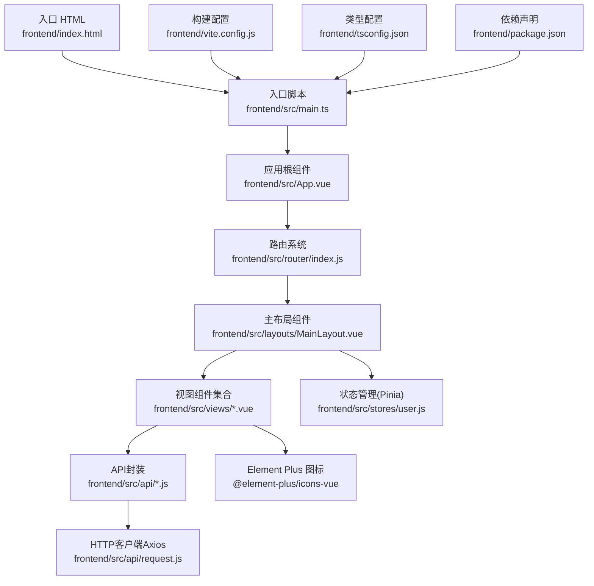

图表来源
- [frontend/index.html:1-14](file://frontend/index.html#L1-L14)
- [frontend/src/main.ts:1-61](file://frontend/src/main.ts#L1-L61)
- [frontend/src/App.vue:1-18](file://frontend/src/App.vue#L1-L18)
- [frontend/src/router/index.js:1-61](file://frontend/src/router/index.js#L1-L61)
- [frontend/src/layouts/MainLayout.vue:1-233](file://frontend/src/layouts/MainLayout.vue#L1-L233)
- [frontend/src/stores/user.js:1-41](file://frontend/src/stores/user.js#L1-L41)
- [frontend/src/api/request.js:1-54](file://frontend/src/api/request.js#L1-L54)
- [frontend/vite.config.js:1-17](file://frontend/vite.config.js#L1-L17)
- [frontend/tsconfig.json:1-27](file://frontend/tsconfig.json#L1-L27)
- [frontend/package.json:1-24](file://frontend/package.json#L1-L24)

章节来源
- [frontend/index.html:1-14](file://frontend/index.html#L1-L14)
- [frontend/src/main.ts:1-61](file://frontend/src/main.ts#L1-L61)
- [frontend/src/App.vue:1-18](file://frontend/src/App.vue#L1-L18)
- [frontend/src/router/index.js:1-61](file://frontend/src/router/index.js#L1-L61)
- [frontend/src/layouts/MainLayout.vue:1-233](file://frontend/src/layouts/MainLayout.vue#L1-L233)
- [frontend/src/stores/user.js:1-41](file://frontend/src/stores/user.js#L1-L41)
- [frontend/src/api/request.js:1-54](file://frontend/src/api/request.js#L1-L54)
- [frontend/vite.config.js:1-17](file://frontend/vite.config.js#L1-L17)
- [frontend/tsconfig.json:1-27](file://frontend/tsconfig.json#L1-L27)
- [frontend/package.json:1-24](file://frontend/package.json#L1-L24)

## 核心组件
- 应用入口与初始化
  - 入口HTML定义挂载点与模块入口脚本。
  - 入口TS脚本负责渲染基础页面与计数器交互（当前用于演示）。
- 应用根组件
  - 根组件通过路由视图承载页面内容。
- 路由系统
  - 使用Vue Router进行页面导航与权限控制。
- 主布局组件
  - 提供统一的侧边菜单、面包屑、头部导航与内容区域。
- 状态管理（Pinia）
  - 用户登录态与个人信息的集中存储与持久化。
- API封装
  - Axios实例封装，统一添加Authorization头、错误处理与401自动登出。
- Element Plus集成
  - 图标系统、消息提示、确认框等组件在多处使用。

章节来源
- [frontend/index.html:1-14](file://frontend/index.html#L1-L14)
- [frontend/src/main.ts:1-61](file://frontend/src/main.ts#L1-L61)
- [frontend/src/App.vue:1-18](file://frontend/src/App.vue#L1-L18)
- [frontend/src/router/index.js:1-61](file://frontend/src/router/index.js#L1-L61)
- [frontend/src/layouts/MainLayout.vue:1-233](file://frontend/src/layouts/MainLayout.vue#L1-L233)
- [frontend/src/stores/user.js:1-41](file://frontend/src/stores/user.js#L1-L41)
- [frontend/src/api/request.js:1-54](file://frontend/src/api/request.js#L1-L54)

## 架构总览
下图展示从浏览器加载到页面渲染的关键路径，以及路由守卫与状态管理的协作关系。

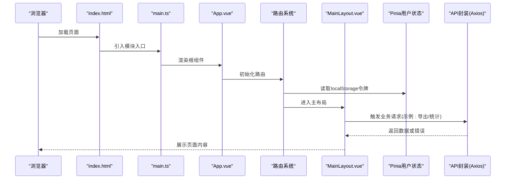

图表来源
- [frontend/index.html:1-14](file://frontend/index.html#L1-L14)
- [frontend/src/main.ts:1-61](file://frontend/src/main.ts#L1-L61)
- [frontend/src/App.vue:1-18](file://frontend/src/App.vue#L1-L18)
- [frontend/src/router/index.js:1-61](file://frontend/src/router/index.js#L1-L61)
- [frontend/src/layouts/MainLayout.vue:1-233](file://frontend/src/layouts/MainLayout.vue#L1-L233)
- [frontend/src/stores/user.js:1-41](file://frontend/src/stores/user.js#L1-L41)
- [frontend/src/api/request.js:1-54](file://frontend/src/api/request.js#L1-L54)

## 详细组件分析

### 应用初始化与入口流程
- 入口HTML仅定义挂载点与模块入口脚本。
- 入口TS脚本负责渲染静态内容与计数器交互，便于开发体验。
- 根组件通过router-view承载后续页面内容。

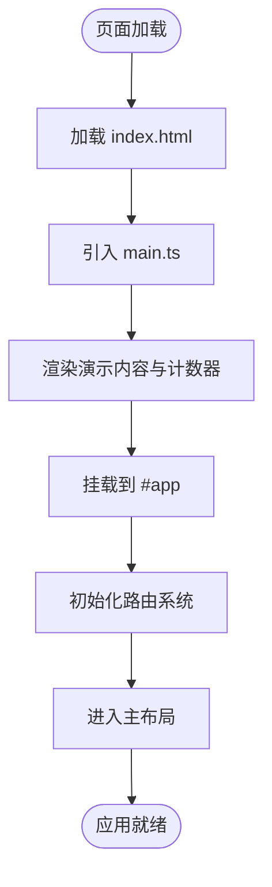

图表来源
- [frontend/index.html:1-14](file://frontend/index.html#L1-L14)
- [frontend/src/main.ts:1-61](file://frontend/src/main.ts#L1-L61)
- [frontend/src/App.vue:1-18](file://frontend/src/App.vue#L1-L18)
- [frontend/src/router/index.js:1-61](file://frontend/src/router/index.js#L1-L61)

章节来源
- [frontend/index.html:1-14](file://frontend/index.html#L1-L14)
- [frontend/src/main.ts:1-61](file://frontend/src/main.ts#L1-L61)
- [frontend/src/App.vue:1-18](file://frontend/src/App.vue#L1-L18)

### Element Plus集成与使用
- 图标系统
  - 在多个组件中直接从图标库导入并使用，如登录页、仪表盘、布局组件等。
- 消息与确认
  - 在布局组件中使用消息提示与确认框进行用户交互反馈。
- 表单与表格
  - 登录表单、统计卡片、表格与标签等广泛使用Element Plus组件。

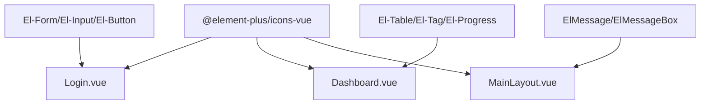

图表来源
- [frontend/src/views/Login.vue:1-114](file://frontend/src/views/Login.vue#L1-L114)
- [frontend/src/views/Dashboard.vue:1-312](file://frontend/src/views/Dashboard.vue#L1-L312)
- [frontend/src/layouts/MainLayout.vue:1-233](file://frontend/src/layouts/MainLayout.vue#L1-L233)
- [frontend/package.json:11-17](file://frontend/package.json#L11-L17)

章节来源
- [frontend/src/views/Login.vue:1-114](file://frontend/src/views/Login.vue#L1-L114)
- [frontend/src/views/Dashboard.vue:1-312](file://frontend/src/views/Dashboard.vue#L1-L312)
- [frontend/src/layouts/MainLayout.vue:1-233](file://frontend/src/layouts/MainLayout.vue#L1-L233)
- [frontend/package.json:11-17](file://frontend/package.json#L11-L17)

### Pinia状态管理与全局状态初始化
- 用户状态存储
  - 使用defineStore定义用户状态，包含令牌、用户信息、计算属性与方法。
  - 令牌与用户信息来自localStorage，支持登录后写入与退出登录时清理。
- 全局状态初始化
  - 在路由守卫中读取localStorage中的令牌与用户信息，用于判断是否需要登录与管理员权限。
- 与API协作
  - 登录成功后写入令牌与用户信息；API封装在请求拦截器中读取令牌并注入Authorization头。

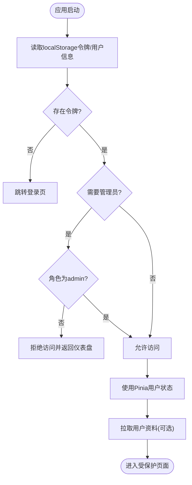

图表来源
- [frontend/src/stores/user.js:1-41](file://frontend/src/stores/user.js#L1-L41)
- [frontend/src/router/index.js:36-58](file://frontend/src/router/index.js#L36-L58)
- [frontend/src/api/auth.js:1-14](file://frontend/src/api/auth.js#L1-L14)
- [frontend/src/api/request.js:14-23](file://frontend/src/api/request.js#L14-L23)

章节来源
- [frontend/src/stores/user.js:1-41](file://frontend/src/stores/user.js#L1-L41)
- [frontend/src/router/index.js:36-58](file://frontend/src/router/index.js#L36-L58)
- [frontend/src/api/auth.js:1-14](file://frontend/src/api/auth.js#L1-L14)
- [frontend/src/api/request.js:14-23](file://frontend/src/api/request.js#L14-L23)

### 路由系统与权限控制
- 路由定义
  - 登录页无需认证；其余页面根据meta字段控制认证与管理员权限。
- 路由守卫
  - 在进入路由前检查令牌与角色，未登录则重定向至登录页；管理员页面校验角色。
- 面包屑与菜单联动
  - 主布局根据当前路由动态设置激活菜单与面包屑标题。

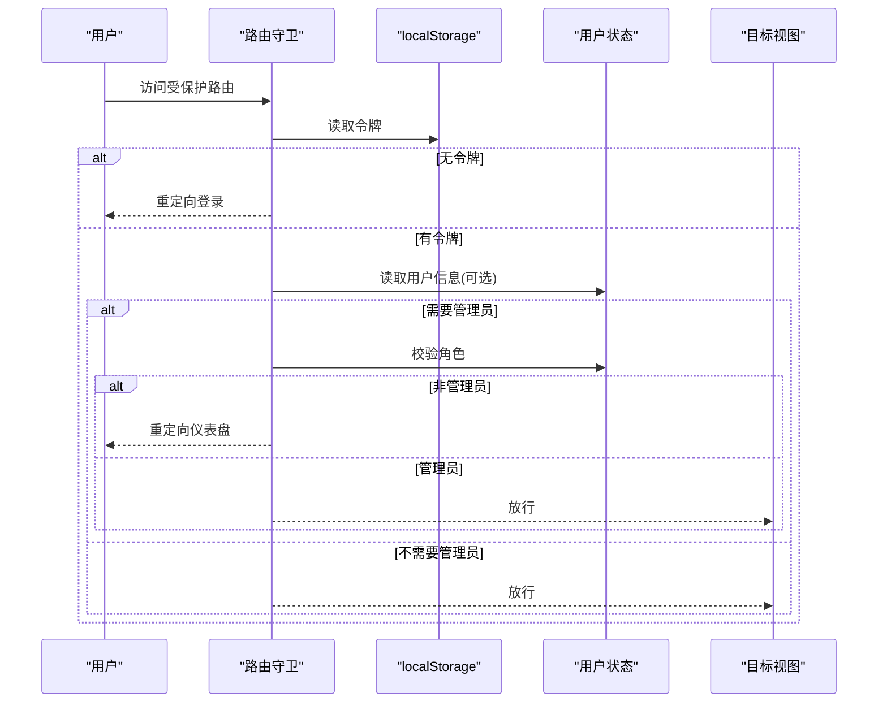

图表来源
- [frontend/src/router/index.js:36-58](file://frontend/src/router/index.js#L36-L58)
- [frontend/src/stores/user.js:1-41](file://frontend/src/stores/user.js#L1-L41)

章节来源
- [frontend/src/router/index.js:1-61](file://frontend/src/router/index.js#L1-L61)
- [frontend/src/stores/user.js:1-41](file://frontend/src/stores/user.js#L1-L41)

### API封装与错误处理
- Axios实例
  - 统一baseURL、超时与Content-Type。
- 请求拦截器
  - 自动从localStorage读取令牌并注入Authorization头。
- 响应拦截器
  - 统一处理业务错误码与HTTP错误，401时清除令牌并跳转登录页，同时提示错误信息。

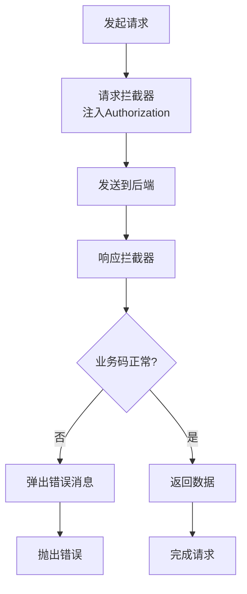

图表来源
- [frontend/src/api/request.js:1-54](file://frontend/src/api/request.js#L1-L54)

章节来源
- [frontend/src/api/request.js:1-54](file://frontend/src/api/request.js#L1-L54)

### 登录流程与状态同步
- 登录表单
  - 使用Element Plus表单组件与图标，提交后调用登录接口。
- 状态同步
  - 成功后写入令牌与用户信息到Pinia与localStorage，并跳转仪表盘。
- 错误处理
  - 使用消息提示反馈异常；finally中关闭加载状态。

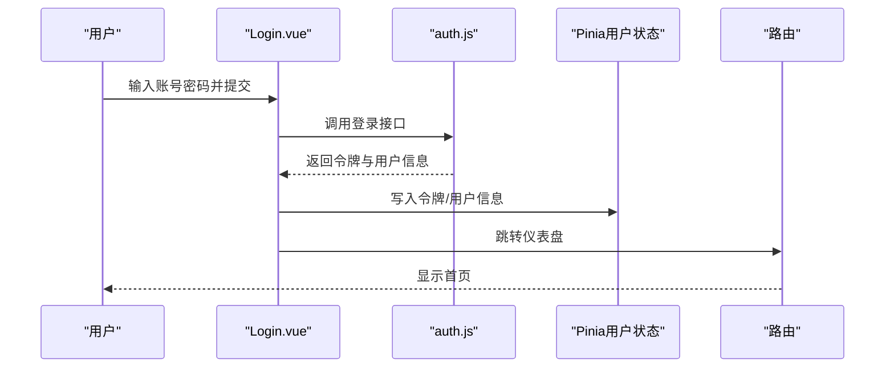

图表来源
- [frontend/src/views/Login.vue:50-66](file://frontend/src/views/Login.vue#L50-L66)
- [frontend/src/api/auth.js:1-14](file://frontend/src/api/auth.js#L1-L14)
- [frontend/src/stores/user.js:13-21](file://frontend/src/stores/user.js#L13-L21)

章节来源
- [frontend/src/views/Login.vue:1-114](file://frontend/src/views/Login.vue#L1-L114)
- [frontend/src/api/auth.js:1-14](file://frontend/src/api/auth.js#L1-L14)
- [frontend/src/stores/user.js:1-41](file://frontend/src/stores/user.js#L1-L41)

### 主布局与导航
- 侧边菜单
  - 基于Element Plus菜单组件，支持折叠与路由跳转。
- 头部导航
  - 包含面包屑、导出Excel按钮、用户下拉菜单（修改密码、退出登录）。
- 权限控制
  - 仅管理员可见用户管理菜单项。

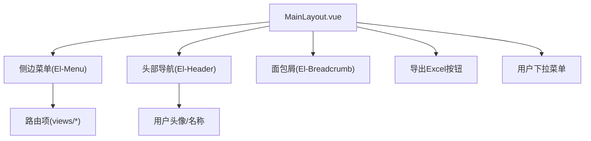

图表来源
- [frontend/src/layouts/MainLayout.vue:1-233](file://frontend/src/layouts/MainLayout.vue#L1-L233)

章节来源
- [frontend/src/layouts/MainLayout.vue:1-233](file://frontend/src/layouts/MainLayout.vue#L1-L233)

### 仪表盘与数据展示
- 统计卡片
  - 点击跳转对应页面，展示各类统计指标。
- 环境分布与到期提醒
  - 使用表格、进度条与标签展示数据。
- 最近更新记录
  - 展示最近的操作记录，支持空状态占位。

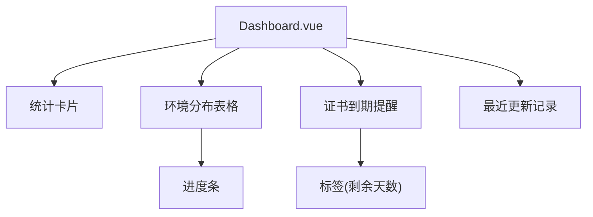

图表来源
- [frontend/src/views/Dashboard.vue:1-312](file://frontend/src/views/Dashboard.vue#L1-L312)

章节来源
- [frontend/src/views/Dashboard.vue:1-312](file://frontend/src/views/Dashboard.vue#L1-L312)

## 依赖分析
- 运行时依赖
  - Vue 3、Vue Router、Pinia、Element Plus、Axios、图标库。
- 开发依赖
  - Vite与Vue插件。
- 构建与运行
  - Vite配置启用Vue插件、本地开发服务器与代理规则。
  - TypeScript配置严格模式与Bundler解析策略。

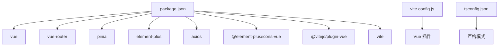

图表来源
- [frontend/package.json:1-24](file://frontend/package.json#L1-L24)
- [frontend/vite.config.js:1-17](file://frontend/vite.config.js#L1-L17)
- [frontend/tsconfig.json:1-27](file://frontend/tsconfig.json#L1-L27)

章节来源
- [frontend/package.json:1-24](file://frontend/package.json#L1-L24)
- [frontend/vite.config.js:1-17](file://frontend/vite.config.js#L1-L17)
- [frontend/tsconfig.json:1-27](file://frontend/tsconfig.json#L1-L27)

## 性能考虑
- 路由懒加载
  - 所有视图组件均采用动态导入，减少首屏体积。
- 组件级懒加载
  - 菜单项与视图组件均使用异步加载，提升初始渲染速度。
- 图标按需引入
  - 仅在需要的组件中引入图标，避免全量引入导致体积增大。
- Axios拦截器
  - 统一处理错误与401自动登出，减少重复逻辑与网络开销。
- 样式隔离
  - 使用scoped样式与CSS变量，避免全局污染并提升维护性。

章节来源
- [frontend/src/router/index.js:7-26](file://frontend/src/router/index.js#L7-L26)
- [frontend/src/views/Login.vue:1-114](file://frontend/src/views/Login.vue#L1-L114)
- [frontend/src/layouts/MainLayout.vue:1-233](file://frontend/src/layouts/MainLayout.vue#L1-L233)
- [frontend/src/api/request.js:1-54](file://frontend/src/api/request.js#L1-L54)
- [frontend/src/style.css:1-297](file://frontend/src/style.css#L1-L297)

## 故障排查指南
- 登录后无法进入受保护页面
  - 检查localStorage中是否存在令牌与用户信息；确认路由守卫逻辑与meta字段配置。
- 401错误频繁出现
  - 检查请求拦截器是否正确注入Authorization头；确认后端JWT签发与有效期。
- 导出功能失败
  - 检查导出接口返回的数据格式与Blob构造；确认浏览器下载行为与跨域配置。
- 图标不显示
  - 确认图标库安装与按需引入；检查SVG雪碧图路径与构建打包配置。

章节来源
- [frontend/src/router/index.js:36-58](file://frontend/src/router/index.js#L36-L58)
- [frontend/src/api/request.js:14-51](file://frontend/src/api/request.js#L14-L51)
- [frontend/src/layouts/MainLayout.vue:136-150](file://frontend/src/layouts/MainLayout.vue#L136-L150)
- [frontend/package.json:11-17](file://frontend/package.json#L11-L17)

## 结论
该Vue应用以清晰的分层结构与现代化工具链实现了云运维平台的前端骨架：路由守卫保障安全访问，Pinia集中管理用户状态，Element Plus提供丰富的UI能力，Axios统一处理HTTP请求与错误。通过懒加载与按需引入等手段优化性能，结合严格的TypeScript配置与Vite开发体验，为后续功能扩展提供了良好的基础。

## 附录
- 开发环境设置
  - 安装依赖后执行开发命令启动本地服务；通过Vite代理将/api转发至后端地址。
- TypeScript最佳实践
  - 启用严格模式与未使用检查；合理拆分类型与接口定义；利用Bundler解析策略提升类型发现效率。
- 样式与主题
  - 使用CSS变量与媒体查询适配深浅色主题；在布局组件中统一字体与间距规范。

章节来源
- [frontend/package.json:6-10](file://frontend/package.json#L6-L10)
- [frontend/vite.config.js:6-15](file://frontend/vite.config.js#L6-L15)
- [frontend/tsconfig.json:18-23](file://frontend/tsconfig.json#L18-L23)
- [frontend/src/style.css:1-51](file://frontend/src/style.css#L1-L51)
- [frontend/src/App.vue:8-17](file://frontend/src/App.vue#L8-L17)