# 前端架构设计

<cite>
**本文档引用的文件**
- [main.js](file://frontend/src/main.js)
- [App.vue](file://frontend/src/App.vue)
- [router/index.js](file://frontend/src/router/index.js)
- [stores/user.js](file://frontend/src/stores/user.js)
- [layouts/MainLayout.vue](file://frontend/src/layouts/MainLayout.vue)
- [api/request.js](file://frontend/src/api/request.js)
- [api/auth.js](file://frontend/src/api/auth.js)
- [api/export.js](file://frontend/src/api/export.js)
- [api/aliyunAccounts.js](file://frontend/src/api/aliyunAccounts.js)
- [api/servers.js](file://frontend/src/api/servers.js)
- [views/Login.vue](file://frontend/src/views/Login.vue)
- [views/Dashboard.vue](file://frontend/src/views/Dashboard.vue)
- [views/AliyunAccounts.vue](file://frontend/src/views/AliyunAccounts.vue)
- [views/ServerDetail.vue](file://frontend/src/views/ServerDetail.vue)
- [views/Servers.vue](file://frontend/src/views/Servers.vue)
- [views/Users.vue](file://frontend/src/views/Users.vue)
- [components/PasswordDisplay.vue](file://frontend/src/components/PasswordDisplay.vue)
- [api/dashboard.js](file://frontend/src/api/dashboard.js)
- [package.json](file://frontend/package.json)
- [vite.config.js](file://frontend/vite.config.js)
- [tsconfig.json](file://frontend/tsconfig.json)
- [style.css](file://frontend/src/style.css)
</cite>

## 更新摘要
**所做更改**
- 更新了路由配置，新增阿里云账户管理和用户管理路由
- 扩展了API服务层，新增导出Excel、阿里云账户、服务器详情等API模块
- 修改了布局组件，增加了阿里云账户和用户管理菜单项
- 新增了服务器详情页面和完整的用户管理系统
- 更新了开发代理配置，反映后端服务地址变更

## 目录
1. [简介](#简介)
2. [项目结构](#项目结构)
3. [核心组件](#核心组件)
4. [架构总览](#架构总览)
5. [详细组件分析](#详细组件分析)
6. [依赖关系分析](#依赖关系分析)
7. [性能考虑](#性能考虑)
8. [故障排除指南](#故障排除指南)
9. [结论](#结论)
10. [附录](#附录)

## 简介
本设计文档面向云运维平台前端架构，围绕 Vue 3 Composition API 的应用、组件化开发模式、状态管理最佳实践、路由守卫权限控制、HTTP 请求封装与拦截器、Element Plus 组件库集成、SPA 导航模式、响应式布局与用户体验优化进行系统性阐述。文档同时提供组件通信模式、数据流向管理、错误处理机制说明，并给出开发规范与最佳实践建议。

**更新** 本次更新重点加强了企业级运维管理功能，包括服务器资产管理、阿里云账户管理、用户权限管理等核心业务模块，完善了平台的完整运维管理能力。

## 项目结构
前端采用基于功能模块的分层组织方式：
- 入口与框架装配：main.js 负责应用初始化、插件注册（Pinia、Router、Element Plus）与全局样式挂载。
- 视图层：views 目录按业务页面划分，包含登录、仪表盘、服务器管理、服务管理、应用系统、域名管理、证书管理、阿里云账户、更新记录、定时任务、用户管理、修改密码等页面。
- 布局层：layouts 提供主布局 MainLayout.vue，统一头部、侧边菜单、面包屑与内容区域。
- 状态管理：stores 使用 Pinia，当前包含用户状态模块 user.js。
- API 层：api 目录按业务模块拆分，统一通过 request.js 封装 Axios 并配置拦截器，新增导出Excel、阿里云账户、服务器详情等API模块。
- 组件库：components 提供可复用的通用组件，如密码显示组件 PasswordDisplay.vue。
- 构建与配置：package.json 定义依赖与脚本；vite.config.js 配置开发服务器与代理；tsconfig.json 提供 TypeScript 编译选项；style.css 提供全局样式与暗色主题支持。

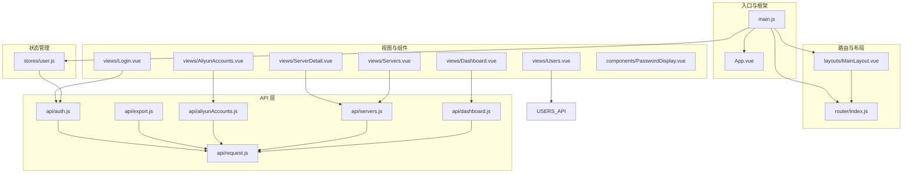

**图表来源**
- [main.js:1-23](file://frontend/src/main.js#L1-L23)
- [router/index.js:1-63](file://frontend/src/router/index.js#L1-L63)
- [stores/user.js:1-41](file://frontend/src/stores/user.js#L1-L41)
- [api/request.js:1-54](file://frontend/src/api/request.js#L1-L54)
- [api/export.js:1-8](file://frontend/src/api/export.js#L1-L8)
- [api/aliyunAccounts.js:1-18](file://frontend/src/api/aliyunAccounts.js#L1-L18)
- [api/servers.js:1-26](file://frontend/src/api/servers.js#L1-L26)
- [views/AliyunAccounts.vue:1-192](file://frontend/src/views/AliyunAccounts.vue#L1-L192)
- [views/ServerDetail.vue:1-156](file://frontend/src/views/ServerDetail.vue#L1-L156)
- [views/Servers.vue:1-325](file://frontend/src/views/Servers.vue#L1-L325)
- [views/Users.vue:1-297](file://frontend/src/views/Users.vue#L1-L297)

**章节来源**
- [main.js:1-23](file://frontend/src/main.js#L1-L23)
- [router/index.js:1-63](file://frontend/src/router/index.js#L1-L63)
- [stores/user.js:1-41](file://frontend/src/stores/user.js#L1-L41)
- [api/request.js:1-54](file://frontend/src/api/request.js#L1-L54)
- [package.json:1-24](file://frontend/package.json#L1-L24)
- [vite.config.js:1-17](file://frontend/vite.config.js#L1-L17)
- [tsconfig.json:1-27](file://frontend/tsconfig.json#L1-L27)
- [style.css:1-297](file://frontend/src/style.css#L1-L297)

## 核心组件
- 应用入口与插件装配：在入口文件中完成 Vue 实例创建、Pinia、Router、Element Plus 插件注册，并批量注册 Element Plus 图标组件。
- 路由与导航：定义登录页与受保护页面路由，使用 beforeEach 实现鉴权与管理员权限校验，新增阿里云账户和用户管理路由。
- 状态管理：使用 Pinia 的组合式 Store 管理用户 Token、用户信息、登录态与管理员角色计算属性，提供设置、拉取资料与登出方法。
- HTTP 请求封装：Axios 实例统一配置基础路径、超时与请求头；请求拦截器自动附加 JWT Token；响应拦截器统一处理业务错误码与 401 未授权跳转。
- 布局与导航：MainLayout 提供侧边菜单、顶部导航、面包屑与内容区，支持菜单折叠、导出 Excel、用户下拉操作，新增阿里云账户和用户管理菜单项。
- 视图组件：Login 实现表单校验与登录流程；Dashboard 展示统计卡片、环境分布与到期提醒等数据；新增服务器管理、阿里云账户管理、用户管理等完整业务页面。
- 通用组件：PasswordDisplay 提供密码显示/隐藏与复制能力，兼容剪贴板 API 降级方案。

**更新** 新增了完整的服务器资产管理功能，包括服务器列表管理、服务器详情查看、阿里云账户管理、用户权限管理等企业级运维功能。

**章节来源**
- [main.js:1-23](file://frontend/src/main.js#L1-L23)
- [router/index.js:35-58](file://frontend/src/router/index.js#L35-L58)
- [stores/user.js:5-40](file://frontend/src/stores/user.js#L5-L40)
- [api/request.js:13-51](file://frontend/src/api/request.js#L13-L51)
- [layouts/MainLayout.vue:98-151](file://frontend/src/layouts/MainLayout.vue#L98-L151)
- [views/Login.vue:27-67](file://frontend/src/views/Login.vue#L27-L67)
- [views/Dashboard.vue:129-190](file://frontend/src/views/Dashboard.vue#L129-L190)
- [components/PasswordDisplay.vue:11-46](file://frontend/src/components/PasswordDisplay.vue#L11-L46)

## 架构总览
前端采用"入口装配 → 路由守卫 → 状态管理 → API 层 → 视图组件"的分层架构。Element Plus 作为 UI 基础库贯穿各页面，提供统一的交互体验与视觉风格。构建工具 Vite 提供开发服务器与代理，便于前后端联调。

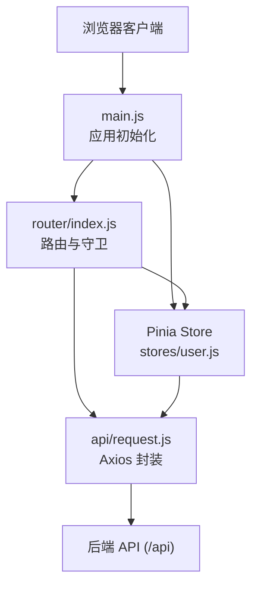

**图表来源**
- [main.js:10-22](file://frontend/src/main.js#L10-L22)
- [router/index.js:30-61](file://frontend/src/router/index.js#L30-L61)
- [stores/user.js:1-41](file://frontend/src/stores/user.js#L1-L41)
- [api/request.js:5-11](file://frontend/src/api/request.js#L5-L11)

## 详细组件分析

### 路由与权限控制
- 路由定义：登录页标记为无需认证；其余页面嵌套在主布局下，包含仪表盘、服务器管理、服务管理、应用系统、域名管理、证书管理、阿里云账户、更新记录、定时任务、用户管理、修改密码等。
- 权限控制：
  - 未登录访问受保护路由跳转登录；
  - 登录页若检测到有效 Token 自动跳转仪表盘；
  - 管理员专用路由需校验用户角色为 admin。
- 导航标题：通过路由 meta.title 动态设置面包屑标题。
- 新增路由：阿里云账户管理（requiresAdmin: true）和用户管理（requiresAdmin: true）路由。

**更新** 新增了阿里云账户管理和用户管理两个管理员专用路由，完善了平台的企业级管理功能。

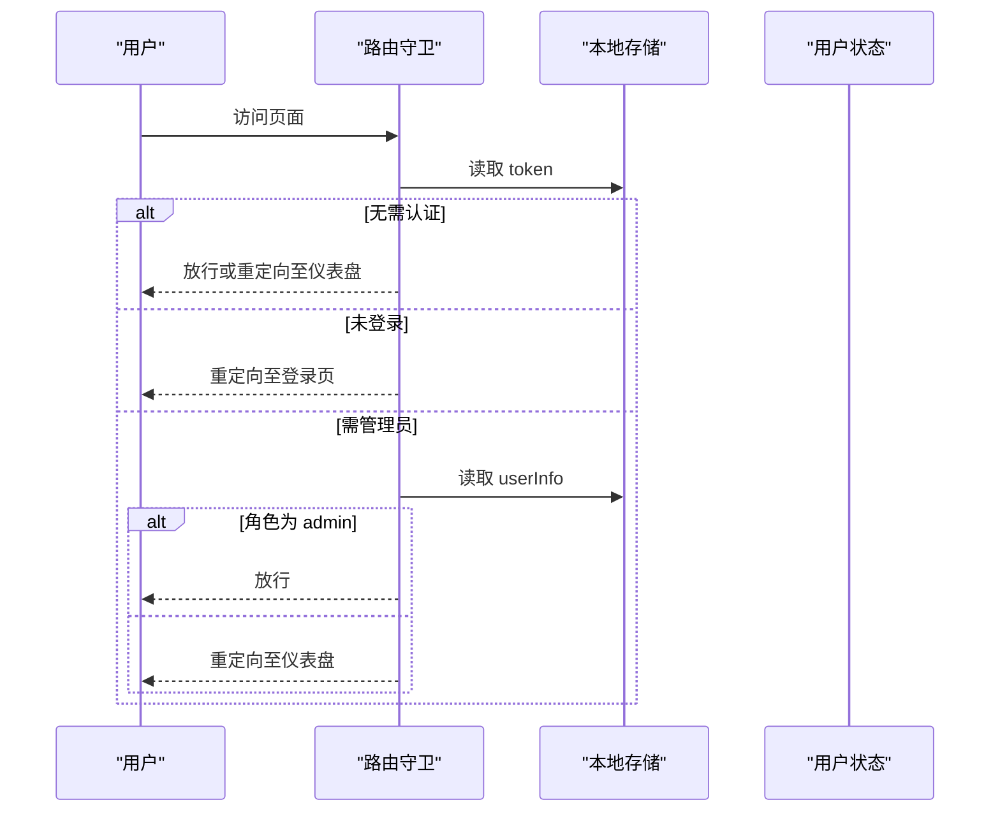

**图表来源**
- [router/index.js:36-58](file://frontend/src/router/index.js#L36-L58)

**章节来源**
- [router/index.js:3-28](file://frontend/src/router/index.js#L3-L28)
- [router/index.js:35-58](file://frontend/src/router/index.js#L35-L58)

### 状态管理（Pinia）
- 数据持久化：Token 与用户信息从 localStorage 初始化并在 Store 内同步更新。
- 计算属性：登录态与管理员角色基于 Token 与用户信息派生。
- 方法：设置 Token/用户信息、拉取用户资料、登出清理本地存储。
- 与路由联动：登录成功后写入 Token 与用户信息，触发路由跳转。

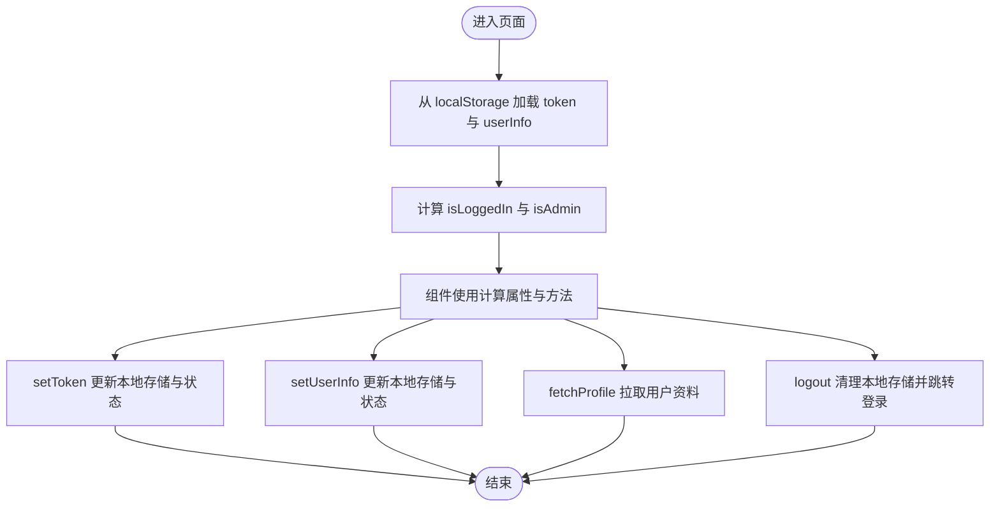

**图表来源**
- [stores/user.js:6-37](file://frontend/src/stores/user.js#L6-L37)

**章节来源**
- [stores/user.js:1-41](file://frontend/src/stores/user.js#L1-L41)

### HTTP 请求封装与拦截器
- Axios 实例：基础路径 /api、超时 15 秒、JSON 头。
- 请求拦截器：自动在 Authorization 头添加 Bearer Token。
- 响应拦截器：
  - 业务错误码：读取响应中的 code 字段，非 200 统一弹出错误消息并拒绝 Promise。
  - 401 未授权：清除本地存储并跳转登录，提示会话过期。
  - 其他错误：根据状态码或错误对象提示网络或业务异常。
- API 模块：auth.js、export.js、aliyunAccounts.js、servers.js 等仅负责调用封装好的 request 实例，保持职责单一。

**更新** 新增了导出Excel、阿里云账户、服务器详情等API模块，完善了数据导出和资产管理功能。

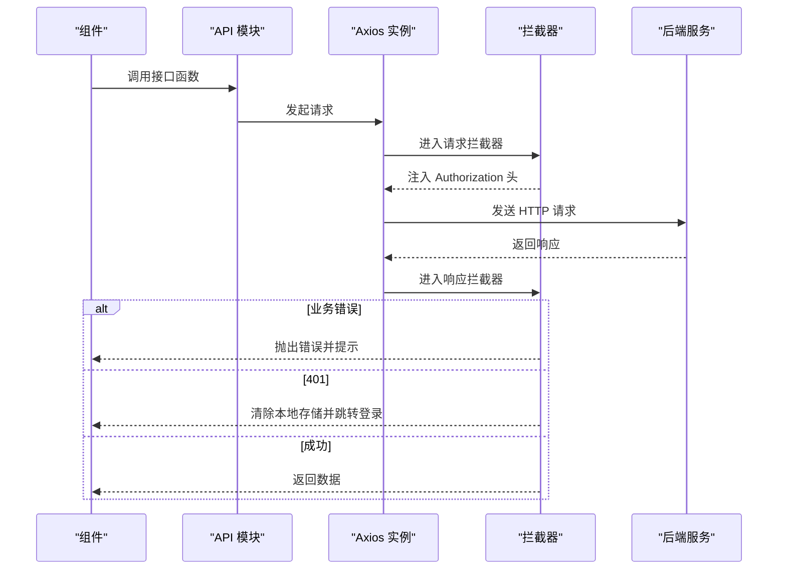

**图表来源**
- [api/request.js:13-51](file://frontend/src/api/request.js#L13-L51)
- [api/auth.js:1-14](file://frontend/src/api/auth.js#L1-L14)
- [api/export.js:1-8](file://frontend/src/api/export.js#L1-L8)
- [api/aliyunAccounts.js:1-18](file://frontend/src/api/aliyunAccounts.js#L1-L18)
- [api/servers.js:1-26](file://frontend/src/api/servers.js#L1-L26)

**章节来源**
- [api/request.js:1-54](file://frontend/src/api/request.js#L1-L54)
- [api/auth.js:1-14](file://frontend/src/api/auth.js#L1-L14)
- [api/export.js:1-8](file://frontend/src/api/export.js#L1-L8)
- [api/aliyunAccounts.js:1-18](file://frontend/src/api/aliyunAccounts.js#L1-L18)
- [api/servers.js:1-26](file://frontend/src/api/servers.js#L1-L26)

### 布局与导航（MainLayout）
- 侧边菜单：基于 el-menu，支持折叠与路由跳转；根据当前路由激活对应菜单项；管理员可见阿里云账户和用户管理菜单。
- 顶部导航：面包屑标题来自路由 meta.title；提供导出 Excel 与用户下拉菜单（修改密码、退出登录）。
- 用户操作：退出登录前确认对话框，成功后清理状态并跳转登录。

**更新** 新增了阿里云账户和用户管理菜单项，仅管理员可见，完善了平台的管理功能。

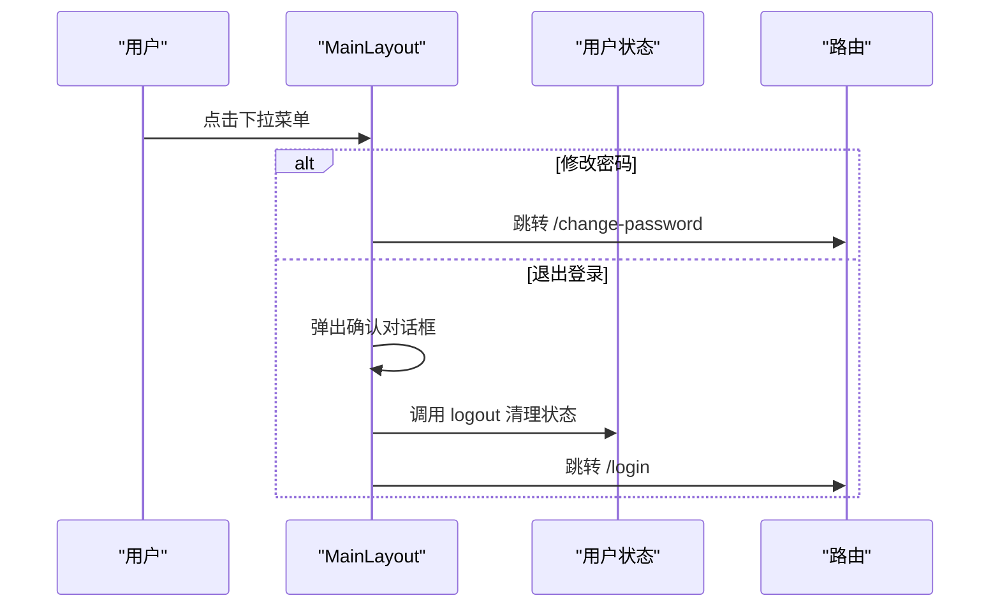

**图表来源**
- [layouts/MainLayout.vue:120-134](file://frontend/src/layouts/MainLayout.vue#L120-L134)
- [layouts/MainLayout.vue:128-132](file://frontend/src/layouts/MainLayout.vue#L128-L132)
- [stores/user.js:32-37](file://frontend/src/stores/user.js#L32-L37)

**章节来源**
- [layouts/MainLayout.vue:1-241](file://frontend/src/layouts/MainLayout.vue#L1-L241)

### 登录流程（Login）
- 表单校验：基于 Element Plus 表单规则，支持 Enter 键提交。
- 登录请求：调用 auth.login 接口，成功后写入 Token 与用户信息，提示成功并跳转仪表盘。
- 加载状态：防止重复提交。

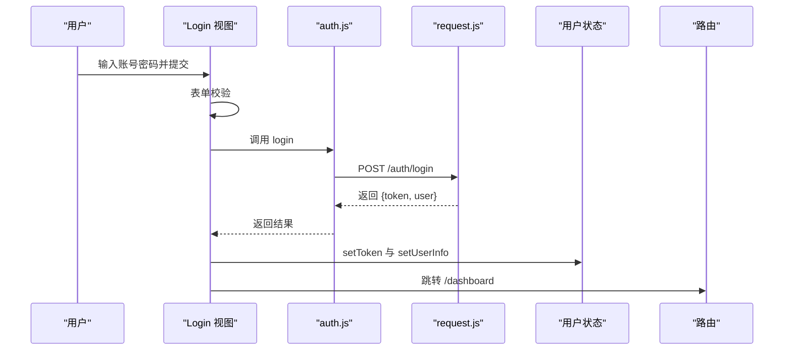

**图表来源**
- [views/Login.vue:50-66](file://frontend/src/views/Login.vue#L50-L66)
- [api/auth.js:3-5](file://frontend/src/api/auth.js#L3-L5)
- [stores/user.js:13-21](file://frontend/src/stores/user.js#L13-L21)

**章节来源**
- [views/Login.vue:1-114](file://frontend/src/views/Login.vue#L1-L114)
- [api/auth.js:1-14](file://frontend/src/api/auth.js#L1-L14)
- [stores/user.js:1-41](file://frontend/src/stores/user.js#L1-L41)

### 仪表盘（Dashboard）
- 数据加载：组件挂载时调用 dashboard.stats 接口，合并返回数据到响应式对象。
- 展示逻辑：统计卡片点击跳转对应列表页；环境分布表格使用进度条展示占比；到期提醒表格按剩余天数着色；最近记录表格展示变更详情。
- 性能优化：使用 v-loading 控制加载状态，空数据时显示占位。

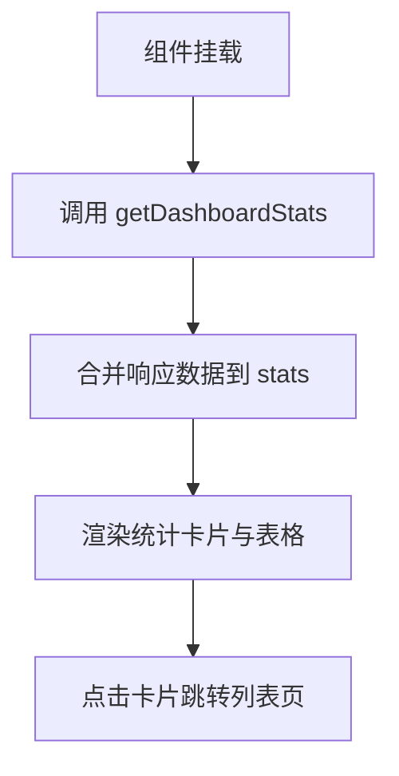

**图表来源**
- [views/Dashboard.vue:146-158](file://frontend/src/views/Dashboard.vue#L146-L158)
- [views/Dashboard.vue:160-189](file://frontend/src/views/Dashboard.vue#L160-L189)
- [api/dashboard.js:3-5](file://frontend/src/api/dashboard.js#L3-L5)

**章节来源**
- [views/Dashboard.vue:1-312](file://frontend/src/views/Dashboard.vue#L1-L312)
- [api/dashboard.js:1-6](file://frontend/src/api/dashboard.js#L1-L6)

### 服务器管理（Servers）
- 数据管理：支持环境类型筛选、关键词搜索、分页查询；提供新增、编辑、删除完整CRUD操作。
- 表单验证：基于 Element Plus 表单规则，支持必填字段验证和密码输入。
- 操作流程：新增/编辑弹窗、表单校验、API调用、成功提示、数据刷新。

**更新** 新增了完整的服务器资产管理功能，包括服务器列表管理、新增编辑、详情查看等完整功能。

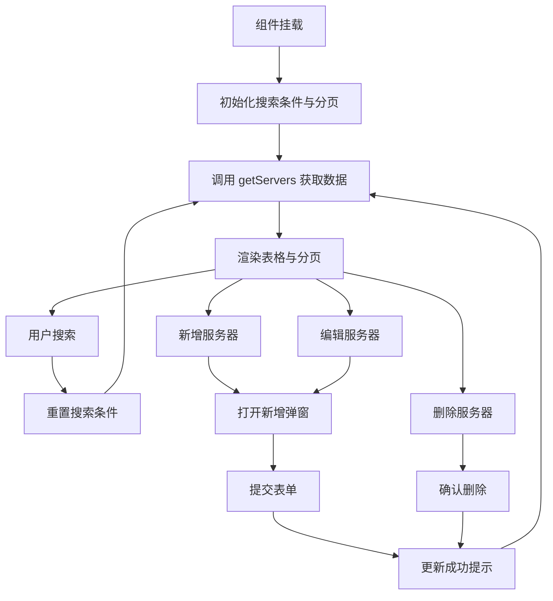

**图表来源**
- [views/Servers.vue:218-231](file://frontend/src/views/Servers.vue#L218-L231)
- [views/Servers.vue:251-267](file://frontend/src/views/Servers.vue#L251-L267)
- [views/Servers.vue:289-299](file://frontend/src/views/Servers.vue#L289-L299)

**章节来源**
- [views/Servers.vue:1-325](file://frontend/src/views/Servers.vue#L1-L325)
- [api/servers.js:1-26](file://frontend/src/api/servers.js#L1-L26)

### 服务器详情（ServerDetail）
- 页面导航：包含面包屑导航和返回按钮，支持从服务器列表跳转。
- 信息展示：使用 el-descriptions 展示服务器详细信息，包括环境类型标签、系统信息、密码信息等。
- 关联服务：展示与服务器关联的服务列表，支持服务详情查看。

**更新** 新增了服务器详情页面，提供服务器资产的详细信息展示和关联服务管理。

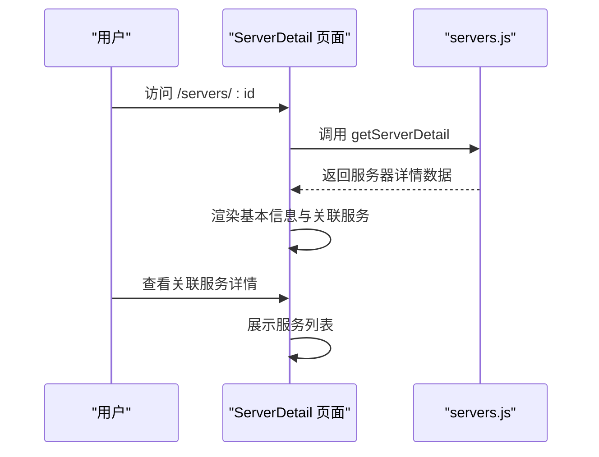

**图表来源**
- [views/ServerDetail.vue:86-102](file://frontend/src/views/ServerDetail.vue#L86-L102)
- [api/servers.js:7-8](file://frontend/src/api/servers.js#L7-L8)

**章节来源**
- [views/ServerDetail.vue:1-156](file://frontend/src/views/ServerDetail.vue#L1-L156)
- [api/servers.js:1-26](file://frontend/src/api/servers.js#L1-L26)

### 阿里云账户管理（AliyunAccounts）
- 账户管理：支持账户名称、AccessKey ID/Secret、状态、描述等字段管理。
- 安全处理：编辑时对AccessKey Secret进行脱敏处理，避免敏感信息泄露。
- 操作流程：列表展示、新增/编辑弹窗、删除确认、表单验证、API调用。

**更新** 新增了阿里云账户管理功能，支持多云账户的集中管理，完善了平台的云资源管理能力。

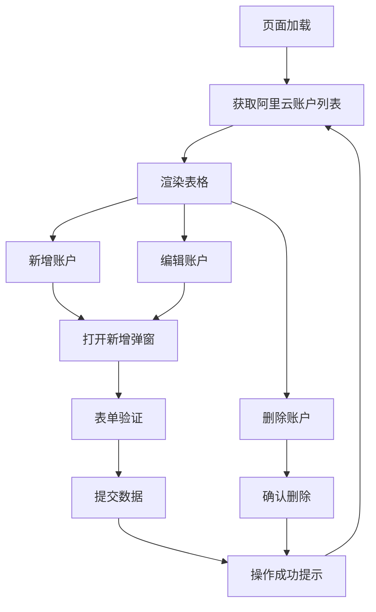

**图表来源**
- [views/AliyunAccounts.vue:98-110](file://frontend/src/views/AliyunAccounts.vue#L98-L110)
- [views/AliyunAccounts.vue:118-130](file://frontend/src/views/AliyunAccounts.vue#L118-L130)
- [views/AliyunAccounts.vue:166-176](file://frontend/src/views/AliyunAccounts.vue#L166-L176)

**章节来源**
- [views/AliyunAccounts.vue:1-192](file://frontend/src/views/AliyunAccounts.vue#L1-L192)
- [api/aliyunAccounts.js:1-18](file://frontend/src/api/aliyunAccounts.js#L1-L18)

### 用户管理（Users）
- 用户管理：支持用户名、显示名、角色、状态等字段管理，管理员专用功能。
- 权限控制：当前登录用户不能修改自己的角色，防止权限滥用。
- 密码管理：支持用户密码重置功能，增强安全管理。
- 操作流程：列表展示、新增/编辑弹窗、删除确认、密码重置弹窗、API调用。

**更新** 新增了完整的用户管理系统，支持用户生命周期管理，完善了平台的权限管理体系。

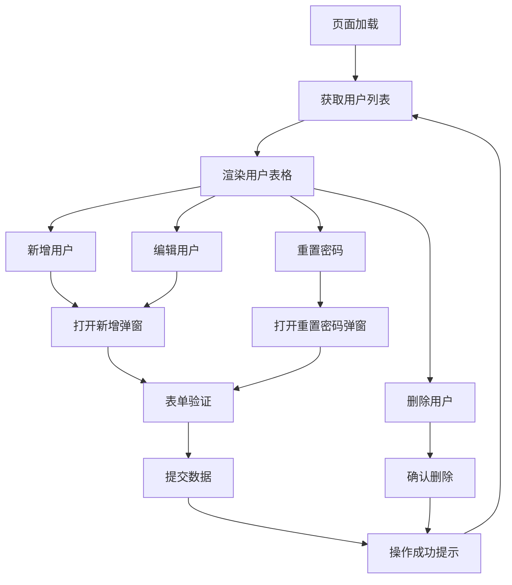

**图表来源**
- [views/Users.vue:164-176](file://frontend/src/views/Users.vue#L164-L176)
- [views/Users.vue:193-205](file://frontend/src/views/Users.vue#L193-L205)
- [views/Users.vue:249-263](file://frontend/src/views/Users.vue#L249-L263)

**章节来源**
- [views/Users.vue:1-297](file://frontend/src/views/Users.vue#L1-L297)

### 通用组件（PasswordDisplay）
- 功能：显示明文/密文切换、一键复制密码、降级复制方案。
- 交互：点击文本切换显示，点击复制图标执行复制，成功提示。

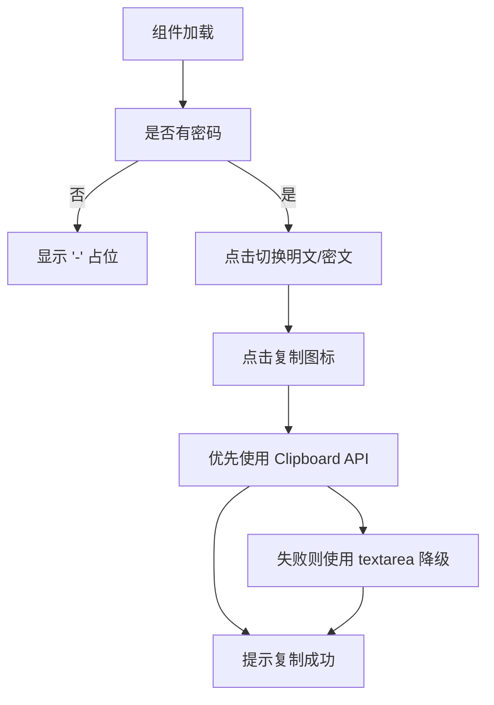

**图表来源**
- [components/PasswordDisplay.vue:25-45](file://frontend/src/components/PasswordDisplay.vue#L25-L45)

**章节来源**
- [components/PasswordDisplay.vue:1-85](file://frontend/src/components/PasswordDisplay.vue#L1-L85)

### 开发代理配置更新
**更新** 开发代理配置已更新，将 API 代理目标从 `http://192.168.1.110:5000` 更新为 `http://192.168.1.124:5000`，反映开发环境网络基础设施调整。

- Vite 开发服务器代理：配置 /api 前缀请求转发到新的后端服务地址。
- 代理设置：changeOrigin 设置为 true，确保代理请求的主机头正确。
- 开发环境影响：仅影响开发环境的 API 请求转发，生产环境通过 Nginx 反向代理处理。

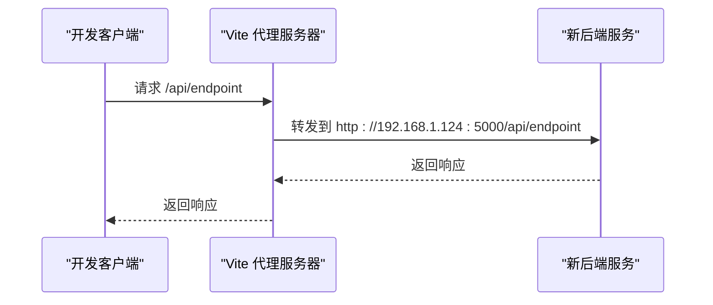

**图表来源**
- [vite.config.js:9-14](file://frontend/vite.config.js#L9-L14)

**章节来源**
- [vite.config.js:1-17](file://frontend/vite.config.js#L1-L17)

## 依赖关系分析
- 框架与库：Vue 3、Vue Router、Pinia、Element Plus、Axios。
- 构建工具：Vite，配置开发服务器与 /api 代理到后端服务。
- 类型检查：TypeScript 编译选项启用严格模式与语法擦除，提升代码质量。

**更新** 新增了多个API模块依赖，包括导出Excel、阿里云账户、服务器管理、用户管理等功能模块。

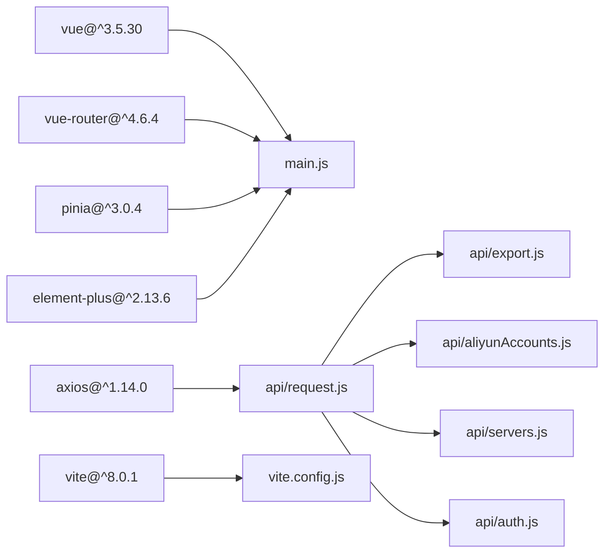

**图表来源**
- [package.json:11-22](file://frontend/package.json#L11-L22)
- [main.js:1-23](file://frontend/src/main.js#L1-L23)
- [api/request.js:1-54](file://frontend/src/api/request.js#L1-L54)
- [vite.config.js:4-16](file://frontend/vite.config.js#L4-L16)

**章节来源**
- [package.json:1-24](file://frontend/package.json#L1-L24)
- [vite.config.js:1-17](file://frontend/vite.config.js#L1-L17)
- [tsconfig.json:1-27](file://frontend/tsconfig.json#L1-L27)

## 性能考虑
- 组件懒加载：路由组件使用动态导入，减少首屏体积。
- 请求缓存：可在 Store 或组件内增加简单缓存策略，避免重复请求相同数据。
- 图标按需引入：当前在入口批量注册了 Element Plus 图标，建议后续改为按需引入以减小包体。
- 虚拟滚动：大数据表格可考虑虚拟滚动优化渲染性能。
- 资源压缩：构建时开启压缩与 Tree Shaking，确保生产环境最小化。
- 分页加载：服务器管理等大数据场景使用分页加载，提升用户体验。

**更新** 新增了分页加载优化，服务器管理页面支持分页查询，避免大量数据一次性加载导致的性能问题。

## 故障排除指南
- 登录后无法跳转：检查路由守卫逻辑与 Token 写入是否正确。
- 401 未授权频繁：确认请求拦截器是否正确注入 Authorization 头，后端 JWT 签发与有效期配置。
- 导出失败：检查导出接口返回的数据格式与 Blob 创建参数，确认浏览器下载权限。
- 菜单不激活：确认路由 path 与菜单 index 匹配，以及子路由前缀判断逻辑。
- 复制失败降级：确认浏览器 Clipboard API 权限与 textarea 降级方案可用性。
- 开发代理问题：确认 Vite 代理配置正确指向新的后端地址，检查网络连通性。
- 服务器管理异常：检查服务器API接口返回格式，确认分页参数传递正确。
- 阿里云账户安全：确认AccessKey脱敏处理逻辑，避免敏感信息泄露。
- 用户管理权限：确认当前用户角色，管理员才能访问用户管理功能。

**更新** 新增了服务器管理、阿里云账户管理、用户管理等新功能的故障排除指导。

**章节来源**
- [router/index.js:36-58](file://frontend/src/router/index.js#L36-L58)
- [api/request.js:14-51](file://frontend/src/api/request.js#L14-L51)
- [layouts/MainLayout.vue:136-150](file://frontend/src/layouts/MainLayout.vue#L136-L150)
- [components/PasswordDisplay.vue:29-45](file://frontend/src/components/PasswordDisplay.vue#L29-L45)
- [vite.config.js:9-14](file://frontend/vite.config.js#L9-L14)

## 结论
该前端架构以 Vue 3 Composition API 为核心，结合 Pinia 实现轻量高效的状态管理，通过 Axios 封装与拦截器统一处理请求与错误，配合 Element Plus 提供一致的 UI 体验。路由守卫保障了基本的权限控制，布局组件实现了统一的导航与交互模式。本次更新增强了企业级运维管理能力，新增了服务器资产管理、阿里云账户管理、用户权限管理等核心功能，进一步完善了平台的完整运维管理解决方案。整体结构清晰、职责明确，具备良好的扩展性与维护性。

## 附录
- 开发规范建议
  - 组件命名：采用 PascalCase，功能明确的目录结构。
  - API 设计：每个业务模块独立文件，遵循 REST 风格，错误码统一处理。
  - 状态管理：Store 仅存放跨组件共享状态，避免过度复杂。
  - 路由设计：meta 字段统一管理页面标题与权限标识。
  - 样式管理：优先使用 scoped 样式，必要时抽取公共样式。
  - TypeScript：启用严格模式，为 Store 与组件补充类型声明。
  - 安全规范：敏感信息（如密码、AccessKey）必须进行脱敏处理。
  - 权限控制：管理员功能必须进行角色校验，防止越权操作。
- 性能优化清单
  - 启用路由组件懒加载与图片资源优化。
  - 减少不必要的响应式数据与深层嵌套。
  - 使用 v-loading 与骨架屏提升感知性能。
  - 生产环境开启 Gzip/Br 压缩与 CDN。
  - 大数据表格启用分页加载，避免一次性渲染过多数据。
- 开发环境配置
  - Vite 开发服务器：端口 3000，host 0.0.0.0
  - API 代理：/api 前缀转发到 http://192.168.1.124:5000
  - 代理配置：changeOrigin=true，确保正确的主机头传递
- 新功能开发指导
  - 遵循现有API模块结构，统一使用request.js封装。
  - 页面组件使用Composition API，保持代码一致性。
  - 管理员功能必须设置requiresAdmin标志。
  - 敏感数据处理必须考虑安全性，避免信息泄露。