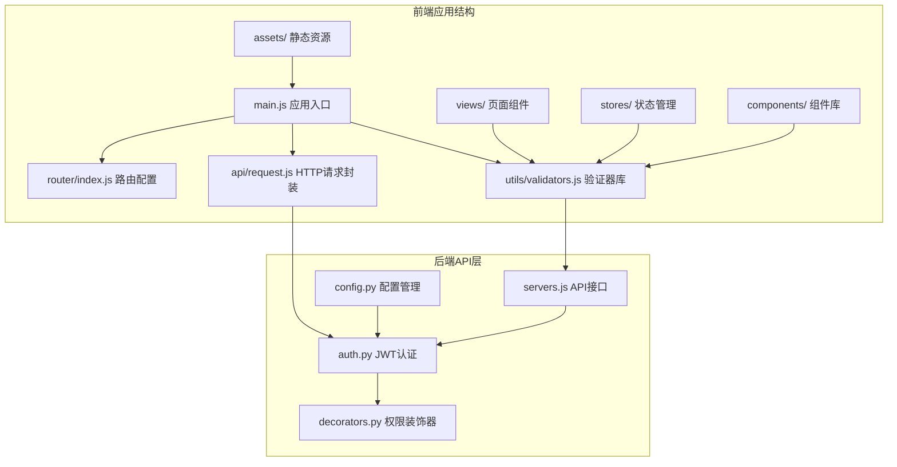
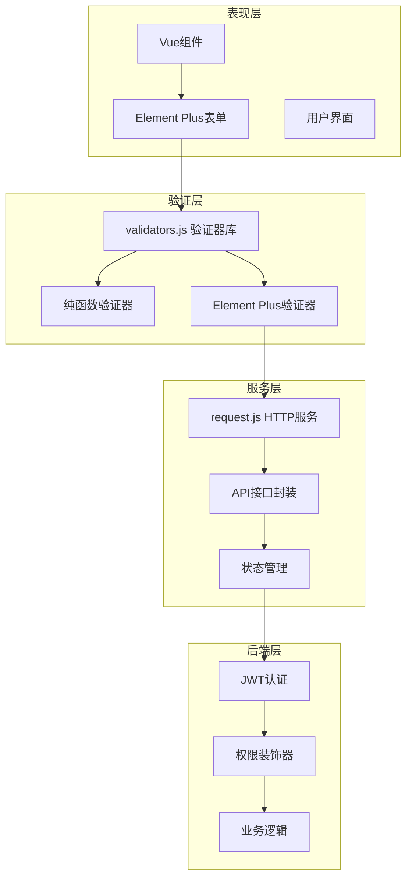
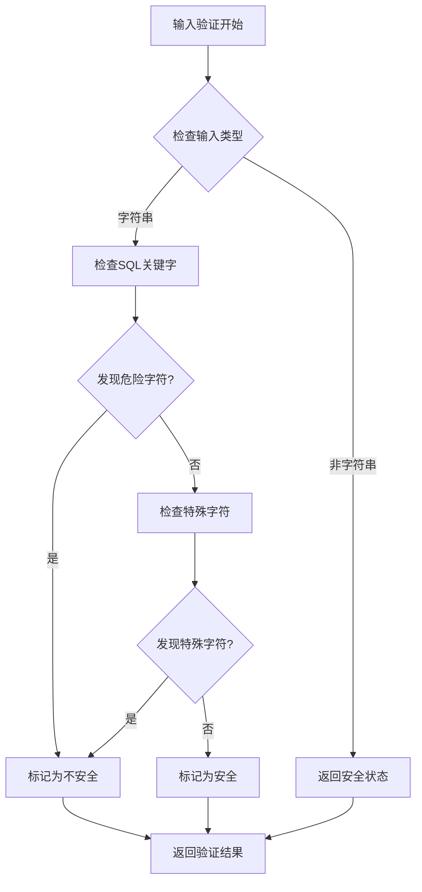
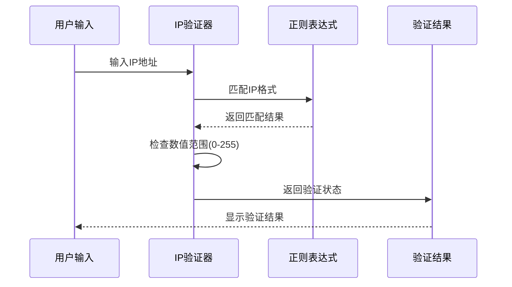
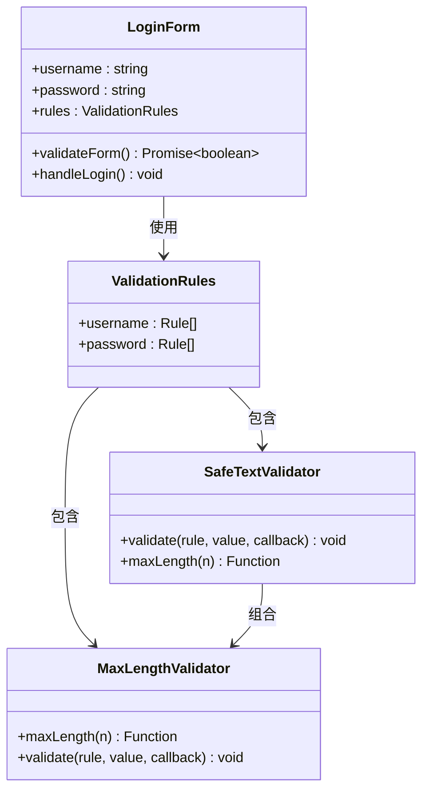
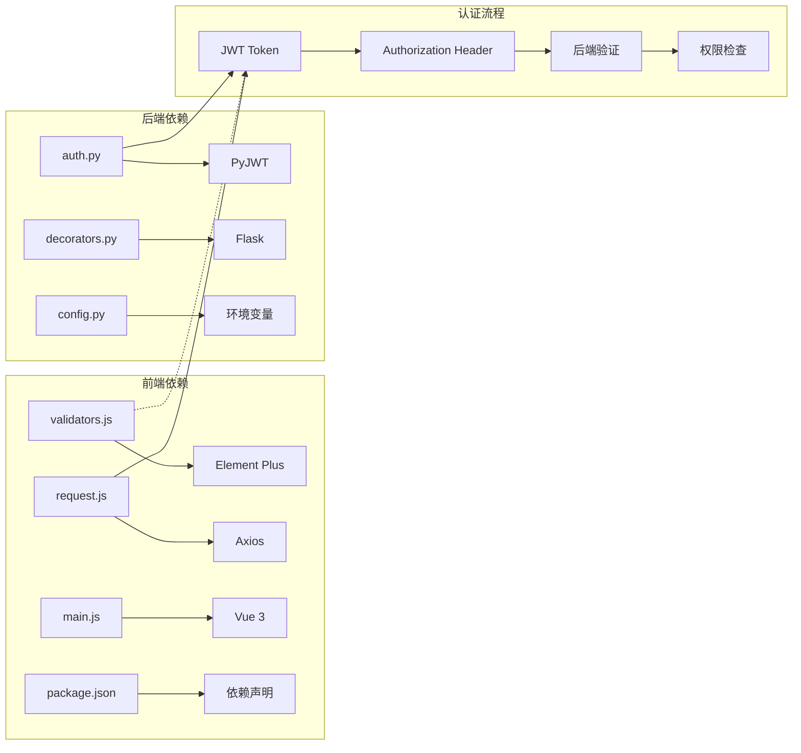

# 前端验证器系统

<cite>
**本文档引用的文件**
- [validators.js](file://frontend/src/utils/validators.js)
- [request.js](file://frontend/src/api/request.js)
- [main.js](file://frontend/src/main.js)
- [package.json](file://frontend/package.json)
- [Login.vue](file://frontend/src/views/Login.vue)
- [Servers.vue](file://frontend/src/views/Servers.vue)
- [Domains.vue](file://frontend/src/views/Domains.vue)
- [index.js](file://frontend/src/router/index.js)
- [user.js](file://frontend/src/stores/user.js)
- [auth.js](file://frontend/src/api/auth.js)
- [servers.js](file://frontend/src/api/servers.js)
- [auth.py](file://backend/app/utils/auth.py)
- [decorators.py](file://backend/app/utils/decorators.py)
- [config.py](file://backend/app/config.py)
</cite>

## 目录
1. [简介](#简介)
2. [项目结构](#项目结构)
3. [核心组件](#核心组件)
4. [架构概览](#架构概览)
5. [详细组件分析](#详细组件分析)
6. [依赖关系分析](#依赖关系分析)
7. [性能考虑](#性能考虑)
8. [故障排除指南](#故障排除指南)
9. [结论](#结论)

## 简介

前端验证器系统是一个完整的客户端数据验证解决方案，专为运维管理平台设计。该系统提供了多层次的安全验证机制，包括SQL注入防护、XSS攻击防护、格式验证和业务逻辑验证等功能。系统采用Element Plus框架构建，实现了统一的验证规则管理和实时反馈机制。

该验证器系统主要分为三个层次：
- **安全类验证器**：提供SQL注入和XSS攻击防护
- **格式类验证器**：验证IP地址、端口、域名、URL等格式
- **逻辑类验证器**：实现长度限制、密码强度等业务逻辑验证

## 项目结构

前端验证器系统位于Vue 3单页应用中，采用模块化组织方式：

**图表来源**
- [main.js:1-23](file://frontend/src/main.js#L1-L23)
- [validators.js:1-326](file://frontend/src/utils/validators.js#L1-L326)

**章节来源**
- [main.js:1-23](file://frontend/src/main.js#L1-L23)
- [package.json:1-24](file://frontend/package.json#L1-L24)

## 核心组件

### 验证器工具库

验证器工具库是整个系统的核心，提供了32种不同类型的验证器函数，按功能分为三大类别：

#### 安全类验证器
- **SQL注入防护**：检测SQL关键字和危险字符
- **XSS防护**：阻止恶意HTML和JavaScript代码
- **通用安全文本验证**：同时执行SQL和XSS双重防护

#### 格式类验证器
- **IPv4地址验证**：验证标准IP地址格式
- **端口验证**：支持单个和多个端口验证
- **域名验证**：支持通配符域名格式
- **URL验证**：仅允许HTTP/HTTPS协议
- **Cron表达式验证**：5段格式的时间调度表达式
- **Unix/Linux路径验证**：验证系统路径格式

#### 逻辑类验证器
- **长度限制验证器**：可配置的最大长度限制
- **密码强度验证**：确保密码包含字母和数字
- **端口范围验证**：验证端口号在指定范围内

**章节来源**
- [validators.js:6-326](file://frontend/src/utils/validators.js#L6-L326)

### HTTP请求封装

请求封装模块提供了统一的API调用接口，集成了JWT认证和错误处理机制：

- **JWT Token自动添加**：在请求头中自动添加认证信息
- **统一错误处理**：处理401、403等HTTP状态码
- **响应数据标准化**：统一API响应格式

**章节来源**
- [request.js:1-54](file://frontend/src/api/request.js#L1-L54)

### 路由守卫系统

路由守卫实现了基于角色的访问控制：

- **认证检查**：验证用户登录状态
- **权限验证**：基于角色的页面访问控制
- **动态路由跳转**：根据用户状态重定向到相应页面

**章节来源**
- [index.js:37-60](file://frontend/src/router/index.js#L37-L60)

## 架构概览

前端验证器系统采用分层架构设计，确保了代码的可维护性和扩展性：

**图表来源**
- [validators.js:1-326](file://frontend/src/utils/validators.js#L1-L326)
- [request.js:1-54](file://frontend/src/api/request.js#L1-L54)
- [auth.py:11-83](file://backend/app/utils/auth.py#L11-L83)

## 详细组件分析

### 安全验证器组件

安全验证器是系统最重要的防护层，提供了两层安全保护机制：

#### SQL注入防护机制

**图表来源**
- [validators.js:12-16](file://frontend/src/utils/validators.js#L12-L16)

#### XSS攻击防护机制

XSS防护通过检测常见的恶意脚本模式来保护系统：

- **脚本标签检测**：标签
- **iframe检测**：防止恶意嵌入
- **事件处理器检测**：onerror、onclick等事件
- **JavaScript协议检测**：javascript:协议

**章节来源**
- [validators.js:34-50](file://frontend/src/utils/validators.js#L34-L50)

### 格式验证器组件

格式验证器确保用户输入符合预期的数据格式：

#### IP地址验证流程

**图表来源**
- [validators.js:78-96](file://frontend/src/utils/validators.js#L78-L96)

#### 多端口验证机制

多端口验证支持以下格式：
- 单个端口：8080
- 多个端口：8080,8443,9000
- 端口范围：8000-8080

**章节来源**
- [validators.js:102-124](file://frontend/src/utils/validators.js#L102-L124)

### 业务逻辑验证器

业务逻辑验证器实现了复杂的验证规则：

#### 密码强度验证

密码强度验证确保密码满足安全要求：
- 最小长度：6个字符
- 必须包含字母
- 必须包含数字

#### 长度限制验证器

长度限制验证器是可配置的工厂函数，允许开发者指定最大字符数限制。

**章节来源**
- [validators.js:254-276](file://frontend/src/utils/validators.js#L254-L276)

### 组件集成分析

#### 登录页面验证集成

登录页面集成了多种验证器来确保用户凭据的安全性：

**图表来源**
- [Login.vue:46-56](file://frontend/src/views/Login.vue#L46-L56)
- [validators.js:62-71](file://frontend/src/utils/validators.js#L62-L71)

**章节来源**
- [Login.vue:34-74](file://frontend/src/views/Login.vue#L34-L74)

#### 服务器管理页面验证集成

服务器管理页面展示了复杂表单验证的最佳实践：

- **IP地址验证**：内网IP、映射IP、公网IP
- **文本内容验证**：主机名、用途描述等
- **长度限制**：不同字段的不同长度要求
- **必填字段**：关键信息的强制验证

**章节来源**
- [Servers.vue:230-285](file://frontend/src/views/Servers.vue#L230-L285)

#### 域名管理页面验证集成

域名管理页面实现了域名相关的专业验证：

- **域名格式验证**：支持通配符域名
- **成本数值验证**：费用范围限制
- **搜索内容安全验证**：防止恶意搜索

**章节来源**
- [Domains.vue:219-247](file://frontend/src/views/Domains.vue#L219-L247)

## 依赖关系分析

前端验证器系统与后端认证系统的依赖关系：

**图表来源**
- [package.json:11-17](file://frontend/package.json#L11-L17)
- [auth.py:4-8](file://backend/app/utils/auth.py#L4-L8)

**章节来源**
- [package.json:1-24](file://frontend/package.json#L1-L24)
- [auth.py:1-83](file://backend/app/utils/auth.py#L1-L83)

## 性能考虑

前端验证器系统在性能方面采用了多项优化策略：

### 验证器性能优化

1. **正则表达式优化**：使用高效的正则表达式模式
2. **早期返回机制**：在验证失败时立即返回，避免不必要的计算
3. **缓存机制**：对于重复验证的场景，可以考虑缓存验证结果

### 内存使用优化

1. **函数式编程**：验证器都是纯函数，便于垃圾回收
2. **最小状态管理**：验证器不维护持久状态
3. **按需加载**：验证器按需导入，减少初始加载时间

### 网络性能优化

1. **批量验证**：支持一次性验证多个字段
2. **异步验证**：对于复杂的验证逻辑使用异步处理
3. **防抖机制**：对于频繁触发的验证事件使用防抖

## 故障排除指南

### 常见验证问题

#### 验证器不生效

**问题症状**：表单提交时验证器不起作用

**可能原因**：
1. 验证器函数未正确导入
2. Element Plus验证器格式不正确
3. 表单模型绑定问题

**解决方法**：
1. 检查验证器导入语句
2. 确认验证器函数签名符合Element Plus要求
3. 验证表单模型与验证规则的字段名一致

#### 验证结果与预期不符

**问题症状**：验证结果与实际输入不匹配

**可能原因**：
1. 正则表达式模式不正确
2. 边界条件处理不当
3. 数据类型转换问题

**解决方法**：
1. 检查正则表达式模式
2. 添加边界条件测试用例
3. 确保数据类型正确转换

#### 性能问题

**问题症状**：页面响应缓慢，特别是大量数据验证时

**可能原因**：
1. 验证器过于复杂
2. 频繁的DOM操作
3. 缺乏防抖机制

**解决方法**：
1. 优化验证算法
2. 减少DOM操作次数
3. 实现防抖机制

**章节来源**
- [validators.js:12-16](file://frontend/src/utils/validators.js#L12-L16)
- [Servers.vue:357-375](file://frontend/src/views/Servers.vue#L357-L375)

## 结论

前端验证器系统是一个功能完整、结构清晰的客户端验证解决方案。该系统具有以下特点：

### 技术优势

1. **全面的安全防护**：提供了SQL注入和XSS攻击的双重防护
2. **多样化的验证类型**：涵盖了格式验证、业务逻辑验证等多种场景
3. **易于使用的API**：提供了简单易用的验证器函数
4. **良好的性能表现**：优化的验证算法和内存使用

### 架构特点

1. **模块化设计**：验证器独立于业务逻辑，便于维护和扩展
2. **统一的验证接口**：Element Plus验证器和纯函数验证器并存
3. **完善的错误处理**：提供了详细的错误信息和处理机制
4. **灵活的配置选项**：支持自定义验证规则和参数

### 应用价值

该验证器系统为运维管理平台提供了可靠的数据安全保障，确保了系统的稳定性和安全性。通过统一的验证规则和错误处理机制，提高了用户体验和开发效率。

未来可以考虑的功能扩展包括：
- 更多格式验证器的添加
- 自定义验证器的扩展机制
- 验证器性能监控和分析
- 更丰富的错误消息本地化支持