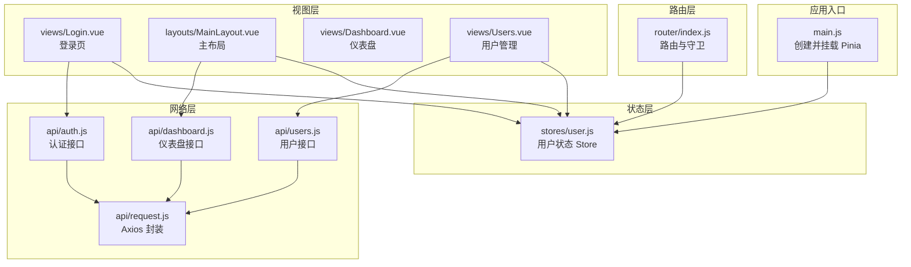
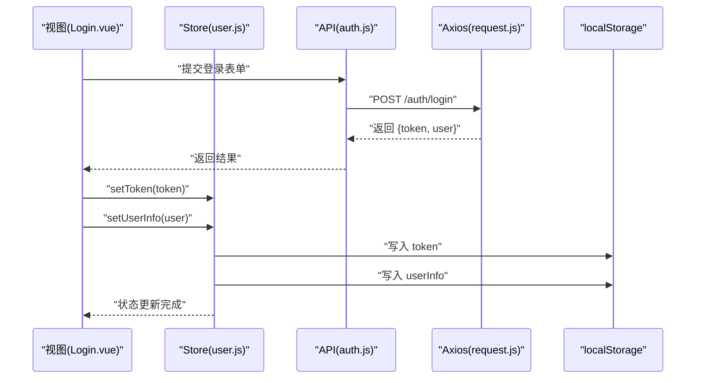
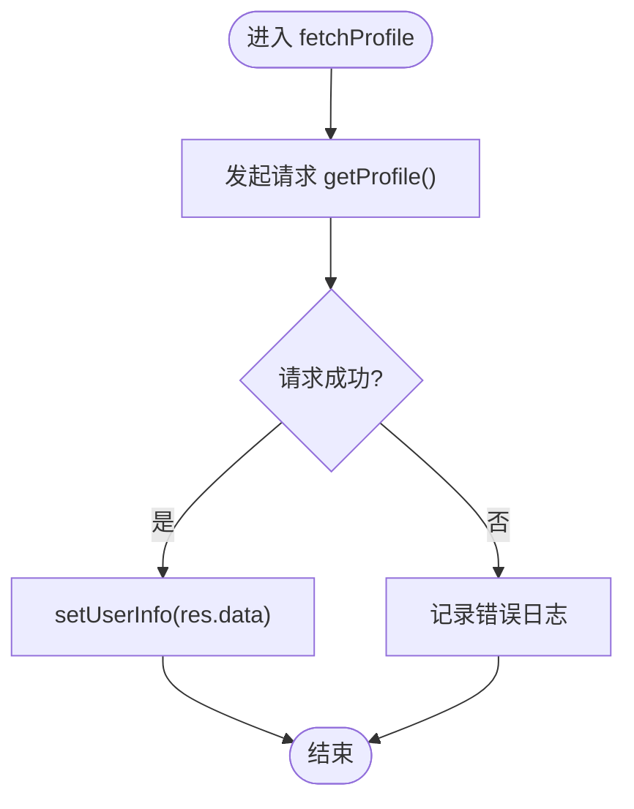
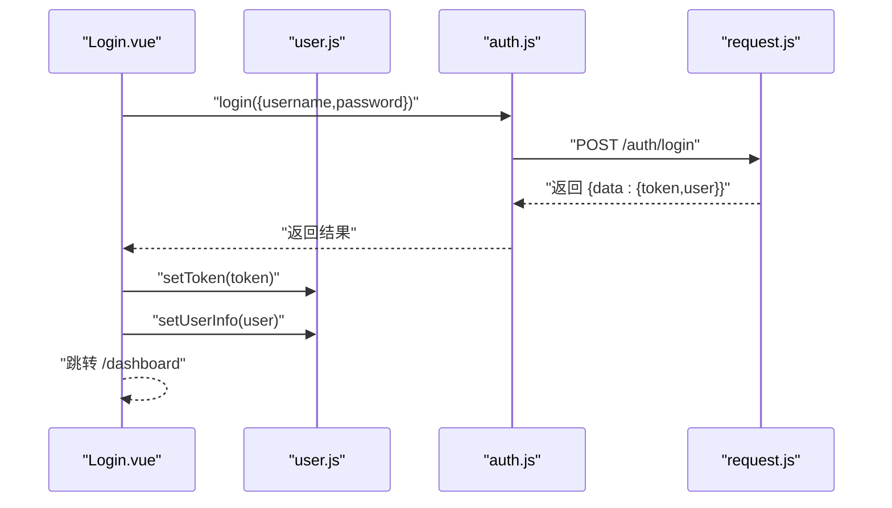
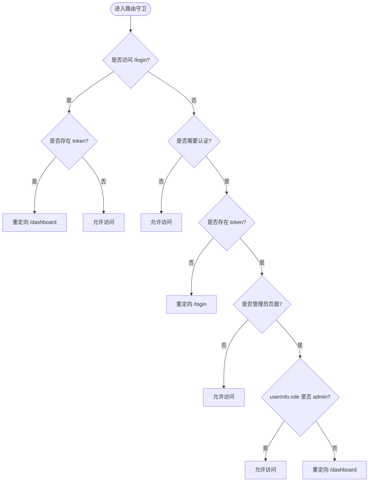
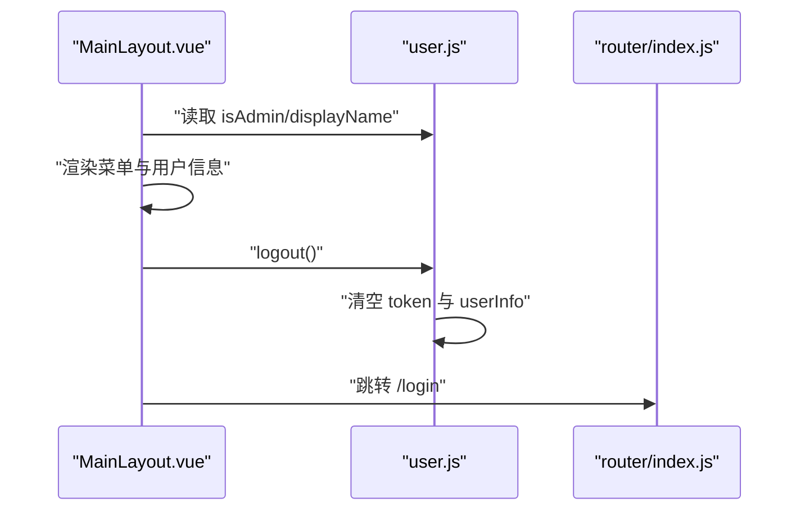
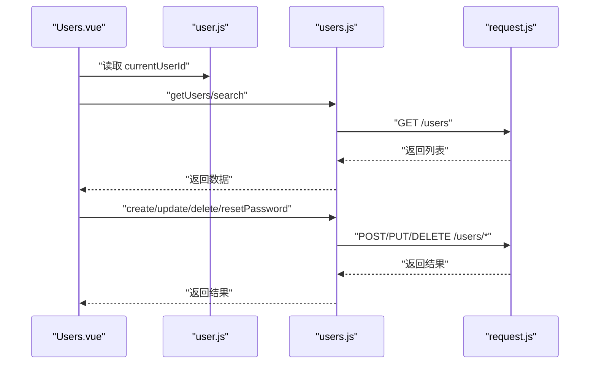
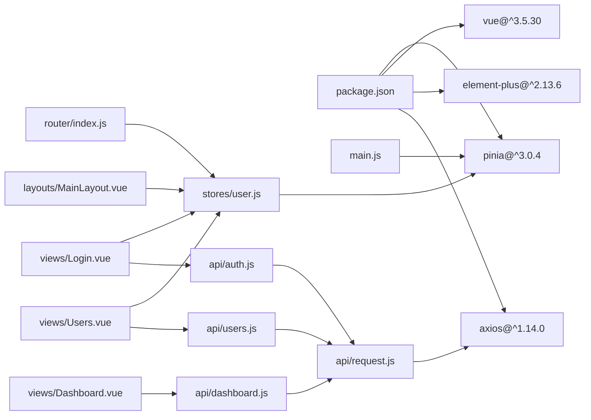

# 状态管理

<cite>
**本文引用的文件**
- [frontend/src/stores/user.js](file://frontend/src/stores/user.js)
- [frontend/src/main.js](file://frontend/src/main.js)
- [frontend/package.json](file://frontend/package.json)
- [frontend/src/router/index.js](file://frontend/src/router/index.js)
- [frontend/src/api/auth.js](file://frontend/src/api/auth.js)
- [frontend/src/api/request.js](file://frontend/src/api/request.js)
- [frontend/src/views/Login.vue](file://frontend/src/views/Login.vue)
- [frontend/src/layouts/MainLayout.vue](file://frontend/src/layouts/MainLayout.vue)
- [frontend/src/views/Dashboard.vue](file://frontend/src/views/Dashboard.vue)
- [frontend/src/views/Users.vue](file://frontend/src/views/Users.vue)
- [frontend/src/api/users.js](file://frontend/src/api/users.js)
- [frontend/src/api/dashboard.js](file://frontend/src/api/dashboard.js)
</cite>

## 目录
1. [简介](#简介)
2. [项目结构](#项目结构)
3. [核心组件](#核心组件)
4. [架构总览](#架构总览)
5. [详细组件分析](#详细组件分析)
6. [依赖分析](#依赖分析)
7. [性能考虑](#性能考虑)
8. [故障排查指南](#故障排查指南)
9. [结论](#结论)
10. [附录](#附录)

## 简介
本文件面向云运维平台前端的状态管理，围绕 Pinia 在本项目中的落地实践进行系统性说明。重点涵盖：
- Store 定义与模块化组织
- 状态声明、Getter 计算属性与 Action 方法
- 用户状态管理：登录态、用户信息、权限标识
- 状态持久化策略：localStorage 的使用与恢复
- 异步操作处理、路由守卫联动
- 最佳实践与常见问题解决

## 项目结构
前端采用 Vue 3 + Pinia + Vue Router + Element Plus 技术栈。状态管理集中在 stores 目录，用户状态通过 user.js 实现；全局 Pinia 实例在入口文件中注册；路由守卫结合 localStorage 进行鉴权控制。

图表来源
- [frontend/src/main.js:1-23](file://frontend/src/main.js#L1-L23)
- [frontend/src/stores/user.js:1-41](file://frontend/src/stores/user.js#L1-L41)
- [frontend/src/router/index.js:1-61](file://frontend/src/router/index.js#L1-L61)
- [frontend/src/api/request.js:1-54](file://frontend/src/api/request.js#L1-L54)
- [frontend/src/api/auth.js:1-14](file://frontend/src/api/auth.js#L1-L14)
- [frontend/src/api/users.js:1-22](file://frontend/src/api/users.js#L1-L22)
- [frontend/src/api/dashboard.js:1-6](file://frontend/src/api/dashboard.js#L1-L6)
- [frontend/src/views/Login.vue:1-114](file://frontend/src/views/Login.vue#L1-L114)
- [frontend/src/views/Dashboard.vue:1-312](file://frontend/src/views/Dashboard.vue#L1-L312)
- [frontend/src/views/Users.vue:1-297](file://frontend/src/views/Users.vue#L1-L297)
- [frontend/src/layouts/MainLayout.vue:1-233](file://frontend/src/layouts/MainLayout.vue#L1-L233)

章节来源
- [frontend/src/main.js:1-23](file://frontend/src/main.js#L1-L23)
- [frontend/src/stores/user.js:1-41](file://frontend/src/stores/user.js#L1-L41)
- [frontend/src/router/index.js:1-61](file://frontend/src/router/index.js#L1-L61)
- [frontend/src/api/request.js:1-54](file://frontend/src/api/request.js#L1-L54)

## 核心组件
- 用户状态 Store（user.js）
  - 状态：token、userInfo
  - Getter：isLoggedIn、isAdmin、displayName
  - Action：setToken、setUserInfo、fetchProfile、logout
  - 持久化：localStorage 同步写入与读取
- 全局 Pinia 注册（main.js）
  - 创建并安装 Pinia 插件
- 路由守卫（router/index.js）
  - 结合 localStorage 实现登录态校验与管理员权限控制
- 网络层封装（api/request.js）
  - 请求拦截器自动注入 Authorization 头
  - 响应拦截器统一错误处理与 401 自动登出
- 登录页（views/Login.vue）
  - 触发登录接口，调用 userStore.setToken 与 setUserInfo
- 主布局（layouts/MainLayout.vue）
  - 使用 userStore 显示用户名、判断管理员权限、触发退出登录
- 仪表盘与用户管理（views/Dashboard.vue、views/Users.vue）
  - 展示用户信息与权限控制效果

章节来源
- [frontend/src/stores/user.js:1-41](file://frontend/src/stores/user.js#L1-L41)
- [frontend/src/main.js:1-23](file://frontend/src/main.js#L1-L23)
- [frontend/src/router/index.js:1-61](file://frontend/src/router/index.js#L1-L61)
- [frontend/src/api/request.js:1-54](file://frontend/src/api/request.js#L1-L54)
- [frontend/src/views/Login.vue:1-114](file://frontend/src/views/Login.vue#L1-L114)
- [frontend/src/layouts/MainLayout.vue:1-233](file://frontend/src/layouts/MainLayout.vue#L1-L233)
- [frontend/src/views/Dashboard.vue:1-312](file://frontend/src/views/Dashboard.vue#L1-L312)
- [frontend/src/views/Users.vue:1-297](file://frontend/src/views/Users.vue#L1-L297)

## 架构总览
下图展示从用户交互到状态更新与持久化的端到端流程。

图表来源
- [frontend/src/views/Login.vue:50-66](file://frontend/src/views/Login.vue#L50-L66)
- [frontend/src/stores/user.js:13-21](file://frontend/src/stores/user.js#L13-L21)
- [frontend/src/api/auth.js:3-5](file://frontend/src/api/auth.js#L3-L5)
- [frontend/src/api/request.js:14-23](file://frontend/src/api/request.js#L14-L23)

## 详细组件分析

### 用户状态 Store（user.js）
- Store 定义
  - 使用组合式 Store 定义方式，返回状态与方法
- 状态声明
  - token：字符串，来源于 localStorage 初始化
  - userInfo：对象，来源于 localStorage 初始化
- Getter 计算属性
  - isLoggedIn：基于 token 是否存在
  - isAdmin：基于 userInfo.role === 'admin'
  - displayName：优先显示 display_name，否则回退 username
- Action 方法
  - setToken：更新内存值并同步写入 localStorage
  - setUserInfo：更新内存值并同步写入 localStorage
  - fetchProfile：异步拉取用户资料并写入 userInfo
  - logout：清空 token 与 userInfo，并移除对应 localStorage 键
- 持久化策略
  - 所有状态变更均同步写入 localStorage，确保刷新后可恢复

图表来源
- [frontend/src/stores/user.js:23-30](file://frontend/src/stores/user.js#L23-L30)

章节来源
- [frontend/src/stores/user.js:1-41](file://frontend/src/stores/user.js#L1-L41)

### 登录流程（Login.vue → user.js）
- 表单校验通过后调用登录接口
- 成功后调用 userStore.setToken 与 setUserInfo
- 写入 localStorage 后跳转至仪表盘

图表来源
- [frontend/src/views/Login.vue:50-66](file://frontend/src/views/Login.vue#L50-L66)
- [frontend/src/stores/user.js:13-21](file://frontend/src/stores/user.js#L13-L21)
- [frontend/src/api/auth.js:3-5](file://frontend/src/api/auth.js#L3-L5)
- [frontend/src/api/request.js:14-23](file://frontend/src/api/request.js#L14-L23)

章节来源
- [frontend/src/views/Login.vue:1-114](file://frontend/src/views/Login.vue#L1-L114)
- [frontend/src/stores/user.js:1-41](file://frontend/src/stores/user.js#L1-L41)
- [frontend/src/api/auth.js:1-14](file://frontend/src/api/auth.js#L1-L14)
- [frontend/src/api/request.js:1-54](file://frontend/src/api/request.js#L1-L54)

### 权限控制与路由守卫（router/index.js）
- 登录页无需认证，但若已登录则重定向至仪表盘
- 需要认证的页面：若无 token 则重定向至登录
- 管理员页面：需 userInfo.role === 'admin'
- 401 响应时自动清理 localStorage 并跳转登录

图表来源
- [frontend/src/router/index.js:36-58](file://frontend/src/router/index.js#L36-L58)

章节来源
- [frontend/src/router/index.js:1-61](file://frontend/src/router/index.js#L1-L61)
- [frontend/src/api/request.js:35-50](file://frontend/src/api/request.js#L35-L50)

### 主布局与权限展示（MainLayout.vue）
- 顶部导航根据 userStore.isAdmin 动态渲染“用户管理”菜单项
- 使用 userStore.displayName 渲染当前用户名
- 退出登录时调用 userStore.logout 并跳转登录

图表来源
- [frontend/src/layouts/MainLayout.vue:46-49](file://frontend/src/layouts/MainLayout.vue#L46-L49)
- [frontend/src/layouts/MainLayout.vue:70-86](file://frontend/src/layouts/MainLayout.vue#L70-L86)
- [frontend/src/stores/user.js:32-37](file://frontend/src/stores/user.js#L32-L37)
- [frontend/src/router/index.js:36-58](file://frontend/src/router/index.js#L36-L58)

章节来源
- [frontend/src/layouts/MainLayout.vue:1-233](file://frontend/src/layouts/MainLayout.vue#L1-L233)
- [frontend/src/stores/user.js:1-41](file://frontend/src/stores/user.js#L1-L41)
- [frontend/src/router/index.js:1-61](file://frontend/src/router/index.js#L1-L61)

### 用户管理页面（Users.vue）
- 仅管理员可见
- 通过 userStore.currentUserId 禁止修改自身角色/状态
- 调用用户相关 API 完成增删改查与重置密码

图表来源
- [frontend/src/views/Users.vue:110-176](file://frontend/src/views/Users.vue#L110-L176)
- [frontend/src/stores/user.js:10-11](file://frontend/src/stores/user.js#L10-L11)
- [frontend/src/api/users.js:3-21](file://frontend/src/api/users.js#L3-L21)
- [frontend/src/api/request.js:26-51](file://frontend/src/api/request.js#L26-L51)

章节来源
- [frontend/src/views/Users.vue:1-297](file://frontend/src/views/Users.vue#L1-L297)
- [frontend/src/stores/user.js:1-41](file://frontend/src/stores/user.js#L1-L41)
- [frontend/src/api/users.js:1-22](file://frontend/src/api/users.js#L1-L22)
- [frontend/src/api/request.js:1-54](file://frontend/src/api/request.js#L1-L54)

### 仪表盘页面（Dashboard.vue）
- 展示统计卡片与表格，演示响应式布局与加载态
- 与用户状态无直接耦合，用于验证布局与导航正常工作

章节来源
- [frontend/src/views/Dashboard.vue:1-312](file://frontend/src/views/Dashboard.vue#L1-L312)

## 依赖分析
- 依赖关系
  - main.js 依赖 Pinia 并将其安装到应用实例
  - user.js 依赖 Vue 响应式 API 与本地存储
  - router/index.js 依赖 localStorage 与 userStore
  - api/request.js 依赖 axios，并被各业务 API 模块复用
  - 各视图组件依赖对应的 API 模块与 userStore
- 版本与包管理
  - package.json 明确 Pinia、Vue、Element Plus、axios 等版本

图表来源
- [frontend/package.json:11-22](file://frontend/package.json#L11-L22)
- [frontend/src/main.js:1-23](file://frontend/src/main.js#L1-L23)
- [frontend/src/stores/user.js:1-41](file://frontend/src/stores/user.js#L1-L41)
- [frontend/src/router/index.js:1-61](file://frontend/src/router/index.js#L1-L61)
- [frontend/src/api/request.js:1-54](file://frontend/src/api/request.js#L1-L54)
- [frontend/src/api/auth.js:1-14](file://frontend/src/api/auth.js#L1-L14)
- [frontend/src/api/users.js:1-22](file://frontend/src/api/users.js#L1-L22)
- [frontend/src/api/dashboard.js:1-6](file://frontend/src/api/dashboard.js#L1-L6)
- [frontend/src/views/Login.vue:1-114](file://frontend/src/views/Login.vue#L1-L114)
- [frontend/src/layouts/MainLayout.vue:1-233](file://frontend/src/layouts/MainLayout.vue#L1-L233)
- [frontend/src/views/Users.vue:1-297](file://frontend/src/views/Users.vue#L1-L297)
- [frontend/src/views/Dashboard.vue:1-312](file://frontend/src/views/Dashboard.vue#L1-L312)

章节来源
- [frontend/package.json:1-24](file://frontend/package.json#L1-L24)
- [frontend/src/main.js:1-23](file://frontend/src/main.js#L1-L23)
- [frontend/src/stores/user.js:1-41](file://frontend/src/stores/user.js#L1-L41)
- [frontend/src/router/index.js:1-61](file://frontend/src/router/index.js#L1-L61)
- [frontend/src/api/request.js:1-54](file://frontend/src/api/request.js#L1-L54)

## 性能考虑
- 状态粒度
  - 将 token 与 userInfo 分离，避免大对象频繁重渲染
- 计算属性
  - 使用 computed 缓存派生状态，减少重复计算
- 异步处理
  - 在视图层使用 v-loading 控制加载态，避免阻塞 UI
- 存储策略
  - localStorage 同步写入，注意键数量与体积，避免影响首屏性能
- 路由守卫
  - 守卫逻辑尽量轻量，避免在每次路由切换时做重型计算

## 故障排查指南
- 登录后无法进入受保护页面
  - 检查 localStorage 中 token 是否正确写入
  - 确认路由守卫逻辑与 meta 字段配置一致
- 401 未自动登出
  - 检查响应拦截器是否正确识别 401 并清理 localStorage
  - 确认请求拦截器是否正确注入 Authorization 头
- 用户信息不显示或显示异常
  - 检查 userInfo 的字段命名与存储格式
  - 确认 displayName 的回退逻辑
- 退出登录后仍可访问管理员页面
  - 确认 logout 是否清空了 token 与 userInfo
  - 检查路由守卫中对管理员页面的判定逻辑

章节来源
- [frontend/src/router/index.js:36-58](file://frontend/src/router/index.js#L36-L58)
- [frontend/src/api/request.js:35-50](file://frontend/src/api/request.js#L35-L50)
- [frontend/src/stores/user.js:32-37](file://frontend/src/stores/user.js#L32-L37)

## 结论
本项目以 Pinia 为核心实现了简洁、可维护的状态管理方案：通过组合式 Store 定义用户状态，配合 localStorage 实现持久化；路由守卫与网络层拦截器共同保障鉴权与错误处理；视图层通过 store 的 getter 与 action 完成登录态、权限与用户信息的展示与更新。该模式易于扩展与维护，适合中大型前端项目的长期演进。

## 附录
- 最佳实践清单
  - 状态设计：单一职责、最小必要状态、合理拆分模块
  - 异步处理：统一错误处理、加载态管理、防抖与节流
  - 持久化：选择合适存储介质、注意键空间与体积、提供初始化与降级
  - 调试技巧：利用浏览器开发者工具查看 Pinia 状态快照、启用严格模式、集中化日志
  - 安全建议：敏感信息避免明文存储、定期清理过期数据、统一鉴权入口