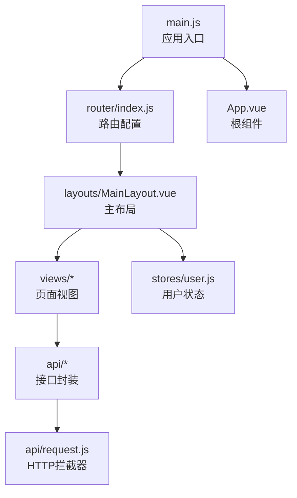
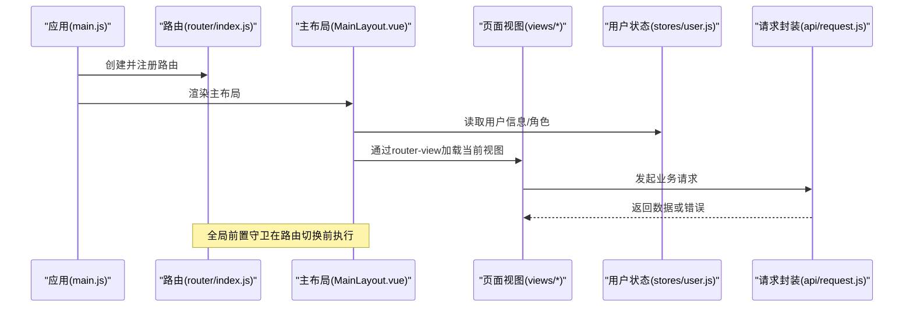
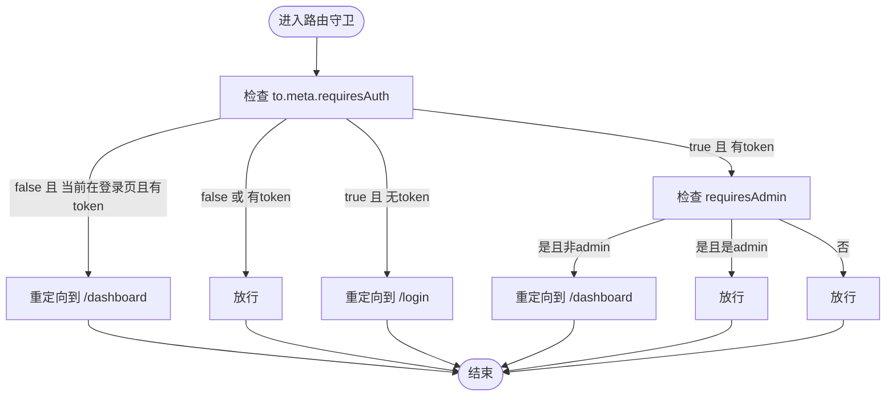
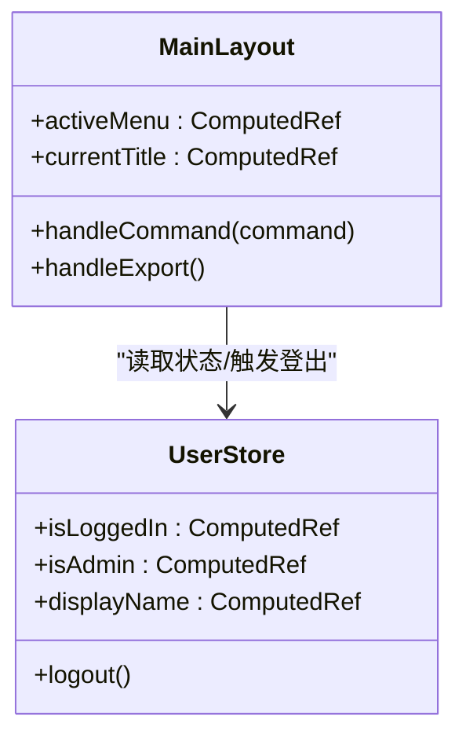
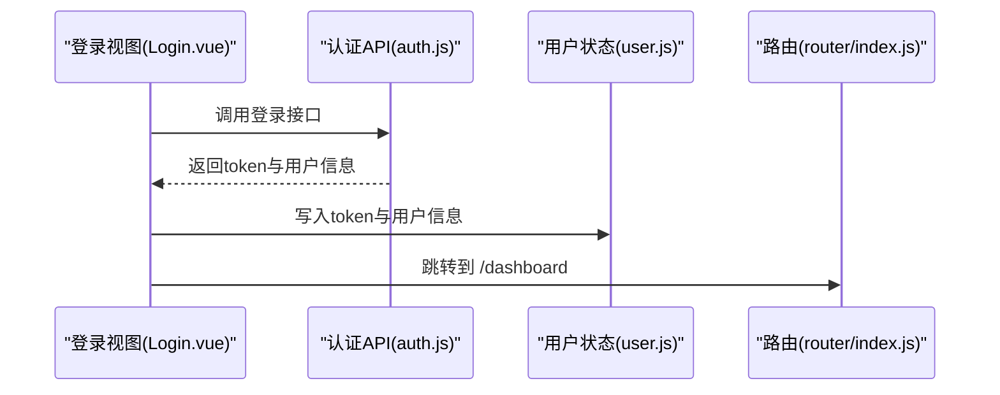
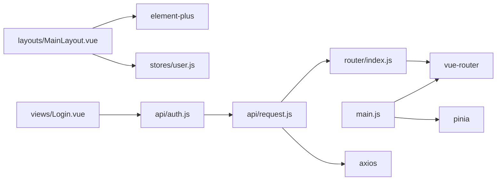

# 路由与导航

<cite>
**本文引用的文件**
- [frontend/src/router/index.js](file://frontend/src/router/index.js)
- [frontend/src/main.js](file://frontend/src/main.js)
- [frontend/src/layouts/MainLayout.vue](file://frontend/src/layouts/MainLayout.vue)
- [frontend/src/stores/user.js](file://frontend/src/stores/user.js)
- [frontend/src/views/Login.vue](file://frontend/src/views/Login.vue)
- [frontend/src/views/Dashboard.vue](file://frontend/src/views/Dashboard.vue)
- [frontend/src/views/Servers.vue](file://frontend/src/views/Servers.vue)
- [frontend/src/views/ServerDetail.vue](file://frontend/src/views/ServerDetail.vue)
- [frontend/src/views/ChangePassword.vue](file://frontend/src/views/ChangePassword.vue)
- [frontend/src/api/auth.js](file://frontend/src/api/auth.js)
- [frontend/src/api/request.js](file://frontend/src/api/request.js)
- [frontend/src/components/PasswordDisplay.vue](file://frontend/src/components/PasswordDisplay.vue)
- [frontend/package.json](file://frontend/package.json)
</cite>

## 目录
1. [简介](#简介)
2. [项目结构](#项目结构)
3. [核心组件](#核心组件)
4. [架构总览](#架构总览)
5. [详细组件分析](#详细组件分析)
6. [依赖关系分析](#依赖关系分析)
7. [性能考虑](#性能考虑)
8. [故障排查指南](#故障排查指南)
9. [结论](#结论)
10. [附录](#附录)

## 简介
本文件面向云运维平台的前端路由与导航系统，围绕 Vue Router 的配置与使用、嵌套路由与动态路由参数、路由守卫与权限控制、主布局组件设计（侧边栏、面包屑、标题管理）、以及导航守卫的错误处理与用户体验优化进行系统化说明。文档同时提供可直接定位到源码的路径，便于开发者快速查阅与二次开发。

## 项目结构
前端采用基于功能模块的组织方式：
- 路由定义集中于路由入口文件，统一声明页面级路由与嵌套路由
- 主布局组件负责整体容器、侧边菜单、顶部导航、面包屑与页面标题
- 视图组件按业务模块划分，如仪表盘、服务器管理、服务管理、应用系统、证书管理、更新记录、定时任务、用户管理、修改密码等
- 状态管理通过 Pinia Store 管理用户登录态与角色信息
- API 层通过 Axios 封装请求与响应拦截，统一处理鉴权与错误提示

图表来源
- [frontend/src/main.js:1-23](file://frontend/src/main.js#L1-L23)
- [frontend/src/router/index.js:1-61](file://frontend/src/router/index.js#L1-L61)
- [frontend/src/layouts/MainLayout.vue:1-233](file://frontend/src/layouts/MainLayout.vue#L1-L233)
- [frontend/src/stores/user.js:1-41](file://frontend/src/stores/user.js#L1-L41)
- [frontend/src/api/request.js:1-54](file://frontend/src/api/request.js#L1-L54)

章节来源
- [frontend/src/main.js:1-23](file://frontend/src/main.js#L1-L23)
- [frontend/src/router/index.js:1-61](file://frontend/src/router/index.js#L1-L61)

## 核心组件
- 路由配置与守卫：集中于路由入口文件，定义页面路由、嵌套路由与全局前置守卫
- 主布局组件：提供侧边菜单、顶部导航、面包屑与页面标题管理
- 用户状态管理：通过 Pinia Store 管理 token、用户信息、管理员角色与显示名
- 登录视图：表单校验、调用登录接口、设置本地存储并跳转
- API 封装：统一请求头、鉴权令牌注入、响应错误处理与 401 自动登出

章节来源
- [frontend/src/router/index.js:30-58](file://frontend/src/router/index.js#L30-L58)
- [frontend/src/layouts/MainLayout.vue:98-151](file://frontend/src/layouts/MainLayout.vue#L98-L151)
- [frontend/src/stores/user.js:5-40](file://frontend/src/stores/user.js#L5-L40)
- [frontend/src/views/Login.vue:27-67](file://frontend/src/views/Login.vue#L27-L67)
- [frontend/src/api/request.js:13-51](file://frontend/src/api/request.js#L13-L51)

## 架构总览
下图展示从应用启动到页面渲染的关键流程，包括路由初始化、守卫执行、布局渲染与视图加载。

图表来源
- [frontend/src/main.js:10-22](file://frontend/src/main.js#L10-L22)
- [frontend/src/router/index.js:30-58](file://frontend/src/router/index.js#L30-L58)
- [frontend/src/layouts/MainLayout.vue:98-151](file://frontend/src/layouts/MainLayout.vue#L98-L151)
- [frontend/src/stores/user.js:5-40](file://frontend/src/stores/user.js#L5-L40)
- [frontend/src/api/request.js:13-51](file://frontend/src/api/request.js#L13-L51)

## 详细组件分析

### 路由配置与嵌套路由
- 页面路由
  - 登录页：独立路由，meta 标记不需要认证
  - 根路由：指向主布局组件，包含多个子路由
- 嵌套路由
  - 根路由下挂载多个业务路由，形成主布局内的多页面导航
- 动态路由参数
  - 服务器详情路由使用动态参数，用于展示指定 ID 的服务器信息

章节来源
- [frontend/src/router/index.js:3-28](file://frontend/src/router/index.js#L3-L28)

### 路由守卫与权限控制
- 守卫逻辑
  - 若目标路由标记不需要认证且当前有 token 且访问的是登录页，则重定向到仪表盘
  - 若目标路由需要认证但没有 token，则重定向到登录页
  - 若目标路由需要管理员权限，则检查用户角色，非管理员则重定向到仪表盘
  - 其他情况放行
- 与用户状态联动
  - 守卫中读取本地存储中的 token 与用户信息，确保与 Pinia Store 的状态一致

图表来源
- [frontend/src/router/index.js:36-58](file://frontend/src/router/index.js#L36-L58)

章节来源
- [frontend/src/router/index.js:36-58](file://frontend/src/router/index.js#L36-L58)

### 主布局组件设计模式
- 侧边栏导航
  - 使用 Element Plus 菜单组件，支持折叠与展开
  - 通过计算属性 activeMenu 将子路由激活到父级菜单项
  - 管理员可见“用户管理”菜单项
- 顶部导航
  - 包含导出 Excel、用户下拉菜单（修改密码、退出登录）
  - 退出登录时弹框确认，调用用户状态管理的登出方法并跳转登录页
- 面包屑导航
  - 通过路由元信息 title 动态设置当前页面标题
  - 服务器详情页自定义面包屑，增强导航体验
- 页面标题管理
  - 通过路由元信息 title 设置页面标题，未设置时回退到默认值

图表来源
- [frontend/src/layouts/MainLayout.vue:98-151](file://frontend/src/layouts/MainLayout.vue#L98-L151)
- [frontend/src/stores/user.js:5-40](file://frontend/src/stores/user.js#L5-L40)

章节来源
- [frontend/src/layouts/MainLayout.vue:98-151](file://frontend/src/layouts/MainLayout.vue#L98-L151)

### 登录流程与状态初始化
- 登录页
  - 表单校验后调用登录接口，成功后写入 token 与用户信息到本地存储
  - 成功后跳转到仪表盘
- 状态初始化
  - 应用启动时从本地存储恢复 token 与用户信息
  - 用户信息可用于菜单与权限控制

图表来源
- [frontend/src/views/Login.vue:27-67](file://frontend/src/views/Login.vue#L27-L67)
- [frontend/src/api/auth.js:3-9](file://frontend/src/api/auth.js#L3-L9)
- [frontend/src/stores/user.js:13-21](file://frontend/src/stores/user.js#L13-L21)
- [frontend/src/router/index.js:36-58](file://frontend/src/router/index.js#L36-L58)

章节来源
- [frontend/src/views/Login.vue:27-67](file://frontend/src/views/Login.vue#L27-L67)
- [frontend/src/api/auth.js:3-9](file://frontend/src/api/auth.js#L3-L9)
- [frontend/src/stores/user.js:13-21](file://frontend/src/stores/user.js#L13-L21)

### 修改密码与登出流程
- 修改密码
  - 表单校验通过后调用修改密码接口，成功后提示并自动登出与跳转登录页
- 登出
  - 顶部下拉菜单选择退出登录，弹框确认后清空本地存储并跳转登录页

章节来源
- [frontend/src/views/ChangePassword.vue:94-112](file://frontend/src/views/ChangePassword.vue#L94-L112)
- [frontend/src/layouts/MainLayout.vue:120-134](file://frontend/src/layouts/MainLayout.vue#L120-L134)
- [frontend/src/stores/user.js:32-37](file://frontend/src/stores/user.js#L32-L37)

### 动态路由参数与详情页
- 动态路由
  - 服务器详情路由使用动态参数，用于加载指定 ID 的服务器信息
- 详情页导航
  - 详情页提供面包屑与返回按钮，提升导航体验

章节来源
- [frontend/src/router/index.js:17](file://frontend/src/router/index.js#L17)
- [frontend/src/views/ServerDetail.vue:74-102](file://frontend/src/views/ServerDetail.vue#L74-L102)

### 导航菜单动态生成
- 菜单项来源于主布局模板，菜单项与路由一一对应
- 管理员角色控制“用户管理”菜单项的显示

章节来源
- [frontend/src/layouts/MainLayout.vue:18-49](file://frontend/src/layouts/MainLayout.vue#L18-L49)
- [frontend/src/stores/user.js:10](file://frontend/src/stores/user.js#L10)

### 路由懒加载
- 所有页面组件均通过动态导入实现懒加载，减少首屏体积与加载时间

章节来源
- [frontend/src/router/index.js:7](file://frontend/src/router/index.js#L7)
- [frontend/src/router/index.js:15](file://frontend/src/router/index.js#L15)
- [frontend/src/router/index.js:17](file://frontend/src/router/index.js#L17)
- [frontend/src/router/index.js:20](file://frontend/src/router/index.js#L20)
- [frontend/src/router/index.js:21](file://frontend/src/router/index.js#L21)
- [frontend/src/router/index.js:22](file://frontend/src/router/index.js#L22)
- [frontend/src/router/index.js:23](file://frontend/src/router/index.js#L23)
- [frontend/src/router/index.js:24](file://frontend/src/router/index.js#L24)
- [frontend/src/router/index.js:25](file://frontend/src/router/index.js#L25)

### 导航守卫的错误处理与用户体验优化
- 401 自动登出
  - 请求拦截器检测 401 错误，清除本地存储并跳转登录页，同时提示“登录已过期”
- 登录页保护
  - 已登录用户访问登录页时自动重定向到仪表盘
- 权限不足处理
  - 非管理员访问管理员专属路由时自动重定向到仪表盘
- 操作反馈
  - 登出、导出、修改密码等操作均提供消息提示，提升用户感知

章节来源
- [frontend/src/api/request.js:35-51](file://frontend/src/api/request.js#L35-L51)
- [frontend/src/router/index.js:39-45](file://frontend/src/router/index.js#L39-L45)
- [frontend/src/router/index.js:48-54](file://frontend/src/router/index.js#L48-L54)
- [frontend/src/layouts/MainLayout.vue:124-132](file://frontend/src/layouts/MainLayout.vue#L124-L132)

## 依赖关系分析
- 应用入口依赖路由与状态管理库
- 路由依赖 Vue Router
- 主布局依赖 Element Plus 组件库与用户状态
- 视图组件依赖 API 封装与 Element Plus
- API 封装依赖 Axios 并与路由交互以实现 401 自动跳转

图表来源
- [frontend/src/main.js:1-23](file://frontend/src/main.js#L1-L23)
- [frontend/src/router/index.js:1](file://frontend/src/router/index.js#L1)
- [frontend/src/layouts/MainLayout.vue:101-104](file://frontend/src/layouts/MainLayout.vue#L101-L104)
- [frontend/src/stores/user.js:1-41](file://frontend/src/stores/user.js#L1-L41)
- [frontend/src/views/Login.vue:32-33](file://frontend/src/views/Login.vue#L32-L33)
- [frontend/src/api/request.js:1-54](file://frontend/src/api/request.js#L1-L54)
- [frontend/src/api/auth.js:1-14](file://frontend/src/api/auth.js#L1-L14)
- [frontend/package.json:11-17](file://frontend/package.json#L11-L17)

章节来源
- [frontend/package.json:11-17](file://frontend/package.json#L11-L17)

## 性能考虑
- 路由懒加载：通过动态导入减少初始包体，提升首屏加载速度
- 组件按需加载：仅在访问时加载对应视图组件
- 请求拦截：统一注入 token，避免重复代码与网络开销
- 本地存储：在守卫与状态管理中复用本地存储，减少不必要的网络请求

## 故障排查指南
- 登录后无法进入受保护页面
  - 检查本地存储是否正确写入 token 与用户信息
  - 确认路由守卫逻辑与 meta 标记是否符合预期
- 访问受保护页面被重定向到登录页
  - 检查请求拦截器是否正确处理 401 并清除本地存储
- 管理员页面不可见
  - 检查用户角色是否为 admin，确认菜单项条件渲染
- 导出失败
  - 检查导出接口返回的数据格式与浏览器下载能力

章节来源
- [frontend/src/router/index.js:36-58](file://frontend/src/router/index.js#L36-L58)
- [frontend/src/api/request.js:35-51](file://frontend/src/api/request.js#L35-L51)
- [frontend/src/layouts/MainLayout.vue:46](file://frontend/src/layouts/MainLayout.vue#L46)

## 结论
该路由与导航系统通过清晰的路由配置、完善的权限守卫与主布局设计，实现了良好的用户体验与安全性。结合懒加载与统一的 API 封装，系统具备较好的扩展性与维护性。建议后续可进一步抽象菜单配置、完善权限粒度与错误边界处理，以适配更复杂的业务场景。

## 附录
- 技术栈
  - Vue 3、Vue Router、Pinia、Element Plus、Axios
- 关键实现路径
  - 路由配置与守卫：[frontend/src/router/index.js:1-61](file://frontend/src/router/index.js#L1-L61)
  - 应用入口与依赖注册：[frontend/src/main.js:1-23](file://frontend/src/main.js#L1-L23)
  - 主布局与导航：[frontend/src/layouts/MainLayout.vue:1-233](file://frontend/src/layouts/MainLayout.vue#L1-L233)
  - 用户状态管理：[frontend/src/stores/user.js:1-41](file://frontend/src/stores/user.js#L1-L41)
  - 登录流程：[frontend/src/views/Login.vue:1-114](file://frontend/src/views/Login.vue#L1-L114)
  - 修改密码：[frontend/src/views/ChangePassword.vue:1-140](file://frontend/src/views/ChangePassword.vue#L1-L140)
  - 服务器详情页：[frontend/src/views/ServerDetail.vue:1-156](file://frontend/src/views/ServerDetail.vue#L1-L156)
  - API 封装与拦截器：[frontend/src/api/request.js:1-54](file://frontend/src/api/request.js#L1-L54)
  - 密码展示组件：[frontend/src/components/PasswordDisplay.vue:1-85](file://frontend/src/components/PasswordDisplay.vue#L1-L85)