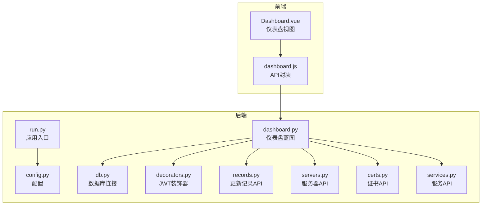
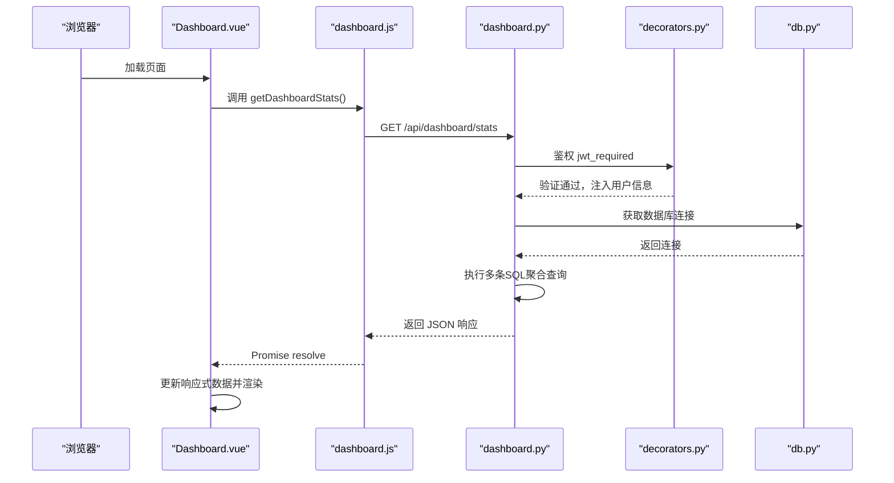
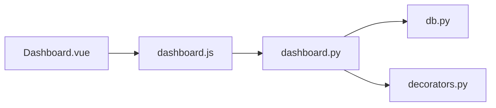

# 仪表盘统计API

<cite>
**本文档引用的文件**
- [backend/app/api/dashboard.py](file://backend/app/api/dashboard.py)
- [frontend/src/api/dashboard.js](file://frontend/src/api/dashboard.js)
- [backend/app/utils/db.py](file://backend/app/utils/db.py)
- [backend/app/utils/decorators.py](file://backend/app/utils/decorators.py)
- [backend/app/config.py](file://backend/app/config.py)
- [frontend/src/views/Dashboard.vue](file://frontend/src/views/Dashboard.vue)
- [backend/app/api/records.py](file://backend/app/api/records.py)
- [backend/app/api/servers.py](file://backend/app/api/servers.py)
- [backend/app/api/certs.py](file://backend/app/api/certs.py)
- [backend/app/api/services.py](file://backend/app/api/services.py)
- [backend/run.py](file://backend/run.py)
</cite>

## 目录
1. [简介](#简介)
2. [项目结构](#项目结构)
3. [核心组件](#核心组件)
4. [架构概览](#架构概览)
5. [详细组件分析](#详细组件分析)
6. [依赖分析](#依赖分析)
7. [性能考虑](#性能考虑)
8. [故障排除指南](#故障排除指南)
9. [结论](#结论)
10. [附录](#附录)

## 简介
本文件为运维平台仪表盘统计API的详细技术文档，覆盖系统统计数据、图表数据与趋势分析等核心功能接口。文档重点说明以下方面：
- 各类统计数据的计算逻辑与数据聚合方式
- 缓存策略与实时数据更新机制
- 请求参数与响应格式规范
- 图表数据的标准化格式与前端渲染适配方案
- 性能优化建议与大数据量处理策略
- 前端开发者使用指南与最佳实践

## 项目结构
该系统采用前后端分离架构，后端基于Flask提供REST API，前端使用Vue 3 + Element Plus构建仪表盘界面。仪表盘统计API位于后端蓝图中，通过JWT鉴权保护，并通过统一的数据库工具类访问MySQL。

**图表来源**
- [backend/run.py:1-8](file://backend/run.py#L1-L8)
- [backend/app/config.py:1-21](file://backend/app/config.py#L1-L21)
- [backend/app/api/dashboard.py:1-86](file://backend/app/api/dashboard.py#L1-L86)
- [backend/app/utils/db.py:1-17](file://backend/app/utils/db.py#L1-L17)
- [backend/app/utils/decorators.py:1-95](file://backend/app/utils/decorators.py#L1-L95)
- [frontend/src/views/Dashboard.vue:1-307](file://frontend/src/views/Dashboard.vue#L1-L307)
- [frontend/src/api/dashboard.js:1-6](file://frontend/src/api/dashboard.js#L1-L6)

**章节来源**
- [backend/run.py:1-8](file://backend/run.py#L1-L8)
- [backend/app/config.py:1-21](file://backend/app/config.py#L1-L21)
- [backend/app/api/dashboard.py:1-86](file://backend/app/api/dashboard.py#L1-L86)
- [frontend/src/views/Dashboard.vue:1-307](file://frontend/src/views/Dashboard.vue#L1-L307)

## 核心组件
- 仪表盘统计API：提供系统资产总数、状态分布、最近更新记录与证书到期提醒等数据。
- 数据库工具：提供统一的MySQL连接获取与配置。
- 鉴权装饰器：提供JWT认证与角色校验。
- 前端API封装：封装对仪表盘统计接口的调用。
- 前端视图组件：负责展示统计卡片、表格与图表。

关键职责与交互：
- 后端仪表盘蓝图接收HTTP请求，执行SQL聚合查询，返回标准化JSON响应。
- 前端视图组件在挂载时调用API，解析并渲染统计数据。
- 鉴权装饰器确保接口访问安全。

**章节来源**
- [backend/app/api/dashboard.py:20-86](file://backend/app/api/dashboard.py#L20-L86)
- [frontend/src/api/dashboard.js:1-6](file://frontend/src/api/dashboard.js#L1-L6)
- [frontend/src/views/Dashboard.vue:138-167](file://frontend/src/views/Dashboard.vue#L138-L167)

## 架构概览
仪表盘统计API的调用链路如下：

**图表来源**
- [frontend/src/views/Dashboard.vue:155-167](file://frontend/src/views/Dashboard.vue#L155-L167)
- [frontend/src/api/dashboard.js:3-5](file://frontend/src/api/dashboard.js#L3-L5)
- [backend/app/api/dashboard.py:20-86](file://backend/app/api/dashboard.py#L20-L86)
- [backend/app/utils/decorators.py:9-56](file://backend/app/utils/decorators.py#L9-L56)
- [backend/app/utils/db.py:5-16](file://backend/app/utils/db.py#L5-L16)

## 详细组件分析

### 仪表盘统计接口
- 接口路径：/api/dashboard/stats
- 方法：GET
- 鉴权：需要有效的JWT Bearer Token
- 功能概述：
  - 资产总数统计：服务器、服务、Web账户、应用系统、域名证书、变更记录的数量。
  - 环境分布统计：按环境类型分组统计服务器数量，并计算占比。
  - 最近更新记录：返回变更序列号不为空的最近10条记录。
  - 证书到期提醒：返回状态为“使用中”的最近10条域名证书记录。

请求参数
- 无查询参数

响应格式
- code: 200 表示成功
- data:
  - counts: 各资产类型的数量对象
  - env_distribution: 环境类型分布数组，每项包含 env_type 与 count
  - recent_certs: 证书列表，包含项目、主体、到期日期、剩余天数等字段
  - recent_records: 变更记录列表，包含编号、变更日期、修改人、修改位置、内容、备注等字段

数据聚合逻辑
- 资产总数：对各表执行COUNT(*)查询。
- 环境分布：按env_type分组统计服务器数量。
- 最近更新记录：筛选seq_no非空，按变更日期降序取前10条。
- 证书到期提醒：筛选状态为“使用中”，按id排序取前10条。

时间字段处理
- 变更日期change_date在序列化时转换为字符串格式，便于前端直接渲染。

**章节来源**
- [backend/app/api/dashboard.py:20-86](file://backend/app/api/dashboard.py#L20-L86)
- [backend/app/api/dashboard.py:12-17](file://backend/app/api/dashboard.py#L12-L17)

### 前端集成与渲染
- 前端通过dashboard.js封装的getDashboardStats函数发起请求。
- Dashboard.vue在组件挂载时触发数据获取，并将响应数据赋值到响应式对象中。
- 统计卡片点击可导航至对应资源列表页。
- 环境分布以表格形式展示，包含进度条占比；证书到期提醒按剩余天数设置标签样式；最近更新记录以表格展示。

前端适配建议
- 对counts中的键名保持与后端一致，避免映射错误。
- 对于日期字段，前端可直接使用后端返回的字符串格式，减少额外转换。
- 表格列宽与显示内容可根据业务需求调整，确保可读性。

**章节来源**
- [frontend/src/api/dashboard.js:1-6](file://frontend/src/api/dashboard.js#L1-L6)
- [frontend/src/views/Dashboard.vue:138-199](file://frontend/src/views/Dashboard.vue#L138-L199)

### 鉴权与安全
- 接口使用JWT认证装饰器保护，要求请求头携带有效的Bearer Token。
- 若缺少认证信息、格式错误或Token无效/过期，将返回相应错误码与消息。
- 建议生产环境配置合适的JWT密钥与过期时间。

**章节来源**
- [backend/app/utils/decorators.py:9-56](file://backend/app/utils/decorators.py#L9-L56)

### 数据库连接与配置
- 数据库连接通过工具函数统一获取，支持从配置中读取主机、端口、用户名、密码与数据库名。
- 建议生产环境通过环境变量配置数据库参数，避免硬编码。

**章节来源**
- [backend/app/utils/db.py:5-16](file://backend/app/utils/db.py#L5-L16)
- [backend/app/config.py:9-13](file://backend/app/config.py#L9-L13)

### 相关资源接口（用于联动）
- 更新记录接口：支持分页与模糊搜索，按变更日期倒序排列，便于与仪表盘的最近更新记录联动。
- 服务器接口：支持按环境类型与关键词搜索，便于点击统计卡片跳转到服务器列表。
- 证书接口：支持按分类与关键词搜索，便于查看证书详情与到期提醒。
- 服务接口：支持按分类与关键词搜索，便于查看服务详情。

这些接口与仪表盘统计形成完整的数据闭环，便于用户从概览到详情的深度探索。

**章节来源**
- [backend/app/api/records.py:20-52](file://backend/app/api/records.py#L20-L52)
- [backend/app/api/servers.py:11-43](file://backend/app/api/servers.py#L11-L43)
- [backend/app/api/certs.py:11-43](file://backend/app/api/certs.py#L11-L43)
- [backend/app/api/services.py:11-46](file://backend/app/api/services.py#L11-L46)

## 依赖分析
- 后端依赖关系
  - dashboard.py 依赖 db.py 进行数据库连接，依赖 decorators.py 进行JWT鉴权。
  - 前端依赖 dashboard.js 封装的API，Dashboard.vue负责UI渲染与数据绑定。
- 外部依赖
  - Flask：提供Web框架与蓝图路由。
  - PyMySQL：提供MySQL连接与游标操作。
  - APScheduler：用于定时任务调度（与仪表盘统计接口无直接耦合，但体现系统整体调度能力）。

**图表来源**
- [backend/app/api/dashboard.py:4-7](file://backend/app/api/dashboard.py#L4-L7)
- [backend/app/utils/db.py:1-17](file://backend/app/utils/db.py#L1-L17)
- [backend/app/utils/decorators.py:1-95](file://backend/app/utils/decorators.py#L1-L95)
- [frontend/src/views/Dashboard.vue:141](file://frontend/src/views/Dashboard.vue#L141)
- [frontend/src/api/dashboard.js:1](file://frontend/src/api/dashboard.js#L1)

**章节来源**
- [backend/app/api/dashboard.py:4-7](file://backend/app/api/dashboard.py#L4-L7)
- [backend/app/utils/db.py:1-17](file://backend/app/utils/db.py#L1-L17)
- [backend/app/utils/decorators.py:1-95](file://backend/app/utils/decorators.py#L1-L95)
- [frontend/src/views/Dashboard.vue:141](file://frontend/src/views/Dashboard.vue#L141)
- [frontend/src/api/dashboard.js:1](file://frontend/src/api/dashboard.js#L1)

## 性能考虑
当前实现特点
- 单次请求执行多条SQL查询，返回一次性聚合结果，适合小中型数据规模。
- 环境分布统计使用GROUP BY，查询复杂度与服务器数量线性相关。
- 最近记录限制为固定数量，避免大结果集导致的延迟。

优化建议
- 查询优化
  - 为服务器表的环境类型字段建立索引，加速GROUP BY与过滤。
  - 为变更记录表的变更日期与序列号建立复合索引，提升排序与筛选效率。
- 缓存策略
  - 对资产总数与环境分布统计结果进行短期缓存（例如5-10分钟），降低数据库压力。
  - 使用分布式缓存（如Redis）存储热点数据，结合失效策略保证一致性。
- 分页与限流
  - 若未来数据量增长，建议对最近记录与证书列表增加分页参数，避免一次性传输过多数据。
  - 结合API限流策略，防止突发流量冲击数据库。
- 异步与批处理
  - 对于大规模统计任务，可考虑异步生成报表并在后台缓存，前端轮询或WebSocket推送更新。
- 前端优化
  - 对表格数据进行虚拟滚动，减少DOM渲染压力。
  - 对日期字段采用本地化格式化，避免重复转换。

[本节为通用性能指导，无需特定文件引用]

## 故障排除指南
常见问题与排查步骤
- 401 未授权
  - 检查请求头是否包含正确的Bearer Token，格式是否为“Bearer 空格 + token”。
  - 确认Token未过期且签名正确。
- 403 权限不足
  - 当前实现主要依赖JWT认证，若后续增加角色校验装饰器，请确认用户角色满足要求。
- 数据异常或为空
  - 检查数据库连接配置是否正确，确认目标表存在且有数据。
  - 确认环境类型字段值与查询条件匹配，避免因大小写或空值导致统计异常。
- 前端渲染异常
  - 确认counts键名与后端返回一致，避免属性访问错误。
  - 检查日期字段格式是否符合预期，必要时在前端进行二次格式化。

**章节来源**
- [backend/app/utils/decorators.py:22-45](file://backend/app/utils/decorators.py#L22-L45)
- [backend/app/utils/db.py:5-16](file://backend/app/utils/db.py#L5-L16)
- [frontend/src/views/Dashboard.vue:155-167](file://frontend/src/views/Dashboard.vue#L155-L167)

## 结论
仪表盘统计API提供了系统关键指标的快速概览，具备清晰的数据聚合逻辑与简洁的响应格式。通过JWT鉴权保障安全性，前端以直观的卡片与表格形式呈现数据。建议在生产环境中引入缓存与索引优化，并根据数据规模演进逐步增加分页与异步统计能力，以确保高并发场景下的稳定表现。

[本节为总结性内容，无需特定文件引用]

## 附录

### 接口定义总览
- 地址：/api/dashboard/stats
- 方法：GET
- 鉴权：是（Bearer Token）
- 成功响应码：200
- 响应体字段：
  - code: 数字
  - data.counts: 对象，包含各资产数量
  - data.env_distribution: 数组，包含环境类型与数量
  - data.recent_certs: 数组，包含证书相关信息
  - data.recent_records: 数组，包含变更记录信息

**章节来源**
- [backend/app/api/dashboard.py:67-82](file://backend/app/api/dashboard.py#L67-L82)

### 前端调用示例（路径）
- 前端API封装：[frontend/src/api/dashboard.js:3-5](file://frontend/src/api/dashboard.js#L3-L5)
- 视图组件调用：[frontend/src/views/Dashboard.vue:159-167](file://frontend/src/views/Dashboard.vue#L159-L167)

### 数据库配置（路径）
- 配置读取：[backend/app/config.py:9-13](file://backend/app/config.py#L9-L13)
- 连接获取：[backend/app/utils/db.py:5-16](file://backend/app/utils/db.py#L5-L16)