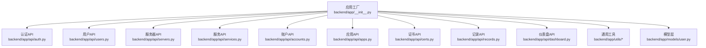
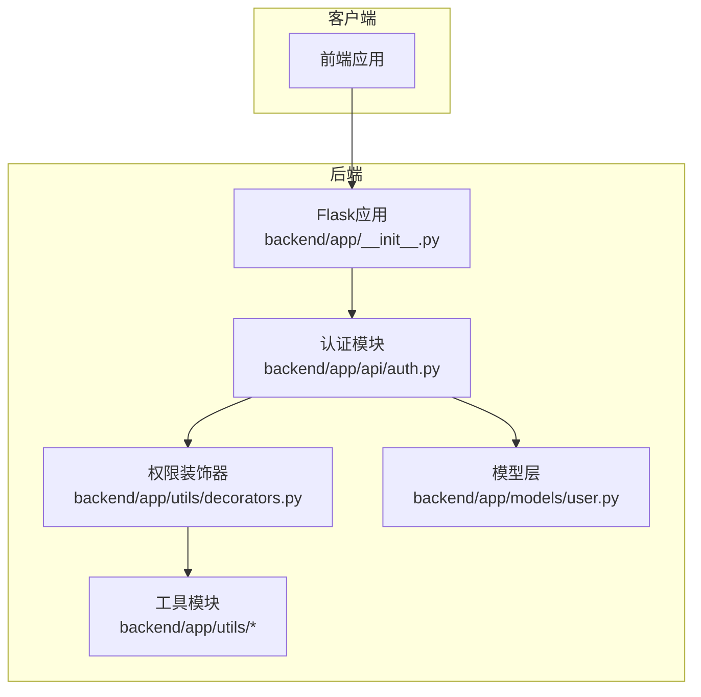
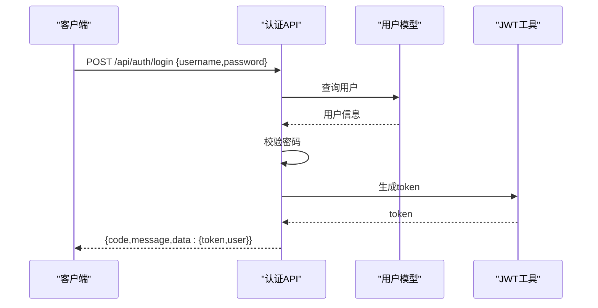
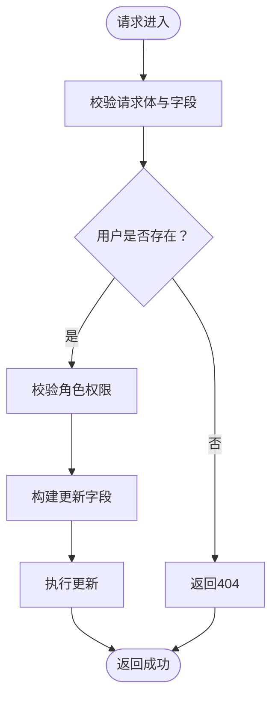
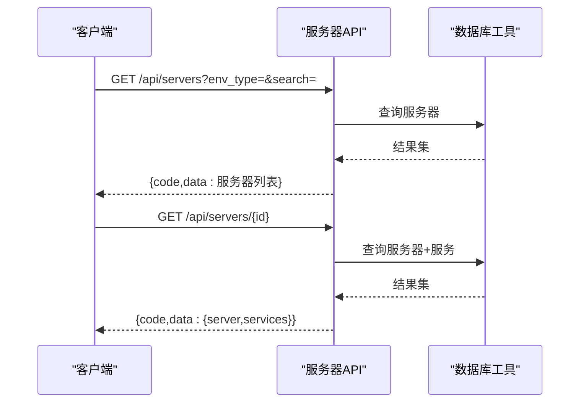
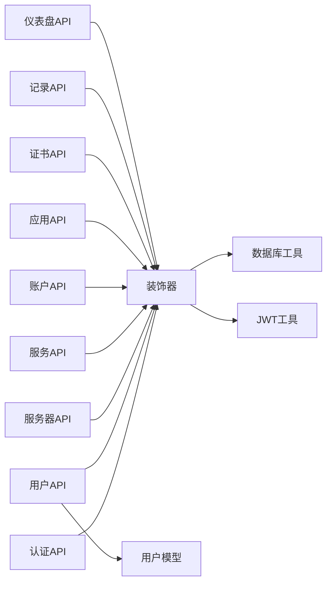

# 后端API文档

<cite>
**本文档引用的文件**
- [app.py](file://app.py)
- [backend/app/__init__.py](file://backend/app/__init__.py)
- [backend/app/config.py](file://backend/app/config.py)
- [backend/app/utils/auth.py](file://backend/app/utils/auth.py)
- [backend/app/utils/db.py](file://backend/app/utils/db.py)
- [backend/app/utils/decorators.py](file://backend/app/utils/decorators.py)
- [backend/app/api/auth.py](file://backend/app/api/auth.py)
- [backend/app/api/users.py](file://backend/app/api/users.py)
- [backend/app/api/servers.py](file://backend/app/api/servers.py)
- [backend/app/api/services.py](file://backend/app/api/services.py)
- [backend/app/api/accounts.py](file://backend/app/api/accounts.py)
- [backend/app/api/apps.py](file://backend/app/api/apps.py)
- [backend/app/api/certs.py](file://backend/app/api/certs.py)
- [backend/app/api/records.py](file://backend/app/api/records.py)
- [backend/app/api/dashboard.py](file://backend/app/api/dashboard.py)
- [backend/app/models/user.py](file://backend/app/models/user.py)
</cite>

## 目录
1. [简介](#简介)
2. [项目结构](#项目结构)
3. [核心组件](#核心组件)
4. [架构总览](#架构总览)
5. [详细组件分析](#详细组件分析)
6. [依赖分析](#依赖分析)
7. [性能考虑](#性能考虑)
8. [故障排除指南](#故障排除指南)
9. [结论](#结论)
10. [附录](#附录)

## 简介
本文件为云运维平台的完整后端API文档，覆盖RESTful接口、认证与授权、数据验证、错误处理、批量与分页、搜索与过滤等能力。文档面向前端开发者，提供接口使用指南、请求/响应示例与常见错误说明。

## 项目结构
后端采用Flask应用，按功能模块划分蓝图（Blueprint），统一在应用工厂中注册。核心目录与职责如下：
- backend/app：应用工厂、配置、CORS、调度器初始化与蓝图注册
- backend/app/api：各业务模块API（认证、用户、服务器、服务、账户、应用、证书、记录、仪表盘）
- backend/app/utils：通用工具（数据库连接、认证、装饰器）
- backend/app/models：数据访问层（用户相关）

图表来源
- [backend/app/__init__.py:28-53](file://backend/app/__init__.py#L28-L53)
- [backend/app/api/auth.py:11](file://backend/app/api/auth.py#L11)
- [backend/app/api/users.py:14](file://backend/app/api/users.py#L14)
- [backend/app/api/servers.py:8](file://backend/app/api/servers.py#L8)
- [backend/app/api/services.py:8](file://backend/app/api/services.py#L8)
- [backend/app/api/accounts.py:8](file://backend/app/api/accounts.py#L8)
- [backend/app/api/apps.py:8](file://backend/app/api/apps.py#L8)
- [backend/app/api/certs.py:8](file://backend/app/api/certs.py#L8)
- [backend/app/api/records.py:9](file://backend/app/api/records.py#L9)
- [backend/app/api/dashboard.py:9](file://backend/app/api/dashboard.py#L9)

章节来源
- [backend/app/__init__.py:6-26](file://backend/app/__init__.py#L6-L26)
- [backend/app/config.py:4-21](file://backend/app/config.py#L4-L21)

## 核心组件
- 应用工厂与蓝图注册：集中初始化CORS、注册各模块蓝图、启动定时任务
- 认证与授权：JWT生成与校验、基于角色的权限控制
- 数据访问：统一数据库连接工具
- 统一响应格式：所有API返回统一的code/message/data结构

章节来源
- [backend/app/__init__.py:28-53](file://backend/app/__init__.py#L28-L53)
- [backend/app/utils/auth.py:11-83](file://backend/app/utils/auth.py#L11-L83)
- [backend/app/utils/decorators.py](file://backend/app/utils/decorators.py)

## 架构总览
系统采用前后端分离，后端提供RESTful API，前端通过HTTP调用接口。认证采用JWT，权限通过装饰器控制。

图表来源
- [backend/app/__init__.py:28-53](file://backend/app/__init__.py#L28-L53)
- [backend/app/api/auth.py:14-83](file://backend/app/api/auth.py#L14-L83)
- [backend/app/utils/auth.py:11-83](file://backend/app/utils/auth.py#L11-L83)
- [backend/app/models/user.py:8-37](file://backend/app/models/user.py#L8-L37)

## 详细组件分析

### 认证与授权
- 登录：用户名+密码，返回token与用户信息
- 获取当前用户资料：携带token访问
- 修改密码：旧密码校验通过后更新
- 权限控制：装饰器校验JWT与角色（admin/operator/viewer）

图表来源
- [backend/app/api/auth.py:14-83](file://backend/app/api/auth.py#L14-L83)
- [backend/app/models/user.py:39-58](file://backend/app/models/user.py#L39-L58)
- [backend/app/utils/auth.py:11-36](file://backend/app/utils/auth.py#L11-L36)

章节来源
- [backend/app/api/auth.py:14-184](file://backend/app/api/auth.py#L14-L184)
- [backend/app/utils/auth.py:11-83](file://backend/app/utils/auth.py#L11-L83)
- [backend/app/models/user.py:8-183](file://backend/app/models/user.py#L8-L183)

### 用户管理（仅管理员）
- 获取用户列表
- 创建用户（校验字段、角色、密码长度、用户名唯一性）
- 更新用户（校验字段、角色范围）
- 删除用户（禁止删除自身）
- 重置密码（管理员）

图表来源
- [backend/app/api/users.py:33-208](file://backend/app/api/users.py#L33-L208)

章节来源
- [backend/app/api/users.py:17-268](file://backend/app/api/users.py#L17-L268)

### 服务器管理
- 列表查询：支持按环境类型与关键词搜索
- 详情查询：返回服务器及关联服务
- 下拉列表：简要服务器信息
- 创建/更新/删除：支持字段选择性更新

图表来源
- [backend/app/api/servers.py:11-79](file://backend/app/api/servers.py#L11-L79)
- [backend/app/utils/db.py](file://backend/app/utils/db.py)

章节来源
- [backend/app/api/servers.py:11-203](file://backend/app/api/servers.py#L11-L203)

### 服务管理
- 列表查询：支持分类与关键词搜索，关联服务器信息
- 创建/更新/删除：支持字段选择性更新

章节来源
- [backend/app/api/services.py:11-144](file://backend/app/api/services.py#L11-L144)

### Web账户管理
- 列表查询：支持分组与关键词搜索
- 创建/更新/删除：支持字段选择性更新

章节来源
- [backend/app/api/accounts.py:11-141](file://backend/app/api/accounts.py#L11-L141)

### 应用系统管理
- 列表查询：支持关键词搜索
- 创建/更新/删除：支持字段选择性更新

章节来源
- [backend/app/api/apps.py:11-141](file://backend/app/api/apps.py#L11-L141)

### 域名证书管理
- 列表查询：支持分类与关键词搜索
- 创建/更新/删除：支持字段选择性更新

章节来源
- [backend/app/api/certs.py:11-145](file://backend/app/api/certs.py#L11-L145)

### 更新记录管理
- 列表查询：支持关键词搜索，按日期降序
- 创建/删除：记录变更内容

章节来源
- [backend/app/api/records.py:20-114](file://backend/app/api/records.py#L20-L114)

### 仪表盘统计
- 获取各类资源数量、环境分布、最近记录与证书

章节来源
- [backend/app/api/dashboard.py:20-86](file://backend/app/api/dashboard.py#L20-L86)

## 依赖分析
- 应用工厂集中注册所有蓝图，便于扩展与维护
- API模块依赖装饰器进行认证与授权，依赖数据库工具进行数据访问
- 用户模型封装数据库操作，避免API直接耦合SQL

图表来源
- [backend/app/api/auth.py:9](file://backend/app/api/auth.py#L9)
- [backend/app/api/users.py:12](file://backend/app/api/users.py#L12)
- [backend/app/api/servers.py:6](file://backend/app/api/servers.py#L6)
- [backend/app/api/services.py:6](file://backend/app/api/services.py#L6)
- [backend/app/api/accounts.py:6](file://backend/app/api/accounts.py#L6)
- [backend/app/api/apps.py:6](file://backend/app/api/apps.py#L6)
- [backend/app/api/certs.py:6](file://backend/app/api/certs.py#L6)
- [backend/app/api/records.py:7](file://backend/app/api/records.py#L7)
- [backend/app/api/dashboard.py:7](file://backend/app/api/dashboard.py#L7)
- [backend/app/utils/decorators.py](file://backend/app/utils/decorators.py)
- [backend/app/utils/db.py](file://backend/app/utils/db.py)
- [backend/app/utils/auth.py:4-83](file://backend/app/utils/auth.py#L4-L83)
- [backend/app/models/user.py:8-37](file://backend/app/models/user.py#L8-L37)

章节来源
- [backend/app/__init__.py:28-53](file://backend/app/__init__.py#L28-L53)

## 性能考虑
- SQL参数化查询：防止注入，提升安全性与可维护性
- 连接管理：每个请求内显式关闭游标与连接，避免资源泄漏
- 分页与过滤：建议前端对大数据量列表使用分页与合理过滤条件
- CORS跨域：生产环境建议限制具体源，而非通配符

## 故障排除指南
- 认证失败：检查token是否过期或签名无效；确认JWT密钥一致
- 权限不足：确保用户角色满足接口要求（admin/operator/viewer）
- 参数错误：检查必填字段、数据类型与长度约束
- 数据库异常：查看事务回滚日志，确认字段映射与表结构一致

章节来源
- [backend/app/utils/auth.py:38-56](file://backend/app/utils/auth.py#L38-L56)
- [backend/app/api/users.py:56-76](file://backend/app/api/users.py#L56-L76)
- [backend/app/api/auth.py:34-47](file://backend/app/api/auth.py#L34-L47)

## 结论
该API体系以蓝图模块化组织，统一响应格式与认证授权机制，具备良好的扩展性与可维护性。建议在生产环境中完善CORS白名单、速率限制与审计日志。

## 附录

### 统一响应格式
- 成功：{ "code": 200, "message": "...", "data": {}|[] }
- 失败：{ "code": 4xx/5xx, "message": "..." }

章节来源
- [backend/app/api/auth.py:14-83](file://backend/app/api/auth.py#L14-L83)
- [backend/app/api/users.py:33-97](file://backend/app/api/users.py#L33-L97)
- [backend/app/api/servers.py:101-136](file://backend/app/api/servers.py#L101-L136)

### 认证与权限
- 认证方式：JWT
- 有效期：由配置决定，默认24小时
- 权限装饰器：jwt_required、role_required

章节来源
- [backend/app/utils/auth.py:11-36](file://backend/app/utils/auth.py#L11-L36)
- [backend/app/utils/auth.py:38-56](file://backend/app/utils/auth.py#L38-L56)
- [backend/app/config.py:5-7](file://backend/app/config.py#L5-L7)

### 错误码参考
- 400：请求体缺失、字段非法、旧密码错误、新密码过短
- 401：用户名或密码错误、用户被禁用、token无效或过期
- 404：用户或资源不存在
- 409：用户名冲突
- 500：内部错误（数据库异常、事务回滚）

章节来源
- [backend/app/api/auth.py:34-61](file://backend/app/api/auth.py#L34-L61)
- [backend/app/api/users.py:56-96](file://backend/app/api/users.py#L56-L96)
- [backend/app/api/servers.py:128-133](file://backend/app/api/servers.py#L128-L133)

### 数据验证规则
- 用户管理：用户名、密码、显示名称必填；密码至少6位；角色取值限定
- 服务器/服务/账户/应用/证书：字段选择性更新，未提供则不变更
- 记录管理：日期序列化为字符串

章节来源
- [backend/app/api/users.py:56-76](file://backend/app/api/users.py#L56-L76)
- [backend/app/api/servers.py:148-162](file://backend/app/api/servers.py#L148-L162)
- [backend/app/api/records.py:12-17](file://backend/app/api/records.py#L12-L17)

### 批量操作与分页
- 批量：后端未提供专门的批量API，可通过循环调用单条操作实现
- 分页：当前API未内置分页参数，建议前端自行实现分页逻辑或在接口中增加limit/offset

章节来源
- [backend/app/api/servers.py:21-32](file://backend/app/api/servers.py#L21-L32)
- [backend/app/api/services.py:21-35](file://backend/app/api/services.py#L21-L35)
- [backend/app/api/accounts.py:21-32](file://backend/app/api/accounts.py#L21-L32)
- [backend/app/api/apps.py:21-28](file://backend/app/api/apps.py#L21-L28)
- [backend/app/api/certs.py:21-32](file://backend/app/api/certs.py#L21-L32)
- [backend/app/api/records.py:31-38](file://backend/app/api/records.py#L31-L38)

### 安全考虑
- CORS：开发默认允许所有源，生产需限制具体源
- 上传：最大内容长度限制为16MB，注意文件类型与路径安全
- 密码：后端使用哈希存储，修改密码需旧密码校验

章节来源
- [backend/app/__init__.py:15-16](file://backend/app/__init__.py#L15-L16)
- [backend/app/config.py:19-21](file://backend/app/config.py#L19-L21)
- [backend/app/api/auth.py:118-184](file://backend/app/api/auth.py#L118-L184)