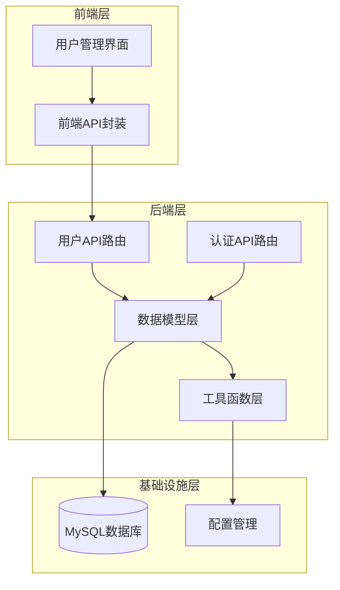
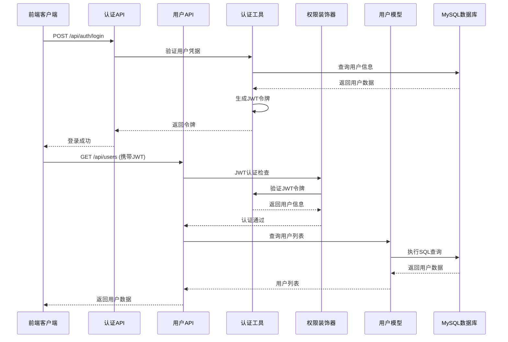
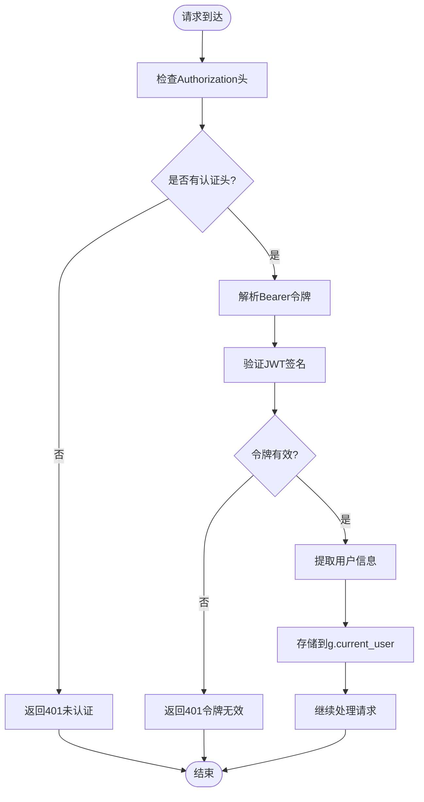
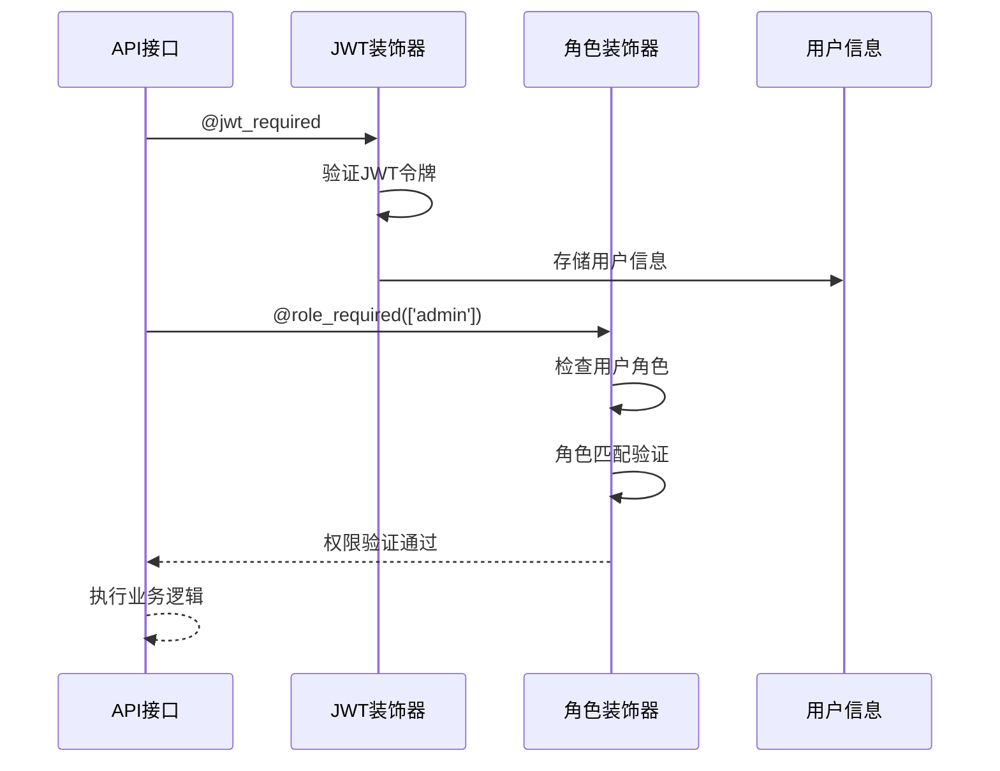
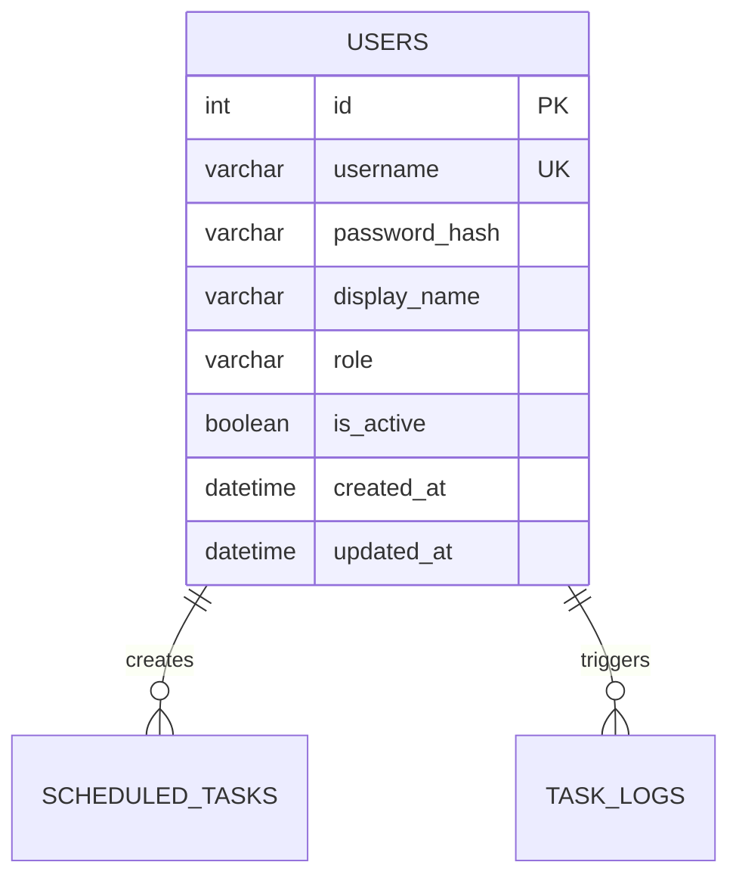
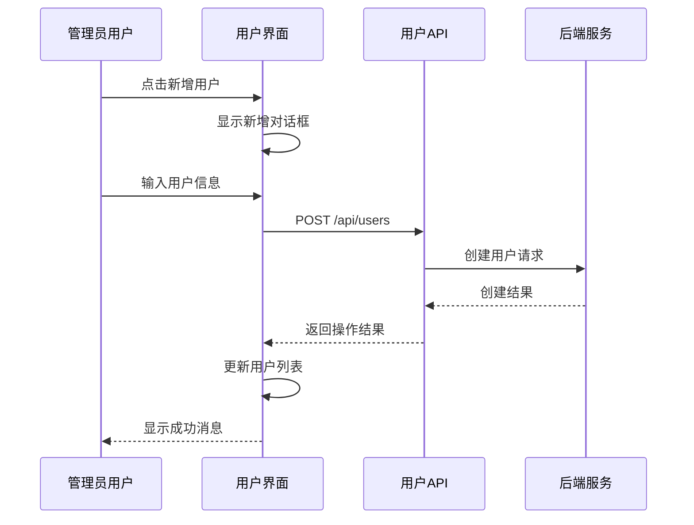
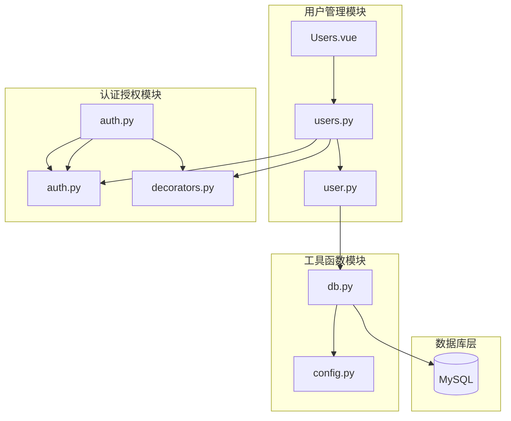

# 用户管理API

<cite>
**本文档引用的文件**
- [backend/app/api/users.py](file://backend/app/api/users.py)
- [backend/app/models/user.py](file://backend/app/models/user.py)
- [backend/app/utils/auth.py](file://backend/app/utils/auth.py)
- [backend/app/utils/decorators.py](file://backend/app/utils/decorators.py)
- [backend/app/utils/db.py](file://backend/app/utils/db.py)
- [backend/app/api/auth.py](file://backend/app/api/auth.py)
- [backend/app/config.py](file://backend/app/config.py)
- [backend/init_db.py](file://backend/init_db.py)
- [frontend/src/api/users.js](file://frontend/src/api/users.js)
- [frontend/src/views/Users.vue](file://frontend/src/views/Users.vue)
- [backend/app/api/export.py](file://backend/app/api/export.py)
</cite>

## 目录
1. [简介](#简介)
2. [项目结构](#项目结构)
3. [核心组件](#核心组件)
4. [架构概览](#架构概览)
5. [详细组件分析](#详细组件分析)
6. [依赖关系分析](#依赖关系分析)
7. [性能考虑](#性能考虑)
8. [故障排除指南](#故障排除指南)
9. [结论](#结论)
10. [附录](#附录)

## 简介
用户管理API是运维平台的核心功能模块，提供完整的用户生命周期管理能力。该系统采用前后端分离架构，后端基于Flask框架构建RESTful API，前端使用Vue.js开发管理界面。系统支持用户CRUD操作、角色权限管理、JWT认证授权、用户状态管理等核心功能。

## 项目结构
运维平台采用清晰的分层架构设计，主要分为以下层次：



**图表来源**
- [backend/app/api/users.py:1-268](file://backend/app/api/users.py#L1-L268)
- [backend/app/models/user.py:1-183](file://backend/app/models/user.py#L1-L183)
- [backend/app/utils/db.py:1-17](file://backend/app/utils/db.py#L1-L17)

**章节来源**
- [backend/app/api/users.py:1-268](file://backend/app/api/users.py#L1-L268)
- [backend/app/models/user.py:1-183](file://backend/app/models/user.py#L1-L183)
- [backend/app/utils/db.py:1-17](file://backend/app/utils/db.py#L1-L17)

## 核心组件
用户管理API由多个核心组件协同工作，形成完整的用户管理体系：

### 认证授权组件
系统采用JWT（JSON Web Token）进行身份认证，结合基于角色的访问控制（RBAC）实现细粒度的权限管理。

### 数据访问组件
用户数据通过专门的数据访问层进行统一管理，提供标准化的CRUD操作接口。

### 权限控制组件
通过装饰器模式实现中间件式的权限控制，确保API的安全性和一致性。

**章节来源**
- [backend/app/utils/auth.py:1-83](file://backend/app/utils/auth.py#L1-L83)
- [backend/app/utils/decorators.py:1-95](file://backend/app/utils/decorators.py#L1-L95)
- [backend/app/models/user.py:1-183](file://backend/app/models/user.py#L1-L183)

## 架构概览
系统采用分层架构设计，各层职责明确，耦合度低，便于维护和扩展。



**图表来源**
- [backend/app/api/auth.py:14-82](file://backend/app/api/auth.py#L14-L82)
- [backend/app/api/users.py:17-30](file://backend/app/api/users.py#L17-L30)
- [backend/app/utils/auth.py:38-56](file://backend/app/utils/auth.py#L38-L56)
- [backend/app/utils/decorators.py:9-57](file://backend/app/utils/decorators.py#L9-L57)

## 详细组件分析

### 用户API路由组件
用户管理API提供完整的RESTful接口，支持所有标准的CRUD操作。

#### 接口定义总览

| 方法 | 路径 | 权限要求 | 功能描述 |
|------|------|----------|----------|
| GET | /api/users | admin | 获取用户列表 |
| POST | /api/users | admin | 创建新用户 |
| PUT | /api/users/{id} | admin | 更新用户信息 |
| DELETE | /api/users/{id} | admin | 删除用户 |
| PUT | /api/users/{id}/reset-password | admin | 重置用户密码 |

#### 用户列表查询接口
支持基础的用户列表查询功能，返回所有用户的简要信息。

**请求参数**
- 无查询参数

**响应格式**
```json
{
  "code": 200,
  "data": [
    {
      "id": 1,
      "username": "admin",
      "display_name": "系统管理员",
      "role": "admin",
      "is_active": true,
      "created_at": "2024-01-01T00:00:00",
      "updated_at": "2024-01-01T00:00:00"
    }
  ]
}
```

**章节来源**
- [backend/app/api/users.py:17-30](file://backend/app/api/users.py#L17-L30)
- [backend/app/models/user.py:83-102](file://backend/app/models/user.py#L83-L102)

#### 用户创建接口
管理员可以创建新的用户账户，系统自动验证输入参数并进行业务规则检查。

**请求参数**
```json
{
  "username": "string",
  "password": "string",
  "display_name": "string",
  "role": "admin|operator|viewer"
}
```

**响应格式**
```json
{
  "code": 200,
  "message": "用户创建成功",
  "data": {
    "id": 1
  }
}
```

**错误处理**
- 400: 请求体为空、必填字段缺失、角色不合法、密码长度不足
- 409: 用户名已存在
- 500: 用户创建失败

**章节来源**
- [backend/app/api/users.py:33-96](file://backend/app/api/users.py#L33-L96)
- [backend/app/models/user.py:8-36](file://backend/app/models/user.py#L8-L36)

#### 用户更新接口
支持对用户信息的增量更新，包括显示名称、角色和激活状态。

**请求参数**
```json
{
  "display_name": "string",
  "role": "admin|operator|viewer",
  "is_active": boolean
}
```

**响应格式**
```json
{
  "code": 200,
  "message": "用户更新成功"
}
```

**错误处理**
- 400: 请求体为空、角色不合法、没有要更新的字段
- 404: 用户不存在
- 500: 用户更新失败

**章节来源**
- [backend/app/api/users.py:99-163](file://backend/app/api/users.py#L99-L163)
- [backend/app/models/user.py:105-135](file://backend/app/models/user.py#L105-L135)

#### 用户删除接口
管理员可以删除用户账户，但不允许删除当前登录的用户。

**请求参数**
- 无

**响应格式**
```json
{
  "code": 200,
  "message": "用户删除成功"
}
```

**错误处理**
- 400: 试图删除当前登录用户
- 404: 用户不存在
- 500: 用户删除失败

**章节来源**
- [backend/app/api/users.py:166-207](file://backend/app/api/users.py#L166-L207)

#### 密码重置接口
管理员可以重置任意用户的密码，系统自动进行密码强度验证。

**请求参数**
```json
{
  "new_password": "string"
}
```

**响应格式**
```json
{
  "code": 200,
  "message": "密码重置成功"
}
```

**错误处理**
- 400: 请求体为空、新密码为空、密码长度不足
- 404: 用户不存在
- 500: 密码重置失败

**章节来源**
- [backend/app/api/users.py:210-267](file://backend/app/api/users.py#L210-L267)

### 认证与授权组件

#### JWT认证机制
系统使用JWT进行无状态认证，每个请求都需要携带有效的认证令牌。



**图表来源**
- [backend/app/utils/decorators.py:20-54](file://backend/app/utils/decorators.py#L20-L54)

#### 角色权限控制
系统实现基于角色的访问控制（RBAC），通过装饰器实现细粒度的权限管理。

**支持的角色类型**
- admin: 系统管理员，拥有最高权限
- operator: 操作员，具备基本操作权限
- viewer: 只读用户，仅能查看数据

**权限检查流程**


**图表来源**
- [backend/app/utils/decorators.py:59-94](file://backend/app/utils/decorators.py#L59-L94)

**章节来源**
- [backend/app/utils/auth.py:11-35](file://backend/app/utils/auth.py#L11-L35)
- [backend/app/utils/decorators.py:1-95](file://backend/app/utils/decorators.py#L1-L95)

### 数据模型组件

#### 用户实体结构
系统使用标准化的用户实体结构，支持完整的用户信息管理。



**图表来源**
- [backend/init_db.py:34-46](file://backend/init_db.py#L34-L46)

#### 数据访问模式
用户数据访问采用统一的DAO（Data Access Object）模式，提供标准化的操作接口。

**核心操作方法**
- create_user(): 创建新用户
- get_user_by_username(): 按用户名查询
- get_user_by_id(): 按ID查询
- get_all_users(): 获取所有用户
- update_user(): 更新用户信息
- delete_user(): 删除用户
- update_password(): 更新密码

**章节来源**
- [backend/app/models/user.py:1-183](file://backend/app/models/user.py#L1-L183)
- [backend/init_db.py:34-46](file://backend/init_db.py#L34-L46)

### 前端集成组件

#### 用户管理界面
前端使用Vue.js开发用户管理界面，提供直观的用户操作体验。

**界面功能特性**
- 用户列表展示：支持按角色、状态筛选
- 实时搜索：支持用户名和显示名搜索
- 表单验证：前端表单验证和后端双重验证
- 操作确认：删除操作二次确认
- 权限控制：根据当前用户权限显示操作按钮

**交互流程**


**图表来源**
- [frontend/src/views/Users.vue:193-233](file://frontend/src/views/Users.vue#L193-L233)
- [frontend/src/api/users.js:7-9](file://frontend/src/api/users.js#L7-L9)

**章节来源**
- [frontend/src/views/Users.vue:1-297](file://frontend/src/views/Users.vue#L1-L297)
- [frontend/src/api/users.js:1-22](file://frontend/src/api/users.js#L1-L22)

### 批量操作与导入导出

#### 导出功能
系统提供Excel格式的数据导出功能，支持多表数据的批量导出。

**导出的数据表**
- 服务器管理
- 服务管理  
- Web账户
- 应用系统
- 域名证书

**章节来源**
- [backend/app/api/export.py:64-297](file://backend/app/api/export.py#L64-L297)

## 依赖关系分析

系统采用模块化设计，各组件之间的依赖关系清晰明确。



**图表来源**
- [backend/app/api/users.py:1-268](file://backend/app/api/users.py#L1-L268)
- [backend/app/models/user.py:1-183](file://backend/app/models/user.py#L1-L183)
- [backend/app/utils/decorators.py:1-95](file://backend/app/utils/decorators.py#L1-L95)
- [backend/app/utils/db.py:1-17](file://backend/app/utils/db.py#L1-L17)

**章节来源**
- [backend/app/api/users.py:1-268](file://backend/app/api/users.py#L1-L268)
- [backend/app/models/user.py:1-183](file://backend/app/models/user.py#L1-L183)
- [backend/app/utils/decorators.py:1-95](file://backend/app/utils/decorators.py#L1-L95)

## 性能考虑
系统在设计时充分考虑了性能优化和可扩展性：

### 数据库优化
- 用户名建立唯一索引，提高查询效率
- 角色字段建立索引，支持角色筛选
- 使用连接池减少数据库连接开销

### 缓存策略
- JWT令牌在内存中缓存，避免重复验证
- 前端对用户列表进行本地缓存
- 合理的HTTP缓存头设置

### 并发处理
- Flask应用支持多线程并发处理
- 数据库操作使用事务保证数据一致性
- 异步任务处理耗时操作

## 故障排除指南

### 常见问题及解决方案

#### 认证相关问题
**问题**: 401 未认证错误
**原因**: 缺少Authorization头或令牌格式错误
**解决**: 确保请求头格式为"Bearer {token}"

**问题**: 401 Token无效或已过期
**原因**: JWT令牌过期或签名验证失败
**解决**: 重新登录获取新令牌

#### 权限相关问题
**问题**: 403 权限不足
**原因**: 当前用户角色不满足接口权限要求
**解决**: 使用具有相应权限的管理员账户

#### 数据操作问题
**问题**: 409 用户名已存在
**原因**: 注册的用户名已被其他用户使用
**解决**: 更换唯一的用户名

**问题**: 404 用户不存在
**原因**: 操作的目标用户ID不存在
**解决**: 检查用户ID是否正确

#### 数据库连接问题
**问题**: 数据库连接失败
**原因**: 数据库配置错误或网络问题
**解决**: 检查数据库连接参数和网络连通性

**章节来源**
- [backend/app/utils/decorators.py:22-45](file://backend/app/utils/decorators.py#L22-L45)
- [backend/app/api/users.py:45-83](file://backend/app/api/users.py#L45-L83)

## 结论
用户管理API提供了完整、安全、易用的用户生命周期管理功能。系统采用现代化的技术栈和架构设计，具备良好的可扩展性和维护性。通过JWT认证和RBAC权限控制，确保了系统的安全性。前后端分离的设计提高了开发效率和用户体验。

主要优势：
- 完整的用户CRUD操作支持
- 细粒度的权限控制机制
- 标准化的RESTful API设计
- 前后端分离的架构模式
- 良好的错误处理和异常管理

建议的后续改进方向：
- 添加用户分页查询功能
- 实现用户导入导出功能
- 增加用户操作审计日志
- 优化前端用户体验

## 附录

### API使用示例

#### 获取用户列表
```bash
curl -X GET "http://localhost:5000/api/users" \
  -H "Authorization: Bearer {your-jwt-token}"
```

#### 创建用户
```bash
curl -X POST "http://localhost:5000/api/users" \
  -H "Authorization: Bearer {your-jwt-token}" \
  -H "Content-Type: application/json" \
  -d '{
    "username": "testuser",
    "password": "password123",
    "display_name": "测试用户",
    "role": "operator"
  }'
```

#### 更新用户
```bash
curl -X PUT "http://localhost:5000/api/users/1" \
  -H "Authorization: Bearer {your-jwt-token}" \
  -H "Content-Type: application/json" \
  -d '{
    "display_name": "更新后的显示名",
    "is_active": false
  }'
```

#### 删除用户
```bash
curl -X DELETE "http://localhost:5000/api/users/1" \
  -H "Authorization: Bearer {your-jwt-token}"
```

### 配置说明

#### 数据库配置
```python
class Config:
    DB_HOST = '192.168.1.124'  # 数据库主机
    DB_PORT = 3306            # 数据库端口
    DB_USER = 'root'          # 数据库用户名
    DB_PASSWORD = 'Pass1234.' # 数据库密码
    DB_NAME = 'ops_platform'  # 数据库名
```

#### JWT配置
```python
class Config:
    JWT_SECRET_KEY = 'jwt-secret-key-change-in-prod'  # JWT密钥
    JWT_EXPIRATION_HOURS = 24                        # 令牌过期时间（小时）
```

**章节来源**
- [backend/app/config.py:4-21](file://backend/app/config.py#L4-L21)
- [backend/app/api/users.py:1-268](file://backend/app/api/users.py#L1-L268)