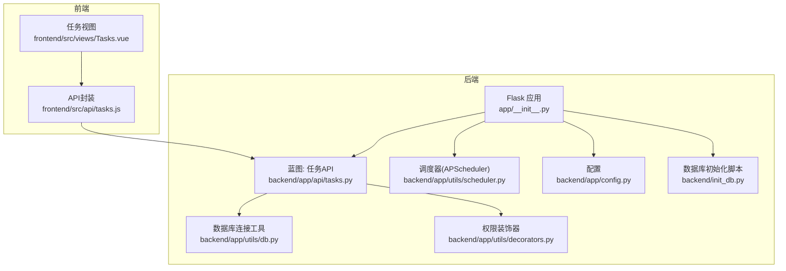
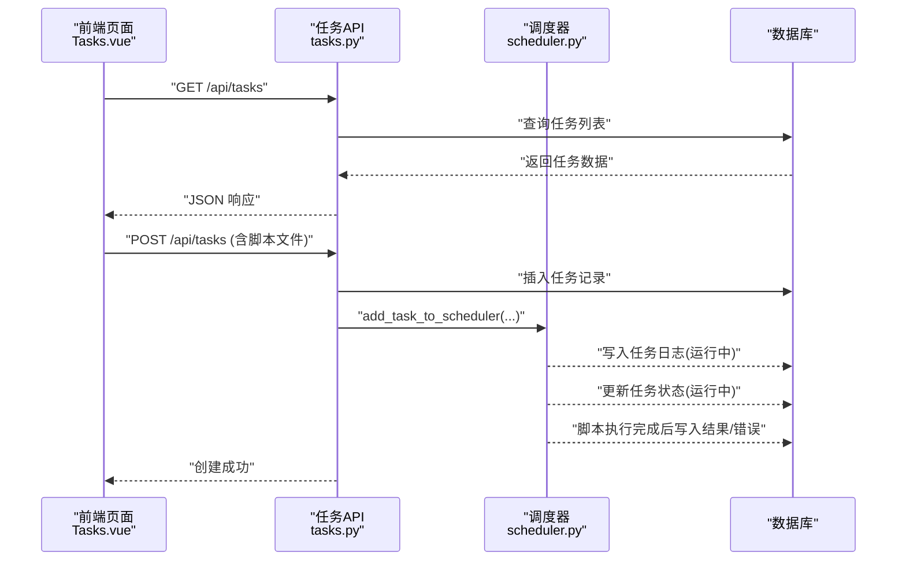
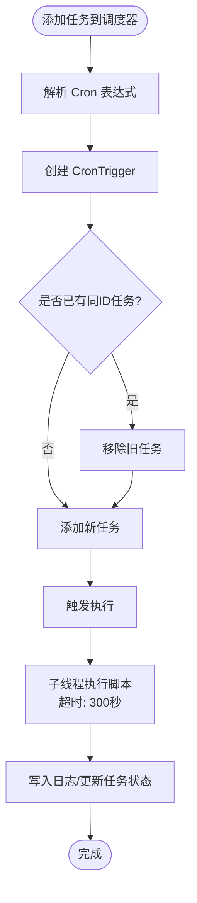
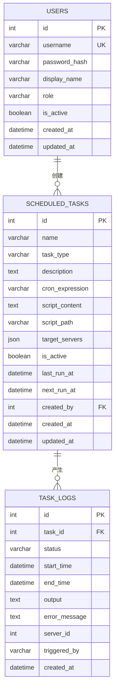
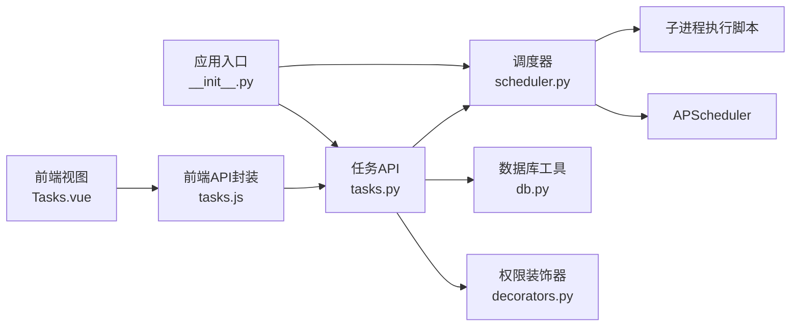

# 定时任务管理

<cite>
**本文引用的文件**
- [backend/app/api/tasks.py](file://backend/app/api/tasks.py)
- [backend/app/utils/scheduler.py](file://backend/app/utils/scheduler.py)
- [backend/app/utils/db.py](file://backend/app/utils/db.py)
- [backend/app/utils/decorators.py](file://backend/app/utils/decorators.py)
- [backend/app/config.py](file://backend/app/config.py)
- [backend/app/__init__.py](file://backend/app/__init__.py)
- [backend/run.py](file://backend/run.py)
- [backend/init_db.py](file://backend/init_db.py)
- [frontend/src/api/tasks.js](file://frontend/src/api/tasks.js)
- [frontend/src/views/Tasks.vue](file://frontend/src/views/Tasks.vue)
</cite>

## 目录
1. [简介](#简介)
2. [项目结构](#项目结构)
3. [核心组件](#核心组件)
4. [架构总览](#架构总览)
5. [详细组件分析](#详细组件分析)
6. [依赖分析](#依赖分析)
7. [性能考虑](#性能考虑)
8. [故障排查指南](#故障排查指南)
9. [结论](#结论)
10. [附录](#附录)

## 简介
本项目提供一套基于 Flask 的定时任务管理能力，围绕 APscheduler 实现任务的创建、启动、停止、暂停、删除、手动执行、状态监控与日志查询等功能。系统支持通过 Cron 表达式设定执行计划，具备脚本文件上传与执行、任务状态持久化、执行日志记录、超时控制等特性。前端采用 Vue + Element Plus 提供可视化界面，后端通过 RESTful 接口暴露全部能力。

## 项目结构
后端采用 Flask 蓝图组织 API，定时任务相关逻辑集中在 tasks 蓝图；调度器封装在 utils/scheduler.py 中；数据库连接与装饰器工具分别位于 utils/db.py 与 utils/decorators.py；应用入口在 app/__init__.py 中注册蓝图并初始化调度器；数据库表结构由 init_db.py 定义。

图表来源
- [backend/app/__init__.py:37-60](file://backend/app/__init__.py#L37-L60)
- [backend/app/api/tasks.py:1-458](file://backend/app/api/tasks.py#L1-L458)
- [backend/app/utils/scheduler.py:1-249](file://backend/app/utils/scheduler.py#L1-L249)
- [backend/app/utils/db.py:1-17](file://backend/app/utils/db.py#L1-L17)
- [backend/app/utils/decorators.py:1-95](file://backend/app/utils/decorators.py#L1-L95)
- [backend/app/config.py:1-21](file://backend/app/config.py#L1-L21)
- [backend/init_db.py:150-210](file://backend/init_db.py#L150-L210)
- [frontend/src/views/Tasks.vue:137-368](file://frontend/src/views/Tasks.vue#L137-L368)
- [frontend/src/api/tasks.js:1-34](file://frontend/src/api/tasks.js#L1-L34)

章节来源
- [backend/app/__init__.py:6-35](file://backend/app/__init__.py#L6-L35)
- [backend/app/api/tasks.py:15-458](file://backend/app/api/tasks.py#L15-L458)
- [backend/app/utils/scheduler.py:1-249](file://backend/app/utils/scheduler.py#L1-L249)
- [backend/app/utils/db.py:1-17](file://backend/app/utils/db.py#L1-L17)
- [backend/app/utils/decorators.py:1-95](file://backend/app/utils/decorators.py#L1-L95)
- [backend/app/config.py:1-21](file://backend/app/config.py#L1-L21)
- [backend/init_db.py:150-210](file://backend/init_db.py#L150-L210)
- [frontend/src/views/Tasks.vue:137-368](file://frontend/src/views/Tasks.vue#L137-L368)
- [frontend/src/api/tasks.js:1-34](file://frontend/src/api/tasks.js#L1-L34)

## 核心组件
- 任务 API 蓝图：提供任务的增删改查、启停切换、手动执行、日志查询等接口。
- 调度器模块：基于 APscheduler 的后台调度器，负责解析 Cron 表达式、添加/移除任务、执行脚本并记录日志。
- 权限装饰器：统一处理 JWT 认证与角色校验。
- 数据库工具：提供 Flask 应用上下文下的数据库连接。
- 配置模块：集中管理数据库、上传目录、调试参数等。
- 前端任务视图与 API 封装：提供任务列表、新增/编辑、启停、手动执行、日志查看等交互。

章节来源
- [backend/app/api/tasks.py:33-458](file://backend/app/api/tasks.py#L33-L458)
- [backend/app/utils/scheduler.py:14-249](file://backend/app/utils/scheduler.py#L14-L249)
- [backend/app/utils/decorators.py:9-95](file://backend/app/utils/decorators.py#L9-L95)
- [backend/app/utils/db.py:5-17](file://backend/app/utils/db.py#L5-L17)
- [backend/app/config.py:4-21](file://backend/app/config.py#L4-L21)
- [frontend/src/views/Tasks.vue:137-368](file://frontend/src/views/Tasks.vue#L137-L368)
- [frontend/src/api/tasks.js:1-34](file://frontend/src/api/tasks.js#L1-L34)

## 架构总览
系统采用前后端分离架构：前端通过封装好的 API 请求后端任务接口；后端以 Flask 蓝图承载业务逻辑，调度器在应用启动时初始化并从数据库加载活跃任务；任务执行通过子线程异步执行，避免阻塞主流程；数据库持久化任务与日志。

图表来源
- [frontend/src/views/Tasks.vue:180-188](file://frontend/src/views/Tasks.vue#L180-L188)
- [frontend/src/api/tasks.js:3-11](file://frontend/src/api/tasks.js#L3-L11)
- [backend/app/api/tasks.py:63-137](file://backend/app/api/tasks.py#L63-L137)
- [backend/app/utils/scheduler.py:146-186](file://backend/app/utils/scheduler.py#L146-L186)

## 详细组件分析

### 任务生命周期管理 API
- 获取任务列表：支持按创建时间倒序返回任务及创建者信息。
- 创建任务：接收任务名称、描述、Cron 表达式与脚本文件，保存至上传目录，写入数据库，若数据库配置可用则加入调度器。
- 更新任务：可更换脚本文件，更新后若任务处于启用状态则重新加入调度器。
- 删除任务：从调度器移除、删除脚本文件、清理相关日志与任务记录。
- 启停任务：切换 is_active 字段，启用时加入调度器，禁用时从调度器移除。
- 手动执行：在新线程中执行脚本，记录运行日志，更新任务最近状态与输出。
- 获取任务日志：按任务 ID 查询最近若干条执行日志。

章节来源
- [backend/app/api/tasks.py:33-458](file://backend/app/api/tasks.py#L33-L458)

### 调度器与任务执行
- Cron 表达式解析：按“分 时 日 月 周”五个字段构建 CronTrigger。
- 任务添加/移除：根据任务 ID 生成唯一 job_id，支持替换现有任务。
- 执行脚本：在子线程中执行 Python 脚本，捕获标准输出与错误，设置超时时间；更新任务与日志表。
- 初始化加载：应用启动时从数据库查询活跃任务并加载到调度器。

图表来源
- [backend/app/utils/scheduler.py:146-186](file://backend/app/utils/scheduler.py#L146-L186)
- [backend/app/utils/scheduler.py:32-144](file://backend/app/utils/scheduler.py#L32-L144)

章节来源
- [backend/app/utils/scheduler.py:146-249](file://backend/app/utils/scheduler.py#L146-L249)

### 权限与认证
- JWT 认证装饰器：从 Authorization 头提取 Bearer Token，校验失败返回 401。
- 角色校验装饰器：要求用户具备指定角色（如 admin/operator），否则返回 403。
- 任务相关接口均需通过 JWT 且满足角色要求。

章节来源
- [backend/app/utils/decorators.py:9-95](file://backend/app/utils/decorators.py#L9-L95)
- [backend/app/api/tasks.py:63-137](file://backend/app/api/tasks.py#L63-L137)

### 数据模型与表结构
- scheduled_tasks：存储任务基本信息、Cron 表达式、脚本路径、状态与时间戳。
- task_logs：存储每次执行的开始/结束时间、状态、输出与错误信息、触发方式等。
- users：用户表，用于关联任务创建者。

图表来源
- [backend/init_db.py:150-210](file://backend/init_db.py#L150-L210)

章节来源
- [backend/init_db.py:150-210](file://backend/init_db.py#L150-L210)

### 前端交互与示例
- 任务列表：支持搜索、状态切换、手动执行、查看日志、编辑与删除。
- 新增/编辑：表单校验任务名称与 Cron 表达式，支持上传 .py 脚本文件。
- 日志查看：抽屉展示最近执行日志，支持查看输出与错误详情。
- API 调用：封装 GET/POST/PUT/DELETE 与任务 ID 路径参数。

章节来源
- [frontend/src/views/Tasks.vue:137-368](file://frontend/src/views/Tasks.vue#L137-L368)
- [frontend/src/api/tasks.js:1-34](file://frontend/src/api/tasks.js#L1-L34)

## 依赖分析
- 任务 API 依赖数据库工具与装饰器，调用调度器模块进行任务的增删改启停与执行。
- 调度器依赖 APScheduler 与子进程执行脚本，使用独立数据库连接写入日志与状态。
- 应用入口在启动时注册蓝图并初始化调度器，确保系统运行即加载活跃任务。
- 前端通过封装的 API 与后端交互，实现完整的任务管理闭环。

图表来源
- [backend/app/api/tasks.py:1-15](file://backend/app/api/tasks.py#L1-L15)
- [backend/app/utils/decorators.py:1-95](file://backend/app/utils/decorators.py#L1-L95)
- [backend/app/utils/db.py:1-17](file://backend/app/utils/db.py#L1-L17)
- [backend/app/utils/scheduler.py:1-12](file://backend/app/utils/scheduler.py#L1-L12)
- [backend/app/__init__.py:30-34](file://backend/app/__init__.py#L30-L34)
- [frontend/src/views/Tasks.vue:137-141](file://frontend/src/views/Tasks.vue#L137-L141)
- [frontend/src/api/tasks.js:1-11](file://frontend/src/api/tasks.js#L1-L11)

章节来源
- [backend/app/api/tasks.py:1-15](file://backend/app/api/tasks.py#L1-L15)
- [backend/app/utils/scheduler.py:1-12](file://backend/app/utils/scheduler.py#L1-L12)
- [backend/app/__init__.py:30-34](file://backend/app/__init__.py#L30-L34)
- [frontend/src/views/Tasks.vue:137-141](file://frontend/src/views/Tasks.vue#L137-L141)
- [frontend/src/api/tasks.js:1-11](file://frontend/src/api/tasks.js#L1-L11)

## 性能考虑
- 异步执行：任务执行在子线程中进行，避免阻塞调度器主线程与 Web 请求。
- 超时控制：脚本执行设置超时阈值，防止长时间阻塞导致资源占用。
- 连接复用：调度器回调使用独立数据库连接，减少锁竞争与上下文开销。
- 启动加载：应用启动时仅加载活跃任务，减少不必要的调度负担。
- 前端分页：日志查询限制返回数量，降低前端渲染压力。

[本节为通用建议，无需列出具体文件来源]

## 故障排查指南
- 认证失败：确认请求头包含有效的 Bearer Token，且 Token 未过期。
- 权限不足：确认当前用户角色具备操作所需权限。
- 任务创建失败：检查 Cron 表达式格式是否为“分 时 日 月 周”五字段，脚本文件是否正确上传。
- 调度器未启动：确认应用已启动并完成调度器初始化。
- 手动执行无响应：检查脚本路径是否存在、数据库连接是否正常、日志是否记录。
- 日志为空：确认任务存在且已执行过，或调整查询条数限制。

章节来源
- [backend/app/utils/decorators.py:20-56](file://backend/app/utils/decorators.py#L20-L56)
- [backend/app/api/tasks.py:63-137](file://backend/app/api/tasks.py#L63-L137)
- [backend/app/utils/scheduler.py:201-249](file://backend/app/utils/scheduler.py#L201-L249)

## 结论
该定时任务管理系统以 Flask + APscheduler 为核心，结合数据库持久化与前端可视化，实现了从任务创建到执行监控的完整生命周期管理。通过权限装饰器与角色控制保障安全，通过超时与异步执行提升稳定性。系统结构清晰、扩展性强，适合在运维场景中快速落地与迭代。

[本节为总结性内容，无需列出具体文件来源]

## 附录

### API 定义与调用示例
- 获取任务列表
  - 方法：GET
  - 路径：/api/tasks
  - 认证：需要 JWT
  - 响应：包含任务数组的 JSON 对象
  - 示例参考：[frontend/src/api/tasks.js:3-5](file://frontend/src/api/tasks.js#L3-L5)

- 创建任务
  - 方法：POST
  - 路径：/api/tasks
  - 参数：multipart/form-data，包含 name、description、cron_expression、script（文件）
  - 认证：需要 JWT，角色：admin/operator
  - 响应：成功/失败信息
  - 示例参考：[frontend/src/api/tasks.js:7-11](file://frontend/src/api/tasks.js#L7-L11)

- 更新任务
  - 方法：PUT
  - 路径：/api/tasks/{task_id}
  - 参数：multipart/form-data，可选 script 文件
  - 认证：需要 JWT，角色：admin/operator
  - 响应：成功/失败信息
  - 示例参考：[frontend/src/api/tasks.js:13-17](file://frontend/src/api/tasks.js#L13-L17)

- 删除任务
  - 方法：DELETE
  - 路径：/api/tasks/{task_id}
  - 认证：需要 JWT，角色：admin/operator
  - 响应：成功/失败信息
  - 示例参考：[frontend/src/api/tasks.js:19-21](file://frontend/src/api/tasks.js#L19-L21)

- 启停任务
  - 方法：POST
  - 路径：/api/tasks/{task_id}/toggle
  - 认证：需要 JWT，角色：admin/operator
  - 响应：包含新状态的数据
  - 示例参考：[frontend/src/api/tasks.js:23-25](file://frontend/src/api/tasks.js#L23-L25)

- 手动执行任务
  - 方法：POST
  - 路径：/api/tasks/{task_id}/run
  - 认证：需要 JWT，角色：admin/operator
  - 响应：执行状态
  - 示例参考：[frontend/src/api/tasks.js:27-29](file://frontend/src/api/tasks.js#L27-L29)

- 获取任务日志
  - 方法：GET
  - 路径：/api/tasks/{task_id}/logs
  - 认证：需要 JWT
  - 响应：包含日志数组的 JSON 对象
  - 示例参考：[frontend/src/api/tasks.js:31-33](file://frontend/src/api/tasks.js#L31-L33)

章节来源
- [frontend/src/api/tasks.js:1-34](file://frontend/src/api/tasks.js#L1-L34)
- [backend/app/api/tasks.py:33-458](file://backend/app/api/tasks.py#L33-L458)

### Cron 表达式格式
- 格式：分 时 日 月 周（共 5 个字段）
- 示例：0 2 * * * 表示每天凌晨 2 点执行
- 参考：[backend/app/utils/scheduler.py:146-186](file://backend/app/utils/scheduler.py#L146-L186)

### 配置项
- 数据库连接：DB_HOST、DB_PORT、DB_USER、DB_PASSWORD、DB_NAME
- 上传目录：UPLOAD_FOLDER
- 调试与监听：DEBUG、HOST、PORT
- 参考：[backend/app/config.py:4-21](file://backend/app/config.py#L4-L21)

### 应用启动与初始化
- 应用入口：run.py
- 初始化：注册蓝图、初始化调度器
- 参考：[backend/run.py:1-8](file://backend/run.py#L1-L8), [backend/app/__init__.py:30-34](file://backend/app/__init__.py#L30-L34)