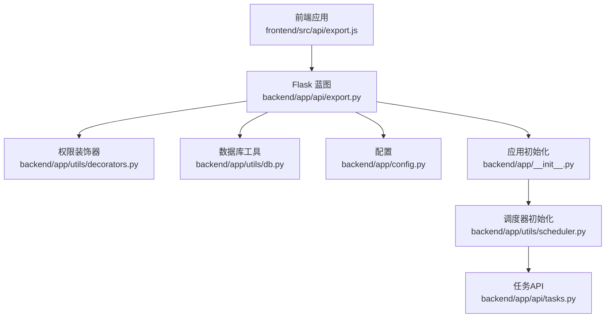
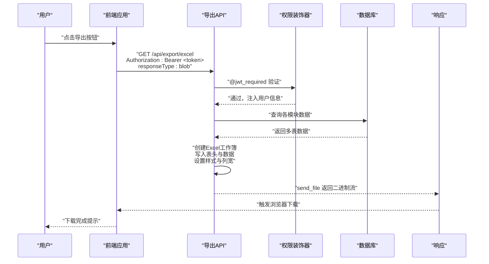
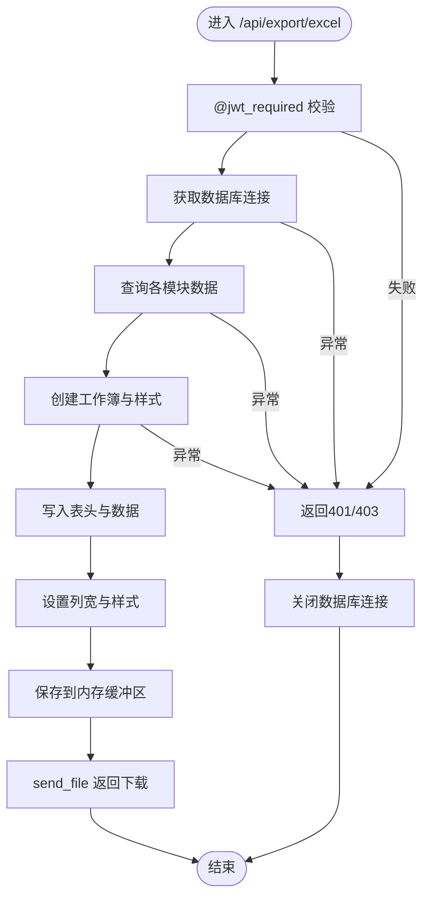
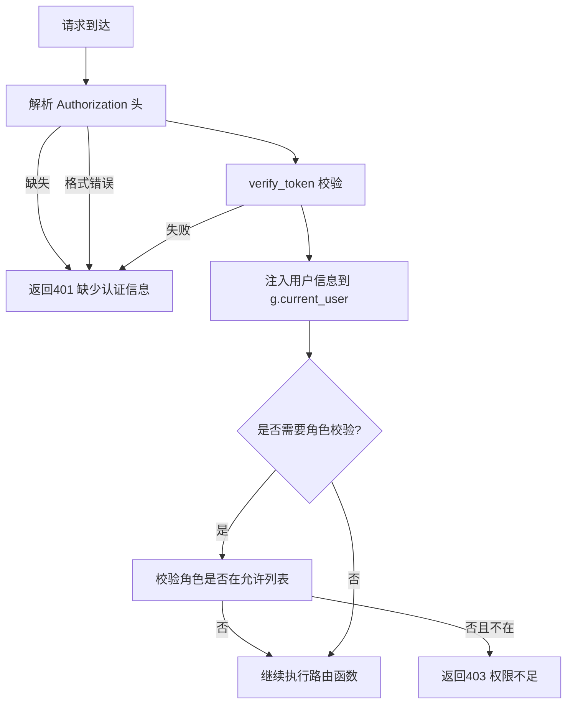
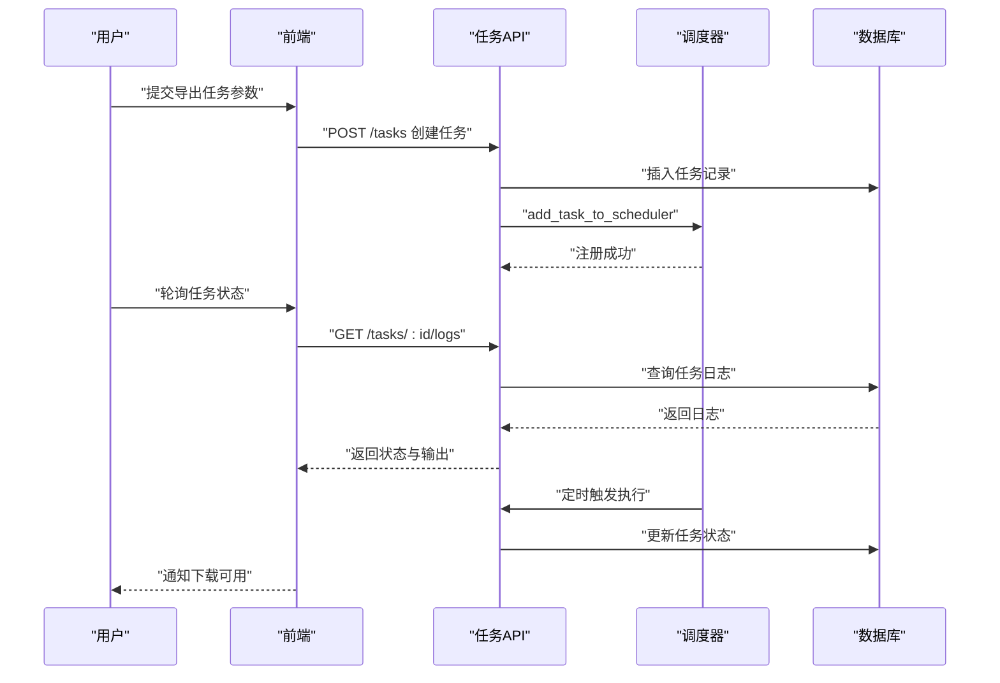
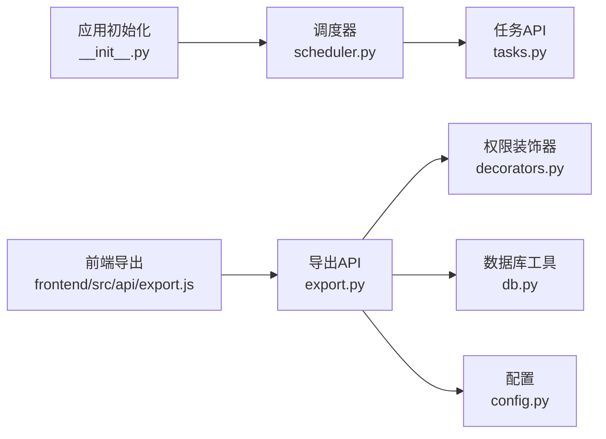

# 数据导出系统

<cite>
**本文档引用的文件**
- [backend/app/api/export.py](file://backend/app/api/export.py)
- [backend/app/utils/decorators.py](file://backend/app/utils/decorators.py)
- [backend/app/utils/db.py](file://backend/app/utils/db.py)
- [backend/app/config.py](file://backend/app/config.py)
- [backend/app/__init__.py](file://backend/app/__init__.py)
- [backend/init_db.py](file://backend/init_db.py)
- [backend/import_data.py](file://backend/import_data.py)
- [backend/app/utils/scheduler.py](file://backend/app/utils/scheduler.py)
- [backend/app/api/tasks.py](file://backend/app/api/tasks.py)
- [frontend/src/api/export.js](file://frontend/src/api/export.js)
</cite>

## 目录
1. [简介](#简介)
2. [项目结构](#项目结构)
3. [核心组件](#核心组件)
4. [架构总览](#架构总览)
5. [详细组件分析](#详细组件分析)
6. [依赖分析](#依赖分析)
7. [性能考虑](#性能考虑)
8. [故障排除指南](#故障排除指南)
9. [结论](#结论)
10. [附录](#附录)

## 简介
本项目提供运维管理平台的数据导出能力，当前支持将多模块数据整合导出为 Excel 文件。系统采用前后端分离架构，后端基于 Flask 提供 REST API，前端通过 Axios 请求导出接口，返回二进制流并触发浏览器下载。系统具备基础的权限控制、数据库连接管理、以及可扩展的异步任务调度能力。

## 项目结构
后端采用蓝图组织 API，导出功能位于 `backend/app/api/export.py`，权限控制由 `backend/app/utils/decorators.py` 提供，数据库连接封装于 `backend/app/utils/db.py`。前端导出调用位于 `frontend/src/api/export.js`，通过统一请求封装发起 GET 请求并指定响应类型为 blob，以便浏览器正确下载 Excel 文件。

**图表来源**
- [backend/app/api/export.py:1-261](file://backend/app/api/export.py#L1-L261)
- [backend/app/utils/decorators.py:1-95](file://backend/app/utils/decorators.py#L1-L95)
- [backend/app/utils/db.py:1-17](file://backend/app/utils/db.py#L1-L17)
- [backend/app/config.py:1-21](file://backend/app/config.py#L1-L21)
- [backend/app/__init__.py:1-60](file://backend/app/__init__.py#L1-L60)
- [backend/app/utils/scheduler.py:1-249](file://backend/app/utils/scheduler.py#L1-L249)
- [backend/app/api/tasks.py:1-458](file://backend/app/api/tasks.py#L1-L458)
- [frontend/src/api/export.js:1-8](file://frontend/src/api/export.js#L1-L8)

**章节来源**
- [backend/app/api/export.py:1-261](file://backend/app/api/export.py#L1-L261)
- [backend/app/utils/decorators.py:1-95](file://backend/app/utils/decorators.py#L1-L95)
- [backend/app/utils/db.py:1-17](file://backend/app/utils/db.py#L1-L17)
- [backend/app/config.py:1-21](file://backend/app/config.py#L1-L21)
- [backend/app/__init__.py:1-60](file://backend/app/__init__.py#L1-L60)
- [frontend/src/api/export.js:1-8](file://frontend/src/api/export.js#L1-L8)

## 核心组件
- 导出蓝图与路由
  - 蓝图注册于应用初始化阶段，导出路由 `/api/export/excel`，使用 JWT 权限装饰器保护。
  - 路由负责构建多工作表的 Excel 文件，写入表头与数据，设置样式与列宽，最终以二进制流返回并触发下载。
- 权限控制
  - `@jwt_required` 装饰器从请求头解析 Bearer Token，校验通过后将用户信息注入到 `flask.g.current_user`，供后续逻辑使用。
- 数据库连接
  - `get_db()` 统一封装数据库连接参数，确保导出过程中的数据一致性与可关闭性。
- 前端导出调用
  - 前端通过 `responseType: 'blob'` 发起 GET 请求，后端返回 Excel 文件并自动触发浏览器下载。

**章节来源**
- [backend/app/api/export.py:64-261](file://backend/app/api/export.py#L64-L261)
- [backend/app/utils/decorators.py:9-56](file://backend/app/utils/decorators.py#L9-L56)
- [backend/app/utils/db.py:5-16](file://backend/app/utils/db.py#L5-L16)
- [frontend/src/api/export.js:3-7](file://frontend/src/api/export.js#L3-L7)

## 架构总览
下图展示了从用户触发导出到文件下载的完整流程，包括权限校验、数据查询、Excel 生成与下载响应。

**图表来源**
- [backend/app/api/export.py:64-261](file://backend/app/api/export.py#L64-L261)
- [backend/app/utils/decorators.py:9-56](file://backend/app/utils/decorators.py#L9-L56)
- [frontend/src/api/export.js:3-7](file://frontend/src/api/export.js#L3-L7)

## 详细组件分析

### 导出API组件
- 功能概述
  - 路由 `/api/export/excel` 支持将服务器管理、服务管理、应用系统、域名证书四个模块的数据导出为一个 Excel 文件，每个模块对应一个工作表。
  - 实现包含样式设置、列宽调整、空值安全处理、异常捕获与资源清理。
- 关键实现点
  - 工作簿创建与样式：创建表头样式与单元格样式，分别应用于表头与数据区域。
  - 数据写入：按模块查询数据并逐行写入，使用安全值转换处理 None 与日期类型。
  - 列宽策略：根据表头与数据长度动态计算列宽，限制最小与最大宽度。
  - 响应处理：将工作簿保存至内存缓冲区，设置合适的 MIME 类型与下载文件名，返回二进制流。
- 错误处理
  - 捕获导出过程中的异常，返回统一的 JSON 错误响应；确保数据库连接在 finally 中关闭。

**图表来源**
- [backend/app/api/export.py:64-261](file://backend/app/api/export.py#L64-L261)

**章节来源**
- [backend/app/api/export.py:64-261](file://backend/app/api/export.py#L64-L261)

### 权限控制组件
- JWT 认证装饰器
  - 从 Authorization 头提取 Bearer Token，验证通过后将用户信息注入到 `flask.g.current_user`，供路由函数使用。
  - 若缺少认证信息、格式错误或 Token 无效/过期，返回相应状态码与错误信息。
- 角色权限装饰器
  - 可在 `@jwt_required` 之后使用，校验用户角色是否在允许列表中，否则返回 403。

**图表来源**
- [backend/app/utils/decorators.py:9-95](file://backend/app/utils/decorators.py#L9-L95)

**章节来源**
- [backend/app/utils/decorators.py:9-95](file://backend/app/utils/decorators.py#L9-L95)

### 数据库连接组件
- 统一连接封装
  - 从应用配置读取数据库连接参数，返回持久化连接对象，便于在导出过程中进行多表查询与事务管理。
- 资源管理
  - 导出完成后在 finally 中关闭连接，避免连接泄漏。

**章节来源**
- [backend/app/utils/db.py:5-16](file://backend/app/utils/db.py#L5-L16)

### 前端导出调用
- 前端通过封装的请求方法调用后端导出接口，设置响应类型为 blob，确保浏览器能正确接收并下载 Excel 文件。
- 下载行为由浏览器根据响应头自动触发，无需额外处理。

**章节来源**
- [frontend/src/api/export.js:3-7](file://frontend/src/api/export.js#L3-L7)

### 异步任务与调度（扩展能力）
- 当前导出为同步请求，但系统已具备异步任务调度能力，可用于未来实现“异步导出任务”：
  - 任务创建：前端提交导出参数，后端创建任务记录并加入调度器。
  - 任务执行：调度器按 Cron 表达式定期执行，或手动触发执行。
  - 状态查询：前端轮询任务状态与日志，完成后提供下载链接。
  - 通知机制：任务完成后通过消息或邮件通知用户。

**图表来源**
- [backend/app/api/tasks.py:63-421](file://backend/app/api/tasks.py#L63-L421)
- [backend/app/utils/scheduler.py:146-249](file://backend/app/utils/scheduler.py#L146-L249)

**章节来源**
- [backend/app/api/tasks.py:63-421](file://backend/app/api/tasks.py#L63-L421)
- [backend/app/utils/scheduler.py:146-249](file://backend/app/utils/scheduler.py#L146-L249)

## 依赖分析
- 组件耦合
  - 导出 API 依赖权限装饰器与数据库工具，职责清晰、耦合度低。
  - 前端仅依赖统一请求封装，不直接关心后端实现细节。
- 外部依赖
  - Flask 蓝图、openpyxl（Excel 生成）、APScheduler（任务调度）。
- 潜在循环依赖
  - 未发现循环依赖迹象，模块间通过蓝图与工具函数解耦。

**图表来源**
- [backend/app/api/export.py:1-261](file://backend/app/api/export.py#L1-L261)
- [backend/app/utils/decorators.py:1-95](file://backend/app/utils/decorators.py#L1-L95)
- [backend/app/utils/db.py:1-17](file://backend/app/utils/db.py#L1-L17)
- [backend/app/config.py:1-21](file://backend/app/config.py#L1-L21)
- [backend/app/__init__.py:1-60](file://backend/app/__init__.py#L1-L60)
- [backend/app/utils/scheduler.py:1-249](file://backend/app/utils/scheduler.py#L1-L249)
- [backend/app/api/tasks.py:1-458](file://backend/app/api/tasks.py#L1-L458)
- [frontend/src/api/export.js:1-8](file://frontend/src/api/export.js#L1-L8)

**章节来源**
- [backend/app/api/export.py:1-261](file://backend/app/api/export.py#L1-L261)
- [backend/app/utils/decorators.py:1-95](file://backend/app/utils/decorators.py#L1-L95)
- [backend/app/utils/db.py:1-17](file://backend/app/utils/db.py#L1-L17)
- [backend/app/config.py:1-21](file://backend/app/config.py#L1-L21)
- [backend/app/__init__.py:1-60](file://backend/app/__init__.py#L1-L60)
- [backend/app/utils/scheduler.py:1-249](file://backend/app/utils/scheduler.py#L1-L249)
- [backend/app/api/tasks.py:1-458](file://backend/app/api/tasks.py#L1-L458)
- [frontend/src/api/export.js:1-8](file://frontend/src/api/export.js#L1-L8)

## 性能考虑
- 当前实现为同步导出，适合中小规模数据。对于大规模数据，建议采用以下优化策略：
  - 分页导出：按主键范围分批查询与写入，减少单次内存占用。
  - 流式写入：使用流式 Excel 写入库或分块写入，降低内存峰值。
  - 并发处理：结合异步任务调度，后台生成文件并提供下载链接。
  - 缓存策略：对热点查询结果进行缓存，减少重复导出压力。
  - 前端进度：在异步模式下提供进度条与状态反馈，提升用户体验。

## 故障排除指南
- 常见问题与排查
  - 401 未认证：检查请求头是否包含有效的 Bearer Token，确认 Token 未过期。
  - 403 权限不足：确认用户角色满足业务要求。
  - 500 导出失败：查看后端日志定位具体异常，常见原因包括数据库连接失败、查询超时、Excel 写入异常。
  - 下载文件损坏：确认响应头 MIME 类型与文件扩展名一致，前端 responseType 设置为 blob。
- 建议的日志与监控
  - 记录导出开始/结束时间、数据量、异常堆栈，便于定位性能瓶颈与错误根因。

**章节来源**
- [backend/app/api/export.py:256-258](file://backend/app/api/export.py#L256-L258)
- [backend/app/utils/decorators.py:22-54](file://backend/app/utils/decorators.py#L22-L54)

## 结论
本数据导出系统提供了简洁可靠的 Excel 导出能力，具备完善的权限控制与数据库连接管理。当前实现为同步导出，适合中小规模数据场景。系统已具备异步任务调度能力，可作为后续扩展的基础，实现真正的异步导出、状态查询与通知机制。建议在生产环境中引入分页导出、流式写入与缓存策略，以进一步提升性能与稳定性。

## 附录
- 数据库表结构概览（与导出相关）
  - 服务器台账表：包含环境类型、平台、主机名、IP 地址、CPU、内存、磁盘、用途、系统账户与密码等字段。
  - 服务清单表：包含所属服务器、分类、服务名称、版本、端口等字段。
  - 应用系统台账表：包含编号、应用名称、所属单位、访问地址、用户名、密码、备注等字段。
  - 域名与证书表：包含编号、分类、项目、主体、购买与到期日期、费用、剩余天数、品牌、状态、备注等字段。
- 导出流程示例（从任务创建到文件下载）
  - 步骤1：前端调用导出接口，设置 responseType 为 blob。
  - 步骤2：后端执行权限校验与数据查询。
  - 步骤3：后端生成 Excel 工作簿并返回二进制流。
  - 步骤4：前端触发浏览器下载，用户收到 Excel 文件。

**章节来源**
- [backend/init_db.py:49-131](file://backend/init_db.py#L49-L131)
- [backend/import_data.py:11-32](file://backend/import_data.py#L11-L32)
- [frontend/src/api/export.js:3-7](file://frontend/src/api/export.js#L3-L7)
- [backend/app/api/export.py:64-261](file://backend/app/api/export.py#L64-L261)