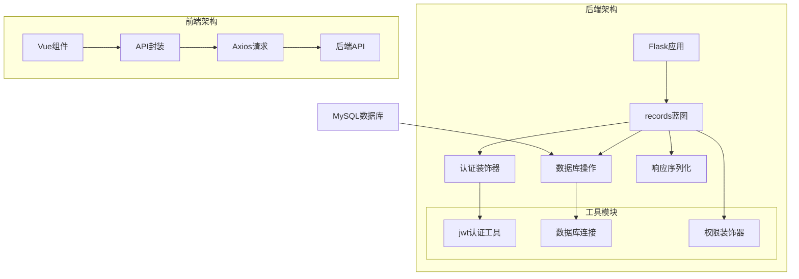
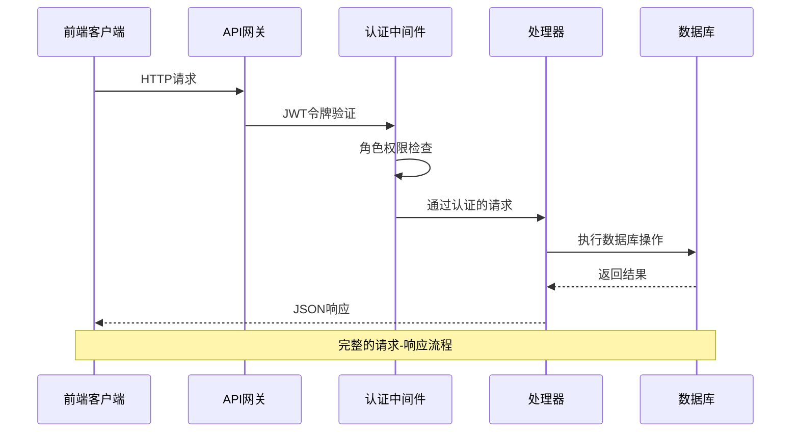
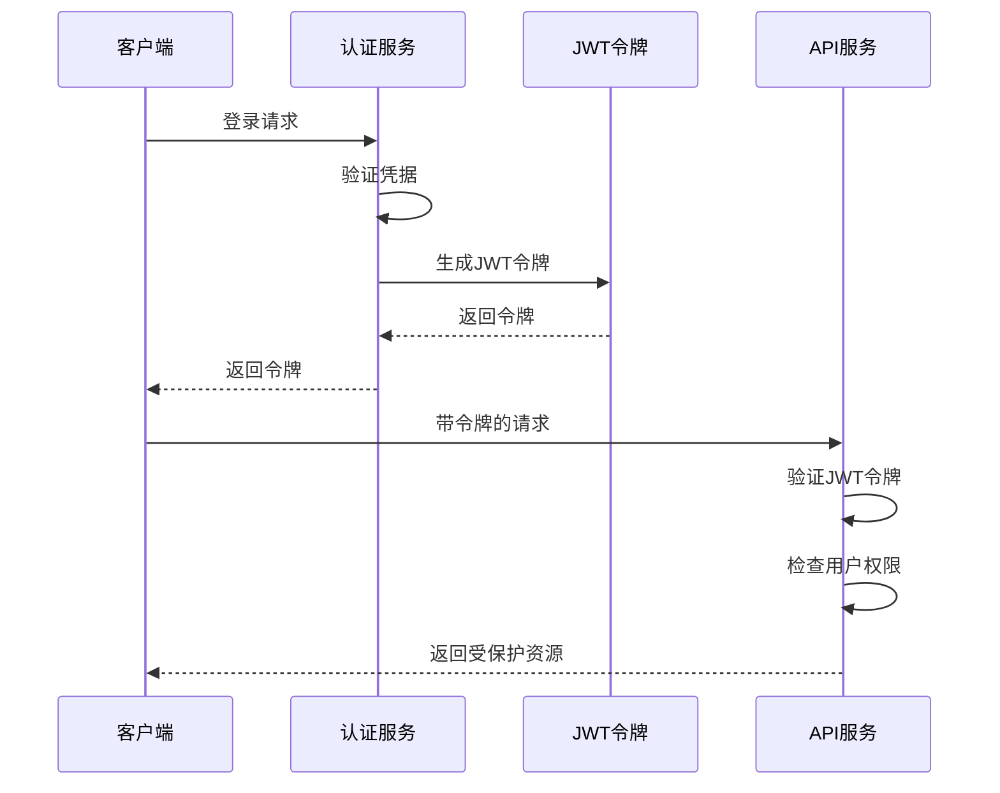
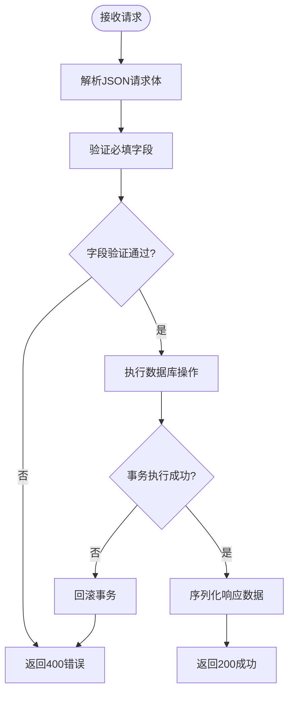
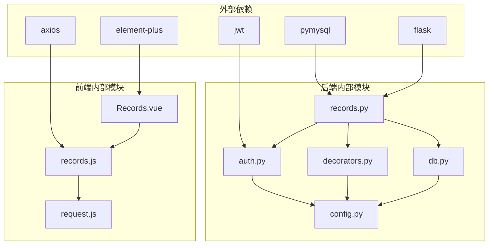
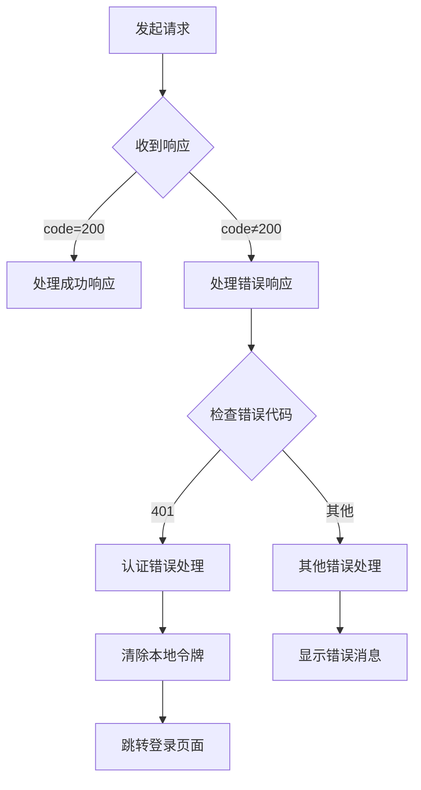

# 更新记录管理

<cite>
**本文档引用的文件**
- [backend/app/api/records.py](file://backend/app/api/records.py)
- [backend/app/utils/auth.py](file://backend/app/utils/auth.py)
- [backend/app/utils/decorators.py](file://backend/app/utils/decorators.py)
- [backend/app/utils/db.py](file://backend/app/utils/db.py)
- [backend/app/config.py](file://backend/app/config.py)
- [backend/app/__init__.py](file://backend/app/__init__.py)
- [backend/init_db.py](file://backend/init_db.py)
- [frontend/src/api/records.js](file://frontend/src/api/records.js)
- [frontend/src/api/request.js](file://frontend/src/api/request.js)
- [frontend/src/views/Records.vue](file://frontend/src/views/Records.vue)
</cite>

## 目录
1. [简介](#简介)
2. [项目结构](#项目结构)
3. [核心组件](#核心组件)
4. [架构概览](#架构概览)
5. [详细组件分析](#详细组件分析)
6. [依赖关系分析](#依赖关系分析)
7. [性能考虑](#性能考虑)
8. [故障排除指南](#故障排除指南)
9. [结论](#结论)

## 简介

更新记录管理API是运维管理平台的核心功能模块之一，负责维护和管理系统的变更历史记录。该模块提供了完整的CRUD（创建、读取、更新、删除）操作，支持模糊搜索、权限控制和数据验证等功能。系统采用前后端分离架构，后端基于Flask框架构建RESTful API，前端使用Vue.js和Element Plus构建用户界面。

## 项目结构

更新记录管理模块位于后端的API层，采用蓝图（Blueprint）模式组织代码，确保了良好的模块化和可维护性。



**图表来源**
- [backend/app/api/records.py:1-114](file://backend/app/api/records.py#L1-L114)
- [backend/app/utils/decorators.py:1-95](file://backend/app/utils/decorators.py#L1-L95)
- [backend/app/utils/db.py:1-17](file://backend/app/utils/db.py#L1-L17)

**章节来源**
- [backend/app/api/records.py:1-114](file://backend/app/api/records.py#L1-L114)
- [backend/app/__init__.py:37-60](file://backend/app/__init__.py#L37-L60)

## 核心组件

更新记录管理模块由以下核心组件构成：

### API蓝图组件
- **records蓝图**：定义了更新记录的所有API端点
- **路由定义**：包含GET、POST、DELETE三种HTTP方法
- **URL前缀**：`/api/records`

### 认证与授权组件
- **JWT认证装饰器**：验证用户身份和令牌有效性
- **角色权限装饰器**：控制不同角色的访问权限
- **权限级别**：admin（管理员）、operator（操作员）

### 数据库操作组件
- **数据库连接池**：使用pymysql建立数据库连接
- **SQL查询优化**：包含索引和查询条件优化
- **事务管理**：确保数据一致性和完整性

**章节来源**
- [backend/app/api/records.py:9-114](file://backend/app/api/records.py#L9-L114)
- [backend/app/utils/decorators.py:9-95](file://backend/app/utils/decorators.py#L9-L95)

## 架构概览

系统采用分层架构设计，确保关注点分离和模块化开发。



**图表来源**
- [backend/app/utils/decorators.py:9-56](file://backend/app/utils/decorators.py#L9-L56)
- [backend/app/api/records.py:20-114](file://backend/app/api/records.py#L20-L114)

## 详细组件分析

### 数据模型设计

更新记录表采用关系型数据库设计，包含以下字段：

```mermaid
erDiagram
CHANGE_RECORDS {
INT id PK
INT seq_no
DATE change_date
VARCHAR modifier
VARCHAR location
TEXT content
TEXT remark
DATETIME created_at
DATETIME updated_at
}
INDEX idx_change_date ON CHANGE_RECORDS(change_date)
INDEX idx_modifier ON CHANGE_RECORDS(modifier)
```

**图表来源**
- [backend/init_db.py:133-148](file://backend/init_db.py#L133-L148)

#### 字段详细说明

| 字段名 | 类型 | 约束 | 描述 | 示例 |
|--------|------|------|------|------|
| id | INT | 主键, 自增 | 记录唯一标识 | 1, 2, 3 |
| seq_no | INT | 可空 | 序号 | 1001, 1002 |
| change_date | DATE | 可空 | 变更日期 | 2024-01-15 |
| modifier | VARCHAR(100) | 可空 | 修改者姓名 | 张三, 李四 |
| location | VARCHAR(300) | 可空 | 修改位置描述 | 生产环境-服务器A |
| content | TEXT | 可空 | 修改内容详情 | 系统升级, 配置调整 |
| remark | TEXT | 可空 | 备注说明 | 紧急变更 |
| created_at | DATETIME | 默认当前时间 | 创建时间 | 2024-01-15 10:30:00 |
| updated_at | DATETIME | 默认当前时间 | 更新时间 | 2024-01-15 14:20:00 |

**章节来源**
- [backend/init_db.py:133-148](file://backend/init_db.py#L133-L148)

### API接口设计

#### GET /api/records - 获取记录列表

**功能描述**：支持模糊搜索的分页查询，按变更日期降序排列

**查询参数**：
- `search` (可选)：搜索关键词，支持多字段匹配

**响应格式**：
```json
{
  "code": 200,
  "data": [
    {
      "id": 1,
      "seq_no": 1001,
      "change_date": "2024-01-15",
      "modifier": "张三",
      "location": "生产环境-服务器A",
      "content": "系统升级",
      "remark": "紧急变更",
      "created_at": "2024-01-15 10:30:00",
      "updated_at": "2024-01-15 14:20:00"
    }
  ]
}
```

**章节来源**
- [backend/app/api/records.py:20-52](file://backend/app/api/records.py#L20-L52)

#### POST /api/records - 创建更新记录

**功能描述**：创建新的更新记录，支持数据验证和事务管理

**请求体格式**：
```json
{
  "seq_no": 1002,
  "change_date": "2024-01-16",
  "modifier": "李四",
  "location": "测试环境-服务器B",
  "content": "配置调整",
  "remark": "常规维护"
}
```

**响应格式**：
```json
{
  "code": 200,
  "message": "创建成功",
  "data": {
    "id": 2
  }
}
```

**章节来源**
- [backend/app/api/records.py:55-86](file://backend/app/api/records.py#L55-L86)

#### DELETE /api/records/{record_id} - 删除更新记录

**功能描述**：安全删除指定的更新记录

**路径参数**：
- `record_id` (必需)：记录ID

**响应格式**：
```json
{
  "code": 200,
  "message": "删除成功"
}
```

**章节来源**
- [backend/app/api/records.py:89-114](file://backend/app/api/records.py#L89-L114)

### 认证与授权机制

#### JWT认证流程



**图表来源**
- [backend/app/utils/auth.py:11-35](file://backend/app/utils/auth.py#L11-L35)
- [backend/app/utils/decorators.py:9-56](file://backend/app/utils/decorators.py#L9-L56)

#### 权限控制策略

| 角色 | 可执行操作 | 说明 |
|------|------------|------|
| viewer | 读取记录列表 | 仅能查看，不能修改 |
| operator | 读取、创建、删除 | 基础操作权限 |
| admin | 所有操作 | 完全管理权限 |

**章节来源**
- [backend/app/utils/decorators.py:59-95](file://backend/app/utils/decorators.py#L59-L95)

### 数据验证与序列化

#### 后端数据验证



**图表来源**
- [backend/app/api/records.py:64-86](file://backend/app/api/records.py#L64-L86)

#### 响应数据序列化

系统自动处理日期类型的序列化，将datetime对象转换为字符串格式：

**序列化规则**：
- `change_date`：从datetime对象转换为'YYYY-MM-DD'格式字符串
- `created_at`、`updated_at`：保持原样返回

**章节来源**
- [backend/app/api/records.py:12-17](file://backend/app/api/records.py#L12-L17)

## 依赖关系分析

### 组件依赖图



**图表来源**
- [backend/app/api/records.py:4-7](file://backend/app/api/records.py#L4-L7)
- [backend/app/utils/auth.py:4-8](file://backend/app/utils/auth.py#L4-L8)

### 关键依赖关系

1. **数据库连接依赖**：所有API操作都依赖于数据库连接池
2. **认证依赖**：所有受保护的API都依赖于JWT认证
3. **权限依赖**：特定操作依赖于角色权限检查
4. **前端依赖**：Vue组件依赖于API封装和Axios库

**章节来源**
- [backend/app/utils/db.py:5-16](file://backend/app/utils/db.py#L5-L16)
- [backend/app/config.py:4-21](file://backend/app/config.py#L4-L21)

## 性能考虑

### 查询优化

1. **索引策略**：
   - `idx_change_date`：支持按日期排序查询
   - `idx_modifier`：支持按修改者搜索

2. **查询优化**：
   - 使用参数化查询防止SQL注入
   - 限制查询结果集大小
   - 优化LIKE查询模式

### 缓存策略

当前实现未包含缓存层，建议在高并发场景下考虑：
- Redis缓存热门查询结果
- 数据库连接池优化
- 前端数据缓存策略

### 并发控制

- 使用数据库事务确保数据一致性
- 连接池管理避免资源泄漏
- 错误处理确保资源正确释放

## 故障排除指南

### 常见错误类型

#### 认证相关错误

| 错误代码 | 错误原因 | 解决方案 |
|----------|----------|----------|
| 401 | 缺少认证信息 | 检查Authorization头是否正确设置 |
| 401 | Token无效或过期 | 重新登录获取新令牌 |
| 403 | 权限不足 | 确认用户角色是否具有相应权限 |

#### 数据库相关错误

| 错误代码 | 错误原因 | 解决方案 |
|----------|----------|----------|
| 500 | 数据库连接失败 | 检查数据库配置和网络连接 |
| 500 | SQL执行错误 | 验证请求数据格式和约束条件 |
| 500 | 事务回滚 | 查看具体错误信息并修正数据 |

#### 前端错误处理



**图表来源**
- [frontend/src/api/request.js:25-51](file://frontend/src/api/request.js#L25-L51)

**章节来源**
- [frontend/src/api/request.js:25-51](file://frontend/src/api/request.js#L25-L51)

### 调试建议

1. **后端调试**：
   - 启用Flask调试模式
   - 检查数据库连接日志
   - 验证JWT密钥配置

2. **前端调试**：
   - 检查浏览器开发者工具
   - 验证API响应格式
   - 确认Axios拦截器工作正常

## 结论

更新记录管理API模块实现了完整的变更记录生命周期管理，具备以下特点：

### 技术优势
- **安全性**：完善的JWT认证和角色权限控制
- **可靠性**：事务管理和错误处理机制
- **可扩展性**：模块化设计便于功能扩展
- **易用性**：清晰的API设计和响应格式

### 功能特性
- 支持模糊搜索的记录查询
- 完整的CRUD操作支持
- 实时数据同步和状态管理
- 前后端分离的现代化架构

### 改进建议
1. 添加分页查询支持
2. 实现数据导入导出功能
3. 增加审计日志记录
4. 优化前端用户体验
5. 添加数据备份机制

该模块为运维管理平台提供了坚实的基础，能够有效支撑企业的变更管理和审计需求。