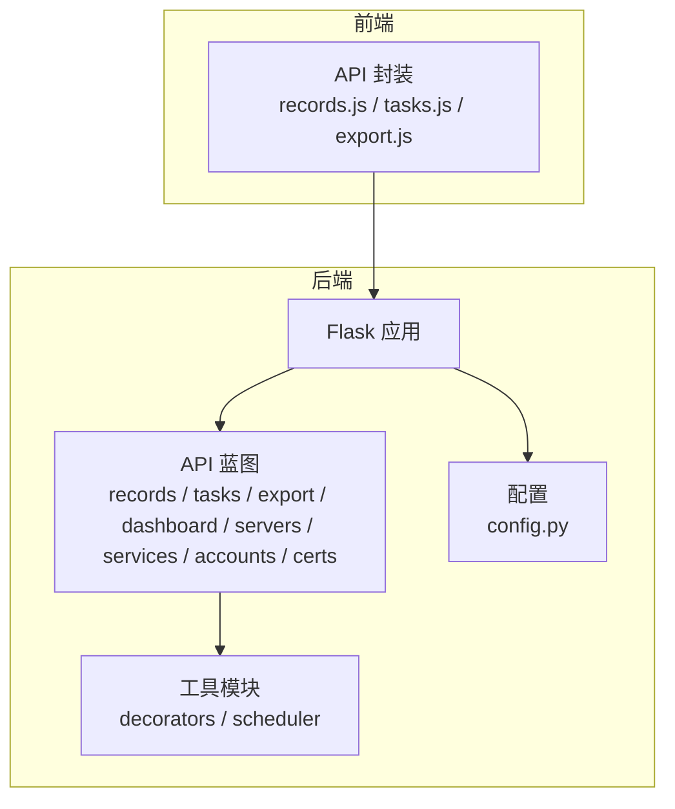
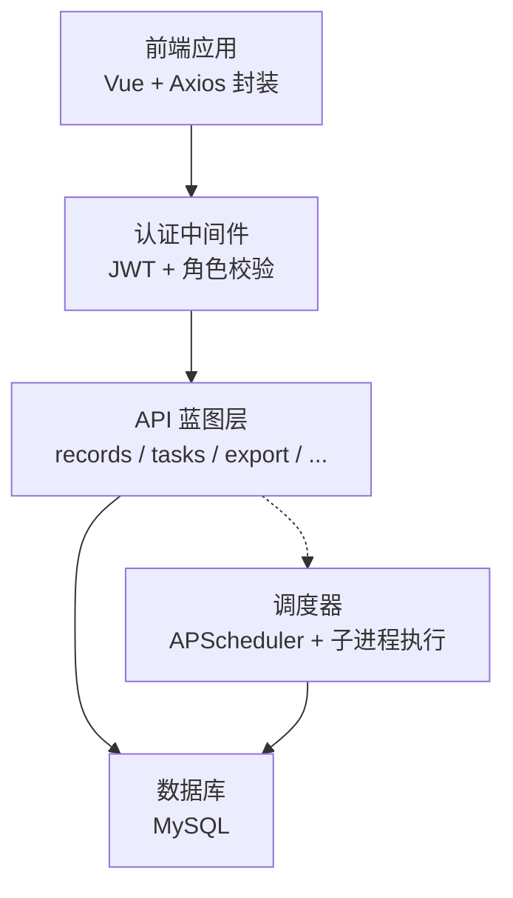
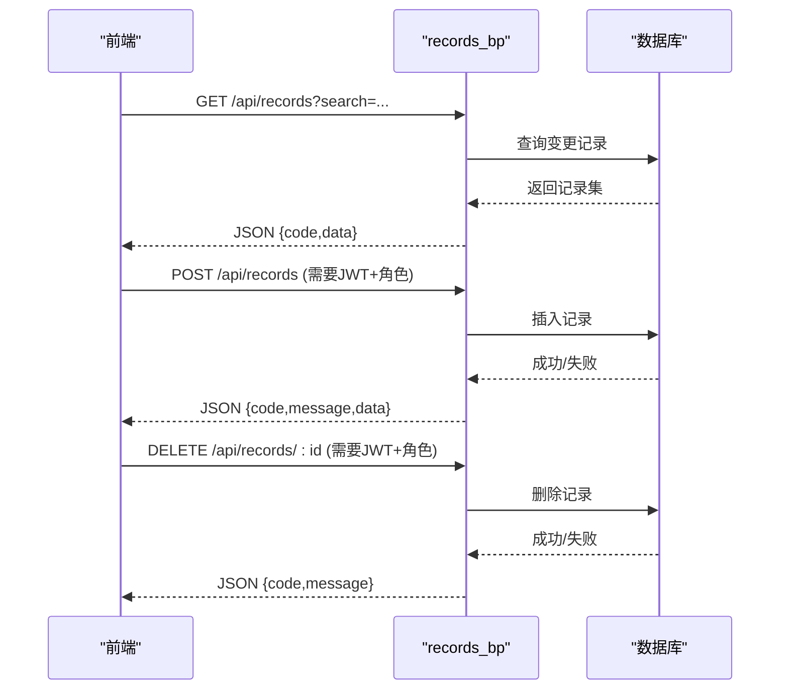
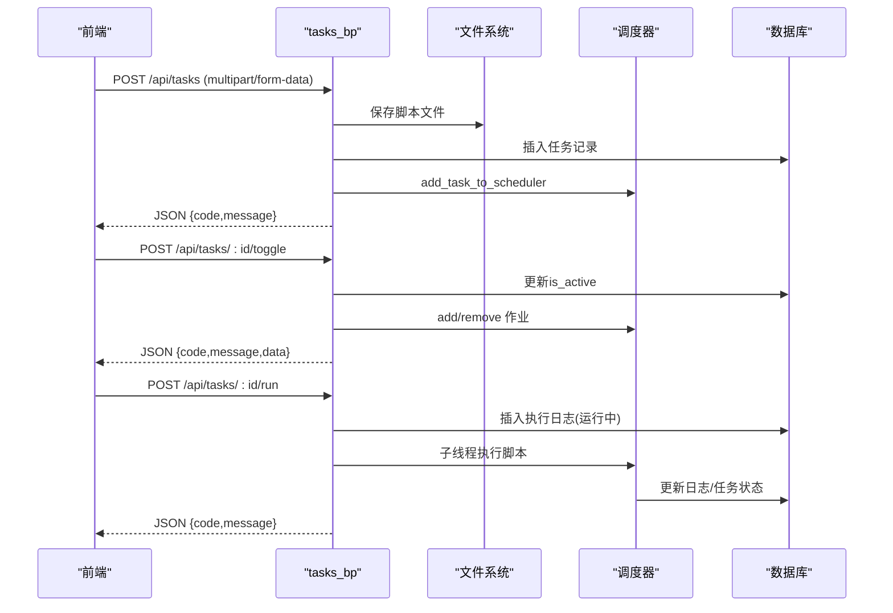
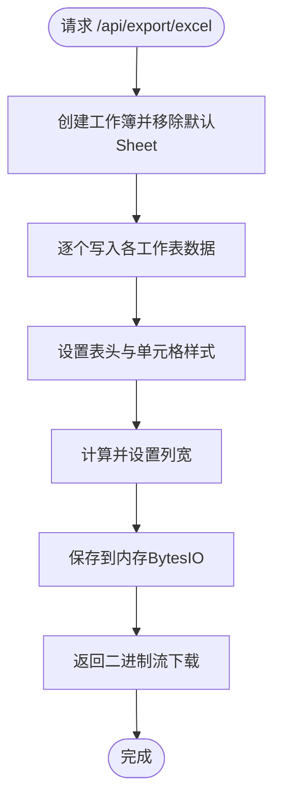
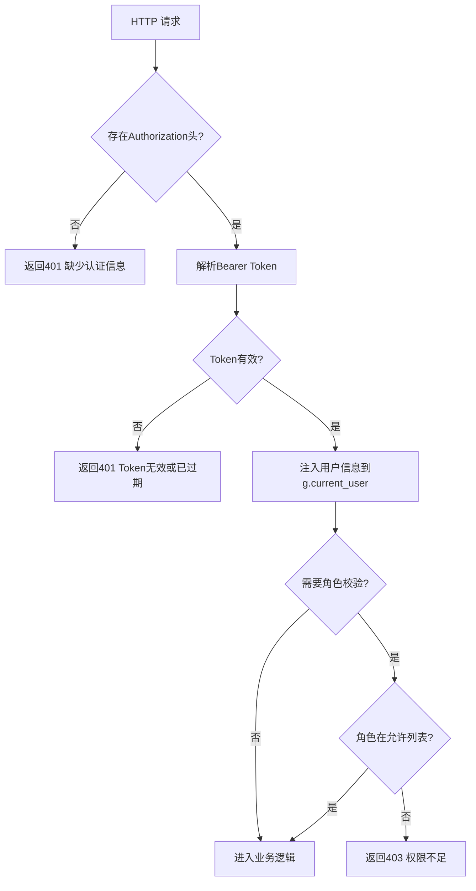
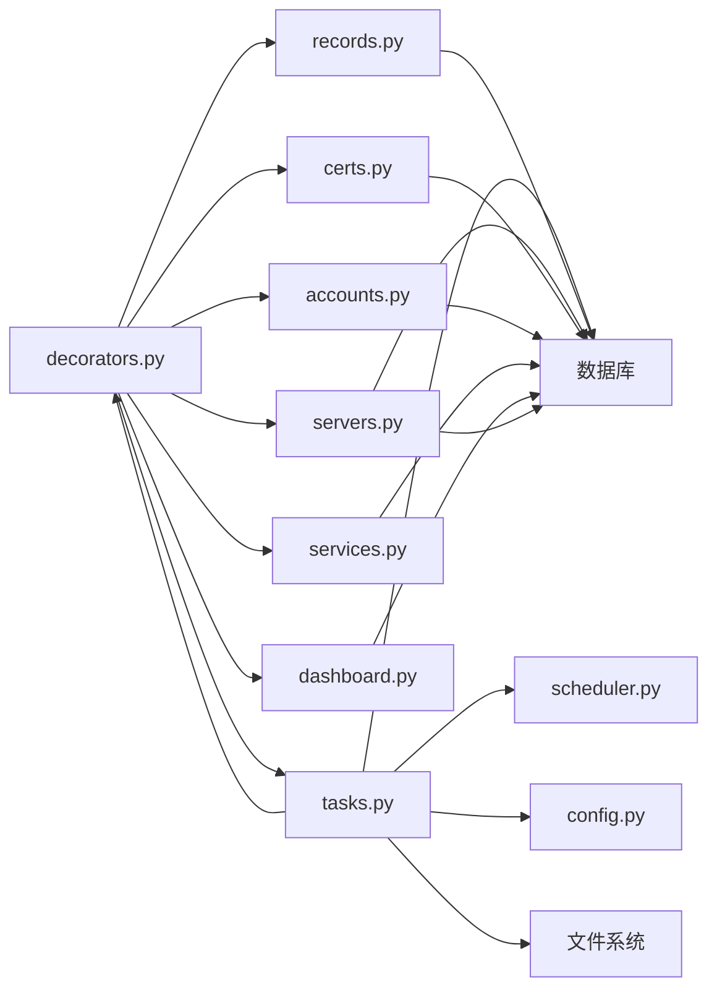

# 系统管理API

<cite>
**本文引用的文件**
- [backend/app/api/records.py](file://backend/app/api/records.py)
- [backend/app/api/tasks.py](file://backend/app/api/tasks.py)
- [backend/app/api/export.py](file://backend/app/api/export.py)
- [backend/app/utils/scheduler.py](file://backend/app/utils/scheduler.py)
- [backend/app/api/dashboard.py](file://backend/app/api/dashboard.py)
- [backend/app/api/servers.py](file://backend/app/api/servers.py)
- [backend/app/api/services.py](file://backend/app/api/services.py)
- [backend/app/api/accounts.py](file://backend/app/api/accounts.py)
- [backend/app/api/certs.py](file://backend/app/api/certs.py)
- [backend/app/utils/decorators.py](file://backend/app/utils/decorators.py)
- [backend/app/config.py](file://backend/app/config.py)
- [frontend/src/api/records.js](file://frontend/src/api/records.js)
- [frontend/src/api/tasks.js](file://frontend/src/api/tasks.js)
- [frontend/src/api/export.js](file://frontend/src/api/export.js)
</cite>

## 目录
1. [简介](#简介)
2. [项目结构](#项目结构)
3. [核心组件](#核心组件)
4. [架构总览](#架构总览)
5. [详细组件分析](#详细组件分析)
6. [依赖分析](#依赖分析)
7. [性能考虑](#性能考虑)
8. [故障排查指南](#故障排查指南)
9. [结论](#结论)
10. [附录](#附录)

## 简介
本文件面向系统管理员与运维工程师，提供“系统管理API”的完整使用指南。内容覆盖以下主题：
- 更新记录管理：审计日志、变更追踪、操作回滚思路
- 定时任务管理：调度管理、执行状态监控、异常处理
- 数据导出：格式选择、批量导出、进度跟踪
- 系统配置管理、日志管理、备份恢复（概念性说明）
- 运维管理：性能监控、资源使用统计、系统健康检查

本指南以仓库中的后端API实现为依据，结合前端调用示例，帮助您快速上手并正确使用各接口。

## 项目结构
后端采用Flask微服务风格，按功能模块划分蓝图；前端通过统一请求封装调用后端API。关键目录与文件如下：
- 后端API模块：/backend/app/api/*.py（records、tasks、export、dashboard、servers、services、accounts、certs等）
- 工具与调度：/backend/app/utils/scheduler.py、/backend/app/utils/decorators.py
- 配置：/backend/app/config.py
- 前端API封装：/frontend/src/api/*.js

图表来源
- [backend/app/api/records.py](file://backend/app/api/records.py)
- [backend/app/api/tasks.py](file://backend/app/api/tasks.py)
- [backend/app/api/export.py](file://backend/app/api/export.py)
- [backend/app/utils/scheduler.py](file://backend/app/utils/scheduler.py)
- [backend/app/utils/decorators.py](file://backend/app/utils/decorators.py)
- [backend/app/config.py](file://backend/app/config.py)
- [frontend/src/api/records.js](file://frontend/src/api/records.js)
- [frontend/src/api/tasks.js](file://frontend/src/api/tasks.js)
- [frontend/src/api/export.js](file://frontend/src/api/export.js)

章节来源
- [backend/app/api/records.py](file://backend/app/api/records.py)
- [backend/app/api/tasks.py](file://backend/app/api/tasks.py)
- [backend/app/api/export.py](file://backend/app/api/export.py)
- [backend/app/utils/scheduler.py](file://backend/app/utils/scheduler.py)
- [backend/app/utils/decorators.py](file://backend/app/utils/decorators.py)
- [backend/app/config.py](file://backend/app/config.py)
- [frontend/src/api/records.js](file://frontend/src/api/records.js)
- [frontend/src/api/tasks.js](file://frontend/src/api/tasks.js)
- [frontend/src/api/export.js](file://frontend/src/api/export.js)

## 核心组件
- 更新记录管理API：提供查询、创建、删除更新记录的能力，并对日期字段进行序列化处理。
- 定时任务API：支持任务的增删改查、启停切换、手动触发、日志查询；集成APScheduler进行调度。
- 数据导出API：一次性导出多工作表的Excel文件，包含服务器、服务、Web账户、应用系统、域名证书等。
- 权限装饰器：统一的JWT认证与角色校验，确保接口安全。
- 调度器工具：负责解析Cron表达式、执行脚本、记录日志、维护调度器状态。
- 仪表盘统计API：提供基础统计与最近更新记录展示。

章节来源
- [backend/app/api/records.py](file://backend/app/api/records.py)
- [backend/app/api/tasks.py](file://backend/app/api/tasks.py)
- [backend/app/api/export.py](file://backend/app/api/export.py)
- [backend/app/utils/scheduler.py](file://backend/app/utils/scheduler.py)
- [backend/app/utils/decorators.py](file://backend/app/utils/decorators.py)
- [backend/app/api/dashboard.py](file://backend/app/api/dashboard.py)

## 架构总览
系统采用前后端分离架构，后端通过Blueprint组织API，前端通过封装的请求函数调用后端接口。认证采用JWT，权限通过装饰器控制。

图表来源
- [backend/app/utils/decorators.py](file://backend/app/utils/decorators.py)
- [backend/app/api/tasks.py](file://backend/app/api/tasks.py)
- [backend/app/utils/scheduler.py](file://backend/app/utils/scheduler.py)
- [backend/app/config.py](file://backend/app/config.py)

## 详细组件分析

### 更新记录管理API
- 功能要点
  - 列表查询：支持关键词搜索，按变更日期降序排列
  - 创建记录：需具备管理员或操作员角色
  - 删除记录：需具备管理员或操作员角色
  - 数据序列化：自动将日期字段转换为字符串，避免JSON序列化问题
- 错误处理
  - 数据库异常时回滚事务并返回错误码
  - 统一响应结构包含code与message/data字段
- 前端调用
  - 通过封装的records.js进行GET/POST/DELETE请求

图表来源
- [backend/app/api/records.py](file://backend/app/api/records.py)
- [frontend/src/api/records.js](file://frontend/src/api/records.js)

章节来源
- [backend/app/api/records.py](file://backend/app/api/records.py)
- [frontend/src/api/records.js](file://frontend/src/api/records.js)

### 定时任务管理API
- 功能要点
  - 任务列表：支持按创建时间倒序查询
  - 创建任务：表单提交，支持上传脚本文件（py/sh/sql），自动重命名并保存至配置的上传目录
  - 更新任务：可替换脚本文件，若任务处于活跃状态则重新注册到调度器
  - 删除任务：从调度器移除、删除脚本文件、清理相关日志与任务记录
  - 启停切换：动态启用/禁用任务并同步调度器
  - 手动执行：异步执行脚本，记录日志并更新任务最近状态
  - 日志查询：按任务ID查询最近50条执行日志
- 调度器集成
  - 使用APScheduler解析Cron表达式，按任务ID生成作业ID
  - 子线程执行脚本，捕获标准输出/错误输出，超时控制为300秒
  - 执行完成后更新任务日志与任务状态字段
- 异常处理
  - 文件保存失败时回滚并清理临时文件
  - 调度器异常打印日志，不影响主流程
  - 手动执行异常时记录失败原因与结束时间

图表来源
- [backend/app/api/tasks.py](file://backend/app/api/tasks.py)
- [backend/app/utils/scheduler.py](file://backend/app/utils/scheduler.py)
- [frontend/src/api/tasks.js](file://frontend/src/api/tasks.js)

章节来源
- [backend/app/api/tasks.py](file://backend/app/api/tasks.py)
- [backend/app/utils/scheduler.py](file://backend/app/utils/scheduler.py)
- [frontend/src/api/tasks.js](file://frontend/src/api/tasks.js)

### 数据导出API
- 功能要点
  - 导出格式：Excel（.xlsx），包含多个工作表（服务器管理、服务管理、Web账户、应用系统、域名证书）
  - 表头样式：加粗、填充、居中、边框
  - 单元格样式：统一边框
  - 列宽自适应：基于标题与内容长度计算，限制最小与最大宽度
  - 安全值处理：空值转空字符串，日期/时间格式化
- 响应：二进制流下载，文件名为“运维数据导出_YYYY-MM-DD.xlsx”
- 错误处理：异常时返回JSON错误信息

图表来源
- [backend/app/api/export.py](file://backend/app/api/export.py)

章节来源
- [backend/app/api/export.py](file://backend/app/api/export.py)
- [frontend/src/api/export.js](file://frontend/src/api/export.js)

### 权限与认证
- JWT认证装饰器
  - 从Authorization头提取Bearer Token，验证失败返回401
  - 成功后将用户信息注入flask.g.current_user
- 角色校验装饰器
  - 必须在JWT认证之后使用，检查g.current_user中的角色是否在允许列表
  - 不满足角色要求返回403

图表来源
- [backend/app/utils/decorators.py](file://backend/app/utils/decorators.py)

章节来源
- [backend/app/utils/decorators.py](file://backend/app/utils/decorators.py)

### 仪表盘统计API
- 功能要点
  - 统计各核心表的数量
  - 按环境类型统计服务器分布
  - 展示最近更新记录与最近“使用中”域名证书
- 数据序列化：将日期字段转换为字符串，便于前端展示

章节来源
- [backend/app/api/dashboard.py](file://backend/app/api/dashboard.py)

### 其他管理API（概览）
- 服务器管理API：支持查询、详情、列表、创建、更新、删除
- 服务管理API：支持查询、创建、更新、删除
- Web账户管理API：支持查询、创建、更新、删除
- 域名证书管理API：支持查询、创建、更新、删除
- 以上API均采用统一的JWT认证与角色校验装饰器

章节来源
- [backend/app/api/servers.py](file://backend/app/api/servers.py)
- [backend/app/api/services.py](file://backend/app/api/services.py)
- [backend/app/api/accounts.py](file://backend/app/api/accounts.py)
- [backend/app/api/certs.py](file://backend/app/api/certs.py)
- [backend/app/utils/decorators.py](file://backend/app/utils/decorators.py)

## 依赖分析
- 组件耦合
  - API蓝图依赖数据库工具与装饰器
  - 定时任务API依赖调度器工具与配置
  - 导出API依赖数据库工具与第三方库openpyxl
- 外部依赖
  - Flask、APScheduler、PyMySQL、openpyxl、Werkzeug
- 可能的循环依赖
  - 当前模块间为单向依赖，无明显循环

图表来源
- [backend/app/utils/decorators.py](file://backend/app/utils/decorators.py)
- [backend/app/api/records.py](file://backend/app/api/records.py)
- [backend/app/api/tasks.py](file://backend/app/api/tasks.py)
- [backend/app/utils/scheduler.py](file://backend/app/utils/scheduler.py)
- [backend/app/config.py](file://backend/app/config.py)

章节来源
- [backend/app/utils/decorators.py](file://backend/app/utils/decorators.py)
- [backend/app/api/tasks.py](file://backend/app/api/tasks.py)
- [backend/app/utils/scheduler.py](file://backend/app/utils/scheduler.py)
- [backend/app/config.py](file://backend/app/config.py)

## 性能考虑
- 数据库查询
  - API普遍采用参数化SQL，避免注入风险；建议在高频查询字段建立索引（如change_date、env_type、status等）
- 导出性能
  - Excel导出涉及多表查询与样式设置，建议在低频场景或后台定时任务中执行；对大数据量可考虑分页或异步导出队列
- 调度器性能
  - 子线程执行脚本避免阻塞主线程；超时控制为300秒，防止长时间占用
- 前端交互
  - 导出接口返回二进制流，注意浏览器下载行为与网络中断处理

## 故障排查指南
- 认证失败
  - 确认请求头包含有效的Bearer Token；检查JWT密钥与过期时间
- 权限不足
  - 确认用户角色在允许列表；检查装饰器顺序（先JWT再角色）
- 定时任务异常
  - 查看任务日志接口获取最近执行记录；确认脚本文件存在且可执行；检查Cron表达式格式
- 导出失败
  - 检查数据库连接与表结构；确认Excel样式与列宽计算未抛异常
- 文件上传限制
  - 上传大小受MAX_CONTENT_LENGTH限制；确认上传目录可写

章节来源
- [backend/app/utils/decorators.py](file://backend/app/utils/decorators.py)
- [backend/app/api/tasks.py](file://backend/app/api/tasks.py)
- [backend/app/api/export.py](file://backend/app/api/export.py)
- [backend/app/config.py](file://backend/app/config.py)

## 结论
本系统管理API提供了完善的更新记录、定时任务、数据导出与基础统计能力，并通过JWT与角色装饰器保障安全性。建议在生产环境中：
- 明确角色分工与最小权限原则
- 对高频接口增加缓存与限流
- 对大体量导出与任务执行引入异步队列
- 完善日志与告警机制，提升可观测性

## 附录

### 接口一览与使用指引

- 更新记录管理
  - GET /api/records?search=...：查询更新记录（支持关键词搜索）
  - POST /api/records：创建更新记录（需要管理员/操作员）
  - DELETE /api/records/:id：删除更新记录（需要管理员/操作员）
  - 前端调用参考：[frontend/src/api/records.js](file://frontend/src/api/records.js)

- 定时任务管理
  - GET /api/tasks：获取任务列表
  - POST /api/tasks：创建任务（multipart/form-data，需上传脚本）
  - PUT /api/tasks/:id：更新任务（可替换脚本）
  - DELETE /api/tasks/:id：删除任务
  - POST /api/tasks/:id/toggle：启用/禁用任务
  - POST /api/tasks/:id/run：手动执行任务
  - GET /api/tasks/:id/logs：获取任务日志（最近50条）
  - 前端调用参考：[frontend/src/api/tasks.js](file://frontend/src/api/tasks.js)

- 数据导出
  - GET /api/export/excel：导出Excel（多工作表）
  - 前端调用参考：[frontend/src/api/export.js](file://frontend/src/api/export.js)

- 仪表盘统计
  - GET /api/dashboard/stats：获取统计数据与最近记录

- 其他管理API（概览）
  - 服务器管理：GET/POST/PUT/DELETE
  - 服务管理：GET/POST/PUT/DELETE
  - Web账户管理：GET/POST/PUT/DELETE
  - 域名证书管理：GET/POST/PUT/DELETE

章节来源
- [backend/app/api/records.py](file://backend/app/api/records.py)
- [backend/app/api/tasks.py](file://backend/app/api/tasks.py)
- [backend/app/api/export.py](file://backend/app/api/export.py)
- [backend/app/api/dashboard.py](file://backend/app/api/dashboard.py)
- [backend/app/api/servers.py](file://backend/app/api/servers.py)
- [backend/app/api/services.py](file://backend/app/api/services.py)
- [backend/app/api/accounts.py](file://backend/app/api/accounts.py)
- [backend/app/api/certs.py](file://backend/app/api/certs.py)
- [frontend/src/api/records.js](file://frontend/src/api/records.js)
- [frontend/src/api/tasks.js](file://frontend/src/api/tasks.js)
- [frontend/src/api/export.js](file://frontend/src/api/export.js)