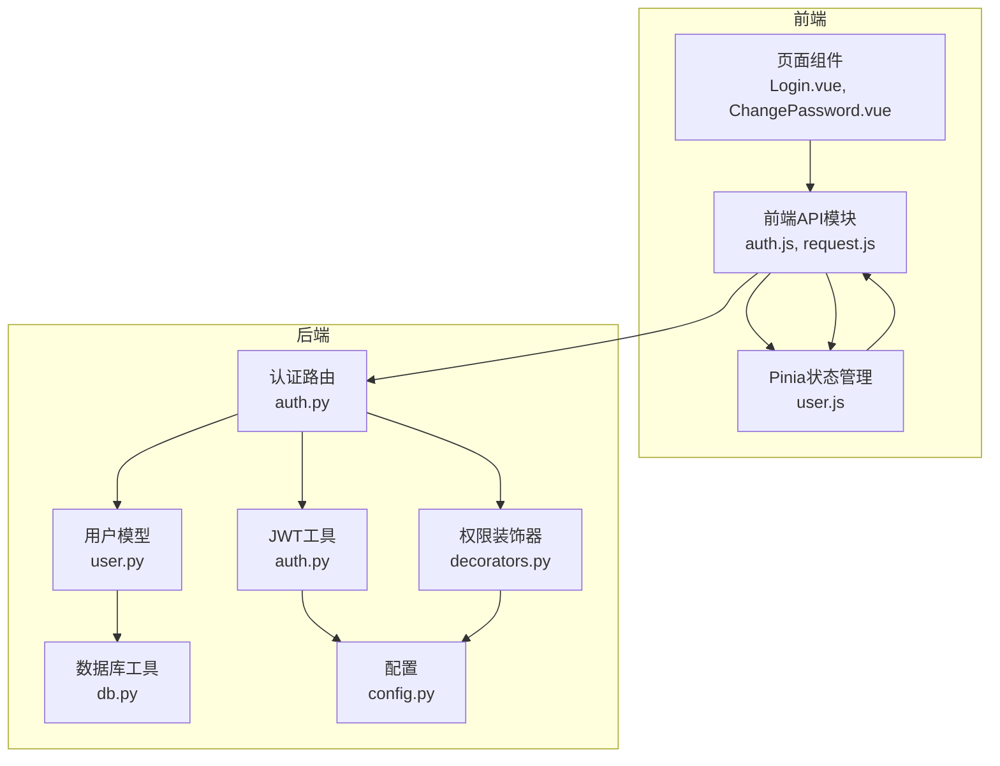
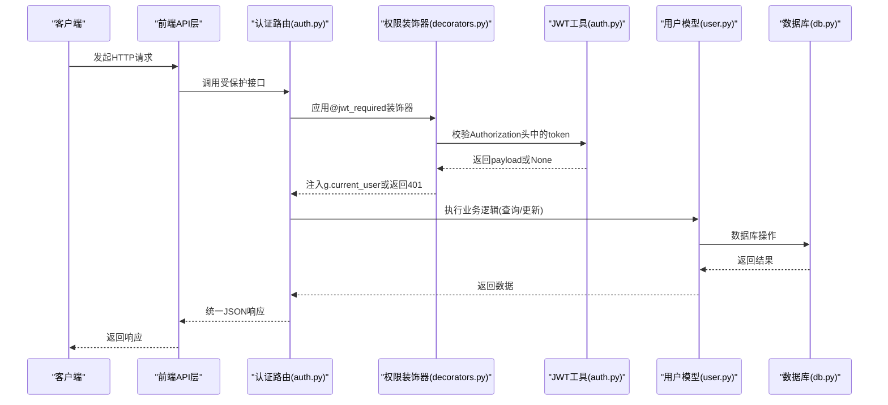
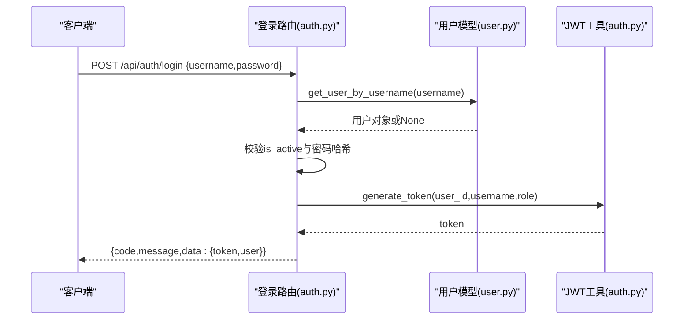
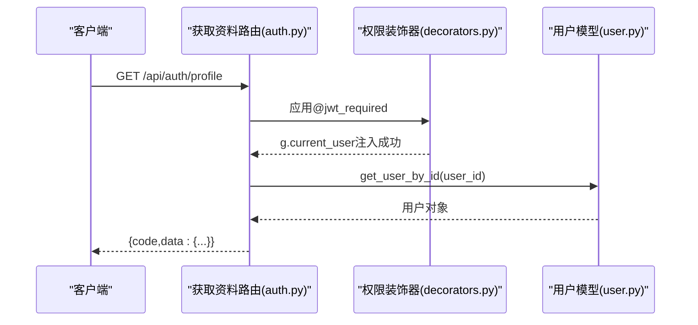
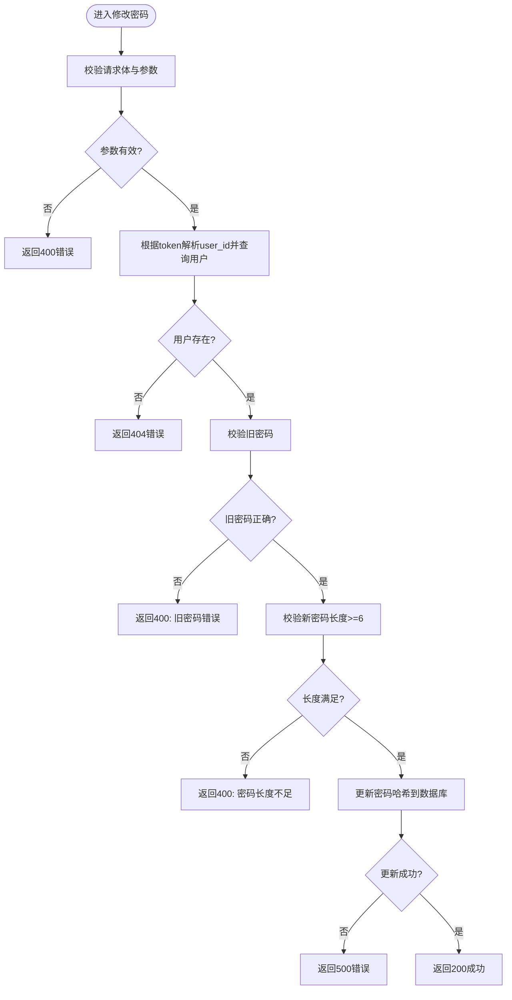
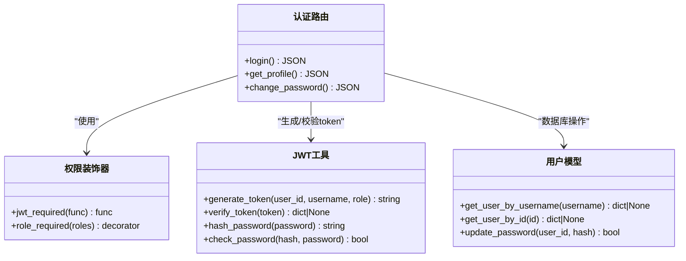
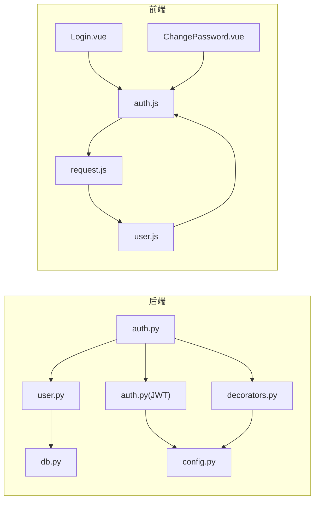

# 认证API

<cite>
**本文档引用的文件**
- [backend/app/api/auth.py](file://backend/app/api/auth.py)
- [backend/app/utils/auth.py](file://backend/app/utils/auth.py)
- [backend/app/utils/decorators.py](file://backend/app/utils/decorators.py)
- [backend/app/models/user.py](file://backend/app/models/user.py)
- [backend/app/config.py](file://backend/app/config.py)
- [backend/app/utils/db.py](file://backend/app/utils/db.py)
- [backend/init_db.py](file://backend/init_db.py)
- [frontend/src/api/auth.js](file://frontend/src/api/auth.js)
- [frontend/src/api/request.js](file://frontend/src/api/request.js)
- [frontend/src/stores/user.js](file://frontend/src/stores/user.js)
- [frontend/src/views/Login.vue](file://frontend/src/views/Login.vue)
- [frontend/src/views/ChangePassword.vue](file://frontend/src/views/ChangePassword.vue)
</cite>

## 目录
1. [简介](#简介)
2. [项目结构](#项目结构)
3. [核心组件](#核心组件)
4. [架构总览](#架构总览)
5. [详细组件分析](#详细组件分析)
6. [依赖关系分析](#依赖关系分析)
7. [性能考虑](#性能考虑)
8. [故障排除指南](#故障排除指南)
9. [结论](#结论)

## 简介
本文件面向前端开发者，系统性地介绍认证API的设计与实现，包括：
- 用户登录接口：请求参数、响应格式、错误处理
- 获取用户信息接口：权限验证机制与数据返回结构
- 修改密码接口：安全验证逻辑与密码强度要求
- JWT认证机制：token生成与验证流程
- 前端JWT token的存储与使用指南

## 项目结构
认证相关代码分布在后端Flask应用与前端Vue应用中，采用前后端分离架构：
- 后端负责认证逻辑、JWT生成与校验、数据库交互
- 前端负责UI交互、token存储、HTTP请求拦截与统一错误处理

**图表来源**
- [frontend/src/api/auth.js:1-14](file://frontend/src/api/auth.js#L1-L14)
- [frontend/src/api/request.js:1-54](file://frontend/src/api/request.js#L1-L54)
- [frontend/src/stores/user.js:1-41](file://frontend/src/stores/user.js#L1-L41)
- [frontend/src/views/Login.vue:1-114](file://frontend/src/views/Login.vue#L1-L114)
- [frontend/src/views/ChangePassword.vue:1-140](file://frontend/src/views/ChangePassword.vue#L1-L140)
- [backend/app/api/auth.py:1-184](file://backend/app/api/auth.py#L1-L184)
- [backend/app/utils/decorators.py:1-95](file://backend/app/utils/decorators.py#L1-L95)
- [backend/app/utils/auth.py:1-83](file://backend/app/utils/auth.py#L1-L83)
- [backend/app/models/user.py:1-183](file://backend/app/models/user.py#L1-L183)
- [backend/app/utils/db.py:1-17](file://backend/app/utils/db.py#L1-L17)
- [backend/app/config.py:1-21](file://backend/app/config.py#L1-L21)

**章节来源**
- [backend/app/api/auth.py:1-184](file://backend/app/api/auth.py#L1-L184)
- [frontend/src/api/auth.js:1-14](file://frontend/src/api/auth.js#L1-L14)
- [frontend/src/api/request.js:1-54](file://frontend/src/api/request.js#L1-L54)
- [frontend/src/stores/user.js:1-41](file://frontend/src/stores/user.js#L1-L41)

## 核心组件
- 认证路由层：提供登录、获取用户信息、修改密码三个接口
- 权限装饰器：统一处理JWT认证与角色权限检查
- JWT工具：生成与验证token，密码哈希与校验
- 用户模型：封装数据库操作（查询、更新）
- 数据库工具：提供MySQL连接
- 前端API与状态管理：封装HTTP请求、拦截器、token存储与刷新

**章节来源**
- [backend/app/api/auth.py:14-184](file://backend/app/api/auth.py#L14-L184)
- [backend/app/utils/decorators.py:9-95](file://backend/app/utils/decorators.py#L9-L95)
- [backend/app/utils/auth.py:11-83](file://backend/app/utils/auth.py#L11-L83)
- [backend/app/models/user.py:39-183](file://backend/app/models/user.py#L39-L183)
- [backend/app/utils/db.py:5-17](file://backend/app/utils/db.py#L5-L17)
- [frontend/src/api/auth.js:1-14](file://frontend/src/api/auth.js#L1-L14)
- [frontend/src/api/request.js:13-51](file://frontend/src/api/request.js#L13-L51)
- [frontend/src/stores/user.js:1-41](file://frontend/src/stores/user.js#L1-L41)

## 架构总览
认证系统遵循“请求-鉴权-业务处理-响应”的标准流程，并通过装饰器实现横切关注点（JWT认证、权限控制）。

**图表来源**
- [backend/app/api/auth.py:14-184](file://backend/app/api/auth.py#L14-L184)
- [backend/app/utils/decorators.py:9-56](file://backend/app/utils/decorators.py#L9-L56)
- [backend/app/utils/auth.py:38-56](file://backend/app/utils/auth.py#L38-L56)
- [backend/app/models/user.py:39-183](file://backend/app/models/user.py#L39-L183)
- [backend/app/utils/db.py:5-17](file://backend/app/utils/db.py#L5-L17)

## 详细组件分析

### 登录接口
- 接口路径：POST /api/auth/login
- 功能：验证用户名与密码，生成JWT token并返回用户信息
- 请求参数
  - username: 用户名（必填）
  - password: 密码（必填）
- 响应格式
  - code: 200表示成功，其他为错误码
  - message: 描述信息
  - data.token: JWT字符串
  - data.user.id/username/display_name/role: 用户基本信息
- 错误处理
  - 400：请求体为空或缺少用户名/密码
  - 401：用户名或密码错误、用户被禁用
- 安全要点
  - 密码使用哈希校验，不存储明文
  - token有效期由配置决定，默认24小时

**图表来源**
- [backend/app/api/auth.py:14-82](file://backend/app/api/auth.py#L14-L82)
- [backend/app/models/user.py:39-58](file://backend/app/models/user.py#L39-L58)
- [backend/app/utils/auth.py:11-35](file://backend/app/utils/auth.py#L11-L35)

**章节来源**
- [backend/app/api/auth.py:14-82](file://backend/app/api/auth.py#L14-L82)
- [backend/app/models/user.py:39-58](file://backend/app/models/user.py#L39-L58)
- [backend/app/utils/auth.py:11-35](file://backend/app/utils/auth.py#L11-L35)

### 获取用户信息接口
- 接口路径：GET /api/auth/profile
- 权限：需要JWT认证（@jwt_required装饰器）
- 响应数据结构
  - id/username/display_name/role/is_active/created_at
- 错误处理
  - 401：缺少或无效的Authorization头
  - 404：用户不存在
- 实现要点
  - 从g.current_user读取user_id
  - 通过get_user_by_id查询完整用户信息

**图表来源**
- [backend/app/api/auth.py:85-115](file://backend/app/api/auth.py#L85-L115)
- [backend/app/utils/decorators.py:9-56](file://backend/app/utils/decorators.py#L9-L56)
- [backend/app/models/user.py:61-80](file://backend/app/models/user.py#L61-L80)

**章节来源**
- [backend/app/api/auth.py:85-115](file://backend/app/api/auth.py#L85-L115)
- [backend/app/utils/decorators.py:9-56](file://backend/app/utils/decorators.py#L9-L56)
- [backend/app/models/user.py:61-80](file://backend/app/models/user.py#L61-L80)

### 修改密码接口
- 接口路径：PUT /api/auth/password
- 权限：需要JWT认证（@jwt_required装饰器）
- 请求参数
  - old_password: 旧密码（必填）
  - new_password: 新密码（必填，至少6位）
- 响应
  - 成功：200 + 成功消息
  - 失败：400/404/500对应不同场景
- 安全逻辑
  - 校验旧密码正确性
  - 新密码长度限制
  - 更新数据库中的password_hash
- 前端行为
  - 修改成功后提示重新登录并清理本地token

**图表来源**
- [backend/app/api/auth.py:118-184](file://backend/app/api/auth.py#L118-L184)
- [backend/app/models/user.py:161-183](file://backend/app/models/user.py#L161-L183)

**章节来源**
- [backend/app/api/auth.py:118-184](file://backend/app/api/auth.py#L118-L184)
- [backend/app/models/user.py:161-183](file://backend/app/models/user.py#L161-L183)

### JWT认证机制
- token生成
  - 载荷包含：user_id、username、role、iat、exp
  - exp默认24小时（可通过配置调整）
  - 使用HS256算法签名
- token验证
  - 从Authorization头提取Bearer token
  - 使用相同密钥解码并校验签名
  - 处理过期与无效token
- 前端集成
  - 请求拦截器自动添加Authorization头
  - 响应拦截器统一处理401并跳转登录页
  - Pinia store持久化token与用户信息

**图表来源**
- [backend/app/utils/auth.py:11-83](file://backend/app/utils/auth.py#L11-L83)
- [backend/app/utils/decorators.py:9-95](file://backend/app/utils/decorators.py#L9-L95)
- [backend/app/api/auth.py:14-184](file://backend/app/api/auth.py#L14-L184)
- [backend/app/models/user.py:39-183](file://backend/app/models/user.py#L39-L183)

**章节来源**
- [backend/app/utils/auth.py:11-83](file://backend/app/utils/auth.py#L11-L83)
- [backend/app/utils/decorators.py:9-56](file://backend/app/utils/decorators.py#L9-L56)
- [backend/app/config.py:4-7](file://backend/app/config.py#L4-L7)
- [frontend/src/api/request.js:13-51](file://frontend/src/api/request.js#L13-L51)
- [frontend/src/stores/user.js:13-37](file://frontend/src/stores/user.js#L13-L37)

## 依赖关系分析
- 后端
  - 认证路由依赖装饰器与JWT工具
  - 用户模型依赖数据库工具
  - JWT工具依赖Flask配置
- 前端
  - API模块依赖请求拦截器
  - 页面组件依赖store与API模块
  - store依赖localStorage持久化

**图表来源**
- [backend/app/api/auth.py:1-10](file://backend/app/api/auth.py#L1-L10)
- [backend/app/utils/decorators.py:1-7](file://backend/app/utils/decorators.py#L1-L7)
- [backend/app/utils/auth.py:1-8](file://backend/app/utils/auth.py#L1-L8)
- [backend/app/models/user.py:1-6](file://backend/app/models/user.py#L1-L6)
- [backend/app/utils/db.py:1-3](file://backend/app/utils/db.py#L1-L3)
- [backend/app/config.py:1-7](file://backend/app/config.py#L1-L7)
- [frontend/src/api/auth.js:1-2](file://frontend/src/api/auth.js#L1-L2)
- [frontend/src/api/request.js:1-3](file://frontend/src/api/request.js#L1-L3)
- [frontend/src/views/Login.vue:32-36](file://frontend/src/views/Login.vue#L32-L36)
- [frontend/src/views/ChangePassword.vue:56-57](file://frontend/src/views/ChangePassword.vue#L56-L57)
- [frontend/src/stores/user.js:1-4](file://frontend/src/stores/user.js#L1-L4)

**章节来源**
- [backend/app/api/auth.py:1-10](file://backend/app/api/auth.py#L1-L10)
- [backend/app/utils/decorators.py:1-7](file://backend/app/utils/decorators.py#L1-L7)
- [backend/app/utils/auth.py:1-8](file://backend/app/utils/auth.py#L1-L8)
- [backend/app/models/user.py:1-6](file://backend/app/models/user.py#L1-L6)
- [backend/app/utils/db.py:1-3](file://backend/app/utils/db.py#L1-L3)
- [backend/app/config.py:1-7](file://backend/app/config.py#L1-L7)
- [frontend/src/api/auth.js:1-2](file://frontend/src/api/auth.js#L1-L2)
- [frontend/src/api/request.js:1-3](file://frontend/src/api/request.js#L1-L3)
- [frontend/src/views/Login.vue:32-36](file://frontend/src/views/Login.vue#L32-L36)
- [frontend/src/views/ChangePassword.vue:56-57](file://frontend/src/views/ChangePassword.vue#L56-L57)
- [frontend/src/stores/user.js:1-4](file://frontend/src/stores/user.js#L1-L4)

## 性能考虑
- token有效期：默认24小时，可根据业务需求调整配置项
- 密码哈希：使用Werkzeug内置哈希，安全性高但计算开销略大
- 数据库索引：用户表对username建立索引，提升登录查询效率
- 前端拦截器：统一处理401自动登出，减少重复逻辑

[本节为通用建议，无需特定文件来源]

## 故障排除指南
- 登录失败
  - 检查用户名/密码是否正确
  - 确认用户状态为激活
  - 查看后端返回的错误码与消息
- 获取资料失败
  - 确认Authorization头格式为Bearer token
  - 检查token是否过期或被篡改
- 修改密码失败
  - 确认旧密码正确
  - 检查新密码长度是否满足要求
  - 查看数据库更新是否成功
- 前端常见问题
  - token未正确存储或过期：检查localStorage与拦截器
  - 401自动跳转：确认路由守卫与store状态

**章节来源**
- [backend/app/api/auth.py:23-61](file://backend/app/api/auth.py#L23-L61)
- [backend/app/api/auth.py:99-103](file://backend/app/api/auth.py#L99-L103)
- [backend/app/api/auth.py:130-168](file://backend/app/api/auth.py#L130-L168)
- [frontend/src/api/request.js:35-50](file://frontend/src/api/request.js#L35-L50)
- [frontend/src/stores/user.js:32-37](file://frontend/src/stores/user.js#L32-L37)

## 结论
该认证API以JWT为核心，结合装饰器实现统一的权限控制，前后端协同完成token的生成、传递与校验。接口设计简洁明确，错误处理完善，适合在运维管理平台中作为基础认证能力使用。建议在生产环境中：
- 更换默认JWT密钥与数据库凭据
- 调整token有效期策略
- 引入更严格的密码复杂度策略
- 增加登录失败次数限制与封禁机制