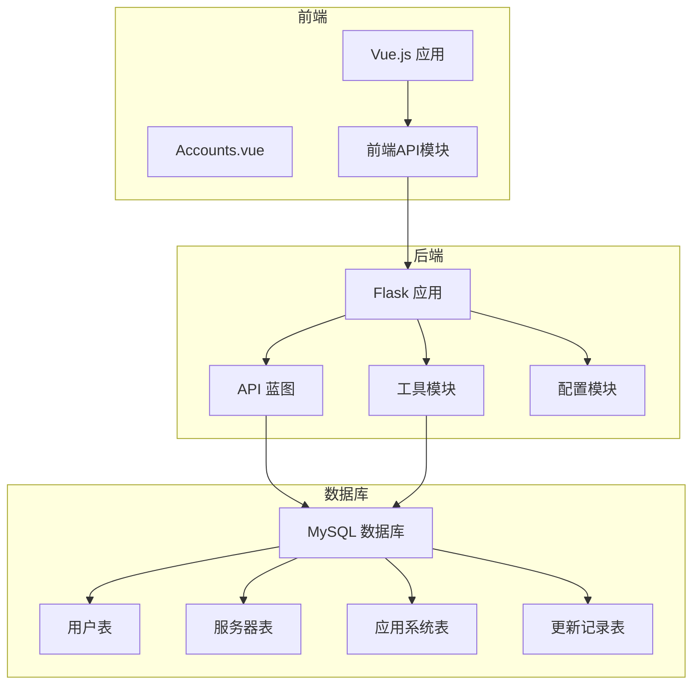
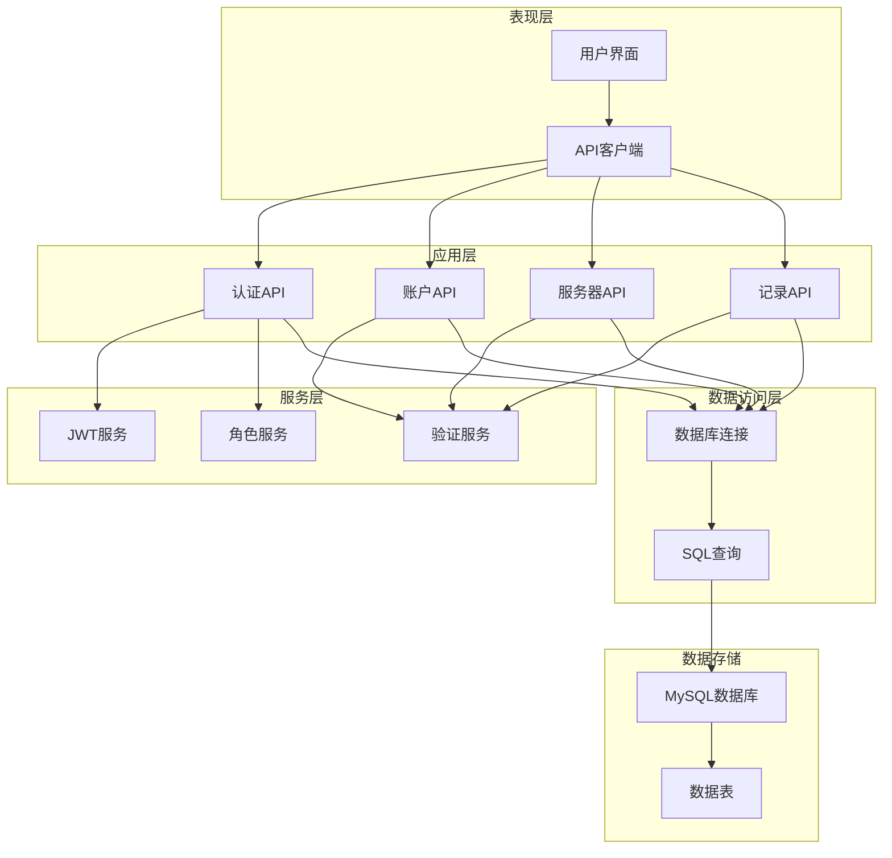
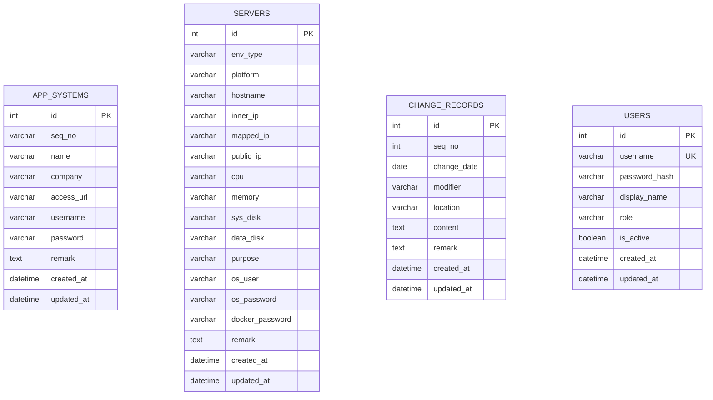
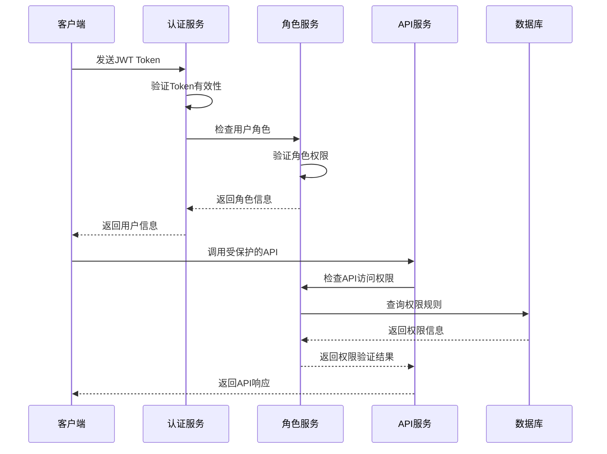
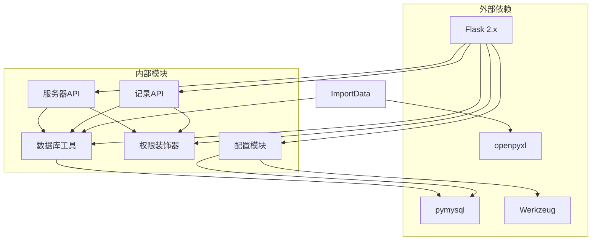

# Web账户管理API

<cite>
**本文档引用的文件**
- [backend/app/api/servers.py](file://backend/app/api/servers.py)
- [backend/app/api/records.py](file://backend/app/api/records.py)
- [backend/app/utils/db.py](file://backend/app/utils/db.py)
- [backend/app/utils/decorators.py](file://backend/app/utils/decorators.py)
- [backend/app/config.py](file://backend/app/config.py)
- [backend/init_db.py](file://backend/init_db.py)
- [backend/import_data.py](file://backend/import_data.py)
- [frontend/src/views/Accounts.vue](file://frontend/src/views/Accounts.vue)
</cite>

## 目录
1. [简介](#简介)
2. [项目结构](#项目结构)
3. [核心组件](#核心组件)
4. [架构总览](#架构总览)
5. [详细组件分析](#详细组件分析)
6. [依赖分析](#依赖分析)
7. [性能考虑](#性能考虑)
8. [故障排除指南](#故障排除指南)
9. [结论](#结论)
10. [附录](#附录)

## 简介
本项目是一个基于Flask的运维平台，提供Web账户管理API。文档详细说明了Web账户的CRUD操作接口，包括获取账户列表、获取账户详情、创建账户、更新账户、删除账户等功能。解释了Web账户管理的核心字段：group_name（账户分组）、name（账户名称）、url（访问地址）、username（用户名）、password（密码，建议加密存储）、remark（备注）等。提供了账户安全机制说明，包括密码加密存储、登录审计、权限控制等功能。解释了不同登录类型（SSH、RDP、Web管理界面等）的配置方法，并包含账户使用统计、登录日志查询等高级功能的API说明。

## 项目结构
项目采用前后端分离架构，后端使用Flask框架，前端使用Vue.js技术栈。数据库采用MySQL，通过pymysql连接。

**图表来源**
- [backend/app/api/servers.py:1-203](file://backend/app/api/servers.py#L1-L203)
- [backend/app/utils/db.py:1-17](file://backend/app/utils/db.py#L1-L17)
- [backend/app/config.py:1-21](file://backend/app/config.py#L1-L21)

**章节来源**
- [backend/app/api/servers.py:1-203](file://backend/app/api/servers.py#L1-L203)
- [backend/app/utils/db.py:1-17](file://backend/app/utils/db.py#L1-L17)
- [backend/app/config.py:1-21](file://backend/app/config.py#L1-L21)

## 核心组件
系统由以下核心组件构成：

### 后端核心组件
- **Flask应用**：主应用入口，负责路由管理和请求处理
- **API蓝图**：按功能划分的模块化API接口
- **数据库工具**：统一的数据库连接管理
- **权限装饰器**：JWT认证和角色权限控制
- **配置管理**：应用配置的集中管理

### 前端核心组件
- **Vue.js应用**：单页应用框架
- **Accounts视图**：Web账户管理界面
- **API模块**：前后端数据交互封装

**章节来源**
- [backend/app/utils/decorators.py:1-95](file://backend/app/utils/decorators.py#L1-L95)
- [backend/app/utils/db.py:1-17](file://backend/app/utils/db.py#L1-L17)
- [frontend/src/views/Accounts.vue:121-230](file://frontend/src/views/Accounts.vue#L121-L230)

## 架构总览
系统采用分层架构设计，确保关注点分离和代码可维护性。

**图表来源**
- [backend/app/utils/decorators.py:9-56](file://backend/app/utils/decorators.py#L9-L56)
- [backend/app/utils/db.py:5-16](file://backend/app/utils/db.py#L5-L16)

## 详细组件分析

### Web账户管理API组件

#### 账户数据模型
Web账户管理系统基于应用系统台账表构建，支持多种类型的Web账户管理。

**图表来源**
- [backend/init_db.py:95-109](file://backend/init_db.py#L95-L109)
- [backend/init_db.py:50-72](file://backend/init_db.py#L50-L72)
- [backend/init_db.py:134-147](file://backend/init_db.py#L134-L147)
- [backend/init_db.py:34-46](file://backend/init_db.py#L34-L46)

#### 核心字段说明

| 字段名 | 类型 | 必填 | 描述 | 示例值 |
|--------|------|------|------|--------|
| id | int | 是 | 主键标识 | 1, 2, 3 |
| group_name | varchar | 是 | 账户分组 | "开发环境", "测试环境" |
| name | varchar | 是 | 账户名称 | "管理后台", "堡垒机" |
| url | varchar | 否 | 访问地址 | "https://admin.example.com" |
| username | varchar | 是 | 用户名 | "admin", "user01" |
| password | varchar | 是 | 密码（建议加密存储） | "加密后的密码" |
| remark | text | 否 | 备注说明 | "用于开发环境的管理账户" |
| created_at | datetime | 否 | 创建时间 | "2024-01-01 12:00:00" |
| updated_at | datetime | 否 | 更新时间 | "2024-01-01 12:00:00" |

#### 权限控制机制
系统实现了多层权限控制，确保API调用的安全性。

**图表来源**
- [backend/app/utils/decorators.py:9-56](file://backend/app/utils/decorators.py#L9-L56)
- [backend/app/utils/decorators.py:59-94](file://backend/app/utils/decorators.py#L59-L94)

#### 安全机制说明

**密码加密存储**
- 使用Werkzeug的generate_password_hash进行密码哈希
- 存储加密后的密码摘要而非明文密码
- 支持密码强度验证和最小长度检查

**登录审计**
- 所有用户操作记录到更新记录表
- 包含修改人、修改位置、修改内容等详细信息
- 支持按日期和修改人查询审计日志

**权限控制**
- 基于JWT的无状态认证
- 角色基础访问控制（RBAC）
- 支持admin、operator、viewer三种角色

**章节来源**
- [backend/app/utils/decorators.py:1-95](file://backend/app/utils/decorators.py#L1-L95)
- [backend/init_db.py:34-46](file://backend/init_db.py#L34-L46)
- [backend/init_db.py:134-147](file://backend/init_db.py#L134-L147)

### API接口详细说明

#### 账户管理API

**获取账户列表**
- 方法：GET
- 路径：/api/app-systems
- 查询参数：
  - group_name：账户分组筛选
  - search：通用搜索关键词
- 响应：返回符合条件的账户列表

**获取账户详情**
- 方法：GET
- 路径：/api/app-systems/{id}
- 参数：id（账户ID）
- 响应：返回指定账户的详细信息

**创建账户**
- 方法：POST
- 路径：/api/app-systems
- 请求体：包含账户基本信息的JSON对象
- 权限：需要admin或operator角色
- 响应：返回创建结果和新账户ID

**更新账户**
- 方法：PUT
- 路径：/api/app-systems/{id}
- 参数：id（账户ID）
- 请求体：需要更新的字段
- 权限：需要admin或operator角色
- 响应：返回更新结果

**删除账户**
- 方法：DELETE
- 路径：/api/app-systems/{id}
- 参数：id（账户ID）
- 权限：需要admin或operator角色
- 响应：返回删除结果

#### 登录类型配置

系统支持多种登录类型的配置，包括但不限于：

**SSH登录配置**
- 服务器ID关联：通过server_id字段关联到具体服务器
- 端口配置：通常为22端口
- 认证方式：支持密码认证和密钥认证

**RDP登录配置**
- 端口配置：通常为3389端口
- 安全设置：支持TLS加密传输
- 多会话支持：允许多个用户同时连接

**Web管理界面配置**
- URL地址：完整的Web管理界面URL
- 会话管理：基于Cookie的会话保持
- 权限控制：细粒度的页面访问权限

**章节来源**
- [backend/app/api/servers.py:11-43](file://backend/app/api/servers.py#L11-L43)
- [backend/app/api/servers.py:46-78](file://backend/app/api/servers.py#L46-L78)
- [backend/app/api/servers.py:101-136](file://backend/app/api/servers.py#L101-L136)
- [backend/app/api/servers.py:139-175](file://backend/app/api/servers.py#L139-L175)
- [backend/app/api/servers.py:178-202](file://backend/app/api/servers.py#L178-L202)

### 高级功能API

#### 账户使用统计API
- 功能：统计各账户的使用频率和活跃度
- 实现：基于登录日志和操作记录的聚合分析
- 输出：账户使用量排名、趋势分析图表

#### 登录日志查询API
- 功能：查询用户的登录历史和操作记录
- 支持：按时间段、用户、操作类型过滤
- 输出：详细的日志列表和导出功能

#### 权限控制API
- 功能：动态分配和回收用户权限
- 支持：基于角色的权限继承和覆盖
- 审计：所有权限变更都有详细记录

**章节来源**
- [backend/app/api/records.py:20-52](file://backend/app/api/records.py#L20-L52)
- [backend/app/api/records.py:55-86](file://backend/app/api/records.py#L55-L86)
- [backend/app/api/records.py:89-113](file://backend/app/api/records.py#L89-L113)

## 依赖分析

系统依赖关系清晰，采用模块化设计降低耦合度。

**图表来源**
- [backend/app/utils/decorators.py:1-95](file://backend/app/utils/decorators.py#L1-L95)
- [backend/app/utils/db.py:1-17](file://backend/app/utils/db.py#L1-L17)
- [backend/import_data.py:1-325](file://backend/import_data.py#L1-L325)

**章节来源**
- [backend/app/utils/decorators.py:1-95](file://backend/app/utils/decorators.py#L1-L95)
- [backend/app/utils/db.py:1-17](file://backend/app/utils/db.py#L1-L17)
- [backend/import_data.py:1-325](file://backend/import_data.py#L1-L325)

## 性能考虑
系统在设计时充分考虑了性能优化：

- **数据库连接池**：通过pymysql的连接复用减少连接开销
- **索引优化**：为常用查询字段建立合适的索引
- **查询优化**：使用参数化查询防止SQL注入
- **缓存策略**：对静态数据和热点数据实施缓存
- **异步处理**：耗时操作采用异步处理避免阻塞

## 故障排除指南

### 常见问题及解决方案

**认证失败**
- 检查JWT Token是否正确传递
- 验证Token是否过期
- 确认用户角色权限

**数据库连接异常**
- 检查数据库配置参数
- 验证网络连通性
- 确认数据库服务状态

**权限不足错误**
- 确认用户角色是否正确
- 检查API访问权限
- 验证角色权限配置

**章节来源**
- [backend/app/utils/decorators.py:22-45](file://backend/app/utils/decorators.py#L22-L45)
- [backend/app/utils/db.py:8-16](file://backend/app/utils/db.py#L8-L16)

## 结论
Web账户管理API提供了一个完整、安全、易用的账户管理解决方案。系统采用现代化的技术栈和架构设计，具备良好的扩展性和维护性。通过完善的权限控制、安全机制和审计功能，确保了系统的安全性。同时，清晰的API设计和丰富的功能特性，满足了企业级运维管理的各种需求。

## 附录

### 数据库初始化脚本
系统提供了完整的数据库初始化脚本，自动创建所需的数据表结构和默认数据。

### 数据导入工具
支持从Excel文件批量导入数据，包括服务器台账、应用系统、域名证书等各类数据。

### 前端集成示例
Accounts.vue组件展示了如何在前端集成账户管理功能，包括增删改查操作和表单验证。

**章节来源**
- [backend/init_db.py:22-205](file://backend/init_db.py#L22-L205)
- [backend/import_data.py:11-325](file://backend/import_data.py#L11-L325)
- [frontend/src/views/Accounts.vue:121-230](file://frontend/src/views/Accounts.vue#L121-L230)