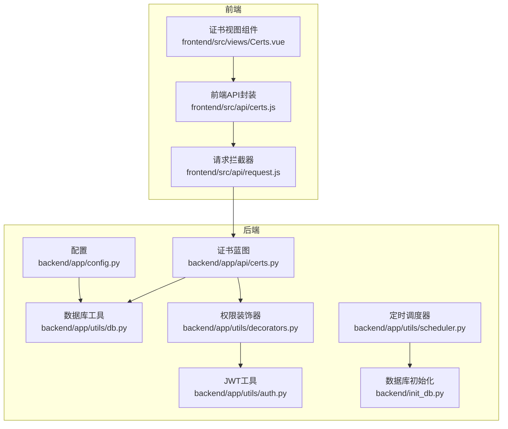
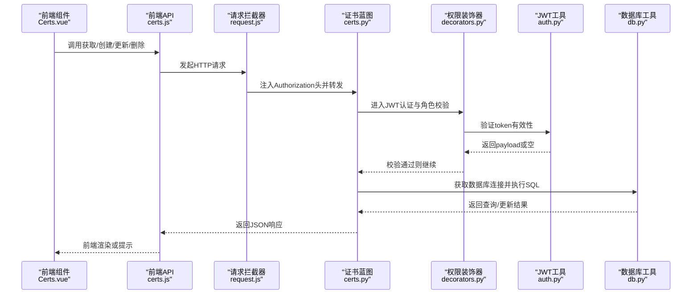
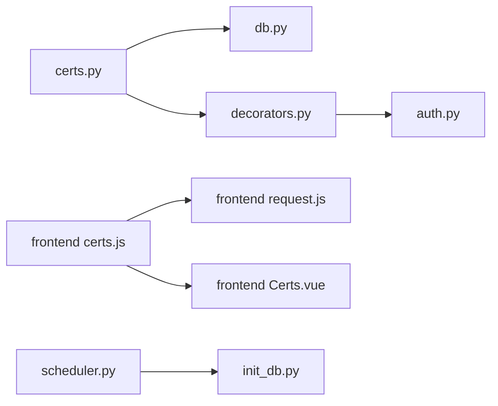

# 域名证书管理API

<cite>
**本文档引用的文件**
- [backend/app/api/certs.py](file://backend/app/api/certs.py)
- [backend/app/utils/db.py](file://backend/app/utils/db.py)
- [backend/app/utils/decorators.py](file://backend/app/utils/decorators.py)
- [backend/app/utils/auth.py](file://backend/app/utils/auth.py)
- [backend/app/utils/scheduler.py](file://backend/app/utils/scheduler.py)
- [backend/init_db.py](file://backend/init_db.py)
- [backend/import_data.py](file://backend/import_data.py)
- [backend/app/api/export.py](file://backend/app/api/export.py)
- [frontend/src/api/certs.js](file://frontend/src/api/certs.js)
- [frontend/src/views/Certs.vue](file://frontend/src/views/Certs.vue)
- [frontend/src/api/request.js](file://frontend/src/api/request.js)
- [backend/app/config.py](file://backend/app/config.py)
</cite>

## 目录
1. [简介](#简介)
2. [项目结构](#项目结构)
3. [核心组件](#核心组件)
4. [架构总览](#架构总览)
5. [详细组件分析](#详细组件分析)
6. [依赖关系分析](#依赖关系分析)
7. [性能考虑](#性能考虑)
8. [故障排除指南](#故障排除指南)
9. [结论](#结论)
10. [附录](#附录)

## 简介
本文件面向运维平台的“域名证书管理API”，提供完整的CRUD接口说明与最佳实践，涵盖以下能力：
- 域名证书的增删改查
- 证书列表检索与筛选
- 证书状态监控与到期预警
- 证书导入导出
- 安全认证与权限控制
- 不同证书类型的配置思路（DV/OV/EV）

该API基于Flask后端与Vue前端实现，采用JWT认证、角色权限控制，并通过Excel导出功能支持批量数据管理。

## 项目结构
后端采用蓝图组织API，工具层负责数据库连接、认证与调度；前端通过Axios封装统一请求与响应拦截，页面组件负责展示与交互。

**图表来源**
- [frontend/src/api/certs.js:1-18](file://frontend/src/api/certs.js#L1-L18)
- [frontend/src/views/Certs.vue:170-336](file://frontend/src/views/Certs.vue#L170-L336)
- [frontend/src/api/request.js:1-54](file://frontend/src/api/request.js#L1-L54)
- [backend/app/api/certs.py:1-145](file://backend/app/api/certs.py#L1-L145)
- [backend/app/utils/db.py:1-17](file://backend/app/utils/db.py#L1-L17)
- [backend/app/utils/decorators.py:1-95](file://backend/app/utils/decorators.py#L1-L95)
- [backend/app/utils/auth.py:1-83](file://backend/app/utils/auth.py#L1-L83)
- [backend/app/utils/scheduler.py:1-249](file://backend/app/utils/scheduler.py#L1-L249)
- [backend/app/config.py:1-21](file://backend/app/config.py#L1-L21)
- [backend/init_db.py:111-131](file://backend/init_db.py#L111-L131)

**章节来源**
- [backend/app/api/certs.py:1-145](file://backend/app/api/certs.py#L1-L145)
- [frontend/src/views/Certs.vue:1-336](file://frontend/src/views/Certs.vue#L1-L336)
- [frontend/src/api/certs.js:1-18](file://frontend/src/api/certs.js#L1-L18)
- [frontend/src/api/request.js:1-54](file://frontend/src/api/request.js#L1-L54)
- [backend/app/utils/db.py:1-17](file://backend/app/utils/db.py#L1-L17)
- [backend/app/utils/decorators.py:1-95](file://backend/app/utils/decorators.py#L1-L95)
- [backend/app/utils/auth.py:1-83](file://backend/app/utils/auth.py#L1-L83)
- [backend/app/utils/scheduler.py:1-249](file://backend/app/utils/scheduler.py#L1-L249)
- [backend/init_db.py:111-131](file://backend/init_db.py#L111-L131)
- [backend/app/config.py:1-21](file://backend/app/config.py#L1-L21)

## 核心组件
- 证书蓝图（Blueprint）：提供证书的CRUD接口，包含列表查询、创建、更新、删除。
- 权限装饰器：JWT认证与角色校验，限制仅管理员与操作员可执行写操作。
- 数据库工具：集中化获取数据库连接，便于统一配置与连接复用。
- 前端API封装：统一REST调用，配合响应拦截器进行错误处理与登录态维护。
- 定时调度器：为后续到期预警与自动续期提供调度基础（当前证书API未直接使用，但具备扩展能力）。

**章节来源**
- [backend/app/api/certs.py:8-145](file://backend/app/api/certs.py#L8-L145)
- [backend/app/utils/decorators.py:9-95](file://backend/app/utils/decorators.py#L9-L95)
- [backend/app/utils/db.py:5-17](file://backend/app/utils/db.py#L5-L17)
- [frontend/src/api/certs.js:1-18](file://frontend/src/api/certs.js#L1-L18)
- [backend/app/utils/scheduler.py:14-249](file://backend/app/utils/scheduler.py#L14-L249)

## 架构总览
下图展示了证书管理API的端到端流程：前端发起请求，经请求拦截器注入JWT，后端蓝图路由到对应处理器，权限装饰器校验后访问数据库工具执行SQL，最终返回JSON响应。

**图表来源**
- [frontend/src/views/Certs.vue:210-294](file://frontend/src/views/Certs.vue#L210-L294)
- [frontend/src/api/certs.js:3-17](file://frontend/src/api/certs.js#L3-L17)
- [frontend/src/api/request.js:14-51](file://frontend/src/api/request.js#L14-L51)
- [backend/app/api/certs.py:11-145](file://backend/app/api/certs.py#L11-L145)
- [backend/app/utils/decorators.py:9-95](file://backend/app/utils/decorators.py#L9-L95)
- [backend/app/utils/auth.py:38-55](file://backend/app/utils/auth.py#L38-L55)
- [backend/app/utils/db.py:5-17](file://backend/app/utils/db.py#L5-L17)

## 详细组件分析

### 证书数据模型与核心字段
- 表结构定义于数据库初始化脚本中，包含以下关键字段：
  - 编号（seq_no）
  - 分类（category）
  - 项目（project）
  - 主体（entity）
  - 购买日期（purchase_date）
  - 到期日期（expire_date）
  - 费用（cost）
  - 剩余天数（remaining_days）
  - 品牌（brand）
  - 状态（status）
  - 备注（remark）
  - 创建/更新时间戳（created_at, updated_at）

- 字段说明与约束：
  - 分类与状态建立索引以优化查询与筛选。
  - 剩余天数为字符串类型，前端可据此进行颜色标记与预警判断。
  - 状态字段同时承担“状态”与“备注”的含义，建议后续拆分以提升清晰度。

**章节来源**
- [backend/init_db.py:111-131](file://backend/init_db.py#L111-L131)
- [frontend/src/views/Certs.vue:34-72](file://frontend/src/views/Certs.vue#L34-L72)
- [frontend/src/views/Certs.vue:148-155](file://frontend/src/views/Certs.vue#L148-L155)

### API接口定义与行为
- 获取证书列表
  - 方法：GET /api/certs
  - 查询参数：search（项目/主体模糊匹配）、category（分类过滤）
  - 返回：code=200与data数组（每条记录包含上述字段）
  - 前端调用：getCerts(params)

- 创建证书
  - 方法：POST /api/certs
  - 权限：admin/operator
  - 请求体：包含上述字段（非必填字段按蓝图逻辑动态拼接）
  - 返回：code=200、消息与新建记录id

- 更新证书
  - 方法：PUT /api/certs/:cert_id
  - 权限：admin/operator
  - 请求体：可选字段集合，仅更新提供的字段
  - 返回：code=200与消息

- 删除证书
  - 方法：DELETE /api/certs/:cert_id
  - 权限：admin/operator
  - 返回：code=200与消息

- 前端集成
  - 前端组件Certs.vue提供搜索、新增、编辑、删除与表格展示，调用前端API封装函数。

**章节来源**
- [backend/app/api/certs.py:11-145](file://backend/app/api/certs.py#L11-L145)
- [frontend/src/api/certs.js:3-17](file://frontend/src/api/certs.js#L3-L17)
- [frontend/src/views/Certs.vue:210-294](file://frontend/src/views/Certs.vue#L210-L294)

### 权限与认证机制
- JWT认证装饰器
  - 从Authorization头解析Bearer Token，校验签名与过期时间，失败返回401。
  - 成功后将用户信息注入flask.g，供后续中间件使用。

- 角色权限装饰器
  - 限定admin/operator可执行写操作（创建/更新/删除）。
  - 未认证或权限不足返回相应HTTP状态码与错误信息。

- 前端请求拦截器
  - 自动注入Authorization头，统一处理401并引导至登录页。
  - 对非200的响应统一提示错误消息。

**章节来源**
- [backend/app/utils/decorators.py:9-95](file://backend/app/utils/decorators.py#L9-L95)
- [backend/app/utils/auth.py:38-55](file://backend/app/utils/auth.py#L38-L55)
- [frontend/src/api/request.js:14-51](file://frontend/src/api/request.js#L14-L51)

### 证书状态监控与到期预警
- 当前蓝图未直接实现到期预警与自动续期逻辑，但具备扩展条件：
  - 前端已对剩余天数进行颜色标记（即将过期/已过期），可在业务侧结合定时任务触发续期流程。
  - 定时调度器支持从数据库加载任务并按Cron表达式执行脚本，可用于：
    - 计算到期预警（比较expire_date与当前日期）
    - 触发自动续期脚本（需配套后端脚本与证书CA对接）
    - 生成续期提醒通知

- 建议的实现路径：
  - 在数据库中增加“到期预警阈值”字段与“最近一次预警时间”字段。
  - 通过调度器定期扫描即将到期的证书，生成任务日志与通知。
  - 任务脚本可调用外部CA接口或内部自动化流程，完成后更新证书状态与剩余天数。

**章节来源**
- [backend/app/utils/scheduler.py:146-249](file://backend/app/utils/scheduler.py#L146-L249)
- [frontend/src/views/Certs.vue:305-320](file://frontend/src/views/Certs.vue#L305-L320)

### 证书导入导出与高级功能
- 导出Excel
  - 接口：GET /api/export/excel
  - 功能：导出包含“域名证书”工作表的数据，表头与字段与数据库一致。
  - 前端：可直接下载，便于离线备份与审计。

- 导入数据
  - 工具：import_data.py
  - 功能：从Excel读取证书数据并批量插入domains_certs表，支持部分字段映射与清洗。

- 高级功能建议
  - 证书链与私钥管理：当前API未提供专用字段与接口，建议新增certificate_chain与private_key字段，并配套加密存储与密钥管理服务。
  - 吊销申请：建议新增吊销申请接口与状态流转，结合CA吊销列表（CRL/OCSP）进行状态同步。
  - 状态查询：提供按实体（entity）或序列号（seq_no）的状态查询接口，便于批量核对。

**章节来源**
- [backend/app/api/export.py:64-227](file://backend/app/api/export.py#L64-L227)
- [backend/import_data.py:276-324](file://backend/import_data.py#L276-L324)

### 不同证书类型的配置方法（DV/OV/EV）
- 当前API未区分证书类型字段，但可通过“分类（category）”与“品牌（brand）”字段间接体现：
  - 分类：如“SSL证书”、“域名”等，可用于区分业务域。
  - 品牌：如“DigiCert”、“Let's Encrypt”等，可反映CA与类型特征。
- 建议扩展：
  - 新增certificate_type字段（DV/OV/EV），并在前端提供类型选择与校验。
  - 针对不同类型增加差异化字段（如组织验证信息、法律声明等）。

**章节来源**
- [backend/init_db.py:111-131](file://backend/init_db.py#L111-L131)
- [frontend/src/views/Certs.vue:84-89](file://frontend/src/views/Certs.vue#L84-L89)
- [frontend/src/views/Certs.vue:142-145](file://frontend/src/views/Certs.vue#L142-L145)

## 依赖关系分析
- 组件耦合
  - 证书蓝图依赖数据库工具与权限装饰器，权限装饰器依赖JWT工具。
  - 前端API封装依赖请求拦截器，视图组件依赖API封装。
- 外部依赖
  - Flask蓝图、PyMySQL、APScheduler、openpyxl、Element Plus等。
- 可能的循环依赖
  - 当前文件间无明显循环导入；若后续在蓝图中引入调度器回调，需避免循环引用。

**图表来源**
- [backend/app/api/certs.py:4-6](file://backend/app/api/certs.py#L4-L6)
- [backend/app/utils/db.py:1-17](file://backend/app/utils/db.py#L1-L17)
- [backend/app/utils/decorators.py:1-95](file://backend/app/utils/decorators.py#L1-L95)
- [backend/app/utils/auth.py:1-83](file://backend/app/utils/auth.py#L1-L83)
- [frontend/src/api/certs.js:1-18](file://frontend/src/api/certs.js#L1-L18)
- [frontend/src/api/request.js:1-54](file://frontend/src/api/request.js#L1-L54)
- [frontend/src/views/Certs.vue:170-336](file://frontend/src/views/Certs.vue#L170-L336)
- [backend/app/utils/scheduler.py:1-249](file://backend/app/utils/scheduler.py#L1-L249)
- [backend/init_db.py:111-131](file://backend/init_db.py#L111-L131)

**章节来源**
- [backend/app/api/certs.py:1-145](file://backend/app/api/certs.py#L1-L145)
- [frontend/src/api/certs.js:1-18](file://frontend/src/api/certs.js#L1-L18)
- [frontend/src/views/Certs.vue:1-336](file://frontend/src/views/Certs.vue#L1-L336)
- [backend/app/utils/scheduler.py:1-249](file://backend/app/utils/scheduler.py#L1-L249)
- [backend/init_db.py:111-131](file://backend/init_db.py#L111-L131)

## 性能考虑
- 查询优化
  - 分类与状态字段已建立索引，建议在高频查询场景下限制返回字段数量，避免SELECT *
  - 列表查询支持模糊匹配，建议对搜索词长度与特殊字符进行限制，防止LIKE通配导致索引失效
- 写操作优化
  - 更新接口按需拼接字段，减少不必要的写放大
  - 批量导入建议分批处理，避免单次事务过大
- 前端体验
  - 表格加载使用v-loading，建议结合分页或虚拟滚动优化大数据集展示
- 定时任务
  - 调度器支持Cron表达式，建议合理设置执行频率，避免高并发扫描数据库

[本节为通用指导，无需特定文件引用]

## 故障排除指南
- 认证失败（401）
  - 检查Authorization头格式是否为Bearer Token，确认token未过期
  - 前端拦截器会自动清除本地token并跳转登录页
- 权限不足（403）
  - 确认当前用户角色是否包含admin或operator
- 数据库异常
  - 检查数据库连接配置（主机、端口、账号、密码、库名）
  - 查看后端日志中的SQL异常堆栈
- 导入/导出问题
  - 导出接口需确保有数据；导入时注意字段映射与数据清洗逻辑
- 前端错误提示
  - 统一由响应拦截器处理，查看控制台与消息提示定位具体错误

**章节来源**
- [frontend/src/api/request.js:25-51](file://frontend/src/api/request.js#L25-L51)
- [backend/app/utils/decorators.py:20-56](file://backend/app/utils/decorators.py#L20-L56)
- [backend/app/utils/db.py:5-17](file://backend/app/utils/db.py#L5-L17)
- [backend/app/api/export.py:64-227](file://backend/app/api/export.py#L64-L227)
- [backend/import_data.py:276-324](file://backend/import_data.py#L276-L324)

## 结论
域名证书管理API提供了完整的CRUD能力与基础的权限控制，配合Excel导入导出与前端可视化界面，满足日常证书台账管理需求。建议后续增强：
- 引入证书类型字段与差异化配置
- 实现到期预警与自动续期的调度机制
- 新增证书链与私钥的安全存储与管理接口
- 提供吊销申请与状态查询等高级能力

[本节为总结性内容，无需特定文件引用]

## 附录

### API定义一览
- 获取证书列表
  - 方法：GET /api/certs
  - 查询参数：search、category
  - 返回：code、data（数组）
- 创建证书
  - 方法：POST /api/certs
  - 权限：admin/operator
  - 请求体：字段集合（按需提供）
  - 返回：code、message、data{id}
- 更新证书
  - 方法：PUT /api/certs/:cert_id
  - 权限：admin/operator
  - 请求体：字段集合（按需提供）
  - 返回：code、message
- 删除证书
  - 方法：DELETE /api/certs/:cert_id
  - 权限：admin/operator
  - 返回：code、message

**章节来源**
- [backend/app/api/certs.py:11-145](file://backend/app/api/certs.py#L11-L145)

### 数据模型字段说明
- 关键字段：seq_no、category、project、entity、purchase_date、expire_date、cost、remaining_days、brand、status、remark
- 索引：category、status
- 时间戳：created_at、updated_at

**章节来源**
- [backend/init_db.py:111-131](file://backend/init_db.py#L111-L131)

### 前端调用示例（路径）
- 获取列表：[frontend/src/api/certs.js:3-5](file://frontend/src/api/certs.js#L3-L5)
- 创建：[frontend/src/api/certs.js:7-9](file://frontend/src/api/certs.js#L7-L9)
- 更新：[frontend/src/api/certs.js:11-13](file://frontend/src/api/certs.js#L11-L13)
- 删除：[frontend/src/api/certs.js:15-17](file://frontend/src/api/certs.js#L15-L17)

**章节来源**
- [frontend/src/api/certs.js:1-18](file://frontend/src/api/certs.js#L1-L18)