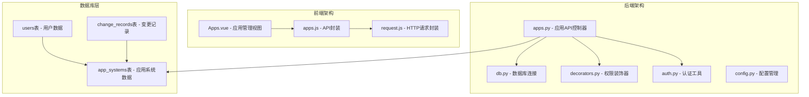
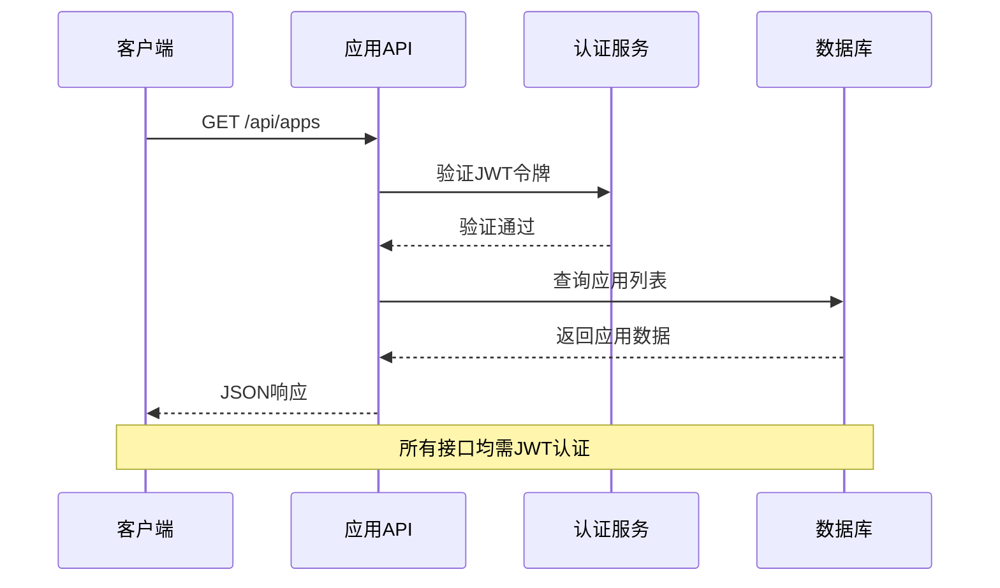
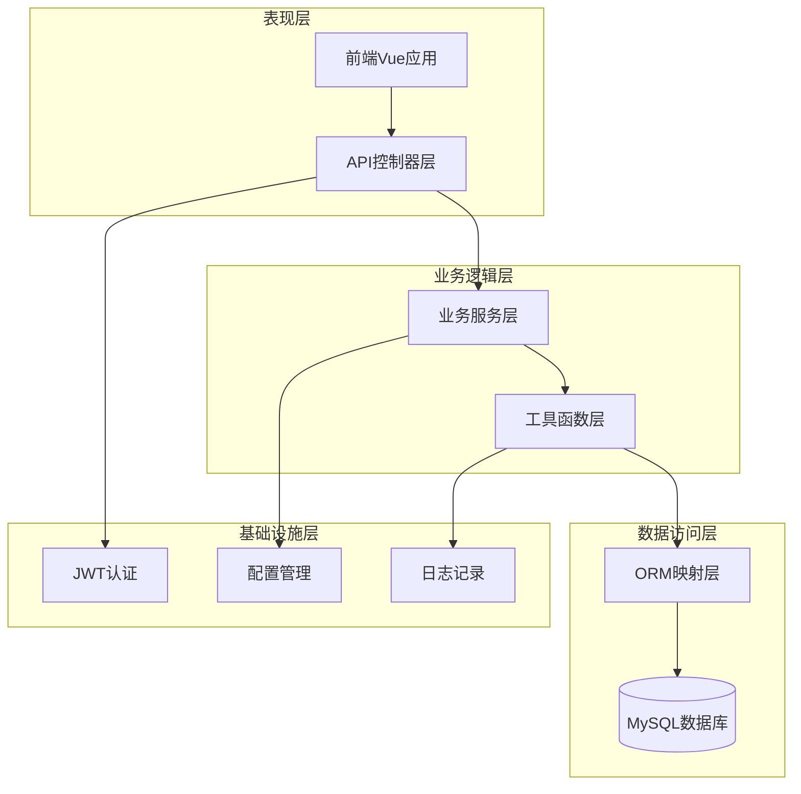
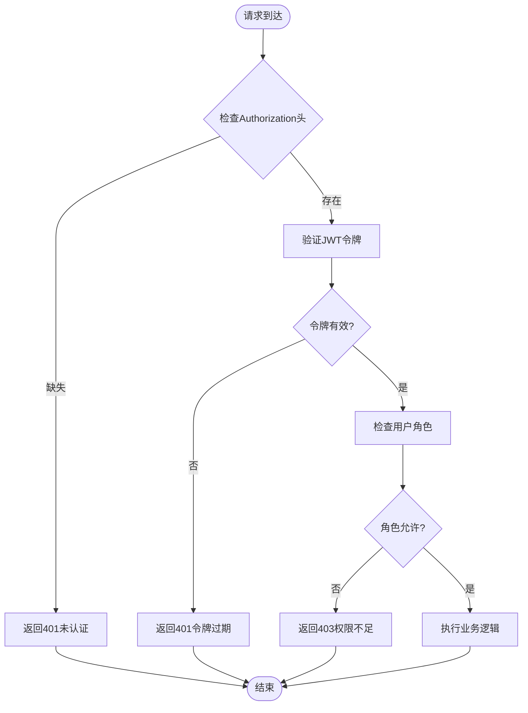
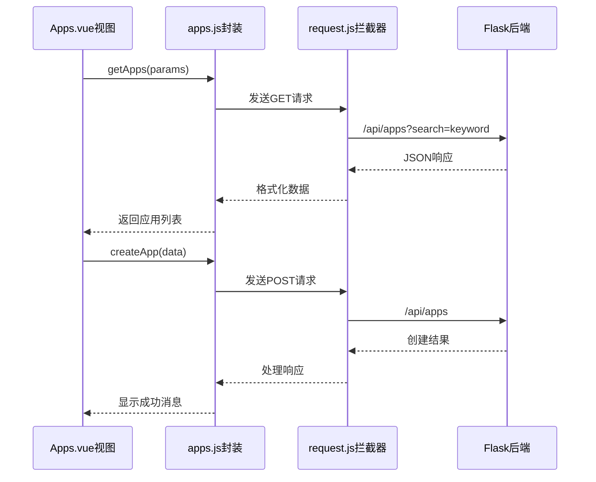
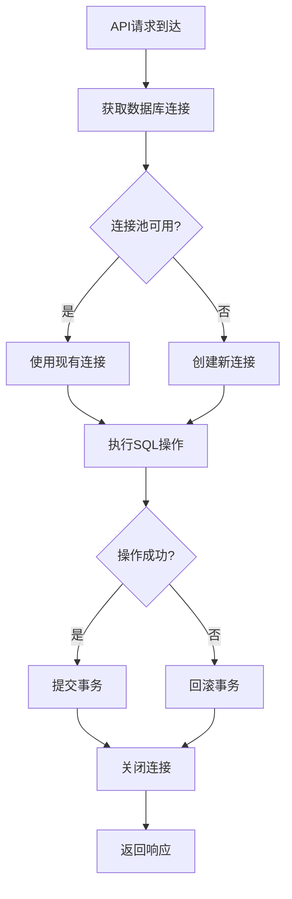
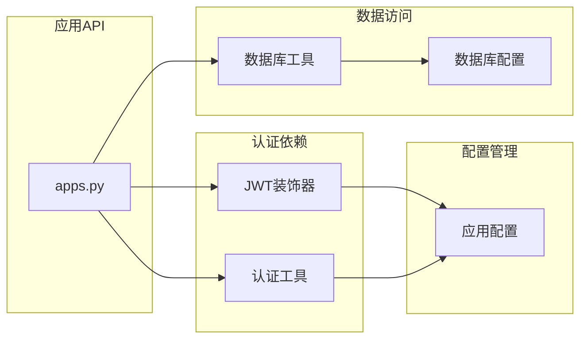
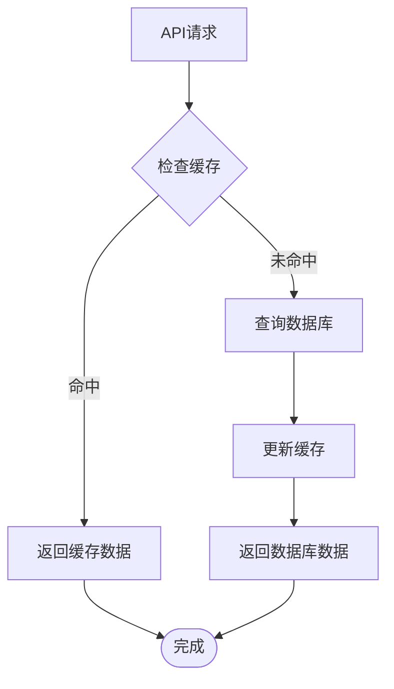

# 应用系统管理API

<cite>
**本文档引用的文件**
- [apps.py](file://backend/app/api/apps.py)
- [apps.js](file://frontend/src/api/apps.js)
- [Apps.vue](file://frontend/src/views/Apps.vue)
- [db.py](file://backend/app/utils/db.py)
- [decorators.py](file://backend/app/utils/decorators.py)
- [auth.py](file://backend/app/utils/auth.py)
- [config.py](file://backend/app/config.py)
- [request.js](file://frontend/src/api/request.js)
- [init_db.py](file://backend/init_db.py)
- [export.py](file://backend/app/api/export.py)
</cite>

## 目录
1. [简介](#简介)
2. [项目结构](#项目结构)
3. [核心组件](#核心组件)
4. [架构概览](#架构概览)
5. [详细组件分析](#详细组件分析)
6. [依赖关系分析](#依赖关系分析)
7. [性能考虑](#性能考虑)
8. [故障排除指南](#故障排除指南)
9. [结论](#结论)

## 简介

应用系统管理API是运维平台的核心功能模块，负责应用系统的全生命周期管理。该模块提供了完整的CRUD操作接口，支持应用系统的创建、查询、更新和删除功能，同时集成了用户认证、权限控制和数据导出等辅助功能。

本系统采用前后端分离架构，后端基于Flask框架构建RESTful API，前端使用Vue.js配合Element Plus组件库实现用户界面。系统通过JWT令牌实现用户认证，通过角色权限控制不同操作的访问权限。

## 项目结构

应用系统管理API位于后端项目的API模块中，主要包含以下核心文件：



**图表来源**
- [apps.py:1-139](file://backend/app/api/apps.py#L1-L139)
- [db.py:1-17](file://backend/app/utils/db.py#L1-L17)
- [apps.js:1-18](file://frontend/src/api/apps.js#L1-L18)

**章节来源**
- [apps.py:1-139](file://backend/app/api/apps.py#L1-L139)
- [config.py:1-21](file://backend/app/config.py#L1-L21)

## 核心组件

### 应用系统数据模型

应用系统管理API基于MySQL数据库的`app_systems`表实现，包含以下核心字段：

| 字段名 | 类型 | 描述 | 约束 |
|--------|------|------|------|
| id | INT | 主键ID | 自增 |
| seq_no | VARCHAR(50) | 序号编号 | 可选 |
| name | VARCHAR(200) | 应用名称 | 必填 |
| company | VARCHAR(200) | 所属单位 | 可选 |
| access_url | VARCHAR(500) | 访问地址 | 可选 |
| username | VARCHAR(100) | 管理员用户名 | 可选 |
| password | VARCHAR(200) | 管理员密码 | 可选 |
| remark | TEXT | 备注说明 | 可选 |
| created_at | DATETIME | 创建时间 | 自动设置 |
| updated_at | DATETIME | 更新时间 | 自动更新 |

### API接口设计

系统提供标准的RESTful API接口，遵循HTTP状态码和JSON响应格式规范：



**图表来源**
- [apps.py:11-39](file://backend/app/api/apps.py#L11-L39)
- [auth.py:14-82](file://backend/app/api/auth.py#L14-L82)

**章节来源**
- [init_db.py:94-109](file://backend/init_db.py#L94-L109)
- [apps.py:42-139](file://backend/app/api/apps.py#L42-L139)

## 架构概览

应用系统管理API采用分层架构设计，确保关注点分离和代码可维护性：



**图表来源**
- [apps.py:1-139](file://backend/app/api/apps.py#L1-L139)
- [decorators.py:1-95](file://backend/app/utils/decorators.py#L1-L95)
- [db.py:1-17](file://backend/app/utils/db.py#L1-L17)

### 认证与授权机制

系统采用JWT（JSON Web Token）实现无状态认证，结合角色权限控制确保操作安全：



**图表来源**
- [decorators.py:9-56](file://backend/app/utils/decorators.py#L9-L56)
- [auth.py:14-82](file://backend/app/api/auth.py#L14-L82)

**章节来源**
- [decorators.py:1-95](file://backend/app/utils/decorators.py#L1-L95)
- [auth.py:1-184](file://backend/app/api/auth.py#L1-L184)

## 详细组件分析

### 应用系统CRUD操作

#### 获取应用列表

应用列表查询支持多字段模糊搜索，包括应用名称、所属单位和访问地址：

**请求格式**
- 方法: GET
- 路径: `/api/apps`
- 查询参数: `search`（关键词搜索）

**响应格式**
```json
{
  "code": 200,
  "data": [
    {
      "id": 1,
      "seq_no": "APP001",
      "name": "示例应用",
      "company": "示例公司",
      "access_url": "https://example.com",
      "username": "admin",
      "password": "encrypted_password",
      "remark": "测试应用",
      "created_at": "2024-01-01T00:00:00",
      "updated_at": "2024-01-01T00:00:00"
    }
  ]
}
```

#### 创建应用系统

应用创建接口支持批量字段插入，仅接受预定义的安全字段：

**请求格式**
- 方法: POST
- 路径: `/api/apps`
- 请求体: 包含应用基本信息的JSON对象

**允许的字段**
- `seq_no`: 序号编号
- `name`: 应用名称（必填）
- `company`: 所属单位
- `access_url`: 访问地址
- `username`: 管理员用户名
- `password`: 管理员密码
- `remark`: 备注说明

#### 更新应用系统

应用更新支持部分字段更新，动态构建SQL语句以提高安全性：

**请求格式**
- 方法: PUT
- 路径: `/api/apps/{app_id}`
- 路径参数: `app_id`（应用ID）
- 请求体: 需要更新的字段JSON对象

**更新策略**
系统会检查请求体中的字段，仅对存在的字段构建更新语句，避免覆盖不需要更改的数据。

#### 删除应用系统

应用删除采用软删除策略，确保数据完整性和审计需求：

**请求格式**
- 方法: DELETE
- 路径: `/api/apps/{app_id}`
- 路径参数: `app_id`（应用ID）

**章节来源**
- [apps.py:11-139](file://backend/app/api/apps.py#L11-L139)

### 前端集成实现

前端应用通过专门的API封装模块与后端交互：



**图表来源**
- [Apps.vue:138-195](file://frontend/src/views/Apps.vue#L138-L195)
- [apps.js:1-18](file://frontend/src/api/apps.js#L1-L18)
- [request.js:1-54](file://frontend/src/api/request.js#L1-L54)

**章节来源**
- [Apps.vue:1-227](file://frontend/src/views/Apps.vue#L1-L227)
- [apps.js:1-18](file://frontend/src/api/apps.js#L1-L18)

### 数据库连接与事务管理

系统采用连接池模式管理数据库连接，确保资源的有效利用：



**图表来源**
- [db.py:5-17](file://backend/app/utils/db.py#L5-L17)
- [apps.py:18-75](file://backend/app/api/apps.py#L18-L75)

**章节来源**
- [db.py:1-17](file://backend/app/utils/db.py#L1-L17)
- [config.py:1-21](file://backend/app/config.py#L1-L21)

## 依赖关系分析

应用系统管理API的依赖关系相对简单，主要依赖于认证、数据库和配置模块：



**图表来源**
- [apps.py:4-6](file://backend/app/api/apps.py#L4-L6)
- [decorators.py:1-95](file://backend/app/utils/decorators.py#L1-L95)
- [auth.py:1-83](file://backend/app/utils/auth.py#L1-L83)
- [db.py:1-17](file://backend/app/utils/db.py#L1-L17)
- [config.py:1-21](file://backend/app/config.py#L1-L21)

### 外部依赖

系统对外部依赖较少，主要依赖关系如下：

- **Flask**: Web框架，提供路由和请求处理
- **PyMySQL**: MySQL数据库驱动，处理数据库连接
- **PyJWT**: JWT令牌处理，实现认证功能
- **Werkzeug**: 密码哈希工具，处理密码安全

**章节来源**
- [apps.py:4-6](file://backend/app/api/apps.py#L4-L6)
- [auth.py:5-8](file://backend/app/utils/auth.py#L5-L8)
- [db.py:1](file://backend/app/utils/db.py#L1)

## 性能考虑

### 数据库优化

应用系统管理API在数据库层面采用了多项优化措施：

1. **索引策略**: 在应用名称字段建立索引，提高查询性能
2. **连接池管理**: 复用数据库连接，减少连接开销
3. **参数化查询**: 使用参数化SQL防止SQL注入，提高执行效率
4. **事务控制**: 合理的事务边界，确保数据一致性

### 缓存策略

虽然当前版本未实现缓存，但系统设计支持后续添加缓存层：



### 并发处理

系统通过以下机制处理并发访问：

- **连接池**: 管理数据库连接，避免连接竞争
- **事务隔离**: 使用适当的事务隔离级别
- **锁机制**: 在必要时使用行级锁防止数据冲突

## 故障排除指南

### 常见问题诊断

#### 认证相关问题

**问题**: 401 未认证错误
**可能原因**:
- 缺少Authorization头部
- JWT令牌格式不正确
- 令牌已过期

**解决方案**:
1. 确保请求头包含正确的Bearer令牌格式
2. 检查令牌是否在有效期内
3. 重新登录获取新的令牌

#### 权限相关问题

**问题**: 403 权限不足错误
**可能原因**:
- 用户角色不满足操作要求
- 未进行JWT认证

**解决方案**:
1. 确认用户具有admin或operator角色
2. 确保在调用受保护接口前已完成认证

#### 数据库连接问题

**问题**: 数据库操作失败
**可能原因**:
- 数据库连接超时
- SQL语法错误
- 权限不足

**解决方案**:
1. 检查数据库连接配置
2. 验证SQL语句的正确性
3. 确认数据库用户权限

**章节来源**
- [decorators.py:20-56](file://backend/app/utils/decorators.py#L20-L56)
- [request.js:25-51](file://frontend/src/api/request.js#L25-L51)

### 错误响应格式

系统统一使用以下错误响应格式：

```json
{
  "code": 400,
  "message": "错误描述信息"
}
```

**常见HTTP状态码**:
- 200: 操作成功
- 400: 请求参数错误
- 401: 未认证或令牌无效
- 403: 权限不足
- 404: 资源不存在
- 500: 服务器内部错误

## 结论

应用系统管理API提供了完整的企业级应用管理系统，具备以下特点：

### 技术优势

1. **安全性**: 采用JWT认证和角色权限控制，确保系统安全
2. **可维护性**: 清晰的分层架构，便于代码维护和扩展
3. **可靠性**: 完善的错误处理和事务管理机制
4. **易用性**: 标准化的API设计，便于前端集成

### 功能完整性

系统涵盖了应用管理的完整生命周期，包括：
- 应用信息的增删改查操作
- 多字段搜索和过滤功能
- 用户权限管理和认证控制
- 数据导出和报表功能

### 扩展建议

基于当前架构，建议后续可以考虑：
1. 添加应用监控和健康检查接口
2. 实现应用迁移和升级的自动化流程
3. 增加应用访问日志和审计功能
4. 集成更多的运维自动化工具

该API为运维平台提供了坚实的应用管理基础，能够满足大多数企业级应用管理需求，并为未来的功能扩展奠定了良好的技术基础。