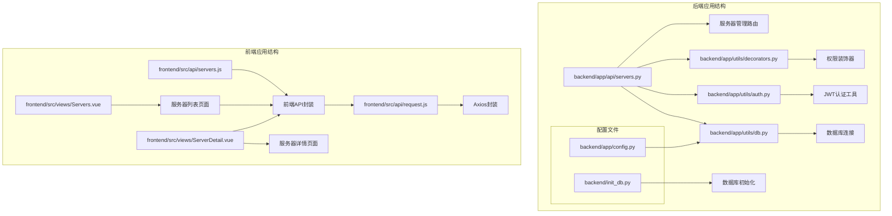
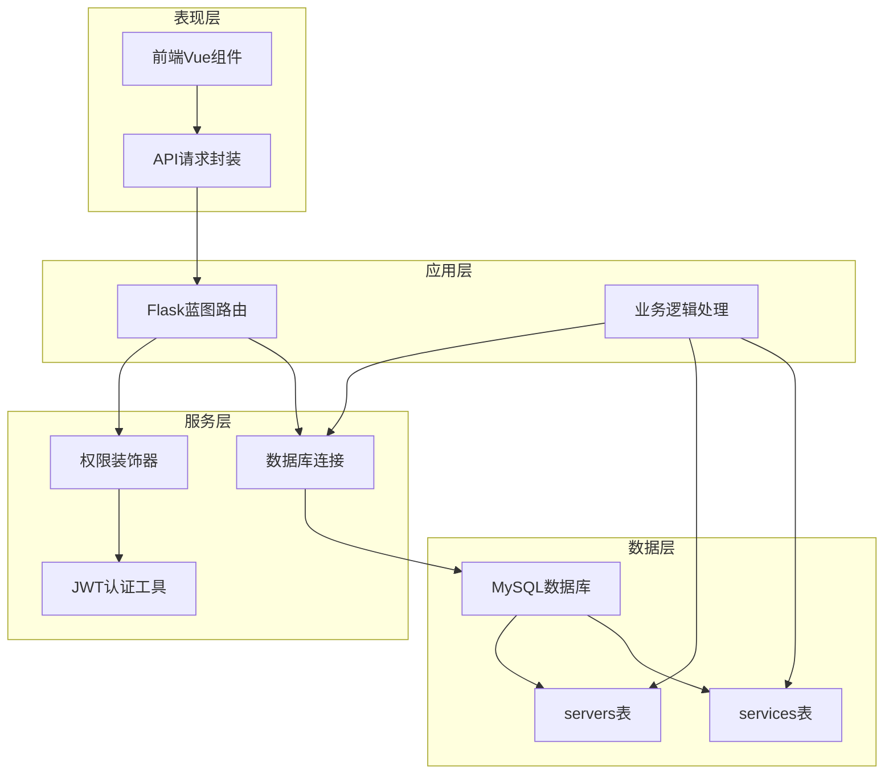
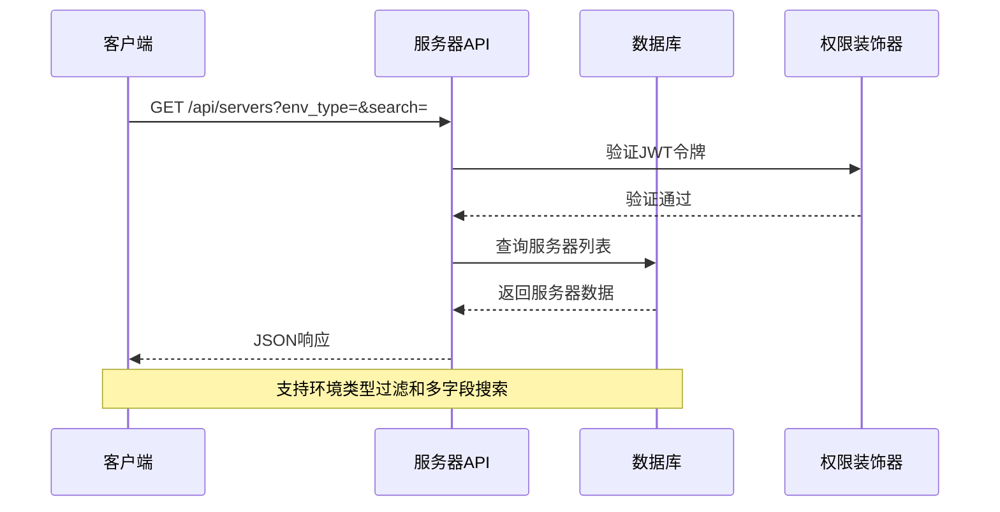
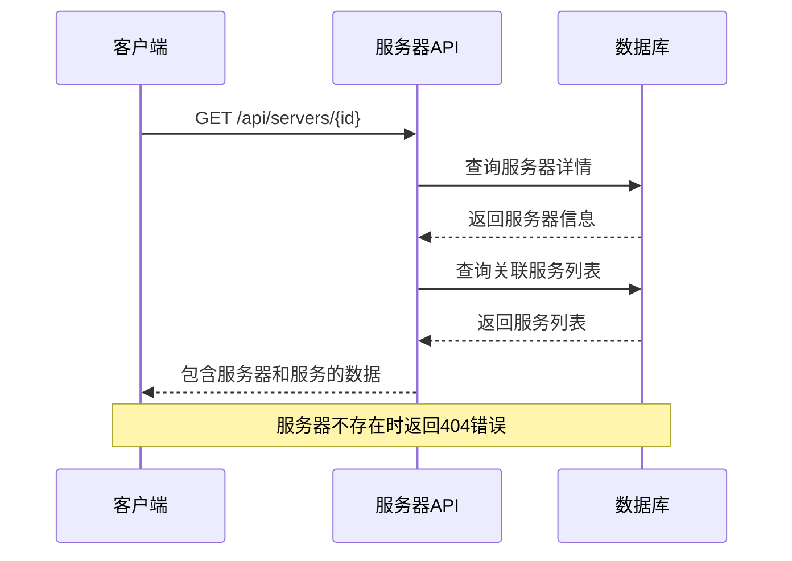
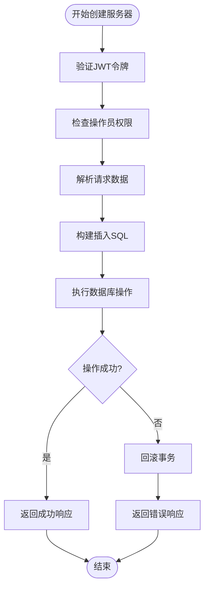
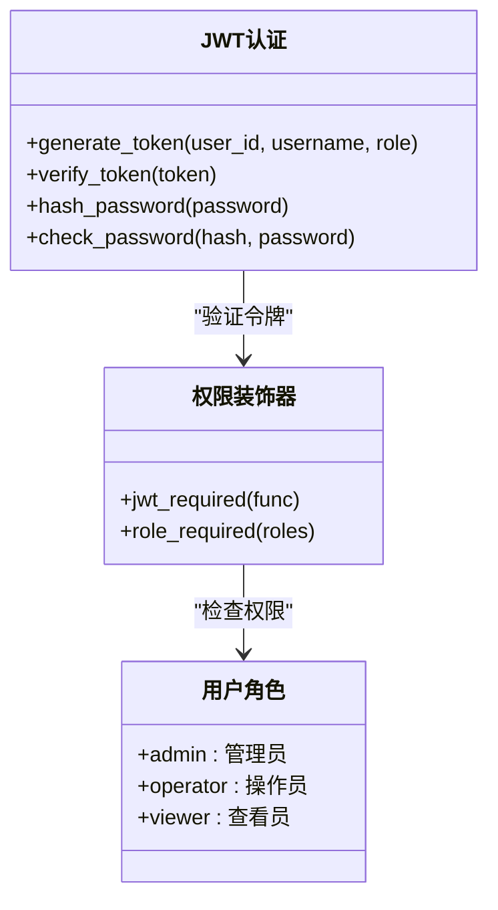
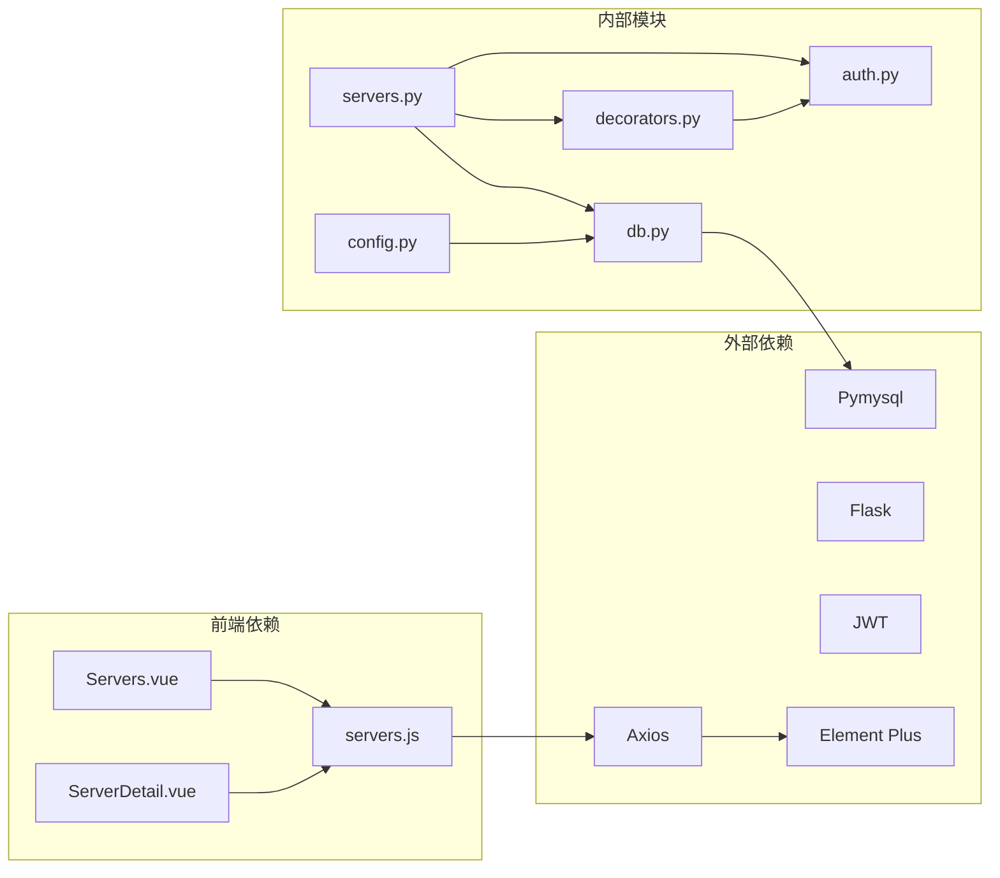

# 服务器管理API

<cite>
**本文档引用的文件**
- [servers.py](file://backend/app/api/servers.py)
- [request.js](file://frontend/src/api/request.js)
- [servers.js](file://frontend/src/api/servers.js)
- [Servers.vue](file://frontend/src/views/Servers.vue)
- [ServerDetail.vue](file://frontend/src/views/ServerDetail.vue)
- [decorators.py](file://backend/app/utils/decorators.py)
- [auth.py](file://backend/app/utils/auth.py)
- [db.py](file://backend/app/utils/db.py)
- [config.py](file://backend/app/config.py)
- [init_db.py](file://backend/init_db.py)
</cite>

## 目录
1. [简介](#简介)
2. [项目结构](#项目结构)
3. [核心组件](#核心组件)
4. [架构概览](#架构概览)
5. [详细组件分析](#详细组件分析)
6. [依赖关系分析](#依赖关系分析)
7. [性能考虑](#性能考虑)
8. [故障排除指南](#故障排除指南)
9. [结论](#结论)

## 简介

服务器管理API是运维平台的核心功能模块，提供完整的服务器生命周期管理能力。该API基于Flask框架构建，采用RESTful设计原则，支持服务器的CRUD操作，包括获取服务器列表、获取服务器详情、获取服务器简要信息列表、创建服务器、更新服务器和删除服务器等功能。

系统采用JWT令牌认证机制，支持多角色权限控制（admin/operator），并提供完整的错误处理和响应格式标准化。前端使用Vue.js框架配合Element Plus组件库，提供直观的用户界面。

## 项目结构

服务器管理API位于后端应用的API层，采用模块化设计，主要文件组织如下：

**图表来源**
- [servers.py:1-203](file://backend/app/api/servers.py#L1-L203)
- [decorators.py:1-95](file://backend/app/utils/decorators.py#L1-L95)
- [request.js:1-54](file://frontend/src/api/request.js#L1-L54)

**章节来源**
- [servers.py:1-203](file://backend/app/api/servers.py#L1-L203)
- [config.py:1-21](file://backend/app/config.py#L1-L21)

## 核心组件

### 服务器管理路由模块

服务器管理API通过Flask蓝图实现，定义了完整的RESTful接口：

- **GET /api/servers** - 获取服务器列表（支持环境类型过滤和搜索）
- **GET /api/servers/{id}** - 获取服务器详情（含关联服务列表）
- **GET /api/servers/list** - 获取服务器简要信息列表
- **POST /api/servers** - 创建服务器
- **PUT /api/servers/{id}** - 更新服务器
- **DELETE /api/servers/{id}** - 删除服务器

### 权限控制系统

系统采用两层权限控制机制：

1. **JWT认证装饰器** - 验证用户身份和令牌有效性
2. **角色权限装饰器** - 基于角色的访问控制（admin/operator）

### 数据库连接管理

采用Pymysql作为MySQL驱动，提供统一的数据库连接管理，支持配置化的数据库连接参数。

**章节来源**
- [servers.py:8-203](file://backend/app/api/servers.py#L8-L203)
- [decorators.py:9-95](file://backend/app/utils/decorators.py#L9-L95)
- [db.py:5-17](file://backend/app/utils/db.py#L5-L17)

## 架构概览

服务器管理API采用分层架构设计，确保关注点分离和代码可维护性：

**图表来源**
- [servers.py:11-203](file://backend/app/api/servers.py#L11-L203)
- [decorators.py:9-95](file://backend/app/utils/decorators.py#L9-L95)
- [auth.py:11-83](file://backend/app/utils/auth.py#L11-L83)

## 详细组件分析

### 服务器CRUD操作详解

#### 获取服务器列表

支持多条件查询过滤，包括环境类型筛选和关键词搜索：

**图表来源**
- [servers.py:11-44](file://backend/app/api/servers.py#L11-L44)
- [decorators.py:9-56](file://backend/app/utils/decorators.py#L9-L56)

#### 获取服务器详情

提供服务器基础信息和关联服务列表的完整视图：

**图表来源**
- [servers.py:46-79](file://backend/app/api/servers.py#L46-L79)

#### 创建服务器

支持批量字段创建，部分字段可选：

**图表来源**
- [servers.py:101-137](file://backend/app/api/servers.py#L101-L137)
- [decorators.py:59-95](file://backend/app/utils/decorators.py#L59-L95)

**章节来源**
- [servers.py:11-203](file://backend/app/api/servers.py#L11-L203)

### 核心字段说明

服务器管理涉及以下核心字段，每个字段都有明确的用途和约束：

| 字段名 | 类型 | 必填 | 描述 | 示例 |
|--------|------|------|------|------|
| env_type | String | 是 | 环境类型 | 测试/生产/智慧环保/水电集团 |
| platform | String | 否 | 平台类型 | 阿里云、VMware等 |
| hostname | String | 是 | 主机名 | server01.example.com |
| inner_ip | String | 是 | 内网IP | 192.168.1.10 |
| mapped_ip | String | 否 | 映射IP | 10.0.0.10 |
| public_ip | String | 否 | 公网IP | 203.0.113.10 |
| cpu | String | 否 | CPU规格 | 8核 |
| memory | String | 否 | 内存大小 | 16GB |
| sys_disk | String | 否 | 系统盘容量 | 100GB |
| data_disk | String | 否 | 数据盘容量 | 500GB |
| purpose | String | 否 | 用途说明 | Web服务器 |
| os_user | String | 否 | 操作系统用户 | root |
| os_password | String | 否 | 操作系统密码 | ******** |
| docker_password | String | 否 | Docker密码 | ******** |
| remark | Text | 否 | 备注信息 | 备注说明 |

**章节来源**
- [init_db.py:50-73](file://backend/init_db.py#L50-L73)

### 权限控制机制

系统采用基于角色的访问控制（RBAC）机制：

**图表来源**
- [auth.py:11-83](file://backend/app/utils/auth.py#L11-L83)
- [decorators.py:59-95](file://backend/app/utils/decorators.py#L59-L95)

**章节来源**
- [auth.py:11-83](file://backend/app/utils/auth.py#L11-L83)
- [decorators.py:9-95](file://backend/app/utils/decorators.py#L9-L95)

### 错误处理机制

系统提供统一的错误处理响应格式：

| 状态码 | 含义 | 响应格式 | 说明 |
|--------|------|----------|------|
| 200 | 成功 | `{code: 200, data: ...}` | 操作成功 |
| 400 | 参数错误 | `{code: 400, message: "错误信息"}` | 请求参数不正确 |
| 401 | 未认证 | `{code: 401, message: "缺少认证信息"}` | 令牌缺失或无效 |
| 403 | 权限不足 | `{code: 403, message: "权限不足"}` | 角色权限不够 |
| 404 | 资源不存在 | `{code: 404, message: "服务器不存在"}` | 查询的目标不存在 |
| 500 | 服务器错误 | `{code: 500, message: "错误信息"}` | 服务器内部错误 |

**章节来源**
- [servers.py:58-61](file://backend/app/api/servers.py#L58-L61)
- [decorators.py:24-45](file://backend/app/utils/decorators.py#L24-L45)

## 依赖关系分析

服务器管理API的依赖关系清晰明确，遵循单一职责原则：

**图表来源**
- [servers.py:4-6](file://backend/app/api/servers.py#L4-L6)
- [request.js:1-11](file://frontend/src/api/request.js#L1-L11)

**章节来源**
- [servers.py:4-6](file://backend/app/api/servers.py#L4-L6)
- [request.js:1-11](file://frontend/src/api/request.js#L1-L11)

## 性能考虑

### 数据库优化策略

1. **索引优化**：为常用查询字段建立索引
   - `env_type`：支持环境类型快速筛选
   - `inner_ip`：支持IP地址快速匹配

2. **查询优化**：
   - 使用参数化查询防止SQL注入
   - 实现条件动态拼接避免全表扫描

3. **连接池管理**：
   - 统一的数据库连接管理
   - 自动资源清理避免连接泄漏

### 前端性能优化

1. **懒加载**：按需加载组件和数据
2. **缓存策略**：合理利用浏览器缓存
3. **分页处理**：大数据量时采用分页展示

## 故障排除指南

### 常见问题及解决方案

#### 认证相关问题

**问题**：401 未认证错误
**原因**：缺少有效的JWT令牌
**解决**：确保请求头包含正确的Authorization: Bearer token

**问题**：403 权限不足
**原因**：用户角色权限不够
**解决**：确认用户具有admin或operator角色

#### 数据库连接问题

**问题**：数据库连接失败
**原因**：连接参数配置错误
**解决**：检查DB_HOST、DB_PORT、DB_USER、DB_PASSWORD配置

#### 数据格式问题

**问题**：400 参数错误
**原因**：请求数据格式不符合要求
**解决**：检查必填字段和数据类型

**章节来源**
- [decorators.py:24-45](file://backend/app/utils/decorators.py#L24-L45)
- [config.py:9-13](file://backend/app/config.py#L9-L13)

## 结论

服务器管理API提供了完整的企业级服务器资产管理能力，具有以下特点：

1. **功能完整**：支持服务器全生命周期管理
2. **安全可靠**：双重认证机制确保系统安全
3. **易于扩展**：模块化设计便于功能扩展
4. **用户体验良好**：前后端分离提供优秀的交互体验

该API为运维团队提供了高效的服务器管理工具，能够满足不同规模企业的服务器资产管理需求。通过合理的权限控制和错误处理机制，确保了系统的稳定性和安全性。