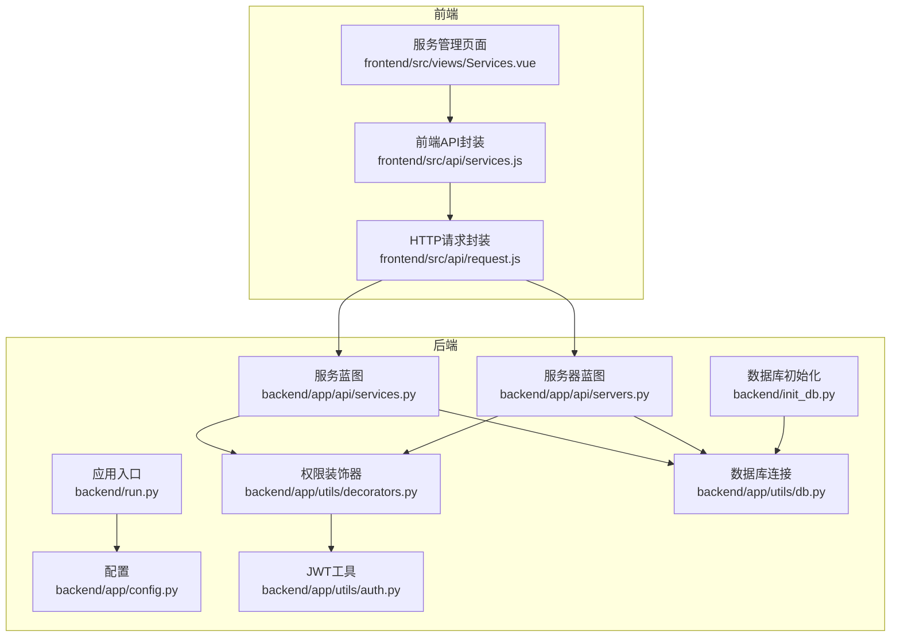
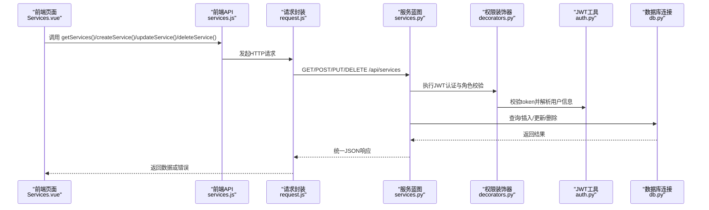
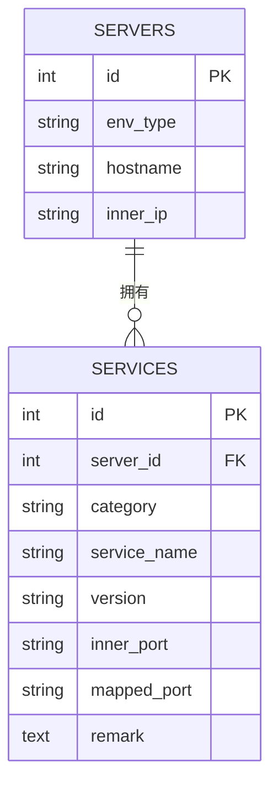
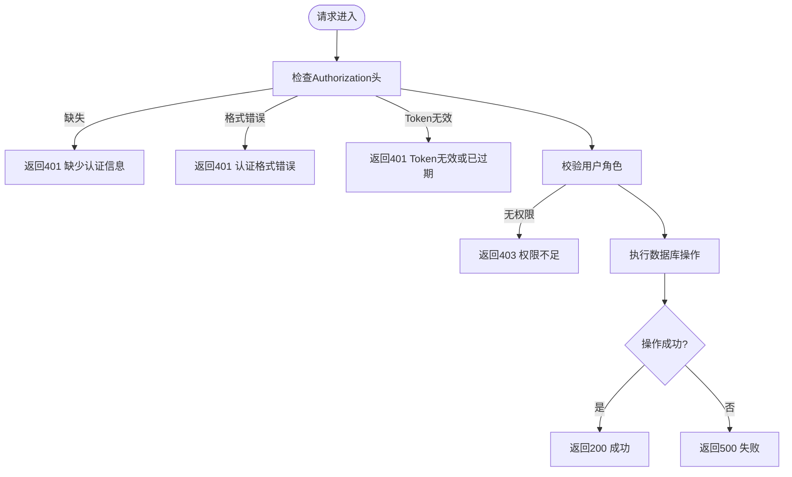
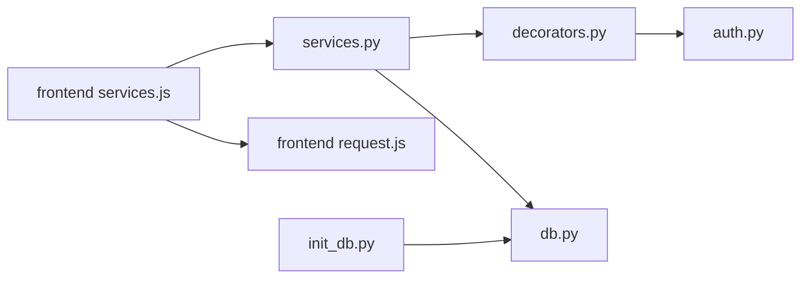

# 服务管理API

<cite>
**本文引用的文件**
- [backend/app/api/services.py](file://backend/app/api/services.py)
- [backend/app/api/servers.py](file://backend/app/api/servers.py)
- [backend/app/utils/db.py](file://backend/app/utils/db.py)
- [backend/app/utils/decorators.py](file://backend/app/utils/decorators.py)
- [backend/app/utils/auth.py](file://backend/app/utils/auth.py)
- [backend/app/config.py](file://backend/app/config.py)
- [backend/init_db.py](file://backend/init_db.py)
- [frontend/src/api/services.js](file://frontend/src/api/services.js)
- [frontend/src/views/Services.vue](file://frontend/src/views/Services.vue)
- [frontend/src/api/request.js](file://frontend/src/api/request.js)
- [backend/run.py](file://backend/run.py)
</cite>

## 目录
1. [简介](#简介)
2. [项目结构](#项目结构)
3. [核心组件](#核心组件)
4. [架构总览](#架构总览)
5. [详细组件分析](#详细组件分析)
6. [依赖分析](#依赖分析)
7. [性能考虑](#性能考虑)
8. [故障排查指南](#故障排查指南)
9. [结论](#结论)
10. [附录](#附录)

## 简介
本文件面向运维平台的服务管理模块，提供服务CRUD接口的完整文档，涵盖服务列表查询、详情获取、创建、更新、删除等能力；解释核心字段及其含义；说明服务与服务器的关联关系、端口映射格式与规则；介绍健康检查与状态监控的配置思路；给出API使用示例与错误处理说明，并补充批量操作建议。

## 项目结构
后端采用Flask微服务风格，按功能划分蓝图；前端使用Vue + Element Plus构建管理界面；数据库初始化脚本定义了服务与服务器的数据表结构及索引。

**图表来源**
- [backend/run.py:1-8](file://backend/run.py#L1-L8)
- [backend/app/config.py:1-21](file://backend/app/config.py#L1-L21)
- [backend/app/api/services.py:1-144](file://backend/app/api/services.py#L1-L144)
- [backend/app/api/servers.py:1-203](file://backend/app/api/servers.py#L1-L203)
- [backend/app/utils/decorators.py:1-95](file://backend/app/utils/decorators.py#L1-L95)
- [backend/app/utils/auth.py:1-83](file://backend/app/utils/auth.py#L1-L83)
- [backend/app/utils/db.py:1-17](file://backend/app/utils/db.py#L1-L17)
- [backend/init_db.py:75-92](file://backend/init_db.py#L75-L92)
- [frontend/src/api/services.js:1-18](file://frontend/src/api/services.js#L1-L18)
- [frontend/src/views/Services.vue:1-261](file://frontend/src/views/Services.vue#L1-L261)
- [frontend/src/api/request.js:1-54](file://frontend/src/api/request.js#L1-L54)

**章节来源**
- [backend/run.py:1-8](file://backend/run.py#L1-L8)
- [backend/app/config.py:1-21](file://backend/app/config.py#L1-L21)
- [backend/app/api/services.py:1-144](file://backend/app/api/services.py#L1-L144)
- [backend/app/api/servers.py:1-203](file://backend/app/api/servers.py#L1-L203)
- [backend/app/utils/decorators.py:1-95](file://backend/app/utils/decorators.py#L1-L95)
- [backend/app/utils/auth.py:1-83](file://backend/app/utils/auth.py#L1-L83)
- [backend/app/utils/db.py:1-17](file://backend/app/utils/db.py#L1-L17)
- [backend/init_db.py:75-92](file://backend/init_db.py#L75-L92)
- [frontend/src/api/services.js:1-18](file://frontend/src/api/services.js#L1-L18)
- [frontend/src/views/Services.vue:1-261](file://frontend/src/views/Services.vue#L1-L261)
- [frontend/src/api/request.js:1-54](file://frontend/src/api/request.js#L1-L54)

## 核心组件
- 服务管理蓝图：提供服务的CRUD接口，支持分页与过滤查询，返回统一JSON结构。
- 权限控制：基于JWT认证与角色授权，限制创建/更新/删除操作仅管理员与操作员可用。
- 数据库层：通过pymysql连接MySQL，使用DictCursor便于字典化结果。
- 前端API封装：统一前缀“/api”，自动注入Authorization头，统一封装响应错误。
- 数据模型：服务表与服务器表存在外键关联，服务表包含端口映射字段。

**章节来源**
- [backend/app/api/services.py:11-144](file://backend/app/api/services.py#L11-L144)
- [backend/app/utils/decorators.py:9-95](file://backend/app/utils/decorators.py#L9-L95)
- [backend/app/utils/db.py:5-17](file://backend/app/utils/db.py#L5-L17)
- [frontend/src/api/services.js:1-18](file://frontend/src/api/services.js#L1-L18)
- [backend/init_db.py:75-92](file://backend/init_db.py#L75-L92)

## 架构总览
服务管理API遵循REST风格，统一由Flask蓝图暴露，前端通过Axios发起请求，后端通过装饰器进行鉴权与权限校验，最终访问MySQL数据库。

**图表来源**
- [frontend/src/views/Services.vue:114-235](file://frontend/src/views/Services.vue#L114-L235)
- [frontend/src/api/services.js:1-18](file://frontend/src/api/services.js#L1-L18)
- [frontend/src/api/request.js:13-51](file://frontend/src/api/request.js#L13-L51)
- [backend/app/api/services.py:11-144](file://backend/app/api/services.py#L11-L144)
- [backend/app/utils/decorators.py:9-95](file://backend/app/utils/decorators.py#L9-L95)
- [backend/app/utils/auth.py:38-56](file://backend/app/utils/auth.py#L38-L56)
- [backend/app/utils/db.py:5-17](file://backend/app/utils/db.py#L5-L17)

## 详细组件分析

### 服务CRUD接口定义
- 获取服务列表
  - 方法：GET
  - 路径：/api/services
  - 查询参数：search（服务名或版本模糊匹配）、category（服务分类）
  - 排序：按环境类型、服务器内网IP、分类、服务名排序
  - 关联查询：JOIN服务器表，返回服务与服务器的组合字段
- 创建服务
  - 方法：POST
  - 路径：/api/services
  - 请求体字段：server_id、category、service_name、version、inner_port、mapped_port、remark
  - 权限：admin、operator
- 更新服务
  - 方法：PUT
  - 路径：/api/services/{service_id}
  - 请求体字段：可选server_id、category、service_name、version、inner_port、mapped_port、remark
  - 权限：admin、operator
- 删除服务
  - 方法：DELETE
  - 路径：/api/services/{service_id}
  - 权限：admin、operator

返回约定
- 成功：code=200，data包含业务数据
- 失败：code非200，message包含错误信息

**章节来源**
- [backend/app/api/services.py:11-144](file://backend/app/api/services.py#L11-L144)

### 核心字段说明
- server_id：所属服务器ID，与服务器表主键关联
- service_name：服务名称（必填）
- category：服务分类（如数据库、中间件、Web服务、缓存、消息队列、其他）
- version：版本号
- inner_port：容器/进程监听的内部端口（字符串）
- mapped_port：对外映射端口（字符串）
- remark：备注
- created_at/updated_at：自动维护的时间戳

字段与表结构对应关系见数据库初始化脚本。

**章节来源**
- [backend/init_db.py:75-92](file://backend/init_db.py#L75-L92)
- [backend/app/api/services.py:59-65](file://backend/app/api/services.py#L59-L65)
- [backend/app/api/services.py:94-102](file://backend/app/api/services.py#L94-L102)

### 服务与服务器的关联关系
- 服务表通过server_id外键关联服务器表
- 服务器详情接口会返回该服务器下的服务列表
- 列表查询时JOIN服务器表，便于展示服务器主机名、内网IP、环境类型等

**图表来源**
- [backend/init_db.py:67-92](file://backend/init_db.py#L67-L92)
- [backend/app/api/servers.py:46-78](file://backend/app/api/servers.py#L46-L78)

**章节来源**
- [backend/init_db.py:67-92](file://backend/init_db.py#L67-L92)
- [backend/app/api/servers.py:46-78](file://backend/app/api/servers.py#L46-L78)

### 端口映射格式与规则
- 字段类型：VARCHAR(200)，存储字符串形式的端口
- 建议格式：
  - 单端口：例如 "8080"
  - 多端口：例如 "8080,8443"（以逗号分隔）
  - 范围端口：例如 "30000-32767"（根据实际需求约定）
- 前端界面分别提供“内部端口”和“映射端口”的输入框，便于录入
- 健康检查与状态监控可结合映射端口进行探测

**章节来源**
- [backend/init_db.py:83-84](file://backend/init_db.py#L83-L84)
- [frontend/src/views/Services.vue:90-101](file://frontend/src/views/Services.vue#L90-L101)

### 健康检查与状态监控配置
- 当前服务管理API未内置健康检查URL字段与状态字段
- 建议扩展方向：
  - 在服务表增加health_check_url与status字段
  - 增加定时任务或外部探针定期探测mapped_port端口
  - 将探测结果写回status字段，前端展示服务运行状态
- 本节为概念性建议，不直接对应现有代码实现

[本节为概念性内容，无需“章节来源”]

### 批量操作接口
- 当前服务管理API未提供批量创建/更新/删除接口
- 建议方案：
  - 批量创建：接收数组，逐条插入并返回汇总结果
  - 批量更新：接收数组，逐条更新并返回汇总结果
  - 批量删除：接收ID数组，逐条删除并返回汇总结果
- 本节为概念性建议，不直接对应现有代码实现

[本节为概念性内容，无需“章节来源”]

### API使用示例
- 获取服务列表
  - 请求：GET /api/services?category=数据库&search=MySQL
  - 响应：code=200，data为服务数组（包含服务器字段）
- 创建服务
  - 请求：POST /api/services
  - 请求体：包含server_id、category、service_name、version、inner_port、mapped_port、remark
  - 响应：code=200，message为“创建成功”，data包含新插入记录的id
- 更新服务
  - 请求：PUT /api/services/{service_id}
  - 请求体：可包含上述任一字段
  - 响应：code=200，message为“更新成功”
- 删除服务
  - 请求：DELETE /api/services/{service_id}
  - 响应：code=200，message为“删除成功”

注意：以上示例为调用方式说明，具体字段请参考“核心字段说明”。

**章节来源**
- [backend/app/api/services.py:11-144](file://backend/app/api/services.py#L11-L144)
- [frontend/src/views/Services.vue:156-235](file://frontend/src/views/Services.vue#L156-L235)

### 错误处理说明
- 认证失败：缺少或无效的Authorization头、Token过期或无效
- 权限不足：当前用户角色不在允许列表（admin、operator）
- 数据库异常：插入/更新/删除失败时回滚并返回500与错误信息
- 前端统一错误处理：响应拦截器对非200的code进行提示，并在401时跳转登录

**图表来源**
- [backend/app/utils/decorators.py:20-56](file://backend/app/utils/decorators.py#L20-L56)
- [backend/app/utils/decorators.py:75-91](file://backend/app/utils/decorators.py#L75-L91)
- [backend/app/api/services.py:72-78](file://backend/app/api/services.py#L72-L78)
- [backend/app/api/services.py:108-114](file://backend/app/api/services.py#L108-L114)
- [backend/app/api/services.py:135-141](file://backend/app/api/services.py#L135-L141)
- [frontend/src/api/request.js:25-51](file://frontend/src/api/request.js#L25-L51)

**章节来源**
- [backend/app/utils/decorators.py:20-91](file://backend/app/utils/decorators.py#L20-L91)
- [backend/app/api/services.py:72-141](file://backend/app/api/services.py#L72-L141)
- [frontend/src/api/request.js:25-51](file://frontend/src/api/request.js#L25-L51)

## 依赖分析
- 服务蓝图依赖权限装饰器与数据库连接
- 权限装饰器依赖JWT工具进行token校验
- 前端API封装依赖Axios与路由，统一注入Authorization头
- 数据库初始化脚本定义了服务与服务器表结构及外键约束

**图表来源**
- [backend/app/api/services.py:4-8](file://backend/app/api/services.py#L4-L8)
- [backend/app/utils/decorators.py:1-7](file://backend/app/utils/decorators.py#L1-L7)
- [backend/app/utils/auth.py:1-8](file://backend/app/utils/auth.py#L1-L8)
- [frontend/src/api/services.js:1](file://frontend/src/api/services.js#L1)
- [frontend/src/api/request.js:14-23](file://frontend/src/api/request.js#L14-L23)
- [backend/init_db.py:75-92](file://backend/init_db.py#L75-L92)

**章节来源**
- [backend/app/api/services.py:4-8](file://backend/app/api/services.py#L4-L8)
- [backend/app/utils/decorators.py:1-7](file://backend/app/utils/decorators.py#L1-L7)
- [backend/app/utils/auth.py:1-8](file://backend/app/utils/auth.py#L1-L8)
- [frontend/src/api/services.js:1](file://frontend/src/api/services.js#L1)
- [frontend/src/api/request.js:14-23](file://frontend/src/api/request.js#L14-L23)
- [backend/init_db.py:75-92](file://backend/init_db.py#L75-L92)

## 性能考虑
- 查询优化：服务列表查询包含JOIN服务器表与多条件过滤，建议确保服务表的server_id与service_name索引有效
- 分页建议：当前未实现分页参数，可在查询参数中增加page与limit，避免一次性返回大量数据
- 连接池：当前每次请求新建连接，建议引入连接池以降低连接开销
- 前端渲染：大数据量时建议虚拟滚动与懒加载

[本节提供通用建议，无需“章节来源”]

## 故障排查指南
- 401 未认证
  - 检查请求头Authorization是否为Bearer token
  - 检查本地存储token是否过期
- 403 权限不足
  - 确认当前用户角色是否包含admin或operator
- 500 服务器内部错误
  - 查看后端日志定位数据库异常
  - 确认请求体字段与数据库字段一致
- 前端错误提示
  - 统一通过Element Plus消息提示显示错误信息

**章节来源**
- [frontend/src/api/request.js:25-51](file://frontend/src/api/request.js#L25-L51)
- [backend/app/utils/decorators.py:20-91](file://backend/app/utils/decorators.py#L20-L91)

## 结论
服务管理API提供了基础的CRUD能力与统一的鉴权机制，能够满足服务与服务器关联场景下的日常运维需求。建议后续扩展健康检查与状态监控、批量操作接口以及分页查询能力，以进一步提升系统的可观测性与易用性。

[本节为总结性内容，无需“章节来源”]

## 附录

### 前端集成要点
- 前端通过services.js封装服务管理接口，统一使用/requests.js的请求拦截器自动注入Authorization头
- Services.vue页面负责服务列表展示、搜索、新增/编辑弹窗与删除确认

**章节来源**
- [frontend/src/api/services.js:1-18](file://frontend/src/api/services.js#L1-L18)
- [frontend/src/views/Services.vue:114-235](file://frontend/src/views/Services.vue#L114-L235)
- [frontend/src/api/request.js:13-23](file://frontend/src/api/request.js#L13-L23)

### 后端配置与部署
- 应用入口run.py读取配置类Config，设置主机、端口、调试模式
- 配置类提供数据库连接参数与JWT密钥等

**章节来源**
- [backend/run.py:1-8](file://backend/run.py#L1-L8)
- [backend/app/config.py:4-21](file://backend/app/config.py#L4-L21)