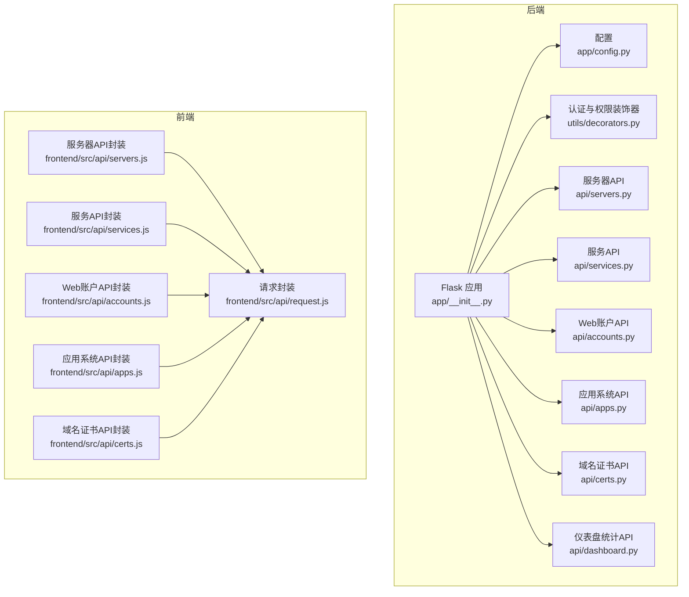
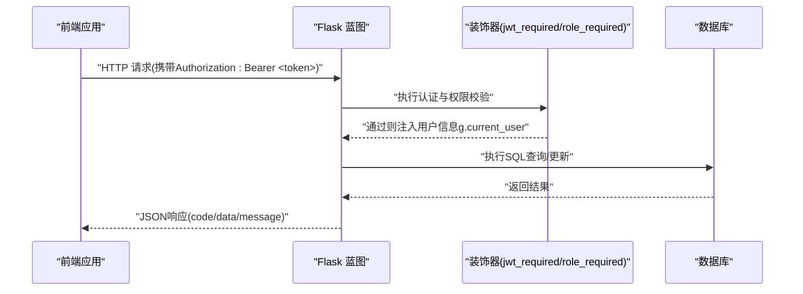
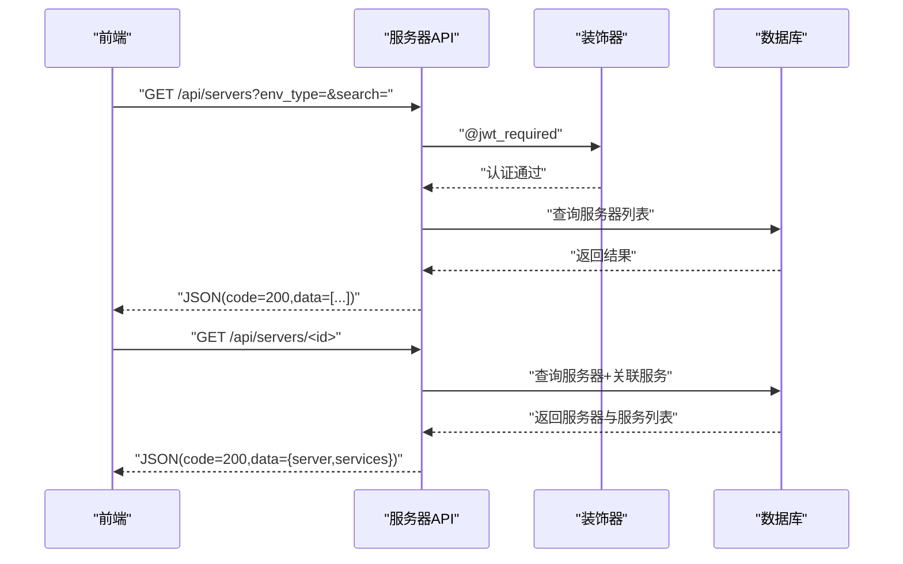
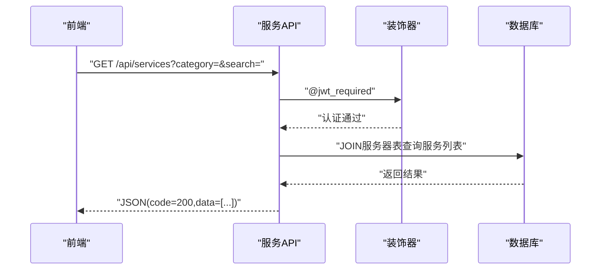
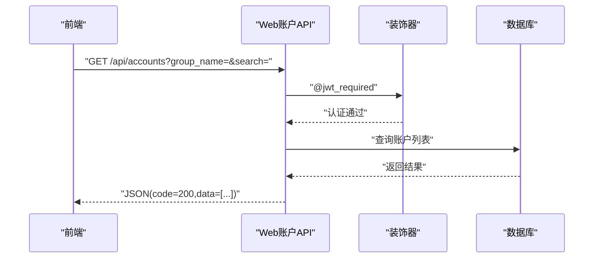
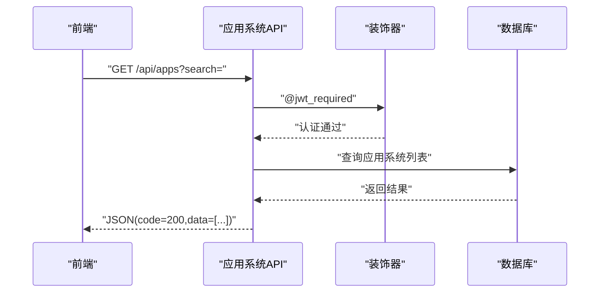
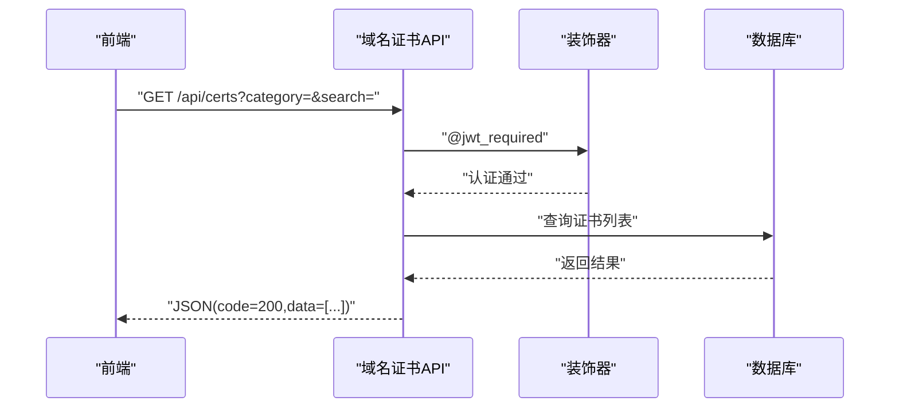
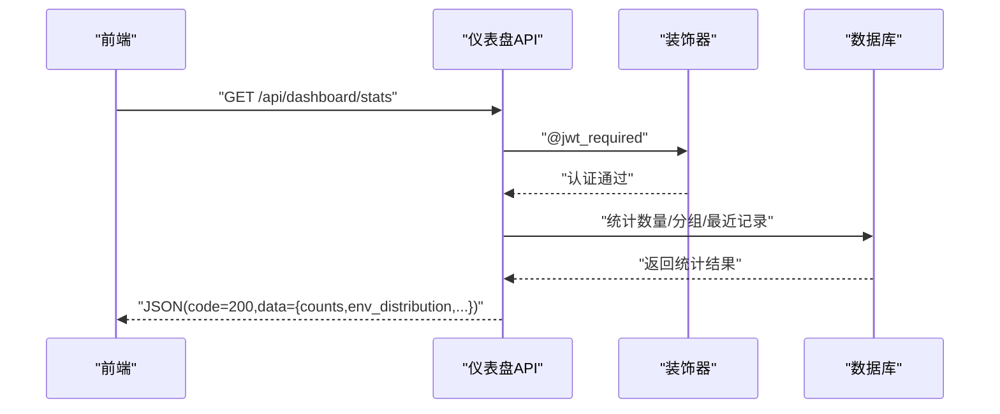
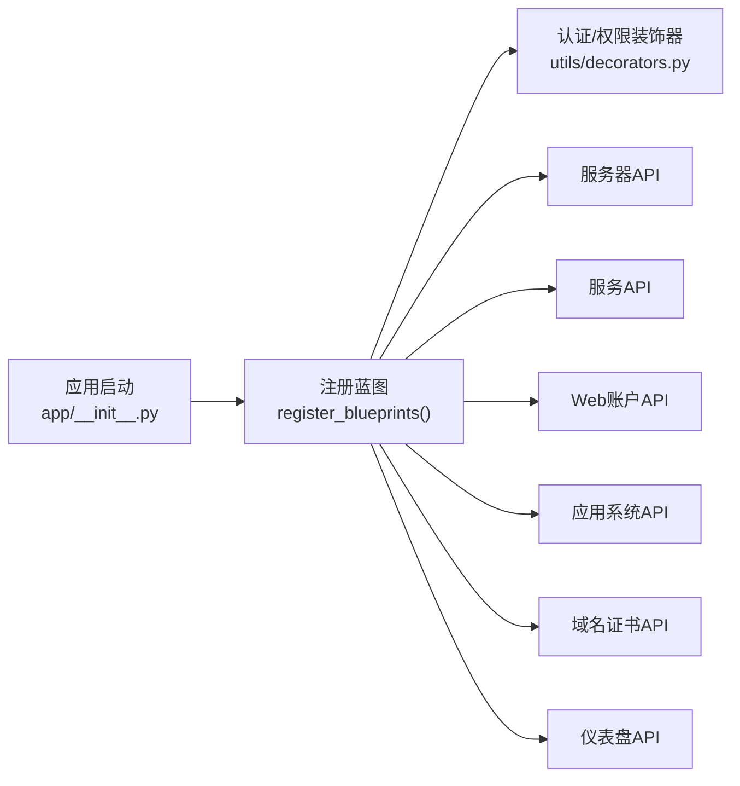

# 资产管理API

<cite>
**本文档引用的文件**
- [backend/app/api/servers.py](file://backend/app/api/servers.py)
- [backend/app/api/services.py](file://backend/app/api/services.py)
- [backend/app/api/accounts.py](file://backend/app/api/accounts.py)
- [backend/app/api/apps.py](file://backend/app/api/apps.py)
- [backend/app/api/certs.py](file://backend/app/api/certs.py)
- [backend/app/api/dashboard.py](file://backend/app/api/dashboard.py)
- [backend/app/utils/decorators.py](file://backend/app/utils/decorators.py)
- [backend/app/__init__.py](file://backend/app/__init__.py)
- [backend/app/config.py](file://backend/app/config.py)
- [backend/run.py](file://backend/run.py)
- [frontend/src/api/servers.js](file://frontend/src/api/servers.js)
- [frontend/src/api/services.js](file://frontend/src/api/services.js)
- [frontend/src/api/accounts.js](file://frontend/src/api/accounts.js)
- [frontend/src/api/apps.js](file://frontend/src/api/apps.js)
- [frontend/src/api/certs.js](file://frontend/src/api/certs.js)
</cite>

## 目录
1. [简介](#简介)
2. [项目结构](#项目结构)
3. [核心组件](#核心组件)
4. [架构总览](#架构总览)
5. [详细组件分析](#详细组件分析)
6. [依赖关系分析](#依赖关系分析)
7. [性能考虑](#性能考虑)
8. [故障排除指南](#故障排除指南)
9. [结论](#结论)
10. [附录](#附录)

## 简介
本文件为资产管理API的完整技术文档，覆盖服务器、服务、Web账户、应用系统、域名证书等运维资产的管理接口。文档详细说明各类资产的CRUD操作、查询过滤、批量管理能力与状态监控功能；同时解释服务器硬件信息、运行状态、IP地址等字段的接口说明；服务管理的端口映射、服务分类、健康检查机制；Web账户管理的登录凭证、权限范围、安全等级；应用系统管理的架构信息、部署状态、访问日志；以及域名证书管理的到期提醒、续期流程、状态监控等接口。面向运维人员提供可直接使用的API使用指南。

## 项目结构
后端采用Flask微服务架构，通过蓝图组织各模块API；前端通过独立的API封装文件调用后端接口；统一的认证与权限装饰器保障接口安全；配置集中管理数据库连接与运行参数。

图表来源
- [backend/app/__init__.py:37-62](file://backend/app/__init__.py#L37-L62)
- [backend/app/config.py:1-21](file://backend/app/config.py#L1-L21)
- [backend/app/utils/decorators.py:9-95](file://backend/app/utils/decorators.py#L9-L95)
- [backend/app/api/servers.py:8](file://backend/app/api/servers.py#L8)
- [backend/app/api/services.py:8](file://backend/app/api/services.py#L8)
- [backend/app/api/accounts.py:8](file://backend/app/api/accounts.py#L8)
- [backend/app/api/apps.py:8](file://backend/app/api/apps.py#L8)
- [backend/app/api/certs.py:8](file://backend/app/api/certs.py#L8)
- [backend/app/api/dashboard.py:9](file://backend/app/api/dashboard.py#L9)
- [frontend/src/api/servers.js:1-26](file://frontend/src/api/servers.js#L1-L26)
- [frontend/src/api/services.js:1-18](file://frontend/src/api/services.js#L1-L18)
- [frontend/src/api/accounts.js:1-18](file://frontend/src/api/accounts.js#L1-L18)
- [frontend/src/api/apps.js:1-18](file://frontend/src/api/apps.js#L1-L18)
- [frontend/src/api/certs.js:1-18](file://frontend/src/api/certs.js#L1-L18)

章节来源
- [backend/app/__init__.py:37-62](file://backend/app/__init__.py#L37-L62)
- [backend/app/config.py:1-21](file://backend/app/config.py#L1-L21)

## 核心组件
- 认证与权限装饰器：提供JWT认证与角色权限控制，确保API访问安全。
- 服务器管理：支持按环境类型与关键词搜索、详情联动服务列表、全量字段的增删改查。
- 服务管理：支持按分类与关键词搜索、端口映射与版本信息维护、跨服务器关联。
- Web账户管理：支持分组与关键词搜索、凭证存储与备注管理。
- 应用系统管理：支持应用信息与架构描述、访问入口与凭据、扩展字段与更新时间。
- 域名证书管理：支持分类与关键词搜索、购买与到期日期、剩余天数与状态监控。
- 仪表盘统计：提供资产数量、环境分布、最近变更与证书状态概览。

章节来源
- [backend/app/utils/decorators.py:9-95](file://backend/app/utils/decorators.py#L9-L95)
- [backend/app/api/servers.py:11-203](file://backend/app/api/servers.py#L11-L203)
- [backend/app/api/services.py:11-144](file://backend/app/api/services.py#L11-L144)
- [backend/app/api/accounts.py:11-141](file://backend/app/api/accounts.py#L11-L141)
- [backend/app/api/apps.py:11-141](file://backend/app/api/apps.py#L11-L141)
- [backend/app/api/certs.py:11-145](file://backend/app/api/certs.py#L11-L145)
- [backend/app/api/dashboard.py:20-86](file://backend/app/api/dashboard.py#L20-L86)

## 架构总览
后端通过蓝图注册各API模块，统一CORS跨域策略，全局中间件由装饰器实现认证与鉴权。前端通过独立API封装文件调用后端接口，请求头携带JWT Bearer Token。

图表来源
- [backend/app/utils/decorators.py:9-95](file://backend/app/utils/decorators.py#L9-L95)
- [backend/app/__init__.py:24-34](file://backend/app/__init__.py#L24-L34)
- [backend/app/api/servers.py:12](file://backend/app/api/servers.py#L12)
- [backend/app/api/services.py:12](file://backend/app/api/services.py#L12)
- [backend/app/api/accounts.py:12](file://backend/app/api/accounts.py#L12)
- [backend/app/api/apps.py:12](file://backend/app/api/apps.py#L12)
- [backend/app/api/certs.py:12](file://backend/app/api/certs.py#L12)

## 详细组件分析

### 服务器管理API
- 接口路径前缀：/api/servers
- 关键能力
  - 列表查询：支持按环境类型与关键词搜索主机名/内网IP/平台
  - 详情查询：返回服务器基础信息及关联服务列表
  - 下拉列表：返回简要服务器信息用于选择
  - 新增/修改/删除：支持全字段写入与条件更新，需管理员或操作员角色
- 字段说明（示例）
  - 环境类型、平台、主机名、内网IP、映射IP、公网IP、CPU、内存、系统盘、数据盘、用途、操作系统用户名、操作系统密码、Docker密码、备注
- 安全要求
  - 所有接口需JWT认证
  - 新增/修改/删除需管理员或操作员角色

图表来源
- [backend/app/api/servers.py:11-78](file://backend/app/api/servers.py#L11-L78)
- [backend/app/utils/decorators.py:9-95](file://backend/app/utils/decorators.py#L9-L95)

章节来源
- [backend/app/api/servers.py:11-203](file://backend/app/api/servers.py#L11-L203)
- [frontend/src/api/servers.js:1-26](file://frontend/src/api/servers.js#L1-L26)

### 服务管理API
- 接口路径前缀：/api/services
- 关键能力
  - 列表查询：支持按分类与关键词搜索服务名/版本
  - 新增/修改/删除：支持服务分类、名称、版本、内端口、映射端口、备注等字段
- 字段说明（示例）
  - 分类、服务名称、版本、内端口、映射端口、备注
- 安全要求
  - 所有接口需JWT认证
  - 新增/修改/删除需管理员或操作员角色

图表来源
- [backend/app/api/services.py:11-46](file://backend/app/api/services.py#L11-L46)
- [backend/app/utils/decorators.py:9-95](file://backend/app/utils/decorators.py#L9-L95)

章节来源
- [backend/app/api/services.py:11-144](file://backend/app/api/services.py#L11-L144)
- [frontend/src/api/services.js:1-18](file://frontend/src/api/services.js#L1-L18)

### Web账户管理API
- 接口路径前缀：/api/accounts
- 关键能力
  - 列表查询：支持按分组与关键词搜索名称/URL/用户名
  - 新增/修改/删除：支持分组、名称、URL、用户名、密码、备注
- 字段说明（示例）
  - 分组名称、账户名称、访问URL、用户名、密码、备注
- 安全要求
  - 所有接口需JWT认证
  - 新增/修改/删除需管理员或操作员角色

图表来源
- [backend/app/api/accounts.py:11-43](file://backend/app/api/accounts.py#L11-L43)
- [backend/app/utils/decorators.py:9-95](file://backend/app/utils/decorators.py#L9-L95)

章节来源
- [backend/app/api/accounts.py:11-141](file://backend/app/api/accounts.py#L11-L141)
- [frontend/src/api/accounts.js:1-18](file://frontend/src/api/accounts.js#L1-L18)

### 应用系统管理API
- 接口路径前缀：/api/apps
- 关键能力
  - 列表查询：支持按关键词搜索名称/公司/访问信息
  - 新增/修改/删除：支持序号、名称、公司、架构、访问信息、用户名、密码、备注、更新时间、扩展字段
- 字段说明（示例）
  - 序号、名称、公司、架构、访问信息、用户名、密码、备注、更新时间、扩展字段1、扩展字段2
- 安全要求
  - 所有接口需JWT认证
  - 新增/修改/删除需管理员或操作员角色

图表来源
- [backend/app/api/apps.py:11-39](file://backend/app/api/apps.py#L11-L39)
- [backend/app/utils/decorators.py:9-95](file://backend/app/utils/decorators.py#L9-L95)

章节来源
- [backend/app/api/apps.py:11-141](file://backend/app/api/apps.py#L11-L141)
- [frontend/src/api/apps.js:1-18](file://frontend/src/api/apps.js#L1-L18)

### 域名证书管理API
- 接口路径前缀：/api/certs
- 关键能力
  - 列表查询：支持按分类与关键词搜索项目/主体
  - 新增/修改/删除：支持序号、分类、项目、主体、购买日期、到期日期、成本、剩余天数、品牌、状态、备注
- 字段说明（示例）
  - 分类、项目、主体、购买日期、到期日期、成本、剩余天数、品牌、状态、备注
- 安全要求
  - 所有接口需JWT认证
  - 新增/修改/删除需管理员或操作员角色

图表来源
- [backend/app/api/certs.py:11-43](file://backend/app/api/certs.py#L11-L43)
- [backend/app/utils/decorators.py:9-95](file://backend/app/utils/decorators.py#L9-L95)

章节来源
- [backend/app/api/certs.py:11-145](file://backend/app/api/certs.py#L11-L145)
- [frontend/src/api/certs.js:1-18](file://frontend/src/api/certs.js#L1-L18)

### 仪表盘统计API
- 接口路径前缀：/api/dashboard
- 关键能力
  - 统计各资产数量（服务器、服务、账户、应用、证书、变更记录）
  - 按环境类型统计服务器分布
  - 最近更新记录（序列号非空）
  - 使用中的最近域名证书
- 输出字段
  - counts: 各类资产数量
  - env_distribution: 环境分布
  - recent_certs: 使用中的最近证书
  - recent_records: 最近变更记录

图表来源
- [backend/app/api/dashboard.py:20-86](file://backend/app/api/dashboard.py#L20-L86)
- [backend/app/utils/decorators.py:9-95](file://backend/app/utils/decorators.py#L9-L95)

章节来源
- [backend/app/api/dashboard.py:20-86](file://backend/app/api/dashboard.py#L20-L86)

## 依赖关系分析
- 蓝图注册：应用启动时统一注册所有API蓝图，包括认证、用户、导出、任务、服务器、服务、Web账户、应用系统、域名证书、变更记录、仪表盘。
- 认证链路：所有业务API均依赖装饰器进行JWT认证与角色校验，确保接口安全。
- 前后端交互：前端通过独立API封装文件调用后端接口，请求头携带Authorization: Bearer <token>。

图表来源
- [backend/app/__init__.py:37-62](file://backend/app/__init__.py#L37-L62)
- [backend/app/utils/decorators.py:9-95](file://backend/app/utils/decorators.py#L9-L95)

章节来源
- [backend/app/__init__.py:37-62](file://backend/app/__init__.py#L37-L62)

## 性能考虑
- 查询优化
  - 列表查询支持关键词与分类过滤，建议在高频字段建立索引以提升检索效率。
  - 服务查询通过JOIN服务器表，建议对关联字段建立索引。
- 连接管理
  - API内部使用数据库游标与连接，确保finally块关闭游标与连接，避免资源泄漏。
- 缓存建议
  - 对常用下拉列表（如服务器简要信息）可考虑短期缓存以降低数据库压力。
- 并发与限流
  - 建议在网关层引入限流策略，防止突发高并发导致数据库抖动。

## 故障排除指南
- 认证失败
  - 现象：返回401，提示缺少认证信息或Token无效。
  - 处理：确认请求头Authorization格式为Bearer <token>，且Token未过期。
- 权限不足
  - 现象：返回403，提示需要特定角色。
  - 处理：确认用户角色在允许范围内（管理员/操作员），或联系管理员调整角色。
- 数据库异常
  - 现象：新增/修改/删除返回500，提示事务回滚。
  - 处理：检查请求参数完整性与字段类型，确认数据库连接正常。
- 前端调用问题
  - 现象：跨域失败或接口不可达。
  - 处理：确认后端CORS配置允许前端源，后端服务已启动且端口正确。

章节来源
- [backend/app/utils/decorators.py:22-46](file://backend/app/utils/decorators.py#L22-L46)
- [backend/app/api/servers.py:128-133](file://backend/app/api/servers.py#L128-L133)
- [backend/app/api/services.py:72-77](file://backend/app/api/services.py#L72-L77)
- [backend/app/api/accounts.py:69-74](file://backend/app/api/accounts.py#L69-L74)
- [backend/app/api/apps.py:68-73](file://backend/app/api/apps.py#L68-L73)
- [backend/app/api/certs.py:72-77](file://backend/app/api/certs.py#L72-L77)

## 结论
本资产管理API体系覆盖服务器、服务、Web账户、应用系统、域名证书等核心运维资产，提供完善的CRUD与查询能力，并通过JWT认证与角色权限保障安全性。结合仪表盘统计，可实现资产全生命周期管理与可视化监控。建议在生产环境中完善数据库索引、接入限流与缓存策略，并持续优化前端调用与错误处理体验。

## 附录
- 运行与配置
  - 应用启动：通过运行脚本启动Flask应用，默认监听配置中的HOST与PORT。
  - 环境变量：可通过环境变量设置数据库连接、JWT密钥、调试模式等。
- 前端调用
  - 前端通过独立API封装文件调用后端接口，请求头携带Authorization: Bearer <token>。

章节来源
- [backend/run.py:1-8](file://backend/run.py#L1-L8)
- [backend/app/config.py:4-21](file://backend/app/config.py#L4-L21)
- [frontend/src/api/servers.js:1-26](file://frontend/src/api/servers.js#L1-L26)
- [frontend/src/api/services.js:1-18](file://frontend/src/api/services.js#L1-L18)
- [frontend/src/api/accounts.js:1-18](file://frontend/src/api/accounts.js#L1-L18)
- [frontend/src/api/apps.js:1-18](file://frontend/src/api/apps.js#L1-L18)
- [frontend/src/api/certs.js:1-18](file://frontend/src/api/certs.js#L1-L18)