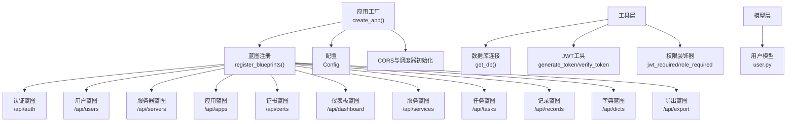
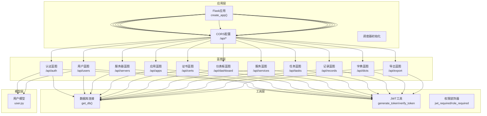
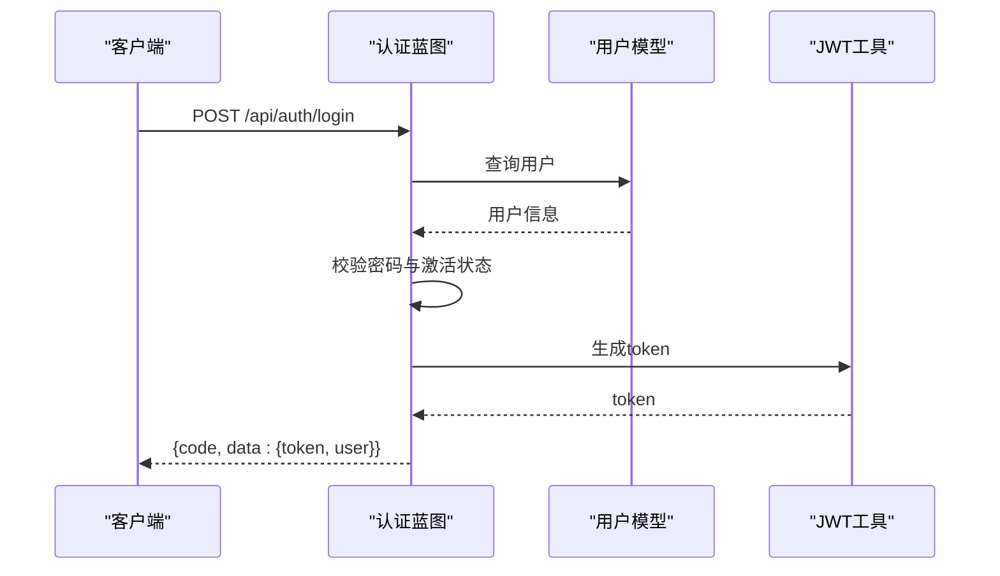
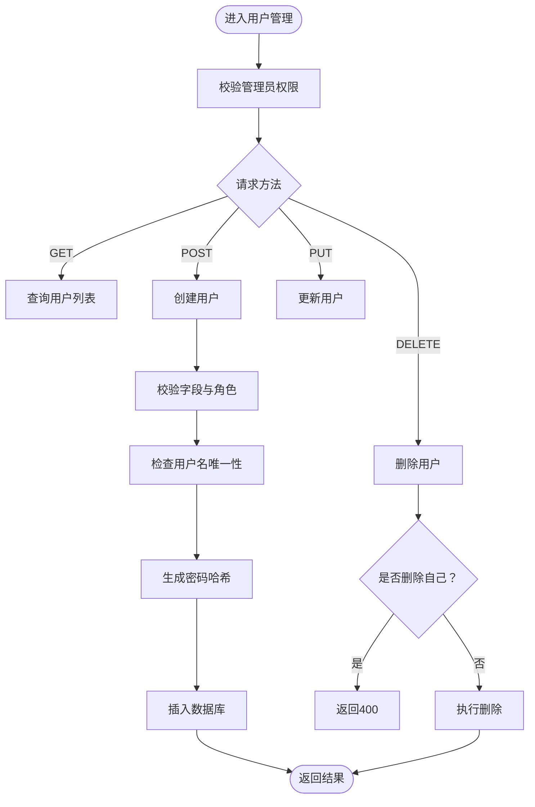
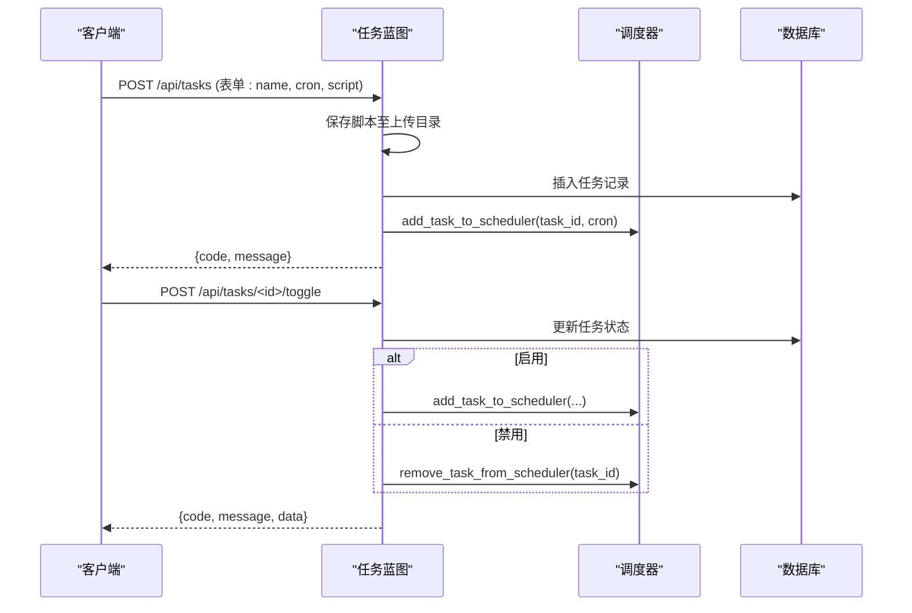
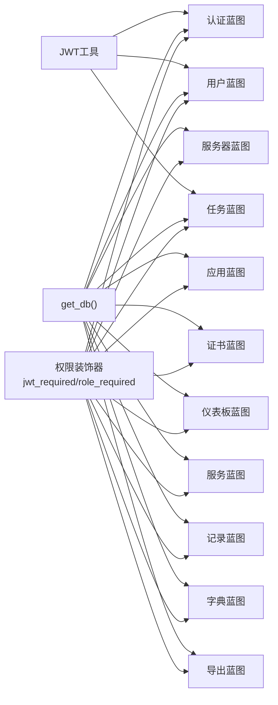

# API蓝图组织

<cite>
**本文引用的文件**
- [backend/app/__init__.py](file://backend/app/__init__.py)
- [backend/app/config.py](file://backend/app/config.py)
- [backend/app/extensions.py](file://backend/app/extensions.py)
- [backend/app/utils/db.py](file://backend/app/utils/db.py)
- [backend/app/utils/auth.py](file://backend/app/utils/auth.py)
- [backend/app/utils/decorators.py](file://backend/app/utils/decorators.py)
- [backend/app/models/user.py](file://backend/app/models/user.py)
- [backend/app/api/auth.py](file://backend/app/api/auth.py)
- [backend/app/api/users.py](file://backend/app/api/users.py)
- [backend/app/api/servers.py](file://backend/app/api/servers.py)
- [backend/app/api/apps.py](file://backend/app/api/apps.py)
- [backend/app/api/certs.py](file://backend/app/api/certs.py)
- [backend/app/api/dashboard.py](file://backend/app/api/dashboard.py)
- [backend/app/api/services.py](file://backend/app/api/services.py)
- [backend/app/api/tasks.py](file://backend/app/api/tasks.py)
- [backend/app/api/records.py](file://backend/app/api/records.py)
- [backend/app/api/dicts.py](file://backend/app/api/dicts.py)
- [backend/app/api/export.py](file://backend/app/api/export.py)
</cite>

## 目录
1. [引言](#引言)
2. [项目结构](#项目结构)
3. [核心组件](#核心组件)
4. [架构总览](#架构总览)
5. [详细组件分析](#详细组件分析)
6. [依赖分析](#依赖分析)
7. [性能考虑](#性能考虑)
8. [故障排查指南](#故障排查指南)
9. [结论](#结论)
10. [附录](#附录)

## 引言
本文件面向云运维平台的API蓝图组织，系统性阐述基于Flask蓝图的模块化设计理念与实现方式，覆盖蓝图的创建、注册、路由组织与职责划分；详解认证、用户管理、服务器管理、应用管理、证书管理、仪表板、服务管理、定时任务、更新记录、字典管理、导出等模块的API设计；说明蓝图间依赖与共享资源访问机制；总结RESTful设计原则、状态码标准、版本管理策略、错误处理与文档生成机制，并给出蓝图扩展与代码组织的最佳实践。

## 项目结构
后端采用“蓝图+工具层+模型层”的分层组织：
- 应用入口与蓝图注册：在应用工厂中集中注册各功能蓝图，统一CORS与调度器初始化。
- 功能蓝图：每个API模块独立为一个Blueprint，统一前缀与鉴权装饰器。
- 工具层：数据库连接、JWT认证、权限装饰器、定时任务调度等。
- 模型层：用户模型封装数据库操作。
- 配置与扩展：集中配置与扩展初始化占位。

图表来源
- [backend/app/__init__.py:37-62](file://backend/app/__init__.py#L37-L62)
- [backend/app/api/auth.py:11](file://backend/app/api/auth.py#L11)
- [backend/app/api/users.py:14](file://backend/app/api/users.py#L14)
- [backend/app/api/servers.py:8](file://backend/app/api/servers.py#L8)
- [backend/app/api/apps.py:8](file://backend/app/api/apps.py#L8)
- [backend/app/api/certs.py:8](file://backend/app/api/certs.py#L8)
- [backend/app/api/dashboard.py:9](file://backend/app/api/dashboard.py#L9)
- [backend/app/api/services.py:8](file://backend/app/api/services.py#L8)
- [backend/app/api/tasks.py:15](file://backend/app/api/tasks.py#L15)
- [backend/app/api/records.py:9](file://backend/app/api/records.py#L9)
- [backend/app/api/dicts.py:8](file://backend/app/api/dicts.py#L8)
- [backend/app/api/export.py:9](file://backend/app/api/export.py#L9)
- [backend/app/utils/db.py:5-17](file://backend/app/utils/db.py#L5-L17)
- [backend/app/utils/auth.py:11-36](file://backend/app/utils/auth.py#L11-L36)
- [backend/app/utils/decorators.py:9-95](file://backend/app/utils/decorators.py#L9-L95)
- [backend/app/models/user.py:8-183](file://backend/app/models/user.py#L8-L183)

章节来源
- [backend/app/__init__.py:6-34](file://backend/app/__init__.py#L6-L34)
- [backend/app/__init__.py:37-62](file://backend/app/__init__.py#L37-L62)
- [backend/app/config.py:4-21](file://backend/app/config.py#L4-L21)

## 核心组件
- 应用工厂与蓝图注册
  - 应用工厂负责配置加载、CORS跨域、蓝图注册与调度器初始化。
  - 蓝图注册集中于register_blueprints，确保URL前缀与模块职责清晰。
- 权限与认证
  - JWT工具：生成与校验token，支持过期时间与密钥配置。
  - 权限装饰器：jwt_required注入g.current_user；role_required按角色放行。
- 数据库访问
  - 统一get_db()从配置读取连接参数，返回pymysql连接。
- 模型层
  - 用户模型封装用户增删改查与密码更新等数据库操作。

章节来源
- [backend/app/__init__.py:6-34](file://backend/app/__init__.py#L6-L34)
- [backend/app/__init__.py:37-62](file://backend/app/__init__.py#L37-L62)
- [backend/app/utils/auth.py:11-36](file://backend/app/utils/auth.py#L11-L36)
- [backend/app/utils/auth.py:38-56](file://backend/app/utils/auth.py#L38-L56)
- [backend/app/utils/decorators.py:9-95](file://backend/app/utils/decorators.py#L9-L95)
- [backend/app/utils/db.py:5-17](file://backend/app/utils/db.py#L5-L17)
- [backend/app/models/user.py:8-183](file://backend/app/models/user.py#L8-L183)

## 架构总览
蓝图以“模块即服务”的方式组织，每个模块拥有独立的url_prefix，统一通过装饰器实现鉴权与权限控制。共享资源（数据库连接、JWT密钥、CORS策略）由应用工厂集中配置，避免重复与不一致。

图表来源
- [backend/app/__init__.py:24-34](file://backend/app/__init__.py#L24-L34)
- [backend/app/__init__.py:37-62](file://backend/app/__init__.py#L37-L62)
- [backend/app/utils/auth.py:11-36](file://backend/app/utils/auth.py#L11-L36)
- [backend/app/utils/decorators.py:9-95](file://backend/app/utils/decorators.py#L9-L95)
- [backend/app/models/user.py:8-183](file://backend/app/models/user.py#L8-L183)
- [backend/app/utils/db.py:5-17](file://backend/app/utils/db.py#L5-L17)

## 详细组件分析

### 认证模块（/api/auth）
- 职责：登录、获取当前用户资料、修改密码。
- 设计要点：
  - 登录接口校验用户名、密码与账户激活状态，成功后签发JWT。
  - 个人资料接口通过jwt_required从g.current_user注入用户信息。
  - 修改密码接口校验旧密码，使用哈希更新。
- 错误处理：统一返回code/message结构，状态码遵循REST语义。

图表来源
- [backend/app/api/auth.py:14-82](file://backend/app/api/auth.py#L14-L82)
- [backend/app/models/user.py:39-58](file://backend/app/models/user.py#L39-L58)
- [backend/app/utils/auth.py:11-36](file://backend/app/utils/auth.py#L11-L36)

章节来源
- [backend/app/api/auth.py:14-184](file://backend/app/api/auth.py#L14-L184)
- [backend/app/models/user.py:39-58](file://backend/app/models/user.py#L39-L58)
- [backend/app/utils/auth.py:11-36](file://backend/app/utils/auth.py#L11-L36)

### 用户管理模块（/api/users）
- 职责：管理员维度的用户全量查询、创建、更新、删除、重置密码。
- 设计要点：
  - 所有接口需管理员角色，使用role_required。
  - 创建用户时校验字段、角色与唯一性，密码哈希存储。
  - 删除用户禁止自删，防止自我移除。
- 错误处理：400/404/409/500统一返回结构。

图表来源
- [backend/app/api/users.py:17-207](file://backend/app/api/users.py#L17-L207)

章节来源
- [backend/app/api/users.py:17-268](file://backend/app/api/users.py#L17-L268)

### 服务器管理模块（/api/servers）
- 职责：服务器列表查询、详情查询（含关联服务）、简要列表、创建、更新、删除。
- 设计要点：
  - 支持环境类型过滤、模糊搜索、分页参数校验与限制。
  - 详情接口联表查询关联服务列表。
  - 所有变更接口支持管理员与操作员角色。

章节来源
- [backend/app/api/servers.py:11-232](file://backend/app/api/servers.py#L11-L232)

### 应用管理模块（/api/apps）
- 职责：应用系统列表查询、创建、更新、删除。
- 设计要点：
  - 支持多字段搜索与分页。
  - 字段更新采用动态拼接SET子句，仅更新传入字段。

章节来源
- [backend/app/api/apps.py:11-168](file://backend/app/api/apps.py#L11-L168)

### 证书管理模块（/api/certs）
- 职责：域名证书列表查询、创建、更新、删除。
- 设计要点：
  - 支持分类与关键词过滤。
  - 字段更新采用动态拼接SET子句。

章节来源
- [backend/app/api/certs.py:11-145](file://backend/app/api/certs.py#L11-L145)

### 仪表板模块（/api/dashboard）
- 职责：统计服务器/服务/应用/证书/变更记录数量、环境分布、近期变更与证书到期提醒。
- 设计要点：
  - 统一序列化日期字段，便于前端展示。
  - 动态计算剩余天数并排序。

章节来源
- [backend/app/api/dashboard.py:20-91](file://backend/app/api/dashboard.py#L20-L91)

### 服务管理模块（/api/services）
- 职责：服务列表查询（支持多表联查与环境过滤）、创建、更新、删除。
- 设计要点：
  - 联动服务器表返回服务器相关信息。
  - 分页参数校验与限制。

章节来源
- [backend/app/api/services.py:11-182](file://backend/app/api/services.py#L11-L182)

### 定时任务模块（/api/tasks）
- 职责：任务列表、创建（含脚本上传）、更新（可替换脚本）、删除、启用/禁用、手动执行、查看日志。
- 设计要点：
  - 支持py/sh/sql脚本上传与安全命名。
  - 与调度器集成：新增/更新/启停时同步调度器。
  - 日志表记录执行状态、输出与错误信息。

图表来源
- [backend/app/api/tasks.py:63-306](file://backend/app/api/tasks.py#L63-L306)

章节来源
- [backend/app/api/tasks.py:18-458](file://backend/app/api/tasks.py#L18-L458)

### 更新记录模块（/api/records）
- 职责：变更记录列表查询、创建、删除。
- 设计要点：
  - 支持关键词搜索与倒序排列。
  - 日期字段序列化为字符串。

章节来源
- [backend/app/api/records.py:20-114](file://backend/app/api/records.py#L20-L114)

### 字典管理模块（/api/dicts）
- 职责：环境类型、平台、服务分类三类字典的增删改查。
- 设计要点：
  - 通用工具函数封装CRUD，减少重复逻辑。
  - 删除时可选检查关联数据，避免破坏完整性。

章节来源
- [backend/app/api/dicts.py:16-267](file://backend/app/api/dicts.py#L16-L267)

### 导出模块（/api/export）
- 职责：导出全部模块数据为Excel，包含服务器、服务、应用、证书四个Sheet。
- 设计要点：
  - 统一样式与列宽处理，安全值转换。
  - 内存流生成文件并以附件形式返回。

章节来源
- [backend/app/api/export.py:64-263](file://backend/app/api/export.py#L64-L263)

## 依赖分析
- 蓝图与装饰器
  - 所有受保护接口均使用jwt_required，部分接口再叠加role_required。
  - 装饰器从Authorization头解析Bearer token，校验失败直接返回401。
- 蓝图与工具层
  - 所有蓝图通过get_db()获取数据库连接，统一配置参数。
  - 认证蓝图与用户蓝图依赖用户模型完成用户查询与密码更新。
- 蓝图与调度器
  - 任务蓝图与调度器交互，实现任务启停与脚本执行。
- 蓝图与导出
  - 导出蓝图聚合多表数据，依赖数据库连接与样式库。

图表来源
- [backend/app/utils/decorators.py:9-95](file://backend/app/utils/decorators.py#L9-L95)
- [backend/app/utils/db.py:5-17](file://backend/app/utils/db.py#L5-L17)
- [backend/app/utils/auth.py:11-36](file://backend/app/utils/auth.py#L11-L36)
- [backend/app/api/tasks.py:8-13](file://backend/app/api/tasks.py#L8-L13)

章节来源
- [backend/app/utils/decorators.py:9-95](file://backend/app/utils/decorators.py#L9-L95)
- [backend/app/utils/db.py:5-17](file://backend/app/utils/db.py#L5-L17)
- [backend/app/utils/auth.py:11-36](file://backend/app/utils/auth.py#L11-L36)
- [backend/app/api/tasks.py:8-13](file://backend/app/api/tasks.py#L8-L13)

## 性能考虑
- 数据库连接
  - get_db()每次调用创建新连接，建议在蓝图内复用cursor与连接，避免频繁创建销毁。
- 分页与查询
  - 列表接口统一支持page/page_size，建议对高频查询建立必要索引（如服务器env_type、服务server_id等）。
- 导出性能
  - 导出模块一次性读取多表数据并写入内存，建议限制导出范围或分批处理。
- 调度器并发
  - 任务执行采用线程异步，注意脚本超时与异常捕获，避免阻塞主线程。

## 故障排查指南
- 认证失败
  - 缺少Authorization头或格式错误：返回401，提示Bearer token格式。
  - Token无效或过期：返回401，提示Token无效。
- 权限不足
  - 非管理员访问管理员接口：返回403，提示所需角色。
- 数据库异常
  - 插入/更新/删除失败：回滚事务并返回500，消息包含异常信息。
- 任务执行异常
  - 脚本文件不存在：返回400。
  - 手动执行失败：日志记录错误信息，状态标记failed。

章节来源
- [backend/app/utils/decorators.py:22-46](file://backend/app/utils/decorators.py#L22-L46)
- [backend/app/utils/decorators.py:76-89](file://backend/app/utils/decorators.py#L76-L89)
- [backend/app/api/tasks.py:325-327](file://backend/app/api/tasks.py#L325-L327)
- [backend/app/api/tasks.py:401-402](file://backend/app/api/tasks.py#L401-L402)

## 结论
本项目以Flask蓝图为核心，实现了高内聚、低耦合的API模块化组织。通过统一的JWT认证与权限装饰器、集中配置与数据库连接，保证了接口的一致性与可维护性。建议在后续迭代中引入API版本化策略、统一错误响应模板与OpenAPI/Swagger文档生成，进一步提升可测试性与可演进性。

## 附录

### RESTful设计原则与状态码标准
- HTTP方法使用
  - GET：查询列表/详情
  - POST：创建
  - PUT：更新
  - DELETE：删除
- URL命名规范
  - 复数名词作为资源路径，如/users、/servers、/services。
  - 子资源通过斜杠组合，如/servers/<id>/services。
- 状态码标准
  - 200：成功
  - 400：请求参数错误
  - 401：未认证或Token无效
  - 403：权限不足
  - 404：资源不存在
  - 409：资源冲突（如用户名已存在）
  - 500：服务器内部错误

### API版本管理策略
- 建议方案
  - URL前缀版本化：/api/v1/users、/api/v2/servers。
  - 请求头版本：Accept: application/vnd.company.v1+json。
  - 渐进式迁移：保留旧版本接口一段时间，标注废弃并引导升级。
- 当前现状
  - 蓝图前缀统一为/api，未显式版本化，建议在入口处增加版本前缀并逐步迁移。

章节来源
- [backend/app/__init__.py:11-17](file://backend/app/__init__.py#L11-L17)
- [backend/app/__init__.py:37-62](file://backend/app/__init__.py#L37-L62)

### 错误处理标准化
- 统一响应结构
  - {code, message, data?}
  - code为整数状态码，message为人类可读信息。
- 异常捕获
  - 数据库操作使用try/finally确保cursor与连接关闭。
  - 事务回滚与异常消息透传，便于定位问题。

章节来源
- [backend/app/api/users.py:92-96](file://backend/app/api/users.py#L92-L96)
- [backend/app/api/servers.py:157-162](file://backend/app/api/servers.py#L157-L162)
- [backend/app/api/tasks.py:126-133](file://backend/app/api/tasks.py#L126-L133)

### 文档生成机制
- 建议方案
  - 使用Flask-RESTX或Flasgger生成OpenAPI/Swagger文档。
  - 在蓝图中为每个接口添加注释块，描述请求体、响应体与状态码。
- 当前现状
  - 接口注释包含请求示例与返回示例，可作为文档素材，建议接入自动化文档工具。

章节来源
- [backend/app/api/auth.py:14-82](file://backend/app/api/auth.py#L14-L82)
- [backend/app/api/users.py:33-96](file://backend/app/api/users.py#L33-L96)
- [backend/app/api/servers.py:11-72](file://backend/app/api/servers.py#L11-L72)

### 蓝图扩展最佳实践
- 蓝图创建
  - 固定url_prefix，统一前缀风格；接口按CRUD组织，保持命名一致性。
- 路由组织
  - 受保护接口统一使用jwt_required；管理员接口叠加role_required。
- 数据访问
  - 通过get_db()获取连接，避免在蓝图中直接实例化连接。
- 错误处理
  - 统一返回结构与状态码；数据库异常统一回滚与错误消息。
- 扩展点
  - 新模块在应用工厂注册；共享工具与装饰器集中维护；导出与报表模块可复用样式与列宽策略。

章节来源
- [backend/app/__init__.py:37-62](file://backend/app/__init__.py#L37-L62)
- [backend/app/utils/decorators.py:9-95](file://backend/app/utils/decorators.py#L9-L95)
- [backend/app/utils/db.py:5-17](file://backend/app/utils/db.py#L5-L17)
- [backend/app/api/export.py:12-51](file://backend/app/api/export.py#L12-L51)