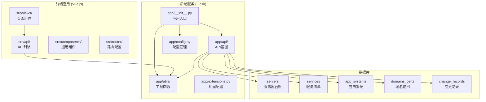
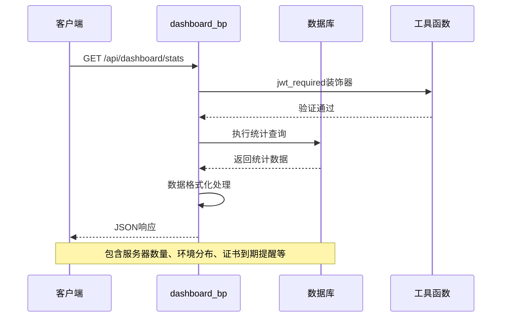
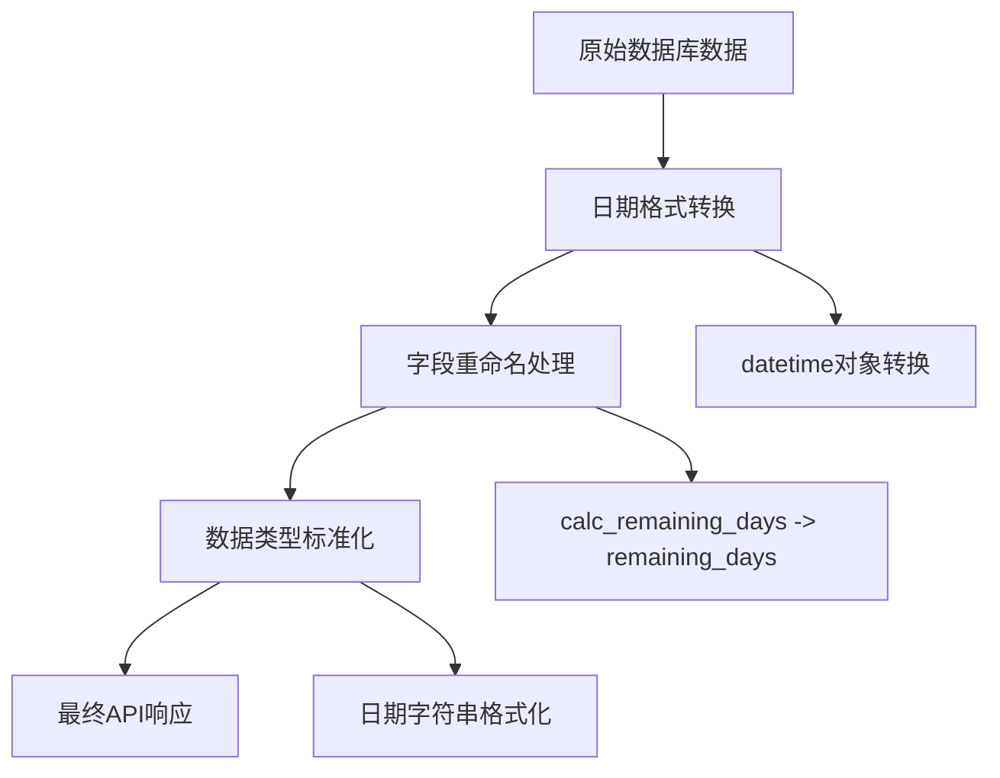
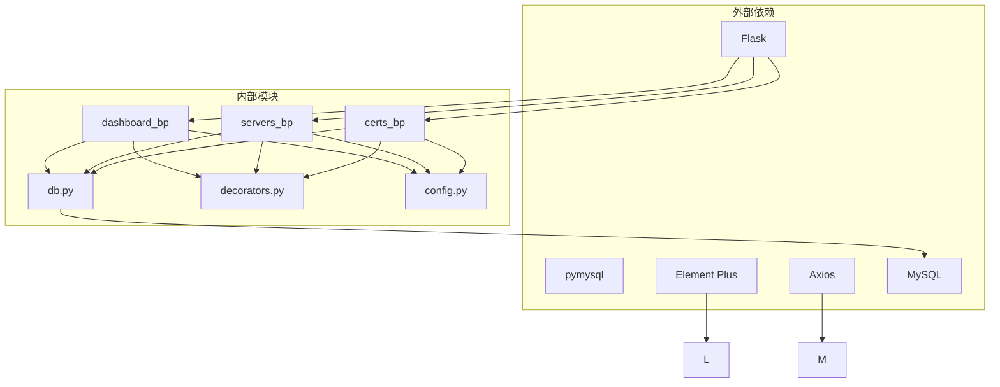
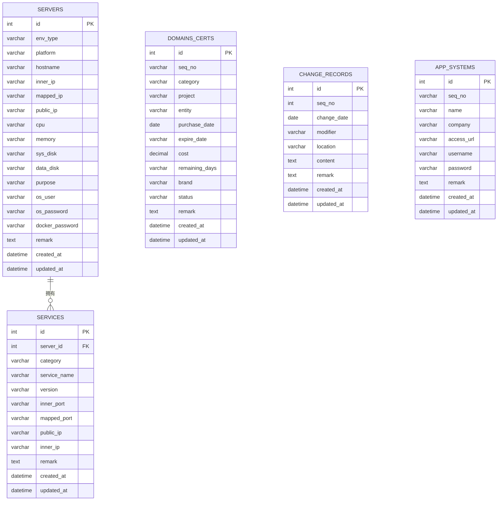

# 仪表板统计蓝图

<cite>
**本文档引用的文件**
- [backend/app/api/dashboard.py](file://backend/app/api/dashboard.py)
- [backend/app/api/servers.py](file://backend/app/api/servers.py)
- [backend/app/api/certs.py](file://backend/app/api/certs.py)
- [backend/app/utils/db.py](file://backend/app/utils/db.py)
- [backend/app/utils/decorators.py](file://backend/app/utils/decorators.py)
- [backend/app/config.py](file://backend/app/config.py)
- [backend/app/__init__.py](file://backend/app/__init__.py)
- [backend/run.py](file://backend/run.py)
- [frontend/src/views/Dashboard.vue](file://frontend/src/views/Dashboard.vue)
- [frontend/src/api/dashboard.js](file://frontend/src/api/dashboard.js)
- [frontend/src/api/certs.js](file://frontend/src/api/certs.js)
- [frontend/src/api/request.js](file://frontend/src/api/request.js)
- [backend/init_db.py](file://backend/init_db.py)
</cite>

## 目录
1. [简介](#简介)
2. [项目结构](#项目结构)
3. [核心组件](#核心组件)
4. [架构概览](#架构概览)
5. [详细组件分析](#详细组件分析)
6. [依赖分析](#依赖分析)
7. [性能考虑](#性能考虑)
8. [故障排除指南](#故障排除指南)
9. [结论](#结论)

## 简介

仪表板统计蓝图是一个基于Flask和Vue.js构建的运维管理平台，专注于提供全面的系统统计和监控功能。该系统通过仪表板界面展示关键的运维指标，包括服务器数量统计、应用状态分布、证书到期统计等核心功能。

本项目采用前后端分离架构，后端使用Python Flask框架提供RESTful API服务，前端使用Vue.js和Element Plus构建响应式用户界面。系统集成了JWT认证、CORS跨域支持、数据库连接池管理等企业级特性。

## 项目结构

项目采用模块化设计，分为后端API服务和前端Web应用两个主要部分：

**图表来源**
- [backend/app/__init__.py:37-62](file://backend/app/__init__.py#L37-L62)
- [backend/app/api/dashboard.py:9](file://backend/app/api/dashboard.py#L9-L9)
- [backend/app/api/servers.py:8](file://backend/app/api/servers.py#L8-L8)

**章节来源**
- [backend/app/__init__.py:6-35](file://backend/app/__init__.py#L6-L35)
- [backend/app/config.py:4-21](file://backend/app/config.py#L4-L21)

## 核心组件

### 仪表板统计API

仪表板统计API是系统的核心组件，负责提供统一的统计数据接口。该组件实现了以下核心功能：

- **服务器数量统计**：统计各类服务器的数量信息
- **环境分布统计**：按环境类型分类统计服务器分布情况
- **证书到期提醒**：提供即将到期的证书列表
- **最近更新记录**：展示最新的系统变更记录

### 数据库连接管理

系统使用pymysql库管理数据库连接，提供了统一的连接获取和管理机制：

- **连接池配置**：支持自定义数据库连接参数
- **事务管理**：确保数据操作的原子性
- **异常处理**：提供完善的错误处理机制

### 权限认证系统

系统集成了JWT认证和角色权限控制：

- **JWT认证装饰器**：验证用户身份和权限
- **角色权限检查**：基于角色的访问控制
- **自动权限验证**：在API调用前自动执行权限检查

**章节来源**
- [backend/app/api/dashboard.py:20-91](file://backend/app/api/dashboard.py#L20-L91)
- [backend/app/utils/db.py:5-17](file://backend/app/utils/db.py#L5-L17)
- [backend/app/utils/decorators.py:9-95](file://backend/app/utils/decorators.py#L9-L95)

## 架构概览

系统采用分层架构设计，清晰分离了表现层、业务逻辑层和数据访问层：

```mermaid
graph TB
subgraph "表现层"
A[Dashboard.vue<br/>仪表板视图]
B[其他页面组件]
end
subgraph "API层"
C[dashboard_bp<br/>仪表板API]
D[servers_bp<br/>服务器API]
E[certs_bp<br/>证书API]
F[其他API蓝图]
end
subgraph "业务逻辑层"
G[jwt_required<br/>认证装饰器]
H[role_required<br/>权限装饰器]
I[数据库操作]
end
subgraph "数据访问层"
J[MySQL数据库]
K[表: servers]
L[表: services]
M[表: domains_certs]
N[表: change_records]
end
A --> C
A --> D
A --> E
C --> G
D --> G
E --> G
C --> I
D --> I
E --> I
I --> J
J --> K
J --> L
J --> M
J --> N
```

**图表来源**
- [frontend/src/views/Dashboard.vue:129-158](file://frontend/src/views/Dashboard.vue#L129-L158)
- [backend/app/api/dashboard.py:9](file://backend/app/api/dashboard.py#L9-L9)
- [backend/app/api/servers.py:8](file://backend/app/api/servers.py#L8-L8)
- [backend/app/api/certs.py:8](file://backend/app/api/certs.py#L8-L8)

## 详细组件分析

### 仪表板统计组件

仪表板统计组件是系统的核心功能模块，提供了完整的统计数据聚合和展示能力。

#### API接口设计

该组件提供了一个统一的统计接口，返回包含多种统计数据的对象：

**图表来源**
- [frontend/src/api/dashboard.js:3-5](file://frontend/src/api/dashboard.js#L3-L5)
- [backend/app/api/dashboard.py:20-91](file://backend/app/api/dashboard.py#L20-L91)

#### 数据统计逻辑

系统实现了多维度的数据统计功能：

1. **基础数量统计**：统计服务器、服务、应用系统、证书、变更记录的数量
2. **环境分布分析**：按环境类型统计服务器分布情况
3. **证书到期监控**：动态计算剩余天数并排序显示
4. **最新记录追踪**：展示最近的系统变更记录

#### 数据格式化处理

系统对返回的数据进行了标准化处理：

**图表来源**
- [backend/app/api/dashboard.py:12-17](file://backend/app/api/dashboard.py#L12-L17)
- [backend/app/api/dashboard.py:65-71](file://backend/app/api/dashboard.py#L65-L71)

**章节来源**
- [backend/app/api/dashboard.py:20-91](file://backend/app/api/dashboard.py#L20-L91)

### 服务器管理组件

服务器管理组件提供了完整的服务器生命周期管理功能：

#### 查询功能

支持多条件查询和分页功能：
- 环境类型过滤
- 多字段搜索（主机名、内网IP、平台）
- 分页参数控制（页码、每页数量）

#### CRUD操作

提供标准的增删改查操作：
- 创建服务器记录
- 更新服务器信息
- 删除服务器记录
- 获取服务器详情

**章节来源**
- [backend/app/api/servers.py:11-232](file://backend/app/api/servers.py#L11-L232)

### 证书管理组件

证书管理组件专门处理域名证书的全生命周期管理：

#### 查询功能

支持按类别和关键词搜索：
- 类别过滤（公众平台、域名、SSL证书）
- 项目/实体名称搜索

#### 数据模型

证书数据包含以下关键字段：
- 证书基本信息（项目、主体、类别）
- 时间信息（购买日期、到期日期）
- 财务信息（费用、剩余天数）
- 技术信息（品牌、状态、备注）

**章节来源**
- [backend/app/api/certs.py:11-145](file://backend/app/api/certs.py#L11-L145)

### 前端集成组件

前端组件提供了直观的可视化界面：

#### 仪表板视图

包含多个统计卡片和表格：
- 服务器、服务、应用系统、证书、记录数量统计
- 环境分布表格（带进度条显示占比）
- 证书到期提醒表格（按剩余天数着色）
- 最近更新记录表格

#### 数据绑定

使用Vue.js的响应式数据绑定：
- 自动加载统计数据
- 实时更新界面显示
- 用户交互反馈

**章节来源**
- [frontend/src/views/Dashboard.vue:1-312](file://frontend/src/views/Dashboard.vue#L1-L312)

## 依赖分析

系统依赖关系清晰，各组件职责明确：

**图表来源**
- [backend/app/utils/db.py:1-17](file://backend/app/utils/db.py#L1-L17)
- [backend/app/utils/decorators.py:1-95](file://backend/app/utils/decorators.py#L1-L95)
- [backend/app/config.py:1-21](file://backend/app/config.py#L1-L21)

### 数据库表结构

系统使用以下核心数据表：

**图表来源**
- [backend/init_db.py:50-95](file://backend/init_db.py#L50-L95)
- [backend/init_db.py:146-180](file://backend/init_db.py#L146-L180)

**章节来源**
- [backend/init_db.py:41-180](file://backend/init_db.py#L41-L180)

## 性能考虑

### 缓存策略

系统目前采用以下缓存策略：

1. **数据库连接池**：使用pymysql的连接池机制
2. **API响应缓存**：可考虑在应用层添加响应缓存
3. **前端数据缓存**：Vue.js组件级别的数据缓存

### 性能优化建议

1. **数据库索引优化**：为常用查询字段建立索引
2. **查询语句优化**：使用LIMIT限制结果集大小
3. **并发处理**：使用异步处理大量统计数据
4. **CDN加速**：静态资源使用CDN分发

### 监控指标

建议添加以下监控指标：
- API响应时间
- 数据库查询性能
- 内存使用情况
- 并发连接数

## 故障排除指南

### 常见问题及解决方案

#### 认证失败

**问题症状**：返回401状态码
**可能原因**：
- 缺少Authorization头
- Token格式不正确
- Token已过期

**解决方法**：
1. 确保请求头包含正确的Bearer token
2. 检查token的有效性和过期时间
3. 重新登录获取新的token

#### 数据库连接问题

**问题症状**：数据库操作失败
**可能原因**：
- 数据库连接参数错误
- 数据库服务不可用
- 权限不足

**解决方法**：
1. 检查数据库配置参数
2. 验证数据库服务状态
3. 确认数据库用户权限

#### API响应异常

**问题症状**：API返回非预期格式
**可能原因**：
- 数据库查询异常
- 数据格式化错误
- 业务逻辑异常

**解决方法**：
1. 检查数据库查询语句
2. 验证数据格式化逻辑
3. 查看后端日志信息

**章节来源**
- [backend/app/utils/decorators.py:20-56](file://backend/app/utils/decorators.py#L20-L56)
- [backend/app/utils/db.py:5-17](file://backend/app/utils/db.py#L5-L17)
- [frontend/src/api/request.js:25-51](file://frontend/src/api/request.js#L25-L51)

## 结论

仪表板统计蓝图是一个功能完整、架构清晰的运维管理平台。系统通过统一的API接口提供了全面的统计数据展示，包括服务器数量统计、环境分布分析、证书到期监控等功能。

### 主要优势

1. **模块化设计**：清晰的组件分离和职责划分
2. **安全性**：完善的JWT认证和权限控制机制
3. **可扩展性**：基于蓝图的API架构便于功能扩展
4. **用户体验**：直观的前端界面和响应式设计

### 发展方向

1. **性能优化**：添加缓存机制和数据库优化
2. **监控增强**：集成更全面的系统监控功能
3. **告警机制**：实现自动化的异常告警通知
4. **移动端支持**：开发移动端应用版本

该系统为运维管理工作提供了强有力的技术支撑，能够有效提升运维效率和管理水平。